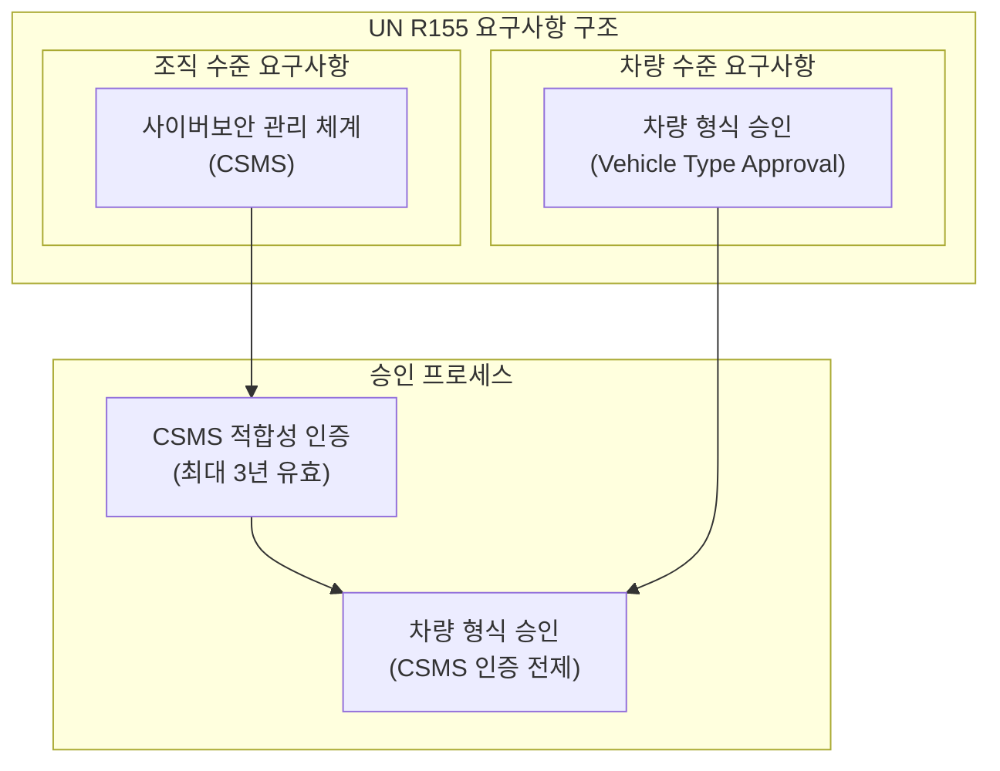
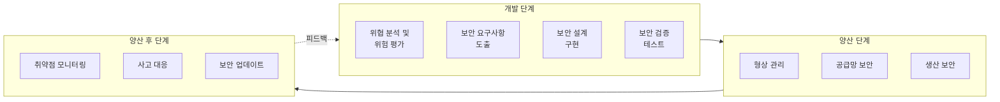
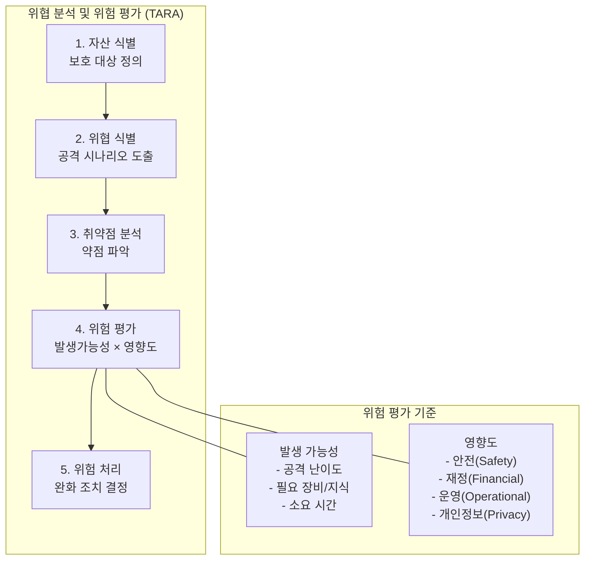
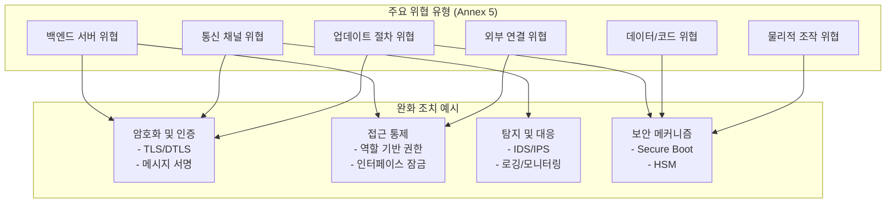
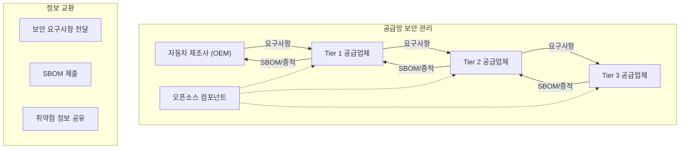
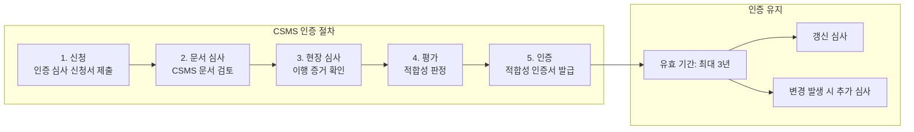

# Part 2: UNECE R155 법규 원문 해설 - 사이버보안 관리 체계

## 사이버보안 관리 체계(CSMS)의 구축과 운영

---

## 1. R155 법규의 구조와 핵심 개념

UN Regulation No. 155는 차량의 사이버보안과 사이버보안 관리 체계에 관한 통일된 조항을 규정하는 국제 법규이다. 이 규정은 크게 두 가지 층위의 요구사항을 포함하고 있는데, 첫째는 자동차 제조사가 조직 수준에서 구축해야 하는 사이버보안 관리 체계(Cybersecurity Management System, CSMS)에 관한 것이며, 둘째는 개별 차량 형식이 충족해야 하는 사이버보안 기술 요구사항에 관한 것이다.

R155의 핵심 철학은 차량의 사이버보안이 단순히 기술적 보안 조치의 나열이 아니라, 조직적 역량과 체계적 프로세스에 기반해야 한다는 것이다. 즉, 개별 차량에 아무리 정교한 보안 기술을 적용하더라도, 이를 개발하고 관리하는 조직의 프로세스가 체계적으로 구축되어 있지 않다면 지속 가능한 보안 수준을 유지할 수 없다는 인식에 기반하고 있다.

이러한 이중 구조는 R155의 승인 프로세스에도 반영되어 있다. 자동차 제조사는 먼저 CSMS에 대한 적합성 인증(CSMS Certificate of Compliance)을 획득해야 하며, 이후 해당 CSMS 하에서 개발된 개별 차량 형식에 대해 형식 승인(Type Approval)을 받아야 한다. CSMS 인증 없이는 차량 형식 승인을 받을 수 없으며, 이는 조직적 역량 확보가 차량 보안의 전제 조건임을 법규적으로 강제하는 것이다.

---

## 2. 사이버보안 관리 체계(CSMS)의 정의와 요구사항

### 2.1 CSMS의 법규적 정의

R155는 사이버보안 관리 체계(CSMS)를 "차량의 사이버 위협에 대한 보안과 차량 사이버 공격에 대한 보호를 보장하기 위해, 차량과 관련된 위험을 관리하고 차량을 사이버 공격으로부터 보호하기 위한 조직적 프로세스, 책임 및 거버넌스를 확립하는 체계적 위험 기반 접근 방식"으로 정의한다.

이 정의에서 주목해야 할 핵심 요소는 다음과 같다. 첫째, CSMS는 기술적 도구나 솔루션이 아닌 "조직적 프로세스, 책임 및 거버넌스"를 다룬다. 둘째, 이는 "체계적 위험 기반 접근 방식"에 따라 운영되어야 한다. 셋째, CSMS의 목적은 차량의 "전 수명주기"에 걸쳐 사이버보안을 관리하는 것이다.

### 2.2 CSMS가 다루어야 하는 프로세스 영역

R155는 CSMS가 반드시 포함해야 하는 프로세스 영역을 상세히 규정하고 있다. 이러한 프로세스는 차량의 개발 단계에서부터 양산, 양산 후 운영에 이르는 전 과정을 포괄하며, 각 영역에서 수행해야 할 활동과 그 결과물을 명시하고 있다.

**개발 단계 프로세스**에서 CSMS는 차량 형식에 대한 사이버보안 위험을 식별, 분류 및 처리하기 위한 프로세스를 포함해야 한다. 이 과정에서 제조사는 잠재적 사이버 위협과 취약점을 체계적으로 분석하고, 이에 대응하기 위한 보안 조치를 설계에 반영해야 한다. 또한 식별된 위험이 적절히 관리되고 있음을 검증하기 위한 테스트 절차가 마련되어야 한다.

**양산 단계 프로세스**에서는 개발된 보안 조치가 실제 생산되는 차량에 올바르게 구현되는지를 보장하기 위한 절차가 필요하다. 이는 소프트웨어 형상 관리, 보안 관련 부품의 취급 및 보관, 그리고 생산 라인에서의 보안 설정 적용 등을 포함한다.

**양산 후 프로세스**는 R155에서 특히 강조되는 영역으로서, 차량이 출고된 이후에도 지속적으로 사이버보안을 관리하기 위한 활동을 규정한다. 이는 새로운 취약점의 모니터링, 보안 사고의 탐지 및 대응, 그리고 필요시 보안 업데이트의 배포를 포함한다.

---

## 3. 위협 분석 및 위험 평가(TARA)

### 3.1 TARA의 개념과 중요성

위협 분석 및 위험 평가(Threat Analysis and Risk Assessment, TARA)는 R155의 핵심 요구사항 중 하나로서, 차량의 사이버보안 위험을 체계적으로 식별하고 평가하는 프로세스이다. TARA는 단순히 가능한 공격 시나리오를 나열하는 것이 아니라, 각 위협의 실현 가능성과 잠재적 영향을 정량적 또는 정성적으로 평가하여 위험 수준을 결정하고, 이에 상응하는 보안 대책을 수립하는 체계적인 방법론이다.

R155는 제조사가 차량 형식에 대해 포괄적이고 최신 상태로 유지되는 위험 평가를 수행하도록 요구한다. 이 평가는 차량의 자산(Asset), 위협(Threat), 취약점(Vulnerability), 그리고 공격 경로(Attack Path)를 식별하고, 각 위험에 대해 적절한 완화 조치를 결정하는 과정을 포함한다.

### 3.2 TARA 수행 절차

TARA의 수행은 일반적으로 다음과 같은 단계로 이루어진다. 먼저 **자산 식별** 단계에서는 보호해야 할 대상을 정의한다. 차량의 맥락에서 자산은 ECU, 센서, 통신 인터페이스와 같은 물리적 구성요소뿐 아니라, 소프트웨어, 데이터, 그리고 차량의 기능 자체를 포함한다.

**위협 식별** 단계에서는 각 자산에 대해 발생할 수 있는 잠재적 위협을 분석한다. 이때 공격자의 동기, 능력, 그리고 가용한 공격 벡터를 고려하여 현실적인 위협 시나리오를 도출한다. R155의 Annex 5는 차량에 적용되는 대표적인 위협 유형과 그에 대응하는 완화 조치의 예시를 제공하고 있어, TARA 수행 시 참고 자료로 활용된다.

**취약점 분석** 단계에서는 식별된 위협이 실제로 실현될 수 있는 약점을 분석한다. 이는 소프트웨어의 코딩 결함, 프로토콜의 설계 약점, 또는 물리적 접근 통제의 부재 등 다양한 형태로 존재할 수 있다.

**위험 평가** 단계에서는 위협의 발생 가능성(Likelihood)과 발생 시 영향(Impact)을 평가하여 전체적인 위험 수준을 결정한다. 발생 가능성은 공격의 기술적 난이도, 필요한 장비 및 지식, 그리고 공격에 소요되는 시간 등을 고려하여 평가된다. 영향은 안전(Safety), 재정(Financial), 운영(Operational), 그리고 개인정보(Privacy) 등 다양한 차원에서 평가될 수 있다.

마지막으로 **위험 처리** 단계에서는 평가된 위험 수준에 따라 적절한 대응 방안을 결정한다. 위험 처리 방안에는 위험 회피(Avoidance), 위험 완화(Mitigation), 위험 전가(Transfer), 그리고 위험 수용(Acceptance)이 포함되며, 차량 사이버보안에서는 대부분 위험 완화 방안이 적용된다.

### 3.3 위험 관리의 지속성

R155는 TARA가 일회성 활동이 아닌 지속적인 프로세스로 운영되어야 함을 강조한다. 차량이 출고된 이후에도 새로운 취약점이 발견되거나, 공격 기법이 진화하거나, 차량의 소프트웨어가 업데이트되는 등의 변화가 발생할 수 있다. 따라서 제조사는 이러한 변화를 주기적으로 모니터링하고, 필요시 위험 평가를 갱신하며, 추가적인 보안 조치를 적용할 수 있는 체계를 갖추어야 한다.

---

## 4. Annex 5: 위협 및 완화 조치 목록

### 4.1 Annex 5의 구성과 활용

R155의 Annex 5는 "차량 및 그 기능에 대한 위협과 그에 대응하는 완화 조치 목록"을 제공한다. 이 부속서는 제조사가 TARA를 수행하고 보안 조치를 설계할 때 참고해야 하는 핵심 문서로서, 법규가 우려하는 주요 위협 유형과 이에 대응하기 위해 적용되어야 하는 완화 조치의 예시를 체계적으로 정리하고 있다.

Annex 5는 위협을 크게 백엔드 서버 관련 위협, 통신 채널 관련 위협, 업데이트 절차 관련 위협, 의도하지 않은 인적 행위로 인한 위협, 외부 연결 및 커넥션 관련 위협, 차량 데이터/코드 관련 위협, 그리고 물리적 조작에 대한 취약점 등으로 분류하고 있다.

### 4.2 주요 위협 유형과 완화 조치

**백엔드 서버 관련 위협**에서 규정은 차량과 연결된 백엔드 서버가 공격당하거나, 서버를 통해 차량에 악의적 명령이 전달되는 시나리오를 우려한다. 이에 대한 완화 조치로는 서버의 강화(Hardening), 접근 통제, 침입 탐지 시스템의 적용, 그리고 서버와 차량 간 통신의 암호화 및 인증이 제시된다.

**통신 채널 관련 위협**은 차량의 외부 및 내부 통신이 도청, 변조, 또는 방해받는 경우를 다룬다. 무선 인터페이스(Wi-Fi, Bluetooth, 셀룰러 등)와 유선 버스 시스템(CAN, Ethernet 등) 모두가 대상이 된다. 완화 조치로는 통신 암호화, 메시지 인증, 그리고 비정상 통신의 탐지 기능이 요구된다.

**업데이트 절차 관련 위협**은 소프트웨어 업데이트 과정에서 악성 소프트웨어가 주입되거나, 업데이트가 변조되는 시나리오를 다룬다. 완화 조치로는 업데이트 패키지의 서명 및 검증, 보안 부팅 메커니즘, 그리고 업데이트 실패 시 안전 상태로 복귀하는 절차가 제시된다.

**외부 연결 관련 위협**은 진단 포트(OBD-II), USB, 무선 통신 등 외부 인터페이스를 통한 공격을 우려한다. 완화 조치로는 인터페이스별 접근 통제, 입력 검증, 그리고 권한 분리가 요구된다.

---

## 5. 공급망 사이버보안 관리

### 5.1 공급망 보안의 중요성

현대 자동차는 수백 개의 공급업체로부터 조달된 부품과 소프트웨어로 구성되어 있다. ECU, 센서, 액추에이터 등의 하드웨어뿐 아니라, 이를 구동하는 소프트웨어와 통신 프로토콜까지 많은 부분이 외부 공급업체에 의해 개발되고 납품된다. 이러한 상황에서 차량의 사이버보안은 자동차 제조사(OEM)만의 역량으로는 보장될 수 없으며, 전체 공급망에 걸친 협력적 보안 관리가 필수적이다.

R155는 제조사의 CSMS가 공급망 전반에 걸친 사이버보안 관리 프로세스를 포함해야 함을 명시하고 있다. 제조사는 하위 공급업체에 대해 사이버보안 요구사항을 전달하고, 이의 이행 여부를 확인하며, 공급망에서 발생할 수 있는 사이버보안 위험을 식별하고 관리해야 한다.

### 5.2 공급망 보안 관리 프로세스

공급망 사이버보안 관리의 첫 번째 단계는 **사이버보안 요구사항의 정의 및 전달**이다. 제조사는 차량의 TARA 결과를 바탕으로 각 부품 또는 시스템에 대한 사이버보안 요구사항을 도출하고, 이를 공급업체에 명확하게 전달해야 한다. 이 요구사항에는 보안 기능적 요구사항뿐 아니라, 개발 프로세스에 관한 요구사항(예: 보안 코딩 표준 준수, 취약점 테스트 수행)도 포함될 수 있다.

두 번째 단계는 **공급업체 역량 평가**이다. 제조사는 공급업체가 전달된 사이버보안 요구사항을 충족할 수 있는 기술적 역량과 프로세스를 갖추고 있는지 평가해야 한다. 이는 공급업체 선정 시점뿐 아니라 계약 기간 중에도 정기적으로 수행되어야 한다.

세 번째 단계는 **사이버보안 정보의 교환 및 문서화**이다. 공급업체는 제조사에게 납품하는 부품 또는 소프트웨어의 사이버보안 관련 정보를 제공해야 한다. 여기에는 잔존 위험(Residual Risk), 알려진 취약점, 보안 설정 권고사항, 그리고 향후 지원 계획 등이 포함된다.

### 5.3 SBOM(Software Bill of Materials)

소프트웨어 자재 명세서(Software Bill of Materials, SBOM)는 공급망 보안 관리에서 점점 중요성이 증가하고 있는 요소이다. SBOM은 소프트웨어에 포함된 모든 구성요소(예: 라이브러리, 프레임워크, 오픈소스 컴포넌트)의 목록과 그 버전 정보를 체계적으로 기록한 문서이다.

SBOM의 가치는 특정 구성요소에서 취약점이 발견되었을 때 드러난다. SBOM이 없다면 제조사는 해당 취약점이 자사 차량에 영향을 미치는지 파악하기 위해 수많은 ECU와 소프트웨어를 수동으로 검토해야 한다. 그러나 체계적으로 관리되는 SBOM이 있다면, 취약한 구성요소를 사용하는 시스템을 신속하게 식별하고 대응 조치를 취할 수 있다.

---

## 6. 사이버 공격 탐지, 대응 및 복구

### 6.1 양산 후 모니터링의 필요성

R155는 제조사가 차량의 전 수명주기에 걸쳐 사이버보안을 관리해야 함을 요구하며, 이는 차량 출고 이후에도 지속적인 모니터링과 대응 체계를 운영해야 함을 의미한다. 사이버보안 위협은 시간이 지남에 따라 진화하며, 개발 당시에는 알려지지 않았던 새로운 취약점이 발견될 수 있다. 따라서 제조사는 이러한 변화를 추적하고 필요시 대응 조치를 취할 수 있는 능력을 갖추어야 한다.

### 6.2 모니터링 활동

제조사의 모니터링 활동은 여러 가지 정보원(Source)을 포괄해야 한다. 먼저, **공개 취약점 데이터베이스**인 CVE(Common Vulnerabilities and Exposures), NVD(National Vulnerability Database) 등을 정기적으로 모니터링하여 차량에 사용된 소프트웨어 구성요소에 영향을 미치는 새로운 취약점을 파악해야 한다.

둘째, **보안 연구 커뮤니티와의 협력**을 통해 차량 관련 취약점 정보를 수집해야 한다. 많은 제조사들이 취약점 보고 창구(Vulnerability Disclosure Program)를 운영하여 외부 연구자들이 발견한 취약점을 보고받고 있다.

셋째, **차량 운영 데이터의 분석**을 통해 사이버 공격의 징후를 탐지해야 한다. 이는 차량 내 침입 탐지 시스템(Intrusion Detection System, IDS)의 로그, 텔레매틱스 시스템의 이상 행위 감지, 그리고 고객 보고 등 다양한 형태로 수집될 수 있다.

### 6.3 사고 대응 절차

제조사는 사이버보안 사고가 발생하거나 발생이 의심될 경우 이를 처리하기 위한 명확한 절차를 수립해야 한다. 사고 대응 절차는 일반적으로 탐지(Detection), 분석(Analysis), 봉쇄(Containment), 근절(Eradication), 복구(Recovery), 그리고 사후 검토(Post-incident Review)의 단계로 구성된다.

**탐지 단계**에서는 비정상적인 행위나 공격의 징후를 식별한다. **분석 단계**에서는 탐지된 이벤트의 심각성과 영향 범위를 평가한다. **봉쇄 단계**에서는 공격의 확산을 방지하기 위한 즉각적인 조치를 취한다. **근절 단계**에서는 공격의 원인을 제거하고, **복구 단계**에서는 시스템을 정상 상태로 회복시킨다. 마지막으로 **사후 검토 단계**에서는 사고의 원인과 대응 과정을 분석하여 향후 개선 사항을 도출한다.

R155는 또한 인증 당국에 사이버 공격 및 취약점에 관한 데이터를 제공할 수 있도록 요구하고 있어, 제조사는 보안 사고에 관한 기록을 체계적으로 관리해야 한다.

---

## 7. CSMS 인증 프로세스

### 7.1 인증 심사 절차

CSMS 적합성 인증을 받기 위해 제조사는 승인 당국 또는 지정된 기술 서비스 기관에 심사를 신청해야 한다. 심사는 제조사의 CSMS가 R155의 요구사항을 충족하는지 평가하는 과정으로, 문서 심사와 현장 심사로 구성된다.

**문서 심사**에서는 제조사가 제출한 CSMS 관련 문서가 법규 요구사항을 반영하고 있는지 검토한다. 여기에는 사이버보안 정책, 프로세스 정의서, 역할 및 책임 문서, TARA 방법론, 공급망 관리 절차, 사고 대응 계획 등이 포함된다.

**현장 심사**에서는 문서화된 프로세스가 실제로 조직에서 이행되고 있는지 확인한다. 심사원은 관련 담당자와 면담하고, 실제 프로젝트의 사례를 검토하며, 프로세스 이행의 증거를 수집한다.

### 7.2 인증서의 유효 기간 및 갱신

CSMS 적합성 인증서는 최대 3년간 유효하다. 이 기간이 만료되면 제조사는 갱신 심사를 받아 인증을 연장해야 한다. 또한 인증 기간 중에도 CSMS에 중대한 변경이 발생하거나, 보안 사고가 발생하여 CSMS의 적합성에 의문이 제기되는 경우 추가 심사가 요구될 수 있다.

제조사는 CSMS 인증이 유효하게 유지되도록 지속적으로 프로세스를 운영하고 개선해야 하며, 인증이 만료되거나 취소될 경우 해당 CSMS 하에서 개발된 차량에 대한 형식 승인도 영향을 받을 수 있다.

---

## 8. ISO/SAE 21434와의 관계

### 8.1 법규와 표준의 상호 보완성

R155는 법적 구속력을 갖는 규정으로서 무엇을(What) 달성해야 하는지를 규정하지만, 어떻게(How) 달성해야 하는지에 대해서는 상세한 방법론을 제시하지 않는다. 이 간극을 메우는 것이 ISO/SAE 21434 표준의 역할이다.

ISO/SAE 21434는 차량 사이버보안 엔지니어링에 관한 국제 표준으로서, R155의 요구사항을 충족하기 위해 조직이 수행해야 할 구체적인 활동, 방법론, 그리고 작업 산출물을 정의한다. 따라서 R155 준수를 위해 노력하는 조직들은 대부분 ISO/SAE 21434를 구현 프레임워크로 활용하고 있다.

### 8.2 주요 매핑 영역

ISO/SAE 21434는 R155의 주요 요구사항과 다음과 같이 매핑된다. R155가 요구하는 **CSMS 구축**은 ISO/SAE 21434의 5절(Organizational cybersecurity management)과 6절(Project dependent cybersecurity management)에서 상세화된다. R155가 요구하는 **위험 평가**는 ISO/SAE 21434의 8절(Continual cybersecurity activities)과 15절(Threat analysis and risk assessment methods)에서 구체적인 방법론을 제공한다. R155가 요구하는 **양산 후 관리**는 ISO/SAE 21434의 12절(Operations and maintenance)에서 다루어진다.

이러한 관계 덕분에 많은 인증 기관과 제조사들은 ISO/SAE 21434 적합성을 R155 CSMS 인증의 기술적 근거로 활용하고 있다. 그러나 ISO/SAE 21434 인증이 자동으로 R155 적합성을 보장하는 것은 아니며, 법규 요구사항에 대한 별도의 적합성 평가가 필요하다.

---

## 참고문헌

1. UNECE. (2021). UN Regulation No. 155 - Cyber security and cyber security management system. Geneva: United Nations.
2. ISO/SAE. (2021). ISO/SAE 21434:2021 - Road vehicles — Cybersecurity engineering. Geneva: International Organization for Standardization.
3. UNECE. (2020). Interpretation document of UN R155. Geneva: United Nations.

---

*이전 편: [Part 1: 서론 및 배경](./01_introduction.md)*

*다음 편: [Part 3: UNECE R155 법규 원문 해설 - 차량 형식 승인](./03_r155_type_approval.md)*
