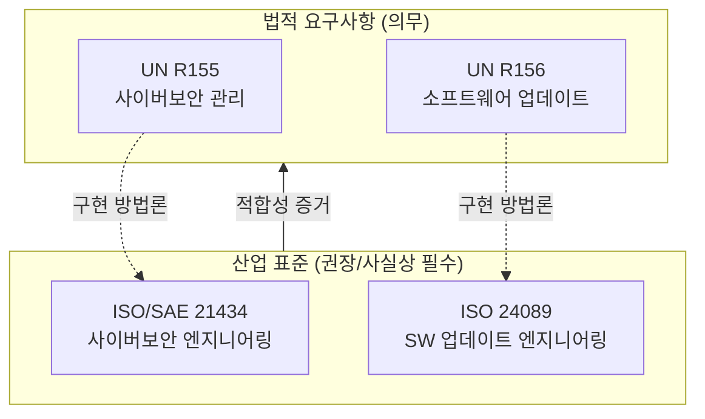
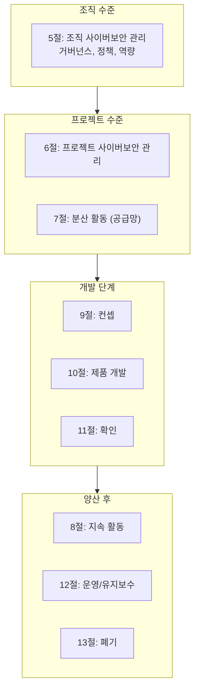
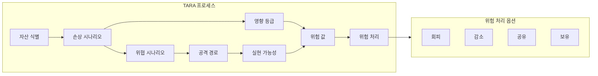
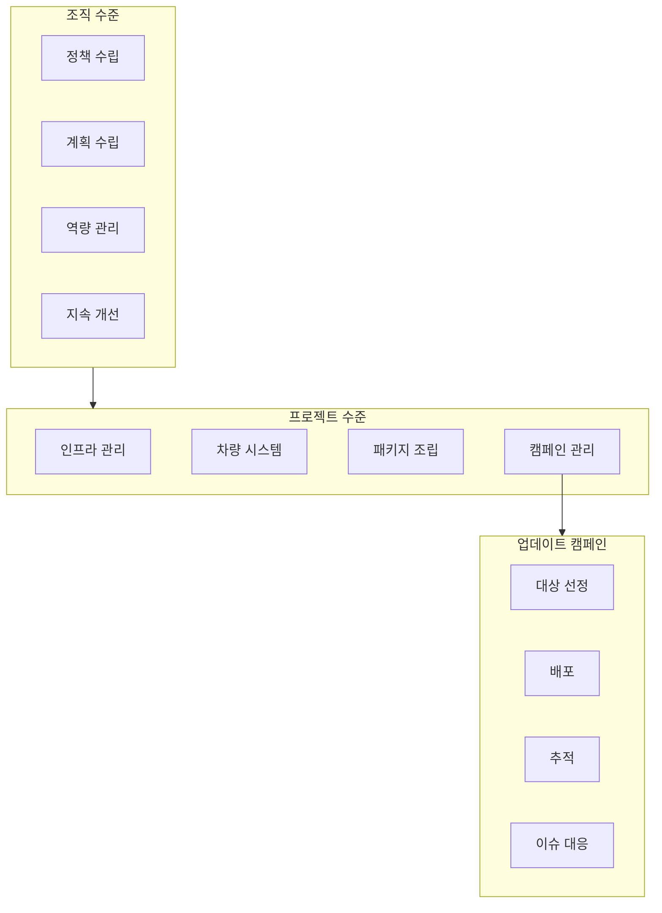
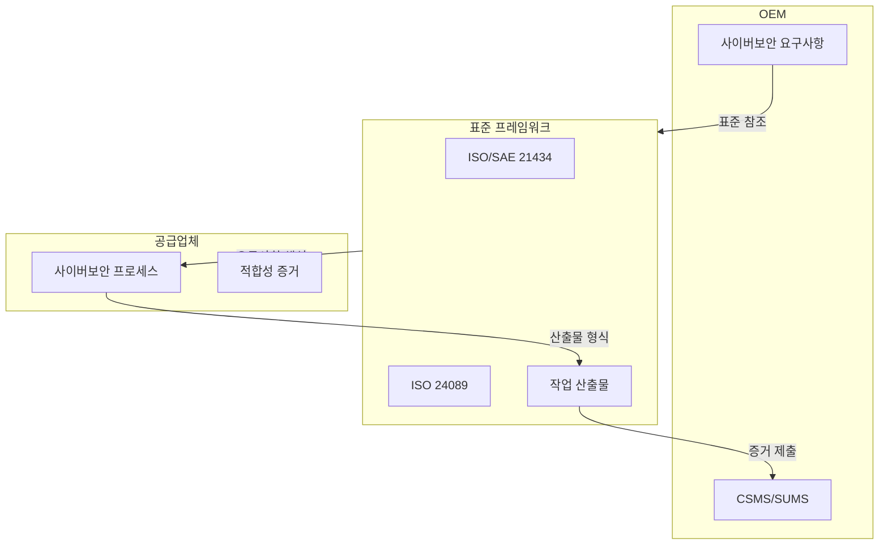

# Part 5: 관련 국제 표준 - ISO/SAE 21434 및 ISO 24089

## 법규 준수를 위한 산업 표준의 역할과 요구사항

---

## 1. 법규와 표준의 관계

### 1.1 법규와 표준의 역할 구분

UNECE R155와 R156은 법적 구속력을 갖는 국제 규정으로서, 차량이 충족해야 하는 사이버보안 및 소프트웨어 업데이트 관련 요구사항을 규정한다. 그러나 이러한 법규는 "무엇을(What)" 달성해야 하는지를 명시하는 반면, "어떻게(How)" 달성해야 하는지에 대해서는 상세한 방법론을 제시하지 않는다.

이러한 간극을 메우는 것이 국제 표준의 역할이다. ISO/SAE 21434와 ISO 24089는 각각 R155와 R156의 요구사항을 충족하기 위한 구체적인 프로세스, 방법론, 그리고 작업 산출물을 정의한다. 제조사들은 이러한 표준을 참조하여 법규 준수를 위한 프로세스를 설계하고 구현할 수 있다.

이 관계를 비유하자면, 법규가 목적지(Destination)를 지정한다면 표준은 그 목적지에 도달하기 위한 지도(Map)를 제공하는 것이라 할 수 있다. 법규는 의무적으로 준수해야 하는 법적 요구사항이며, 표준은 그 요구사항을 충족하기 위한 권장 방법론이다.

### 1.2 표준 준수의 의미

ISO/SAE 21434나 ISO 24089를 "준수(Conformance)"한다는 것은 해당 표준에서 정의한 프로세스, 활동, 그리고 작업 산출물 요구사항을 충족함을 의미한다. 표준 준수는 그 자체로 법적 의무는 아니지만, 법규 적합성을 입증하기 위한 효과적인 수단이 된다.

많은 인증 기관과 승인 당국에서 ISO/SAE 21434 및 ISO 24089 준수를 R155/R156 적합성 평가의 기술적 근거로 활용하고 있다. 따라서 이러한 표준을 따르는 것은 법규 준수를 위한 사실상의 선행 조건이 되고 있다.

---

## 2. ISO/SAE 21434: 차량 사이버보안 엔지니어링

### 2.1 표준의 개요와 목적

ISO/SAE 21434 "Road vehicles — Cybersecurity engineering"은 2021년 8월에 ISO와 SAE International의 공동 작업으로 발행된 국제 표준이다. 이 표준은 도로 차량의 전기/전자(E/E) 시스템에 대한 사이버보안 위험 관리를 위한 엔지니어링 요구사항을 규정한다.

표준의 핵심 목적은 차량 개발 조직이 사이버보안을 체계적으로 관리할 수 있는 프레임워크를 제공하는 것이다. 이는 컨셉 단계부터 개발, 생산, 운영, 유지보수, 그리고 폐기에 이르는 제품의 전 수명주기에 걸쳐 사이버보안 활동을 정의한다.

ISO/SAE 21434는 "Security by Design" 원칙을 구현하기 위한 구체적인 방법론을 제공하며, 이를 통해 개발 초기 단계부터 보안을 고려함으로써 후반부에 발생하는 보안 문제를 최소화하고자 한다.

### 2.2 표준의 구조

ISO/SAE 21434는 다음과 같은 주요 절(Section)로 구성되어 있다.

**5절: 조직 사이버보안 관리(Organizational Cybersecurity Management)**는 조직 전체 수준에서 사이버보안을 관리하기 위한 요구사항을 정의한다. 여기에는 사이버보안 거버넌스, 정책, 역할 및 책임, 역량 관리, 그리고 지속적 개선 활동이 포함된다.

**6절: 프로젝트 의존적 사이버보안 관리(Project Dependent Cybersecurity Management)**는 개별 차량 개발 프로젝트 수준에서의 사이버보안 관리 활동을 다룬다. 사이버보안 계획, 사이버보안 평가, 그리고 프로젝트 종료 시 사이버보안 요구사항의 충족 여부 확인 등이 포함된다.

**7절: 분산 사이버보안 활동(Distributed Cybersecurity Activities)**은 공급망 내에서의 사이버보안 책임 분배와 정보 교환에 관한 요구사항을 정의한다. OEM과 공급업체 간의 사이버보안 인터페이스 계약(Cybersecurity Interface Agreement)이 핵심 개념이다.

**8절: 지속적 사이버보안 활동(Continual Cybersecurity Activities)**은 제품 출시 후에도 지속되는 사이버보안 활동을 다룬다. 취약점 모니터링, 취약점 분석, 취약점 관리, 그리고 사이버보안 사건 대응이 포함된다.

**9절: 컨셉 단계(Concept Phase)**에서는 제품 개발 초기 단계에서의 사이버보안 활동을 정의한다. 아이템 정의, 사이버보안 목표(Cybersecurity Goals) 도출, 그리고 사이버보안 컨셉 개발이 핵심 활동이다.

**10절: 제품 개발 단계(Product Development Phase)**는 실제 제품 설계 및 구현 단계에서의 사이버보안 활동을 다룬다. 사이버보안 사양 도출, 보안 설계, 보안 구현, 그리고 검증/확인 활동이 포함된다.

**11절: 사이버보안 확인(Cybersecurity Validation)**은 개발된 제품이 사이버보안 목표를 달성했는지 확인하는 활동을 정의한다.

**12절: 운영 및 유지보수(Operations and Maintenance)**는 양산 이후 단계에서의 사이버보안 활동을 다룬다.

**13절: 폐기(Decommissioning)**는 제품 수명 종료 시의 사이버보안 고려사항을 정의한다.

**15절: 위협 분석 및 위험 평가 방법(Threat Analysis and Risk Assessment Methods)**은 TARA 수행을 위한 구체적인 방법론을 제공한다.

### 2.3 위협 분석 및 위험 평가(TARA)

ISO/SAE 21434에서 TARA는 사이버보안 요구사항을 도출하기 위한 핵심 방법론으로 자리매김하고 있다. 표준의 15절에서는 TARA 수행을 위한 상세한 방법과 절차를 제시한다.

**자산 식별(Asset Identification)**에서는 보호 대상이 되는 자산을 식별한다. 자산은 기능(Function), 데이터(Data), 또는 기타 가치 있는 대상으로 정의될 수 있다. 자산에 대한 손상 시나리오(Damage Scenario)가 도출되며, 이는 자산이 침해될 경우 발생할 수 있는 부정적 결과를 기술한다.

**위협 시나리오 분석(Threat Scenario Analysis)**에서는 자산에 대한 위협을 식별한다. 위협 시나리오는 공격자가 자산을 침해하기 위해 취할 수 있는 행동을 기술한다. STRIDE(Spoofing, Tampering, Repudiation, Information Disclosure, Denial of Service, Elevation of Privilege) 모델과 같은 위협 분류 체계가 활용될 수 있다.

**영향 등급 평가(Impact Rating)**에서는 손상 시나리오가 실현될 경우의 영향 심각도를 평가한다. ISO/SAE 21434는 안전(Safety), 재정(Financial), 운영(Operational), 개인정보(Privacy) 네 가지 영향 범주를 정의하며, 각 범주에 대해 심각(Severe), 주요(Major), 보통(Moderate), 무시(Negligible)의 4단계 척도가 적용된다.

**공격 경로 분석(Attack Path Analysis)**에서는 위협 시나리오가 어떻게 실현될 수 있는지를 분석한다. 공격 경로는 공격자가 취하는 일련의 행동으로 구성되며, 각 단계의 기술적 세부 사항이 분석된다.

**공격 실현 가능성 평가(Attack Feasibility Rating)**에서는 공격 경로가 실제로 실현될 수 있는 가능성을 평가한다. 평가 요소에는 경과 시간(Elapsed Time), 전문 지식(Specialist Expertise), 아이템에 대한 지식(Knowledge of the Item), 기회의 창(Window of Opportunity), 그리고 장비(Equipment)가 포함된다.

**위험 값 결정(Risk Value Determination)**에서는 영향 등급과 공격 실현 가능성을 조합하여 전체적인 위험 값을 결정한다. 위험 값에 따라 위험 처리 결정(Risk Treatment Decision)이 이루어지며, 위험 회피, 위험 감소, 위험 공유, 또는 위험 보유 중 적절한 옵션이 선택된다.

### 2.4 사이버보안 보증 수준(CAL)

ISO/SAE 21434는 사이버보안 보증 수준(Cybersecurity Assurance Level, CAL)이라는 개념을 도입한다. CAL은 사이버보안 활동의 엄격성(Rigor)을 결정하는 데 사용되는 분류 체계로서, CAL 1부터 CAL 4까지 4단계로 구분된다.

CAL 값이 높을수록 더 엄격한 사이버보안 활동과 더 상세한 작업 산출물이 요구된다. CAL은 위험 평가 결과에 기반하여 결정되며, 위험이 높은 기능이나 컴포넌트에는 높은 CAL이 할당된다.

CAL은 ISO 26262의 ASIL(Automotive Safety Integrity Level)과 유사한 개념이지만, 안전이 아닌 보안 영역에 적용된다. 그러나 ISO/SAE 21434는 CAL의 사용을 의무화하지 않으며, 조직은 위험 기반의 다른 접근 방식을 사용할 수도 있다.

---

## 3. ISO 24089: 차량 소프트웨어 업데이트 엔지니어링

### 3.1 표준의 개요와 목적

ISO 24089 "Road vehicles — Software update engineering"은 2023년 초에 발행된 국제 표준으로서, 차량 소프트웨어 업데이트의 안전하고 체계적인 관리를 위한 엔지니어링 요구사항을 규정한다.

이 표준의 목적은 소프트웨어 업데이트가 차량의 안전, 보안, 그리고 형식 승인 정합성을 손상시키지 않도록 보장하기 위한 프로세스와 방법론을 제공하는 것이다. ISO 24089는 R156의 요구사항을 충족하기 위한 구현 가이드로서 활용될 수 있다.

### 3.2 표준의 적용 범위

ISO 24089는 소프트웨어 업데이트의 전 과정을 포괄한다. 여기에는 업데이트의 기획, 개발, 검증, 배포, 모니터링, 그리고 롤백이 포함된다. 표준은 OTA 업데이트와 물리적 업데이트(예: 정비소에서 수행되는 업데이트) 모두에 적용된다.

적용 주체 측면에서, ISO 24089는 OEM(자동차 제조사), Tier 1 공급업체, 그리고 소프트웨어 업데이트 관련 서비스를 제공하는 기타 조직에 적용될 수 있다. 표준은 각 조직의 역할과 책임에 따라 관련 요구사항을 선택적으로 적용할 수 있도록 설계되어 있다.

### 3.3 조직 수준 활동

ISO 24089는 조직 수준에서 수행되어야 하는 활동을 다음과 같이 정의한다.

**소프트웨어 업데이트 정책(Software Update Policy)**은 조직의 소프트웨어 업데이트에 대한 전략적 방향성과 원칙을 정의하는 문서이다. 정책에는 업데이트의 목적, 적용 범위, 책임, 그리고 준수해야 하는 법규 및 표준이 명시된다.

**소프트웨어 업데이트 계획(Software Update Plan)**은 정책을 구현하기 위한 구체적인 활동 계획이다. 프로세스 정의, 자원 할당, 일정, 그리고 성과 지표가 포함된다.

**역량 관리(Competence Management)**는 소프트웨어 업데이트 활동을 수행하는 인력이 필요한 역량을 갖추도록 보장하는 활동이다. 교육, 훈련, 그리고 역량 평가가 포함된다.

**지속적 개선(Continual Improvement)**은 소프트웨어 업데이트 프로세스의 효과성을 주기적으로 평가하고 개선하는 활동이다.

### 3.4 프로젝트 수준 활동

개별 소프트웨어 업데이트 프로젝트 수준에서는 다음과 같은 활동이 수행된다.

**인프라스트럭처 관련 활동**은 업데이트 배포를 위한 백엔드 시스템, 통신 인프라, 그리고 보안 메커니즘이 적절히 설계되고 운영되도록 보장하는 활동이다.

**차량 시스템 관련 활동**은 차량 내 업데이트 수신, 검증, 설치 메커니즘이 안전하고 신뢰성 있게 작동하도록 보장하는 활동이다. 업데이트 에이전트, 부트로더, 그리고 복구 메커니즘의 설계와 검증이 포함된다.

**소프트웨어 업데이트 패키지 조립(Software Update Package Assembly)**은 배포될 업데이트 패키지를 생성하는 활동이다. 패키지 구조, 메타데이터, 서명, 그리고 호환성 정보가 정의된다.

**소프트웨어 업데이트 캠페인 관리(Software Update Campaign Management)**는 특정 업데이트의 계획, 배포, 그리고 모니터링을 관리하는 활동이다. 대상 차량 선정, 배포 일정, 성공/실패 추적, 그리고 이슈 대응이 포함된다.

### 3.5 위험 평가

ISO 24089는 소프트웨어 업데이트와 관련된 위험 평가를 요구한다. 이 평가는 두 가지 차원에서 수행된다.

**업데이트 자체에 대한 위험**은 특정 소프트웨어 업데이트가 차량의 기능, 안전, 또는 보안에 미칠 수 있는 부정적 영향을 평가한다. 여기에는 기능 회귀(Functional Regression), 새로운 취약점 도입, 또는 호환성 문제 등이 포함된다.

**업데이트 프로세스에 대한 위험**은 업데이트 전송, 설치, 또는 활성화 과정에서 발생할 수 있는 위험을 평가한다. 업데이트 중 전원 차단, 통신 두절, 또는 악의적 간섭 등이 포함된다.

위험 평가 결과에 따라 적절한 완화 조치가 결정되며, 이는 업데이트의 검증 범위, 배포 조건, 롤백 메커니즘 등에 영향을 미친다.

---

## 4. ISO/SAE 21434와 ISO 24089의 관계

### 4.1 상호 보완적 관계

ISO/SAE 21434와 ISO 24089는 상호 보완적인 관계에 있다. ISO/SAE 21434가 차량의 전반적인 사이버보안 엔지니어링을 다룬다면, ISO 24089는 특히 소프트웨어 업데이트라는 특정 영역에 초점을 맞춘다.

소프트웨어 업데이트는 사이버보안의 중요한 측면이다. 업데이트 과정에서 악성 소프트웨어가 주입되거나, 업데이트 메커니즘 자체가 공격 경로로 악용될 수 있기 때문이다. 따라서 ISO/SAE 21434의 TARA 수행 시 소프트웨어 업데이트 관련 위협이 식별되며, 이에 대한 완화 조치는 ISO 24089의 요구사항과 연계되어 구현된다.

### 4.2 통합 구현 접근

실무적으로 많은 조직에서 ISO/SAE 21434와 ISO 24089를 통합된 프로세스 체계로 구현한다. R155의 CSMS와 R156의 SUMS가 통합 운영되는 것과 유사하게, 두 표준의 요구사항도 조직의 단일 관리 체계 내에서 충족되도록 설계된다.

예를 들어, 조직 사이버보안 관리(ISO/SAE 21434 5절)와 조직 소프트웨어 업데이트 관리(ISO 24089)가 통합된 거버넌스 구조 하에서 운영될 수 있다. 마찬가지로 취약점 모니터링 및 대응(ISO/SAE 21434 8절)과 업데이트 캠페인 관리(ISO 24089)가 연계된 프로세스로 운영될 수 있다.

---

## 5. 표준과 법규의 매핑

### 5.1 R155와 ISO/SAE 21434 매핑

R155의 요구사항과 ISO/SAE 21434의 관련 조항은 다음과 같이 매핑될 수 있다.

| R155 요구사항 | ISO/SAE 21434 관련 조항 |
|--------------|----------------------|
| CSMS 수립 및 유지 | 5절: 조직 사이버보안 관리 |
| 차량 형식에 대한 위험 식별 및 관리 | 15절: TARA, 9절: 컨셉 |
| 개발에서 위험 관리 구현 | 10절: 제품 개발 |
| 양산에서 위험 관리 구현 | 12절 일부 |
| 양산 후 모니터링 및 대응 | 8절: 지속적 활동, 12절: 운영/유지보수 |
| 공급망 사이버보안 관리 | 7절: 분산 활동 |

### 5.2 R156과 ISO 24089 매핑

R156의 요구사항과 ISO 24089의 관련 조항은 다음과 같이 매핑될 수 있다.

| R156 요구사항 | ISO 24089 관련 조항 |
|--------------|-------------------|
| SUMS 수립 및 유지 | 조직 수준 요구사항 |
| 소프트웨어 버전 관리 및 추적 | 패키지 조립, 캠페인 관리 |
| OTA 업데이트 보안 | 인프라 요구사항, 차량 시스템 요구사항 |
| 형식 승인 관련 업데이트 관리 | 캠페인 관리, 위험 평가 |
| 업데이트 안전성 보장 | 차량 시스템 요구사항 |

---

## 6. 표준 인증 및 평가

### 6.1 표준 적합성 인증

ISO/SAE 21434와 ISO 24089에 대한 적합성 인증은 공인된 인증 기관에 의해 수행될 수 있다. 인증 심사에서는 조직의 프로세스가 표준의 요구사항을 충족하는지, 그리고 프로세스가 실제로 이행되고 있는지가 평가된다.

인증 과정은 일반적으로 문서 심사(Stage 1)와 현장 심사(Stage 2)로 구성된다. 문서 심사에서는 프로세스 문서, 정책, 절차서 등이 검토되며, 현장 심사에서는 프로세스 이행 증거가 확인된다.

### 6.2 공급망에서의 표준 활용

자동차 산업의 복잡한 공급망에서 ISO/SAE 21434와 ISO 24089는 OEM과 공급업체 간의 사이버보안 요구사항 전달 및 검증을 위한 공통 언어로 활용된다.

OEM은 공급업체에 대해 ISO/SAE 21434 준수를 요구할 수 있으며, 공급업체는 이를 통해 자사의 사이버보안 역량을 입증할 수 있다. 표준에서 정의한 작업 산출물(Work Product)은 OEM과 공급업체 간에 교환되는 사이버보안 정보의 형식과 내용을 표준화하는 데 활용된다.

---

## 7. 향후 표준 동향

### 7.1 표준의 진화

ISO/SAE 21434와 ISO 24089는 차량 사이버보안 분야의 발전에 따라 지속적으로 개정될 것으로 예상된다. 자율 주행 기술의 발전, V2X 통신의 확산, 그리고 새로운 사이버 위협의 등장에 따라 표준도 이러한 변화를 반영하여 업데이트될 것이다.

### 7.2 관련 표준 생태계

ISO/SAE 21434와 ISO 24089 외에도, 차량 사이버보안과 관련된 다양한 표준들이 개발되고 있거나 개발 중이다. ISO 11452(전자기 호환성), ISO 26262(기능 안전), 그리고 ISO/PAS 5112(사이버보안 테스트) 등이 보완적으로 활용될 수 있다.

또한 산업 단체에서 발행하는 모범 사례(Best Practice) 문서, 기술 보고서, 그리고 가이드라인도 표준 적용에 유용한 참고 자료가 된다. Automotive ISAC(Information Sharing and Analysis Center)에서 발행하는 위협 정보나, Auto-ISAC best practices 등이 그 예이다.

---

## 참고문헌

1. ISO/SAE. (2021). ISO/SAE 21434:2021 - Road vehicles — Cybersecurity engineering. Geneva: International Organization for Standardization.
2. ISO. (2023). ISO 24089:2023 - Road vehicles — Software update engineering. Geneva: International Organization for Standardization.
3. UNECE. (2021). UN Regulation No. 155 - Cyber security and cyber security management system. Geneva: United Nations.
4. UNECE. (2021). UN Regulation No. 156 - Software update and software update management system. Geneva: United Nations.

---

*이전 편: [Part 4: UNECE R156 법규 원문 해설 - 소프트웨어 업데이트 관리 체계](./04_r156_sums.md)*

*다음 편: [Part 6: 암호화 기술 스택 상세 해설 (1) - 기초 암호학](./06_cryptography_fundamentals.md)*
