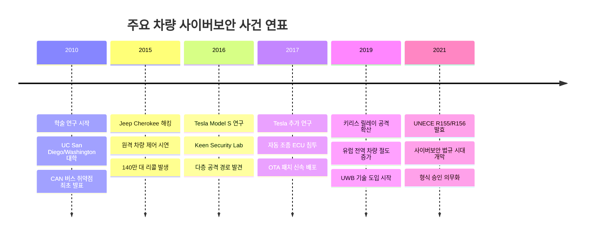
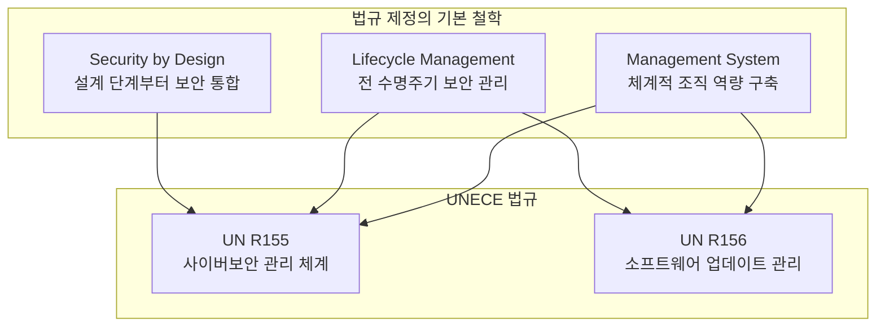
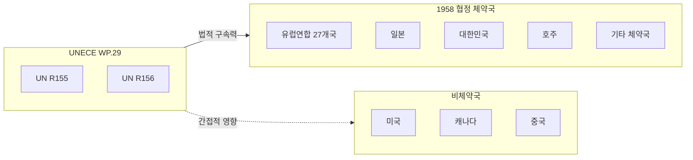

# Part 1: 서론 및 배경

## 차량 사이버보안 법규의 등장 배경과 필요성

---

## 1. 현대 차량의 연결성 확대와 사이버 위협의 대두

현대 자동차 산업은 지난 수십 년간 기계 중심의 제조업에서 소프트웨어 중심의 첨단 기술 산업으로 급격하게 변모하였다. 과거의 자동차가 엔진, 변속기, 섀시와 같은 기계적 구성요소의 정밀한 조합으로 정의되었다면, 오늘날의 자동차는 수십 개에서 많게는 백 개 이상의 전자제어장치(Electronic Control Unit, ECU)가 탑재되어 차량의 거의 모든 기능을 제어하는 복잡한 전자 시스템으로 진화하였다. 이러한 변화는 단순히 구성요소의 교체를 의미하는 것이 아니라, 자동차의 본질적인 특성 자체가 변화하고 있음을 시사한다.

특히 주목해야 할 점은 현대 차량의 연결성(Connectivity)이 비약적으로 확대되었다는 사실이다. 텔레매틱스 시스템을 통한 원격 진단 및 제어, 스마트폰 애플리케이션과의 연동, 무선 소프트웨어 업데이트(Over-The-Air, OTA), V2X(Vehicle-to-Everything) 통신, 그리고 클라우드 기반 서비스와의 상시 연결 등 차량은 이제 고립된 기계 장치가 아닌 광범위한 디지털 생태계의 일부로 작동하고 있다. 이러한 연결성은 운전자와 탑승자에게 편의성과 안전성을 제공하는 동시에, 새로운 차원의 보안 취약점을 야기하고 있다.

차량이 외부 네트워크와 연결되면 될수록, 악의적인 공격자가 원격으로 차량 시스템에 침투할 수 있는 경로(Attack Surface)가 증가하게 된다. 이는 단순히 개인정보 유출이나 차량 도난과 같은 재산적 피해에 그치지 않고, 주행 중인 차량의 브레이크나 조향 시스템이 외부 공격자에 의해 조작될 경우 탑승자의 생명과 직결되는 심각한 안전 위협으로 이어질 수 있다. 따라서 차량 사이버보안은 더 이상 선택적 고려사항이 아닌, 차량 설계 및 운영의 핵심 요소로 자리매김하게 되었다.

---

## 2. 차량 사이버 공격 사례와 그 교훈

차량 사이버보안의 중요성은 실제 발생한 보안 사고를 통해 극명하게 드러났다. 이러한 사례들은 학계와 산업계 모두에게 차량 보안에 대한 근본적인 인식 전환을 촉구하는 계기가 되었다.

### 2.1 Jeep Cherokee 원격 해킹 사건 (2015)

2015년 보안 연구원 Charlie Miller와 Chris Valasek은 Fiat Chrysler Automobiles(FCA)의 Jeep Cherokee 차량을 원격으로 해킹하는 시연을 수행하였다. 이들은 차량의 인포테인먼트 시스템에 탑재된 Uconnect 소프트웨어의 취약점을 이용하여 셀룰러 네트워크를 통해 차량에 접근하였으며, 이후 CAN(Controller Area Network) 버스를 통해 차량의 핵심 제어 시스템까지 침투하는 데 성공하였다.

이 공격 시연에서 연구원들은 주행 중인 차량의 에어컨, 라디오, 와이퍼 등 비안전 시스템을 원격으로 조작하였으며, 더 나아가 엔진을 정지시키고 조향 및 브레이크 시스템에도 영향을 미칠 수 있음을 입증하였다. 이 사건은 언론을 통해 전 세계적으로 보도되었으며, FCA는 약 140만 대의 차량에 대해 리콜을 실시하여 소프트웨어 패치를 배포하였다. 이 사건은 차량 사이버보안 위협이 이론적 가능성에 그치지 않고 현실적 위협임을 전 세계에 각인시킨 결정적 계기가 되었다.

### 2.2 Tesla Model S 보안 연구 (2016-2017)

중국의 보안 연구 그룹인 Tencent Keen Security Lab은 2016년과 2017년에 걸쳐 Tesla Model S에 대한 심층적인 보안 연구를 수행하였다. 연구진은 차량의 웹 브라우저 취약점을 시작으로 게이트웨이 ECU와 차체 제어 모듈(BCM)을 거쳐 최종적으로 자동 조종 ECU까지 침투하는 공격 경로를 시연하였다.

이 연구에서 주목할 점은 Tesla가 차량 아키텍처에 다층 보안 설계를 적용하고 있었음에도 불구하고 공격이 성공하였다는 사실이다. 그러나 동시에 Tesla의 신속한 대응 또한 주목받았다. Tesla는 취약점 보고를 받은 후 10일 이내에 OTA 업데이트를 통해 전 세계 Tesla 차량에 보안 패치를 배포하였으며, 이는 무선 소프트웨어 업데이트 기능이 차량 보안 유지에 있어 핵심적인 역할을 수행할 수 있음을 보여주었다.

### 2.3 키리스 엔트리 시스템 공격

무선 키 시스템(Keyless Entry System)에 대한 릴레이 공격(Relay Attack)은 차량 절도의 새로운 수법으로 광범위하게 확산되었다. 이 공격에서 범죄자들은 두 개의 무선 중계 장치를 사용하여 차량 소유자의 키 신호를 원격으로 증폭 및 전달함으로써, 키가 차량 근처에 없음에도 불구하고 차량의 잠금을 해제하고 시동을 거는 데 성공하였다.

이러한 공격은 암호화된 통신을 사용하는 시스템에서도 발생하였는데, 이는 암호화만으로는 불충분하며 신호의 도달 거리 제한이나 시간 기반 검증과 같은 추가적인 보안 메커니즘이 필요함을 시사한다. 이에 따라 최신 차량들은 UWB(Ultra-Wideband) 기술을 도입하여 정밀한 거리 측정 기반의 보안 메커니즘을 구현하고 있다.

---

## 3. UNECE WP.29와 차량 사이버보안 법규의 제정

### 3.1 UNECE와 WP.29의 역할

유엔 유럽 경제 위원회(United Nations Economic Commission for Europe, UNECE)는 1947년 설립된 유엔 산하 지역 경제 위원회로서, 유럽뿐 아니라 북미, 중앙아시아 등 57개 회원국을 포함하고 있다. UNECE의 주요 활동 중 하나는 국제 기술 규정 및 표준의 개발과 조화를 통해 국제 무역과 기술 협력을 촉진하는 것이다.

UNECE 산하에서 차량과 관련된 기술 규정을 담당하는 조직이 바로 세계 자동차 규정 조화 포럼(World Forum for Harmonization of Vehicle Regulations), 통칭 WP.29이다. WP.29는 1952년부터 활동을 시작하였으며, 차량의 안전성, 환경 보호, 에너지 효율성 등에 관한 국제 기술 규정을 개발하고 관리해 왔다. 전 세계 주요 자동차 생산국 및 소비국이 WP.29에 참여하고 있으며, 여기서 채택된 규정은 유럽연합(EU)을 비롯한 많은 국가에서 법적 구속력을 갖는 기술 기준으로 활용된다.

### 3.2 사이버보안 법규 개발 경위

차량 사이버보안의 중요성이 부각됨에 따라, WP.29는 2016년 자동차 사이버보안 및 무선 소프트웨어 업데이트에 관한 비공식 작업반(Informal Working Group on Cybersecurity and Over-the-Air Software Updates, IWG-CS/OTA)을 설립하였다. 이 작업반에는 미국, 유럽, 일본, 한국 등 주요 자동차 생산국의 정부 대표, 자동차 제조사, 부품 공급업체, 그리고 보안 전문가들이 참여하였다.

약 4년간의 논의와 검토를 거쳐 2020년 6월, WP.29는 두 가지 중요한 규정을 최종 채택하였다. 첫 번째는 UN Regulation No. 155(이하 R155)로서 사이버보안 및 사이버보안 관리 체계에 관한 규정이며, 두 번째는 UN Regulation No. 156(이하 R156)으로서 소프트웨어 업데이트 및 소프트웨어 업데이트 관리 체계에 관한 규정이다. 이 두 규정은 2021년 1월에 공식 발효되었으며, 차량 사이버보안 분야에서 최초의 법적 구속력을 갖는 국제 규정으로서 역사적 의의를 갖는다.

### 3.3 법규 제정의 기본 철학

R155와 R156의 제정 배경에는 몇 가지 핵심적인 철학적 원칙이 자리하고 있다.

**첫째, 설계 단계부터의 보안(Security by Design)** 개념이다. 과거에는 보안이 제품 개발 완료 후 추가되는 부가 기능으로 인식되는 경향이 있었으나, 현대의 보안 패러다임은 제품 설계 초기 단계부터 보안 요구사항을 핵심 설계 원칙으로 통합해야 함을 강조한다. R155는 이러한 철학을 법규 수준에서 의무화함으로써, 자동차 제조사들이 개발 프로세스 전반에 걸쳐 사이버보안을 고려하도록 요구한다.

**둘째, 전 수명주기 관리(Lifecycle Management)** 원칙이다. 차량의 사이버보안은 출고 시점에서 끝나는 것이 아니라, 차량이 운행되는 전 기간에 걸쳐 지속적으로 관리되어야 한다. 새로운 취약점이 발견되거나 새로운 공격 기법이 등장할 때, 제조사는 이에 대응하여 보안 업데이트를 제공할 수 있어야 한다. R156은 이러한 지속적 보안 관리를 가능하게 하는 소프트웨어 업데이트 체계를 법규로 규정하고 있다.

**셋째, 체계적 관리 시스템의 구축**이다. 개별 차량의 보안을 보장하기 위해서는 조직 전체가 사이버보안을 체계적으로 관리할 수 있는 역량을 갖추어야 한다. R155와 R156은 각각 사이버보안 관리 체계(CSMS)와 소프트웨어 업데이트 관리 체계(SUMS)의 구축 및 인증을 요구함으로써, 일회성 대응이 아닌 지속 가능한 보안 관리 역량의 확보를 강조한다.

---

## 4. 법규의 적용 범위와 시행 일정

### 4.1 적용 대상 차량

R155와 R156은 WP.29의 1958 협정을 채택한 체약 당사국에서 제조 또는 판매되는 특정 카테고리의 차량에 적용된다. 구체적으로 다음과 같은 차량 카테고리가 규정의 적용 대상이다:

- **M 카테고리 (승객 운송용 차량)**: M1(승용차), M2, M3(버스) 등
- **N 카테고리 (화물 운송용 차량)**: N1, N2, N3(트럭) 등
- **O 카테고리 (피견인 차량)**: 전자제어장치(ECU)가 하나 이상 장착된 트레일러
- **L6 및 L7 카테고리**: 자동화 운전 기능(레벨 3 이상)이 탑재된 경량 사륜 차량

이러한 범위 설정은 현대 도로 교통에서 운행되는 대부분의 동력 차량이 규정의 적용 대상에 포함됨을 의미하며, 특히 전자 시스템과 소프트웨어에 대한 의존도가 높은 차량일수록 더욱 엄격한 사이버보안 요구사항이 적용될 수 있다.

### 4.2 시행 일정

R155와 R156의 시행은 단계적으로 이루어졌으며, 유럽연합(EU)의 경우 다음과 같은 일정이 적용되었다:

| 시점 | 적용 대상 | 요구사항 |
|------|----------|---------|
| 2021년 1월 | 규정 발효 | R155, R156 공식 시행 |
| 2022년 7월 | 신규 형식 승인 차량 | 모든 신규 형식 승인에 CSMS/SUMS 인증 필요 |
| 2024년 7월 | 모든 신규 등록 차량 | 기존 형식 승인 차량 포함 전체 적용 |

이러한 단계적 시행 일정은 자동차 제조사들에게 새로운 요구사항에 대비할 충분한 시간을 부여하면서도, 명확한 기한을 설정하여 규정 준수를 강제하기 위한 것이다. 2024년 7월 이후로는 EU 시장에서 판매되는 모든 신규 차량이 R155와 R156의 요구사항을 충족해야 하며, 이를 충족하지 못하는 차량은 형식 승인을 받을 수 없어 판매가 불가능하게 된다.

### 4.3 전 세계 채택 현황

R155와 R156은 UNECE WP.29의 1958 협정에 기반한 규정으로서, 협정 체약 당사국에서 법적 효력을 갖는다. 유럽연합을 포함한 대부분의 유럽 국가, 호주, 일본, 한국, 남아프리카공화국 등이 이 협정의 체약국이며, 해당 국가들에서 R155와 R156은 법적 구속력을 갖는 기술 규정으로 적용된다.

한편 미국과 캐나다는 1958 협정의 체약국이 아니지만, 글로벌 자동차 시장의 특성상 이러한 국제 규정의 영향을 완전히 피할 수 없다. 글로벌 자동차 제조사들은 여러 시장에서 동시에 차량을 판매하므로, UNECE 규정을 충족하도록 설계된 차량 아키텍처와 프로세스를 전 세계적으로 적용하는 것이 일반적이다. 또한 미국의 경우 NHTSA(National Highway Traffic Safety Administration)가 별도의 사이버보안 권고 지침을 발표하고 있으며, 장기적으로는 국제 규정과의 조화를 추구할 것으로 예상된다.

---

## 5. 관련 국제 표준과의 관계

R155와 R156은 법적 요구사항을 규정하는 규제 프레임워크로서, 이러한 요구사항을 실제로 구현하기 위한 구체적인 방법론과 기술적 가이드라인은 관련 국제 표준에서 제공된다. 가장 중요한 두 가지 표준은 다음과 같다.

### 5.1 ISO/SAE 21434 (Road Vehicles – Cybersecurity Engineering)

ISO/SAE 21434는 차량 사이버보안 엔지니어링에 관한 국제 표준으로서, 2021년 8월에 정식 발행되었다. 이 표준은 차량의 전기/전자 시스템에 대한 사이버보안 위험 관리 요구사항을 규정하며, 컨셉 단계부터 개발, 생산, 운영, 유지보수, 폐기에 이르는 전 수명주기에 걸친 사이버보안 활동을 다룬다.

ISO/SAE 21434는 R155의 기술적 요구사항을 충족하기 위한 산업 표준으로 널리 인정받고 있으며, 많은 인증 기관에서 R155 적합성 평가 시 ISO/SAE 21434 준수 여부를 주요 판단 기준으로 활용하고 있다.

### 5.2 ISO 24089 (Road Vehicles – Software Update Engineering)

ISO 24089는 차량 소프트웨어 업데이트 엔지니어링에 관한 국제 표준으로서, 2023년 초에 발행되었다. 이 표준은 소프트웨어 업데이트의 계획, 개발, 검증, 배포 및 모니터링에 관한 요구사항을 규정하며, R156의 기술적 요구사항을 충족하기 위한 실무 지침을 제공한다.

ISO 24089는 OTA 업데이트뿐 아니라 정비소에서 수행되는 물리적 업데이트도 포함하여, 차량 소프트웨어 업데이트의 전 과정에 대한 체계적인 관리 방안을 제시한다.

---

## 6. 본 문서 시리즈의 구성과 목적

본 문서 시리즈는 R155와 R156의 법규 원문을 상세히 해설하고, 이러한 법규 요구사항을 실제 소프트웨어 개발 활동에 반영하기 위한 기술적 가이드라인을 제공하는 것을 목적으로 한다. 특히 법규 원문에서 개념적 수준으로만 언급된 보안 기술들을 구체적인 암호화 알고리즘과 구현 방법론 수준으로 상세하게 설명함으로써, 실무 개발자와 엔지니어가 법규 준수를 위해 필요한 기술적 역량을 갖출 수 있도록 지원한다.

이후의 문서에서는 R155와 R156의 각 조항을 분석하고, 관련 국제 표준의 요구사항을 연계하여 설명하며, 대칭키 및 비대칭키 암호화, 하드웨어 보안 모듈(HSM), 보안 부팅(Secure Boot), 공개키 기반구조(PKI), 코드 서명 등 핵심 보안 기술에 대한 심층적 해설을 제공할 것이다. 최종적으로 이러한 기술적 요구사항을 소프트웨어 개발 프로세스의 각 단계에 어떻게 통합할 것인지에 대한 실무적 가이드를 제시하고자 한다.

---

## 참고문헌

1. UNECE. (2021). UN Regulation No. 155 - Cyber security and cyber security management system. Geneva: United Nations.
2. UNECE. (2021). UN Regulation No. 156 - Software update and software update management system. Geneva: United Nations.
3. ISO/SAE. (2021). ISO/SAE 21434:2021 - Road vehicles — Cybersecurity engineering. Geneva: International Organization for Standardization.
4. ISO. (2023). ISO 24089:2023 - Road vehicles — Software update engineering. Geneva: International Organization for Standardization.
5. Miller, C., & Valasek, C. (2015). Remote Exploitation of an Unaltered Passenger Vehicle. Black Hat USA 2015.
6. Nie, S., Liu, L., & Du, Y. (2017). Free-Fall: Hacking Tesla from Wireless to CAN Bus. Black Hat USA 2017.

---

*다음 편: [Part 2: UNECE R155 법규 원문 해설 - 사이버보안 관리 체계](./02_r155_csms.md)*
