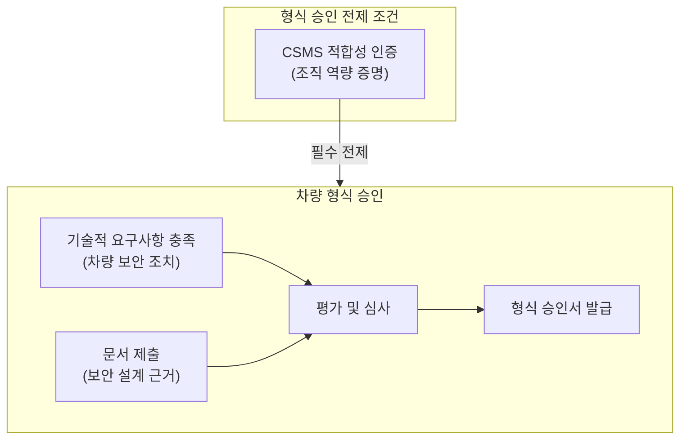
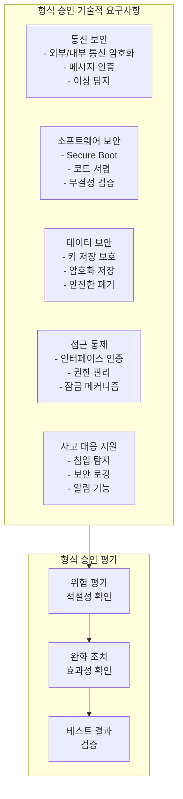
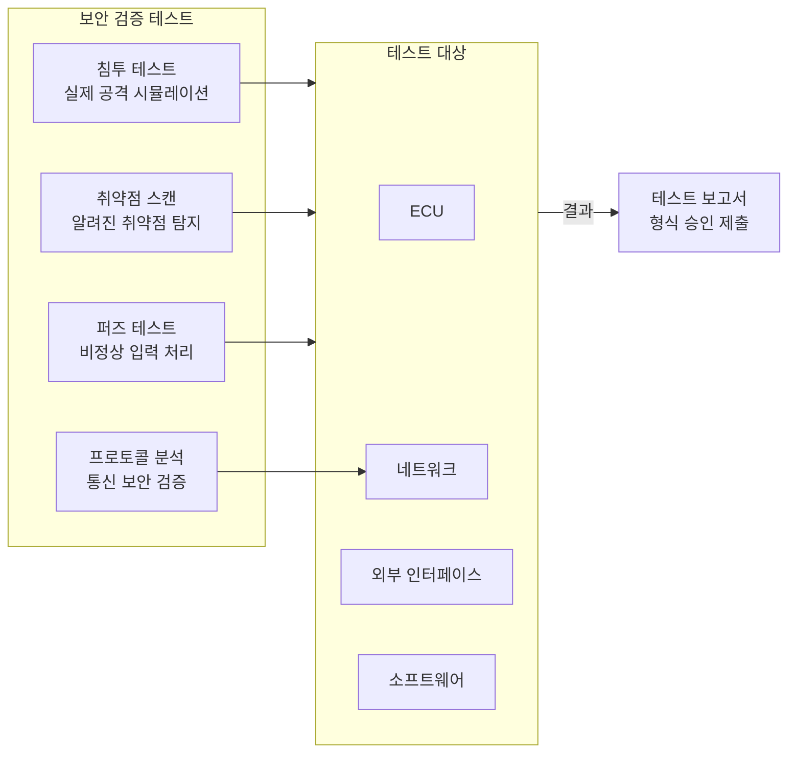

# Part 3: UNECE R155 법규 원문 해설 - 차량 형식 승인

## 사이버보안 차량 형식 승인 요구사항과 기술적 평가

---

## 1. 형식 승인의 개념과 R155에서의 의미

차량 형식 승인(Type Approval)은 특정 차량 모델이 법규로 정해진 기술적 요구사항을 충족함을 공식적으로 인정하는 제도이다. 제조사는 대량 생산되는 동일 형식의 모든 차량이 승인받은 사양과 일치함을 보장해야 하며, 형식 승인을 받지 않은 차량은 해당 법역에서 판매가 불가능하다.

R155는 사이버보안 분야에서 최초로 형식 승인 요구사항을 도입한 국제 규정이다. 이 규정에 따르면, 차량 형식이 사이버보안 관점에서 승인받기 위해서는 두 가지 조건을 충족해야 한다. 첫째, 해당 차량을 개발한 제조사가 유효한 CSMS 적합성 인증서를 보유하고 있어야 한다. 둘째, 해당 차량 형식 자체가 R155에서 규정하는 기술적 요구사항을 충족해야 한다.

이러한 이중 구조는 조직적 역량과 제품적 품질을 모두 평가함으로써, 사이버보안이 우연히 달성된 것이 아니라 체계적인 프로세스의 결과임을 보장하고자 하는 것이다. CSMS 인증이 없는 제조사는 아무리 기술적으로 우수한 보안 조치를 차량에 적용하였더라도 형식 승인을 받을 수 없다.

---

## 2. 형식 승인 신청 및 제출 문서

### 2.1 신청 절차

제조사가 차량 형식에 대해 사이버보안 형식 승인을 받고자 할 때, 승인 당국 또는 지정된 기술 서비스 기관에 공식적인 신청서를 제출해야 한다. 신청서에는 차량 형식에 관한 기본 정보, 제조사의 CSMS 적합성 인증서 사본, 그리고 차량의 사이버보안 조치에 관한 상세 문서가 포함되어야 한다.

승인 당국은 제출된 문서를 검토하고, 필요시 추가 정보를 요청하거나 현장 심사를 수행할 수 있다. 심사 과정에서 차량이 R155의 요구사항을 충족한다고 판단되면 형식 승인서가 발급되며, 이 승인서에는 고유한 승인 번호와 승인 조건이 명시된다.

### 2.2 필수 제출 문서

R155는 형식 승인 신청 시 제조사가 다음과 같은 정보를 제공하도록 요구한다.

**차량 형식 식별 정보**에는 차량의 명칭, 제조사 정보, 그리고 차량 형식을 정의하는 기술적 특성이 포함된다. 이 정보는 승인받은 형식과 실제 생산 차량의 일치성을 확인하는 데 사용된다.

**사이버보안 관련 시스템 정보**에는 차량에 탑재된 전자 시스템의 목록, 시스템 간 연결 구조, 외부 인터페이스, 그리고 보안 관련 기능의 설명이 포함된다. 이 정보는 심사원이 차량의 사이버보안 아키텍처를 이해하고 위험 영역을 식별하는 데 활용된다.

**위험 평가 결과**는 해당 차량 형식에 대해 수행된 TARA의 결과를 요약한 문서이다. 여기에는 식별된 주요 위협, 평가된 위험 수준, 그리고 각 위험에 대해 적용된 완화 조치가 포함된다.

**보안 조치 설명**은 차량에 적용된 구체적인 사이버보안 기술과 그 구현 방법을 설명하는 문서이다. 이는 암호화 방식, 인증 메커니즘, 침입 탐지 기능, 보안 업데이트 절차 등을 포함한다.

**테스트 결과**는 보안 조치의 효과를 검증하기 위해 수행된 테스트의 결과를 문서화한 것이다. 여기에는 침투 테스트, 취약점 스캔, 프로토콜 분석 등의 결과가 포함될 수 있다.

---

## 3. 차량 형식 승인의 기술적 요구사항

### 3.1 위험 관리 기반 접근

R155의 차량 형식 승인 요구사항은 위험 관리 기반 접근(Risk-based Approach)을 채택하고 있다. 이는 모든 차량에 동일한 보안 조치를 획일적으로 요구하는 것이 아니라, 각 차량 형식의 특성과 위험 수준에 따라 적절한 보안 조치를 적용하도록 하는 것이다.

제조사는 해당 차량 형식에 대해 포괄적인 위험 평가를 수행하고, 식별된 위험에 상응하는 보안 조치를 설계해야 한다. 승인 당국은 이 위험 평가가 적절하게 수행되었는지, 그리고 도출된 보안 조치가 식별된 위험을 효과적으로 완화하는지를 평가한다.

### 3.2 Annex 5 위협에 대한 대응

R155의 Annex 5는 차량에 대한 대표적인 위협 유형과 그에 대응하는 완화 조치의 예시를 제공한다. 형식 승인 심사에서 승인 당국은 제조사가 Annex 5에 열거된 위협 유형을 적절히 고려하였는지, 그리고 해당 위협에 대한 효과적인 완화 조치를 구현하였는지를 평가한다.

Annex 5는 의무적으로 구현해야 하는 특정 기술을 규정하는 것이 아니라, 제조사가 고려해야 하는 위협의 범주와 가능한 완화 접근 방식을 제시한다. 따라서 제조사는 Annex 5의 내용을 참고하여 자사 차량에 적합한 보안 솔루션을 설계할 수 있는 유연성을 갖는다.

### 3.3 주요 기술적 요구사항 영역

형식 승인에서 평가되는 주요 기술적 영역은 다음과 같다.

**통신 보안**에서는 차량의 외부 및 내부 통신이 적절히 보호되고 있는지를 평가한다. 외부 통신에는 셀룰러 네트워크, Wi-Fi, Bluetooth, V2X 통신 등이 포함되며, 내부 통신에는 CAN 버스, Automotive Ethernet, FlexRay 등의 차량 내 네트워크가 포함된다. 통신 보안 조치로는 암호화, 메시지 인증, 그리고 비정상 통신 탐지 등이 평가된다.

**소프트웨어 보안**에서는 차량 소프트웨어의 무결성과 진정성이 보장되는지를 평가한다. 이는 보안 부팅(Secure Boot) 메커니즘, 코드 서명 및 검증, 그리고 런타임 무결성 모니터링 등을 포함한다.

**데이터 보안**에서는 차량에 저장되거나 전송되는 민감 정보가 적절히 보호되는지를 평가한다. 여기에는 보안 키, 인증 정보, 개인 데이터 등의 암호화 저장 및 안전한 폐기 절차가 포함된다.

**접근 통제**에서는 차량의 각종 인터페이스와 기능에 대한 접근이 적절히 제어되는지를 평가한다. 진단 포트(OBD-II), USB 인터페이스, 무선 연결 등에 대한 인증 및 권한 관리가 대상이 된다.

**사고 대응 지원**에서는 차량이 사이버 공격을 탐지하고 대응하는 기능을 갖추고 있는지를 평가한다. 침입 탐지 시스템(IDS), 보안 로깅, 그리고 이상 행위 알림 기능 등이 포함된다.

---

## 4. 형식 승인의 유지 및 변경 관리

### 4.1 생산 적합성(Conformity of Production)

형식 승인은 단순히 시제품(Prototype)에 대한 승인이 아니라, 해당 형식으로 대량 생산되는 모든 차량이 승인받은 사양과 일치함을 전제로 한다. 따라서 제조사는 생산 과정에서 사이버보안 관련 사양이 일관되게 유지되도록 보장해야 하며, 이를 생산 적합성(Conformity of Production, CoP)이라 한다.

생산 적합성 관리에는 보안 관련 소프트웨어의 형상 관리, 보안 설정의 일관된 적용, 보안 부품의 적절한 취급, 그리고 생산 라인에서의 보안 테스트 등이 포함된다. 승인 당국은 생산 적합성을 확인하기 위해 정기적 또는 비정기적 점검을 수행할 수 있다.

### 4.2 형식 변경 시 승인 갱신

차량 형식에 사이버보안에 영향을 미치는 변경이 발생할 경우, 제조사는 이를 승인 당국에 통보하고 필요시 형식 승인의 변경(Extension) 또는 신규 승인을 받아야 한다. 사이버보안에 영향을 미치는 변경에는 새로운 ECU의 추가, 통신 프로토콜의 변경, 보안 소프트웨어의 주요 업데이트, 또는 외부 인터페이스의 추가 등이 포함된다.

승인 당국은 변경의 성격과 범위를 평가하여, 기존 승인의 범위 내에서 처리할 수 있는지, 승인 변경(Extension)이 필요한지, 또는 완전히 새로운 형식 승인이 필요한지를 결정한다.

### 4.3 승인 취소 및 제재

승인받은 차량 형식이 더 이상 R155의 요구사항을 충족하지 못하거나, 승인 당시 제출된 정보가 허위인 것으로 밝혀지거나, 제조사가 생산 적합성을 유지하지 못하는 경우, 승인 당국은 형식 승인을 취소하거나 제한할 수 있다. 이 경우 제조사는 해당 형식의 차량을 더 이상 판매할 수 없으며, 이미 판매된 차량에 대해서도 시정 조치(Corrective Action)가 요구될 수 있다.

---

## 5. 승인 마크 및 문서화

### 5.1 승인 마크

R155에 따라 형식 승인을 받은 차량에는 승인 마크가 부착되어야 한다. 승인 마크는 차량이 해당 법규의 요구사항을 충족함을 시각적으로 표시하는 것으로, 규정에서 정의된 형식에 따라 제작되어야 한다.

승인 마크의 구성요소에는 "E" 문자와 승인을 발급한 국가의 식별 번호, 규정 번호(155), 그리고 고유한 승인 번호가 포함된다. 이 마크는 차량의 식별판 근처 또는 규정에서 지정한 위치에 영구적으로 부착되어야 한다.

### 5.2 형식 승인 문서의 보관

제조사는 형식 승인과 관련된 모든 문서를 적절한 기간 동안 보관해야 한다. 이 문서에는 승인 신청서, 제출된 기술 문서, 심사 보고서, 승인서 사본, 그리고 이후 발생한 변경에 관한 기록이 포함된다. 이러한 문서는 승인 당국의 요청 시 제출할 수 있어야 하며, 분쟁 발생 시 증거 자료로 활용될 수 있다.

---

## 6. 형식 승인과 보안 검증 테스트

### 6.1 테스트의 역할

형식 승인 과정에서 테스트는 제조사가 주장하는 보안 조치가 실제로 효과적인지를 객관적으로 검증하는 핵심 수단이다. R155는 특정 테스트 방법론을 의무화하지 않지만, 승인 당국이 보안 조치의 효과를 평가하기 위해 테스트 결과를 요구할 수 있음을 명시하고 있다.

제조사는 설계 단계에서 정의된 보안 요구사항이 구현 단계에서 올바르게 적용되었는지를 검증하기 위한 테스트를 수행해야 한다. 또한 알려진 공격 기법에 대한 차량의 저항성을 확인하기 위한 침투 테스트(Penetration Testing)도 일반적으로 수행된다.

### 6.2 주요 테스트 유형

**침투 테스트(Penetration Testing)**는 화이트 햇 해커 또는 보안 전문가가 실제 공격자의 관점에서 차량 시스템에 대한 공격을 시도하는 것이다. 이를 통해 설계 시 예상하지 못한 취약점을 발견하고, 보안 조치의 실제 효과를 검증할 수 있다.

**취약점 스캔(Vulnerability Scanning)**은 자동화된 도구를 사용하여 알려진 취약점의 존재 여부를 확인하는 것이다. 이는 사용된 소프트웨어 컴포넌트에 공개된 취약점이 존재하는지, 그리고 필요한 패치가 적용되었는지를 확인하는 데 활용된다.

**퍼즈 테스트(Fuzz Testing)**는 비정상적이거나 무작위의 입력 데이터를 시스템에 주입하여 예기치 않은 동작이나 충돌을 유발하는 취약점을 발견하는 기법이다. 이는 특히 통신 인터페이스와 파서(Parser)의 견고성을 테스트하는 데 효과적이다.

**프로토콜 분석(Protocol Analysis)**은 차량의 통신 프로토콜이 설계된 보안 속성을 갖추고 있는지, 그리고 구현이 프로토콜 사양을 올바르게 따르는지를 분석하는 것이다.

---

## 7. 형식 승인의 국제적 상호 인정

### 7.1 1958 협정에 따른 상호 인정

R155는 UNECE의 1958 협정 체계 하에 채택된 규정이다. 1958 협정의 핵심 원칙 중 하나는 체약 당사국 간의 형식 승인 상호 인정이다. 즉, 한 체약국에서 발급된 R155 형식 승인은 다른 모든 체약국에서도 동등하게 인정된다.

이러한 상호 인정 체계는 글로벌 자동차 제조사에게 중요한 의미를 갖는다. 제조사는 하나의 체약국에서 형식 승인을 받으면 동일한 차량을 다른 체약국에서도 별도의 재심사 없이 판매할 수 있다. 이는 국가별로 상이한 인증 요구사항을 충족해야 하는 부담을 크게 경감시킨다.

### 7.2 비체약국에서의 적용

미국, 캐나다 등 1958 협정의 비체약국에서는 R155가 직접적인 법적 효력을 갖지 않는다. 그러나 이러한 국가들에서도 자체적인 사이버보안 규정 또는 지침이 개발되고 있으며, R155의 내용이 참고되는 경우가 많다.

또한 글로벌 자동차 제조사들은 여러 시장에서 동시에 차량을 판매하므로, 비체약국 시장을 위한 차량도 사실상 R155 수준의 사이버보안을 갖추는 경우가 일반적이다. 이는 플랫폼 공유, 개발 효율성, 그리고 기업 차원의 보안 정책 등에 기인한다.

---

## 8. 형식 승인 사례 연구

### 8.1 형식 승인 준비 과정

실제 형식 승인을 준비하는 제조사의 과정을 살펴보면, 먼저 차량 개발 초기 단계에서 사이버보안 요구사항이 정의되어야 한다. 이는 CSMS의 TARA 프로세스에 따라 수행되며, 식별된 위험에 대응하는 보안 조치가 설계에 반영된다.

개발이 진행됨에 따라 보안 기능이 구현되고, 구현 결과가 요구사항을 충족하는지 검증된다. 시제품(Prototype) 단계에서는 종합적인 보안 테스트가 수행되며, 발견된 취약점은 양산 전에 수정된다.

양산 준비가 완료되면, 제조사는 형식 승인에 필요한 문서를 준비하여 승인 당국에 제출한다. 문서에는 차량 아키텍처, 보안 기능 설명, 위험 평가 결과, 테스트 보고서 등이 포함된다. 승인 당국은 제출된 문서를 검토하고, 필요시 추가 정보 요청이나 현장 심사를 진행한다.

### 8.2 일반적인 심사 쟁점

형식 승인 심사 과정에서 자주 제기되는 쟁점으로는 위험 평가의 완전성, 보안 조치의 적절성, 그리고 테스트 범위의 충분성 등이 있다.

위험 평가와 관련하여, 승인 당국은 제조사가 Annex 5에 열거된 모든 관련 위협을 고려하였는지, 그리고 차량 고유의 특성에서 비롯되는 추가적인 위협을 식별하였는지를 평가한다. 위험 평가가 불완전하다고 판단되면 보완이 요구된다.

보안 조치와 관련하여, 승인 당국은 적용된 조치가 식별된 위험을 효과적으로 완화하는지, 그리고 업계 최선의 관행(Best Practices)에 부합하는지를 평가한다. 조치가 불충분하다고 판단되면 추가적인 보안 강화가 요구될 수 있다.

테스트와 관련하여, 승인 당국은 수행된 테스트가 보안 조치의 효과를 검증하기에 충분한 범위와 깊이를 갖추었는지를 평가한다. 특히 중요한 보안 기능에 대해서는 독립적인 제3자 테스트 결과가 요구될 수 있다.

---

## 참고문헌

1. UNECE. (2021). UN Regulation No. 155 - Cyber security and cyber security management system. Geneva: United Nations.
2. UNECE. (2021). Consolidated Resolution on the Construction of Vehicles (R.E.3). Geneva: United Nations.
3. European Commission. (2018). Regulation (EU) 2018/858 on the approval and market surveillance of motor vehicles. Brussels: European Union.

---

*이전 편: [Part 2: UNECE R155 법규 원문 해설 - 사이버보안 관리 체계](./02_r155_csms.md)*

*다음 편: [Part 4: UNECE R156 법규 원문 해설 - 소프트웨어 업데이트 관리 체계](./04_r156_sums.md)*
