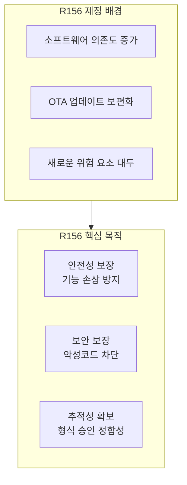
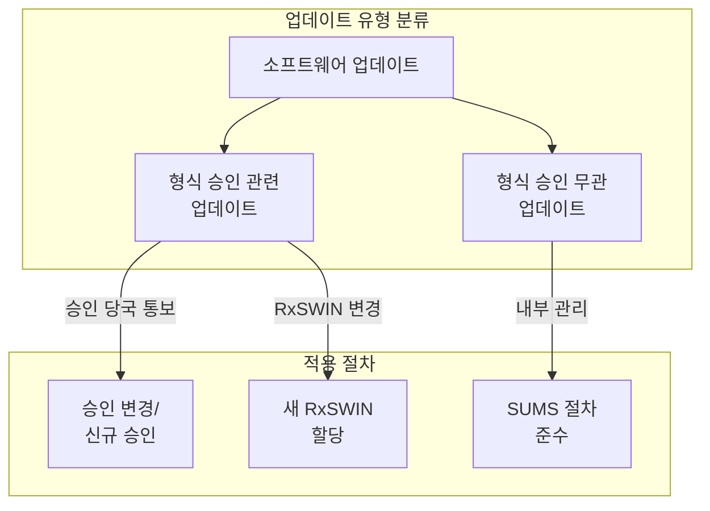
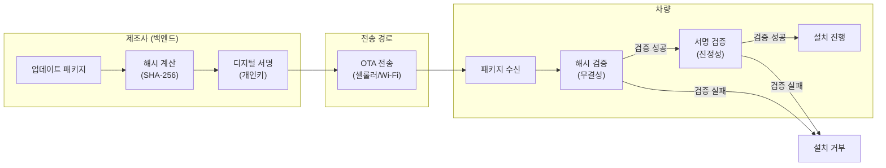
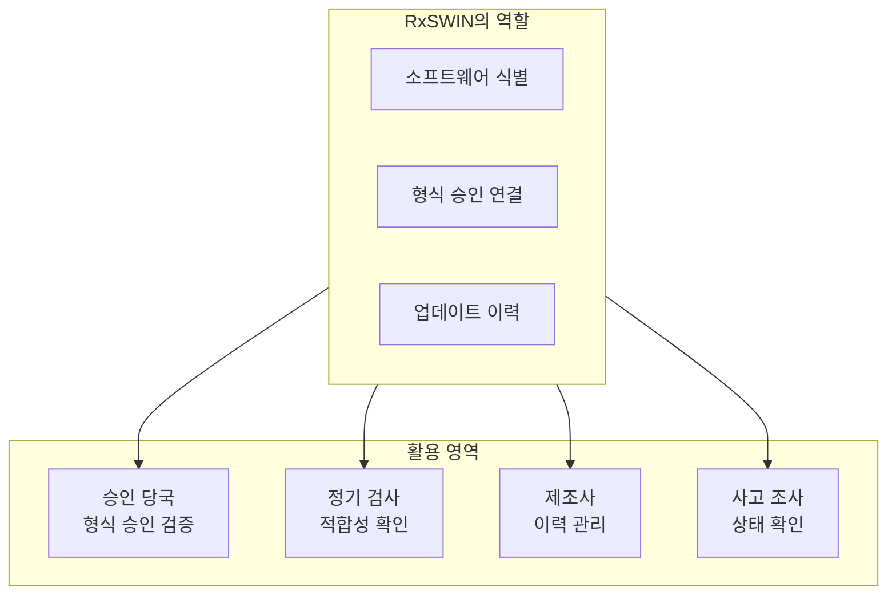
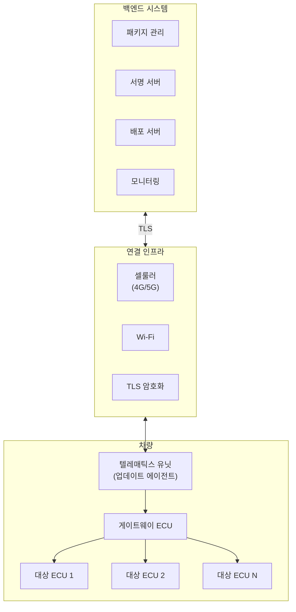

# Part 4: UNECE R156 법규 원문 해설 - 소프트웨어 업데이트 관리 체계

## 소프트웨어 업데이트 관리 체계(SUMS)의 구축과 안전한 업데이트 배포

---

## 1. R156 법규의 목적과 배경

현대 자동차는 소프트웨어에 대한 의존도가 급격히 증가하고 있다. 차량의 핵심 기능들이 소프트웨어로 구현됨에 따라, 차량 출고 이후에도 소프트웨어 업데이트를 통해 기능 개선, 버그 수정, 그리고 보안 취약점 패치가 수행되는 것이 일반화되었다. 특히 무선 소프트웨어 업데이트(Over-The-Air, OTA) 기술의 발전으로, 차량이 정비소를 방문하지 않고도 원격으로 소프트웨어를 업데이트받는 것이 가능해졌다.

그러나 소프트웨어 업데이트는 새로운 위험 요소를 수반한다. 업데이트 과정에서 악성 소프트웨어가 주입되거나, 업데이트 실패로 인해 차량 기능이 손상되거나, 업데이트가 차량의 형식 승인 조건에 영향을 미칠 수 있다. 이러한 위험을 관리하기 위해 UN Regulation No. 156(R156)이 제정되었으며, 이 규정은 소프트웨어 업데이트의 안전하고 체계적인 관리를 위한 법적 프레임워크를 제공한다.

R156의 핵심 목적은 세 가지로 요약할 수 있다. 첫째, 소프트웨어 업데이트가 안전하게 수행되어 차량의 안전 기능을 손상시키지 않도록 보장한다. 둘째, 소프트웨어 업데이트 과정이 보안 위협으로부터 보호되도록 한다. 셋째, 소프트웨어 업데이트 후에도 차량이 형식 승인 조건을 충족하도록 추적성을 확보한다.

---

## 2. 소프트웨어 업데이트 관리 체계(SUMS)의 정의

### 2.1 SUMS의 법규적 정의

R156은 소프트웨어 업데이트 관리 체계(Software Update Management System, SUMS)를 "소프트웨어 업데이트에 적용되는 규정 요구사항의 준수를 보장하기 위한 조직적 프로세스, 책임 및 거버넌스를 확립하는 체계적 접근 방식"으로 정의한다.

SUMS는 CSMS와 유사하게 조직 수준의 관리 체계이다. 제조사는 개별 소프트웨어 업데이트마다 임시적으로 대응하는 것이 아니라, 모든 소프트웨어 업데이트에 일관되게 적용되는 체계적인 프로세스와 절차를 갖추어야 한다. 이 체계는 업데이트의 기획, 개발, 검증, 배포, 그리고 모니터링에 이르는 전 과정을 포괄한다.

### 2.2 SUMS와 CSMS의 관계

R155의 CSMS와 R156의 SUMS는 상호 보완적인 관계에 있다. CSMS가 차량의 전반적인 사이버보안을 관리하는 체계라면, SUMS는 특히 소프트웨어 업데이트라는 특정 영역에 초점을 맞춘 관리 체계이다.

실제로 많은 요구사항이 두 체계 간에 중첩된다. 예를 들어, 소프트웨어 업데이트의 보안(무결성, 진정성)은 CSMS에서도 다루어지고 SUMS에서도 다루어진다. 따라서 제조사들은 흔히 CSMS와 SUMS를 통합된 관리 체계로 운영하며, 각 법규의 요구사항이 충족되는지를 개별적으로 입증한다.

---

## 3. SUMS의 핵심 요구사항

### 3.1 소프트웨어 버전 관리와 추적성

R156의 핵심 요구사항 중 하나는 소프트웨어 버전의 체계적인 관리와 추적성 확보이다. 차량에 설치된 소프트웨어의 현재 버전을 정확히 파악할 수 있어야 하며, 각 소프트웨어 버전이 어떤 기능과 특성을 갖는지 기록되어야 한다.

이를 위해 R156은 **RxSWIN(Regulated Software Identification Number)**이라는 개념을 도입한다. RxSWIN은 차량 형식 승인에 연관된 소프트웨어 버전을 식별하는 고유 번호로서, 소프트웨어가 업데이트될 때마다 이 번호가 어떻게 변경되는지를 추적할 수 있도록 한다.

RxSWIN은 차량의 형식 승인 문서에 기록되며, 특정 RxSWIN을 가진 소프트웨어가 형식 승인 조건을 충족함을 나타낸다. 소프트웨어 업데이트가 형식 승인에 영향을 미치는 경우, 새로운 RxSWIN이 할당되어야 하며 필요시 형식 승인의 변경이 수행되어야 한다.

### 3.2 업데이트 유형의 분류

R156은 소프트웨어 업데이트를 그 성격에 따라 분류하고, 각 유형에 적절한 관리 절차를 적용하도록 요구한다. 주요 분류 기준은 해당 업데이트가 차량의 형식 승인에 영향을 미치는지 여부이다.

**형식 승인에 영향을 미치는 업데이트**는 차량의 형식 승인 매개변수(예: 배기가스 성능, 안전 기능, 소음 수준 등)를 변경하는 업데이트이다. 이러한 업데이트는 승인 당국에 통보되어야 하며, 필요시 형식 승인의 변경 또는 신규 승인이 요구될 수 있다.

**형식 승인에 영향을 미치지 않는 업데이트**는 기존 형식 승인의 범위 내에서 수행되는 업데이트이다. 예를 들어, 인포테인먼트 시스템의 기능 개선이나 사용자 인터페이스 변경 등이 여기에 해당할 수 있다. 이러한 업데이트도 SUMS의 관리 하에 수행되어야 하지만, 승인 당국에 대한 별도의 통보 의무는 적용되지 않을 수 있다.

### 3.3 업데이트 프로세스 요구사항

SUMS는 소프트웨어 업데이트의 전 과정에 대한 체계적인 프로세스를 규정해야 한다. R156이 요구하는 주요 프로세스 영역은 다음과 같다.

**업데이트 계획 및 영향 분석**에서 제조사는 계획된 소프트웨어 업데이트가 차량의 기능, 안전, 보안 및 형식 승인에 미치는 영향을 사전에 분석해야 한다. 이 분석 결과에 따라 적절한 검증 활동과 승인 절차가 결정된다.

**업데이트 개발 및 검증**에서는 업데이트 소프트웨어가 의도된 기능을 수행하고, 부작용을 야기하지 않으며, 보안 요구사항을 충족하는지를 검증해야 한다. 여기에는 기능 테스트, 호환성 테스트, 회귀 테스트, 그리고 보안 테스트가 포함된다.

**업데이트 배포**에서는 업데이트가 대상 차량에 안전하게 전달되고 설치되도록 해야 한다. 배포 방식(OTA 또는 정비소)에 따른 고유한 요구사항이 적용되며, 업데이트 패키지의 무결성과 진정성이 보장되어야 한다.

**배포 후 모니터링**에서는 업데이트가 현장에서 성공적으로 수행되었는지, 그리고 예상치 못한 문제가 발생하지 않았는지를 모니터링해야 한다. 문제가 발생한 경우 신속한 대응 조치가 수행되어야 한다.

---

## 4. OTA 업데이트의 특별 요구사항

### 4.1 OTA 업데이트의 정의와 특성

무선 소프트웨어 업데이트(Over-The-Air Update)는 유선 연결이나 물리적 매체 없이 무선 통신을 통해 소프트웨어를 전송하고 설치하는 방식을 의미한다. OTA 업데이트는 차량 소유자의 편의성을 높이고, 신속한 보안 패치 배포를 가능하게 하며, 리콜 비용을 절감하는 장점이 있다.

그러나 OTA 업데이트는 정비소에서 수행되는 물리적 업데이트에 비해 추가적인 위험 요소를 내포하고 있다. 첫째, 무선 통신 경로가 악의적 공격에 노출될 수 있다. 둘째, 업데이트 시점에 차량이 운행 중일 수 있다. 셋째, 차량 소유자가 업데이트 과정을 직접 통제하게 되어 예기치 않은 상황이 발생할 수 있다. 이러한 이유로 R156은 OTA 업데이트에 대해 추가적인 요구사항을 규정하고 있다.

### 4.2 OTA 업데이트의 보안 요구사항

OTA 업데이트에 적용되는 보안 요구사항은 업데이트 패키지의 **무결성(Integrity)**과 **진정성(Authenticity)**을 보장하는 데 초점을 맞추고 있다.

**무결성**은 업데이트 패키지가 전송 과정에서 변조되지 않았음을 보장하는 것이다. 이를 위해 암호화 해시 함수를 사용하여 패키지의 무결성 값을 계산하고, 수신측에서 이를 검증한다. 만약 패키지가 전송 중에 변조되었다면, 해시 값이 일치하지 않아 변조가 탐지된다.

**진정성**은 업데이트 패키지가 정당한 제조사로부터 발송되었음을 보장하는 것이다. 이를 위해 디지털 서명 기술이 사용된다. 제조사는 자신의 개인키로 업데이트 패키지에 서명하고, 차량은 제조사의 공개키로 이 서명을 검증한다. 서명이 유효하지 않은 패키지는 정당한 출처가 아닌 것으로 간주되어 설치가 거부된다.

이러한 보안 메커니즘의 구현에는 공개키 기반구조(PKI), 코드 서명, 그리고 하드웨어 보안 모듈(HSM) 등의 기술이 활용되며, 이는 본 시리즈의 후반부에서 상세히 다루어진다.

### 4.3 OTA 업데이트의 안전 요구사항

R156은 OTA 업데이트가 차량의 안전에 악영향을 미치지 않도록 다음과 같은 안전 요구사항을 규정하고 있다.

**안전한 업데이트 조건**에 관하여, 안전 관련 기능에 영향을 미치는 업데이트는 차량이 안전한 상태에 있을 때만 설치되어야 한다. 일반적으로 이는 차량이 정지 상태이고, 시동이 꺼져 있거나 주차 모드에 있으며, 충분한 전원이 공급되는 조건을 의미한다. 업데이트 중에는 차량의 이동이 방지되어야 하며, 운전자가 업데이트 진행 중임을 명확히 인지해야 한다.

**업데이트 실패 시 복구**에 관하여, 업데이트가 중단되거나 실패한 경우에도 차량이 안전한 상태를 유지할 수 있어야 한다. 이를 위해 롤백(Rollback) 메커니즘이 구현되어, 업데이트 실패 시 이전의 정상 작동 상태로 복귀할 수 있어야 한다. 롤백이 불가능한 경우, 차량은 안전한 동작 모드(Safe State)로 전환되어야 한다.

**사용자 고지 및 동의**에 관하여, 차량 소유자 또는 운전자에게 업데이트의 존재, 내용, 그리고 업데이트로 인한 변경 사항이 고지되어야 한다. 특히 차량의 작동 조건이나 성능에 영향을 미치는 업데이트의 경우, 사용자의 동의를 받거나 업데이트를 연기할 수 있는 옵션이 제공되어야 한다.

---

## 5. 형식 승인과 소프트웨어 업데이트

### 5.1 업데이트가 형식 승인에 미치는 영향

소프트웨어 업데이트가 차량의 기술적 특성을 변경하는 경우, 기존에 발급받은 형식 승인의 유효성에 영향을 미칠 수 있다. R156은 이러한 상황을 관리하기 위한 절차를 규정하고 있다.

제조사는 소프트웨어 업데이트를 배포하기 전에, 해당 업데이트가 형식 승인 매개변수에 영향을 미치는지를 평가해야 한다. 형식 승인 매개변수에는 배기가스 성능(Euro 6/7 등), 소음 수준, 안전 기능(ADAS, 브레이크 성능 등), 그리고 사이버보안 관련 특성이 포함된다.

업데이트가 이러한 매개변수를 변경하는 경우, 제조사는 승인 당국에 이를 통보해야 하며, 승인 당국은 해당 변경이 기존 형식 승인의 범위 내에서 허용되는지, 형식 승인의 변경(Extension)이 필요한지, 또는 신규 형식 승인이 필요한지를 결정한다.

### 5.2 RxSWIN의 역할

RxSWIN(Regulated Software Identification Number)은 형식 승인과 소프트웨어 버전을 연결하는 핵심 식별자이다. RxSWIN은 다음과 같은 역할을 수행한다.

**형식 승인 추적성**에 관하여, RxSWIN은 특정 차량에 설치된 소프트웨어가 형식 승인 조건을 충족하는지를 확인하는 데 사용된다. 승인 당국, 법 집행 기관, 정비소 등은 차량의 RxSWIN을 확인하여 해당 차량이 적법한 소프트웨어를 운영하고 있는지를 검증할 수 있다.

**업데이트 이력 관리**에 관하여, 제조사는 RxSWIN의 변경 이력을 관리하여 각 차량이 어떤 소프트웨어 업데이트를 받았는지를 추적할 수 있다. 이는 문제 발생 시 원인 분석과 영향 범위 파악에 활용된다.

**적합성 검사 지원**에 관하여, 정기 검사나 사고 조사 시 RxSWIN을 통해 차량의 소프트웨어가 적법한 상태인지 확인할 수 있다. 무허가 소프트웨어 변조(Tuning)가 RxSWIN 불일치로 탐지될 수 있다.

---

## 6. SUMS 인증 프로세스

### 6.1 SUMS 적합성 인증

R156에 따른 차량 형식 승인을 받기 위해서는, 먼저 제조사가 SUMS에 대한 적합성 인증을 보유해야 한다. 이는 R155의 CSMS 인증과 유사한 구조로서, 조직적 역량이 개별 차량 승인의 전제 조건이 된다.

SUMS 인증 심사에서는 제조사의 소프트웨어 업데이트 관련 프로세스, 정책, 역할 및 책임, 그리고 이행 증거가 평가된다. 심사는 문서 심사와 현장 심사로 구성되며, R156의 요구사항 충족 여부가 판정된다.

### 6.2 인증의 유효 기간 및 유지

SUMS 적합성 인증서는 CSMS 인증과 마찬가지로 최대 3년간 유효하다. 제조사는 인증 기간 중 SUMS를 지속적으로 운영하고 개선해야 하며, 중대한 변경 발생 시 승인 당국에 통보해야 한다.

인증 갱신을 위해서는 만료 전에 갱신 심사를 받아야 하며, SUMS가 여전히 R156의 요구사항을 충족하는지가 재평가된다. 인증이 만료되거나 취소된 경우, 해당 SUMS 하에서 수행되는 소프트웨어 업데이트의 적법성에 영향이 있을 수 있다.

---

## 7. 소프트웨어 업데이트의 기술적 구현

### 7.1 업데이트 아키텍처

차량의 소프트웨어 업데이트 시스템은 일반적으로 다음과 같은 구성요소로 이루어진다.

**백엔드 시스템(Backend System)**은 제조사 측에서 업데이트 패키지를 생성, 서명, 저장 및 배포하는 서버 인프라이다. 백엔드 시스템은 대상 차량의 식별, 업데이트 자격 확인, 배포 일정 관리, 그리고 배포 결과 모니터링 기능을 수행한다.

**연결 인프라(Connectivity Infrastructure)**는 백엔드 시스템과 차량 간의 통신을 담당하는 네트워크 계층이다. OTA 업데이트의 경우 셀룰러 네트워크(4G/5G)나 Wi-Fi가 주로 사용되며, 통신 보안을 위해 TLS(Transport Layer Security) 등의 암호화 프로토콜이 적용된다.

**차량 내 업데이트 에이전트(In-Vehicle Update Agent)**는 차량에 탑재되어 업데이트 패키지의 수신, 검증, 그리고 설치를 담당하는 소프트웨어 컴포넌트이다. 업데이트 에이전트는 일반적으로 텔레매틱스 유닛이나 게이트웨이 ECU에 위치하며, 차량 내 다른 ECU에 대한 업데이트도 조율한다.

**대상 ECU(Target ECU)**는 실제로 업데이트가 적용되는 전자제어장치이다. 각 ECU는 부트로더(Bootloader)를 통해 새로운 소프트웨어를 수신하고 플래시 메모리에 기록한다.

### 7.2 A/B 파티션 전략

소프트웨어 업데이트의 안전성과 신뢰성을 높이기 위해 널리 사용되는 기술 중 하나가 A/B 파티션 전략이다. 이 방식에서는 각 ECU의 소프트웨어 저장 영역이 두 개의 파티션(A와 B)으로 분할된다.

현재 실행 중인 소프트웨어가 파티션 A에 있다면, 새로운 업데이트는 파티션 B에 기록된다. 업데이트가 완료되면 시스템은 파티션 B로 부팅하여 새 소프트웨어를 실행한다. 만약 새 소프트웨어에 문제가 있어 부팅이 실패하거나 오류가 감지되면, 시스템은 자동으로 파티션 A로 롤백하여 이전의 정상 소프트웨어로 복귀한다.

이 전략의 장점은 업데이트 중 전원 차단이나 통신 두절이 발생하더라도 기존 소프트웨어가 손상되지 않아 차량이 항상 동작 가능한 상태를 유지할 수 있다는 것이다.

### 7.3 델타 업데이트

전체 소프트웨어 이미지를 매번 전송하는 것은 대역폭과 시간 측면에서 비효율적일 수 있다. 델타 업데이트(Delta Update)는 기존 버전과 새 버전 간의 차이(Delta)만을 전송하여 업데이트 크기를 최소화하는 기법이다.

차량은 수신된 델타와 현재 설치된 소프트웨어를 결합하여 새로운 전체 이미지를 재구성한다. 이 과정에서 델타의 무결성과 재구성된 이미지의 정확성을 검증하기 위한 체크섬이 사용된다.

---

## 8. ISO 24089와의 관계

### 8.1 ISO 24089의 역할

ISO 24089는 차량 소프트웨어 업데이트 엔지니어링에 관한 국제 표준으로서, R156의 요구사항을 충족하기 위한 구체적인 방법론과 작업 산출물을 정의한다. R156이 무엇을(What) 달성해야 하는지를 규정한다면, ISO 24089는 어떻게(How) 달성해야 하는지에 대한 가이드를 제공한다.

ISO 24089는 조직 수준의 활동(정책, 계획, 역량 관리)과 프로젝트 수준의 활동(개별 업데이트의 기획, 개발, 검증, 배포)을 모두 다루며, 인프라스트럭처 요구사항, 차량 시스템 요구사항, 그리고 업데이트 캠페인 관리에 대한 상세 지침을 제공한다.

### 8.2 표준과 법규의 상호 보완

ISO 24089 표준의 준수는 R156 법규 준수를 위한 효과적인 수단이 된다. ISO 24089를 따르는 프로세스와 산출물은 R156 적합성 심사에서 증거 자료로 활용될 수 있으며, 많은 인증 기관에서 ISO 24089 적합성을 SUMS 평가의 기술적 근거로 참조하고 있다.

그러나 R155/CSMS와 ISO/SAE 21434의 관계와 마찬가지로, ISO 24089 인증이 자동으로 R156 적합성을 보장하는 것은 아니며, 법규 요구사항에 대한 별도의 적합성 평가가 필요하다.

---

## 참고문헌

1. UNECE. (2021). UN Regulation No. 156 - Software update and software update management system. Geneva: United Nations.
2. ISO. (2023). ISO 24089:2023 - Road vehicles — Software update engineering. Geneva: International Organization for Standardization.
3. UNECE. (2020). Interpretation document of UN R156. Geneva: United Nations.

---

*이전 편: [Part 3: UNECE R155 법규 원문 해설 - 차량 형식 승인](./03_r155_type_approval.md)*

*다음 편: [Part 5: 관련 국제 표준 - ISO/SAE 21434 및 ISO 24089](./05_related_standards.md)*
