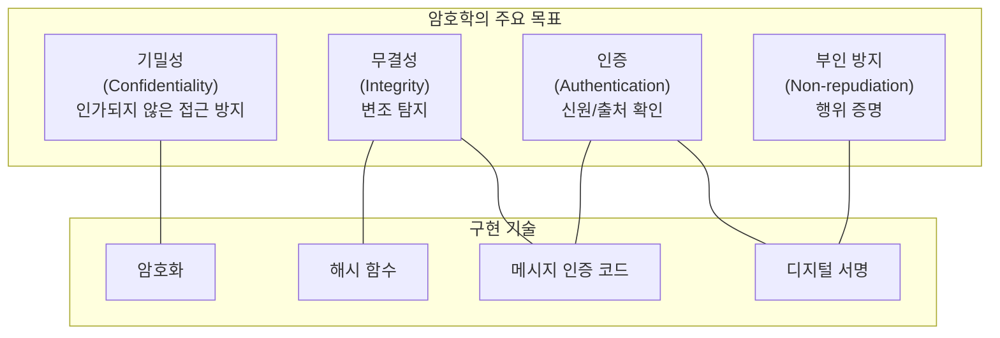
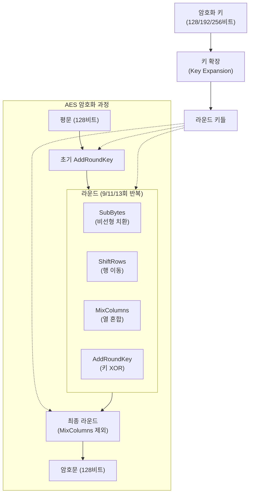
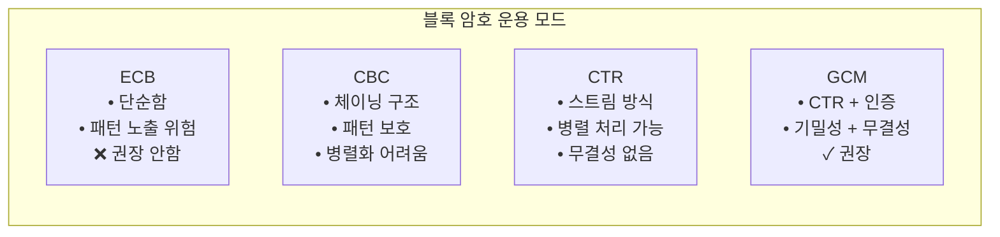
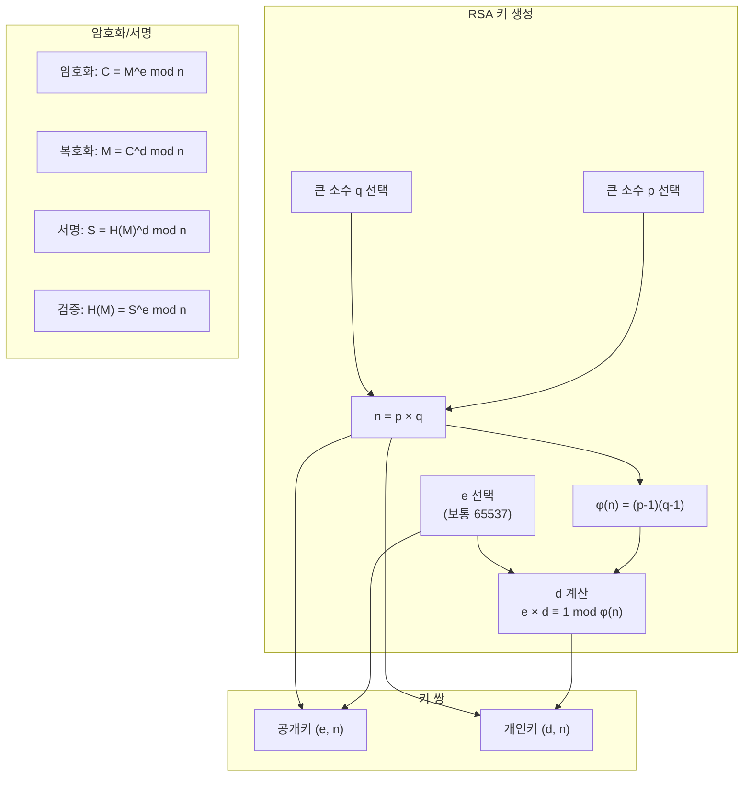
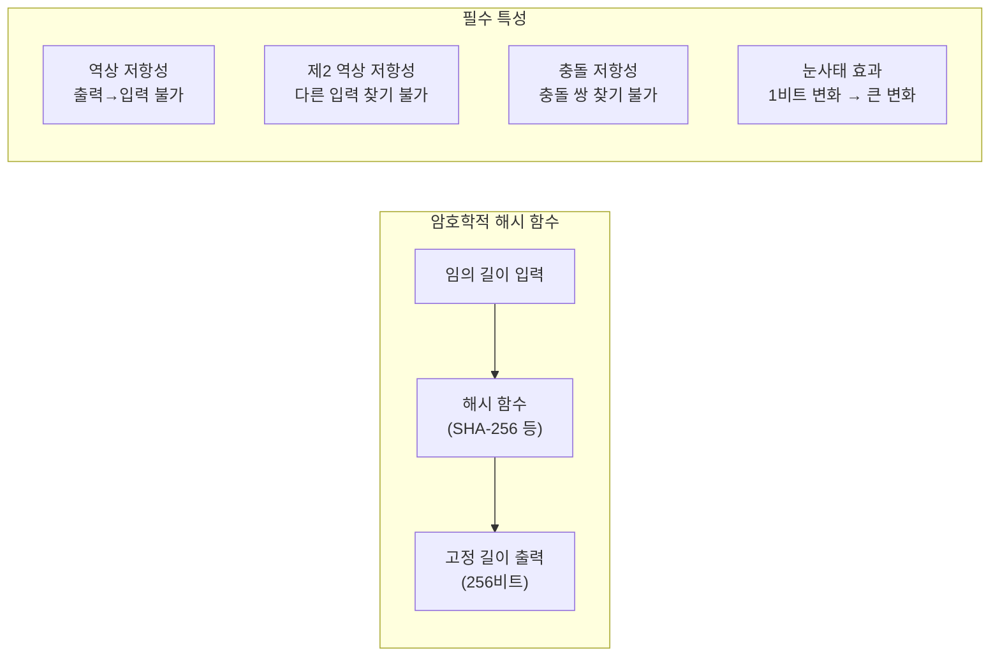
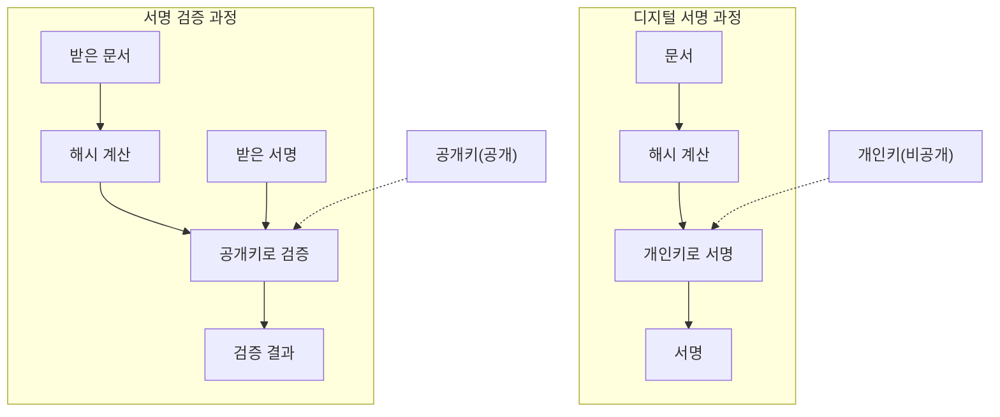

# Part 6: 암호화 기술 스택 상세 해설 (1) - 기초 암호학

## 차량 사이버보안의 기반이 되는 암호학 원리와 알고리즘

---

## 1. 암호학의 기본 개념

### 1.1 암호학이란 무엇인가

암호학(Cryptography)은 "비밀 기록"을 의미하는 그리스어에서 유래한 용어로서, 정보를 안전하게 전송하고 저장하기 위한 기술과 과학을 총칭한다. 현대 암호학은 단순히 정보를 숨기는 것을 넘어, 정보의 기밀성(Confidentiality), 무결성(Integrity), 인증(Authentication), 그리고 부인 방지(Non-repudiation)를 보장하기 위한 수학적 방법론을 제공한다.

차량 사이버보안의 맥락에서 암호학은 핵심적인 역할을 수행한다. 차량 내부 및 외부 통신의 보호, 소프트웨어 업데이트의 무결성 및 진정성 검증, 민감한 데이터의 안전한 저장, 그리고 접근 통제 메커니즘의 구현에 암호학 기술이 필수적으로 활용된다. UN R155와 R156이 요구하는 많은 보안 조치들은 그 기반에 암호학적 원리를 두고 있다.

### 1.2 암호학의 주요 목표

**기밀성(Confidentiality)**은 인가되지 않은 주체가 정보의 내용을 파악하지 못하도록 하는 것이다. 암호화(Encryption)가 기밀성을 달성하기 위한 주요 수단이며, 평문(Plaintext)을 암호문(Ciphertext)으로 변환하여 비밀 키 없이는 내용을 알 수 없도록 한다.

**무결성(Integrity)**은 정보가 전송 또는 저장 과정에서 변조되지 않았음을 보장하는 것이다. 해시 함수(Hash Function)와 메시지 인증 코드(Message Authentication Code, MAC)가 무결성 검증에 사용되며, 데이터의 작은 변화도 탐지할 수 있도록 한다.

**인증(Authentication)**은 통신 상대방 또는 데이터의 출처가 주장하는 바와 일치함을 확인하는 것이다. 디지털 서명과 인증서 기반 인증이 주요 인증 메커니즘이다.

**부인 방지(Non-repudiation)**는 어떤 행위를 수행한 주체가 나중에 해당 행위를 부인하지 못하도록 하는 것이다. 디지털 서명이 부인 방지를 제공하며, 서명자만이 자신의 개인키로 서명할 수 있으므로 서명 행위를 부인할 수 없다.

---

## 2. 대칭키 암호화

### 2.1 대칭키 암호화의 원리

대칭키 암호화(Symmetric Key Encryption)는 암호화와 복호화에 동일한 비밀 키를 사용하는 방식이다. 송신자와 수신자가 사전에 동일한 비밀 키를 공유하고 있어야 하며, 이 키의 비밀이 유지되는 한 제3자는 암호문을 해독할 수 없다.

대칭키 암호화의 장점은 연산 속도가 빠르다는 것이다. 비대칭키 암호화에 비해 수십에서 수백 배 빠른 성능을 보이므로, 대량의 데이터를 암호화할 때 효율적이다. 이러한 이유로 차량 내 통신 데이터의 암호화, 저장 데이터의 보호 등에 대칭키 암호화가 주로 사용된다.

그러나 대칭키 암호화에는 키 배포 문제(Key Distribution Problem)가 존재한다. 안전하게 통신하려면 사전에 비밀 키를 공유해야 하는데, 이 키 자체를 안전하게 전달하는 방법이 문제가 된다. 이 문제는 비대칭키 암호화를 활용한 키 교환(Key Exchange)으로 해결된다.

### 2.2 AES (Advanced Encryption Standard)

AES(Advanced Encryption Standard)는 현재 가장 널리 사용되는 대칭키 암호화 알고리즘이다. 2001년 미국 국립표준기술연구소(NIST)에 의해 연방 표준으로 채택되었으며, DES(Data Encryption Standard)를 대체하기 위해 개발되었다.

AES는 블록 암호(Block Cipher)로서, 고정 크기(128비트)의 데이터 블록 단위로 암호화를 수행한다. 키 길이는 128, 192, 또는 256비트를 지원하며, 키 길이에 따라 각각 AES-128, AES-192, AES-256으로 불린다. 키 길이가 길수록 보안 강도가 높아지지만 연산량도 증가한다.

**AES의 내부 구조**를 살펴보면, AES는 라운드(Round)라 불리는 변환 과정을 반복 적용하는 구조를 갖는다. AES-128은 10라운드, AES-192는 12라운드, AES-256은 14라운드를 수행한다. 각 라운드는 다음과 같은 네 가지 변환으로 구성된다.

**SubBytes**는 각 바이트를 S-box라 불리는 비선형 치환표를 통해 다른 값으로 치환하는 과정이다. 이 과정은 암호학적 혼돈(Confusion) 특성을 제공한다.

**ShiftRows**는 상태 행렬의 각 행을 서로 다른 오프셋만큼 순환 이동시키는 과정이다.

**MixColumns**는 상태 행렬의 각 열에 수학적 변환을 적용하여 열 내의 바이트들을 혼합하는 과정이다. 이 과정은 암호학적 확산(Diffusion) 특성을 제공한다.

**AddRoundKey**는 현재 라운드의 서브키(Subkey)를 상태에 XOR 연산으로 적용하는 과정이다.

### 2.3 블록 암호 운용 모드

AES와 같은 블록 암호는 고정 크기의 블록만을 처리하므로, 가변 길이의 메시지를 암호화하려면 운용 모드(Mode of Operation)를 적용해야 한다. 운용 모드는 블록 암호를 반복 적용하는 방식을 정의하며, 각 모드는 서로 다른 보안 특성과 용도를 갖는다.

**ECB(Electronic Codebook) 모드**는 가장 단순한 모드로서, 각 평문 블록을 독립적으로 암호화한다. 그러나 동일한 평문 블록은 동일한 암호문 블록을 생성하므로, 패턴이 노출될 수 있는 취약점이 있다. 이러한 이유로 ECB 모드는 실무에서 권장되지 않는다.

**CBC(Cipher Block Chaining) 모드**는 각 평문 블록을 이전 암호문 블록과 XOR한 후 암호화하는 방식이다. 첫 번째 블록의 경우 초기화 벡터(Initialization Vector, IV)가 사용된다. CBC 모드는 동일한 평문도 다른 IV를 사용하면 다른 암호문을 생성하므로 ECB의 패턴 노출 문제를 해결한다. 그러나 병렬 처리가 어렵고, 패딩 오라클 공격에 취약할 수 있다.

**CTR(Counter) 모드**는 블록 암호를 스트림 암호처럼 사용하는 방식이다. 카운터 값을 암호화하여 키 스트림을 생성하고, 이를 평문과 XOR하여 암호문을 얻는다. 병렬 처리가 가능하고 패딩이 필요 없다는 장점이 있다.

**GCM(Galois/Counter Mode) 모드**는 CTR 모드에 GHASH 인증을 결합한 인증 암호화(Authenticated Encryption) 모드이다. 기밀성과 무결성을 동시에 제공하며, 현재 TLS 1.3 등에서 권장되는 모드이다. 차량 보안 통신에서 AES-GCM이 널리 사용된다.

---

## 3. 비대칭키 암호화

### 3.1 비대칭키 암호화의 원리

비대칭키 암호화(Asymmetric Key Encryption), 또는 공개키 암호화(Public Key Encryption)는 암호화와 복호화에 서로 다른 두 개의 키를 사용하는 방식이다. 이 두 키는 수학적으로 연관되어 있지만, 하나의 키로부터 다른 키를 계산해내는 것은 계산적으로 불가능하도록 설계된다.

공개키(Public Key)는 누구에게나 공개될 수 있으며, 개인키(Private Key)는 소유자만이 비밀로 유지한다. 이러한 구조 덕분에 비대칭키 암호화는 대칭키 암호화의 키 배포 문제를 해결할 수 있다. 누군가에게 암호화된 메시지를 보내려면 그의 공개키로 암호화하면 되고, 오직 해당 개인키의 소유자만이 이를 복호화할 수 있다.

비대칭키 암호화의 또 다른 중요한 응용은 디지털 서명이다. 개인키로 데이터에 서명하면, 누구나 공개키로 서명을 검증할 수 있지만, 오직 개인키 소유자만이 유효한 서명을 생성할 수 있다.

비대칭키 암호화의 단점은 대칭키 암호화에 비해 연산 속도가 매우 느리다는 것이다. 따라서 대량의 데이터를 직접 비대칭키로 암호화하지 않고, 대신 대칭키(세션 키)를 비대칭키로 안전하게 교환한 후, 실제 데이터는 대칭키로 암호화하는 하이브리드 방식이 일반적으로 사용된다.

### 3.2 RSA 알고리즘

RSA는 1977년 Ron Rivest, Adi Shamir, Leonard Adleman에 의해 발명된 비대칭키 암호화 알고리즘으로, 발명자들의 이름 첫 글자를 따서 명명되었다. RSA는 큰 수의 소인수분해가 계산적으로 어렵다는 수학적 난제에 기반하고 있다.

**RSA 키 생성 과정**은 다음과 같다. 먼저 두 개의 큰 소수 p와 q를 선택하고, 이들의 곱 n = p × q를 계산한다. 이 n을 모듈러스(Modulus)라 부르며, n의 비트 수가 키 길이를 결정한다. 현재 권장되는 최소 키 길이는 2048비트이며, 높은 보안이 필요한 경우 3072비트 또는 4096비트가 사용된다.

다음으로 φ(n) = (p-1)(q-1)을 계산하고, 1 < e < φ(n)이면서 φ(n)과 서로소인 정수 e를 선택한다. 일반적으로 e = 65537이 사용된다. 마지막으로 e × d ≡ 1 (mod φ(n))을 만족하는 d를 계산한다.

공개키는 (e, n)이고, 개인키는 (d, n)이다. p, q, φ(n)은 키 생성 후 안전하게 폐기되어야 한다.

**RSA 암호화 및 복호화**에서, 평문 M을 암호화하려면 C = M^e mod n을 계산한다. 암호문 C를 복호화하려면 M = C^d mod n을 계산한다.

**RSA 서명**에서, 메시지 M에 서명하려면 S = H(M)^d mod n을 계산한다. 여기서 H(M)은 메시지의 해시 값이다. 서명 S를 검증하려면 H(M) = S^e mod n을 확인한다.

### 3.3 타원 곡선 암호화(ECC)

타원 곡선 암호화(Elliptic Curve Cryptography, ECC)는 타원 곡선의 수학적 특성에 기반한 비대칭키 암호화 기법이다. 타원 곡선 이산 로그 문제(Elliptic Curve Discrete Logarithm Problem, ECDLP)가 기존의 이산 로그 문제나 소인수분해 문제보다 더 어렵다는 점을 활용한다.

ECC의 가장 큰 장점은 RSA와 동등한 보안 수준을 훨씬 짧은 키 길이로 달성할 수 있다는 것이다. 예를 들어, RSA 2048비트와 동등한 보안 수준을 ECC는 224-256비트로 제공한다. 이러한 효율성은 리소스가 제한된 임베디드 시스템이 많은 차량 환경에서 매우 중요한 이점이 된다.

**타원 곡선의 수학적 기초**를 간략히 설명하면, 타원 곡선은 y² = x³ + ax + b 형태의 방정식으로 정의되는 곡선이다. 이 곡선 위의 점들은 특수한 덧셈 연산을 형성하며, 이 연산은 결합법칙을 만족한다.

기점(Base Point) G라 불리는 특정 점과 정수 k에 대해, kG = G + G + ... + G (k번)를 계산하는 것은 쉽다. 그러나 kG와 G가 주어졌을 때 k를 찾는 것(이것이 ECDLP)은 k가 충분히 크면 계산적으로 불가능하다.

**ECDSA(Elliptic Curve Digital Signature Algorithm)**는 ECC를 활용한 디지털 서명 알고리즘이다. 비트코인, TLS 등에서 널리 사용되며, 차량 보안에서도 코드 서명, 인증서 서명 등에 활용된다.

**ECDH(Elliptic Curve Diffie-Hellman)**는 ECC를 활용한 키 교환 프로토콜이다. 두 당사자가 안전하지 않은 채널을 통해 통신하면서도 공유 비밀값을 안전하게 생성할 수 있도록 한다.

| 보안 강도 (비트) | RSA 키 길이 | ECC 키 길이 | 효율성 |
|----------------|------------|------------|--------|
| 80 | 1024 | 160 | 6.4배 |
| 112 | 2048 | 224 | 9.1배 |
| 128 | 3072 | 256 | 12배 |
| 192 | 7680 | 384 | 20배 |
| 256 | 15360 | 512 | 30배 |

---

## 4. 해시 함수

### 4.1 해시 함수의 개념과 특성

암호학적 해시 함수(Cryptographic Hash Function)는 임의 길이의 입력을 받아 고정 길이의 출력(해시 값, 다이제스트)을 생성하는 함수이다. 암호학적 해시 함수는 다음과 같은 특성을 갖추어야 한다.

**결정론적(Deterministic)**: 동일한 입력에 대해 항상 동일한 출력을 생성한다.

**빠른 계산(Efficient)**: 입력 데이터의 해시 값을 빠르게 계산할 수 있다.

**역상 저항성(Pre-image Resistance)**: 해시 값 h가 주어졌을 때, h = H(m)을 만족하는 입력 m을 찾는 것이 계산적으로 불가능하다.

**제2 역상 저항성(Second Pre-image Resistance)**: 입력 m1이 주어졌을 때, H(m1) = H(m2)를 만족하는 다른 입력 m2를 찾는 것이 계산적으로 불가능하다.

**충돌 저항성(Collision Resistance)**: H(m1) = H(m2)를 만족하는 임의의 두 개의 서로 다른 입력 m1과 m2를 찾는 것이 계산적으로 불가능하다.

**눈사태 효과(Avalanche Effect)**: 입력의 작은 변화가 해시 값에 큰 변화를 야기한다. 일반적으로 입력의 1비트 변화가 출력의 약 50%의 비트를 변화시킨다.

### 4.2 SHA-256

SHA-256은 SHA-2(Secure Hash Algorithm 2) 계열에 속하는 해시 함수로서, 256비트(32바이트)의 해시 값을 생성한다. 미국 국가안보국(NSA)에 의해 설계되었으며, NIST에 의해 표준화되었다.

SHA-256은 입력 메시지를 512비트 블록으로 분할하고, 각 블록에 대해 64라운드의 압축 함수를 적용한다. 압축 함수는 논리 연산, 비트 회전, 그리고 모듈러 덧셈을 사용하며, 최종적으로 256비트의 해시 값을 출력한다.

현재 SHA-256은 디지털 서명, 메시지 인증, 비밀번호 해싱, 블록체인 등 다양한 분야에서 널리 사용되고 있다. 차량 보안에서는 소프트웨어 이미지의 무결성 검증, 코드 서명, 인증서 생성 등에 활용된다.

### 4.3 SHA-3

SHA-3은 Keccak 알고리즘을 기반으로 하며, 2015년 NIST에 의해 표준화되었다. SHA-3은 SHA-2와는 완전히 다른 구조(스펀지 구조)를 사용하며, SHA-2의 대안 또는 보완으로 설계되었다.

SHA-3의 주요 변형으로는 SHA3-224, SHA3-256, SHA3-384, SHA3-512가 있으며, 숫자는 출력 해시 값의 비트 수를 나타낸다. 또한 SHAKE128과 SHAKE256은 가변 길이 출력을 제공하는 확장 가능 출력 함수(Extendable-Output Function, XOF)이다.

SHA-3은 SHA-2에 대한 잠재적 취약점이 발견될 경우를 대비한 대안으로 개발되었지만, 현재까지 SHA-2에 심각한 취약점이 발견되지 않아 SHA-2가 여전히 널리 사용되고 있다.

---

## 5. 메시지 인증 코드(MAC)

### 5.1 MAC의 개념

메시지 인증 코드(Message Authentication Code, MAC)는 메시지의 무결성과 진정성을 동시에 검증하기 위한 암호학적 도구이다. MAC은 메시지와 비밀 키를 입력으로 받아 인증 태그를 생성하며, 동일한 비밀 키를 가진 수신자가 이 태그를 검증함으로써 메시지가 변조되지 않았고 적법한 발신자로부터 왔음을 확인할 수 있다.

MAC과 디지털 서명의 주요 차이점은 MAC이 대칭키를 사용한다는 것이다. 따라서 MAC은 부인 방지 기능을 제공하지 않는다. 발신자와 수신자가 동일한 키를 공유하므로, 수신자도 동일한 MAC을 생성할 수 있기 때문이다. 그러나 MAC은 디지털 서명보다 계산이 훨씬 효율적이므로, 통신 채널에서 메시지 단위의 실시간 인증에 적합하다.

### 5.2 HMAC

HMAC(Hash-based Message Authentication Code)은 해시 함수를 기반으로 하는 MAC 알고리즘이다. HMAC은 어떤 암호학적 해시 함수와도 결합하여 사용할 수 있으며, HMAC-SHA256은 SHA-256을 기반으로 하는 HMAC이다.

HMAC의 계산 과정은 다음과 같다.

HMAC(K, M) = H((K' ⊕ opad) || H((K' ⊕ ipad) || M))

여기서 K는 비밀 키, M은 메시지, H는 해시 함수, opad와 ipad는 정해진 패딩 상수이며, K'는 키를 해시 함수의 블록 크기에 맞게 조정한 것이다.

HMAC은 내부 해시 함수의 보안 특성에 의존하며, 해시 함수가 안전하다면 HMAC도 안전한 것으로 증명되어 있다.

### 5.3 CMAC

CMAC(Cipher-based Message Authentication Code)은 블록 암호를 기반으로 하는 MAC 알고리즘이다. AES-CMAC은 AES를 기반으로 하는 CMAC이다.

CMAC은 CBC-MAC의 보안 취약점을 개선한 것으로, 가변 길이 메시지에 대해 안전한 인증을 제공한다. CMAC은 특히 하드웨어 가속이 지원되는 환경에서 효율적이며, 차량 내 보안 통신에서 SecOC(Secure Onboard Communication) 표준에서 사용된다.

---

## 6. 디지털 서명

### 6.1 디지털 서명의 개념

디지털 서명(Digital Signature)은 전자 문서에 대한 서명자의 신원과 문서의 무결성을 보증하는 암호학적 메커니즘이다. 물리적 세계에서의 수기 서명과 유사한 역할을 하지만, 위조가 훨씬 어렵고 검증이 자동화되어 있다는 장점이 있다.

디지털 서명은 비대칭키 암호화에 기반하며, 서명자는 자신의 개인키로 서명하고, 누구나 서명자의 공개키로 서명을 검증할 수 있다. 디지털 서명의 주요 특성은 다음과 같다.

**인증(Authentication)**: 서명은 서명자의 개인키로만 생성될 수 있으므로, 유효한 서명은 해당 개인키의 소유자가 서명했음을 증명한다.

**무결성(Integrity)**: 서명 후 문서가 변경되면 서명 검증이 실패하므로, 서명은 문서의 무결성을 보장한다.

**부인 방지(Non-repudiation)**: 서명자만이 해당 서명을 생성할 수 있으므로, 서명자는 나중에 서명 행위를 부인할 수 없다.

### 6.2 서명 알고리즘

**RSA 서명**은 RSA 알고리즘을 사용한 디지털 서명이다. 메시지의 해시 값을 개인키로 암호화하여 서명을 생성하고, 공개키로 복호화하여 해시 값을 확인함으로써 서명을 검증한다. PKCS#1 v1.5와 PSS(Probabilistic Signature Scheme)가 RSA 서명의 주요 패딩 방식이다.

**ECDSA(Elliptic Curve Digital Signature Algorithm)**는 타원 곡선 암호화를 활용한 디지털 서명 알고리즘이다. RSA 서명과 동등한 보안 수준을 훨씬 짧은 키와 서명 길이로 제공하므로, 리소스 제약이 있는 환경에서 선호된다.

**EdDSA(Edwards-curve Digital Signature Algorithm)**는 트위스트 에드워즈 곡선을 사용하는 디지털 서명 알고리즘이다. Ed25519(Curve25519 기반)가 대표적이며, 높은 성능과 보안성을 제공한다.

### 6.3 차량 보안에서의 디지털 서명 활용

차량 사이버보안에서 디지털 서명은 다음과 같은 핵심 영역에서 활용된다.

**코드 서명(Code Signing)**에서 제조사는 차량에 배포되는 모든 소프트웨어 이미지에 디지털 서명을 적용한다. 차량의 부트로더와 업데이트 에이전트는 소프트웨어를 실행하거나 설치하기 전에 서명을 검증하여, 인가되지 않은 소프트웨어의 실행을 방지한다.

**인증서 서명**에서 차량용 PKI(Public Key Infrastructure)의 인증서들은 인증 기관(Certificate Authority)의 디지털 서명으로 보호된다. 이를 통해 인증서의 진정성이 보장된다.

**보안 진단 인증**에서 차량의 보호된 진단 기능에 접근하려면 디지털 서명을 통한 인증이 요구될 수 있다. 이는 무단 진단 접근을 방지한다.

---

## 7. 차량 사이버보안에서의 암호학 적용 사례

### 7.1 통신 보안

차량의 외부 통신(텔레매틱스, OTA 업데이트, 클라우드 연결 등)에는 TLS(Transport Layer Security) 프로토콜이 적용된다. TLS 1.3은 ECDHE(Elliptic Curve Diffie-Hellman Ephemeral) 키 교환, AES-GCM 암호화, 그리고 ECDSA 또는 EdDSA 서명을 조합하여 안전한 통신 채널을 구축한다.

차량 내부 통신(CAN 버스 등)에는 SecOC(Secure Onboard Communication) 표준이 적용될 수 있다. SecOC는 AES-CMAC을 사용하여 CAN 메시지의 무결성과 진정성을 보장한다.

### 7.2 소프트웨어 보호

Secure Boot는 부팅 과정에서 각 단계의 소프트웨어가 디지털 서명을 검증함으로써, 변조되거나 인가되지 않은 소프트웨어의 실행을 방지한다. 일반적으로 RSA 또는 ECDSA 서명이 사용된다.

소프트웨어 업데이트 패키지는 제조사의 개인키로 서명되며, 차량은 공개키로 서명을 검증한 후에만 업데이트를 설치한다.

### 7.3 키 관리

차량에 사용되는 암호화 키들은 HSM(Hardware Security Module)에 안전하게 저장된다. HSM은 키의 추출을 물리적으로 방지하고, 암호화 연산을 내부에서 수행함으로써 키 보안을 강화한다.

키 파생 함수(Key Derivation Function, KDF)는 마스터 키로부터 용도별 다양한 키를 안전하게 파생하는 데 사용된다. HKDF(HMAC-based Key Derivation Function)가 대표적인 KDF이다.

---

## 참고문헌

1. National Institute of Standards and Technology. (2001). FIPS 197: Advanced Encryption Standard (AES).
2. National Institute of Standards and Technology. (2015). FIPS 180-4: Secure Hash Standard (SHS).
3. National Institute of Standards and Technology. (2015). FIPS 202: SHA-3 Standard.
4. IETF. (2018). RFC 8446: The Transport Layer Security (TLS) Protocol Version 1.3.
5. AUTOSAR. (2021). Specification of Secure Onboard Communication.

---

*이전 편: [Part 5: 관련 국제 표준 - ISO/SAE 21434 및 ISO 24089](./05_related_standards.md)*

*다음 편: [Part 7: 암호화 기술 스택 상세 해설 (2) - 차량 보안 아키텍처](./07_vehicle_security_architecture.md)*
