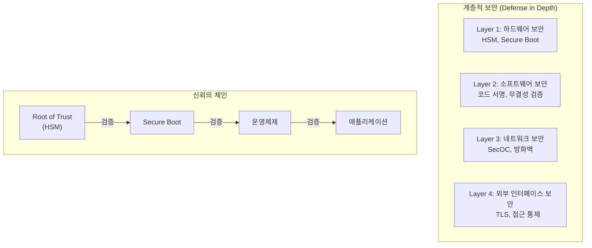
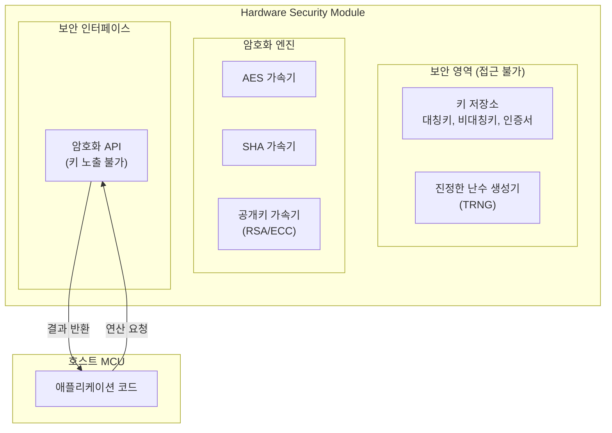
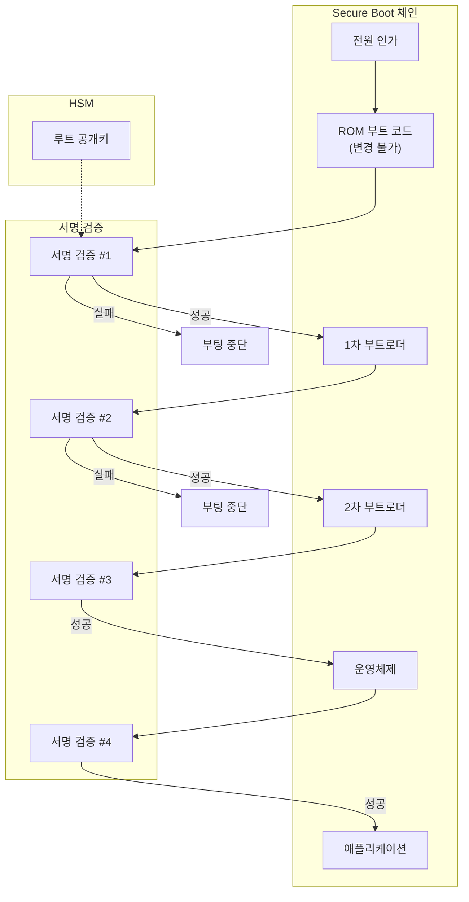
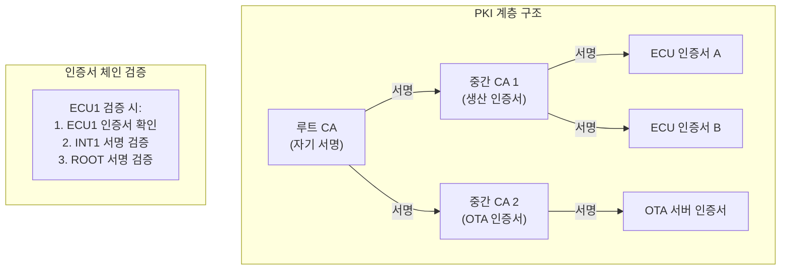
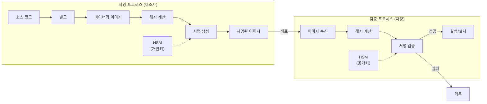
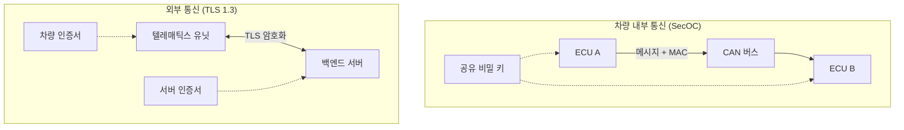
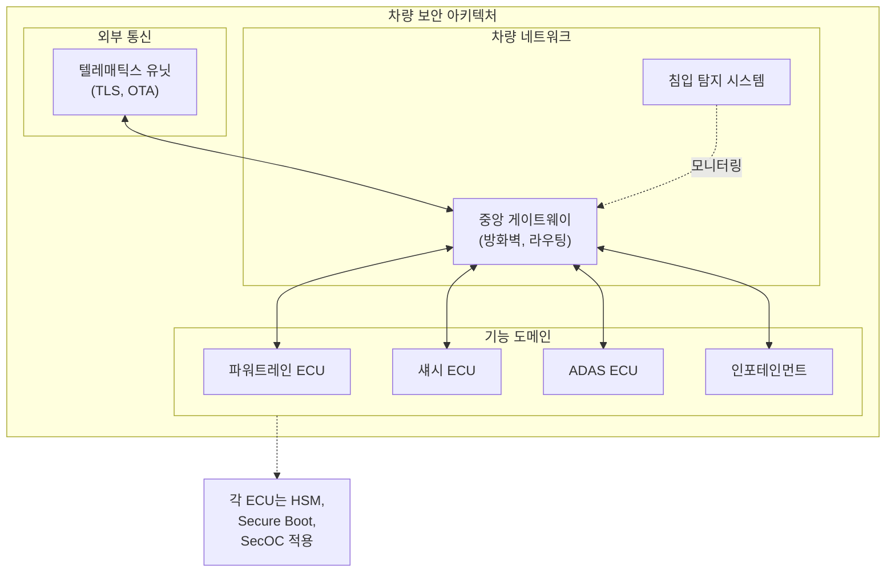

# Part 7: 암호화 기술 스택 상세 해설 (2) - 차량 보안 아키텍처

## HSM, Secure Boot, PKI, 코드 서명으로 구축하는 차량 보안 체계

---

## 1. 차량 보안 아키텍처 개요

### 1.1 계층적 보안의 필요성

현대 차량의 전자 시스템은 수십에서 수백 개의 ECU(Electronic Control Unit)로 구성되어 있으며, 이들은 CAN, CAN-FD, FlexRay, Automotive Ethernet 등의 네트워크로 연결되어 있다. 또한 차량은 셀룰러 네트워크, Wi-Fi, Bluetooth, V2X 통신 등을 통해 외부 세계와도 연결된다. 이러한 복잡한 구조에서 사이버보안을 효과적으로 달성하기 위해서는 계층적 보안(Defense in Depth) 접근이 필수적이다.

계층적 보안은 단일 보안 메커니즘의 실패가 전체 시스템의 보안 붕괴로 이어지지 않도록, 여러 레벨에서 중첩된 보안 조치를 적용하는 원칙이다. 차량의 맥락에서 이는 개별 ECU 수준의 보안, 차량 내 네트워크 수준의 보안, 그리고 차량과 외부 세계 간 인터페이스 수준의 보안을 모두 포함한다.

### 1.2 신뢰의 근원(Root of Trust)

계층적 보안 아키텍처의 기반이 되는 개념이 신뢰의 근원(Root of Trust, RoT)이다. RoT는 시스템의 보안이 출발하는 신뢰할 수 있는 컴포넌트로서, 일반적으로 변조가 불가능하거나 매우 어려운 하드웨어에 구현된다.

RoT는 다른 모든 보안 메커니즘의 신뢰성을 지탱하는 닻과 같은 역할을 한다. 예를 들어, Secure Boot에서 첫 번째 단계의 부트 코드는 RoT에 의해 검증되며, 이후 단계들은 앞 단계의 검증 결과를 바탕으로 신뢰가 체인처럼 연결된다. 만약 RoT 자체가 손상된다면 전체 보안 체계가 무너지게 되므로, RoT는 가장 높은 수준의 보호를 받아야 한다.

차량에서 RoT는 일반적으로 HSM(Hardware Security Module) 또는 이와 유사한 하드웨어 보안 모듈에 의해 제공된다.

---

## 2. Hardware Security Module (HSM)

### 2.1 HSM의 정의와 역할

하드웨어 보안 모듈(Hardware Security Module, HSM)은 암호화 키의 안전한 저장과 암호화 연산의 수행을 전담하는 보안 하드웨어 컴포넌트이다. HSM은 물리적 공격과 논리적 공격 모두로부터 암호화 키를 보호하도록 설계되며, 키가 HSM 외부로 추출되는 것을 방지한다.

차량용 HSM은 일반적으로 마이크로컨트롤러(MCU)에 통합된 형태로 제공된다. Infineon의 AURIX TC3xx 시리즈, NXP의 S32K/S32G 시리즈, Renesas의 RH850 시리즈 등 주요 차량용 마이크로컨트롤러들이 내장 HSM을 제공하고 있다. 이러한 통합 HSM은 별도의 외부 보안 장치가 필요 없어 비용과 공간 측면에서 유리하다.

### 2.2 HSM의 주요 기능

**보안 키 저장(Secure Key Storage)**에서 HSM은 암호화 키를 내부의 보호된 메모리 영역에 저장한다. 이 영역은 정상적인 MCU 코드에서 직접 접근할 수 없으며, 오직 HSM 펌웨어를 통해서만 키를 사용할 수 있다. 키 자체는 결코 HSM 외부로 노출되지 않으며, 외부에서 요청하면 HSM 내부에서 해당 키를 사용한 연산 결과만을 반환한다.

**암호화 연산 가속(Cryptographic Acceleration)**에서 HSM은 AES, SHA, RSA, ECC 등 주요 암호화 알고리즘을 하드웨어로 구현하여 빠른 연산 속도를 제공한다. 소프트웨어로 구현된 암호화 연산에 비해 수십에서 수백 배 빠른 성능을 달성할 수 있으며, 이는 실시간 통신 보안 등에서 중요한 이점이 된다.

**난수 생성(Random Number Generation)**에서 HSM은 진정한 난수 생성기(True Random Number Generator, TRNG)를 내장하여 암호학적으로 안전한 난수를 생성한다. 난수는 키 생성, 초기화 벡터 생성, 챌린지-응답 인증 등에 필수적이다.

**Secure Boot 지원**에서 HSM은 부팅 과정에서 소프트웨어 이미지의 서명을 검증하는 기능을 제공한다. RoT의 역할을 수행하며, 첫 번째 단계 부트로더의 무결성을 검증하는 것이 HSM의 핵심 역할 중 하나이다.

**물리적 공격 방어(Tamper Resistance)**에서 HSM은 사이드 채널 공격(Side-Channel Attack), 결함 주입 공격(Fault Injection Attack), 물리적 탐침(Physical Probing) 등의 공격에 대한 방어 메커니즘을 구현한다. 비정상적인 동작이나 환경 변화가 감지되면 저장된 키를 삭제하는 기능도 포함될 수 있다.

### 2.3 차량용 HSM 아키텍처

차량용 마이크로컨트롤러에 통합된 HSM의 일반적인 아키텍처를 살펴보면, HSM은 호스트 CPU와 분리된 별도의 프로세서 코어를 가지며, 자체적인 펌웨어를 실행한다. HSM과 호스트 CPU 간의 통신은 메일박스(Mailbox) 또는 공유 메모리를 통해 이루어지며, 엄격한 접근 제어가 적용된다.

HSM 내부에는 플래시 메모리, RAM, 키 저장용 OTP(One-Time Programmable) 메모리 등이 포함되며, 이들은 호스트 측에서 직접 접근할 수 없도록 하드웨어적으로 격리되어 있다. 이러한 격리 덕분에 호스트 측 소프트웨어에 취약점이 발생하더라도 HSM에 저장된 키는 보호된다.

주요 차량용 HSM의 예로는 Infineon AURIX TC3xx의 HSM, NXP S32K3의 HSE(Hardware Security Engine), Renesas RH850의 ICU-M 등이 있다.

---

## 3. Secure Boot

### 3.1 Secure Boot의 개념

Secure Boot는 시스템 부팅 과정에서 각 단계의 소프트웨어가 정당한 출처에서 제공되었고 변조되지 않았음을 검증하는 보안 메커니즘이다. 검증에 실패한 소프트웨어는 실행이 거부되며, 이를 통해 악성 소프트웨어나 변조된 펌웨어의 실행을 방지할 수 있다.

Secure Boot의 핵심 원리는 "신뢰의 체인(Chain of Trust)"이다. 가장 처음 실행되는 코드(ROM에 저장된 부트 코드)는 수정이 불가능하며 무조건 신뢰된다. 이 코드가 다음 단계(1차 부트로더)의 무결성을 검증하고, 검증에 성공하면 그 다음 단계를 검증하는 방식으로 신뢰가 전파된다. 이 체인의 어떤 단계에서든 검증이 실패하면 부팅이 중단된다.

### 3.2 Secure Boot의 동작 과정

전형적인 차량 ECU의 Secure Boot 과정은 다음과 같이 진행된다.

**1단계: ROM 부트 코드 실행**에서 ECU에 전원이 인가되면 칩에 내장된 ROM의 부트 코드가 가장 먼저 실행된다. 이 코드는 제조 시 기록되어 변경이 불가능하며, RoT의 역할을 수행한다. ROM 코드는 HSM을 초기화하고 HSM에 저장된 루트 공개키를 사용하여 1차 부트로더의 서명을 검증한다.

**2단계: 1차 부트로더 검증 및 실행**에서 ROM 코드가 1차 부트로더의 서명을 성공적으로 검증하면, 제어권이 1차 부트로더로 이전된다. 서명 검증에 실패하면 부팅이 중단되고 오류 상태로 진입한다.

**3단계: 2차 부트로더 검증 및 실행**에서 1차 부트로더는 2차 부트로더(또는 OS 부트로더)의 서명을 검증한다. 이 단계에서 하드웨어 초기화, 메모리 설정 등의 추가 작업도 수행될 수 있다.

**4단계: 운영체제 및 애플리케이션 검증**에서 부트로더 체인이 완료되면 운영체제 커널이 로드되고 검증된다. 일부 시스템에서는 개별 애플리케이션까지도 실행 전에 서명 검증이 수행된다.

### 3.3 서명 검증 메커니즘

Secure Boot에서 소프트웨어 이미지의 서명 검증은 일반적으로 다음 과정을 따른다.

먼저 소프트웨어 이미지에 첨부된 서명 데이터(헤더)를 읽어 서명 알고리즘, 해시 알고리즘, 그리고 서명 자체를 추출한다. 다음으로 소프트웨어 이미지 본체에 대해 지정된 해시 알고리즘(예: SHA-256)을 적용하여 해시 값을 계산한다.

그 다음 HSM에 저장된 공개키를 사용하여 서명을 검증한다. RSA의 경우 서명을 공개키로 복호화하고, 결과가 계산한 해시 값과 일치하는지 확인한다. ECDSA의 경우 서명 검증 알고리즘을 통해 유효성을 확인한다.

해시 값이 일치하면 서명이 유효한 것이며, 해당 소프트웨어가 개인키 소유자(즉, 제조사)에 의해 서명되었고 서명 이후 변조되지 않았음이 증명된다.

### 3.4 Measured Boot

Secure Boot와 관련된 개념으로 Measured Boot가 있다. Measured Boot는 각 부팅 단계에서 실행되는 소프트웨어의 측정치(일반적으로 해시 값)를 기록하는 방식이다. 이 측정치는 TPM(Trusted Platform Module) 또는 HSM 내의 PCR(Platform Configuration Register)에 저장되며, 부팅 완료 후 원격 검증(Remote Attestation)에 활용될 수 있다.

Secure Boot가 부팅을 차단하거나 허용하는 방식이라면, Measured Boot는 부팅 과정을 기록하고 후속 검증을 지원하는 방식이다. 두 접근 방식은 상호 보완적으로 함께 사용될 수 있다.

---

## 4. 공개키 기반구조 (PKI)

### 4.1 PKI의 개념과 구성요소

공개키 기반구조(Public Key Infrastructure, PKI)는 공개키와 그 소유자의 신원을 연결하여 신뢰를 확립하는 체계이다. PKI는 디지털 인증서, 인증 기관, 등록 기관, 그리고 인증서 저장소 등의 구성요소로 이루어진다.

**인증 기관(Certificate Authority, CA)**은 디지털 인증서를 발급하고 관리하는 신뢰된 기관이다. CA는 인증서 요청자의 신원을 확인한 후, 그의 공개키에 대해 자신의 개인키로 서명하여 인증서를 발급한다. CA의 서명은 해당 인증서의 신뢰성을 보증한다.

**디지털 인증서(Digital Certificate)**는 공개키와 그 소유자의 신원 정보, 유효 기간, 그리고 CA의 서명을 포함하는 전자 문서이다. X.509가 가장 널리 사용되는 인증서 형식이다.

**등록 기관(Registration Authority, RA)**은 CA를 대신하여 인증서 요청자의 신원을 확인하는 역할을 수행할 수 있다. 대규모 PKI에서 CA의 부담을 분산시키기 위해 RA가 활용된다.

**인증서 저장소(Certificate Repository)**는 발급된 인증서와 인증서 폐지 목록(Certificate Revocation List, CRL)을 저장하고 배포하는 장소이다.

### 4.2 인증서 계층 구조

PKI는 일반적으로 계층적 신뢰 모델을 따른다. 최상위에는 루트 CA(Root CA)가 있으며, 루트 CA의 인증서는 자기 서명(Self-signed)된다. 루트 CA 아래에는 하나 이상의 중간 CA(Intermediate CA 또는 Subordinate CA)가 있을 수 있으며, 중간 CA의 인증서는 상위 CA에 의해 서명된다.

실제 엔티티(차량, ECU, 사용자 등)의 인증서는 중간 CA 또는 루트 CA에 의해 발급되며, 이를 엔드 엔티티 인증서(End Entity Certificate)라 부른다. 인증서를 검증할 때는 엔드 엔티티 인증서에서 시작하여 루트 CA까지 서명을 따라 올라가며, 모든 서명이 유효하면 인증서가 신뢰된다.

차량 PKI의 경우, OEM이 루트 CA의 역할을 수행하고, 차량 모델별 또는 기능별로 중간 CA를 운영하는 구조가 일반적이다. 개별 ECU에는 중간 CA에 의해 발급된 디바이스 인증서가 저장된다.

### 4.3 차량용 PKI의 특수 고려사항

차량 환경에서 PKI를 운영할 때는 몇 가지 특수한 고려사항이 있다.

**인증서 수명 관리**에서 차량의 수명은 10년 이상에 달할 수 있으므로, 인증서의 유효 기간과 갱신 메커니즘을 신중하게 설계해야 한다. 또한 암호화 알고리즘의 수명(예: RSA 2048의 안전 사용 기간)도 고려해야 한다.

**오프라인 동작 지원**에서 차량은 네트워크 연결이 없는 상태에서도 동작해야 하므로, 인증서 검증이 오프라인에서도 가능해야 한다. CRL을 주기적으로 다운로드하여 로컬에 캐시하거나, OCSP Stapling을 활용하는 방법이 사용된다.

**대량 디바이스 관리**에서 하나의 차량에 수십 개의 ECU가 있고, 제조사는 수백만 대의 차량을 관리해야 하므로, 인증서 발급과 관리의 자동화 및 확장성이 중요하다.

**보안 프로비저닝**에서 ECU 제조 또는 차량 조립 과정에서 각 ECU에 고유한 키 쌍과 인증서를 안전하게 주입하는 프로비저닝 프로세스가 필요하다. 이 과정에서 키의 노출을 방지하기 위한 강력한 보안 조치가 요구된다.

---

## 5. 코드 서명

### 5.1 코드 서명의 개념과 목적

코드 서명(Code Signing)은 소프트웨어 이미지에 개발자 또는 배포자의 디지털 서명을 적용하여, 소프트웨어의 출처(진정성)와 변조 여부(무결성)를 검증할 수 있도록 하는 과정이다.

차량 사이버보안에서 코드 서명은 핵심적인 역할을 수행한다. R155와 R156은 소프트웨어 업데이트의 무결성과 진정성을 보장하도록 요구하며, 코드 서명은 이 요구사항을 충족하기 위한 핵심 기술이다. 서명되지 않았거나 유효하지 않은 서명을 가진 소프트웨어는 Secure Boot 과정에서 거부되어 실행되지 않는다.

### 5.2 코드 서명 프로세스

코드 서명은 다음과 같은 단계로 수행된다.

**소프트웨어 빌드**에서 소스 코드가 컴파일되어 실행 가능한 바이너리 이미지가 생성된다. 이 단계에서는 아직 서명이 적용되지 않은 상태이다.

**해시 계산**에서 빌드된 바이너리 이미지에 대해 암호학적 해시(예: SHA-256)가 계산된다. 이 해시 값은 이미지의 "지문(Fingerprint)"으로 기능한다.

**서명 생성**에서 계산된 해시 값이 서명자의 개인키로 암호화되어 디지털 서명이 생성된다. 개인키는 철저히 보호되어야 하며, 일반적으로 HSM에 저장되어 직접 접근되지 않는다.

**서명 첨부**에서 생성된 서명은 바이너리 이미지에 첨부된다. 일반적으로 이미지 헤더에 서명과 관련 메타데이터(사용된 알고리즘, 서명자 인증서 참조 등)가 포함된다.

**배포**에서 서명된 소프트웨어 이미지가 차량에 배포된다. OTA 업데이트, 정비소 업데이트, 또는 생산 라인에서의 초기 플래싱 등 다양한 경로로 배포될 수 있다.

**검증**에서 차량의 부트로더 또는 업데이트 에이전트는 소프트웨어를 실행하거나 설치하기 전에 서명을 검증한다. 서명자의 공개키(인증서를 통해 얻음)로 서명을 복호화하고, 결과가 독자적으로 계산한 해시 값과 일치하는지 확인한다.

### 5.3 코드 서명 인프라

대규모 소프트웨어 개발 조직에서 코드 서명은 체계화된 인프라를 통해 관리된다.

**서명 서버(Signing Server)**는 코드 서명 요청을 처리하는 중앙 서버이다. 개인키는 서명 서버에 연결된 HSM에 안전하게 저장되며, 개발자는 API를 통해 서명을 요청한다.

**접근 통제**에서 서명 권한은 인가된 사용자와 프로세스에만 부여된다. 일반 개발자는 빌드 시스템을 통해서만 간접적으로 서명을 요청할 수 있으며, 서명 키에 직접 접근할 수 없다.

**감사 로깅(Audit Logging)**에서 모든 서명 요청과 처리 결과는 기록되어, 나중에 어떤 소프트웨어가 언제, 누구에 의해 서명되었는지 추적할 수 있다.

**키 관리**에서 서명 키의 생성, 저장, 백업, 교체, 폐기 등의 전 수명주기가 체계적으로 관리된다. 키 유출 시 피해를 최소화하기 위해 정기적인 키 교체가 권장된다.

---

## 6. 보안 통신

### 6.1 차량 내부 통신 보안: SecOC

SecOC(Secure Onboard Communication)는 AUTOSAR에서 정의한 차량 내부 통신 보안 표준이다. CAN, CAN-FD, FlexRay, Ethernet 등 다양한 차량 네트워크 프로토콜에 적용될 수 있으며, 메시지의 무결성과 진정성을 보장한다.

SecOC는 각 메시지에 메시지 인증 코드(MAC)를 첨부하는 방식으로 동작한다. 송신 ECU는 공유 비밀 키를 사용하여 메시지에 대한 MAC을 계산하고, 이를 메시지와 함께 전송한다. 수신 ECU는 동일한 키로 MAC을 재계산하여 수신된 MAC과 비교함으로써 메시지의 무결성과 진정성을 검증한다.

SecOC는 프레시니스 값(Freshness Value)을 사용하여 재전송 공격(Replay Attack)을 방지한다. 프레시니스 값은 시퀀스 번호, 타임스탬프 등으로 구현될 수 있으며, 동일한 메시지가 재사용되는 것을 탐지할 수 있도록 한다.

### 6.2 외부 통신 보안: TLS

차량과 외부 서버(텔레매틱스 백엔드, OTA 업데이트 서버 등) 간의 통신에는 TLS(Transport Layer Security)가 사용된다. TLS 1.3은 현재 권장되는 버전이며, 이전 버전에 비해 보안성과 성능이 개선되었다.

TLS 1.3의 핵심 특징은 다음과 같다.

**핸드셰이크 간소화**에서 TLS 1.3은 1-RTT(Round-Trip Time) 핸드셰이크를 지원하여 연결 수립 시간을 단축한다. 또한 0-RTT 모드를 통해 재연결 시 지연을 더욱 줄일 수 있다.

**강화된 암호 스위트**에서 TLS 1.3은 안전하지 않은 것으로 간주되는 레거시 알고리즘(RSA 키 교환, CBC 모드 등)을 제거하고, AEAD(Authenticated Encryption with Associated Data) 암호 스위트만을 지원한다.

**전방 비밀성(Forward Secrecy)**에서 TLS 1.3은 모든 키 교환에 일시적(Ephemeral) 키를 사용하여, 장기 개인키가 나중에 유출되더라도 과거 통신 내용이 복호화되지 않도록 한다.

---

## 7. 통합 보안 아키텍처 사례

### 7.1 ECU 수준 보안 아키텍처

개별 ECU 수준에서 보안 아키텍처의 일반적인 구성은 다음과 같다.

**하드웨어 계층**에서 차량용 마이크로컨트롤러는 통합 HSM, 메모리 보호 유닛(MPU), 그리고 보안 부팅을 위한 BootROM을 포함한다. HSM은 키 저장, 암호화 연산, 그리고 Secure Boot 검증을 담당한다.

**부트로더 계층**에서 다단계 부트로더가 HSM의 지원을 받아 Secure Boot를 수행한다. 각 단계는 다음 단계를 검증한 후에만 제어를 넘긴다.

**운영체제 및 런타임 계층**에서 운영체제(AUTOSAR Classic/Adaptive, Linux 등)가 실행되며, 보안 서비스(암호화 API, 키 관리, 인증서 관리 등)를 상위 애플리케이션에 제공한다.

**애플리케이션 계층**에서 차량 기능을 구현하는 애플리케이션 소프트웨어가 실행되며, 필요시 운영체제의 보안 서비스를 호출하여 암호화 연산, 인증 등을 수행한다.

### 7.2 차량 수준 보안 아키텍처

차량 전체 수준에서 보안 아키텍처는 다음과 같은 요소들을 포함한다.

**중앙 게이트웨이**는 차량 내 다양한 네트워크 도메인(파워트레인, 섀시, 인포테인먼트, ADAS 등) 사이의 통신을 제어하고, 방화벽 역할을 수행한다. 무단 통신을 차단하고, 이상 패턴을 탐지하는 기능을 가질 수 있다.

**침입 탐지 시스템(IDS)**은 차량 네트워크의 통신을 모니터링하여 비정상적인 패턴이나 알려진 공격 시그니처를 탐지한다. 탐지된 이벤트는 로깅되고, 심각도에 따라 대응 조치가 트리거될 수 있다.

**보안 이벤트 로깅**에서 보안 관련 이벤트(인증 실패, 비정상 접근 시도, 업데이트 결과 등)가 기록되어, 추후 분석 및 포렌식에 활용된다.

**텔레매틱스 유닛**은 차량과 외부 세계 간의 통신 게이트웨이 역할을 하며, TLS를 통한 보안 통신, OTA 업데이트 수신 및 검증, 그리고 원격 진단 등의 기능을 수행한다.

---

## 참고문헌

1. AUTOSAR. (2021). Specification of Secure Onboard Communication.
2. AUTOSAR. (2021). Specification of Crypto Service Manager.
3. Infineon. (2022). AURIX TC3xx Hardware Security Module - User Manual.
4. NXP. (2022). S32K3 Hardware Security Engine (HSE) Reference Manual.
5. IETF. (2018). RFC 8446: The Transport Layer Security (TLS) Protocol Version 1.3.

---

*이전 편: [Part 6: 암호화 기술 스택 상세 해설 (1) - 기초 암호학](./06_cryptography_fundamentals.md)*

*다음 편: [Part 8: 소프트웨어 개발 실무 적용 가이드](./08_sw_development_guide.md)*
