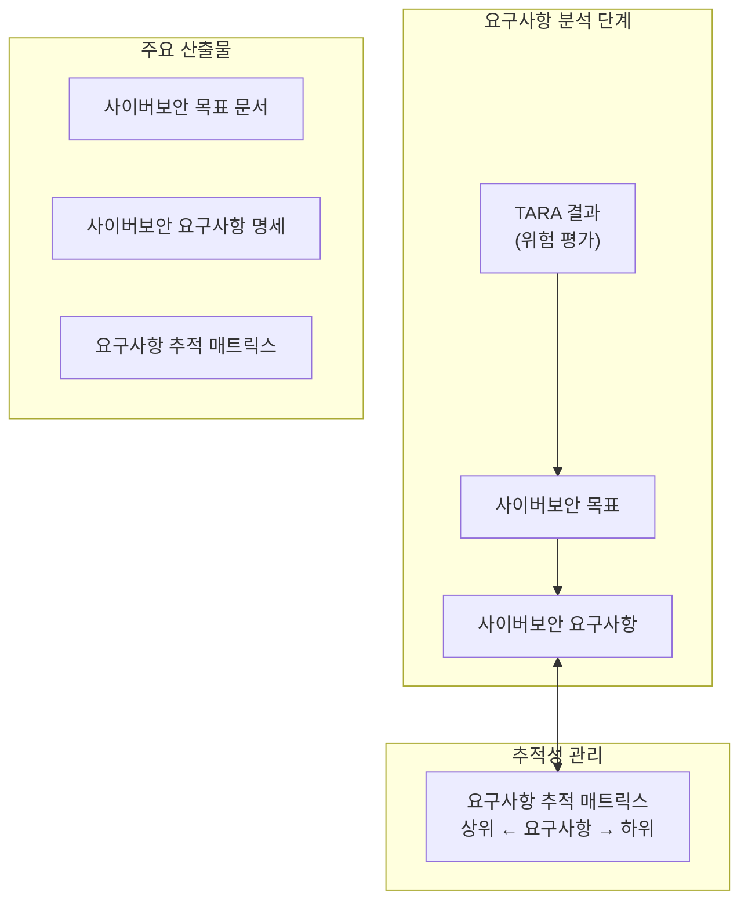
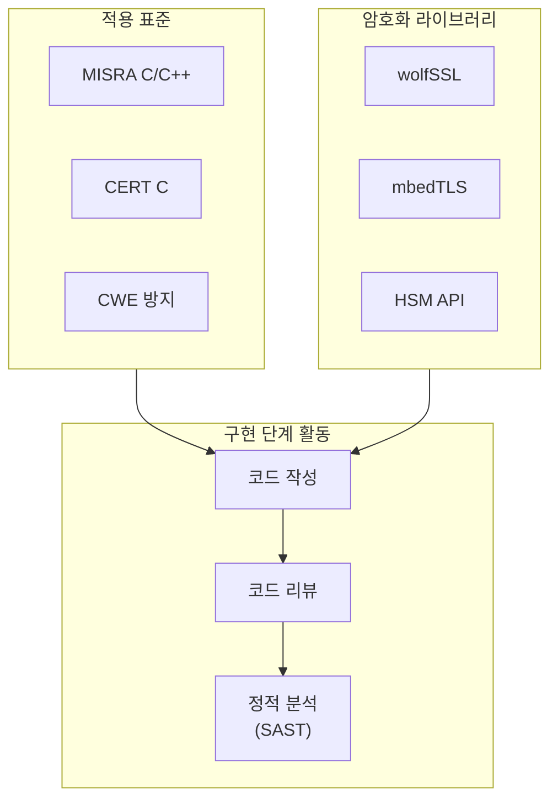
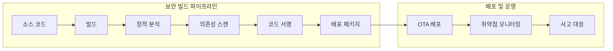

# Part 8: 소프트웨어 개발 실무 적용 가이드

## 법규 요구사항을 소프트웨어 개발 활동에 반영하기 위한 실무 지침

---

## 1. 개요

앞선 문서들에서 UN R155/R156 법규의 요구사항, 관련 국제 표준(ISO/SAE 21434, ISO 24089), 그리고 암호화 기술과 보안 아키텍처에 대해 상세히 살펴보았다. 본 문서에서는 이러한 이론적 지식을 실제 소프트웨어 개발 프로세스에 어떻게 반영해야 하는지에 대한 실무적 가이드를 제공한다.

차량 사이버보안 법규 준수는 단순히 기술적 보안 조치의 구현만으로 달성될 수 없다. 개발 프로세스 전반에 걸쳐 사이버보안 활동이 통합되어야 하며, 조직의 역량과 문화가 이를 뒷받침해야 한다. 본 가이드는 소프트웨어 개발 수명주기(Software Development Life Cycle, SDLC)의 각 단계에서 수행해야 하는 사이버보안 활동을 설명하고, 필요한 기술 스택과 도구에 대한 권장사항을 제시한다.

---

## 2. 개발 프로세스 단계별 사이버보안 활동

### 2.1 요구사항 분석 단계

요구사항 분석 단계에서는 제품이 달성해야 하는 사이버보안 목표를 정의하고, 이를 구체적인 사이버보안 요구사항으로 도출하는 활동이 수행된다.

**사이버보안 목표 정의**에서 TARA(Threat Analysis and Risk Assessment) 결과에 기반하여 제품이 달성해야 하는 상위 수준의 사이버보안 목표가 정의된다. 예를 들어, "원격 공격자가 차량의 브레이크 시스템에 비인가 명령을 전송하는 것을 방지한다"와 같은 형태로 표현될 수 있다. 사이버보안 목표는 위험 평가에서 식별된 주요 위험에 대응하여 수립된다.

**사이버보안 요구사항 도출**에서 사이버보안 목표를 달성하기 위한 구체적인 기술적 요구사항이 도출된다. 이 요구사항은 검증 가능하고 추적 가능해야 하며, ISO/SAE 21434의 요구사항 형식을 따르는 것이 권장된다. 예를 들어:

- "모든 진단 통신은 AES-128-GCM으로 암호화되어야 한다."
- "소프트웨어 업데이트 패키지는 ECDSA P-256 서명으로 검증되어야 한다."
- "CAN 버스 메시지는 SecOC에 따른 MAC으로 인증되어야 한다."

**추적성 관리**에서 사이버보안 요구사항은 상위의 사이버보안 목표, 그리고 하위의 설계/구현과 양방향으로 추적 가능해야 한다. 요구사항 관리 도구(예: DOORS, Jama, Polarion)를 활용하여 추적성 매트릭스를 유지한다. 이 추적성은 형식 승인 심사에서 증거 자료로 활용된다.

### 2.2 설계 단계

설계 단계에서는 사이버보안 요구사항을 충족하기 위한 기술적 아키텍처와 상세 설계가 수립된다.

**보안 아키텍처 설계**에서 시스템의 전체적인 보안 아키텍처가 정의된다. 여기에는 ECU 간 통신 보안 설계, 외부 인터페이스 보안 설계, 키 관리 아키텍처, 그리고 보안 부팅 체인 설계 등이 포함된다. 아키텍처 설계 시 다음과 같은 보안 원칙이 적용되어야 한다.

**최소 권한 원칙(Least Privilege)**에서 각 컴포넌트는 자신의 기능 수행에 필요한 최소한의 권한만을 갖도록 설계된다. 불필요한 인터페이스는 비활성화하고, 접근 통제 메커니즘을 적용한다.

**심층 방어(Defense in Depth)**에서 단일 보안 조치에 의존하지 않고, 여러 계층에서 중첩된 보안 조치를 적용한다. 외부 방어선이 뚫리더라도 내부 방어선이 추가적인 보호를 제공하도록 한다.

**안전한 기본 설정(Secure Defaults)**에서 시스템의 기본 설정은 보안적으로 가장 안전한 상태로 구성된다. 선택적으로 보안 수준을 낮추는 것은 가능하지만, 기본값은 최대 보안을 제공해야 한다.

**보안 프로토콜 및 알고리즘 선정**에서 각 보안 기능에 적용할 암호화 프로토콜, 알고리즘 및 키 길이가 선정된다. 선정 시 현재의 보안 권고사항과 암호학적 민첩성(Cryptographic Agility)을 고려해야 한다. 일반적인 권장사항은 다음과 같다.

| 용도 | 권장 알고리즘 | 최소 키 길이 |
|------|-------------|-------------|
| 대칭 암호화 | AES-GCM | 128비트 |
| 해시 | SHA-256, SHA-3-256 | 256비트 출력 |
| 비대칭 암호화/서명 | ECDSA, EdDSA | P-256 이상 |
| 키 교환 | ECDH | P-256 이상 |
| 메시지 인증 | HMAC-SHA256, AES-CMAC | 128비트 이상 |
| TLS | TLS 1.3 | - |

### 2.3 구현 단계

구현 단계에서는 설계를 실제 코드로 변환하는 과정에서 보안 코딩 표준을 준수하고, 보안 취약점을 방지하기 위한 활동이 수행된다.

**보안 코딩 표준 적용**에서 MISRA C, CERT C/C++, CWE(Common Weakness Enumeration) 등의 보안 코딩 표준 및 가이드라인을 적용한다. 이러한 표준은 버퍼 오버플로, 정수 오버플로, 메모리 누수, 포맷 스트링 취약점 등 일반적인 소프트웨어 취약점을 방지하기 위한 코딩 규칙을 제공한다.

임베디드 시스템의 일반적인 보안 코딩 규칙 예시는 다음과 같다.

- 모든 외부 입력에 대해 범위 및 형식 검증을 수행한다.
- 동적 메모리 할당을 최소화하고, 사용 시 할당/해제를 쌍으로 관리한다.
- 버퍼 접근 시 항상 경계 검사를 수행한다.
- 암호화 키와 민감 데이터는 사용 후 메모리에서 즉시 삭제한다.
- 비밀 정보에 대한 비교 연산은 타이밍 공격에 저항하도록 상수 시간으로 구현한다.

**암호화 라이브러리 활용**에서 암호화 기능은 자체 구현하지 않고, 검증된 암호화 라이브러리를 사용한다. 자체 구현은 사이드 채널 공격 등에 취약할 수 있으며, 권장되지 않는다. 차량용으로 널리 사용되는 암호화 라이브러리는 다음과 같다.

- **wolfSSL/wolfCrypt**: 경량 임베디드 환경에 적합한 TLS 및 암호화 라이브러리
- **mbedTLS**: ARM에서 개발한 경량 TLS 라이브러리
- **OpenSSL**: 범용 암호화 라이브러리 (리소스가 충분한 환경)
- **Libsodium**: 현대적 암호화 API를 제공하는 라이브러리
- **HSM 벤더 제공 API**: AURIX HSM, NXP HSE 등의 전용 API

**코드 리뷰**에서 보안 관련 코드에 대해서는 특히 철저한 코드 리뷰가 수행되어야 한다. 리뷰어는 보안 코딩 표준 준수 여부, 암호화 기능의 올바른 사용, 그리고 잠재적 취약점을 검토한다. 보안 전문가가 리뷰에 참여하는 것이 권장된다.

### 2.4 검증 단계

검증 단계에서는 구현된 보안 기능이 요구사항을 충족하는지 확인하고, 알려지지 않은 취약점을 발견하기 위한 테스트가 수행된다.

**정적 분석(SAST)**에서 소스 코드를 실행하지 않고 분석하여 잠재적 취약점을 탐지한다. 정적 분석 도구는 버퍼 오버플로, NULL 포인터 역참조, 메모리 누수, 레이스 컨디션 등의 결함을 자동으로 탐지할 수 있다. 대표적인 도구로는 Coverity, Polyspace, Klocwork, CodeSonar 등이 있다.

**동적 분석(DAST)**에서 실행 중인 시스템을 대상으로 테스트를 수행한다. 메모리 오류 탐지(예: AddressSanitizer), 레이스 컨디션 탐지(예: ThreadSanitizer), 그리고 코드 커버리지 분석 등이 포함된다.

**퍼징 테스트(Fuzz Testing)**에서 비정상적이거나 무작위의 입력을 시스템에 주입하여 예기치 않은 동작이나 충돌을 유발하는 취약점을 탐지한다. 특히 외부 입력을 처리하는 파서(Parser), 통신 스택, 그리고 파일 처리 모듈에 효과적이다. ISO/SAE 21434는 퍼즈 테스팅을 사이버보안 검증 방법으로 명시하고 있다.

**침투 테스트(Penetration Testing)**에서 보안 전문가가 실제 공격자의 관점에서 시스템에 대한 공격을 시도한다. 이를 통해 설계 시 예상하지 못한 공격 경로와 취약점을 발견할 수 있다. 침투 테스트는 개발 완료 후뿐만 아니라 주요 마일스톤에서도 수행되는 것이 권장된다.

**취약점 스캔**에서 알려진 취약점의 존재 여부를 확인한다. 사용된 라이브러리와 컴포넌트의 버전을 CVE 데이터베이스와 대조하여, 알려진 취약점이 포함되어 있는지 검사한다. SBOM(Software Bill of Materials)이 이 활동을 지원한다.

| 테스트 유형 | 목적 | 대표 도구 |
|------------|------|----------|
| 정적 분석 (SAST) | 코드 결함 조기 탐지 | Coverity, Polyspace, Klocwork |
| 동적 분석 (DAST) | 런타임 오류 탐지 | Sanitizers, Valgrind |
| 퍼징 | 입력 처리 취약점 탐지 | AFL, libFuzzer, Defensics |
| 침투 테스트 | 실제 공격 시뮬레이션 | 수동 + 자동화 도구 조합 |
| 취약점 스캔 | 알려진 CVE 탐지 | OWASP Dependency-Check, Snyk |

### 2.5 배포 및 운영 단계

배포 및 운영 단계에서는 소프트웨어를 안전하게 배포하고, 운영 중 발생하는 보안 이슈에 대응하는 활동이 수행된다.

**보안 빌드 파이프라인**에서 빌드 과정에서 보안 조치가 자동으로 적용되도록 CI/CD 파이프라인을 구성한다. 여기에는 정적 분석의 자동 실행, 의존성 취약점 스캔, 그리고 자동 코드 서명이 포함된다. 빌드 환경 자체도 보안적으로 관리되어야 하며, 무단 접근이나 변조로부터 보호되어야 한다.

**코드 서명 자동화**에서 빌드 완료된 바이너리에 대한 코드 서명이 자동화된다. 서명 키는 HSM에 저장되어 직접 접근이 불가능하며, 서명 요청은 API를 통해 이루어진다. 모든 서명 활동은 감사 로그에 기록된다.

**SBOM 생성 및 관리**에서 소프트웨어에 포함된 모든 컴포넌트(오픈소스 라이브러리 포함)의 목록이 SBOM으로 문서화된다. SBOM은 취약점 모니터링, 라이선스 관리, 그리고 공급망 투명성 확보에 활용된다. SPDX, CycloneDX 등의 표준 형식이 사용된다.

**보안 업데이트 배포**에서 운영 중 발견된 취약점에 대한 보안 패치가 SUMS(Software Update Management System) 프로세스에 따라 배포된다. 업데이트 패키지는 서명되어 무결성과 진정성이 보장되며, 차량에서 검증 후에만 설치된다.

**취약점 모니터링 및 대응**에서 CVE 데이터베이스, 보안 권고사항, 그리고 연구 커뮤니티를 지속적으로 모니터링하여 자사 제품에 영향을 미치는 취약점을 파악한다. 취약점이 발견되면 ISO/SAE 21434의 취약점 관리 프로세스에 따라 분석, 위험 평가, 대응 조치가 수행된다.

---

## 3. 기술 스택 권장사항

### 3.1 암호화 라이브러리

차량용 임베디드 시스템에서 활용할 수 있는 암호화 라이브러리와 그 특성은 다음과 같다.

**wolfSSL/wolfCrypt**는 경량 임베디드 환경에 최적화된 TLS 및 암호화 라이브러리이다. FIPS 140-2/3 인증 버전이 제공되며, RTOS 환경을 지원한다. AURIX, S32K 등 주요 차량용 MCU에서 동작이 검증되어 있다. 상용 라이선스와 GPL 듀얼 라이선스가 제공된다.

**mbedTLS**는 ARM에서 개발한 경량 TLS 라이브러리로, Apache 2.0 라이선스로 제공된다. 모듈화된 구조로 필요한 기능만 선택적으로 포함할 수 있으며, 리소스 사용량이 적다.

**AUTOSAR Crypto Service Manager(CryIf/Crypto)**는 AUTOSAR 아키텍처에서 암호화 서비스를 표준화된 인터페이스로 제공하는 모듈이다. HSM 또는 소프트웨어 기반 암호화 구현을 추상화하여 상위 애플리케이션에 일관된 API를 제공한다.

**HSM 벤더 SDK**로 Infineon AURIX HSM, NXP HSE, Renesas ICU 등 각 칩 벤더가 제공하는 HSM 전용 SDK가 있다. HSM 하드웨어의 최대 성능을 활용하기 위해서는 벤더 제공 SDK의 사용이 권장된다.

### 3.2 보안 통신 프로토콜

**TLS 1.3**은 차량과 외부 서버 간 통신에 권장되는 프로토콜이다. 이전 버전 대비 핸드셰이크 지연이 줄어들고, 안전하지 않은 암호 스위트가 제거되었다. 권장 암호 스위트는 TLS_AES_128_GCM_SHA256, TLS_AES_256_GCM_SHA384, TLS_CHACHA20_POLY1305_SHA256 등이다.

**SecOC(Secure Onboard Communication)**는 차량 내부 통신(CAN, CAN-FD 등) 보안에 사용되는 AUTOSAR 표준이다. AES-CMAC 기반의 메시지 인증을 제공하며, 프레시니스 값을 통해 재전송 공격을 방지한다.

**DTLS(Datagram TLS)**는 UDP 기반 통신(예: V2X)의 보안에 사용된다. TLS와 유사한 보안을 제공하면서 비연결형 프로토콜의 특성에 맞게 설계되었다.

**MACsec(IEEE 802.1AE)**은 Automotive Ethernet의 링크 계층 보안에 사용된다. 하드웨어 지원 시 라인 속도 암호화가 가능하다.

### 3.3 개발 도구 및 환경

**정적 분석 도구**로 Polyspace(MathWorks), Coverity(Synopsys), Klocwork(Perforce), CodeSonar(GrammaTech) 등이 차량 소프트웨어 개발에 널리 사용된다. MISRA, CERT 규칙 체크를 지원하며, CI/CD 파이프라인과 통합 가능하다.

**퍼징 도구**로 AFL(American Fuzzy Lop), libFuzzer(LLVM), Defensics(Synopsys), beSTORM 등이 있다. AFL과 libFuzzer는 오픈소스이며, 소스 코드 레벨 퍼징에 적합하다. Defensics, beSTORM은 상용 도구로 프로토콜 퍼징에 강점이 있다.

**의존성 스캔 도구**로 OWASP Dependency-Check(오픈소스), Snyk, Black Duck(Synopsys), WhiteSource 등이 있다. 이들 도구는 사용된 라이브러리의 알려진 취약점(CVE)을 탐지하고, SBOM 생성을 지원한다.

**보안 빌드 도구**로 Jenkins, GitLab CI/CD, GitHub Actions 등의 CI/CD 플랫폼과, HashiCorp Vault(시크릿 관리), Sigstore/Cosign(서명) 등이 활용될 수 있다.

---

## 4. 조직 역량 및 프로세스

### 4.1 사이버보안 조직

R155와 ISO/SAE 21434는 조직이 사이버보안을 관리할 수 있는 역량을 갖출 것을 요구한다. 이를 위해 명확한 역할과 책임의 정의, 충분한 자원 배분, 그리고 역량 있는 인력의 확보가 필요하다.

**사이버보안 관리자(Cybersecurity Manager)**는 조직의 CSMS 전반을 관리하고, 사이버보안 정책과 프로세스의 수립 및 유지를 담당한다. 사이버보안 관련 이슈에 대해 경영진에게 보고하고, 필요한 자원을 확보한다.

**프로젝트 사이버보안 책임자**는 개별 차량 개발 프로젝트에서 사이버보안 활동을 계획하고 조율한다. TARA 수행, 사이버보안 요구사항 관리, 그리고 보안 테스트 활동을 주도한다.

**사이버보안 엔지니어**는 보안 아키텍처 설계, 암호화 기능 구현, 보안 테스트 수행 등의 실무적인 기술 활동을 담당한다.

**보안 분석가**는 취약점 모니터링, 위협 인텔리전스 분석, 그리고 보안 사고 조사를 수행한다.

### 4.2 역량 관리

조직 구성원이 사이버보안 업무를 수행하기 위해 필요한 역량을 갖추도록 체계적인 역량 관리가 이루어져야 한다.

**역량 매트릭스**에서 각 역할에 필요한 역량(지식, 기술, 경험)이 정의되고, 현재 인력의 역량 수준이 평가된다. 역량 갭이 식별되면 교육 계획이 수립된다.

**교육 프로그램**에서 내부 또는 외부 교육을 통해 필요한 역량이 개발된다. 사이버보안 기초, 암호학, Secure Coding, TARA 방법론, 관련 법규/표준 등이 교육 주제에 포함될 수 있다.

**인증 및 자격**에서 관련 분야의 자격증(예: CSSLP, CEH, ISO/SAE 21434 관련 인증 등) 취득이 장려될 수 있다.

### 4.3 지속적 개선

CSMS와 SUMS는 일회성 구축으로 끝나지 않고, 지속적으로 운영되고 개선되어야 한다.

**내부 감사**에서 정기적인 내부 감사를 통해 프로세스의 이행 상태와 효과성을 평가한다. 감사 결과 발견된 부적합 사항에 대해 시정 조치가 이루어진다.

**경영 검토**에서 경영진은 정기적으로 CSMS 성과를 검토하고, 필요한 자원 배분과 전략적 방향을 결정한다.

**교훈 학습(Lessons Learned)**에서 보안 사고, 취약점 발견, 심사 지적 사항 등의 경험으로부터 교훈을 도출하고, 프로세스 개선에 반영한다.

---

## 5. 법규 준수 입증

### 5.1 증거 수집 및 관리

R155/R156 형식 승인 및 CSMS/SUMS 인증을 위해서는 법규 요구사항을 충족한다는 증거를 제시해야 한다. 개발 과정에서 생성되는 다양한 산출물이 증거로 활용된다.

**정책 및 프로세스 문서**로 사이버보안 정책, TARA 절차서, 설계 가이드라인, 테스트 절차서 등이 조직의 프로세스를 정의한 문서이다.

**프로젝트 산출물**로 TARA 결과, 사이버보안 요구사항 명세, 설계 문서, 테스트 보고서, 코드 리뷰 기록 등이 실제 프로젝트에서 생성된 산출물이다.

**실행 증거**로 교육 기록, 감사 보고서, 회의록, 이메일/협업 도구 기록 등이 프로세스가 실제로 이행되었음을 보여주는 증거이다.

### 5.2 주요 산출물 요약

| 단계 | 주요 산출물 |
|------|-----------|
| TARA | 자산 목록, 위협 시나리오, 공격 경로 분석, 위험 평가 결과, 위험 처리 결정 |
| 요구사항 | 사이버보안 목표, 사이버보안 요구사항 명세, 추적 매트릭스 |
| 설계 | 보안 아키텍처 문서, 프로토콜/알고리즘 선정 근거, 인터페이스 정의 |
| 구현 | 소스 코드, 코드 리뷰 기록, 정적 분석 보고서 |
| 검증 | 테스트 계획/케이스/보고서, 침투 테스트 보고서, 잔존 위험 문서 |
| 배포 | SBOM, 서명 기록, 업데이트 승인 기록 |
| 운영 | 취약점 모니터링 로그, 사고 대응 기록, 업데이트 이력 |

---

## 6. 결론

본 문서 시리즈를 통해 UN R155/R156 법규의 요구사항, 관련 국제 표준, 암호화 기술, 그리고 소프트웨어 개발 실무 적용 방안을 살펴보았다. 차량 사이버보안 법규의 준수는 단순히 체크리스트를 충족하는 것이 아니라, 조직 전체가 사이버보안을 핵심 가치로 인식하고 체계적으로 관리하는 문화를 구축하는 것을 의미한다.

소프트웨어 개발자와 엔지니어는 본 가이드에서 설명한 활동들을 일상적인 개발 업무에 통합함으로써, 보다 안전하고 신뢰할 수 있는 차량 시스템 개발에 기여할 수 있다. 암호화 기술의 올바른 적용, 보안 코딩 표준의 준수, 체계적인 테스트 수행, 그리고 지속적인 취약점 관리가 이 여정의 핵심 요소이다.

차량 사이버보안은 지속적으로 진화하는 분야이다. 새로운 위협이 등장하고, 기술이 발전하며, 법규와 표준이 업데이트된다. 따라서 조직과 개인 모두 지속적인 학습과 개선을 통해 변화하는 환경에 적응해 나가야 한다.

---

## 참고문헌

1. UNECE. (2021). UN Regulation No. 155 - Cyber security and cyber security management system.
2. UNECE. (2021). UN Regulation No. 156 - Software update and software update management system.
3. ISO/SAE. (2021). ISO/SAE 21434:2021 - Road vehicles — Cybersecurity engineering.
4. ISO. (2023). ISO 24089:2023 - Road vehicles — Software update engineering.
5. AUTOSAR. (2021). Specification of Secure Onboard Communication.
6. MISRA. (2012). MISRA C:2012 - Guidelines for the use of the C language in critical systems.
7. SEI CERT. (2016). SEI CERT C Coding Standard.
8. NIST. (2020). Guidelines for the Selection, Configuration, and Use of Transport Layer Security (TLS) Implementations.

---

*이전 편: [Part 7: 암호화 기술 스택 상세 해설 (2) - 차량 보안 아키텍처](./07_vehicle_security_architecture.md)*

---

## 문서 시리즈 전체 목차

1. [Part 1: 서론 및 배경](./01_introduction.md)
2. [Part 2: UNECE R155 법규 원문 해설 - 사이버보안 관리 체계](./02_r155_csms.md)
3. [Part 3: UNECE R155 법규 원문 해설 - 차량 형식 승인](./03_r155_type_approval.md)
4. [Part 4: UNECE R156 법규 원문 해설 - 소프트웨어 업데이트 관리 체계](./04_r156_sums.md)
5. [Part 5: 관련 국제 표준 - ISO/SAE 21434 및 ISO 24089](./05_related_standards.md)
6. [Part 6: 암호화 기술 스택 상세 해설 (1) - 기초 암호학](./06_cryptography_fundamentals.md)
7. [Part 7: 암호화 기술 스택 상세 해설 (2) - 차량 보안 아키텍처](./07_vehicle_security_architecture.md)
8. [Part 8: 소프트웨어 개발 실무 적용 가이드](./08_sw_development_guide.md) (현재 문서)
