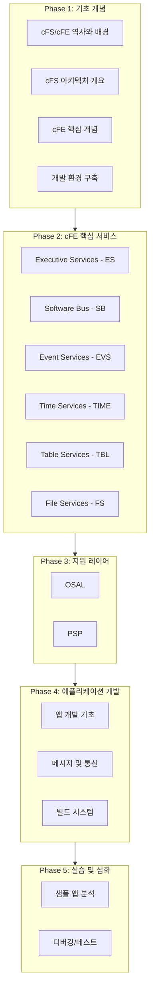
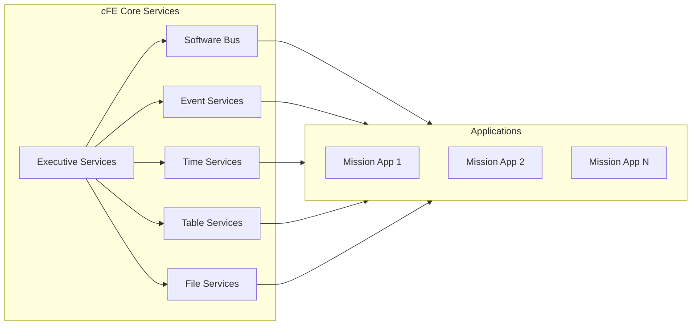
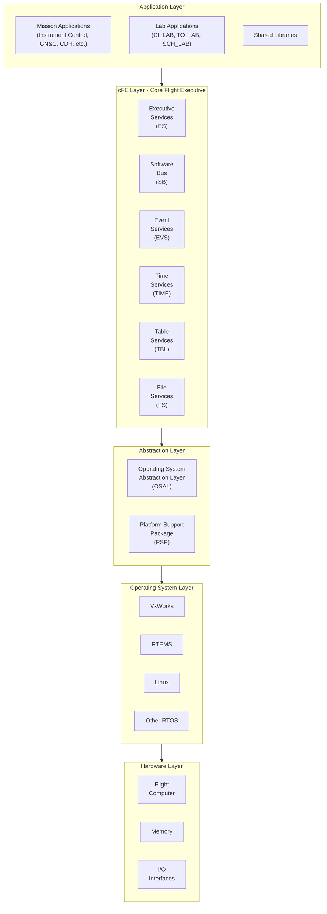

# NASA cFE (Core Flight Executive) Framework 학습 가이드

## 개요

본 문서는 NASA의 Core Flight System (cFS)과 그 핵심 구성요소인 Core Flight Executive (cFE) Framework에 대한 포괄적인 학습 가이드이다. cFE는 우주 비행 소프트웨어 개발을 위한 재사용 가능하고 이식 가능한 소프트웨어 프레임워크로서, 지난 수십 년간 수많은 NASA 임무에서 검증되어 온 업계 표준 아키텍처이다.

이 학습 가이드는 cFE를 처음 접하는 소프트웨어 엔지니어부터 이미 어느 정도 경험을 쌓은 개발자까지 모두가 참고할 수 있도록 단계적으로 구성되어 있다. 각 장은 해당 주제에 대한 개념적 설명에서 시작하여 점차 구체적인 구현 세부사항과 실제 함수 호출 수준까지 깊이 파고들 것이다.

---

## 문서 구성 체계

본 학습 가이드는 총 5개의 Phase로 구성되며, 각 Phase 내에서 다수의 세부 문서가 제공된다. 각 모듈에 대해서는 최소 10편 이상의 상세 문서가 작성되어 해당 모듈의 개념, 아키텍처, 부팅 시퀀스, 주요 함수, API 사용법 등을 깊이 있게 다룬다.

---

## Phase 1: cFS/cFE 기초 개념

### 1.1 cFS 역사와 배경 시리즈

| 번호 | 문서명 | 설명 |
|:---:|:---|:---|
| 01 | cFS의 탄생과 역사 | NASA가 cFS를 개발하게 된 배경, 초기 임무들, 발전 과정 |
| 02 | cFS가 해결하고자 하는 문제 | 기존 비행 소프트웨어 개발의 문제점과 cFS의 접근법 |
| 03 | cFS의 설계 철학 | 재사용성, 이식성, 모듈성에 대한 심층 분석 |
| 04 | cFS 적용 사례 연구 | 실제 NASA 임무에서의 cFS 활용 사례 |

### 1.2 cFS 아키텍처 시리즈

| 번호 | 문서명 | 설명 |
|:---:|:---|:---|
| 05 | cFS 계층 구조 개요 | 전체 아키텍처의 계층적 구성과 각 계층의 역할 |
| 06 | cFE와 OSAL, PSP의 관계 | 세 핵심 구성요소 간의 상호작용 |
| 07 | 애플리케이션 레이어의 이해 | 미션 애플리케이션과 라이브러리의 구조 |
| 08 | 개발 환경 구축 가이드 | Linux 환경에서 cFS 빌드 및 실행 |

---

## Phase 2: cFE 핵심 서비스 모듈

cFE는 비행 소프트웨어를 위한 6가지 핵심 서비스를 제공한다. 각 서비스는 독립적이면서도 서로 유기적으로 연결되어 완전한 비행 소프트웨어 운영 환경을 구성한다.

### 2.1 Executive Services (ES) 모듈 시리즈

Executive Services는 cFE의 심장부로서, 시스템 부팅, 애플리케이션 관리, 리셋 처리 등 가장 기본적이고 핵심적인 기능을 담당한다.

| 번호 | 문서명 | 설명 |
|:---:|:---|:---|
| ES-01 | ES 모듈 개요 및 역할 | ES의 전체적인 역할과 책임 영역 |
| ES-02 | 시스템 부팅 시퀀스 (1) - 하드웨어 초기화 | PROM 부팅부터 OS 커널 로드까지 |
| ES-03 | 시스템 부팅 시퀀스 (2) - cFE 초기화 | cFE 서비스 초기화 순서와 과정 |
| ES-04 | 시스템 부팅 시퀀스 (3) - 애플리케이션 시작 | startup script와 앱 로딩 메커니즘 |
| ES-05 | 애플리케이션 생명주기 관리 | 앱 생성, 시작, 중지, 삭제 과정 |
| ES-06 | 태스크 관리 메커니즘 | 멀티태스킹 환경과 태스크 제어 |
| ES-07 | 메모리 풀 관리 | 동적 메모리 할당과 풀 관리 |
| ES-08 | Critical Data Store (CDS) | 리셋 간 데이터 보존 메커니즘 |
| ES-09 | 리셋 유형과 처리 | Power-on, Processor, Application 리셋 |
| ES-10 | 시스템 로그 및 성능 모니터링 | Syslog와 성능 데이터 수집 |
| ES-11 | ES 명령 및 텔레메트리 | Ground System과의 통신 인터페이스 |
| ES-12 | ES 주요 API 함수 분석 | 핵심 API 함수의 상세 분석 |

### 2.2 Software Bus (SB) 모듈 시리즈

Software Bus는 cFE 애플리케이션 간 통신을 담당하는 메시지 라우팅 시스템이다.

| 번호 | 문서명 | 설명 |
|:---:|:---|:---|
| SB-01 | SB 모듈 개요 및 설계 철학 | 메시지 기반 통신의 개념과 이점 |
| SB-02 | Publish/Subscribe 패턴의 이해 | 구독-발행 모델의 동작 원리 |
| SB-03 | 메시지 구조 (1) - CCSDS 헤더 | 1차 헤더와 2차 헤더의 구조 |
| SB-04 | 메시지 구조 (2) - 명령과 텔레메트리 | 명령 메시지와 텔레메트리 메시지 |
| SB-05 | Message ID와 라우팅 테이블 | 메시지 식별과 라우팅 메커니즘 |
| SB-06 | 파이프(Pipe) 개념과 관리 | 메시지 수신을 위한 파이프 시스템 |
| SB-07 | 메시지 송수신 함수 분석 | `CFE_SB_TransmitMsg`, `CFE_SB_ReceiveBuffer` 등 |
| SB-08 | 구독 및 해제 메커니즘 | `CFE_SB_Subscribe`, `CFE_SB_Unsubscribe` |
| SB-09 | SB 성능과 제한사항 | 메시지 크기 제한, 큐 깊이, 성능 고려사항 |
| SB-10 | SB 명령 및 텔레메트리 | SB 서비스의 Ground 인터페이스 |
| SB-11 | SB 주요 API 함수 분석 | 핵심 API 함수의 상세 분석 |

### 2.3 Event Services (EVS) 모듈 시리즈

Event Services는 시스템 전체의 이벤트 로깅과 필터링을 담당한다.

| 번호 | 문서명 | 설명 |
|:---:|:---|:---|
| EVS-01 | EVS 모듈 개요 및 역할 | 이벤트 서비스의 목적과 중요성 |
| EVS-02 | 이벤트 메시지 유형 | Debug, Info, Error, Critical 분류 |
| EVS-03 | 이벤트 메시지 구조 | 이벤트 메시지의 내부 구성 |
| EVS-04 | 이벤트 필터링 메커니즘 | 앱별, 이벤트별 필터링 설정 |
| EVS-05 | 이벤트 등록과 발송 | 앱에서 이벤트 사용하기 |
| EVS-06 | 이벤트 로깅 시스템 | 로컬 이벤트 로그 관리 |
| EVS-07 | 이벤트와 텔레메트리 연동 | 이벤트의 텔레메트리 전송 |
| EVS-08 | 이벤트 스쿼시(Squelch) 기능 | 이벤트 폭주 방지 메커니즘 |
| EVS-09 | EVS 명령 및 텔레메트리 | EVS 서비스의 Ground 인터페이스 |
| EVS-10 | EVS 주요 API 함수 분석 | `CFE_EVS_SendEvent` 등 핵심 함수 분석 |

### 2.4 Time Services (TIME) 모듈 시리즈

Time Services는 우주선 시간 관리를 담당하는 중요한 서비스이다.

| 번호 | 문서명 | 설명 |
|:---:|:---|:---|
| TIME-01 | TIME 모듈 개요 | 우주선 시간 관리의 중요성 |
| TIME-02 | 시간 개념의 이해 | MET, STCF, TAI, UTC, Leap Seconds |
| TIME-03 | 시간 동기화 메커니즘 | 1Hz Tone과 Time at the Tone |
| TIME-04 | Time Server와 Time Client | 분산 시간 동기화 아키텍처 |
| TIME-05 | Flywheel 모드 | 시간 동기화 실패 시 동작 |
| TIME-06 | 시간 API 함수 분석 (1) | 시간 조회 함수들 |
| TIME-07 | 시간 API 함수 분석 (2) | 시간 설정 및 조작 함수들 |
| TIME-08 | 시간 서비스 구성 옵션 | 미션별 시간 설정 방법 |
| TIME-09 | TIME 명령 및 텔레메트리 | TIME 서비스의 Ground 인터페이스 |
| TIME-10 | TIME 통합 및 테스트 | 시간 서비스 검증 방법 |

### 2.5 Table Services (TBL) 모듈 시리즈

Table Services는 비행 파라미터 테이블의 관리를 담당한다.

| 번호 | 문서명 | 설명 |
|:---:|:---|:---|
| TBL-01 | TBL 모듈 개요 | 테이블 서비스의 개념과 필요성 |
| TBL-02 | 테이블 유형 이해 | Single Buffer vs Double Buffer 테이블 |
| TBL-03 | Critical Table과 CDS 연동 | 리셋 간 테이블 보존 |
| TBL-04 | 테이블 등록 프로세스 | `CFE_TBL_Register` 함수 분석 |
| TBL-05 | 테이블 로드 메커니즘 | 파일 기반 테이블 로딩 |
| TBL-06 | 테이블 업데이트 프로세스 | Load, Validate, Activate 사이클 |
| TBL-07 | 테이블 검증 함수 | 사용자 정의 검증 콜백 |
| TBL-08 | 테이블 덤프 및 관리 | 현재 테이블 내용 추출 |
| TBL-09 | TBL 명령 및 텔레메트리 | TBL 서비스의 Ground 인터페이스 |
| TBL-10 | TBL 주요 API 함수 분석 | 핵심 API 함수의 상세 분석 |

### 2.6 File Services (FS) 모듈 시리즈

File Services는 파일 시스템 접근을 위한 추상화 계층을 제공한다.

| 번호 | 문서명 | 설명 |
|:---:|:---|:---|
| FS-01 | FS 모듈 개요 | 파일 서비스의 역할 |
| FS-02 | cFE 파일 헤더 구조 | cFE 표준 파일 헤더 |
| FS-03 | 파일 읽기/쓰기 API | 기본 파일 조작 함수 |
| FS-04 | 파일 시스템 마운팅 | 가상 파일 시스템과 실제 저장장치 |
| FS-05 | 파일 압축 및 해제 | gzip 파일 지원 |
| FS-06 | 디렉토리 조작 | 디렉토리 관련 작업 |
| FS-07 | FS 명령 및 텔레메트리 | FS 서비스의 Ground 인터페이스 |
| FS-08 | FS 주요 API 함수 분석 | 핵심 API 함수의 상세 분석 |
| FS-09 | 파일 시스템 제한사항 | 파일 이름, 경로, 크기 제한 |
| FS-10 | FS 활용 사례 | 데이터 로깅, 테이블 저장 등 |

---

## Phase 3: 지원 레이어

### 3.1 OSAL (Operating System Abstraction Layer) 시리즈

| 번호 | 문서명 | 설명 |
|:---:|:---|:---|
| OSAL-01 | OSAL 개요 및 설계 목적 | OS 독립성 달성 방법 |
| OSAL-02 | 지원 RTOS 및 포팅 | VxWorks, RTEMS, Linux 등 |
| OSAL-03 | 태스크 관리 API | `OS_TaskCreate`, `OS_TaskDelay` 등 |
| OSAL-04 | 세마포어 및 뮤텍스 | 동기화 프리미티브 |
| OSAL-05 | 메시지 큐 API | `OS_QueueCreate`, `OS_QueuePut` 등 |
| OSAL-06 | 타이머 API | 소프트웨어 타이머 관리 |
| OSAL-07 | 파일 시스템 API | OS 레벨 파일 조작 |
| OSAL-08 | 네트워크 소켓 API | 통신 인터페이스 |
| OSAL-09 | OSAL 확장과 커스터마이징 | 새로운 OS 포팅 가이드 |
| OSAL-10 | OSAL 내부 구현 분석 | 추상화 계층의 동작 원리 |

### 3.2 PSP (Platform Support Package) 시리즈

| 번호 | 문서명 | 설명 |
|:---:|:---|:---|
| PSP-01 | PSP 개요 및 역할 | 하드웨어 추상화의 개념 |
| PSP-02 | 하드웨어 초기화 | 프로세서 및 보드 초기화 |
| PSP-03 | 메모리 맵핑 및 관리 | 물리/가상 메모리 관리 |
| PSP-04 | 인터럽트 처리 | 예외 및 인터럽트 핸들링 |
| PSP-05 | 워치독 타이머 | 시스템 감시 기능 |
| PSP-06 | 리셋 기능 구현 | 다양한 리셋 유형 지원 |
| PSP-07 | 시간 하드웨어 인터페이스 | 1Hz 신호 및 하드웨어 타이머 |
| PSP-08 | PSP 포팅 가이드 | 새 플랫폼 지원 방법 |
| PSP-09 | 표준 PSP 분석 | PC-Linux PSP 구조 분석 |
| PSP-10 | PSP와 BSP의 관계 | Board Support Package 연동 |

---

## Phase 4: cFE 애플리케이션 개발

### 4.1 애플리케이션 개발 기초 시리즈

| 번호 | 문서명 | 설명 |
|:---:|:---|:---|
| APP-01 | cFE 애플리케이션 구조 | 표준 앱 디렉토리 및 파일 구성 |
| APP-02 | 애플리케이션 진입점 | Main 함수와 초기화 시퀀스 |
| APP-03 | 앱 등록과 서비스 연결 | cFE 서비스 사용 설정 |
| APP-04 | 메인 루프 패턴 | 이벤트 기반 앱 설계 |
| APP-05 | 에러 처리 패턴 | 견고한 에러 처리 구현 |
| APP-06 | 명령 처리 구현 | Ground 명령 수신 및 처리 |
| APP-07 | 텔레메트리 생성 | 상태 데이터 발송 |
| APP-08 | 하우스키핑(HK) 구현 | 주기적 상태 보고 |
| APP-09 | 앱 종료 처리 | 정상 종료와 리소스 해제 |
| APP-10 | 앱 빌드 및 배포 | CMake 기반 빌드 시스템 |

### 4.2 메시지 및 통신 시리즈

| 번호 | 문서명 | 설명 |
|:---:|:---|:---|
| MSG-01 | CCSDS 패킷 표준 이해 | 우주 통신 표준의 배경 |
| MSG-02 | 명령 메시지 정의 | 명령 구조 헤더 파일 작성 |
| MSG-03 | 텔레메트리 메시지 정의 | 텔레메트리 구조 정의 |
| MSG-04 | Message ID 할당 전략 | ID 충돌 방지 및 관리 |
| MSG-05 | 메시지 매크로 활용 | 헤더 조작 매크로 |
| MSG-06 | 앱 간 통신 구현 | 내부 앱 메시지 교환 |
| MSG-07 | 스케줄러와 메시지 | SCH 앱과의 연동 |
| MSG-08 | 메시지 디버깅 | 메시지 추적 및 분석 |

### 4.3 빌드 시스템 시리즈

| 번호 | 문서명 | 설명 |
|:---:|:---|:---|
| BUILD-01 | CMake 기반 빌드 시스템 | cFS 빌드 구조 이해 |
| BUILD-02 | Mission 설정 파일 | targets.cmake 분석 |
| BUILD-03 | 앱 CMakeLists.txt | 앱별 빌드 설정 |
| BUILD-04 | 플랫폼 구성 | 타겟별 설정 |
| BUILD-05 | 라이브러리 빌드 | 공유 라이브러리 생성 |
| BUILD-06 | 크로스 컴파일 설정 | 임베디드 타겟 빌드 |
| BUILD-07 | 빌드 옵션과 최적화 | 컴파일러 플래그 설정 |
| BUILD-08 | 빌드 자동화 및 CI | 지속적 통합 설정 |

---

## Phase 5: 실습 및 심화

### 5.1 샘플 애플리케이션 분석 시리즈

| 번호 | 문서명 | 설명 |
|:---:|:---|:---|
| SAMPLE-01 | sample_app 전체 분석 | 표준 샘플 앱 코드 리뷰 |
| SAMPLE-02 | ci_lab 분석 | Command Ingest 앱 |
| SAMPLE-03 | to_lab 분석 | Telemetry Output 앱 |
| SAMPLE-04 | sch_lab 분석 | Scheduler 앱 |
| SAMPLE-05 | 커스텀 앱 개발 실습 | 처음부터 앱 만들기 |

### 5.2 디버깅 및 테스트 시리즈

| 번호 | 문서명 | 설명 |
|:---:|:---|:---|
| TEST-01 | 단위 테스트 작성 | UT Assert 프레임워크 |
| TEST-02 | 통합 테스트 | 앱 간 상호작용 테스트 |
| TEST-03 | cFS Ground 도구 활용 | COSMOS, cFS Ground System |
| TEST-04 | 로그 분석 및 디버깅 | Syslog, 이벤트 추적 |
| TEST-05 | 성능 분석 | 프로파일링 및 최적화 |

---

## 예상 문서 총 개수

| Phase | 시리즈 | 문서 수 |
|:---:|:---|:---:|
| Phase 1 | 기초 개념 | 8 |
| Phase 2 | ES 모듈 | 12 |
| Phase 2 | SB 모듈 | 11 |
| Phase 2 | EVS 모듈 | 10 |
| Phase 2 | TIME 모듈 | 10 |
| Phase 2 | TBL 모듈 | 10 |
| Phase 2 | FS 모듈 | 10 |
| Phase 3 | OSAL | 10 |
| Phase 3 | PSP | 10 |
| Phase 4 | 앱 개발 기초 | 10 |
| Phase 4 | 메시지 및 통신 | 8 |
| Phase 4 | 빌드 시스템 | 8 |
| Phase 5 | 샘플 앱 분석 | 5 |
| Phase 5 | 디버깅/테스트 | 5 |
| **총계** | | **117** |

---

## cFS 전체 아키텍처 참조도

아래 다이어그램은 cFS/cFE 전체 아키텍처를 계층적으로 표현한 것이다. 이 구조를 이해하는 것이 본 학습 가이드의 출발점이 된다.

---

## 시작하기

본 학습 가이드를 효과적으로 활용하기 위해서는 다음 순서로 학습하는 것을 권장한다:

1. **Phase 1을 통해 전체적인 개념을 파악한다** - cFS가 왜 필요한지, 어떤 문제를 해결하는지 이해하는 것이 중요하다.

2. **Phase 2에서 ES 모듈을 먼저 학습한다** - ES는 모든 서비스의 시작점이므로 시스템 부팅과 초기화 과정을 이해해야 다른 서비스를 이해할 수 있다.

3. **SB와 EVS를 학습한다** - 애플리케이션 개발에 가장 많이 사용되는 두 서비스이다.

4. **나머지 서비스들을 필요에 따라 학습한다** - TIME, TBL, FS는 특정 기능이 필요할 때 참조한다.

5. **Phase 3에서 추상화 계층을 이해한다** - OSAL과 PSP는 포팅이나 심화 학습 시 필요하다.

6. **Phase 4를 통해 실제 애플리케이션을 개발한다** - 이론을 실습으로 연결한다.

7. **Phase 5에서 기존 코드를 분석하고 테스트 방법을 익힌다** - 실무 역량을 완성한다.

---

## 참고 자료

- [NASA cFS Official Website](https://cfs.gsfc.nasa.gov/)
- [cFS GitHub Repository](https://github.com/nasa/cFS)
- [cFE User's Guide](https://github.com/nasa/cFE/tree/main/docs)
- [OSAL User's Guide](https://github.com/nasa/osal/tree/main/docs)
- [cFE Application Developer's Guide](https://github.com/nasa/cFE/blob/main/docs/cFE%20Application%20Developers%20Guide.md)

---

> **Note**: 본 문서는 cFE Framework 학습을 위한 마스터 목차 및 개요 문서이다. 각 섹션에 대한 상세 내용은 개별 문서에서 다룬다.
