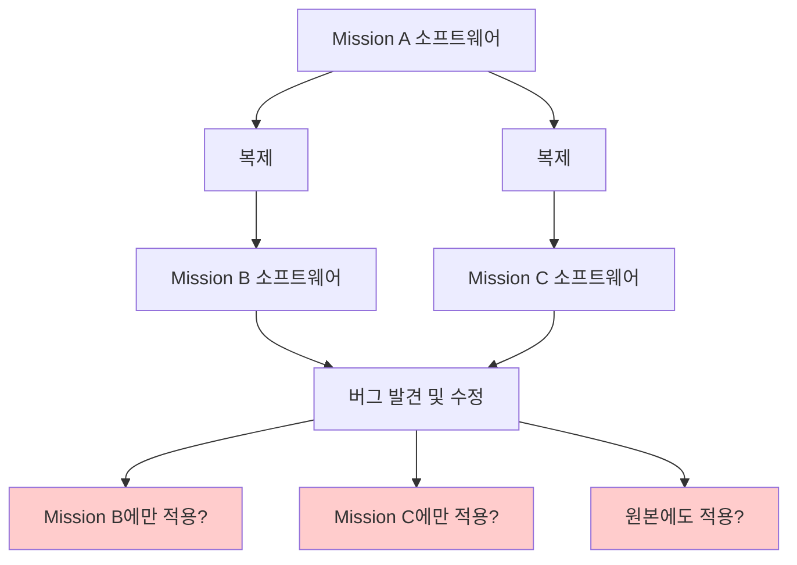
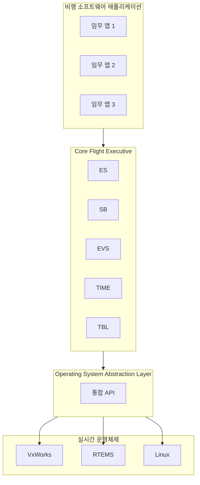
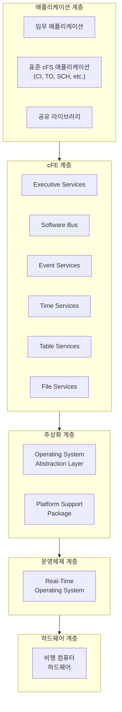

# Phase 1-01: cFS의 탄생과 역사

## 서론

우주 비행 소프트웨어는 인류가 우주를 탐험하는 데 있어 가장 핵심적인 기술 중 하나이다. 우주선이 지구를 떠나 수백만 킬로미터를 여행하는 동안, 그 내부에서 동작하는 소프트웨어는 단 한 번의 오류도 허용하지 않는 극도의 신뢰성을 요구받는다. NASA(미국 항공우주국)는 수십 년간 다양한 우주 임무를 수행하면서 이러한 비행 소프트웨어 개발에 막대한 자원을 투자해 왔다. 그러나 매 임무마다 소프트웨어를 처음부터 새로 개발하는 전통적인 접근법은 시간과 비용 면에서 큰 부담이 되어 왔다.

이러한 문제를 해결하기 위해 NASA Goddard Space Flight Center(고다드 우주비행센터)는 재사용 가능한 비행 소프트웨어 프레임워크를 개발하기로 결정하였다. 그 결과물이 바로 Core Flight System, 줄여서 cFS라고 불리는 오픈소스 비행 소프트웨어 프레임워크이다. cFS는 단순한 코드의 집합이 아니라, 우주 비행 소프트웨어 개발의 패러다임을 바꾼 혁신적인 접근법이었다.

---

## 1. 비행 소프트웨어 개발의 역사적 배경

### 1.1 초기 우주 임무의 소프트웨어 개발

1960년대 아폴로 프로그램 시절부터 우주 비행 소프트웨어는 각 임무에 특화된 형태로 개발되어 왔다. 아폴로 유도 컴퓨터(Apollo Guidance Computer)를 위한 소프트웨어는 그 시대의 기술적 한계 내에서 놀라운 성과를 이루어냈지만, 이 소프트웨어는 오직 아폴로 임무만을 위해 설계된 것이었다. 임무가 바뀌면 소프트웨어도 완전히 새로 작성해야 했다.

이러한 "처음부터 다시 개발하는(from scratch)" 접근법은 수십 년간 우주 산업의 표준이었다. 각 임무는 고유한 요구사항을 가지고 있었고, 하드웨어 플랫폼도 임무마다 달랐기 때문에, 소프트웨어를 재사용한다는 개념 자체가 현실적이지 않다고 여겨졌다.

### 1.2 "Clone and Own" 문제

1990년대와 2000년대 초반, NASA의 일부 프로젝트들은 이전 임무의 소프트웨어를 복제하여 수정하는 "Clone and Own(복제 후 소유)" 방식을 시도하였다. 이론적으로는 이 방법이 개발 시간을 단축시킬 수 있을 것처럼 보였다. 기존에 검증된 코드를 가져와서 새로운 요구사항에 맞게 수정만 하면 되니까 말이다.

그러나 현실은 달랐다. Clone and Own 방식은 여러 가지 심각한 문제를 야기하였다:

첫째, 코드가 복제되는 순간 유지보수의 악몽이 시작되었다. 원본 코드에서 버그가 발견되면, 그 버그는 복제된 모든 버전에 수동으로 적용되어야 했다. 그러나 각 복제본은 이미 독자적인 수정을 거친 상태였기 때문에, 패치를 적용하는 것조차 쉽지 않았다.

둘째, 각 복제본이 독립적으로 발전하면서 소프트웨어의 품질 관리가 불가능해졌다. A 임무에서는 특정 기능이 개선되었지만, B 임무의 소프트웨어에는 그 개선사항이 반영되지 않는 식이었다.

셋째, 이 방식은 예상했던 것만큼 개발 시간을 단축시키지 못했다. 복제된 코드를 이해하고, 새로운 하드웨어에 맞게 수정하고, 충돌을 해결하는 데 드는 시간이 결국 새로 개발하는 것과 크게 다르지 않은 경우가 많았다.

---

## 2. cFS의 탄생

### 2.1 재사용 가능한 프레임워크의 구상

2000년대 초반, NASA Goddard Space Flight Center의 소프트웨어 엔지니어들은 근본적인 질문을 던지기 시작하였다. "어떻게 하면 비행 소프트웨어를 진정으로 재사용 가능하게 만들 수 있을까?" 이 질문에 대한 답을 찾기 위해, 그들은 기존 접근법의 문제점을 분석하고 새로운 아키텍처를 설계하기 시작하였다.

핵심 아이디어는 명확했다. 비행 소프트웨어를 단일 덩어리로 개발하는 것이 아니라, 명확하게 분리된 계층으로 구성하는 것이었다. 하드웨어와 운영체제에 종속적인 부분을 추상화 계층으로 분리하고, 임무에 특화된 로직은 독립적인 애플리케이션으로 구현하면, 각 계층을 독립적으로 재사용할 수 있을 것이었다.

### 2.2 Core Flight Executive의 개발

이러한 구상의 첫 번째 결과물이 Core Flight Executive(cFE)였다. cFE는 비행 소프트웨어 애플리케이션이 실행되는 런타임 환경을 제공하는 핵심 컴포넌트로서, 다음과 같은 필수 서비스들을 포함하고 있었다:

- **Executive Services (ES)**: 시스템 부팅, 애플리케이션 관리, 리셋 처리
- **Software Bus (SB)**: 애플리케이션 간 메시지 기반 통신
- **Event Services (EVS)**: 이벤트 로깅 및 필터링
- **Time Services (TIME)**: 우주선 시간 관리
- **Table Services (TBL)**: 런타임 파라미터 테이블 관리

이 서비스들은 어떤 우주 임무에서든 공통적으로 필요한 기능들이었다. 통신 위성이든, 화성 탐사선이든, 우주 망원경이든 간에, 모든 비행 소프트웨어는 애플리케이션을 관리하고, 컴포넌트 간에 통신하고, 이벤트를 기록하고, 시간을 추적해야 했다.

### 2.3 Operating System Abstraction Layer

cFE만으로는 완전한 이식성을 달성할 수 없었다. 운영체제마다 태스크 생성, 세마포어, 메시지 큐 등을 위한 API가 달랐기 때문이다. 이 문제를 해결하기 위해 개발된 것이 Operating System Abstraction Layer(OSAL)이다.

OSAL은 다양한 실시간 운영체제(RTOS)의 기능을 일관된 API로 추상화하였다. VxWorks를 사용하든, RTEMS를 사용하든, 심지어 일반 Linux를 사용하든, cFE와 그 위에서 동작하는 애플리케이션은 동일한 OSAL API를 호출하기만 하면 되었다. 실제 운영체제별 구현은 OSAL 내부에 캡슐화되어 있었다.

---

## 3. cFS의 진화와 발전

### 3.1 Lunar Reconnaissance Orbiter (2009)

cFE가 처음으로 실제 우주 임무에 사용된 것은 2009년 Lunar Reconnaissance Orbiter(LRO, 달 정찰 궤도선) 임무에서였다. LRO는 달 표면의 고해상도 지도를 만들고, 미래의 유인 달 탐사를 위한 착륙지를 찾기 위해 발사된 탐사선이었다.

LRO 임무에서 cFE는 그 잠재력을 증명하였다. 플랫폼 추상화 계층(당시의 PSP와 OSAL)과 함께 cFE는 안정적으로 동작하였으며, 개발팀은 애플리케이션 로직에 집중할 수 있었다. 이 성공적인 경험은 cFS 프레임워크의 발전에 큰 자신감을 불어넣었다.

### 3.2 LADEE 임무 (2013)

2013년 9월에 발사된 Lunar Atmosphere and Dust Environment Explorer(LADEE, 달 대기 및 먼지 환경 탐사선)는 cFS 채택의 또 다른 중요한 이정표였다. LADEE는 극도로 촉박한 일정과 제한된 예산 하에서 개발되어야 했다. 이러한 제약 조건에서 cFS의 재사용성은 빛을 발하였다.

LADEE 비행 소프트웨어 팀은 cFE와 OSAL을 활용하여 개발 시간을 크게 단축시켰다. 검증된 핵심 서비스들을 처음부터 개발할 필요 없이, 임무에 특화된 애플리케이션 개발에 자원을 집중할 수 있었다. LADEE는 예산 내에서, 일정대로 성공적으로 임무를 완수하였으며, 이는 cFS의 실질적인 가치를 입증하는 사례가 되었다.

### 3.3 Global Precipitation Measurement (2014)

2014년에 발사된 Global Precipitation Measurement(GPM, 전지구 강수 측정) 위성은 cFS의 발전에 있어 특별한 의미를 가진다. GPM은 전체 cFS 애플리케이션 스위트가 처음으로 배치된 임무였다. 단순히 cFE만을 사용한 것이 아니라, 표준 cFS 애플리케이션들까지 통합하여 사용한 첫 번째 사례였던 것이다.

NASA Goddard Space Flight Center는 GPM을 위해 cFE와 함께 동작하는 여러 표준 애플리케이션들을 개발하였다. 이 애플리케이션들은 명령 수신(Command Ingest), 텔레메트리 출력(Telemetry Output), 스케줄링(Scheduling) 등 대부분의 임무에서 공통적으로 필요한 기능들을 제공하였다. GPM의 성공은 cFS가 단순한 미들웨어가 아니라, 완전한 비행 소프트웨어 생태계로 발전할 수 있음을 보여주었다.

---

## 4. 오픈소스 공개

### 4.1 NASA Open Source Agreement (2015)

2015년 1월, NASA는 역사적인 결정을 내렸다. 전체 cFS 소프트웨어 스위트를 NASA Open Source Agreement(NOSA) 하에 오픈소스로 공개한 것이다. 이 결정은 cFS를 NASA 내부 프로젝트에서 전 세계 우주 커뮤니티를 위한 공공 자산으로 변모시켰다.

오픈소스 공개의 의의는 단순히 코드를 무료로 사용할 수 있게 되었다는 것에 그치지 않는다. 이 코드는 수백만 달러, 때로는 수십억 달러 규모의 우주 프로그램에서 실제로 사용되고 검증된 것과 동일한 코드베이스였다. 학술 기관, 민간 기업, 다른 국가의 우주 기관들도 이제 NASA의 수십 년간의 경험이 녹아든 비행 소프트웨어 프레임워크를 활용할 수 있게 되었다.

### 4.2 커뮤니티의 형성

오픈소스 공개 이후, cFS 주변에는 활발한 커뮤니티가 형성되었다. GitHub 저장소에서 이슈가 보고되고 토론되었으며, 외부 기여자들의 풀 리퀘스트가 검토되어 병합되었다. NASA는 Configuration Control Board(CCB)를 운영하여 모든 변경사항을 관리하고, 소프트웨어의 품질과 장기적인 방향성을 유지하였다.

OpenSatKit과 같은 교육용 도구들도 등장하였다. 이러한 도구들은 cFS를 처음 접하는 개발자들이 프레임워크를 쉽게 배우고, 실험해볼 수 있도록 도와주었다.

---

## 5. 성과와 인정

### 5.1 NASA Software of the Year Award (2020)

2020년, cFS는 NASA Software of the Year Award를 수상하였다. 이 상은 NASA 내에서 개발된 소프트웨어 중 가장 뛰어난 것에 주어지는 것으로, cFS의 오랜 기여와 성과를 공식적으로 인정하는 것이었다.

수상 사유는 명확했다. cFS는 40개 이상의 NASA 임무에서 사용되었으며, 소규모 큐브샛(CubeSat)부터 제임스 웹 우주 망원경(James Webb Space Telescope)과 같은 대규모 프로젝트까지 다양한 규모와 복잡도의 임무를 지원하였다. 각 임무에서 cFS는 개발 시간을 단축시키고, 결함을 줄이며, 비용을 절감하는 데 기여하였다.

### 5.2 현재와 미래

오늘날 cFS는 NASA의 가장 중요한 소프트웨어 자산 중 하나로 자리잡았다. NASA의 여러 센터뿐만 아니라, 다른 정부 기관, 학술 기관, 민간 기업, 국제 우주 기관들이 cFS를 채택하고 있다. 

프레임워크는 계속해서 발전하고 있다. 새로운 운영체제 지원이 추가되고, 보안 기능이 강화되며, 더 많은 표준 애플리케이션들이 개발되고 있다. cFS 커뮤니티는 이러한 발전을 함께 이끌어가고 있다.

---

## 6. cFS의 구성 요소 개요

cFS는 여러 핵심 구성 요소로 이루어져 있다. 각 구성 요소는 이후의 문서에서 상세히 다루어질 것이지만, 여기서는 전체적인 그림을 이해하기 위해 간략하게 소개한다.

### 6.1 Core Flight Executive (cFE)

cFE는 cFS의 심장부이다. 여섯 가지 핵심 서비스(ES, SB, EVS, TIME, TBL, FS)를 제공하여 애플리케이션이 실행될 수 있는 환경을 만들어준다. 모든 cFS 애플리케이션은 이 서비스들을 통해 시스템 리소스에 접근하고, 다른 애플리케이션과 통신한다.

### 6.2 Operating System Abstraction Layer (OSAL)

OSAL은 cFE가 다양한 운영체제 위에서 동작할 수 있도록 해주는 추상화 계층이다. 태스크 관리, 동기화, 파일 시스템 등 운영체제의 기능들을 일관된 API로 제공한다.

### 6.3 Platform Support Package (PSP)

PSP는 특정 하드웨어 플랫폼에 대한 지원을 제공한다. 메모리 관리, 인터럽트 처리, 하드웨어 타이머 등 플랫폼에 종속적인 기능들을 담당한다.

### 6.4 cFS 애플리케이션

cFS 애플리케이션은 cFE 위에서 동작하는 소프트웨어 모듈이다. NASA는 여러 표준 애플리케이션을 제공하며, 개발자들은 임무에 특화된 자체 애플리케이션을 개발할 수 있다.

---

## 결론

Core Flight System은 단순한 소프트웨어가 아니다. 이것은 우주 비행 소프트웨어 개발 방식의 패러다임 전환을 상징한다. 매 임무마다 바퀴를 새로 발명하는 대신, 검증된 기반 위에서 임무에 특화된 기능에 집중할 수 있게 해준다.

LRO에서 처음 사용된 이후, LADEE, GPM을 거쳐, 오늘날 제임스 웹 우주 망원경에 이르기까지, cFS는 계속해서 그 가치를 증명해왔다. 오픈소스 공개는 이 가치를 전 세계의 우주 커뮤니티와 공유하는 것이었다.

다음 문서에서는 cFS가 해결하고자 했던 문제들을 더욱 상세하게 살펴보고, 이 프레임워크가 어떻게 그 문제들을 해결하는지 알아볼 것이다.

---

## 참고 문헌

1. NASA Goddard Space Flight Center, "Core Flight System (cFS) Background and Overview"
2. NASA Technical Reports Server, "LADEE Flight Software Overview"
3. NASA, "Core Flight System Receives 2020 NASA Software of the Year Award"
4. cFS Community, coreflightsystem.net
5. NASA GitHub Repository, https://github.com/nasa/cFS

---

[다음 문서: Phase 1-02: cFS가 해결하고자 하는 문제](./Phase1_02_cFS가_해결하고자_하는_문제.md)
