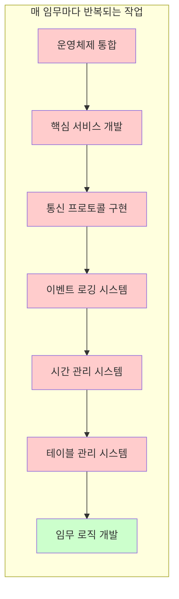
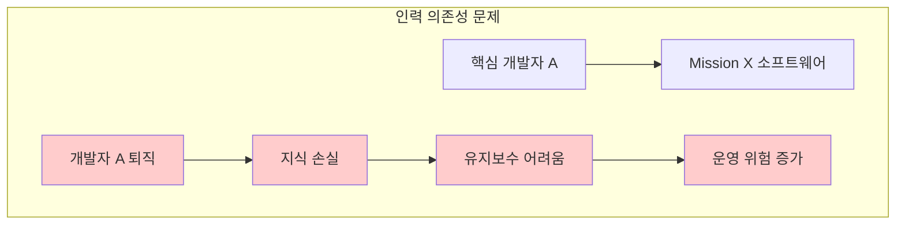
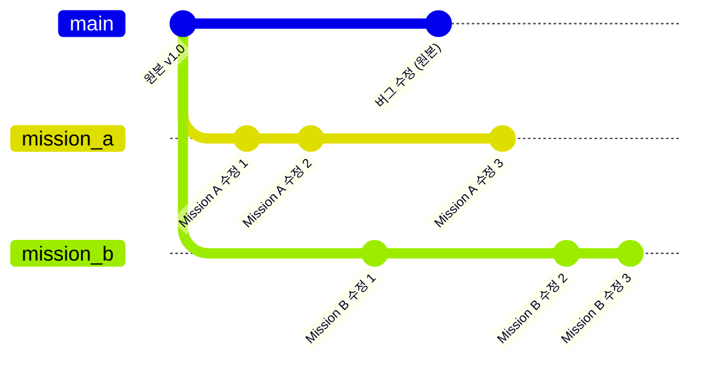
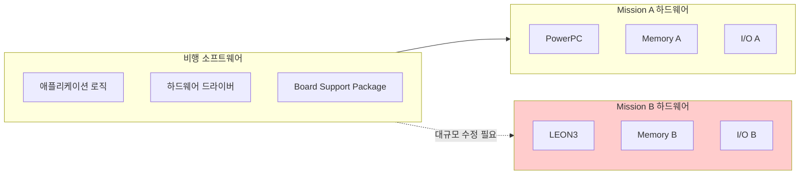
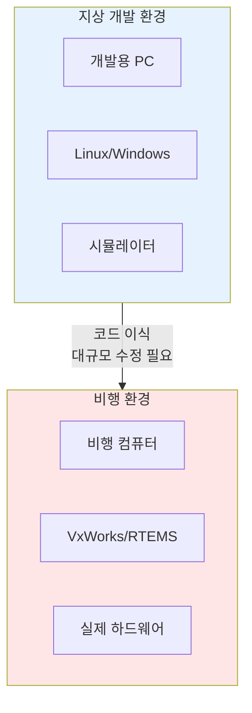
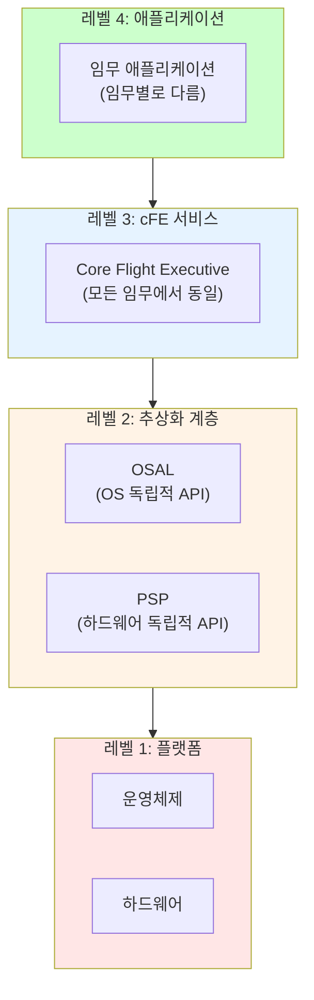
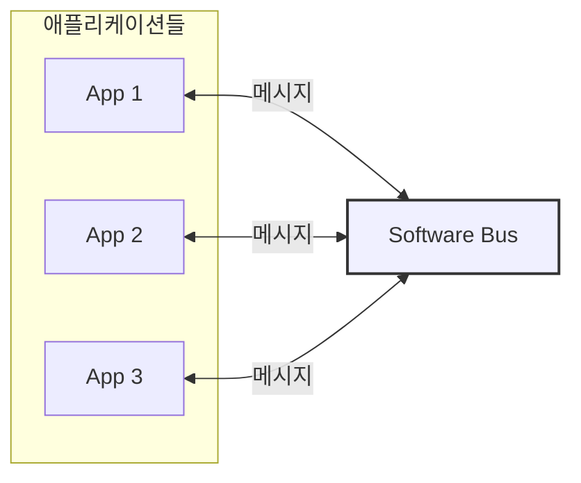
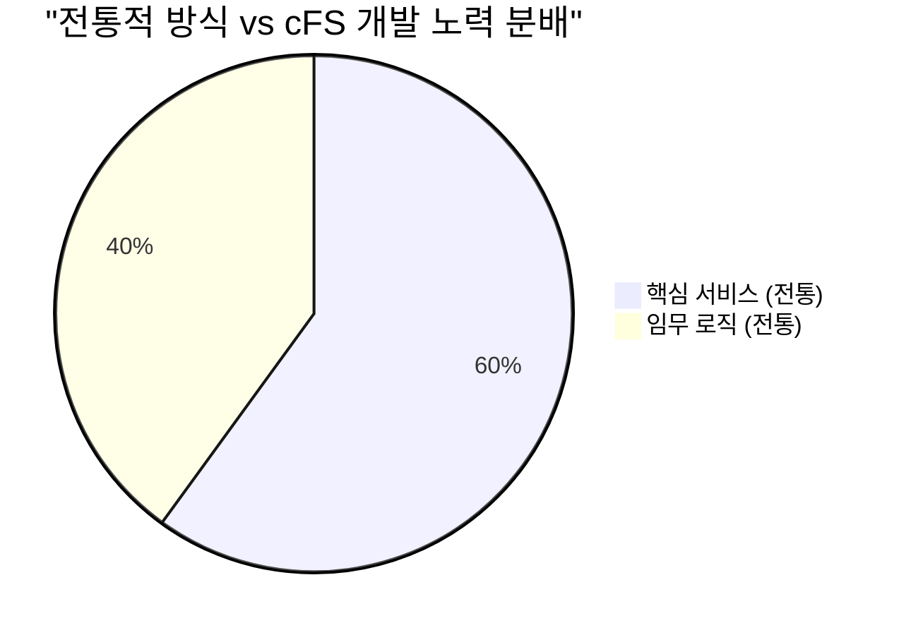
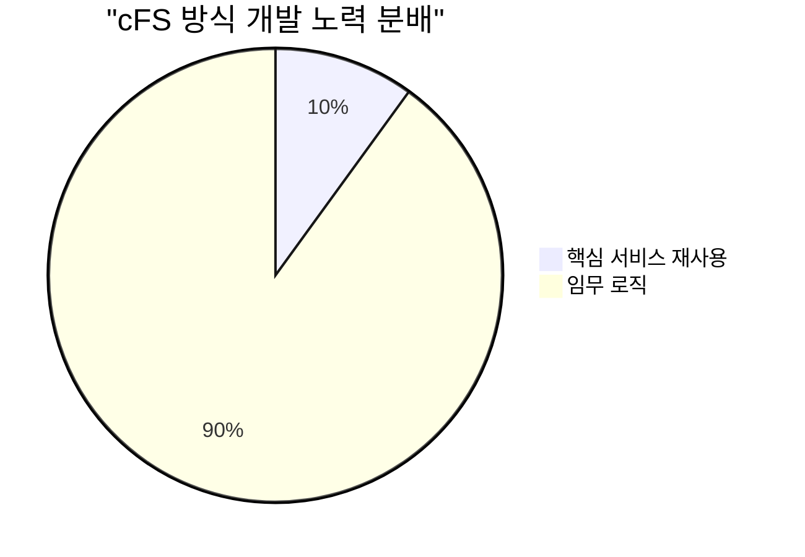

# Phase 1-02: cFS가 해결하고자 하는 문제

## 서론

모든 좋은 소프트웨어는 실제 문제를 해결하기 위해 태어난다. Core Flight System(cFS) 역시 마찬가지이다. cFS를 제대로 이해하기 위해서는 먼저 이 프레임워크가 해결하고자 했던 문제들이 무엇인지 파악해야 한다. 본 문서에서는 전통적인 비행 소프트웨어 개발 방식의 문제점들을 심층적으로 분석하고, cFS가 이러한 문제들에 어떻게 접근하는지 살펴볼 것이다.

이 문제들을 이해하는 것은 단순히 역사적 지식을 쌓는 것이 아니다. cFS의 아키텍처와 설계 결정들이 왜 그런 방식으로 이루어졌는지를 이해하게 해주며, 이는 곧 프레임워크를 더 효과적으로 활용할 수 있게 해준다.

---

## 1. 전통적 비행 소프트웨어 개발의 문제점

### 1.1 막대한 개발 비용

우주 비행 소프트웨어 개발은 극도로 비용이 많이 드는 작업이다. 일반적인 소프트웨어와 달리, 비행 소프트웨어는 발사 후에 버그를 수정하기가 매우 어렵거나 불가능하다. 따라서 개발 과정에서 매우 엄격한 품질 관리 프로세스를 거쳐야 하며, 이는 필연적으로 높은 비용으로 이어진다.

전통적인 개발 방식에서는 각 임무마다 다음과 같은 작업들을 처음부터 수행해야 했다:



위 다이어그램에서 붉은색으로 표시된 부분은 사실상 모든 임무에서 유사한 기능이 필요했음에도 불구하고, 매번 새로 개발되어야 했던 부분이다. 오직 임무 로직만이 진정으로 임무에 특화된 것이었지만, 개발 자원의 대부분은 공통 인프라 구축에 소비되었다.

NASA의 분석에 따르면, 전통적인 방식으로 비행 소프트웨어를 개발할 경우, 전체 개발 비용의 상당 부분이 이러한 기반 인프라 구축에 사용되었다. 각 임무에서 이 비용이 반복되면서, 전체적인 우주 프로그램 비용이 불필요하게 증가하였다.

### 1.2 긴 개발 일정

비행 소프트웨어의 개발 일정은 전체 임무 일정에 큰 영향을 미친다. 하드웨어가 준비되어도 소프트웨어가 완성되지 않으면 발사를 진행할 수 없다. 전통적인 개발 방식에서는 다음과 같은 단계들이 순차적으로 진행되어야 했다:

1. **요구사항 분석**: 임무에 필요한 모든 기능 정의
2. **아키텍처 설계**: 전체 소프트웨어 구조 설계
3. **상세 설계**: 각 컴포넌트의 상세 설계
4. **구현**: 실제 코드 작성
5. **단위 테스트**: 개별 모듈 테스트
6. **통합 테스트**: 전체 시스템 통합 및 테스트
7. **시스템 테스트**: 하드웨어와의 통합 테스트
8. **인증**: 비행 적합성 인증

이러한 프로세스는 처음부터 개발하는 경우 수 년이 소요될 수 있었다. 임무 일정이 촉박한 경우, 소프트웨어 팀은 극심한 압박 속에서 일해야 했으며, 이는 품질 저하의 위험을 높였다.

### 1.3 인력 의존성

각 임무의 소프트웨어가 완전히 독립적으로 개발되면, 해당 소프트웨어를 이해하고 유지보수할 수 있는 사람은 원래 개발팀으로 제한되었다. 이는 심각한 인력 의존성 문제를 야기하였다:

- 핵심 개발자가 프로젝트를 떠나면 지식의 손실이 발생하였다
- 새로운 팀원이 합류해도 학습 곡선이 매우 가팔랐다
- 운영 중인 임무의 유지보수에 필요한 전문 인력을 확보하기 어려웠다
- 퇴직한 개발자를 다시 불러와야 하는 상황이 종종 발생하였다



### 1.4 품질과 신뢰성 문제

새로운 코드에는 항상 버그가 존재할 가능성이 있다. 매 임무마다 핵심 서비스들을 새로 개발하면, 그만큼 새로운 버그가 도입될 가능성이 높아진다. 아무리 철저한 테스트를 수행해도, 우주 환경에서만 발현되는 버그를 지상에서 모두 발견하기는 어렵다.

반면, 이미 여러 임무에서 검증된 코드는 그만큼 신뢰할 수 있다. 수 년간의 운영을 통해 발견된 버그들이 수정되었고, 다양한 조건에서의 동작이 검증되었기 때문이다. 그러나 전통적인 방식에서는 이러한 검증된 코드를 체계적으로 재사용하는 메커니즘이 없었다.

---

## 2. Clone and Own 방식의 한계

앞서 언급한 문제들을 해결하기 위해 "Clone and Own" 방식이 시도되었다. 이 방식은 이전 임무의 소프트웨어를 복제하여 새 임무에 맞게 수정하는 것이다. 표면적으로는 합리적인 접근법처럼 보이지만, 실제로는 여러 심각한 문제를 야기하였다.

### 2.1 분기(Divergence) 문제

소프트웨어가 복제되는 순간, 두 개의 독립적인 코드베이스가 존재하게 된다. 시간이 지나면서 각각은 독자적인 방향으로 발전하며, 결국 공통점보다 차이점이 더 많아지게 된다.



위 다이어그램에서 보듯이, 원본에서 버그가 수정되어도 Mission A와 Mission B에 자동으로 반영되지 않는다. 수동으로 버그 수정을 각 브랜치에 적용해야 하는데, 이미 코드가 많이 달라진 상태에서는 이것조차 쉽지 않다.

### 2.2 기술 부채 누적

Clone and Own 방식을 사용하면 기술 부채가 빠르게 누적된다:

- **중복 코드**: 동일한 기능이 여러 코드베이스에 중복으로 존재한다
- **일관성 부재**: 동일한 문제에 대해 각 임무마다 다른 해결책이 적용된다
- **문서화 부족**: 원본 문서가 복제본의 변경사항을 반영하지 않는다
- **테스트 격차**: 복제된 코드의 수정된 부분에 대한 테스트가 누락될 수 있다

### 2.3 전문성 분산

각 임무팀이 자신만의 독립적인 코드베이스를 유지하면서, 전문성이 분산되는 결과를 낳았다:

- 동일한 문제를 여러 팀이 독립적으로 해결하기 위해 노력하였다
- 한 팀이 발견한 최적화가 다른 팀에 공유되지 않았다
- 전체 조직 차원에서 비행 소프트웨어 전문성을 축적하기 어려웠다

---

## 3. 이식성(Portability) 문제

전통적인 비행 소프트웨어 개발에서 가장 큰 기술적 장벽 중 하나는 이식성 문제였다. 비행 소프트웨어는 특정 하드웨어와 운영체제에 강하게 결합되어 개발되었으며, 이로 인해 다양한 문제가 발생하였다.

### 3.1 하드웨어 종속성

각 우주 임무는 고유한 비행 컴퓨터를 사용하는 경우가 많았다. 프로세서 아키텍처, 메모리 구성, I/O 인터페이스 등이 임무마다 달랐다. 이전 임무에서 개발된 소프트웨어가 새로운 하드웨어에서 동작하려면 상당한 수정이 필요하였다.



### 3.2 운영체제 종속성

비행 소프트웨어는 일반적으로 실시간 운영체제(RTOS) 위에서 동작한다. VxWorks, RTEMS, Integrity 등 다양한 RTOS가 있으며, 각각은 고유한 API와 특성을 가지고 있다.

예를 들어, VxWorks에서 태스크를 생성하는 코드는 다음과 같을 수 있다:

```c
// VxWorks 예시
taskSpawn("myTask", 100, 0, 4000, (FUNCPTR)taskFunction, 
          arg1, arg2, 0, 0, 0, 0, 0, 0, 0, 0);
```

반면, RTEMS에서는 완전히 다른 API를 사용한다:

```c
// RTEMS 예시
rtems_task_create(rtems_build_name('M', 'Y', 'T', 'K'),
                  100, RTEMS_MINIMUM_STACK_SIZE,
                  RTEMS_DEFAULT_MODES,
                  RTEMS_DEFAULT_ATTRIBUTES,
                  &task_id);
```

이러한 API 차이 때문에, 특정 RTOS용으로 개발된 소프트웨어를 다른 RTOS로 이식하려면 광범위한 코드 수정이 필요하였다.

### 3.3 지상 개발과 비행 환경의 격차

비행 소프트웨어를 개발하고 테스트할 때 항상 실제 비행 하드웨어를 사용할 수는 없다. 개발 초기 단계에서는 일반 PC에서 시뮬레이션 환경을 통해 소프트웨어를 개발하고 테스트해야 한다. 그러나 전통적인 방식에서는 지상 개발 환경과 비행 환경 사이에 큰 격차가 있었다.



---

## 4. 통합과 상호운용성 문제

개별 컴포넌트들이 독립적으로 개발되면서, 통합 단계에서 심각한 문제들이 발생하곤 하였다.

### 4.1 인터페이스 불일치

각 컴포넌트가 자체적인 통신 방식과 데이터 형식을 사용하면, 통합 시 인터페이스를 맞추기 위한 추가 작업이 필요하였다. "글루 코드(glue code)"라고 불리는 이러한 통합 코드는 복잡성을 증가시키고 버그의 원인이 되었다.

### 4.2 타이밍 문제

컴포넌트들이 독립적으로 개발되면, 각각의 타이밍 가정이 일치하지 않을 수 있다. 한 컴포넌트가 특정 시간 내에 응답을 기대하는데 다른 컴포넌트가 그 기대를 충족시키지 못하면, 시스템 전체에 문제가 발생할 수 있다.

### 4.3 자원 경합

메모리, CPU 시간, I/O 대역폭 등의 시스템 자원을 여러 컴포넌트가 공유해야 한다. 독립적으로 개발된 컴포넌트들은 각자의 자원 요구사항만을 고려하므로, 통합 시 예상치 못한 자원 경합이 발생할 수 있다.

---

## 5. cFS의 해결 접근법

cFS는 위에서 설명한 문제들을 체계적으로 해결하기 위해 설계되었다. 그 핵심 접근법은 다음과 같다.

### 5.1 계층화된 아키텍처

cFS는 명확하게 정의된 계층으로 구성된다. 각 계층은 특정한 책임을 가지며, 계층 간의 인터페이스가 잘 정의되어 있다.



이 아키텍처에서:

- **레벨 4(애플리케이션)**만이 임무에 따라 달라진다
- **레벨 3(cFE 서비스)**은 모든 임무에서 재사용된다
- **레벨 2(추상화 계층)**은 플랫폼 간 이식을 담당한다
- **레벨 1(플랫폼)**은 실제 하드웨어와 운영체제이다

### 5.2 메시지 기반 통신

cFS에서 모든 컴포넌트는 Software Bus를 통해 메시지로 통신한다. 이 설계는 여러 장점을 제공한다:

- **느슨한 결합**: 컴포넌트들이 서로의 내부 구현을 알 필요 없이 메시지만 주고받는다
- **확장성**: 새로운 컴포넌트를 추가해도 기존 컴포넌트를 수정할 필요가 없다
- **테스트 용이성**: 메시지를 주입하여 컴포넌트를 독립적으로 테스트할 수 있다
- **모니터링**: 메시지 흐름을 감시하여 시스템 동작을 파악할 수 있다



### 5.3 표준 서비스 세트

cFE는 모든 비행 소프트웨어가 필요로 하는 핵심 서비스들을 표준화하여 제공한다:

| 서비스 | 역할 | 해결하는 문제 |
|:---|:---|:---|
| Executive Services (ES) | 애플리케이션 관리, 시스템 초기화 | 매번 부팅 로직을 새로 개발하는 문제 |
| Software Bus (SB) | 컴포넌트 간 통신 | 인터페이스 불일치 문제 |
| Event Services (EVS) | 이벤트 로깅 및 필터링 | 표준화된 로깅의 부재 |
| Time Services (TIME) | 시간 관리 | 일관된 시간 처리 |
| Table Services (TBL) | 런타임 파라미터 관리 | 파라미터 업데이트 메커니즘 |
| File Services (FS) | 파일 시스템 접근 | 파일 처리 표준화 |

### 5.4 운영체제 추상화

OSAL(Operating System Abstraction Layer)은 다양한 RTOS의 차이를 숨기고 일관된 API를 제공한다. 개발자는 OSAL API만 사용하면 되며, 실제 운영체제가 VxWorks인지 RTEMS인지 신경 쓸 필요가 없다.

```c
// OSAL을 사용한 태스크 생성 - 모든 OS에서 동일한 코드
OS_TaskCreate(&task_id, "myTask", taskFunction, 
              stack_pointer, stack_size, priority, flags);
```

### 5.5 플랫폼 추상화

PSP(Platform Support Package)는 하드웨어 플랫폼의 차이를 추상화한다. 메모리 맵, 인터럽트 처리, 하드웨어 타이머 등 플랫폼에 특화된 기능들이 PSP에 의해 캡슐화된다.

---

## 6. cFS 도입의 효과

### 6.1 개발 비용 절감

cFS를 도입한 임무들은 개발 비용을 상당히 절감할 수 있었다. 핵심 서비스들을 새로 개발할 필요 없이 재사용하면서, 개발 자원을 임무에 특화된 로직에 집중할 수 있었다.





### 6.2 개발 일정 단축

검증된 핵심 서비스를 재사용함으로써 개발 일정이 크게 단축되었다. LADEE 임무에서는 촉박한 일정에도 불구하고 cFS 덕분에 예정대로 발사할 수 있었다.

### 6.3 품질 향상

수십 개의 임무에서 검증된 코드를 사용함으로써, 비행 소프트웨어의 전반적인 품질이 향상되었다. 새로운 코드에서 발생할 수 있는 잠재적 버그들이 이미 발견되고 수정된 상태이기 때문이다.

### 6.4 전문성 집중

cFS를 사용하면 개발팀이 cFS 전문성을 축적할 수 있다. 프레임워크에 대한 지식이 임무 간에 이전 가능하므로, 새로운 프로젝트에 더 빠르게 적응할 수 있다.

---

## 결론

Core Flight System은 우주 비행 소프트웨어 개발에서 수십 년간 축적된 문제점들에 대한 체계적인 해결책이다. 높은 개발 비용, 긴 일정, 이식성 문제, 품질 우려 등 전통적인 방식의 문제점들을 계층화된 아키텍처, 운영체제 추상화, 표준 서비스 세트, 메시지 기반 통신 등의 접근법으로 해결하였다.

이러한 이해를 바탕으로, 다음 문서에서는 cFS의 핵심 설계 철학인 재사용성, 이식성, 모듈성에 대해 더욱 깊이 있게 살펴볼 것이다. 이 철학들이 cFS의 모든 설계 결정에 어떻게 영향을 미쳤는지 이해하면, 프레임워크를 더욱 효과적으로 활용할 수 있게 될 것이다.

---

## 참고 문헌

1. NASA, "Core Flight System: A Reusable Flight Software Framework"
2. NASA Goddard Space Flight Center, "cFS Development History and Lessons Learned"
3. NASA Technical Reports, "LADEE Flight Software: Leveraging Core Flight System"
4. cFS Community Documentation, coreflightsystem.net

---

[이전 문서: Phase 1-01: cFS의 탄생과 역사](./Phase1_01_cFS의_탄생과_역사.md)

[다음 문서: Phase 1-03: cFS의 설계 철학](./Phase1_03_cFS의_설계_철학.md)
