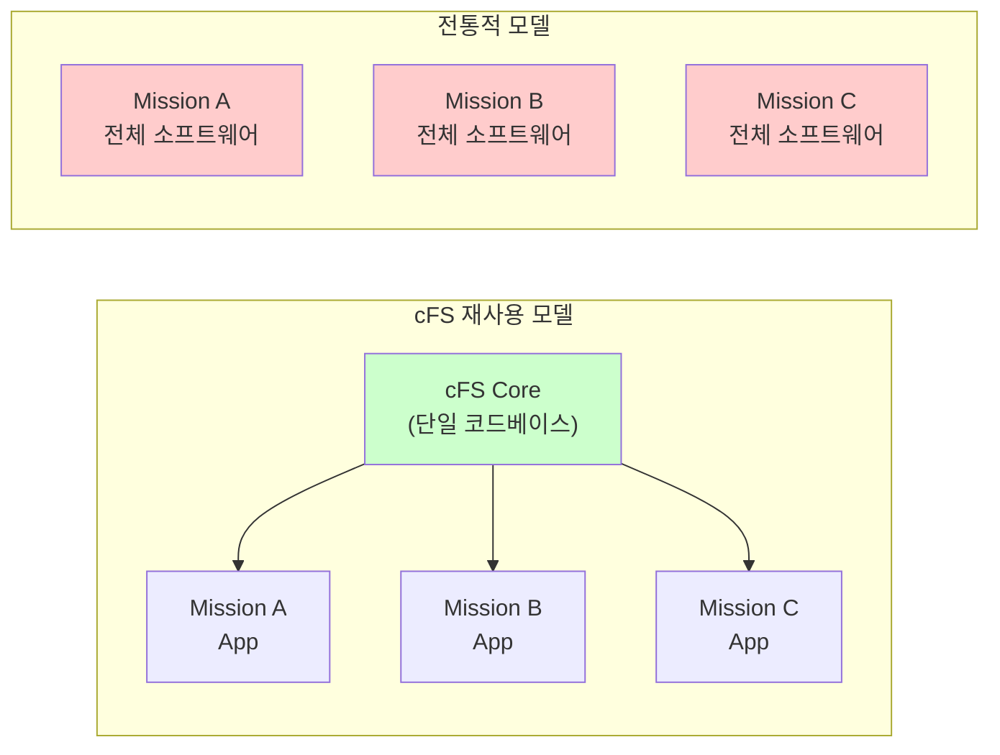
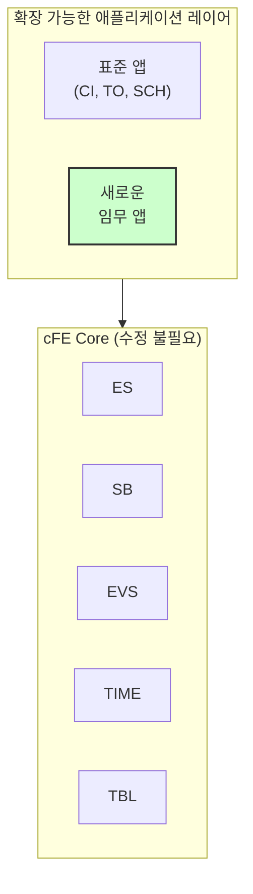
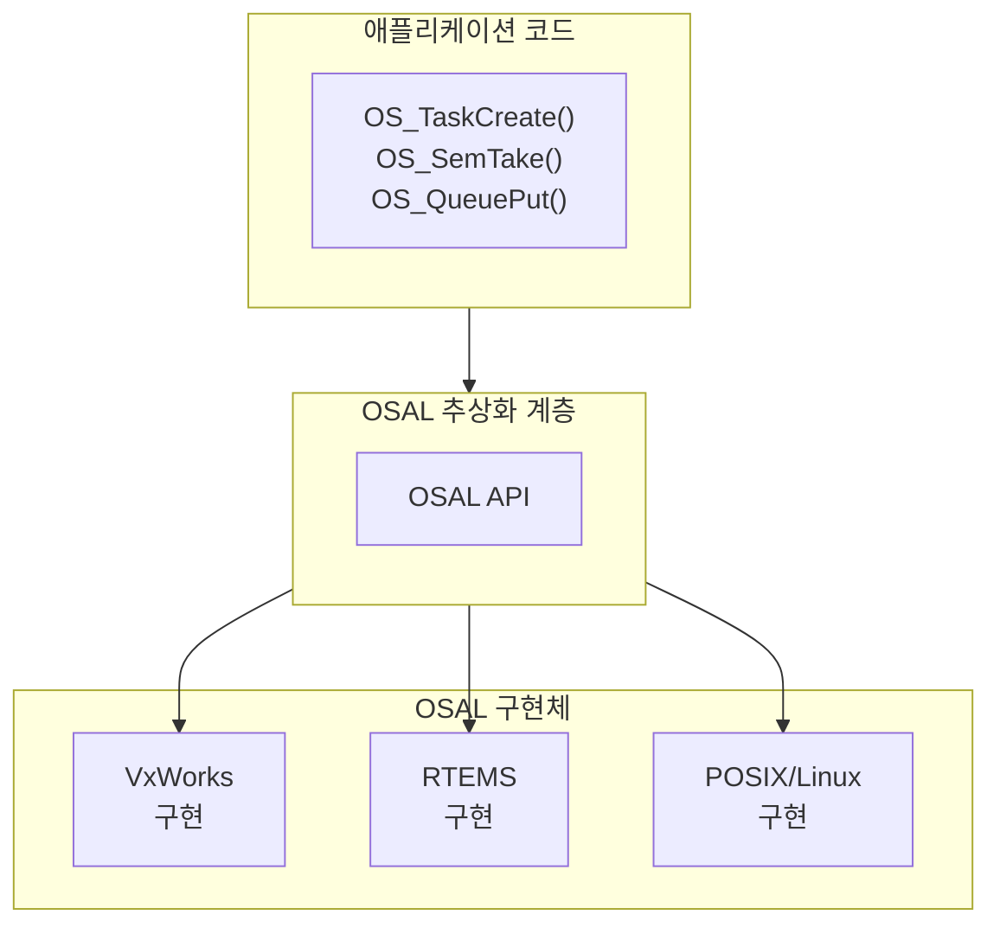
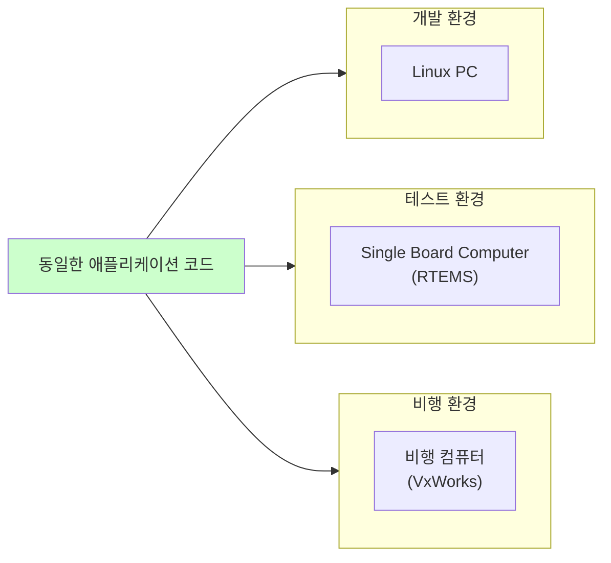
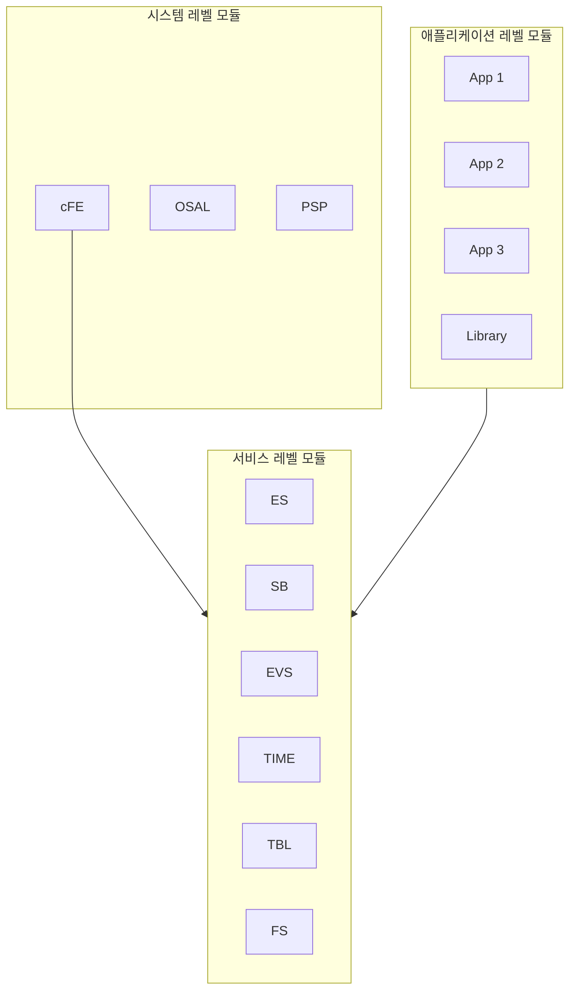
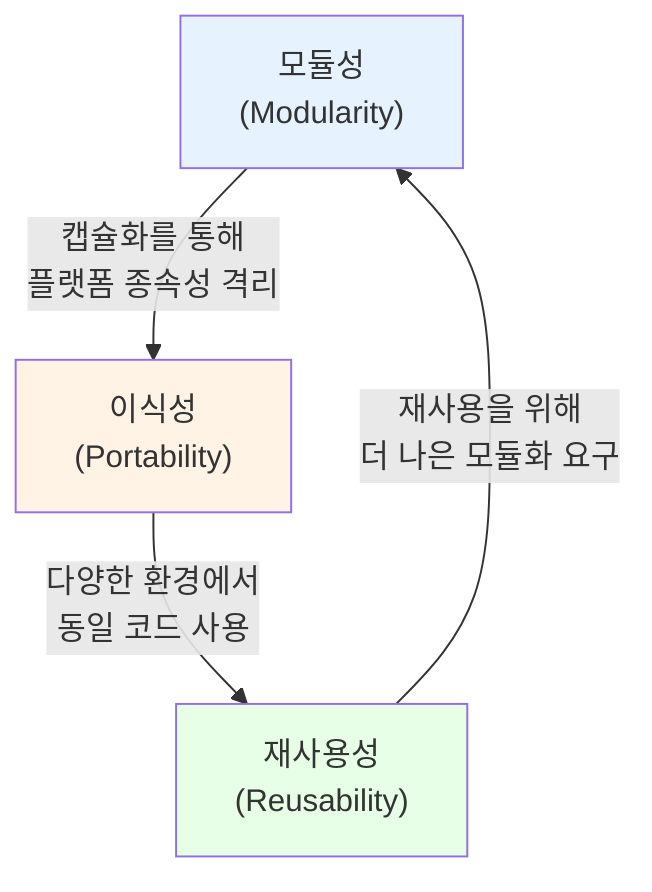

# Phase 1-03: cFS의 설계 철학

## 서론

Core Flight System의 성공은 우연의 산물이 아니다. cFS는 명확한 설계 철학을 바탕으로 구축되었으며, 이 철학은 프레임워크의 모든 측면에 스며들어 있다. 본 문서에서는 cFS의 핵심 설계 철학인 재사용성(Reusability), 이식성(Portability), 그리고 모듈성(Modularity)에 대해 깊이 있게 살펴볼 것이다.

이 세 가지 철학은 독립적으로 존재하는 것이 아니라, 서로 유기적으로 연결되어 있다. 재사용성을 달성하기 위해서는 이식성이 필요하고, 이식성과 재사용성 모두 모듈성을 통해 실현된다. 이러한 철학들을 이해하면 cFS의 아키텍처와 API 설계가 왜 그런 방식으로 이루어졌는지 자연스럽게 이해할 수 있게 될 것이다.

---

## 1. 재사용성 (Reusability)

### 1.1 재사용성의 정의

소프트웨어 재사용성이란 한 번 개발된 소프트웨어 컴포넌트를 다른 상황에서 수정 없이 또는 최소한의 수정만으로 다시 사용할 수 있는 특성을 말한다. cFS에서 재사용성은 단순히 코드를 복사하는 것이 아니라, 동일한 코드베이스를 여러 임무에서 공유하면서도 각 임무의 고유한 요구사항을 충족시킬 수 있는 것을 의미한다.



### 1.2 재사용성을 위한 설계 원칙

cFS에서 재사용성을 달성하기 위해 적용된 설계 원칙들은 다음과 같다.

#### 1.2.1 일반화 (Generalization)

cFS의 핵심 서비스들은 특정 임무의 요구사항이 아닌, 모든 비행 소프트웨어가 공통적으로 필요로 하는 기능을 제공하도록 설계되었다. 예를 들어, Software Bus는 어떤 종류의 메시지든 라우팅할 수 있으며, 메시지의 내용에 대해서는 관여하지 않는다.

```c
// Software Bus는 메시지 내용과 무관하게 동작한다
// 통신 위성의 텔레메트리든, 화성 탐사선의 과학 데이터든
// 동일한 메커니즘으로 처리된다
CFE_SB_TransmitMsg(&MessagePtr->TelemetryHeader.Msg, true);
```

#### 1.2.2 구성 가능성 (Configurability)

재사용 가능한 소프트웨어는 다양한 상황에 맞게 구성될 수 있어야 한다. cFS는 컴파일 타임 구성과 런타임 구성을 모두 지원한다.

**컴파일 타임 구성**: 헤더 파일에 정의된 매크로를 통해 최대 애플리케이션 수, 메시지 큐 깊이, 메모리 풀 크기 등을 조정할 수 있다.

```c
// platform_cfg.h 예시
#define CFE_PLATFORM_ES_MAX_APPLICATIONS    32
#define CFE_PLATFORM_SB_MAX_MSG_IDS         256
#define CFE_PLATFORM_ES_CDS_MAX_NUM_ENTRIES 512
```

**런타임 구성**: Table Services를 통해 운영 중에도 파라미터를 변경할 수 있다.

#### 1.2.3 확장 가능성 (Extensibility)

재사용되는 핵심 컴포넌트를 수정하지 않고도 새로운 기능을 추가할 수 있어야 한다. cFS에서는 이것이 애플리케이션 레이어를 통해 실현된다. 핵심 cFE 서비스를 건드리지 않고, 새로운 애플리케이션을 추가하기만 하면 된다.



### 1.3 재사용의 수준

cFS에서 재사용은 여러 수준에서 이루어진다:

| 수준 | 설명 | 예시 |
|:---|:---|:---|
| 코드 재사용 | 동일한 소스 코드가 여러 임무에서 사용됨 | cFE 핵심 서비스 |
| 컴포넌트 재사용 | 완전한 애플리케이션이 재사용됨 | CI_LAB, TO_LAB |
| 아키텍처 재사용 | 전체 시스템 구조가 재사용됨 | cFS 계층 구조 |
| 지식 재사용 | 개발 경험과 노하우가 전달됨 | cFS 커뮤니티 지식 |

---

## 2. 이식성 (Portability)

### 2.1 이식성의 정의

이식성이란 소프트웨어가 다양한 플랫폼에서 동작할 수 있는 능력을 말한다. cFS에서 이식성은 두 가지 차원에서 고려된다: 운영체제 이식성과 하드웨어 이식성이다.

### 2.2 운영체제 추상화

cFS는 Operating System Abstraction Layer(OSAL)를 통해 운영체제 이식성을 달성한다. OSAL은 다양한 RTOS의 기능을 추상화하여 일관된 API를 제공한다.



OSAL이 추상화하는 주요 기능들은 다음과 같다:

#### 2.2.1 태스크 관리

```c
// OSAL 태스크 API - 모든 OS에서 동일하게 사용
int32 OS_TaskCreate(osal_id_t *task_id,
                    const char *task_name,
                    osal_task_entry function_pointer,
                    osal_stackptr_t stack_pointer,
                    size_t stack_size,
                    osal_priority_t priority,
                    uint32 flags);

int32 OS_TaskDelay(uint32 milliseconds);
int32 OS_TaskDelete(osal_id_t task_id);
```

#### 2.2.2 동기화 프리미티브

```c
// 뮤텍스 API
int32 OS_MutSemCreate(osal_id_t *sem_id, const char *sem_name, uint32 options);
int32 OS_MutSemTake(osal_id_t sem_id);
int32 OS_MutSemGive(osal_id_t sem_id);

// 바이너리 세마포어 API
int32 OS_BinSemCreate(osal_id_t *sem_id, const char *sem_name, 
                       uint32 sem_initial_value, uint32 options);
int32 OS_BinSemTake(osal_id_t sem_id);
int32 OS_BinSemGive(osal_id_t sem_id);
```

#### 2.2.3 메시지 큐

```c
// 큐 API
int32 OS_QueueCreate(osal_id_t *queue_id, const char *queue_name,
                      uint32 queue_depth, uint32 data_size, uint32 flags);
int32 OS_QueuePut(osal_id_t queue_id, const void *data, 
                   size_t size, uint32 flags);
int32 OS_QueueGet(osal_id_t queue_id, void *data, 
                   size_t size, size_t *size_copied, int32 timeout);
```

### 2.3 하드웨어 추상화

Platform Support Package(PSP)는 하드웨어 플랫폼의 차이를 추상화한다. PSP가 담당하는 영역은 다음과 같다:

| 영역 | 설명 |
|:---|:---|
| 시스템 초기화 | 프로세서와 주변장치 초기화 |
| 메모리 관리 | 물리/가상 메모리 매핑 |
| 시간 하드웨어 | 하드웨어 타이머, 1Hz 신호 |
| 워치독 타이머 | 시스템 감시 기능 |
| 리셋 제어 | 다양한 리셋 유형 구현 |
| 예외 처리 | 하드웨어 예외 및 인터럽트 |

### 2.4 이식성의 실제 효과

이식성 덕분에 cFS 애플리케이션은 다음과 같은 환경에서 동일하게 동작할 수 있다:



개발자는 일반 Linux PC에서 애플리케이션을 개발하고 테스트한 후, 수정 없이 실제 비행 컴퓨터에 배포할 수 있다. 이는 개발 효율성을 크게 높여준다.

---

## 3. 모듈성 (Modularity)

### 3.1 모듈성의 정의

모듈성이란 시스템을 독립적이고 교환 가능한 컴포넌트로 분해하는 설계 원칙이다. 각 모듈은 명확하게 정의된 인터페이스를 가지며, 내부 구현은 캡슐화되어 있다.

### 3.2 cFS의 모듈 구조

cFS는 여러 수준에서 모듈화되어 있다:



### 3.3 모듈 간 결합도 최소화

cFS에서 모듈 간의 결합도는 Software Bus를 통해 최소화된다. 모듈들은 직접 함수를 호출하는 대신 메시지를 교환한다.

#### 3.3.1 강한 결합의 문제

전통적인 설계에서 모듈들이 직접 함수를 호출하면 강한 결합이 발생한다:

```c
// 강한 결합 예시 - 피해야 할 패턴
void ModuleA_Function(void)
{
    // ModuleA가 ModuleB의 내부 함수를 직접 호출
    // ModuleB가 변경되면 ModuleA도 수정해야 함
    ModuleB_InternalFunction();
}
```

#### 3.3.2 느슨한 결합의 구현

cFS에서는 Software Bus를 통한 메시지 기반 통신으로 느슨한 결합을 달성한다:

```c
// 느슨한 결합 - cFS 방식
void ModuleA_Function(void)
{
    // 메시지를 생성하여 Software Bus로 전송
    // ModuleB의 내부 구현을 알 필요 없음
    MyCommand_t Cmd;
    CFE_MSG_Init(&Cmd.CmdHeader.Msg, MY_CMD_MID, sizeof(Cmd));
    CFE_SB_TransmitMsg(&Cmd.CmdHeader.Msg, true);
}

// ModuleB는 해당 메시지를 구독하여 수신
void ModuleB_ProcessPipe(void)
{
    CFE_SB_Buffer_t *BufPtr;
    CFE_SB_ReceiveBuffer(&BufPtr, PipeId, CFE_SB_PEND_FOREVER);
    // 메시지 처리
}
```

### 3.4 응집도 최대화

각 모듈은 하나의 명확한 책임을 가지도록 설계되어 있다:

| 모듈 | 단일 책임 |
|:---|:---|
| Executive Services | 애플리케이션 생명주기 관리 |
| Software Bus | 메시지 라우팅 |
| Event Services | 이벤트 로깅 및 필터링 |
| Time Services | 시간 관리 |
| Table Services | 파라미터 테이블 관리 |
| File Services | 파일 시스템 접근 |

### 3.5 인터페이스 정의

각 모듈은 명확하게 정의된 API를 통해서만 접근할 수 있다. cFS에서 API는 다음과 같은 원칙을 따른다:

#### 3.5.1 일관된 명명 규칙

```c
// CFE_XX_FunctionName 형식
// XX는 서비스 약어 (ES, SB, EVS, TIME, TBL, FS)
CFE_ES_RunLoop()
CFE_SB_TransmitMsg()
CFE_EVS_SendEvent()
CFE_TIME_GetTime()
CFE_TBL_GetAddress()
CFE_FS_WriteHeader()
```

#### 3.5.2 명확한 반환 값

```c
// 모든 API는 CFE_Status_t를 반환
// CFE_SUCCESS: 성공
// 음수 값: 오류 코드
CFE_Status_t Status;

Status = CFE_SB_Subscribe(MsgId, PipeId);
if (Status != CFE_SUCCESS)
{
    CFE_EVS_SendEvent(SUBSCRIBE_ERR_EID, CFE_EVS_EventType_ERROR,
                      "Subscribe failed: 0x%08X", (unsigned int)Status);
}
```

### 3.6 교체 가능성

모듈화된 설계 덕분에 개별 컴포넌트를 교체할 수 있다:

- OSAL 구현을 교체하여 새로운 RTOS를 지원할 수 있다
- PSP를 교체하여 새로운 하드웨어를 지원할 수 있다
- 표준 애플리케이션을 커스텀 구현으로 교체할 수 있다

---

## 4. 세 철학의 상호작용

재사용성, 이식성, 모듈성은 독립적인 개념이 아니라 서로 강화하는 관계에 있다.



### 4.1 모듈성이 이식성을 가능하게 함

플랫폼에 종속적인 코드가 OSAL과 PSP 모듈에 격리되어 있기 때문에, 나머지 코드는 플랫폼과 무관하게 유지될 수 있다.

### 4.2 이식성이 재사용성을 가능하게 함

동일한 코드가 개발 환경의 Linux PC에서도, 테스트 환경의 RTEMS에서도, 비행 환경의 VxWorks에서도 동작하기 때문에, 진정한 의미의 코드 재사용이 가능하다.

### 4.3 재사용성이 모듈화를 요구함

코드를 효과적으로 재사용하려면, 재사용할 부분과 임무별로 달라지는 부분이 명확히 분리되어야 한다. 이것이 더 나은 모듈화를 이끈다.

---

## 5. 설계 철학의 실제 적용

### 5.1 애플리케이션 개발 시

cFS 위에서 애플리케이션을 개발할 때, 이 세 가지 철학을 염두에 두어야 한다:

**재사용성을 위해**:
- 임무에 특화된 로직과 일반적인 로직을 분리하라
- 하드코딩 대신 구성 가능한 파라미터를 사용하라
- 표준 cFS 패턴과 API를 따르라

**이식성을 위해**:
- OSAL API를 통해서만 운영체제 기능에 접근하라
- 플랫폼 특화 코드는 PSP로 격리하라
- 엔디안이나 데이터 정렬 등 플랫폼 차이에 주의하라

**모듈성을 위해**:
- 애플리케이션 간에는 Software Bus를 통해서만 통신하라
- 각 애플리케이션은 단일 책임을 가지도록 설계하라
- 공유 기능은 라이브러리로 분리하라

### 5.2 코드 예시

다음은 세 가지 철학을 모두 반영한 애플리케이션 구조의 예시이다:

```c
/*
** 애플리케이션 메인 함수 - 모듈화된 구조
*/
void MY_APP_Main(void)
{
    CFE_Status_t Status;
    
    /* 초기화 - 재사용 가능한 패턴 */
    Status = MY_APP_Init();
    if (Status != CFE_SUCCESS)
    {
        return;
    }
    
    /* 메인 루프 - 표준 cFS 패턴 */
    while (CFE_ES_RunLoop(&RunStatus))
    {
        /* Software Bus를 통한 통신 - 느슨한 결합 */
        Status = CFE_SB_ReceiveBuffer(&BufPtr, PipeId, Timeout);
        
        if (Status == CFE_SUCCESS)
        {
            MY_APP_ProcessMessage(BufPtr);
        }
    }
    
    /* 정리 - 리소스 해제 */
    MY_APP_Cleanup();
}
```

---

## 결론

cFS의 설계 철학인 재사용성, 이식성, 모듈성은 프레임워크의 모든 측면에 영향을 미치는 핵심 원칙들이다. 이 철학들은 수십 년간의 비행 소프트웨어 개발 경험에서 축적된 교훈을 반영하고 있다.

재사용성은 개발 비용을 줄이고 품질을 높인다. 이식성은 다양한 플랫폼에서 동작할 수 있게 해준다. 모듈성은 시스템을 이해하기 쉽게 만들고 유지보수를 용이하게 한다. 이 세 가지가 함께 작용하여 cFS는 우주 비행 소프트웨어 개발의 표준 프레임워크로 자리잡을 수 있었다.

다음 문서에서는 cFS가 실제로 어떤 NASA 임무들에서 사용되었는지, 그리고 각 임무에서 어떤 성과를 거두었는지 구체적인 사례를 통해 살펴볼 것이다.

---

## 참고 문헌

1. NASA, "Core Flight System Design Philosophy"
2. NASA Goddard Space Flight Center, "cFS Architecture Overview"
3. IEEE, "Software Reusability: Concepts and Models"
4. cFS Community, "Best Practices for cFS Application Development"

---

[이전 문서: Phase 1-02: cFS가 해결하고자 하는 문제](./Phase1_02_cFS가_해결하고자_하는_문제.md)

[다음 문서: Phase 1-04: cFS 적용 사례 연구](./Phase1_04_cFS_적용_사례_연구.md)
