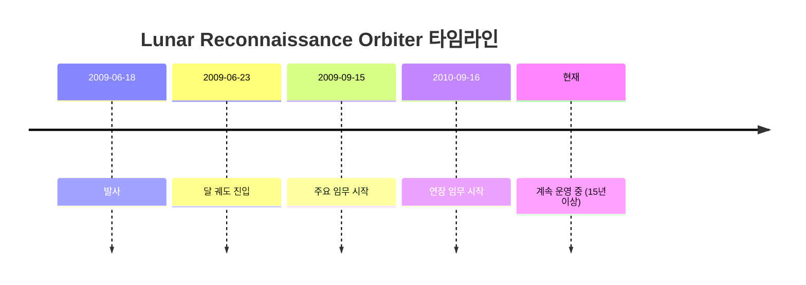
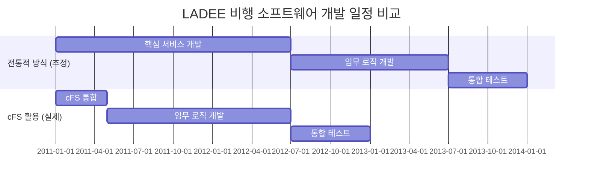
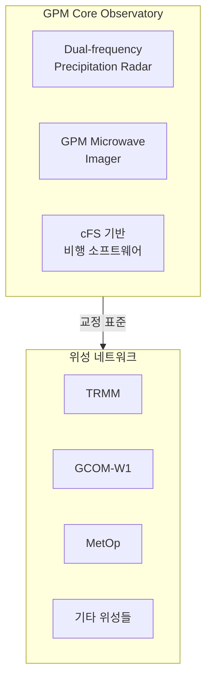
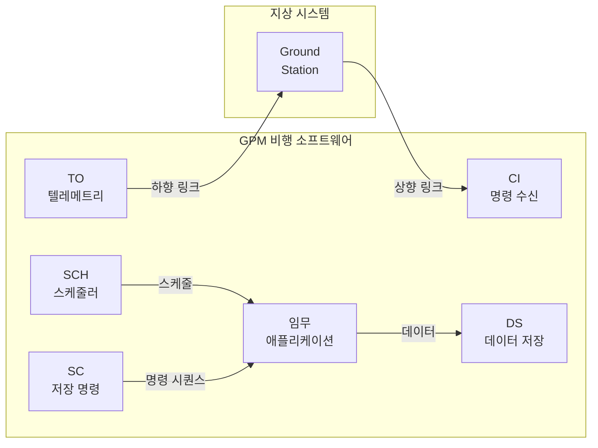
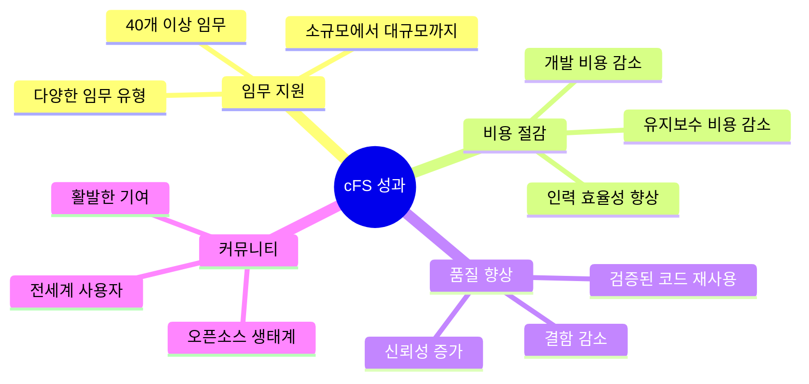
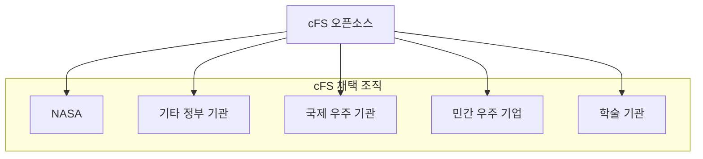

# Phase 1-04: cFS 적용 사례 연구

## 서론

이론은 실제 적용을 통해 검증된다. Core Flight System(cFS)은 단순히 잘 설계된 프레임워크에 그치는 것이 아니라, 수십 년간 다양한 NASA 임무에서 실제로 사용되며 그 가치를 입증해온 시스템이다. 본 문서에서는 cFS가 적용된 대표적인 NASA 임무들을 상세히 살펴보고, 각 임무에서 cFS가 어떤 역할을 수행하였으며 어떤 성과를 거두었는지 분석한다.

이러한 사례 연구를 통해 cFS가 실제 우주 환경에서 어떻게 동작하는지, 그리고 다양한 유형의 임무에 어떻게 적응하는지를 이해할 수 있을 것이다.

---

## 1. Lunar Reconnaissance Orbiter (LRO)

### 1.1 임무 개요

Lunar Reconnaissance Orbiter(LRO, 달 정찰 궤도선)는 2009년 6월 18일 발사된 NASA의 달 탐사 임무이다. LRO의 주요 목적은 달 표면의 고해상도 지도를 작성하고, 미래의 유인 달 탐사를 위한 착륙 후보지를 탐색하는 것이었다.

### 1.2 cFS 적용의 의의

LRO는 Core Flight Executive(cFE)를 처음으로 실제 비행 임무에 적용한 사례이다. 이것은 cFS 역사에 있어 중요한 이정표였다. LRO 이전까지 cFE는 개발과 테스트 단계에 있었으며, 실제 우주 환경에서의 검증은 이루어지지 않은 상태였다.

LRO 비행 소프트웨어 팀은 상당한 위험을 감수하며 cFE를 채택하였다. 새로운 프레임워크를 미검증 상태에서 사용한다는 것은 불확실성을 동반하기 때문이다. 그러나 이 결정은 올바른 것으로 판명되었다.

### 1.3 기술적 성과

LRO에서 cFE는 다음과 같은 역할을 수행하였다:

| 서비스 | LRO에서의 역할 |
|:---|:---|
| Executive Services | 탑재 애플리케이션 관리, 시스템 초기화 |
| Software Bus | 7개 탑재 장비와의 데이터 교환 |
| Event Services | 운영 이벤트 로깅 및 지상 전송 |
| Time Services | 온보드 시간 동기화 |
| Table Services | 임무 파라미터 런타임 업데이트 |

LRO는 발사 이후 15년 이상 운영되고 있으며, 이 기간 동안 cFE 기반 비행 소프트웨어는 안정적으로 동작하였다. 이러한 장기 운영 경험은 cFS의 신뢰성을 입증하는 강력한 증거가 되었다.

### 1.4 교훈과 영향

LRO 임무는 cFS 개발에 귀중한 피드백을 제공하였다:

- 실제 운영 환경에서 발견된 문제점들이 수정되었다
- 성능 최적화에 대한 통찰을 얻었다
- 운영자 관점에서의 사용성 개선점이 파악되었다

LRO의 성공은 다른 임무들이 cFS를 채택하는 데 결정적인 역할을 하였다. "LRO에서 동작했으니 우리 임무에서도 동작할 것"이라는 신뢰가 형성된 것이다.

---

## 2. LADEE (Lunar Atmosphere and Dust Environment Explorer)

### 2.1 임무 개요

LADEE는 2013년 9월 6일 발사된 달 탐사 임무이다. 주요 목적은 달의 희박한 대기와 먼지 환경을 조사하고, 레이저 통신 기술을 시연하는 것이었다. LADEE는 특히 예산과 일정 면에서 매우 도전적인 프로젝트였다.

### 2.2 cFS 채택의 배경

LADEE 팀이 cFS를 채택한 결정적인 이유는 일정과 예산 제약이었다. 비행 소프트웨어를 처음부터 개발할 시간과 자원이 없었다. cFS는 이 문제에 대한 해답이었다.

프로젝트 관리자의 결단으로 LADEE는 다음과 같은 cFS 컴포넌트들을 활용하였다:

- **cFE**: 전체 비행 소프트웨어 런타임 환경
- **OSAL**: VxWorks RTOS와의 인터페이스
- **표준 cFS 애플리케이션**: 검증된 공통 기능 활용

### 2.3 성과 분석

LADEE에서 cFS 활용의 성과는 여러 측면에서 측정될 수 있다:

#### 2.3.1 개발 시간 단축

cFS를 활용함으로써 핵심 서비스 개발에 소요되었을 시간을 대폭 단축하고, 그 시간을 임무 고유의 로직 개발에 투자할 수 있었다.

#### 2.3.2 인력 효율성

소규모 팀으로도 복잡한 비행 소프트웨어를 개발할 수 있었다. 팀원들은 cFE의 내부를 이해할 필요 없이, cFS API를 사용하는 방법만 익히면 되었다.

#### 2.3.3 품질 향상

검증된 cFS 컴포넌트를 사용함으로써, 새로 작성한 코드에서 발생할 수 있는 버그 위험이 줄어들었다. 실제로 LADEE 임무 동안 cFS 코어에서 발생한 문제는 보고되지 않았다.

### 2.4 임무 결과

LADEE는 2013년 9월 발사되어 2014년 4월까지 성공적으로 임무를 수행하였다. 모든 과학적 목표를 달성하였으며, 레이저 통신 시연도 성공적으로 완료하였다. 예산과 일정 내에서 임무를 완수한 것은 cFS 활용의 직접적인 결과로 평가되었다.

---

## 3. Global Precipitation Measurement (GPM)

### 3.1 임무 개요

Global Precipitation Measurement(GPM, 전지구 강수 측정)는 2014년 2월 27일 발사된 지구 관측 위성이다. GPM은 전 세계의 비와 눈을 측정하는 국제 위성 네트워크의 핵심 위성으로, 기상 예보와 기후 연구에 중요한 데이터를 제공한다.

### 3.2 전체 cFS 스위트의 첫 배치

GPM은 cFS 역사에서 특별한 위치를 차지한다. GPM은 단순히 cFE만을 사용한 것이 아니라, 전체 cFS 애플리케이션 스위트를 처음으로 배치한 임무였다. NASA Goddard Space Flight Center는 GPM을 위해 열 개의 cFS 애플리케이션을 공동 개발하였다.

### 3.3 GPM에서 사용된 cFS 컴포넌트

| 컴포넌트 | 역할 |
|:---|:---|
| cFE | 핵심 서비스 제공 |
| OSAL | 운영체제 추상화 |
| Command Ingest (CI) | 지상 명령 수신 및 처리 |
| Telemetry Output (TO) | 텔레메트리 지상 전송 |
| Scheduler (SCH) | 주기적 작업 스케줄링 |
| Housekeeping (HK) | 시스템 상태 수집 |
| Stored Command (SC) | 저장된 명령 시퀀스 실행 |
| Limit Checker (LC) | 파라미터 한계 감시 |
| Data Storage (DS) | 과학 데이터 저장 관리 |
| File Manager (FM) | 온보드 파일 관리 |

### 3.4 표준 애플리케이션의 중요성

GPM 임무를 통해 표준 cFS 애플리케이션의 가치가 입증되었다. 이 애플리케이션들은 거의 모든 비행 임무에서 필요한 공통 기능들을 제공한다:

### 3.5 GPM의 영향

GPM의 성공적인 운영은 cFS 생태계 발전에 큰 영향을 미쳤다:

1. **표준 애플리케이션의 검증**: GPM에서 사용된 애플리케이션들이 다른 임무에서도 재사용 가능함이 입증되었다

2. **개발 프로세스 확립**: GPM 개발 과정에서 확립된 cFS 애플리케이션 개발 방법론이 문서화되었다

3. **커뮤니티 성장**: GPM 경험을 바탕으로 cFS를 사용하려는 다른 프로젝트들이 증가하였다

---

## 4. NASA Software of the Year Award (2020)

### 4.1 수상의 의미

2020년, cFS는 NASA Software of the Year Award를 수상하였다. 이 상은 NASA에서 개발된 가장 뛰어난 소프트웨어에 주어지는 것으로, cFS의 장기적인 공헌을 인정하는 것이었다.

### 4.2 수상 근거

수상 심사에서 다음과 같은 성과들이 평가되었다:

### 4.3 40개 이상의 임무

수상 시점까지 cFS는 다음과 같은 다양한 임무에서 사용되었다:

| 임무 유형 | 예시 |
|:---|:---|
| 달 탐사 | LRO, LADEE |
| 지구 관측 | GPM, PACE, TEMPO |
| 태양 관측 | SDO |
| 우주 망원경 | 다양한 천문관측 임무 |
| 큐브샛 | 소형 위성 임무들 |
| 심우주 탐사 | 다양한 탐사 임무 |

---

## 5. 상업 및 국제 채택

### 5.1 NASA 외부로의 확산

cFS가 오픈소스로 공개된 이후, NASA 이외의 조직들도 이 프레임워크를 채택하기 시작하였다.

#### 5.1.1 다른 정부 기관

미국 내 다른 정부 기관들도 cFS를 활용하고 있다. 각 기관의 요구사항에 맞게 커스터마이즈하여 사용하며, 이를 통해 개발 비용을 절감하고 있다.

#### 5.1.2 국제 우주 기관

여러 국가의 우주 기관들이 cFS를 검토하거나 채택하고 있다. 오픈소스 공개로 인해 국제적인 접근이 가능해졌으며, 이는 전 세계적으로 비행 소프트웨어 품질을 향상시키는 데 기여하고 있다.

#### 5.1.3 민간 우주 기업

뉴스페이스 시대를 맞아, 민간 우주 기업들도 cFS에 관심을 보이고 있다. 스타트업에게 cFS는 고품질 비행 소프트웨어를 빠르게 개발할 수 있는 방법을 제공한다.

### 5.2 학술 기관

대학교와 연구 기관들도 cFS를 활용하고 있다:

- **교육용**: 학생들에게 비행 소프트웨어 개발을 가르치는 데 사용
- **연구용**: 비행 소프트웨어 관련 연구의 플랫폼으로 활용
- **큐브샛 프로젝트**: 학생 주도 소형 위성 프로젝트에서 사용

---

## 6. cFS 채택시 고려사항

### 6.1 cFS가 적합한 경우

사례 연구를 바탕으로, cFS가 특히 효과적인 상황은 다음과 같다:

- 일정이나 예산에 제약이 있는 프로젝트
- 팀이 비행 소프트웨어 개발 경험이 제한적인 경우
- 다양한 플랫폼에서 동작해야 하는 경우
- 장기 운영이 예상되는 임무
- 향후 유사 임무가 계획되어 재사용 가치가 있는 경우

### 6.2 성공적인 채택을 위한 조언

cFS를 채택한 임무들의 경험을 바탕으로, 다음과 같은 조언이 도출되었다:

1. **충분한 학습 시간 확보**: cFS의 개념과 API를 이해하는 데 시간을 투자해야 한다

2. **커뮤니티 활용**: cFS 커뮤니티의 도움을 적극적으로 받아야 한다

3. **단계적 접근**: 한 번에 모든 기능을 사용하려 하지 말고, 단계적으로 도입해야 한다

4. **표준 패턴 준수**: cFS의 표준 패턴과 규칙을 따라야 최대 효과를 얻을 수 있다

---

## 결론

Lunar Reconnaissance Orbiter에서 첫 발을 딛은 이후, cFS는 LADEE, GPM을 거쳐 수십 개의 NASA 임무에서 성공적으로 사용되어 왔다. 각 임무에서 cFS는 개발 시간을 단축하고, 비용을 절감하며, 품질을 향상시키는 데 기여하였다.

2020년 NASA Software of the Year Award 수상은 이러한 성과들을 공식적으로 인정하는 것이었다. 그리고 오픈소스 공개를 통해 cFS의 가치는 NASA를 넘어 전 세계 우주 커뮤니티로 확산되고 있다.

다음 문서에서는 이러한 cFS의 전체 아키텍처를 상세히 살펴보고, 각 계층이 어떻게 구성되어 있는지 알아볼 것이다.

---

## 참고 문헌

1. NASA Goddard Space Flight Center, "Lunar Reconnaissance Orbiter Mission"
2. NASA, "LADEE Flight Software: A Case Study in cFS Adoption"
3. NASA, "Global Precipitation Measurement Core Observatory"
4. NASA, "Core Flight System Receives 2020 NASA Software of the Year Award"
5. cFS Community, coreflightsystem.net

---

[이전 문서: Phase 1-03: cFS의 설계 철학](./Phase1_03_cFS의_설계_철학.md)

[다음 문서: Phase 1-05: cFS 계층 구조 개요](./Phase1_05_cFS_계층_구조_개요.md)
