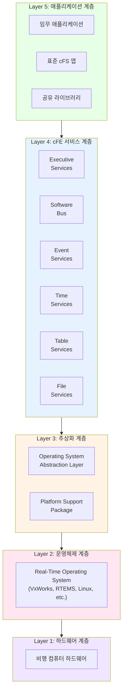
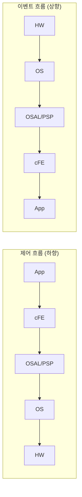
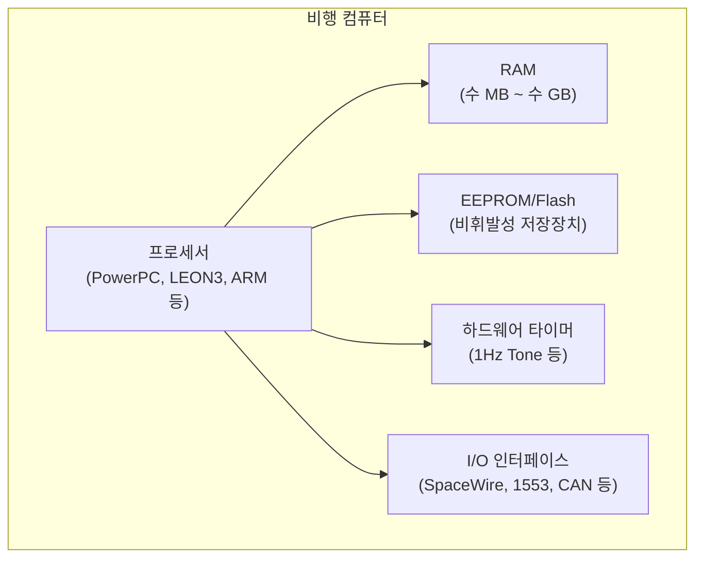
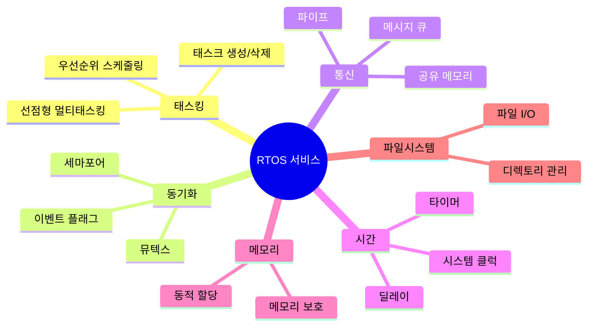
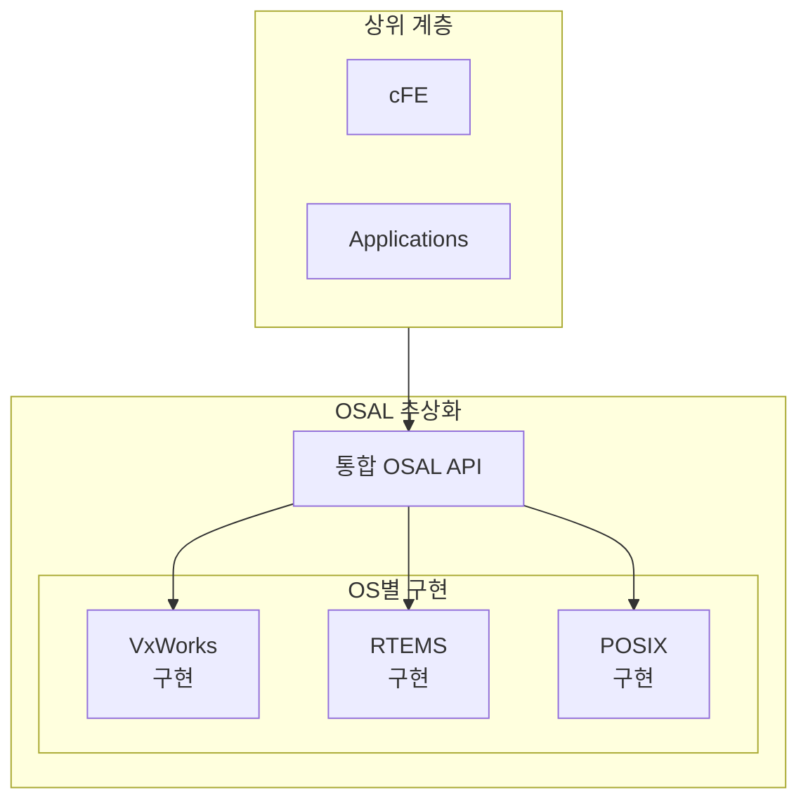
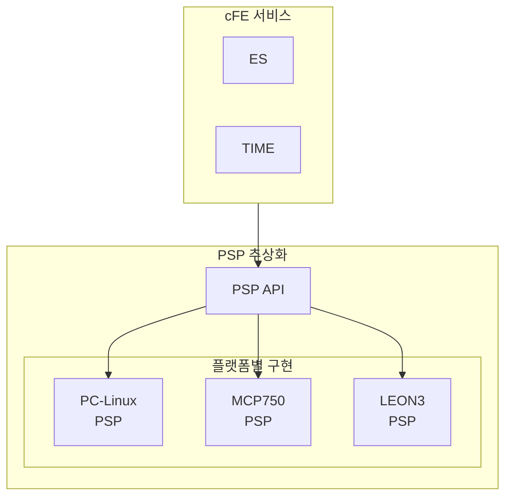
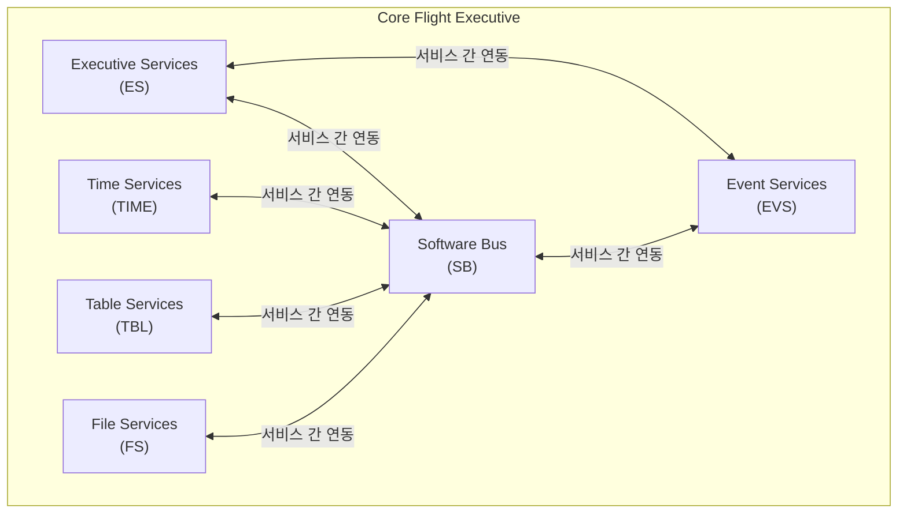
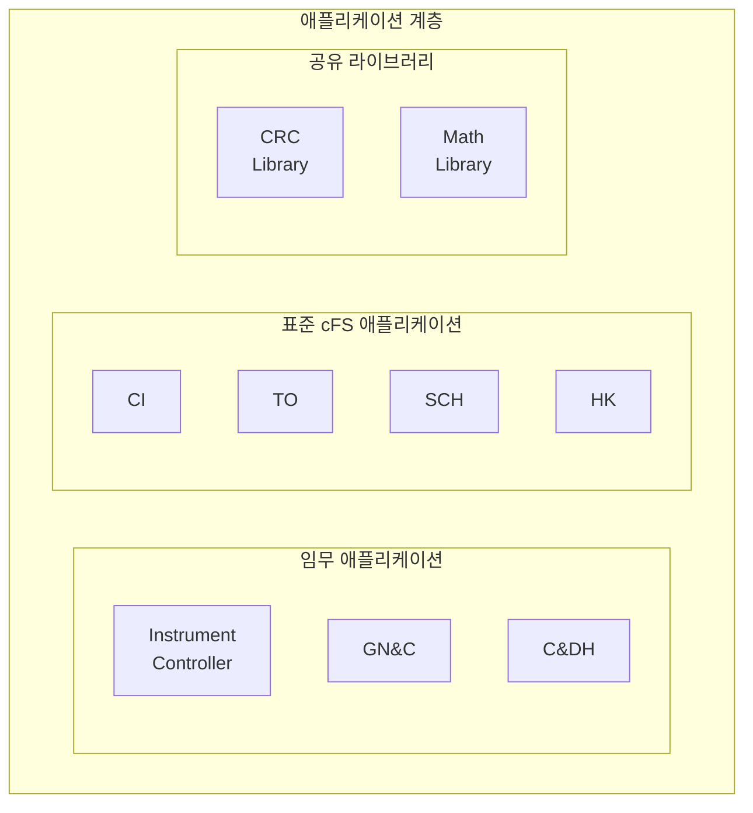
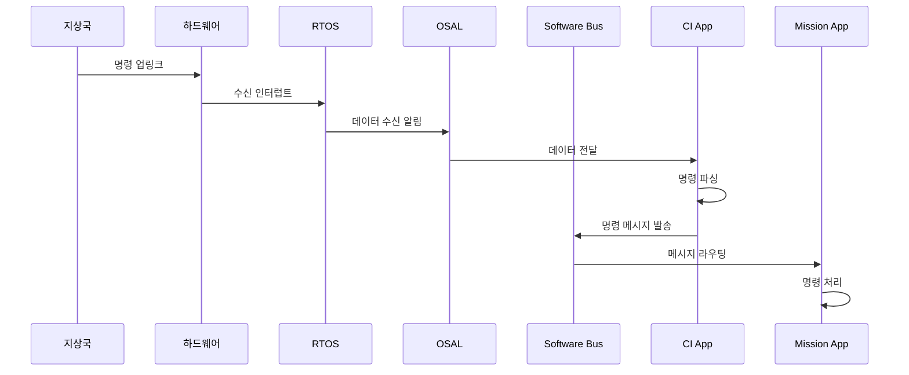
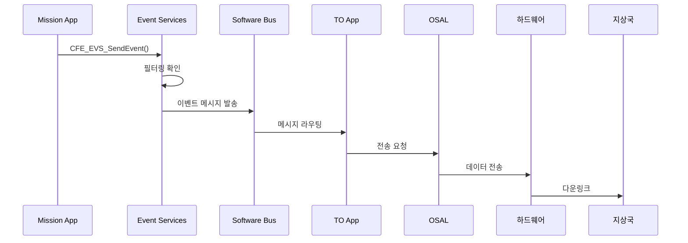

# Phase 1-05: cFS 계층 구조 개요

## 서론

Core Flight System(cFS)의 강력함은 그 아키텍처에서 비롯된다. cFS는 명확하게 정의된 계층 구조를 통해 재사용성, 이식성, 모듈성이라는 핵심 설계 목표를 달성한다. 본 문서에서는 cFS의 전체 계층 구조를 상세히 살펴보고, 각 계층의 역할과 책임, 그리고 계층 간의 상호작용을 이해한다.

이 구조를 이해하는 것은 cFS를 사용하여 비행 소프트웨어를 개발하는 데 있어 필수적인 첫 단계이다. 각 계층이 무엇을 담당하는지 알아야, 어디에 무엇을 구현해야 하는지 판단할 수 있기 때문이다.

---

## 1. cFS 아키텍처 전체 개요

### 1.1 계층화된 아키텍처

cFS는 다섯 개의 주요 계층으로 구성된다. 각 계층은 특정한 책임을 가지며, 아래 계층의 서비스를 사용하고 위 계층에 서비스를 제공한다.



### 1.2 계층화의 이점

이러한 계층화된 구조는 여러 가지 이점을 제공한다:

| 이점 | 설명 |
|:---|:---|
| **관심사의 분리** | 각 계층이 특정 기능에만 집중한다 |
| **교체 가능성** | 특정 계층을 다른 구현으로 교체할 수 있다 |
| **테스트 용이성** | 각 계층을 독립적으로 테스트할 수 있다 |
| **이식성** | 플랫폼 종속적인 코드가 하위 계층에 격리된다 |
| **재사용성** | 상위 계층은 플랫폼과 무관하게 재사용 가능하다 |

### 1.3 데이터 흐름과 제어 흐름

계층 간의 상호작용은 두 가지 관점에서 이해할 수 있다:

**하향식 제어 흐름**: 상위 계층이 하위 계층의 서비스를 호출한다. 예를 들어, 애플리케이션이 Software Bus API를 호출하고, Software Bus는 OSAL API를 호출한다.

**상향식 이벤트 흐름**: 하위 계층에서 발생한 이벤트가 상위 계층으로 전달된다. 예를 들어, 하드웨어 인터럽트가 PSP를 통해 cFE로, 그리고 애플리케이션으로 전달된다.



---

## 2. Layer 1: 하드웨어 계층

### 2.1 하드웨어 계층의 역할

하드웨어 계층은 cFS 아키텍처의 최하단에 위치한다. 이 계층은 비행 컴퓨터의 물리적 하드웨어를 나타내며, 프로세서, 메모리, 입출력 장치 등으로 구성된다.

### 2.2 일반적인 비행 컴퓨터 하드웨어

우주 임무에서 사용되는 비행 컴퓨터는 다양하지만, 일반적으로 다음과 같은 특성을 가진다:



### 2.3 하드웨어 다양성의 도전

cFS는 다양한 하드웨어 플랫폼을 지원해야 한다:

- **프로세서 아키텍처**: PowerPC, SPARC (LEON3), ARM, x86 등
- **엔디안**: Big-endian과 Little-endian 모두
- **메모리 크기**: 임베디드 시스템부터 고성능 시스템까지
- **I/O 인터페이스**: 임무마다 다른 통신 버스

이러한 다양성을 처리하기 위해 하드웨어 추상화 계층(PSP)이 필요하다.

---

## 3. Layer 2: 운영체제 계층

### 3.1 실시간 운영체제의 필요성

비행 소프트웨어는 결정론적인(deterministic) 동작을 요구한다. 특정 이벤트에 대해 정해진 시간 내에 응답해야 하며, 이를 위해 실시간 운영체제(RTOS)가 사용된다.

### 3.2 cFS가 지원하는 운영체제

cFS OSAL은 다음과 같은 운영체제들을 지원한다:

| 운영체제 | 특징 | 주요 사용 환경 |
|:---|:---|:---|
| **VxWorks** | 상용 RTOS, 높은 신뢰성 | NASA 주요 임무 |
| **RTEMS** | 오픈소스 RTOS, BSD 라이선스 | 연구/교육, 일부 비행 임무 |
| **Linux (POSIX)** | 범용 OS, 개발/테스트용 | 지상 개발 환경 |

### 3.3 RTOS의 주요 서비스

운영체제가 제공하고 cFS가 활용하는 주요 서비스는 다음과 같다:



---

## 4. Layer 3: 추상화 계층

추상화 계층은 cFS 아키텍처에서 가장 중요한 역할을 수행한다. 이 계층은 플랫폼 종속적인 코드와 플랫폼 독립적인 코드를 분리하여 이식성을 실현한다.

### 4.1 OSAL (Operating System Abstraction Layer)

#### 4.1.1 OSAL의 역할

OSAL은 다양한 운영체제의 API 차이를 숨기고, 상위 계층에 일관된 API를 제공한다. cFE와 애플리케이션은 OSAL API만 사용하며, 실제 운영체제가 무엇인지 알 필요가 없다.



#### 4.1.2 OSAL API 카테고리

OSAL이 제공하는 API는 다음과 같은 카테고리로 분류된다:

| 카테고리 | 주요 함수 | 용도 |
|:---|:---|:---|
| **태스크** | `OS_TaskCreate`, `OS_TaskDelay` | 태스크 생명주기 관리 |
| **바이너리 세마포어** | `OS_BinSemCreate`, `OS_BinSemTake` | 이벤트 신호 |
| **카운팅 세마포어** | `OS_CountSemCreate`, `OS_CountSemGive` | 리소스 카운팅 |
| **뮤텍스** | `OS_MutSemCreate`, `OS_MutSemTake` | 상호 배제 |
| **큐** | `OS_QueueCreate`, `OS_QueuePut` | 태스크 간 메시지 전달 |
| **타이머** | `OS_TimerCreate`, `OS_TimerSet` | 소프트웨어 타이머 |
| **파일** | `OS_open`, `OS_read`, `OS_write` | 파일 시스템 접근 |
| **디렉토리** | `OS_mkdir`, `OS_opendir` | 디렉토리 조작 |
| **모듈** | `OS_ModuleLoad`, `OS_SymbolLookup` | 동적 로딩 |

#### 4.1.3 OSAL 사용 예시

```c
/* OSAL을 사용한 태스크 생성 예시 */
osal_id_t TaskId;
int32 Status;

Status = OS_TaskCreate(&TaskId,              /* 태스크 ID 반환 */
                       "MyTask",             /* 태스크 이름 */
                       TaskFunction,         /* 진입점 함수 */
                       OSAL_TASK_STACK_ALLOCATE, /* 스택 자동 할당 */
                       OSAL_SIZE_C(4096),    /* 스택 크기 */
                       OSAL_PRIORITY_C(100), /* 우선순위 */
                       0);                   /* 플래그 */

if (Status != OS_SUCCESS)
{
    /* 에러 처리 */
}

/* 이 코드는 VxWorks, RTEMS, Linux 어디서든 동일하게 동작한다 */
```

### 4.2 PSP (Platform Support Package)

#### 4.2.1 PSP의 역할

PSP는 특정 하드웨어 플랫폼에 대한 지원을 제공한다. OSAL이 운영체제를 추상화한다면, PSP는 하드웨어를 추상화한다.



#### 4.2.2 PSP가 담당하는 영역

| 영역 | 설명 |
|:---|:---|
| **시스템 초기화** | 하드웨어 및 cFE 초기화 시퀀스 |
| **메모리 관리** | 메모리 영역 정의, 주소 매핑 |
| **리셋** | Power-on, Processor 리셋 구현 |
| **예외 처리** | 하드웨어 예외 핸들링 |
| **워치독** | 워치독 타이머 제어 |
| **시간 하드웨어** | 1Hz Tone, 하드웨어 타이머 |
| **시스템 로그** | 저수준 로깅 기능 |

#### 4.2.3 PSP API 함수 예시

```c
/* PSP API 함수들 */
void  CFE_PSP_Restart(uint32 ResetType);    /* 시스템 리셋 */
uint32 CFE_PSP_GetTimerTicksPerSecond(void); /* 타이머 틱 레이트 */
void  CFE_PSP_GetTime(OS_time_t *LocalTime); /* 현재 시간 */
int32 CFE_PSP_GetResetArea(cpuaddr *PtrToResetArea, 
                           uint32 *SizeOfResetArea);
void  CFE_PSP_WatchdogService(void);        /* 워치독 서비스 */
```

---

## 5. Layer 4: cFE 서비스 계층

### 5.1 cFE 서비스 개요

Core Flight Executive(cFE)는 cFS의 심장부이다. 여섯 가지 핵심 서비스를 제공하여 비행 소프트웨어 애플리케이션이 실행될 수 있는 환경을 만든다.



### 5.2 각 서비스 요약

| 서비스 | 약어 | 주요 역할 |
|:---|:---:|:---|
| **Executive Services** | ES | 시스템 초기화, 앱 관리, 리셋 처리, 메모리 풀 |
| **Software Bus** | SB | 앱 간 메시지 라우팅, Publish/Subscribe |
| **Event Services** | EVS | 이벤트 로깅, 필터링, 텔레메트리 전송 |
| **Time Services** | TIME | 우주선 시간 관리, 동기화 |
| **Table Services** | TBL | 런타임 파라미터 테이블 관리 |
| **File Services** | FS | cFE 파일 헤더, 파일 유틸리티 |

### 5.3 서비스 초기화 순서

cFE 서비스들은 특정 순서로 초기화된다. 각 서비스가 다른 서비스에 의존하기 때문이다:


---

## 6. Layer 5: 애플리케이션 계층

### 6.1 애플리케이션 계층의 구성

최상위 계층인 애플리케이션 계층은 실제 임무 로직이 구현되는 곳이다. 이 계층은 세 가지 유형의 컴포넌트로 구성된다:



### 6.2 임무 애플리케이션

임무 애플리케이션은 특정 임무의 고유한 요구사항을 구현한다:

- **과학 장비 제어**: 탑재 장비 동작 제어 및 데이터 수집
- **GN&C (Guidance, Navigation & Control)**: 자세 결정 및 제어
- **C&DH (Command & Data Handling)**: 명령 처리 및 데이터 관리
- **열 제어**: 온도 모니터링 및 제어
- **전력 관리**: 전력 분배 및 모니터링

### 6.3 표준 cFS 애플리케이션

NASA는 많은 임무에서 공통적으로 필요한 기능을 제공하는 표준 애플리케이션을 개발하였다:

| 애플리케이션 | 설명 |
|:---|:---|
| **CI (Command Ingest)** | 지상에서 올라온 명령 수신 및 배포 |
| **TO (Telemetry Output)** | 텔레메트리 패킷 지상 전송 |
| **SCH (Scheduler)** | 주기적 메시지 발송으로 앱 스케줄링 |
| **HK (Housekeeping)** | 시스템 상태 데이터 수집 및 보고 |
| **SC (Stored Command)** | 저장된 명령 시퀀스 실행 |
| **LC (Limit Checker)** | 텔레메트리 한계 감시 및 알림 |
| **DS (Data Storage)** | 데이터 파일 저장 관리 |
| **FM (File Manager)** | 온보드 파일 시스템 관리 |

### 6.4 공유 라이브러리

여러 애플리케이션이 공통으로 사용하는 기능은 라이브러리로 제공된다:

- 애플리케이션처럼 동적으로 로드되지만, 메인 루프가 없다
- 함수 호출을 통해 서비스를 제공한다
- 예: CFS 라이브러리, 수학 함수 라이브러리

---

## 7. 계층 간 상호작용 예시

### 7.1 명령 처리 흐름

지상에서 올라온 명령이 처리되는 과정을 통해 계층 간 상호작용을 이해해 보자:



### 7.2 이벤트 보고 흐름

애플리케이션에서 이벤트를 보고하는 과정:



---

## 8. 정리: cFS 계층 구조 요약표

| 계층 | 구성 요소 | 주요 역할 | 이식 시 변경 |
|:---:|:---|:---|:---:|
| **Layer 5** | 임무 앱, 표준 앱, 라이브러리 | 임무 로직 구현 | 임무별 |
| **Layer 4** | ES, SB, EVS, TIME, TBL, FS | 핵심 서비스 제공 | 불필요 |
| **Layer 3** | OSAL, PSP | 플랫폼 추상화 | OS/HW별 |
| **Layer 2** | VxWorks, RTEMS, Linux | 시스템 서비스 제공 | - |
| **Layer 1** | 비행 컴퓨터 | 물리적 실행 환경 | - |

---

## 결론

cFS의 계층 구조는 복잡한 비행 소프트웨어 시스템을 관리 가능한 부분으로 분해하는 효과적인 방법이다. 각 계층은 특정 책임을 가지며, 명확하게 정의된 인터페이스를 통해 상호작용한다.

이 구조 덕분에:
- 하드웨어나 운영체제가 바뀌어도 애플리케이션 코드는 변경할 필요가 없다
- 핵심 서비스는 검증된 상태로 재사용된다
- 개발자는 임무 고유의 로직에만 집중할 수 있다

다음 문서에서는 cFE와 OSAL, PSP 사이의 관계를 더욱 상세히 살펴보고, 이들이 어떻게 협력하여 완전한 비행 소프트웨어 환경을 구성하는지 알아볼 것이다.

---

## 참고 문헌

1. NASA, "cFE User's Guide"
2. NASA, "OSAL User's Guide"
3. NASA, "PSP Development Guide"
4. cFS Community, "cFS Architecture Overview"

---

[이전 문서: Phase 1-04: cFS 적용 사례 연구](./Phase1_04_cFS_적용_사례_연구.md)

[다음 문서: Phase 1-06: cFE와 OSAL, PSP의 관계](./Phase1_06_cFE와_OSAL_PSP의_관계.md)
