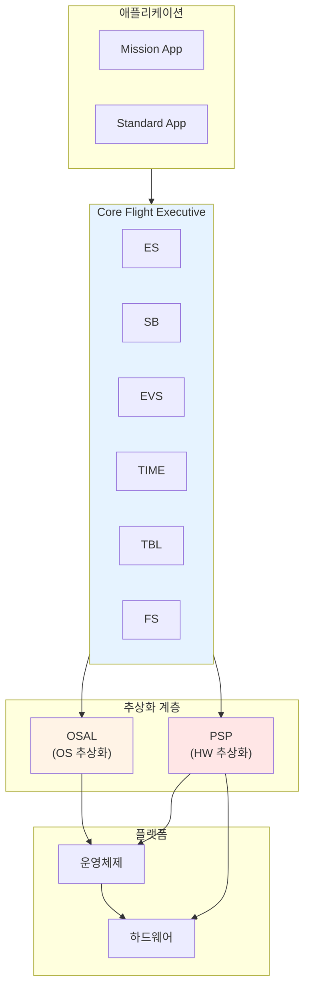
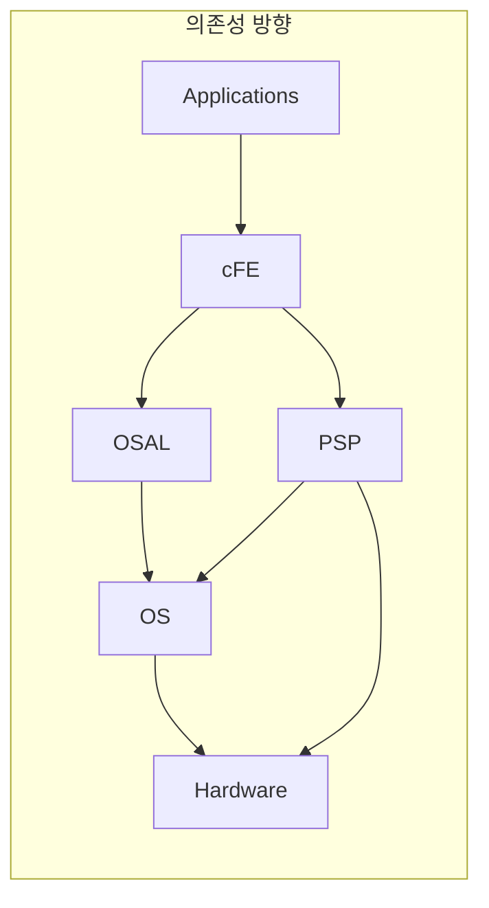
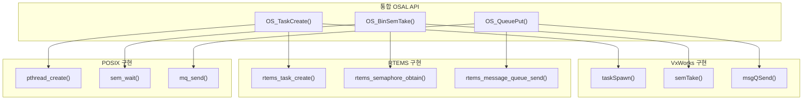
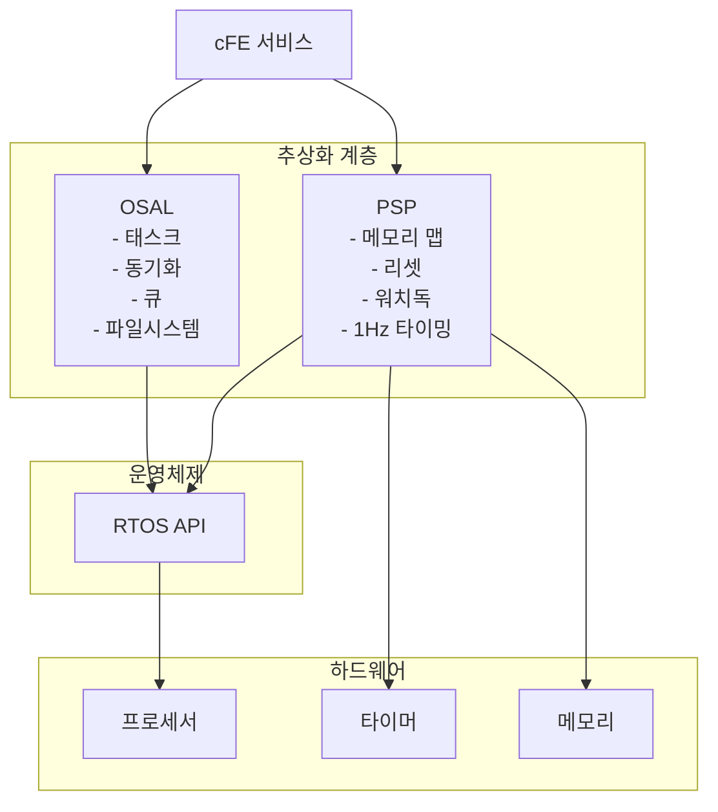
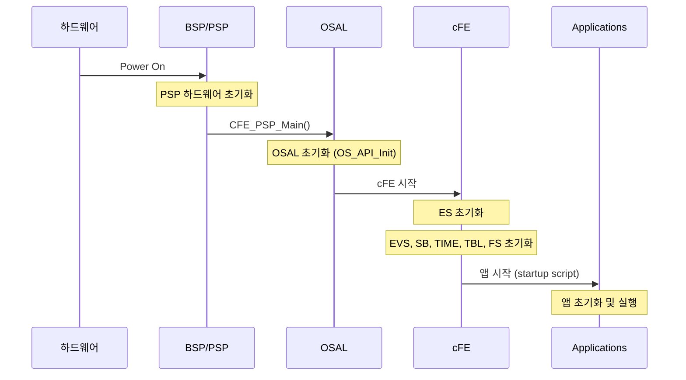
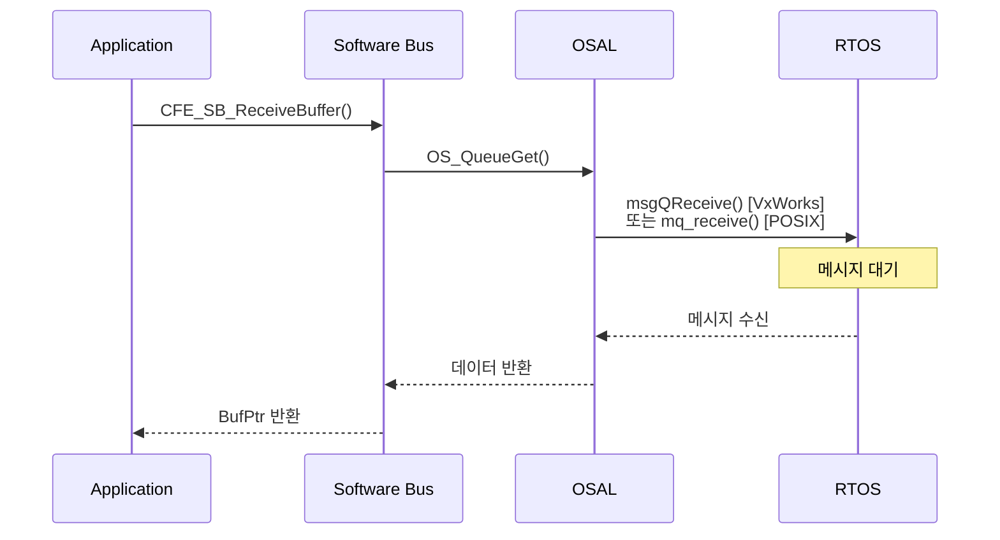
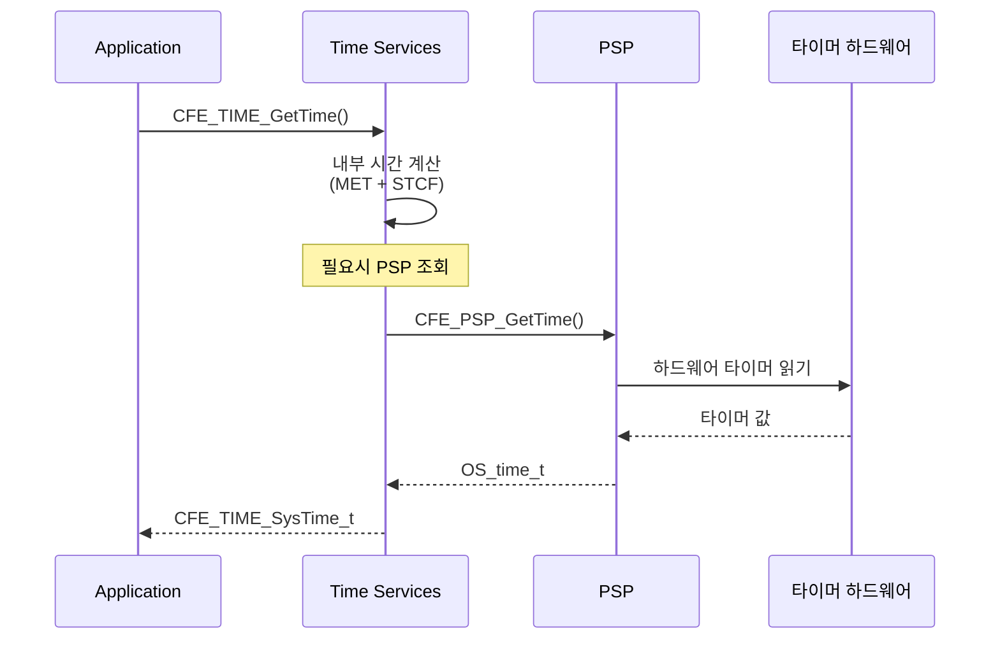
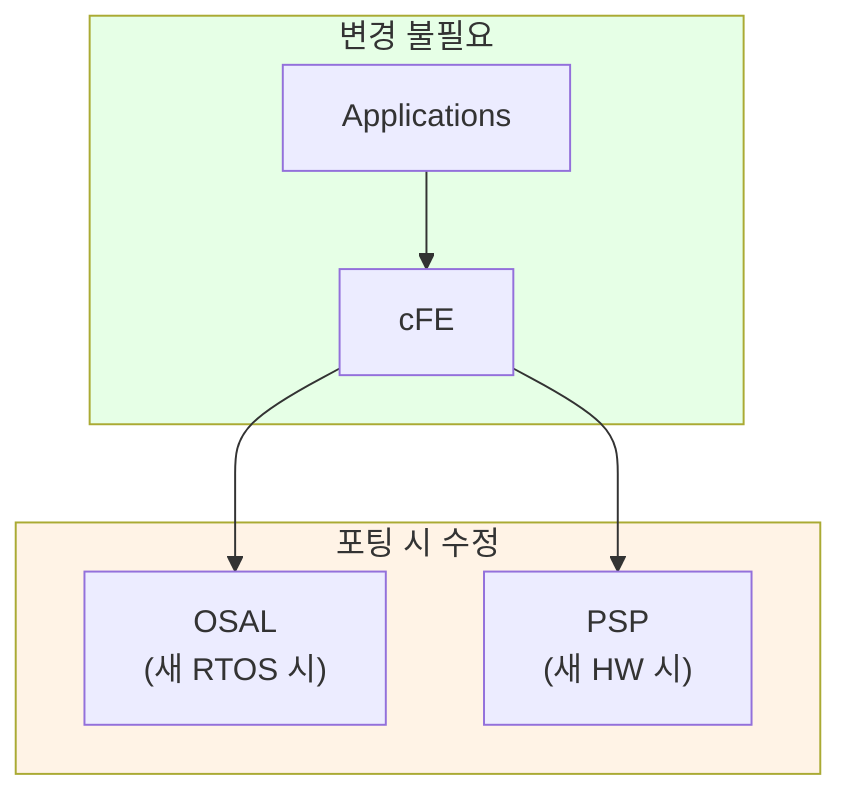
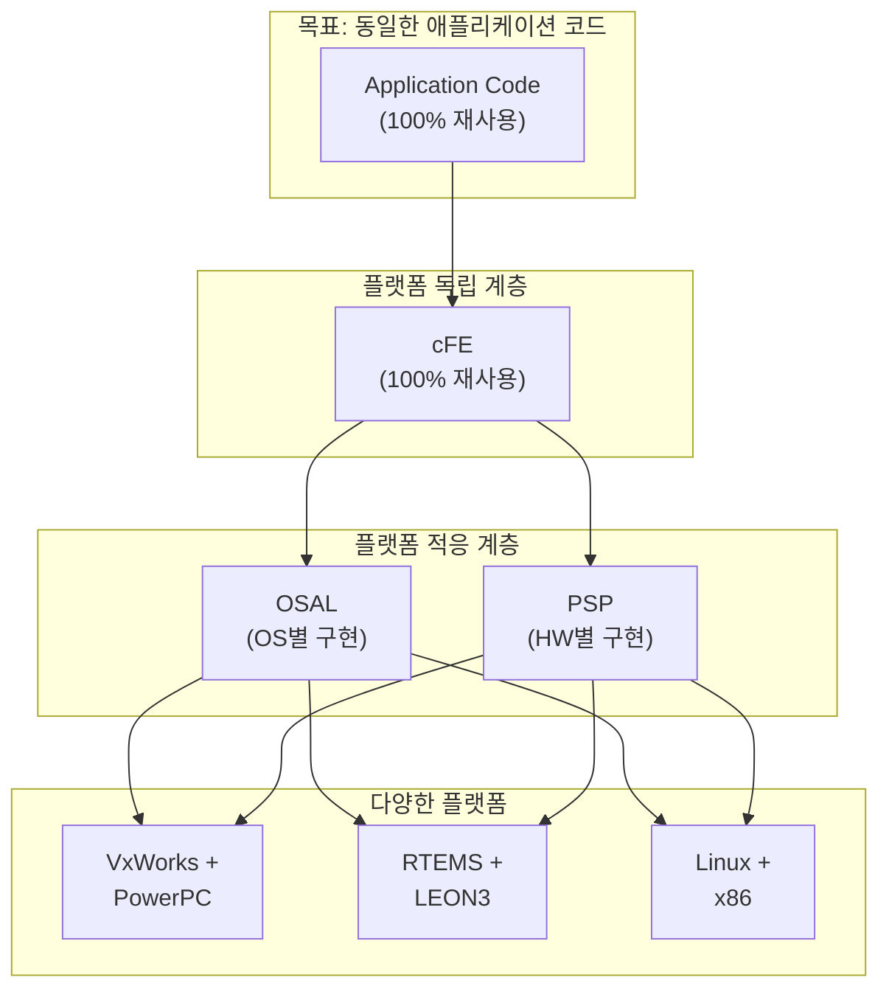

# Phase 1-06: cFE와 OSAL, PSP의 관계

## 서론

Core Flight System의 이식성은 세 가지 핵심 컴포넌트의 협력에 의해 실현된다: Core Flight Executive(cFE), Operating System Abstraction Layer(OSAL), 그리고 Platform Support Package(PSP)이다. 이 세 컴포넌트는 각각 고유한 역할을 담당하면서도, 서로 긴밀하게 연동하여 완전한 비행 소프트웨어 실행 환경을 구성한다.

본 문서에서는 이 세 컴포넌트 간의 관계를 심층적으로 분석한다. 각 컴포넌트가 어떤 책임을 가지며, 어떻게 상호작용하는지, 그리고 이러한 분리가 왜 중요한지를 이해하게 될 것이다.

---

## 1. 세 컴포넌트의 역할 분담

### 1.1 전체적인 구조

cFE, OSAL, PSP는 계층적 관계를 형성한다. 상위 계층은 하위 계층의 서비스를 사용하며, 하위 계층은 상위 계층에 추상화된 인터페이스를 제공한다.



### 1.2 각 컴포넌트의 핵심 책임

| 컴포넌트 | 핵심 책임 | 추상화 대상 |
|:---|:---|:---|
| **cFE** | 비행 소프트웨어 서비스 제공 | 애플리케이션 개발 복잡성 |
| **OSAL** | 운영체제 독립성 제공 | RTOS API 차이 |
| **PSP** | 하드웨어 독립성 제공 | 플랫폼 하드웨어 차이 |

### 1.3 의존성 방향

의존성은 항상 상위에서 하위로 흐른다:

- 애플리케이션은 cFE에 의존한다
- cFE는 OSAL과 PSP에 의존한다
- OSAL과 PSP는 운영체제와 하드웨어에 의존한다



---

## 2. OSAL의 역할 심화

### 2.1 OSAL이 필요한 이유

각 실시간 운영체제는 고유한 API를 가지고 있다. 동일한 기능을 수행하더라도 함수 이름, 파라미터, 반환 값이 모두 다르다.

**태스크 생성 API 비교**:

```c
/* VxWorks */
TASK_ID taskSpawn(char *name, int priority, int options,
                  int stackSize, FUNCPTR entryPt,
                  int arg1, int arg2, ... int arg10);

/* RTEMS */
rtems_status_code rtems_task_create(rtems_name name,
                                    rtems_task_priority priority,
                                    rtems_size stack_size,
                                    rtems_mode initial_modes,
                                    rtems_attribute attributes,
                                    rtems_id *id);

/* POSIX (Linux) */
int pthread_create(pthread_t *thread,
                   const pthread_attr_t *attr,
                   void *(*start_routine)(void *),
                   void *arg);
```

이러한 차이 때문에, OSAL 없이는 운영체제를 바꿀 때마다 모든 OS 호출 코드를 수정해야 한다.

### 2.2 OSAL의 추상화 전략

OSAL은 다음과 같은 전략으로 운영체제 차이를 숨긴다:



### 2.3 OSAL API 카테고리 상세

#### 2.3.1 태스크 관리

```c
/* 태스크 생성 */
int32 OS_TaskCreate(osal_id_t *task_id,
                    const char *task_name,
                    osal_task_entry function_pointer,
                    osal_stackptr_t stack_pointer,
                    size_t stack_size,
                    osal_priority_t priority,
                    uint32 flags);

/* 태스크 삭제 */
int32 OS_TaskDelete(osal_id_t task_id);

/* 태스크 지연 */
int32 OS_TaskDelay(uint32 milliseconds);

/* 현재 태스크 ID 얻기 */
osal_id_t OS_TaskGetId(void);

/* 태스크 정보 조회 */
int32 OS_TaskGetInfo(osal_id_t task_id, OS_task_prop_t *task_prop);
```

#### 2.3.2 동기화 프리미티브

```c
/* 뮤텍스 - 상호 배제 */
int32 OS_MutSemCreate(osal_id_t *sem_id, const char *sem_name, uint32 options);
int32 OS_MutSemTake(osal_id_t sem_id);
int32 OS_MutSemGive(osal_id_t sem_id);
int32 OS_MutSemDelete(osal_id_t sem_id);

/* 바이너리 세마포어 - 이벤트 신호 */
int32 OS_BinSemCreate(osal_id_t *sem_id, const char *sem_name,
                       uint32 sem_initial_value, uint32 options);
int32 OS_BinSemTake(osal_id_t sem_id);
int32 OS_BinSemTimedWait(osal_id_t sem_id, uint32 msecs);
int32 OS_BinSemGive(osal_id_t sem_id);

/* 카운팅 세마포어 - 리소스 카운팅 */
int32 OS_CountSemCreate(osal_id_t *sem_id, const char *sem_name,
                         uint32 sem_initial_value, uint32 options);
int32 OS_CountSemTake(osal_id_t sem_id);
int32 OS_CountSemGive(osal_id_t sem_id);
```

#### 2.3.3 메시지 큐

```c
/* 큐 생성 */
int32 OS_QueueCreate(osal_id_t *queue_id, const char *queue_name,
                      size_t queue_depth, size_t data_size, uint32 flags);

/* 메시지 송신 */
int32 OS_QueuePut(osal_id_t queue_id, const void *data,
                   size_t size, uint32 flags);

/* 메시지 수신 */
int32 OS_QueueGet(osal_id_t queue_id, void *data,
                   size_t size, size_t *size_copied, int32 timeout);

/* 큐 삭제 */
int32 OS_QueueDelete(osal_id_t queue_id);
```

### 2.4 OSAL의 내부 구조

OSAL은 각 운영체제별로 별도의 구현 파일을 가진다:

```
osal/
├── src/
│   ├── os/
│   │   ├── inc/           # 공통 헤더
│   │   │   └── osapi.h
│   │   ├── shared/        # 공유 코드
│   │   │   ├── src/
│   │   │   │   ├── osapi-task.c
│   │   │   │   ├── osapi-queue.c
│   │   │   │   └── ...
│   │   ├── vxworks/       # VxWorks 구현
│   │   │   └── src/
│   │   │       ├── os-impl-tasks.c
│   │   │       └── ...
│   │   ├── rtems/         # RTEMS 구현
│   │   │   └── src/
│   │   └── posix/         # POSIX 구현
│   │       └── src/
```

---

## 3. PSP의 역할 심화

### 3.1 PSP가 필요한 이유

하드웨어 플랫폼마다 다음과 같은 차이가 존재한다:

| 영역 | 플랫폼 간 차이 |
|:---|:---|
| **메모리 구조** | 주소 공간, 메모리 영역 레이아웃 |
| **타이밍 하드웨어** | 타이머 해상도, 1Hz 신호 소스 |
| **부팅 과정** | 초기화 시퀀스, 부트로더 인터페이스 |
| **리셋 메커니즘** | 리셋 유형, 리셋 원인 파악 방법 |
| **워치독** | 워치독 타이머 구현 방식 |
| **예외 처리** | 예외 벡터, 핸들링 방식 |

### 3.2 PSP API 카테고리

#### 3.2.1 시스템 초기화

```c
/* cFE 시작 전 PSP 초기화 */
int32 CFE_PSP_Main(void);

/* 메모리 영역 정보 제공 */
int32 CFE_PSP_GetResetArea(cpuaddr *PtrToResetArea, 
                           uint32 *SizeOfResetArea);
int32 CFE_PSP_GetVolatileDiskMem(cpuaddr *PtrToVolDisk, 
                                  uint32 *SizeOfVolDisk);
int32 CFE_PSP_GetCDSSize(uint32 *SizeOfCDS);
int32 CFE_PSP_GetUserReservedArea(cpuaddr *PtrToUserArea, 
                                   uint32 *SizeOfUserArea);
```

#### 3.2.2 리셋 제어

```c
/* 시스템 리셋 */
void CFE_PSP_Restart(uint32 ResetType);

/* 리셋 유형 조회 */
uint32 CFE_PSP_GetResetType(void);

/* 리셋 부유형 조회 */
uint32 CFE_PSP_GetResetSubtype(void);
```

리셋 유형은 다음과 같이 정의된다:

```c
#define CFE_PSP_RST_TYPE_POWERON    1  /* Power-on 리셋 */
#define CFE_PSP_RST_TYPE_PROCESSOR  2  /* Processor 리셋 */
```

#### 3.2.3 시간 하드웨어

```c
/* 타이머 틱 정보 */
uint32 CFE_PSP_GetTimerTicksPerSecond(void);
uint32 CFE_PSP_GetTimerLow32Rollover(void);

/* 현재 시간 조회 */
void CFE_PSP_GetTime(OS_time_t *LocalTime);

/* 1Hz Tone 처리 (TIME 서비스와 연동) */
void CFE_PSP_Get1HzSignal(void);
```

#### 3.2.4 워치독 타이머

```c
/* 워치독 초기화 */
void CFE_PSP_WatchdogInit(void);

/* 워치독 서비스 (주기적 호출 필요) */
void CFE_PSP_WatchdogService(void);

/* 워치독 활성화/비활성화 */
void CFE_PSP_WatchdogEnable(void);
void CFE_PSP_WatchdogDisable(void);

/* 워치독 타임아웃 설정 */
void CFE_PSP_WatchdogSet(uint32 WatchdogValue);
```

#### 3.2.5 예외 처리

```c
/* 예외 핸들러 등록 */
void CFE_PSP_AttachExceptions(void);

/* 예외 정보 조회 */
void CFE_PSP_ExceptionGetSummary_Impl(uint32 *ContextSize, 
                                       cpuaddr *ContextAddress);
```

### 3.3 PSP 디렉토리 구조

```
psp/
├── fsw/
│   ├── inc/                    # PSP API 헤더
│   │   ├── cfe_psp.h
│   │   └── cfe_psp_module.h
│   ├── shared/                 # 공통 코드
│   │   └── src/
│   │       ├── cfe_psp_module.c
│   │       └── ...
│   └── pc-linux/               # PC-Linux PSP
│       ├── inc/
│       └── src/
│           ├── cfe_psp_start.c
│           ├── cfe_psp_memory.c
│           └── cfe_psp_watchdog.c
├── unit-test/
└── CMakeLists.txt
```

### 3.4 PSP와 OSAL의 관계

PSP와 OSAL은 서로 다른 영역을 추상화하지만, 둘 다 운영체제 레벨에서 동작한다:



---

## 4. cFE와 추상화 계층의 상호작용

### 4.1 cFE가 OSAL을 사용하는 방식

cFE의 각 서비스는 OSAL API를 통해 운영체제 기능에 접근한다:

| cFE 서비스 | 사용하는 OSAL 기능 |
|:---|:---|
| **ES** | 태스크 생성/관리, 동적 로딩 |
| **SB** | 큐, 세마포어, 뮤텍스 |
| **EVS** | 큐, 태스크, 뮤텍스 |
| **TIME** | 타이머, 세마포어 |
| **TBL** | 파일 I/O, 뮤텍스 |
| **FS** | 파일 시스템 API |

### 4.2 cFE가 PSP를 사용하는 방식

cFE의 일부 서비스는 PSP를 통해 하드웨어 기능에 접근한다:

| cFE 서비스 | 사용하는 PSP 기능 |
|:---|:---|
| **ES** | 메모리 영역, 리셋, 예외 처리 |
| **TIME** | 타이밍 하드웨어, 1Hz 신호 |

### 4.3 초기화 시퀀스에서의 상호작용

시스템 부팅 시 세 컴포넌트는 다음 순서로 초기화된다:



### 4.4 런타임 상호작용 예시

#### 예시 1: 애플리케이션이 메시지를 수신하는 과정

```c
/* 애플리케이션 코드 */
Status = CFE_SB_ReceiveBuffer(&BufPtr, PipeId, CFE_SB_PEND_FOREVER);
```

내부적으로:



#### 예시 2: 시간 조회

```c
/* 애플리케이션 코드 */
CFE_TIME_SysTime_t CurrentTime = CFE_TIME_GetTime();
```

내부적으로:



---

## 5. 새 플랫폼으로 포팅하기

### 5.1 포팅이 필요한 컴포넌트

새로운 하드웨어 플랫폼이나 운영체제로 cFS를 이식할 때, 수정해야 하는 컴포넌트는 상황에 따라 다르다:

| 상황 | 수정 필요 컴포넌트 |
|:---|:---|
| 새로운 RTOS 지원 | OSAL 구현 추가 |
| 새로운 하드웨어 보드 지원 | PSP 구현 추가 |
| 새로운 RTOS + 하드웨어 | OSAL + PSP 모두 |

### 5.2 OSAL 포팅 절차

새로운 RTOS를 지원하려면:

1. **새 디렉토리 생성**: `osal/src/os/<new_os>/`
2. **OS별 구현 파일 작성**:
   - `os-impl-tasks.c`: 태스크 관리
   - `os-impl-binsem.c`: 바이너리 세마포어
   - `os-impl-mutex.c`: 뮤텍스
   - `os-impl-queues.c`: 메시지 큐
   - 기타 필요한 구현
3. **빌드 시스템 업데이트**: CMakeLists.txt 수정
4. **테스트**: OSAL 단위 테스트 실행

### 5.3 PSP 포팅 절차

새로운 하드웨어 플랫폼을 지원하려면:

1. **새 디렉토리 생성**: `psp/fsw/<new_platform>/`
2. **PSP 구현 파일 작성**:
   - `cfe_psp_start.c`: 시스템 시작
   - `cfe_psp_memory.c`: 메모리 맵
   - `cfe_psp_watchdog.c`: 워치독
   - `cfe_psp_exception.c`: 예외 처리
   - 기타 필요한 구현
3. **메모리 맵 정의**: 플랫폼의 메모리 레이아웃 설정
4. **빌드 시스템 업데이트**
5. **통합 테스트**: cFE와의 통합 테스트 실행

### 5.4 cFE는 수정하지 않음

중요한 점은 cFE 코드 자체는 수정하지 않는다는 것이다. cFE는 OSAL과 PSP API를 통해서만 플랫폼에 접근하므로, 추상화 계층만 올바르게 구현하면 cFE는 그대로 동작한다.



---

## 6. 실제 예시: PC-Linux PSP와 POSIX OSAL

### 6.1 개발 환경으로서의 PC-Linux

대부분의 cFS 개발은 일반 Linux PC에서 이루어진다. 이를 위해 PC-Linux PSP와 POSIX OSAL이 제공된다.

### 6.2 POSIX OSAL 구현 예시

POSIX OSAL은 pthread, POSIX 세마포어, POSIX 메시지 큐를 사용한다:

```c
/* os-impl-tasks.c (POSIX 구현) 중 일부 */
int32 OS_TaskCreate_Impl(const OS_object_token_t *token, uint32 flags)
{
    OS_impl_task_internal_record_t *impl;
    pthread_attr_t                  attr;
    int                             ret;
    
    impl = OS_OBJECT_TABLE_GET(OS_impl_task_table, *token);
    
    /* pthread 속성 초기화 */
    pthread_attr_init(&attr);
    
    /* 스택 크기 설정 */
    pthread_attr_setstacksize(&attr, impl->stack_size);
    
    /* pthread 생성 */
    ret = pthread_create(&impl->id, &attr, 
                         OS_PthreadTaskEntry, impl);
    
    pthread_attr_destroy(&attr);
    
    return (ret == 0) ? OS_SUCCESS : OS_ERROR;
}
```

### 6.3 PC-Linux PSP 구현 예시

PC-Linux PSP는 파일 기반 비휘발성 저장소와 시뮬레이션된 타이밍을 사용한다:

```c
/* cfe_psp_memory.c (PC-Linux 구현) 중 일부 */
int32 CFE_PSP_GetResetArea(cpuaddr *PtrToResetArea, 
                           uint32 *SizeOfResetArea)
{
    /* Linux에서는 공유 메모리 또는 파일 맵핑 사용 */
    *PtrToResetArea = (cpuaddr)CFE_PSP_ReservedMemoryPtr->ResetMemory;
    *SizeOfResetArea = CFE_PSP_ReservedMemoryPtr->ResetSize;
    
    return CFE_PSP_SUCCESS;
}

/* cfe_psp_watchdog.c (PC-Linux 구현) */
void CFE_PSP_WatchdogService(void)
{
    /* PC-Linux에서는 워치독 시뮬레이션 */
    /* 실제 하드웨어 워치독 대신 타이머 리셋 */
    CFE_PSP_WatchdogValue = CFE_PSP_WATCHDOG_MAX;
}
```

---

## 7. 정리: 세 컴포넌트의 협력

### 7.1 역할 요약

| 컴포넌트 | 무엇을 추상화? | 어디에 구현? | 누가 사용? |
|:---|:---|:---|:---|
| **OSAL** | RTOS API | OS별 구현 파일 | cFE, 일부 앱 |
| **PSP** | 하드웨어 특성 | 플랫폼별 구현 파일 | cFE (주로 ES, TIME) |
| **cFE** | 시스템 복잡성 | 공통 코드 | 모든 애플리케이션 |

### 7.2 이식성 달성 메커니즘



---

## 결론

cFE, OSAL, PSP는 cFS의 이식성을 실현하는 세 가지 핵심 컴포넌트이다. OSAL은 운영체제의 차이를, PSP는 하드웨어의 차이를 추상화하고, cFE는 이 두 계층 위에서 일관된 비행 소프트웨어 서비스를 제공한다.

이러한 분리 덕분에:
- 애플리케이션과 cFE 코드는 플랫폼과 무관하게 재사용 가능하다
- 새로운 플랫폼 지원은 OSAL/PSP 구현 추가만으로 가능하다
- 개발자는 추상화된 API만 익히면 된다

다음 문서에서는 cFS 애플리케이션 레이어의 구조를 자세히 살펴보고, 미션 애플리케이션과 라이브러리가 어떻게 구성되는지 알아볼 것이다.

---

## 참고 문헌

1. NASA, "cFE User's Guide"
2. NASA, "OSAL User's Guide"
3. NASA, "Platform Support Package Development Guide"
4. cFS GitHub Repository, https://github.com/nasa/cFS

---

[이전 문서: Phase 1-05: cFS 계층 구조 개요](./Phase1_05_cFS_계층_구조_개요.md)

[다음 문서: Phase 1-07: 애플리케이션 레이어의 이해](./Phase1_07_애플리케이션_레이어의_이해.md)
