# Phase 1-07: 애플리케이션 레이어의 이해

## 서론

cFS 아키텍처의 최상위에 위치하는 애플리케이션 레이어는 실제 임무 기능이 구현되는 곳이다. cFE가 제공하는 서비스 위에서 동작하는 이 계층은 임무 애플리케이션, 표준 cFS 애플리케이션, 그리고 공유 라이브러리로 구성된다.

본 문서에서는 애플리케이션 레이어의 구조를 상세히 살펴보고, 각 컴포넌트 유형의 특성과 역할을 이해한다. 또한 cFS 애플리케이션이 어떻게 설계되고 cFE와 상호작용하는지 개념적으로 파악할 것이다.

---

## 1. 애플리케이션 레이어 개요

### 1.1 계층적 위치

애플리케이션 레이어는 cFS 아키텍처에서 가장 상위에 위치한다. 모든 임무 특화 로직은 이 레이어에서 구현되며, cFE 서비스를 통해 시스템 리소스에 접근한다.

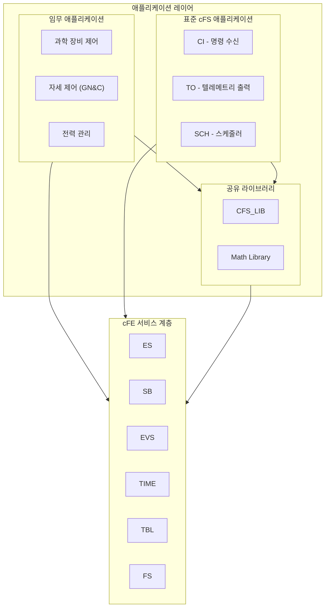

### 1.2 세 가지 컴포넌트 유형

애플리케이션 레이어의 컴포넌트는 크게 세 가지로 분류된다:

| 유형 | 특성 | 예시 |
|:---|:---|:---|
| **임무 애플리케이션** | 특정 임무에 특화된 기능 구현 | 과학 장비 드라이버, 자세 결정 |
| **표준 cFS 애플리케이션** | 범용적 기능, 재사용 가능 | CI, TO, SCH, HK |
| **공유 라이브러리** | 여러 앱이 공유하는 기능 | CRC 계산, 수학 함수 |

---

## 2. cFS 애플리케이션의 구조

### 2.1 애플리케이션의 정의

cFS 애플리케이션은 cFE 위에서 실행되는 독립적인 소프트웨어 모듈이다. 각 애플리케이션은 다음과 같은 특성을 가진다:

- **자체 태스크**: 하나 이상의 실행 스레드를 가진다
- **독립적 실행**: 다른 애플리케이션과 독립적으로 동작한다
- **메시지 기반 통신**: Software Bus를 통해 다른 컴포넌트와 통신한다
- **동적 로딩**: 런타임에 로드/언로드될 수 있다

### 2.2 표준 애플리케이션 구조

모든 cFS 애플리케이션은 유사한 구조를 따른다:

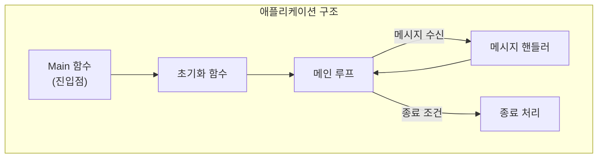

### 2.3 애플리케이션 생명주기

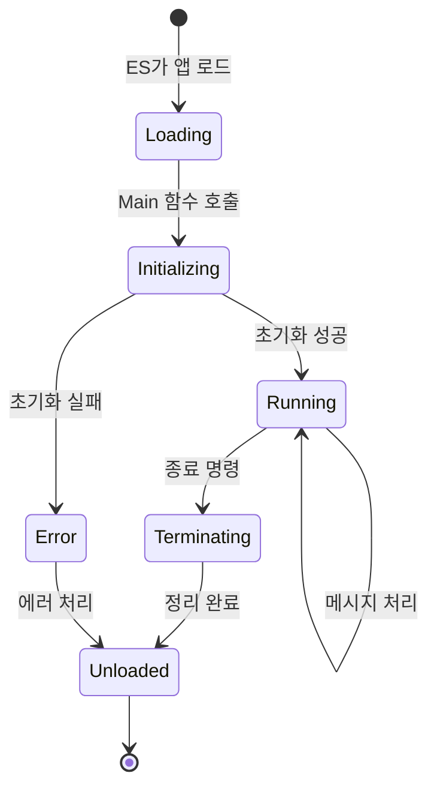

---

## 3. 표준 디렉토리 구조

### 3.1 애플리케이션 디렉토리 레이아웃

NASA 권장 애플리케이션 디렉토리 구조는 다음과 같다:

```
sample_app/
├── CMakeLists.txt          # 빌드 설정
├── fsw/                    # Flight Software
│   ├── inc/                # 헤더 파일
│   │   ├── sample_app.h          # 앱 메인 헤더
│   │   ├── sample_app_events.h   # 이벤트 정의
│   │   ├── sample_app_msg.h      # 메시지 구조체
│   │   └── sample_app_msgids.h   # Message ID 정의
│   ├── src/                # 소스 파일
│   │   ├── sample_app.c          # 메인 소스
│   │   ├── sample_app_cmds.c     # 명령 처리
│   │   └── sample_app_utils.c    # 유틸리티 함수
│   └── tables/             # 테이블 정의
│       └── sample_app_tbl.c      # 테이블 초기값
├── docs/                   # 문서
│   └── users_guide/
├── unit-test/              # 단위 테스트
│   ├── coveragetest/
│   └── stubs/
└── README.md
```

### 3.2 주요 파일 설명

| 파일 | 용도 |
|:---|:---|
| `sample_app.c` | 메인 함수, 초기화, 메인 루프 |
| `sample_app.h` | 앱 전역 데이터 구조 정의 |
| `sample_app_events.h` | 이벤트 ID 및 메시지 정의 |
| `sample_app_msg.h` | 명령/텔레메트리 메시지 구조체 |
| `sample_app_msgids.h` | Message ID 상수 정의 |
| `sample_app_tbl.c` | 테이블 초기 데이터 |

---

## 4. 애플리케이션의 핵심 패턴

### 4.1 Main 함수 패턴

모든 cFS 애플리케이션의 진입점은 Main 함수이다:

```c
void SAMPLE_APP_Main(void)
{
    CFE_Status_t Status;
    CFE_SB_Buffer_t *BufPtr;
    
    /* 앱 등록 */
    CFE_ES_RegisterApp();
    
    /* 초기화 */
    Status = SAMPLE_APP_Init();
    
    if (Status == CFE_SUCCESS)
    {
        /* 메인 루프 */
        while (CFE_ES_RunLoop(&SAMPLE_APP_Data.RunStatus))
        {
            /* 메시지 대기 및 수신 */
            Status = CFE_SB_ReceiveBuffer(&BufPtr, 
                                          SAMPLE_APP_Data.CmdPipe,
                                          CFE_SB_PEND_FOREVER);
            
            if (Status == CFE_SUCCESS)
            {
                SAMPLE_APP_ProcessMsg(BufPtr);
            }
        }
    }
    
    /* 종료 처리 */
    CFE_ES_ExitApp(SAMPLE_APP_Data.RunStatus);
}
```

### 4.2 초기화 패턴

초기화 함수는 앱이 동작하기 위한 모든 리소스를 설정한다:

```c
CFE_Status_t SAMPLE_APP_Init(void)
{
    CFE_Status_t Status;
    
    /* 1. 앱 데이터 초기화 */
    memset(&SAMPLE_APP_Data, 0, sizeof(SAMPLE_APP_Data));
    SAMPLE_APP_Data.RunStatus = CFE_ES_RunStatus_APP_RUN;
    
    /* 2. 이벤트 서비스 등록 */
    Status = CFE_EVS_Register(NULL, 0, CFE_EVS_EventFilter_BINARY);
    if (Status != CFE_SUCCESS)
    {
        return Status;
    }
    
    /* 3. 파이프 생성 */
    Status = CFE_SB_CreatePipe(&SAMPLE_APP_Data.CmdPipe,
                               SAMPLE_APP_PIPE_DEPTH,
                               SAMPLE_APP_PIPE_NAME);
    if (Status != CFE_SUCCESS)
    {
        return Status;
    }
    
    /* 4. 메시지 구독 */
    Status = CFE_SB_Subscribe(SAMPLE_APP_CMD_MID, SAMPLE_APP_Data.CmdPipe);
    if (Status != CFE_SUCCESS)
    {
        return Status;
    }
    
    /* 5. 테이블 등록 (필요시) */
    Status = CFE_TBL_Register(&SAMPLE_APP_Data.TblHandle,
                              "SampleTable",
                              sizeof(SAMPLE_APP_Table_t),
                              CFE_TBL_OPT_DEFAULT,
                              SAMPLE_APP_TableValidation);
    
    /* 6. 초기화 완료 이벤트 */
    CFE_EVS_SendEvent(SAMPLE_APP_INIT_INF_EID,
                      CFE_EVS_EventType_INFORMATION,
                      "SAMPLE App Initialized. Version %d.%d.%d",
                      SAMPLE_APP_MAJOR_VERSION,
                      SAMPLE_APP_MINOR_VERSION,
                      SAMPLE_APP_REVISION);
    
    return CFE_SUCCESS;
}
```

### 4.3 메시지 처리 패턴

수신된 메시지는 Message ID에 따라 적절한 핸들러로 라우팅된다:

```c
void SAMPLE_APP_ProcessMsg(const CFE_SB_Buffer_t *BufPtr)
{
    CFE_SB_MsgId_t MsgId;
    
    CFE_MSG_GetMsgId(&BufPtr->Msg, &MsgId);
    
    switch (CFE_SB_MsgIdToValue(MsgId))
    {
        case SAMPLE_APP_CMD_MID:
            SAMPLE_APP_ProcessCmd(BufPtr);
            break;
            
        case SAMPLE_APP_SEND_HK_MID:
            SAMPLE_APP_SendHousekeeping();
            break;
            
        default:
            CFE_EVS_SendEvent(SAMPLE_APP_INVALID_MID_ERR_EID,
                              CFE_EVS_EventType_ERROR,
                              "Invalid Message ID: 0x%04X",
                              CFE_SB_MsgIdToValue(MsgId));
            break;
    }
}
```

---

## 5. 표준 cFS 애플리케이션

### 5.1 Command Ingest (CI)

CI 애플리케이션은 지상에서 올라온 명령을 수신하여 Software Bus에 배포한다.

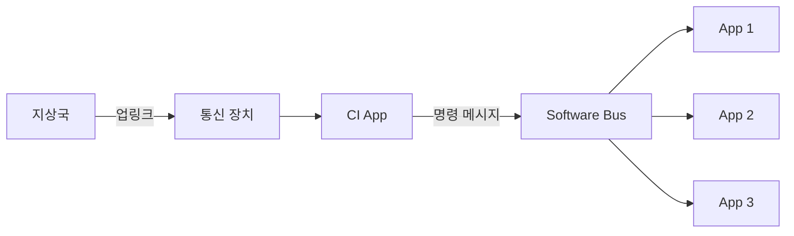

**주요 기능**:
- 통신 인터페이스에서 명령 데이터 수신
- CCSDS 패킷 파싱
- 명령 유효성 검증
- Software Bus로 명령 배포

### 5.2 Telemetry Output (TO)

TO 애플리케이션은 Software Bus의 텔레메트리를 수집하여 지상으로 전송한다.

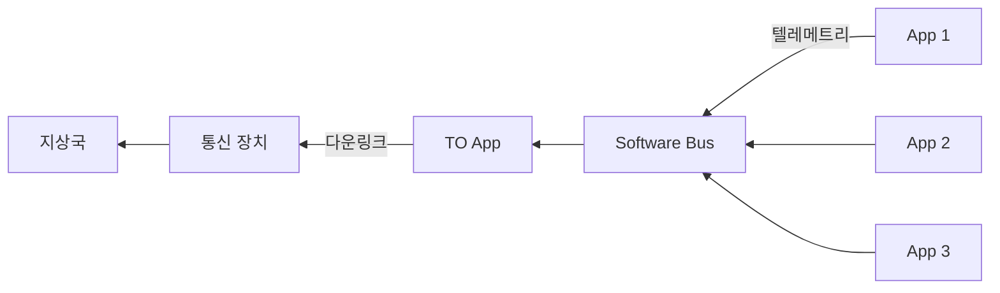

**주요 기능**:
- 텔레메트리 메시지 구독
- 패킷 필터링 및 선택
- 전송 큐 관리
- 통신 인터페이스로 데이터 전송

### 5.3 Scheduler (SCH)

SCH 애플리케이션은 시간 기반 스케줄링을 제공하여 다른 앱들의 주기적 동작을 트리거한다.

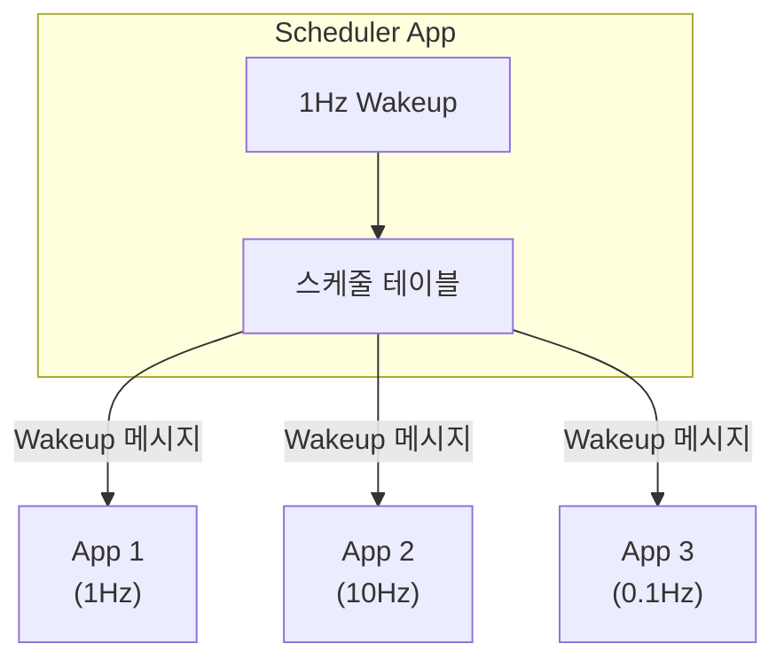

**주요 기능**:
- 1Hz 타임 베이스에서 동작
- 스케줄 테이블에 따라 메시지 발송
- 메이저/마이너 프레임 관리
- 동기화된 실행 보장

### 5.4 Housekeeping (HK)

HK 애플리케이션은 여러 앱의 상태 데이터를 수집하여 통합 패킷으로 제공한다.

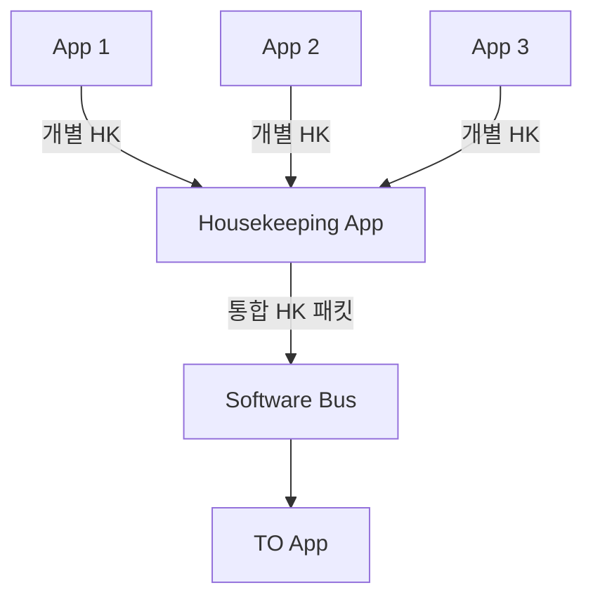

**주요 기능**:
- 개별 앱 Housekeeping 요청
- 데이터 수집 및 결합
- 통합 패킷 생성
- 효율적인 다운링크 지원

### 5.5 기타 표준 애플리케이션

| 앱 이름 | 축약어 | 기능 |
|:---|:---:|:---|
| Stored Command | SC | 명령 시퀀스 저장 및 실행 |
| Limit Checker | LC | 텔레메트리 한계 감시 |
| Data Storage | DS | 데이터 파일 저장 관리 |
| File Manager | FM | 온보드 파일 시스템 관리 |
| Memory Dwell | MD | 메모리 영역 주기적 덤프 |
| Memory Manager | MM | 메모리 읽기/쓰기/채우기 |

---

## 6. 공유 라이브러리

### 6.1 라이브러리와 애플리케이션의 차이

라이브러리는 애플리케이션과 달리 자체 태스크가 없다:

| 특성 | 애플리케이션 | 라이브러리 |
|:---|:---:|:---:|
| 자체 태스크 | 있음 | 없음 |
| 메인 루프 | 있음 | 없음 |
| 메시지 파이프 | 있음 | 없음 (보통) |
| 함수 호출로 사용 | 제한적 | 주 사용 방식 |
| 동적 로드 | 가능 | 가능 |

### 6.2 라이브러리의 구조

```c
/* 라이브러리 초기화 함수 */
int32 CFS_LIB_Init(void)
{
    /* 라이브러리 초기화 로직 */
    CFE_ES_WriteToSysLog("CFS_LIB Initialized\n");
    return CFE_SUCCESS;
}

/* 라이브러리 제공 함수들 */
uint16 CFS_ComputeCRC16(const void *Data, uint32 Size)
{
    /* CRC 계산 로직 */
    return checksum;
}
```

### 6.3 라이브러리 사용 방법

애플리케이션에서 라이브러리 함수를 호출:

```c
/* 애플리케이션 코드에서 */
#include "cfs_lib.h"

void SAMPLE_APP_ComputeDataChecksum(void)
{
    uint16 CRC;
    
    CRC = CFS_ComputeCRC16(SAMPLE_APP_Data.DataBuffer,
                           SAMPLE_APP_Data.DataSize);
    
    SAMPLE_APP_Data.LastChecksum = CRC;
}
```

---

## 7. 임무 애플리케이션

### 7.1 임무 앱의 특성

임무 애플리케이션은 특정 임무의 고유한 요구사항을 구현한다:

- **도메인 특화**: 특정 장비, 알고리즘, 프로토콜을 다룬다
- **재사용 제한적**: 다른 임무에 그대로 사용하기 어렵다
- **표준 패턴 사용**: cFS 표준 구조와 패턴을 따른다
- **cFE 서비스 활용**: 핵심 서비스를 통해 시스템에 접근한다

### 7.2 임무 앱 예시

#### 7.2.1 과학 장비 제어 앱

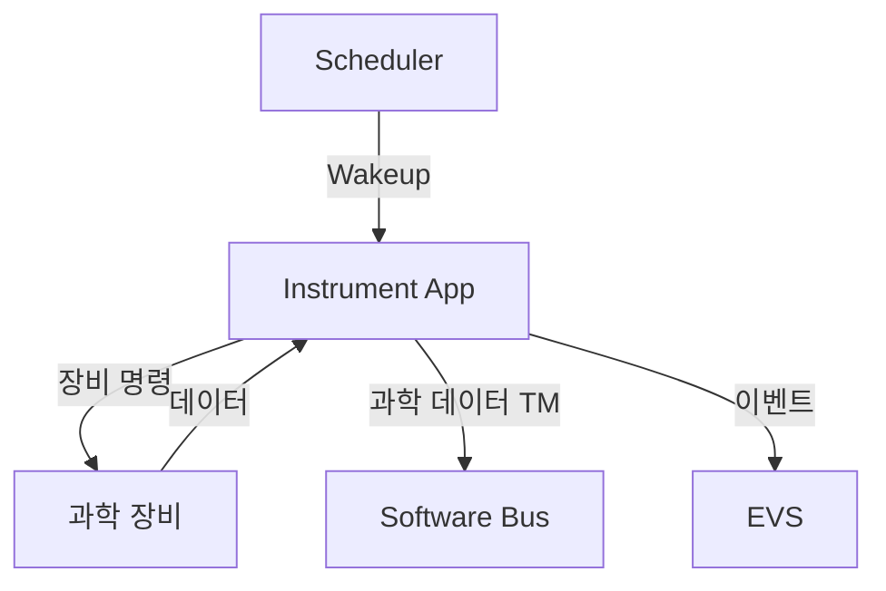

#### 7.2.2 자세 결정 및 제어 앱 (GN&C)

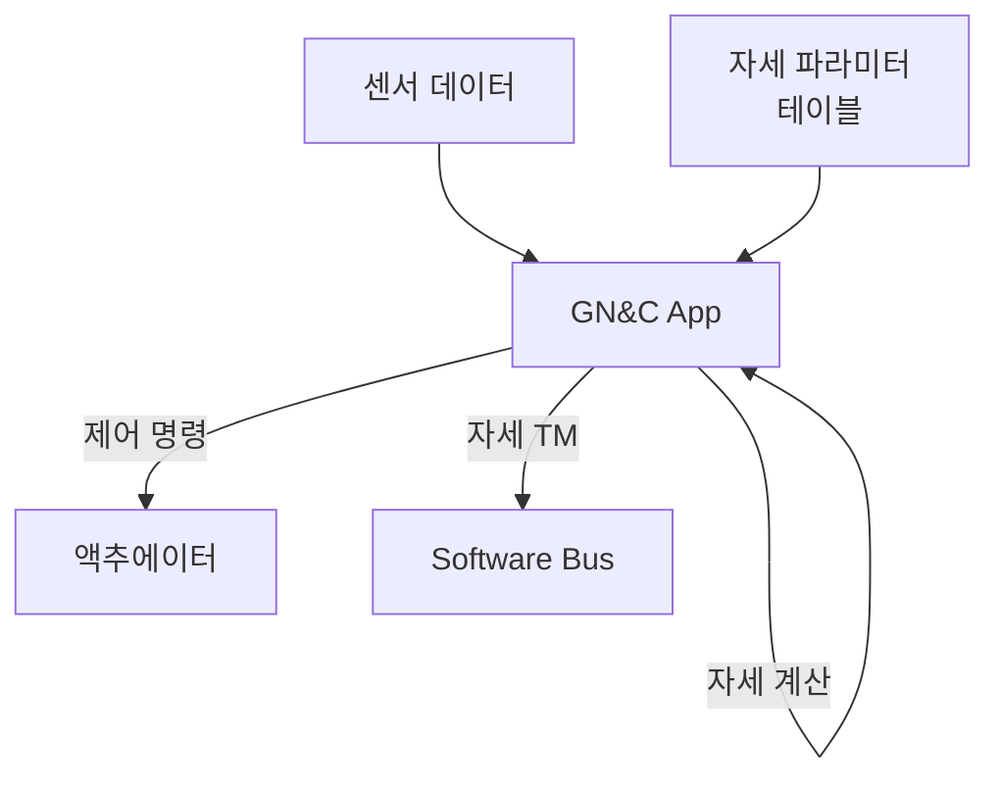

### 7.3 임무 앱 개발 시 고려사항

1. **표준 구조 준수**: cFS 권장 디렉토리 구조와 명명 규칙을 따른다
2. **cFE 서비스 활용**: 직접 OS 호출 대신 cFE/OSAL API를 사용한다
3. **메시지 기반 설계**: 다른 컴포넌트와는 Software Bus로만 통신한다
4. **테이블 활용**: 가변 파라미터는 하드코딩 대신 테이블에 저장한다
5. **이벤트 보고**: 중요한 상황은 EVS를 통해 보고한다

---

## 8. 애플리케이션 간 상호작용

### 8.1 Software Bus를 통한 통신

모든 애플리케이션은 Software Bus를 통해 통신한다. 직접 함수 호출은 라이브러리를 제외하고는 피해야 한다.

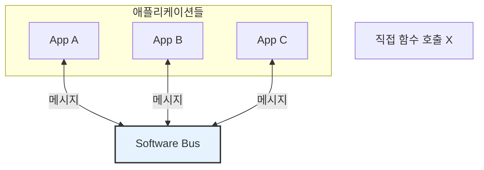

### 8.2 Publish/Subscribe 모델

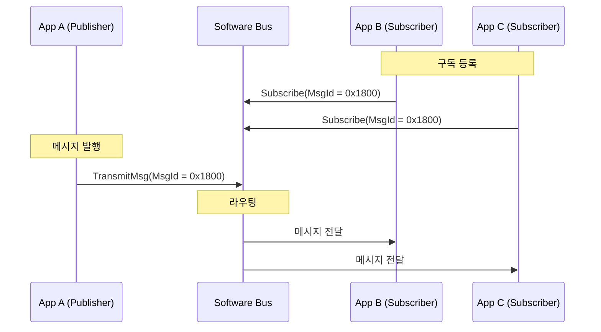

### 8.3 스케줄러 기반 실행

많은 앱들은 Scheduler의 wakeup 메시지에 의해 구동된다:

```mermaid
gantt
    title 스케줄러 기반 앱 실행 타이밍
    dateFormat X
    axisFormat %L
    
    section 1초 주기
    SCH Wakeup (1Hz)      :milestone, 0, 0
    SCH Wakeup (1Hz)      :milestone, 1000, 0
    
    section App A (1Hz)
    실행                  :a1, 0, 50
    실행                  :a2, 1000, 50
    
    section App B (10Hz)
    실행                  :b1, 0, 30
    실행                  :b2, 100, 30
    실행                  :b3, 200, 30
    실행                  :b4, 300, 30
```

---

## 9. 정리: 애플리케이션 레이어 요약

### 9.1 컴포넌트 유형 비교

| 특성 | 임무 앱 | 표준 앱 | 라이브러리 |
|:---|:---:|:---:|:---:|
| 재사용성 | 낮음 | 높음 | 높음 |
| 자체 태스크 | 있음 | 있음 | 없음 |
| 메시지 통신 | 사용 | 사용 | 제한적 |
| 예시 | GN&C, 장비 제어 | CI, TO, SCH | CFS_LIB |

### 9.2 핵심 설계 원칙

1. **표준 구조**: 모든 앱은 동일한 디렉토리 구조와 파일 구성을 따른다
2. **메시지 기반**: 앱 간 통신은 Software Bus를 통해 이루어진다
3. **서비스 활용**: cFE 서비스를 최대한 활용한다
4. **느슨한 결합**: 앱들은 서로 독립적으로 동작한다
5. **재사용 고려**: 가능한 부분은 재사용 가능하게 설계한다

---

## 결론

애플리케이션 레이어는 cFS에서 실제 비행 기능이 구현되는 핵심 계층이다. 임무 애플리케이션, 표준 cFS 애플리케이션, 공유 라이브러리라는 세 가지 유형의 컴포넌트로 구성되며, 모두 cFE 서비스 위에서 동작한다.

표준화된 애플리케이션 구조와 패턴을 따르면 개발 효율성이 높아지고, 코드 품질이 향상되며, 다른 개발자가 코드를 이해하기 쉬워진다. 또한 표준 cFS 애플리케이션을 활용하면 공통 기능을 새로 개발할 필요 없이 임무 특화 로직에 집중할 수 있다.

다음 문서에서는 실제 cFS 개발 환경을 구축하고, 간단한 애플리케이션을 빌드하고 실행하는 방법을 알아볼 것이다.

---

## 참고 문헌

1. NASA, "cFE Application Developer's Guide"
2. NASA, "cFS Application Structure Guidelines"
3. cFS Community, "Sample Application Documentation"
4. NASA GitHub, https://github.com/nasa/sample_app

---

[이전 문서: Phase 1-06: cFE와 OSAL, PSP의 관계](./Phase1_06_cFE와_OSAL_PSP의_관계.md)

[다음 문서: Phase 1-08: 개발 환경 구축 가이드](./Phase1_08_개발_환경_구축_가이드.md)
