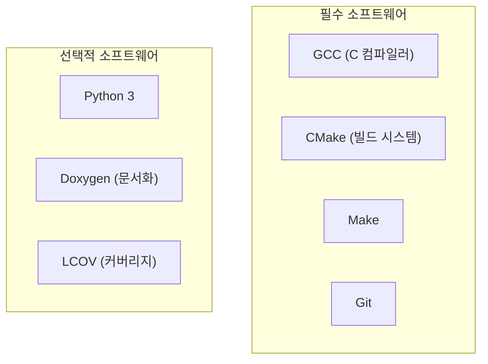
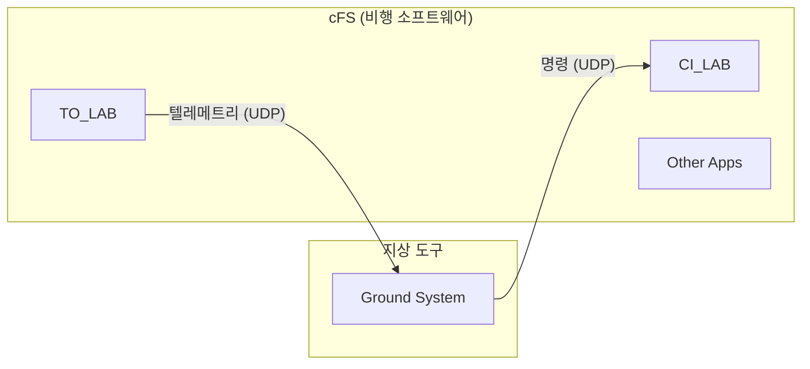
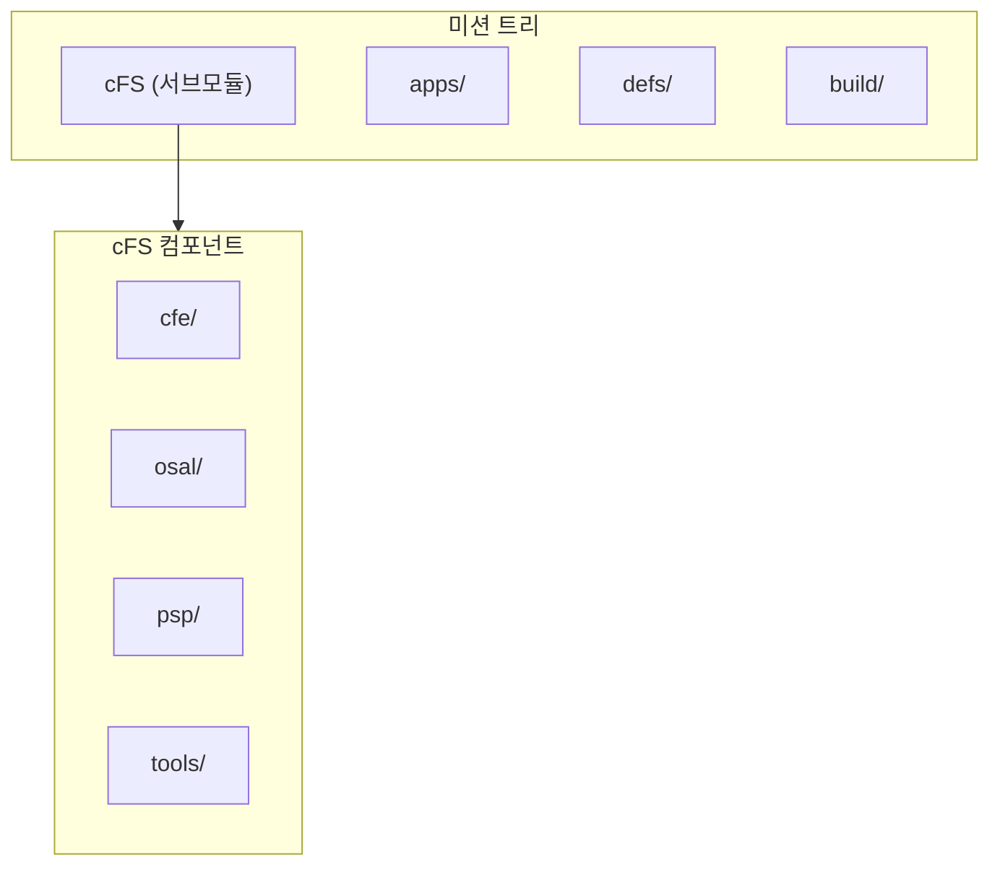
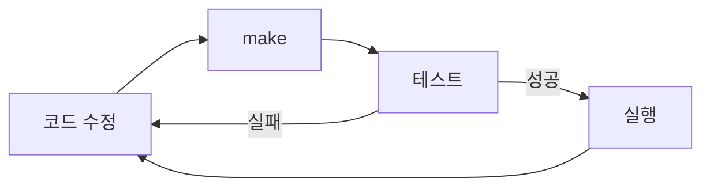

# Phase 1-08: 개발 환경 구축 가이드

## 서론

cFS를 학습하고 개발하기 위해서는 먼저 적절한 개발 환경을 구축해야 한다. 다행히 cFS는 일반 Linux PC에서 개발하고 테스트할 수 있도록 설계되어 있다. 이는 비싼 비행 하드웨어나 상용 RTOS 없이도 cFS를 경험할 수 있음을 의미한다.

본 문서에서는 Linux 환경에서 cFS를 빌드하고 실행하는 방법을 단계별로 안내한다. Ubuntu Linux를 기준으로 설명하지만, 다른 Linux 배포판에서도 유사한 절차로 진행할 수 있다.

---

## 1. 시스템 요구사항

### 1.1 운영체제

cFS 개발을 위해 권장되는 운영체제는 Linux이다:

| 운영체제 | 지원 상태 | 비고 |
|:---|:---:|:---|
| Ubuntu 20.04/22.04 LTS | 권장 | 가장 널리 테스트됨 |
| Debian 10/11 | 지원 | Ubuntu와 유사 |
| CentOS/Rocky Linux | 지원 | 패키지 이름 다를 수 있음 |
| macOS | 부분 지원 | 일부 기능 제한 |
| Windows (WSL2) | 지원 | WSL2 Ubuntu 사용 |

### 1.2 하드웨어

최소 및 권장 하드웨어 사양:

| 항목 | 최소 | 권장 |
|:---|:---:|:---:|
| RAM | 4GB | 8GB 이상 |
| 디스크 | 10GB | 20GB 이상 |
| CPU | 2코어 | 4코어 이상 |

### 1.3 필수 소프트웨어



---

## 2. 개발 도구 설치

### 2.1 Ubuntu/Debian 기준 패키지 설치

터미널을 열고 다음 명령을 실행한다:

```bash
# 시스템 업데이트
sudo apt update
sudo apt upgrade -y

# 필수 빌드 도구 설치
sudo apt install -y build-essential
sudo apt install -y cmake
sudo apt install -y git

# 추가 개발 도구
sudo apt install -y gcc-multilib   # 32-bit 지원 (선택적)
sudo apt install -y libcunit1-dev  # 단위 테스트 프레임워크
```

### 2.2 CMake 버전 확인

cFS는 CMake 3.5 이상을 요구한다:

```bash
cmake --version
# cmake version 3.x.x 출력 확인
```

### 2.3 선택적 도구 설치

문서 생성 및 코드 분석을 위한 도구:

```bash
# 문서화 도구
sudo apt install -y doxygen graphviz

# 코드 커버리지 분석
sudo apt install -y lcov

# Python (일부 스크립트용)
sudo apt install -y python3 python3-pip
```

---

## 3. cFS 소스 코드 다운로드

### 3.1 GitHub에서 cFS 클론

cFS 전체 번들을 GitHub에서 다운로드한다:

```bash
# 작업 디렉토리 생성
mkdir -p ~/cfs_workspace
cd ~/cfs_workspace

# cFS 저장소 클론 (서브모듈 포함)
git clone --recursive https://github.com/nasa/cFS.git
cd cFS
```

### 3.2 저장소 구조 확인

클론한 저장소의 구조:

```
cFS/
├── apps/                    # 애플리케이션
│   ├── ci_lab/             # Command Ingest Lab
│   ├── to_lab/             # Telemetry Output Lab
│   ├── sch_lab/            # Scheduler Lab
│   └── sample_app/         # 샘플 애플리케이션
├── cfe/                    # Core Flight Executive
│   ├── modules/
│   │   ├── es/            # Executive Services
│   │   ├── evs/           # Event Services
│   │   ├── sb/            # Software Bus
│   │   ├── tbl/           # Table Services
│   │   ├── time/          # Time Services
│   │   └── fs/            # File Services
├── osal/                   # OS Abstraction Layer
├── psp/                    # Platform Support Package
├── tools/                  # 개발 도구
├── docs/                   # 문서
├── CMakeLists.txt          # 최상위 빌드 파일
├── Makefile                # Make wrapper
└── sample_defs/            # 샘플 미션 정의
```

### 3.3 서브모듈 업데이트

이미 클론한 저장소의 서브모듈을 업데이트하려면:

```bash
git submodule update --init --recursive
```

---

## 4. 빌드 설정

### 4.1 샘플 미션 정의 복사

cFS는 "미션" 개념을 사용하여 특정 구성을 정의한다. 샘플 정의를 복사하여 시작한다:

```bash
cd ~/cfs_workspace/cFS

# 샘플 정의를 사용
cp -r sample_defs defs
```

### 4.2 targets.cmake 이해

`defs/targets.cmake` 파일은 빌드할 타겟과 포함할 애플리케이션을 정의한다:

```cmake
# 미션 이름
SET(MISSION_NAME "SampleMission")

# 타겟 정의 (기본 CPU 1개)
SET(TGT1_NAME cpu1)
SET(TGT1_APPLIST ci_lab to_lab sch_lab sample_app)
SET(TGT1_FILELIST cfe_es_startup.scr)

# 전역 앱 리스트
SET(MISSION_GLOBAL_APPLIST)

# 전역 장치 리스트
SET(MISSION_GLOBAL_STATIC_APPLIST)
```

### 4.3 플랫폼 구성

`defs/cpu1_platform_cfg.h`에서 플랫폼별 설정을 조정할 수 있다 (기본값으로 시작 권장).

---

## 5. cFS 빌드

### 5.1 빌드 디렉토리 생성 및 설정

CMake를 사용하여 빌드를 설정한다:

```bash
cd ~/cfs_workspace/cFS

# 빌드 디렉토리 생성
make SIMULATION=native prep
```

이 명령은:
- `build/` 디렉토리를 생성한다
- CMake를 실행하여 빌드 파일을 생성한다
- `SIMULATION=native`는 Linux 환경에서 실행할 수 있는 바이너리를 생성한다

### 5.2 소스 코드 빌드

```bash
# 전체 빌드
make
```

빌드 과정에서 다음이 컴파일된다:
- cFE 핵심 서비스
- OSAL (POSIX 구현)
- PSP (PC-Linux 구현)
- 설정된 모든 애플리케이션

### 5.3 빌드 결과 확인

빌드가 성공하면 다음 위치에 결과물이 생성된다:

```
build/
├── exe/
│   └── cpu1/
│       ├── core-cpu1           # cFE 실행 파일
│       ├── cf/                 # 테이블 및 설정 파일
│       │   └── cfe_es_startup.scr
│       ├── ci_lab.so           # CI Lab 애플리케이션
│       ├── to_lab.so           # TO Lab 애플리케이션
│       ├── sch_lab.so          # Scheduler Lab 애플리케이션
│       └── sample_app.so       # 샘플 애플리케이션
```

---

## 6. cFS 실행

### 6.1 실행 디렉토리로 이동

```bash
cd ~/cfs_workspace/cFS/build/exe/cpu1
```

### 6.2 cFS 시작

```bash
./core-cpu1
```

### 6.3 정상 시작 확인

cFS가 정상적으로 시작되면 다음과 유사한 출력이 표시된다:

```
CFE_PSP: CFE_PSP_Main: Starting up cFE

1980-001-00:00:00.00000 ES Startup: CFE_ES_Main starting. 

1980-001-00:00:00.02500 ES Startup: CFE_ES_CreateObjects: ES Startup: Loading shared lib: /cf/sample_lib.so
...
1980-001-00:00:00.05000 EVS Port1 66309/1/CFE_EVS 14: Event Logging Enabled
1980-001-00:00:00.05500 EVS Port1 66309/1/CFE_SB 12: SB Initialized. SB Peak Subscriptions = 0
...
1980-001-00:00:00.10000 EVS Port1 66309/1/SAMPLE_APP 1: SAMPLE App Initialized. Version 1.3.0
```

### 6.4 종료 방법

cFS를 종료하려면 터미널에서 `Ctrl+C`를 누른다.

---

## 7. cFS와 상호작용

### 7.1 cFS Ground System 도구

cFS는 기본적인 지상 시스템 도구를 제공한다:

```bash
# 새 터미널에서
cd ~/cfs_workspace/cFS/tools/cFS-GroundSystem
python3 GroundSystem.py
```

> **참고**: Ground System을 사용하려면 추가 Python 패키지가 필요할 수 있다.

### 7.2 기본 통신 구조



### 7.3 기본 포트 설정

CI_LAB과 TO_LAB의 기본 UDP 포트:

| 앱 | 방향 | 기본 포트 |
|:---|:---|:---:|
| CI_LAB | 지상→비행 | 1234 |
| TO_LAB | 비행→지상 | 1235 |

---

## 8. 개발 환경 검증

### 8.1 단위 테스트 실행

cFS의 단위 테스트를 실행하여 빌드가 올바른지 확인한다:

```bash
cd ~/cfs_workspace/cFS

# 단위 테스트 준비
make OMIT_DEPRECATED=true BUILDTYPE=release ENABLE_UNIT_TESTS=true prep

# 테스트 빌드
make

# 테스트 실행
make test
```

### 8.2 문서 생성

Doxygen을 사용하여 API 문서를 생성한다:

```bash
cd ~/cfs_workspace/cFS/build
make usersguide
```

생성된 문서는 `build/docs/` 디렉토리에서 확인할 수 있다.

---

## 9. 프로젝트 구조 이해

### 9.1 미션 트리 구조

실제 임무 개발시에는 다음과 같은 구조를 사용한다:



### 9.2 개발 워크플로우



---

## 10. 일반적인 문제 해결

### 10.1 빌드 오류

**증상**: CMake 버전 오류

```
CMake Error: CMAKE_C_COMPILER not set
```

**해결**: GCC 설치 확인

```bash
sudo apt install build-essential
```

---

**증상**: 서브모듈 누락

```
fatal: No url found for submodule path 'cfe' in .gitmodules
```

**해결**: 서브모듈 초기화

```bash
git submodule update --init --recursive
```

---

**증상**: 권한 오류

```
Permission denied
```

**해결**: 적절한 권한 설정

```bash
chmod +x core-cpu1
```

### 10.2 실행 오류

**증상**: 공유 라이브러리 로드 실패

```
ES Startup: Unable to load shared lib: ./ci_lab.so
```

**해결**: 실행 디렉토리 확인

```bash
cd ~/cfs_workspace/cFS/build/exe/cpu1
ls -la *.so  # .so 파일 존재 확인
./core-cpu1
```

---

**증상**: 시작 스크립트 찾을 수 없음

```
ES Startup: Could not find startup file
```

**해결**: cf/ 디렉토리와 startup script 확인

```bash
ls cf/cfe_es_startup.scr
```

---

## 11. 다음 단계

개발 환경 구축을 완료하였으면, 다음 단계로 진행할 수 있다:

1. **샘플 애플리케이션 분석**: `apps/sample_app/` 코드 분석
2. **나만의 앱 개발**: sample_app을 템플릿으로 새 앱 개발
3. **cFE 서비스 학습**: Phase 2 문서를 통해 각 서비스 학습


---

## 결론

본 문서에서는 Linux 환경에서 cFS 개발 환경을 구축하는 방법을 단계별로 살펴보았다. 필수 도구 설치, 소스 코드 다운로드, 빌드, 실행까지의 전체 과정을 수행하였다.

이제 cFS가 실제로 동작하는 것을 확인하였으므로, 다음 Phase에서는 cFE의 각 핵심 서비스를 상세히 학습할 준비가 되었다. Executive Services(ES)부터 시작하여, 시스템 부팅 과정과 애플리케이션 관리 메커니즘을 깊이 있게 알아볼 것이다.

---

## 참고 문헌

1. NASA cFS GitHub Repository, https://github.com/nasa/cFS
2. NASA, "cFE Deployment Guide"
3. NASA, "cFS Quick Start Guide"
4. cFS Community Wiki

---

[이전 문서: Phase 1-07: 애플리케이션 레이어의 이해](./Phase1_07_애플리케이션_레이어의_이해.md)

[다음 문서: Phase 2 - ES-01: ES 모듈 개요 및 역할](./Phase2_ES_01_ES_모듈_개요_및_역할.md)
