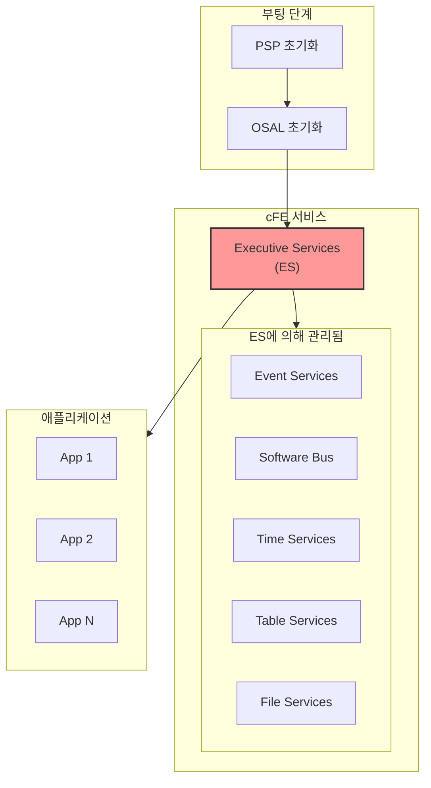
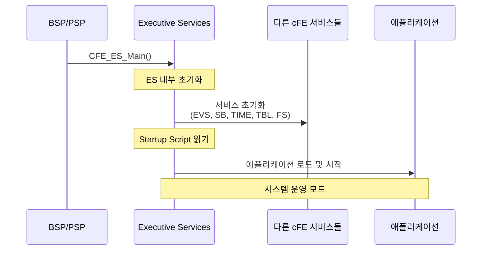
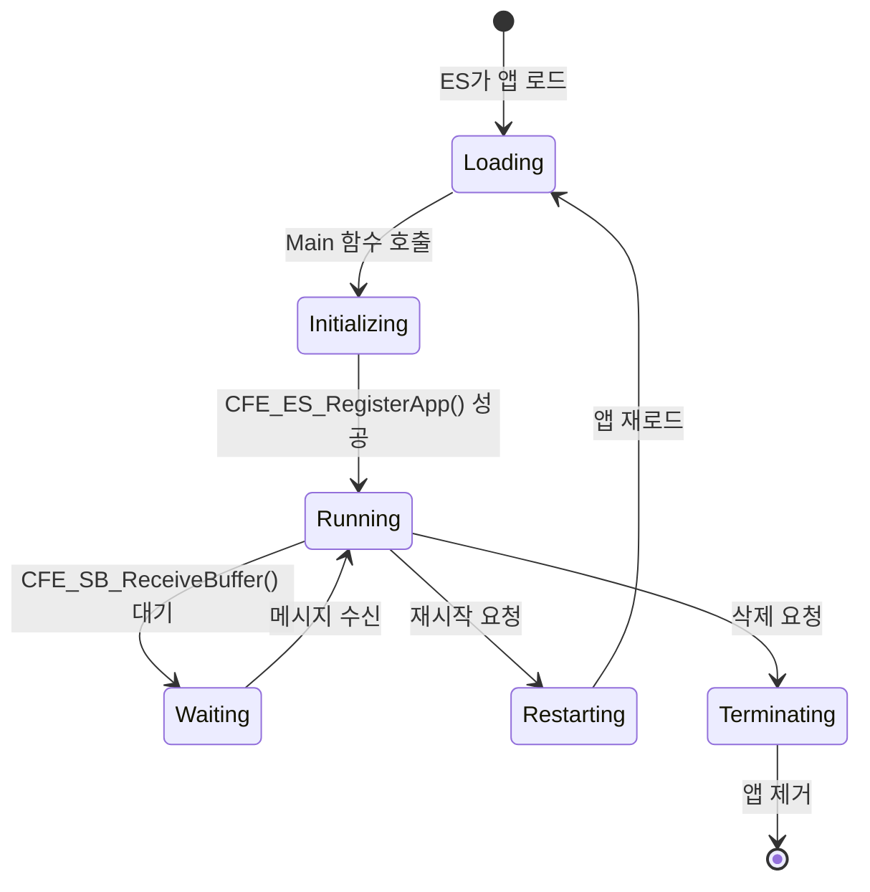
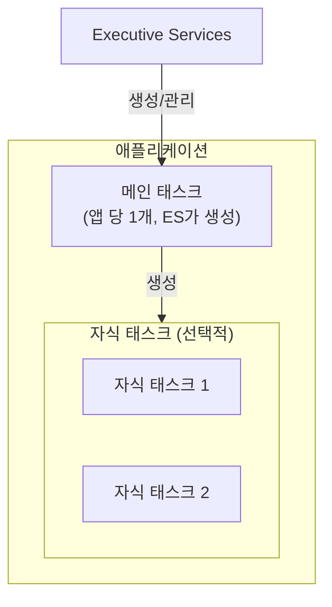
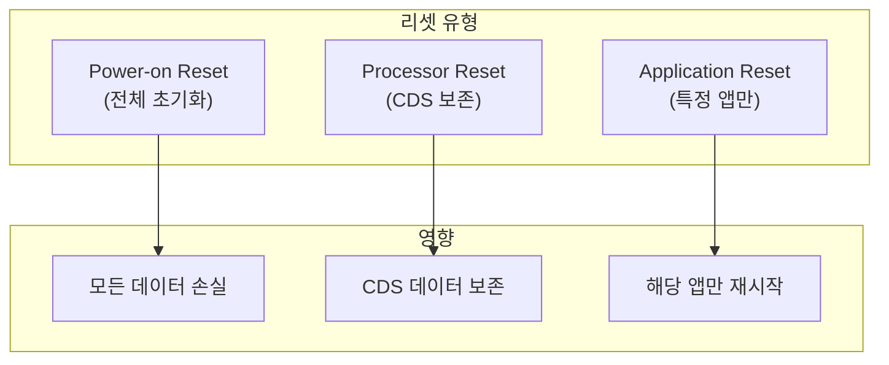
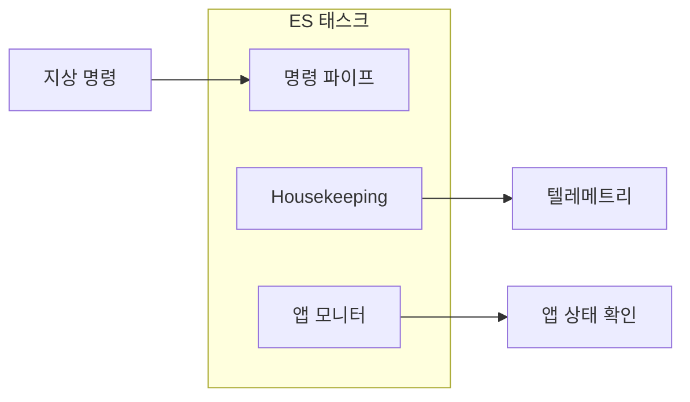
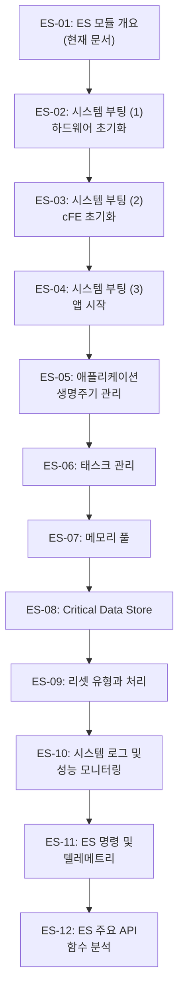

# Phase 2 ES-01: Executive Services 모듈 개요 및 역할

## 서론

Executive Services(ES)는 Core Flight Executive(cFE)의 가장 핵심적인 서비스 모듈이다. ES는 cFE 시스템의 심장부로서, 시스템 부팅, 애플리케이션 생명주기 관리, 메모리 풀 관리, 리셋 처리 등 비행 소프트웨어가 동작하기 위한 가장 기본적인 기능들을 제공한다.

다른 cFE 서비스들(SB, EVS, TIME, TBL, FS)이 모두 ES에 의해 초기화되고 관리된다는 점에서, ES는 cFE의 "부모" 역할을 수행한다고 할 수 있다. 본 문서에서는 ES 모듈의 전체적인 역할과 책임 영역을 개요 수준에서 살펴보고, 이후 문서들에서 각 기능을 상세히 다룰 것이다.

---

## 1. ES 모듈의 위치와 역할

### 1.1 cFE 아키텍처에서의 위치

ES는 cFE 서비스들 중 가장 먼저 초기화되며, 다른 모든 서비스와 애플리케이션의 기반이 된다.



### 1.2 ES의 핵심 책임 영역

ES 모듈이 담당하는 책임 영역은 매우 광범위하다. 이는 ES가 단순한 서비스 모듈이 아니라 전체 cFE 시스템의 운영 기반을 제공하는 "운영체제 위의 운영체제"와 같은 역할을 수행하기 때문이다. 일반적인 데스크톱 운영체제에서 커널이 프로세스 관리, 메모리 관리, 파일 시스템 등을 담당하듯이, ES는 cFS 환경에서 이와 유사한 역할을 애플리케이션 레벨에서 수행한다.

특히 우주 비행 환경에서는 지상의 소프트웨어와 다른 특별한 요구사항이 있다. 예를 들어, 시스템이 예기치 않게 리셋되더라도 중요한 상태 정보는 보존되어야 하며, 문제가 있는 애플리케이션만 격리하여 재시작할 수 있어야 한다. ES는 이러한 우주 환경 특유의 요구사항을 충족시키기 위해 설계되었다.

ES 모듈이 담당하는 핵심 책임 영역은 다음과 같이 분류할 수 있다:

| 책임 영역 | 설명 |
|:---|:---|
| **시스템 초기화** | cFE 부팅, 서비스 시작, startup script 실행 |
| **애플리케이션 관리** | 앱 로드, 시작, 재시작, 삭제 |
| **태스크 관리** | 태스크 정보 조회, 자식 태스크 관리 |
| **메모리 풀 관리** | 동적 메모리 할당을 위한 풀 관리 |
| **리셋 처리** | Power-on, Processor, Application 리셋 |
| **Critical Data Store** | 리셋 간 데이터 보존 |
| **시스템 로그** | Syslog를 통한 저수준 로깅 |
| **성능 모니터링** | 성능 데이터 수집 및 보고 |

이 각각의 책임 영역은 상호 연관되어 있다. 예를 들어, 애플리케이션 관리는 태스크 관리와 밀접하게 연결되어 있으며, 리셋 처리는 Critical Data Store와 함께 동작해야 의미가 있다. ES는 이러한 기능들을 통합적으로 제공함으로써, 애플리케이션 개발자가 복잡한 시스템 레벨의 문제를 신경 쓰지 않고도 비행 소프트웨어를 개발할 수 있게 해준다.

---

## 2. ES 모듈의 주요 기능

이 섹션에서는 ES가 제공하는 각 기능의 개념적 배경과 중요성을 살펴본다. 단순히 "무엇을 하는가"를 넘어서 "왜 이 기능이 필요한가", "어떤 문제를 해결하는가"를 이해하는 것이 중요하다.

### 2.1 시스템 초기화

모든 소프트웨어 시스템은 시작점이 필요하다. 일반적인 C 프로그램에서는 `main()` 함수가 그 역할을 하지만, cFS와 같은 복잡한 비행 소프트웨어 프레임워크에서는 초기화 과정이 훨씬 복잡하다. 하드웨어 초기화, 운영체제 부팅, 추상화 계층 설정을 거쳐 마침내 cFE가 시작되는데, ES의 `CFE_ES_Main()` 함수가 바로 cFE의 진입점이다.

이 함수는 Platform Support Package(PSP)에 의해 호출된다. PSP가 하드웨어와 운영체제 수준의 초기화를 완료하면, 제어권이 ES로 넘어온다. 이 시점부터 ES는 cFE의 다른 핵심 서비스들을 순서대로 초기화하고, 정의된 애플리케이션들을 시작하는 역할을 담당한다.

초기화 순서가 중요한 이유는 서비스들 간의 의존성 때문이다. 예를 들어, 이벤트를 보고하려면 EVS가 먼저 초기화되어야 하고, 메시지를 주고받으려면 SB가 초기화되어야 한다. ES는 이러한 의존성을 파악하고 올바른 순서로 각 서비스를 초기화한다.



### 2.2 애플리케이션 생명주기 관리

전통적인 임베디드 시스템에서는 모든 코드가 하나의 큰 실행 파일로 컴파일되어 정적으로 동작하는 경우가 많다. 하지만 cFS는 동적 애플리케이션 모델을 채택하였다. 이는 각 애플리케이션이 독립적인 모듈로 존재하며, 런타임에 로드되고, 필요에 따라 재시작되거나 업데이트될 수 있음을 의미한다.

이러한 동적 모델이 우주 임무에서 중요한 이유는 여러 가지가 있다. 첫째, 문제가 있는 애플리케이션만 격리하여 재시작할 수 있어 전체 시스템 가용성이 높아진다. 둘째, 임무 중에도 소프트웨어를 업데이트할 수 있다. 수년 동안 지속되는 심우주 임무에서 이 능력은 매우 중요하다. 셋째, 개발 및 테스트 단계에서 전체 시스템을 재부팅하지 않고도 특정 앱만 교체하며 테스트할 수 있다.

ES는 이러한 동적 애플리케이션 관리의 핵심이다. 모든 애플리케이션은 ES에 등록되어야 하며, ES는 각 앱의 상태를 추적하고, 지상 명령이나 자동화된 정책에 따라 앱을 제어한다.

ES는 cFE 애플리케이션의 전체 생명주기를 관리한다:



**주요 API 함수**:

| 함수 | 설명 |
|:---|:---|
| `CFE_ES_RegisterApp()` | 앱을 ES에 등록 |
| `CFE_ES_RunLoop()` | 앱 메인 루프 제어 |
| `CFE_ES_ExitApp()` | 앱 종료 |
| `CFE_ES_RestartApp()` | 앱 재시작 |
| `CFE_ES_DeleteApp()` | 앱 삭제 |
| `CFE_ES_ReloadApp()` | 앱 재로드 |

### 2.3 태스크 관리

실시간 시스템에서 "태스크"는 독립적으로 스케줄링되는 실행 단위이다. 각 태스크는 자신만의 스택과 실행 컨텍스트를 가지며, 운영체제의 스케줄러에 의해 CPU 시간을 할당받는다. cFS에서 모든 애플리케이션은 최소한 하나의 "메인 태스크"를 가지며, 이는 앱이 로드될 때 ES에 의해 자동으로 생성된다.

하지만 복잡한 애플리케이션의 경우 단일 태스크로는 요구사항을 충족하기 어려울 수 있다. 예를 들어, 센서 데이터를 높은 빈도로 수집하면서 동시에 지상 명령을 처리해야 하는 경우, 하나의 태스크로는 타이밍 요구사항을 만족시키기 어렵다. 이런 경우 애플리케이션은 "자식 태스크"를 생성하여 병렬 처리를 구현할 수 있다.

자식 태스크는 부모 애플리케이션의 주소 공간을 공유하므로 데이터 교환이 효율적이지만, 동시 접근으로 인한 경쟁 조건(race condition)에 주의해야 한다. ES는 자식 태스크의 생성과 삭제를 관리하고, 모든 태스크의 상태 정보를 추적한다.

cFS에서 각 애플리케이션은 하나 이상의 태스크로 구성될 수 있다. ES는 메인 태스크와 자식 태스크 모두를 관리한다.



**자식 태스크 API**:

```c
/* 자식 태스크 생성 */
CFE_Status_t CFE_ES_CreateChildTask(
    CFE_ES_TaskId_t *TaskIdPtr,      /* 생성된 태스크 ID 반환 */
    const char *TaskName,             /* 태스크 이름 */
    CFE_ES_ChildTaskMainFuncPtr_t FunctionPtr, /* 진입점 함수 */
    CFE_ES_StackPointer_t StackPtr,   /* 스택 포인터 */
    size_t StackSize,                 /* 스택 크기 */
    CFE_ES_TaskPriority_Atom_t Priority, /* 우선순위 */
    uint32 Flags                      /* 플래그 */
);

/* 자식 태스크 삭제 */
CFE_Status_t CFE_ES_DeleteChildTask(CFE_ES_TaskId_t TaskId);
```

### 2.4 메모리 풀 관리

동적 메모리 할당은 일반적인 응용 프로그램에서는 당연한 기능이지만, 비행 소프트웨어에서는 신중하게 다뤄야 할 영역이다. 표준 C 라이브러리의 `malloc()`과 `free()` 함수는 몇 가지 문제가 있다. 첫째, 할당 시간이 일정하지 않아 실시간 시스템에서 예측 불가능한 지연을 유발할 수 있다. 둘째, 반복적인 할당과 해제로 인해 메모리 단편화가 발생하면 큰 블록을 할당할 수 없게 될 수 있다. 셋째, 메모리 누수는 장기 임무에서 치명적인 문제를 일으킬 수 있다.

ES의 메모리 풀 시스템은 이러한 문제들을 해결하기 위해 설계되었다. 메모리 풀은 사전에 정의된 고정 크기의 블록들로 구성되며, 할당은 단순히 빈 블록을 찾아 반환하는 것이므로 시간이 일정하다. 또한 고정 크기 블록을 사용하므로 단편화 문제가 발생하지 않는다. 풀은 사용 통계를 추적하여 메모리 누수를 탐지하고 디버깅할 수 있게 해준다.

ES는 동적 메모리 할당을 위한 메모리 풀 시스템을 제공한다. 이는 일반적인 malloc/free보다 결정론적이고 안전한 메모리 관리를 가능하게 한다.


**메모리 풀 API**:

| 함수 | 설명 |
|:---|:---|
| `CFE_ES_PoolCreate()` | 메모리 풀 생성 |
| `CFE_ES_GetPoolBuf()` | 풀에서 버퍼 할당 |
| `CFE_ES_PutPoolBuf()` | 버퍼를 풀에 반환 |
| `CFE_ES_GetPoolStats()` | 풀 통계 조회 |

### 2.5 리셋 처리

우주 환경은 가혹하다. 태양 플레어, 우주선, 방사선 등으로 인해 반도체의 비트가 무작위로 뒤집히는 "단일 이벤트 업셋(SEU)"이 발생할 수 있다. 이로 인해 소프트웨어가 비정상적으로 동작하면 시스템을 리셋해야 한다. 또한 소프트웨어 버그로 인해 무한 루프에 빠지거나 응답하지 않는 경우도 있다. 이런 상황에서 워치독 타이머가 타임아웃되면 자동으로 리셋이 발생한다.

하지만 모든 리셋이 동일한 것은 아니다. 완전한 전원 차단 후 재인가되는 경우와 소프트웨어 명령으로 프로세서만 리셋하는 경우는 다르게 처리되어야 한다. 후자의 경우, 이전 실행의 중요한 상태 정보를 보존할 수 있다면 시스템이 더 빠르게 정상 운영 상태로 복귀할 수 있다.

ES는 이러한 다양한 리셋 시나리오를 인식하고 적절하게 처리한다. 리셋 유형을 파악하고, 필요에 따라 보존된 데이터를 복원하며, 리셋 횟수를 추적하여 반복적인 리셋이 발생하면 더 강력한 복구 조치를 취한다.

ES는 다양한 유형의 시스템 리셋을 관리한다:

| 리셋 유형 | 설명 |
|:---|:---|
| **Power-on Reset** | 전원 인가 시 발생, 모든 상태 초기화 |
| **Processor Reset** | 프로세서만 리셋, CDS 보존 |
| **Application Reset** | 특정 앱만 재시작 |



### 2.6 Critical Data Store (CDS)

위에서 언급한 것처럼, Processor Reset 후에도 중요한 데이터를 유지하는 것은 비행 소프트웨어에서 매우 중요하다. 예를 들어, 과학 임무에서 수집한 관측 데이터의 통계, 명령 시퀀스 실행 상태, 센서 캘리브레이션 값 등은 리셋 후에도 보존되어야 한다.

Critical Data Store(CDS)는 이러한 요구를 충족시키는 메커니즘이다. CDS는 Processor Reset으로부터 보호되는 특별한 메모리 영역에 데이터를 저장한다. 이 영역은 플랫폼에 따라 다르게 구현될 수 있다. 실제 비행 하드웨어에서는 리셋 시에도 초기화되지 않는 RAM 영역이나 배터리 백업 SRAM이 사용되고, 개발 환경에서는 파일로 시뮬레이션된다.

앱은 CDS에 영역을 등록하고, 주기적으로 또는 중요한 상태 변경 시 데이터를 저장한다. 리셋 후 앱이 다시 시작되면, CDS에서 데이터를 복원하여 이전 상태에서 계속할 수 있다. CDS는 데이터의 무결성을 검증하기 위해 CRC를 사용하며, 손상된 데이터는 복원하지 않는다.

CDS는 Processor Reset 이후에도 데이터를 보존해야 하는 경우에 사용된다. 앱은 CDS에 영역을 할당받아 중요한 데이터를 저장할 수 있다.

```c
/* CDS 영역 등록 */
CFE_Status_t CFE_ES_RegisterCDS(
    CFE_ES_CDSHandle_t *CDSHandlePtr,  /* CDS 핸들 반환 */
    size_t BlockSize,                   /* 필요한 크기 */
    const char *Name                    /* CDS 이름 */
);

/* CDS에 데이터 저장 */
CFE_Status_t CFE_ES_CopyToCDS(
    CFE_ES_CDSHandle_t CDSHandle,
    const void *DataToCopy
);

/* CDS에서 데이터 복원 */
CFE_Status_t CFE_ES_RestoreFromCDS(
    void *RestoreToMemory,
    CFE_ES_CDSHandle_t CDSHandle
);
```

### 2.7 시스템 로그 (Syslog)

cFS는 이벤트 보고를 위해 Event Services(EVS)를 제공한다. 그러나 EVS는 시스템 초기화 과정에서 다른 서비스들이 먼저 준비된 후에야 동작할 수 있다. 이는 "닭이 먼저냐 달걀이 먼저냐"와 같은 문제를 야기한다. ES 자체의 초기화 과정에서 발생하는 이벤트는 어떻게 기록할 것인가?

이 문제를 해결하기 위해 ES는 독자적인 시스템 로그(Syslog) 기능을 제공한다. Syslog는 EVS에 의존하지 않으며, ES가 초기화되는 가장 초기 단계부터 사용할 수 있다. 이 로그는 순환 버퍼 형태로 메모리에 저장되며, 지상 명령을 통해 파일로 덤프하거나 클리어할 수 있다.

Syslog는 또한 EVS를 통한 정상적인 이벤트 보고가 불가능한 비상 상황에서도 사용된다. 예를 들어, 심각한 오류로 인해 시스템이 종료되기 직전이나, EVS 파이프가 가득 찬 경우에도 Syslog는 여전히 동작한다.

ES는 EVS가 초기화되기 전이나 EVS를 사용할 수 없는 상황에서 로깅할 수 있는 시스템 로그 기능을 제공한다.

```c
/* 시스템 로그에 메시지 기록 */
int32 CFE_ES_WriteToSysLog(const char *SpecStringPtr, ...);
```

### 2.8 성능 모니터링

비행 소프트웨어의 성능 분석은 일반 소프트웨어와 다른 도전을 수반한다. 일반적인 프로파일링 도구를 사용할 수 없는 경우가 많고, 성능 측정 자체가 시스템에 부하를 주어 결과를 왜곡할 수 있다. 또한 실시간 시스템에서는 평균 성능뿐만 아니라 최악의 경우 실행 시간이 중요하다.

ES의 성능 모니터링 기능은 이러한 요구사항을 염두에 두고 설계되었다. 개발자는 코드의 특정 구간에 "마커"를 배치하여 해당 구간의 진입과 종료를 기록한다. ES는 고해상도 타임스탬프와 함께 이 정보를 수집하고, 나중에 오프라인 분석을 위해 파일로 덤프할 수 있다.

이 데이터를 분석하면 각 태스크의 실행 시간, 스케줄링 패턴, 잠재적인 타이밍 문제 등을 파악할 수 있다. 또한 트리거 기능을 사용하면 특정 이벤트가 발생할 때를 중심으로 데이터를 수집하여, 간헐적으로 발생하는 문제를 디버깅하는 데 도움을 받을 수 있다.

ES는 성능 데이터를 수집하고 분석할 수 있는 기능을 제공한다:

```c
/* 성능 마커 시작 */
void CFE_ES_PerfLogEntry(uint32 Marker);

/* 성능 마커 종료 */
void CFE_ES_PerfLogExit(uint32 Marker);
```

이 기능을 사용하면 코드의 특정 구간이 실행되는 시간을 측정하고 분석할 수 있다.

---

## 3. ES 모듈의 내부 구조

### 3.1 ES 태스크

ES 자체도 하나의 cFE 태스크로 실행된다. 이 태스크는 다음을 담당한다:

- 명령 메시지 처리
- Housekeeping 텔레메트리 생성
- 앱 상태 모니터링



### 3.2 주요 데이터 구조

ES는 여러 중요한 내부 데이터 구조를 관리한다:

| 데이터 구조 | 용도 |
|:---|:---|
| **App Table** | 등록된 모든 애플리케이션 정보 |
| **Task Table** | 모든 태스크 정보 |
| **Library Table** | 로드된 라이브러리 정보 |
| **CDS Registry** | CDS 영역 등록 정보 |
| **Memory Pool Table** | 생성된 메모리 풀 정보 |

---

## 4. ES API 카테고리

ES가 제공하는 API 함수들은 다음과 같이 분류할 수 있다:

### 4.1 애플리케이션 관리 API

```c
/* 앱 등록 및 생명주기 */
CFE_Status_t CFE_ES_RegisterApp(void);
bool CFE_ES_RunLoop(uint32 *RunStatus);
void CFE_ES_ExitApp(uint32 ExitStatus);

/* 앱 제어 */
CFE_Status_t CFE_ES_RestartApp(CFE_ES_AppId_t AppID);
CFE_Status_t CFE_ES_ReloadApp(CFE_ES_AppId_t AppID, const char *FileName);
CFE_Status_t CFE_ES_DeleteApp(CFE_ES_AppId_t AppID);

/* 앱 정보 조회 */
CFE_Status_t CFE_ES_GetAppID(CFE_ES_AppId_t *AppIdPtr);
CFE_Status_t CFE_ES_GetAppIDByName(CFE_ES_AppId_t *AppIdPtr, const char *Name);
CFE_Status_t CFE_ES_GetAppName(char *AppName, CFE_ES_AppId_t AppId, size_t Size);
CFE_Status_t CFE_ES_GetAppInfo(CFE_ES_AppInfo_t *AppInfo, CFE_ES_AppId_t AppId);
```

### 4.2 태스크 관리 API

```c
/* 자식 태스크 */
CFE_Status_t CFE_ES_CreateChildTask(...);
CFE_Status_t CFE_ES_DeleteChildTask(CFE_ES_TaskId_t TaskId);
void CFE_ES_ExitChildTask(void);

/* 태스크 정보 */
CFE_Status_t CFE_ES_GetTaskID(CFE_ES_TaskId_t *TaskIdPtr);
CFE_Status_t CFE_ES_GetTaskInfo(CFE_ES_TaskInfo_t *TaskInfo, CFE_ES_TaskId_t TaskId);
```

### 4.3 메모리 풀 API

```c
CFE_Status_t CFE_ES_PoolCreate(CFE_ES_MemHandle_t *PoolID, ...);
CFE_Status_t CFE_ES_PoolCreateEx(CFE_ES_MemHandle_t *PoolID, ...);
CFE_Status_t CFE_ES_GetPoolBuf(CFE_ES_MemPoolBuf_t *BufPtr, ...);
int32 CFE_ES_PutPoolBuf(CFE_ES_MemHandle_t PoolID, CFE_ES_MemPoolBuf_t BufPtr);
CFE_Status_t CFE_ES_GetPoolStats(CFE_ES_MemPoolStats_t *Stats, CFE_ES_MemHandle_t PoolID);
```

### 4.4 CDS API

```c
CFE_Status_t CFE_ES_RegisterCDS(CFE_ES_CDSHandle_t *CDSHandlePtr, ...);
CFE_Status_t CFE_ES_CopyToCDS(CFE_ES_CDSHandle_t CDSHandle, const void *DataToCopy);
CFE_Status_t CFE_ES_RestoreFromCDS(void *RestoreToMemory, CFE_ES_CDSHandle_t CDSHandle);
```

### 4.5 시스템 유틸리티 API

```c
/* 리셋 정보 */
CFE_Status_t CFE_ES_GetResetType(uint32 *ResetSubtypePtr);
uint32 CFE_ES_ResetCFE(uint32 ResetType);

/* 시스템 로그 */
int32 CFE_ES_WriteToSysLog(const char *SpecStringPtr, ...);

/* 성능 모니터링 */
void CFE_ES_PerfLogEntry(uint32 Marker);
void CFE_ES_PerfLogExit(uint32 Marker);

/* 시스템 정보 */
CFE_Status_t CFE_ES_GetGenCounterValue(uint32 *Value, ...);
CFE_Status_t CFE_ES_IncrementGenCounter(CFE_ES_CounterId_t CounterId);
```

---

## 5. ES 명령과 텔레메트리

### 5.1 ES 명령 메시지

ES는 지상에서 다양한 명령을 수신하여 처리한다:

| 명령 | 설명 |
|:---|:---|
| `NOOP` | 무동작 (통신 확인용) |
| `RESET_COUNTERS` | 내부 카운터 리셋 |
| `RESTART_APP` | 지정 앱 재시작 |
| `RELOAD_APP` | 지정 앱 재로드 |
| `START_APP` | 새 앱 시작 |
| `STOP_APP` | 앱 중지 및 삭제 |
| `QUERY_APP` | 앱 정보 조회 |
| `WRITE_SYSLOG` | 시스템 로그를 파일로 출력 |
| `CLEAR_SYSLOG` | 시스템 로그 삭제 |
| `PERF_START_DATA` | 성능 데이터 수집 시작 |
| `PERF_STOP_DATA` | 성능 데이터 수집 중지 |
| `RESET_CFE` | cFE 리셋 |

### 5.2 ES 텔레메트리

ES는 다음과 같은 텔레메트리 패킷을 생성한다:

| 패킷 | 내용 |
|:---|:---|
| **Housekeeping** | ES 상태, 카운터, 앱 수, 태스크 수 등 |
| **App Info** | 특정 앱의 상세 정보 |
| **Shell Output** | 셸 명령 실행 결과 |
| **Pool Stats** | 메모리 풀 통계 |

---

## 6. ES 모듈 문서 로드맵

ES 모듈에 대한 상세한 이해를 위해 다음 문서들이 이어진다:



---

## 결론

Executive Services(ES)는 cFE의 핵심 모듈로서, 시스템 초기화부터 애플리케이션 관리, 메모리 관리, 리셋 처리에 이르기까지 비행 소프트웨어 운영의 기반을 제공한다. ES 없이는 다른 어떤 cFE 서비스도 동작할 수 없다.

ES가 제공하는 기능들을 이해하는 것은 cFS 기반 비행 소프트웨어 개발의 첫걸음이다. 다음 문서에서는 ES의 첫 번째 주요 역할인 시스템 부팅 시퀀스를 상세히 살펴볼 것이다. 하드웨어 초기화부터 시작하여 cFE가 어떻게 시작되는지 단계별로 분석할 것이다.

---

## 참고 문헌

1. NASA, "cFE User's Guide"
2. NASA, "cFE Application Developer's Guide"
3. NASA cFE GitHub Repository, https://github.com/nasa/cFE
4. NASA, "ES Module Design Document"

---

[이전 문서: Phase 1-08: 개발 환경 구축 가이드](./Phase1_08_개발_환경_구축_가이드.md)

[다음 문서: Phase 2 ES-02: 시스템 부팅 시퀀스 (1) - 하드웨어 초기화](./Phase2_ES_02_시스템_부팅_시퀀스_1_하드웨어_초기화.md)
