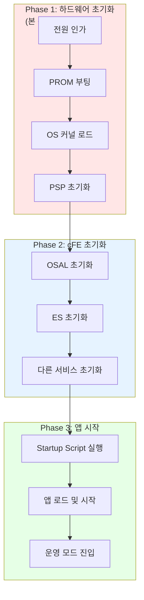
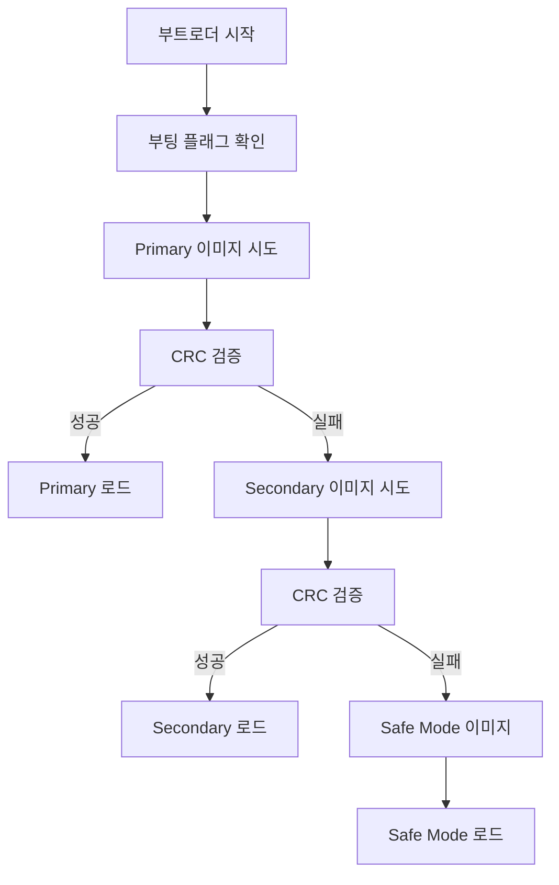
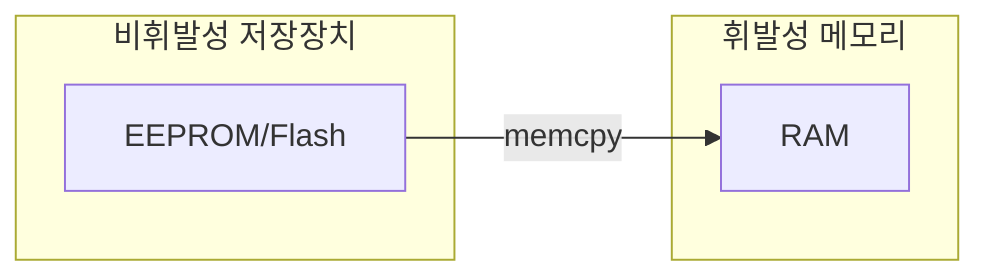
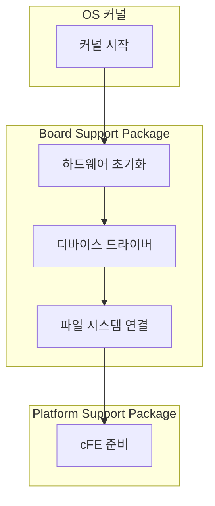
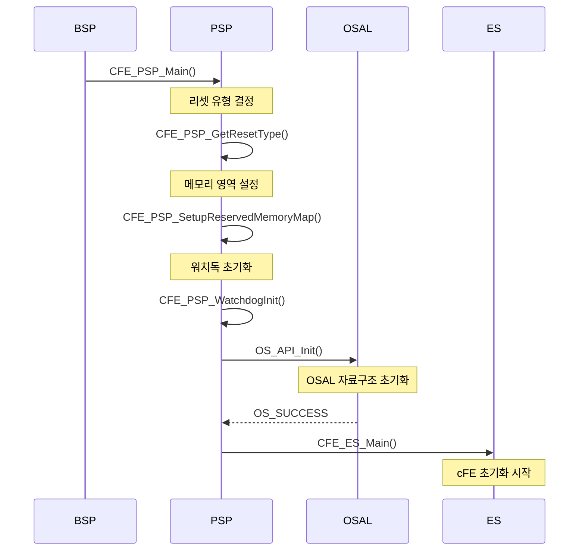
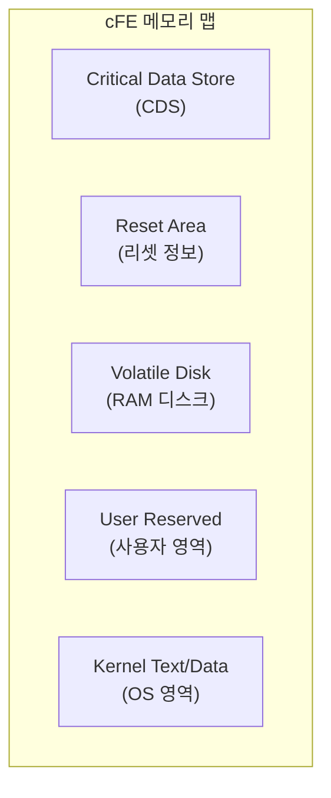
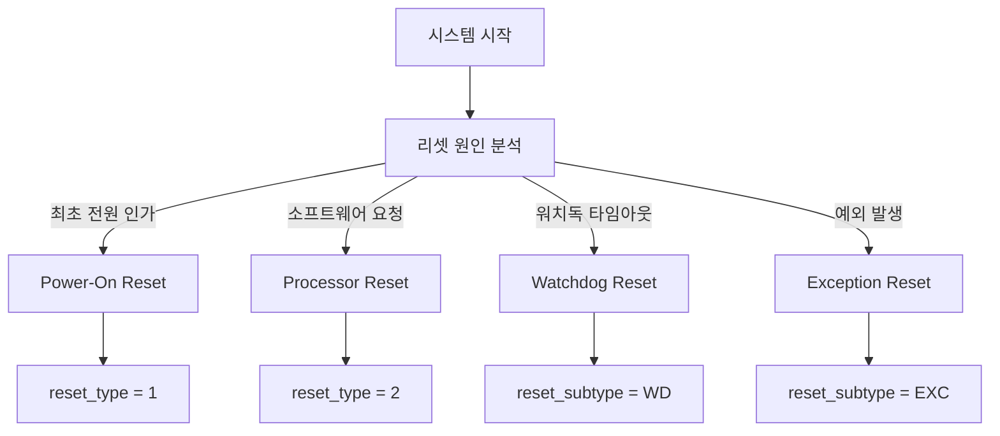
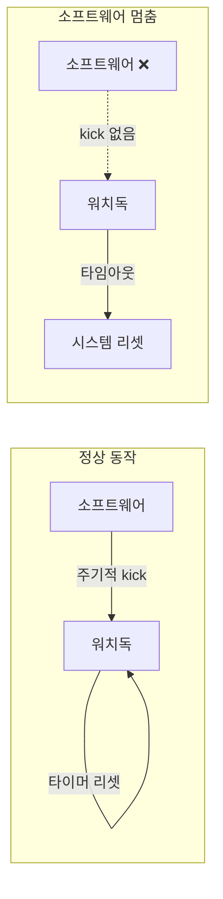
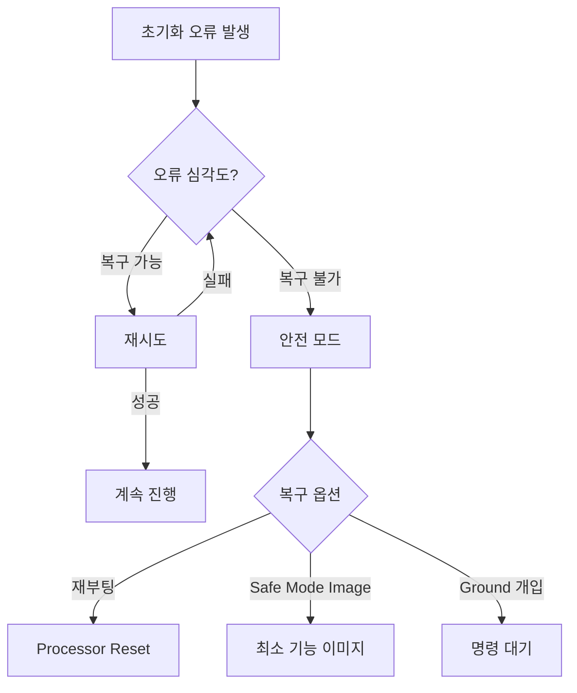

# Phase 2 ES-02: 시스템 부팅 시퀀스 (1) - 하드웨어 초기화

## 서론

비행 소프트웨어가 동작하기 위해서는 먼저 하드웨어가 올바르게 초기화되어야 한다. cFS 시스템의 부팅 과정은 전원이 인가되는 순간부터 시작하여 여러 단계를 거쳐 완전한 운영 상태에 도달한다.

일반적인 데스크톱 컴퓨터에서는 전원 버튼을 누르면 BIOS가 시작되고, 운영체제가 로드되며, 로그인 화면이 나타난다. 이 과정은 대부분 자동으로 이루어지며 사용자가 신경 쓸 일이 거의 없다. 그러나 비행 컴퓨터에서는 상황이 다르다. 우주 환경에서는 방사선으로 인한 메모리 오류, 극단적인 온도 변화, 무중력 환경 등 다양한 도전이 있으며, 부팅 과정에서 이러한 문제를 감지하고 대응해야 한다. 또한 지구에서 수만 킬로미터 떨어진 곣에서 인간의 개입 없이 신뢰성 있게 부팅되어야 한다.

본 문서에서는 cFS 부팅 시퀀스의 첫 번째 단계인 하드웨어 초기화 과정을 상세히 살펴본다. PROM 부팅, 운영체제 커널 로드, 그리고 PSP(Platform Support Package)가 수행하는 저수준 초기화까지의 과정을 다룬다.

---

## 1. 전체 부팅 시퀀스 개요

### 1.1 부팅 단계 전체 흐름

cFS 시스템의 부팅은 크게 세 단계로 나눌 수 있다:



### 1.2 각 단계의 책임 컴포넌트

| 단계 | 책임 컴포넌트 | 주요 작업 |
|:---|:---|:---|
| PROM 부팅 | 하드웨어/부트로더 | 프로세서 초기화, 이미지 검증 |
| OS 커널 로드 | 부트로더/BSP | 커널 메모리 복사, 실행 |
| PSP 초기화 | Platform Support Package | 플랫폼별 초기화 |
| OSAL 초기화 | OS Abstraction Layer | OS 추상화 계층 설정 |
| ES 초기화 | Executive Services | cFE 핵심 설정 |

---

## 2. PROM 부팅 단계

PROM(Programmable Read-Only Memory)은 전원이 꺼져도 내용이 유지되는 비휘발성 메모리이다. 비행 컴퓨터의 PROM에는 시스템을 초기화하고 주 소프트웨어를 로드하는 부트로더가 저장되어 있다. 이 부트로더는 일반적으로 임무 기간 동안 변경되지 않는 최소한의 코드로, 항상 신뢰할 수 있어야 한다. 만약 부트로더에 문제가 생기면 시스템 전체가 동작하지 않으므로, 부트로더는 철저하게 검증되고 한 번 프로그래밍된 후에는 변경되지 않는 것이 일반적이다.

### 2.1 전원 인가와 프로세서 시작

모든 프로세서는 전원이 인가되거나 리셋될 때 특정 주소에서 실행을 시작하도록 설계되어 있다. 이 주소를 "리셋 벡터"라고 하며, 이 주소는 PROM의 시작 부분을 가리킨다. 프로세서는 전원이 인가되면 모든 내부 상태를 초기화하고, 리셋 벡터 주소로 점프하여 부트로더 실행을 시작한다.

비행 컴퓨터에 전원이 인가되면 프로세서는 미리 정해진 리셋 벡터에서 실행을 시작한다. 이 주소는 일반적으로 PROM(Programmable Read-Only Memory)이나 부트 플래시의 시작 주소를 가리킨다.


### 2.2 부트로더의 역할

부트로더는 운영체제를 로드하기 전에 실행되는 작은 프로그램이다. 일반적인 PC에서의 BIOS나 UEFI와 유사한 역할을 한다. 부트로더는 하드웨어를 최소한으로 초기화한 후, 어떤 소프트웨어 이미지를 로드할지 결정하고, 해당 이미지를 메모리에 복사한 후 실행을 시작한다.

비행 시스템에서 부트로더는 특히 중요하다. 지구에서 멀리 떨어진 위성이나 탐사선에서 부트로더가 실패하면 시스템을 복구할 방법이 없다. 따라서 부트로더는 최대한 단순하고 신뢰성 있게 설계되며, 복수의 소프트웨어 이미지 중 하나를 선택하는 로직을 포함한다.

PROM에 저장된 부트로더는 다음과 같은 작업을 수행한다:

#### 2.2.1 하드웨어 기본 초기화


#### 2.2.2 이미지 선택 및 검증

비행 시스템은 일반적으로 복수의 소프트웨어 이미지를 가지고 있다:

| 이미지 유형 | 위치 | 용도 |
|:---|:---|:---|
| **Primary Image** | EEPROM Bank A | 정상 운영 이미지 |
| **Secondary Image** | EEPROM Bank B | 백업 이미지 |
| **Safe Mode Image** | PROM (Golden) | 복구용 최소 이미지 |

부트로더는 다음 과정을 통해 적절한 이미지를 선택한다:



### 2.3 이미지 무결성 검증

부트로더는 로드하기 전에 이미지의 무결성을 검증한다:

```c
/* 부트로더 이미지 검증 의사코드 */
typedef struct {
    uint32 ImageSize;
    uint32 StartAddress;
    uint32 EntryPoint;
    uint32 CRC;
} ImageHeader_t;

bool VerifyImage(ImageHeader_t *header, void *imageData)
{
    uint32 computedCRC;
    
    /* CRC 계산 */
    computedCRC = ComputeCRC(imageData, header->ImageSize);
    
    /* 저장된 CRC와 비교 */
    if (computedCRC != header->CRC)
    {
        return false;  /* 검증 실패 */
    }
    
    return true;  /* 검증 성공 */
}
```

---

## 3. 운영체제 커널 로드

부트로더가 할 일을 다 하면, 이제 실제 운영체제를 로드하고 실행할 차례이다. 비행 시스템에서는 주로 VxWorks나 RTEMS와 같은 실시간 운영체제(RTOS)가 사용된다. 이러한 RTOS는 일반적인 데스크톱 OS와 다르게, 정해진 시간 내에 작업을 완료하는 것을 보장하는 "실시간성"을 제공한다. 이는 우주선의 자세 제어나 통신 커맨드 처리와 같이 타이밍이 중요한 작업에 필수적이다.

운영체제 이미지는 보통 EEPROM이나 플래시 메모리에 저장되어 있으며, 저장 공간 절약을 위해 압축되어 있는 경우도 많다. 성능을 위해 이 이미지는 RAM으로 복사되어 실행된다.

### 3.1 이미지 RAM으로 복사

검증이 완료된 이미지는 EEPROM이나 플래시에서 RAM으로 복사된다:



### 3.2 선택적 압축 해제

이미지가 압축되어 있는 경우 RAM에서 압축을 해제한다:

```c
/* 압축 해제 의사코드 */
void DecompressImage(void *compressed, size_t compSize,
                     void *decompressed, size_t *decompSize)
{
    /* gzip 또는 유사 알고리즘으로 압축 해제 */
    inflate(compressed, compSize, decompressed, decompSize);
}
```

### 3.3 커널 진입점 점프

이미지가 RAM에 준비되면, 부트로더는 OS 커널의 진입점으로 점프한다:

```c
/* 커널 시작 의사코드 */
typedef void (*KernelEntry)(void);

void StartKernel(uint32 entryPoint)
{
    KernelEntry kernel = (KernelEntry)entryPoint;
    
    /* 플래시 인터럽트 비활성화 등 최종 준비 */
    DisableInterrupts();
    
    /* 커널로 점프 - 이 함수는 반환하지 않음 */
    kernel();
}
```

---

## 4. BSP 및 PSP 초기화

### 4.1 BSP (Board Support Package)

운영체제 커널이 시작되면 BSP가 플랫폼별 초기화를 수행한다. BSP는 운영체제에 포함된 컴포넌트로, 특정 보드에 대한 지원을 제공한다.



BSP가 수행하는 주요 초기화:

| 영역 | 설명 |
|:---|:---|
| **인터럽트 컨트롤러** | 인터럽트 벡터 설정 |
| **메모리 컨트롤러** | 메모리 맵 설정 |
| **주변장치** | UART, 타이머, 네트워크 등 |
| **파일 시스템** | RAM 디스크, 플래시 FS 마운트 |

### 4.2 PSP (Platform Support Package)

BSP가 운영체제에 포함된 보드 지원 패키지인 반면, PSP는 cFS에 특화된 플랫폼 지원 패키지이다. PSP는 cFE가 특정 하드웨어 플랫폼에서 동작하기 위해 필요한 모든 플랫폼 종속적인 코드를 포함한다. 이를 통해 cFE는 특정 하드웨어에 대한 지식 없이도 다양한 플랫폼에서 동작할 수 있다.

PSP가 제공하는 기능에는 리셋 유형 결정, 예약 메모리 영역 관리, 워치독 타이머 제어, 시간 서비스 등이 있다. 예를 들어, CDS(Critical Data Store)를 저장하는 메모리 영역은 플랫폼마다 다르게 구현될 수 있는데, PSP가 이러한 차이를 추상화한다.

PSP는 cFS에 특화된 플랫폼 지원 패키지이다. BSP와 cFE 사이의 인터페이스를 제공한다.

#### 4.2.1 CFE_PSP_Main 함수

PSP의 핵심 진입점은 `CFE_PSP_Main()` 함수이다:

```c
/******************************************************************************
** CFE_PSP_Main - PSP 메인 함수
**
** 이 함수는 BSP에 의해 호출되어 cFE를 시작한다.
******************************************************************************/
void CFE_PSP_Main(void)
{
    uint32 reset_type;
    uint32 reset_subtype;
    
    /*
    ** 리셋 유형 결정
    */
    reset_type = CFE_PSP_GetResetType(&reset_subtype);
    
    /*
    ** PSP 내부 초기화
    */
    CFE_PSP_SetupReservedMemoryMap();
    
    /*
    ** 워치독 초기화
    */
    CFE_PSP_WatchdogInit();
    
    /*
    ** OSAL 초기화
    */
    int32 status = OS_API_Init();
    if (status != OS_SUCCESS)
    {
        /* 치명적 오류 */
        CFE_PSP_Panic(status);
    }
    
    /*
    ** cFE 시작
    */
    CFE_ES_Main(reset_type, reset_subtype, 1, CFE_PSP_NONVOL_STARTUP_FILE);
    
    /* 이 지점에 도달하면 안 됨 */
    CFE_PSP_Panic(CFE_PSP_ERROR);
}
```

#### 4.2.2 PSP 초기화 단계



---

## 5. 메모리 맵 설정

### 5.1 예약 메모리 영역

PSP는 cFE가 사용할 메모리 영역들을 설정한다:



### 5.2 메모리 영역 정의

PC-Linux PSP에서의 메모리 영역 설정 예시:

```c
/* PSP 메모리 설정 구조체 */
typedef struct {
    cpuaddr ResetArea;
    size_t  ResetAreaSize;
    cpuaddr VolatileDiskArea;
    size_t  VolatileDiskSize;
    cpuaddr CDSArea;
    size_t  CDSSize;
    cpuaddr UserReservedArea;
    size_t  UserReservedSize;
} CFE_PSP_MemoryMap_t;

/* 메모리 맵 설정 함수 */
void CFE_PSP_SetupReservedMemoryMap(void)
{
    /* Reset Area 할당 */
    CFE_PSP_MemoryMap.ResetArea = (cpuaddr)malloc(CFE_PLATFORM_ES_RESET_AREA_SIZE);
    CFE_PSP_MemoryMap.ResetAreaSize = CFE_PLATFORM_ES_RESET_AREA_SIZE;
    
    /* CDS 할당 */
    CFE_PSP_MemoryMap.CDSArea = (cpuaddr)malloc(CFE_PLATFORM_ES_CDS_SIZE);
    CFE_PSP_MemoryMap.CDSSize = CFE_PLATFORM_ES_CDS_SIZE;
    
    /* Volatile Disk 할당 */
    CFE_PSP_MemoryMap.VolatileDiskArea = (cpuaddr)malloc(CFE_PLATFORM_ES_RAM_DISK_SECTOR_SIZE * 
                                                          CFE_PLATFORM_ES_RAM_DISK_NUM_SECTORS);
    
    /* User Reserved 할당 */
    CFE_PSP_MemoryMap.UserReservedArea = (cpuaddr)malloc(CFE_PLATFORM_ES_USER_RESERVED_SIZE);
    CFE_PSP_MemoryMap.UserReservedSize = CFE_PLATFORM_ES_USER_RESERVED_SIZE;
}
```

### 5.3 PSP Memory API

cFE가 메모리 영역에 접근할 때 사용하는 PSP API:

```c
/* 리셋 영역 조회 */
int32 CFE_PSP_GetResetArea(cpuaddr *PtrToResetArea, uint32 *SizeOfResetArea);

/* CDS 영역 조회 */
int32 CFE_PSP_GetCDSSize(uint32 *SizeOfCDS);
int32 CFE_PSP_WriteToCDS(const void *ptr, uint32 offset, uint32 size);
int32 CFE_PSP_ReadFromCDS(void *ptr, uint32 offset, uint32 size);

/* Volatile Disk 조회 */
int32 CFE_PSP_GetVolatileDiskMem(cpuaddr *PtrToVolDisk, uint32 *SizeOfVolDisk);

/* User Reserved 조회 */
int32 CFE_PSP_GetUserReservedArea(cpuaddr *PtrToUserArea, uint32 *SizeOfUserArea);
```

---

## 6. 리셋 유형 결정

### 6.1 리셋 유형 분류

PSP는 시스템이 어떤 유형의 리셋으로 시작되었는지 결정한다:



### 6.2 리셋 유형 API

```c
/* 리셋 유형 상수 */
#define CFE_PSP_RST_TYPE_POWERON    1
#define CFE_PSP_RST_TYPE_PROCESSOR  2

/* 리셋 부유형 상수 */
#define CFE_PSP_RST_SUBTYPE_POWER_CYCLE     1
#define CFE_PSP_RST_SUBTYPE_PUSH_BUTTON     2
#define CFE_PSP_RST_SUBTYPE_HW_SPECIAL_CMD  3
#define CFE_PSP_RST_SUBTYPE_HW_WATCHDOG     4
#define CFE_PSP_RST_SUBTYPE_RESET_COMMAND   5
#define CFE_PSP_RST_SUBTYPE_EXCEPTION       6

/* 리셋 유형 조회 함수 */
uint32 CFE_PSP_GetResetType(uint32 *reset_subtype)
{
    uint32 reset_type;
    
    /* 하드웨어 레지스터나 저장된 정보에서 리셋 원인 읽기 */
    /* 플랫폼별 구현 */
    
    /* CDS가 유효한지 확인하여 리셋 유형 결정 */
    if (CheckCDSValidity() == true)
    {
        reset_type = CFE_PSP_RST_TYPE_PROCESSOR;
    }
    else
    {
        reset_type = CFE_PSP_RST_TYPE_POWERON;
    }
    
    return reset_type;
}
```

### 6.3 리셋 유형에 따른 동작

| 리셋 유형 | CDS | App 상태 | ES 동작 |
|:---|:---:|:---:|:---|
| Power-On | 초기화 | 모두 재시작 | 전체 초기화 |
| Processor | 보존 | 모두 재시작 | CDS에서 복원 시도 |

---

## 7. 워치독 타이머 설정

### 7.1 워치독의 역할

워치독 타이머는 소프트웨어가 정상 동작하는지 감시한다. 주기적으로 "kick"되지 않으면 시스템을 리셋한다.



### 7.2 PSP 워치독 API

```c
/* 워치독 초기화 */
void CFE_PSP_WatchdogInit(void);

/* 워치독 활성화/비활성화 */
void CFE_PSP_WatchdogEnable(void);
void CFE_PSP_WatchdogDisable(void);

/* 워치독 서비스 (kick) */
void CFE_PSP_WatchdogService(void);

/* 워치독 타임아웃 설정 */
void CFE_PSP_WatchdogSet(uint32 WatchdogValue);
uint32 CFE_PSP_WatchdogGet(void);
```

### 7.3 cFE에서의 워치독 서비스

ES 태스크는 주기적으로 워치독을 서비스한다:

```c
/* ES 메인 루프에서 */
while (CFE_ES_Global.SystemState != CFE_ES_SystemState_SHUTDOWN)
{
    /* 메시지 처리 ... */
    
    /* 워치독 서비스 */
    CFE_PSP_WatchdogService();
}
```

---

## 8. 부팅 중 오류 처리

### 8.1 Panic 함수

부팅 중 복구 불가능한 오류가 발생하면 PSP의 Panic 함수가 호출된다:

```c
/******************************************************************************
** CFE_PSP_Panic - 치명적 오류 처리
**
** 시스템을 안전한 상태로 만들고 멈춤
******************************************************************************/
void CFE_PSP_Panic(int32 ErrorCode)
{
    /* 오류 코드 기록 */
    OS_printf("PANIC: Error code %d\n", (int)ErrorCode);
    
    /* 인터럽트 비활성화 */
    OS_IntDisable(0);
    
    /* 플랫폼별 안전 처리 */
    #ifdef CFE_PSP_PANIC_RESET
        CFE_PSP_Restart(CFE_PSP_RST_TYPE_PROCESSOR);
    #else
        /* 무한 루프 (디버깅용) */
        while (1)
        {
            /* 워치독이 시스템을 리셋할 것임 */
        }
    #endif
}
```

### 8.2 오류 복구 전략



---

## 9. 정리: 하드웨어 초기화 체크리스트

부팅의 첫 번째 단계가 완료되면 다음 상태가 확보된다:

| 항목 | 상태 |
|:---|:---|
| 프로세서 | 정상 동작, 캐시/MMU 설정됨 |
| 메모리 | RAM 테스트 완료, 메모리 맵 설정됨 |
| OS 커널 | 로드되어 실행 중 |
| 인터럽트 | 인터럽트 컨트롤러 초기화됨 |
| 파일 시스템 | 기본 FS 마운트됨 |
| OSAL | 초기화 완료 |
| 리셋 유형 | 결정됨 (Power-On / Processor) |
| 메모리 영역 | 예약 영역 설정됨 (CDS, Reset Area 등) |
| 워치독 | 초기화되어 동작 중 |

---

## 결론

cFS 시스템의 부팅은 하드웨어 수준에서 시작하여 여러 단계를 거친다. PROM의 부트로더가 이미지를 검증하고 로드하면, OS 커널이 시작되고, BSP/PSP가 플랫폼별 초기화를 수행한다.

PSP의 `CFE_PSP_Main()` 함수가 완료되면, OSAL이 초기화되고 `CFE_ES_Main()`이 호출되어 cFE의 초기화가 시작된다. 다음 문서에서는 이 시점부터 시작하여 cFE 서비스들이 어떻게 초기화되는지 상세히 살펴볼 것이다.

---

## 참고 문헌

1. NASA, "cFE Deployment Guide"
2. NASA, "PSP Development Guide"
3. NASA cFE GitHub Repository, psp/fsw/pc-linux/src/
4. VxWorks, RTEMS BSP 문서

---

[이전 문서: Phase 2 ES-01: ES 모듈 개요 및 역할](./Phase2_ES_01_ES_모듈_개요_및_역할.md)

[다음 문서: Phase 2 ES-03: 시스템 부팅 시퀀스 (2) - cFE 초기화](./Phase2_ES_03_시스템_부팅_시퀀스_2_cFE_초기화.md)
