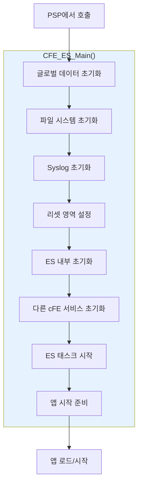
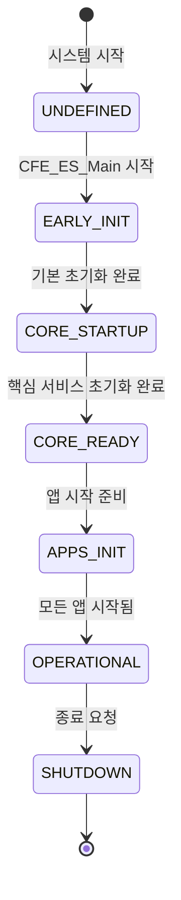
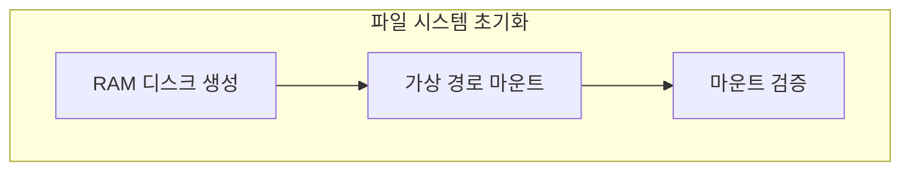
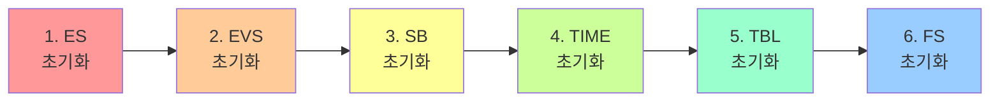
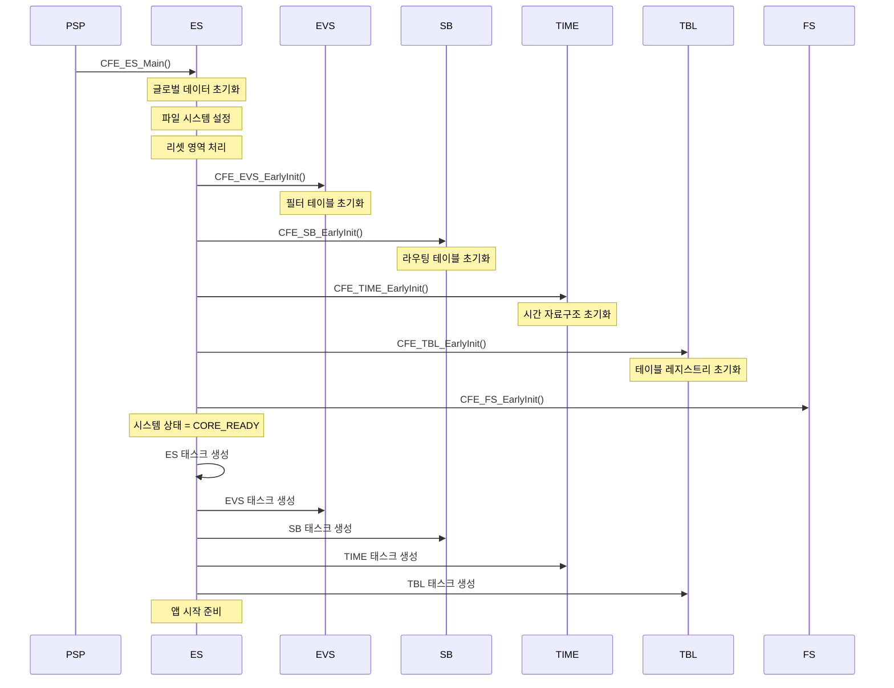
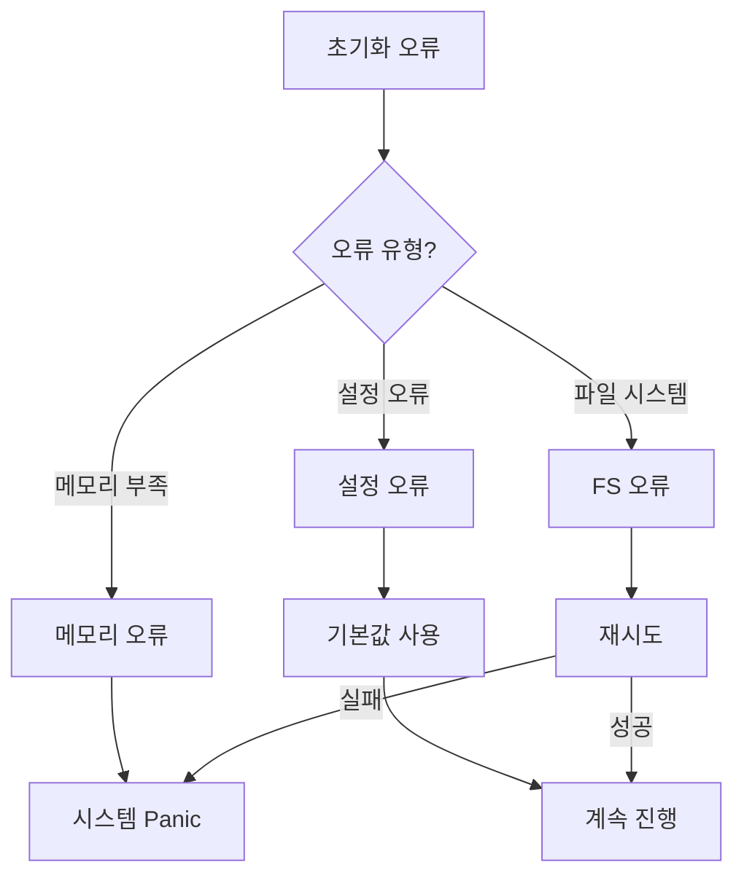

# Phase 2 ES-03: 시스템 부팅 시퀀스 (2) - cFE 초기화

## 서론

이전 문서에서 하드웨어 초기화와 PSP 설정까지의 과정을 살펴보았다. `CFE_PSP_Main()`에서 OSAL 초기화가 완료되면, `CFE_ES_Main()` 함수가 호출되어 본격적인 cFE 초기화가 시작된다.

이 단계는 cFS 시스템의 "영혼"을 불어넣는 과정이라고 할 수 있다. 하드웨어가 준비되고 운영체제가 동작하더라도, cFE 서비스들이 초기화되지 않으면 cFS 애플리케이션은 동작할 수 없다. 메시지를 교환할 수도, 이벤트를 기록할 수도, 시간을 얻을 수도 없다. 그래서 cFE 초기화는 다른 모든 것의 기반이 된다.

초기화 순서도 중요하다. 예를 들어, Software Bus(SB)가 없으면 서비스들이 서로 통신할 수 없고, Event Services(EVS)가 없으면 초기화 과정에서 문제가 발생해도 제대로 기록되지 않는다. 이러한 의존성을 이해하는 것이 cFE 초기화 과정을 이해하는 핵심이다.

본 문서에서는 `CFE_ES_Main()` 함수의 동작을 상세히 분석하고, cFE의 각 핵심 서비스(ES, EVS, SB, TIME, TBL, FS)가 어떤 순서로 초기화되는지 살펴본다. 이 과정을 이해하면 cFE 시스템이 어떻게 완전한 운영 상태에 도달하는지 파악할 수 있다.

---

## 1. CFE_ES_Main 함수 개요

### 1.1 함수 시그니처

```c
void CFE_ES_Main(uint32 StartType, 
                 uint32 StartSubtype, 
                 uint32 ModeId,
                 const char *StartFilePath);
```

| 파라미터 | 설명 |
|:---|:---|
| `StartType` | 리셋 유형 (Power-on=1, Processor=2) |
| `StartSubtype` | 리셋 부유형 (상세 원인) |
| `ModeId` | 시작 모드 ID |
| `StartFilePath` | Startup script 경로 |

### 1.2 전체 초기화 흐름



---

## 2. 초기화 상세 단계

### 2.1 글로벌 데이터 초기화

cFE의 모든 기능은 전역 데이터 구조에 의존한다. 이 구조체는 등록된 앱들의 목록, 시스템 상태, 리셋 정보 등을 추적한다. 초기화의 가장 첫 단계는 이 전역 데이터를 알려진 상태로 설정하는 것이다. `memset()`으로 모든 값을 0으로 초기화하는 것이 일반적인 패턴이다. 이렇게 하면 초기화되지 않은 메모리에 남아있는 쓰레기 값으로 인한 예측할 수 없는 동작을 방지할 수 있다.

또한 이 단계에서 PSP로부터 전달받은 리셋 유형 정보를 저장한다. 이 정보는 나중에 CDS를 복원할지 여부를 결정하는 데 사용된다.

가장 먼저 cFE 글로벌 데이터 구조를 초기화한다:

```c
void CFE_ES_Main(uint32 StartType, uint32 StartSubtype, 
                 uint32 ModeId, const char *StartFilePath)
{
    int32  ReturnCode;
    uint32 ElapsedTime;
    
    /*
    ** ES 글로벌 데이터 초기화
    */
    memset(&CFE_ES_Global, 0, sizeof(CFE_ES_Global));
    
    /*
    ** 시작 정보 저장
    */
    CFE_ES_Global.ResetType = StartType;
    CFE_ES_Global.ResetSubtype = StartSubtype;
    
    /*
    ** 시스템 상태를 EARLY_INIT으로 설정
    */
    CFE_ES_Global.SystemState = CFE_ES_SystemState_EARLY_INIT;
```

### 2.2 시스템 상태 머신

cFE 초기화는 상태 머신에 의해 제어된다:



상태 정의:

```c
typedef enum {
    CFE_ES_SystemState_UNDEFINED,      /* 정의되지 않음 */
    CFE_ES_SystemState_EARLY_INIT,     /* 초기 초기화 */
    CFE_ES_SystemState_CORE_STARTUP,   /* 핵심 서비스 시작 */
    CFE_ES_SystemState_CORE_READY,     /* 핵심 서비스 준비됨 */
    CFE_ES_SystemState_APPS_INIT,      /* 앱 초기화 중 */
    CFE_ES_SystemState_OPERATIONAL,    /* 정상 운영 */
    CFE_ES_SystemState_SHUTDOWN        /* 종료 중 */
} CFE_ES_SystemState_t;
```

### 2.3 파일 시스템 연결

ES는 가상 파일 시스템을 설정한다:

```c
    /*
    ** 가상 파일 시스템 초기화
    */
    ReturnCode = CFE_ES_InitFileSystem();
    if (ReturnCode != CFE_SUCCESS)
    {
        CFE_ES_SysLogWrite_Unsync("ES Startup: Error - File System Init failed.\n");
    }
```

파일 시스템 초기화 상세:



```c
int32 CFE_ES_InitFileSystem(void)
{
    int32 ReturnCode;
    
    /*
    ** RAM 디스크 생성 (Volatile 저장)
    */
    ReturnCode = OS_mkfs((void *)RamDiskMemoryAddress,
                         "/ramdev0",
                         "RAM",
                         CFE_PLATFORM_ES_RAM_DISK_SECTOR_SIZE,
                         CFE_PLATFORM_ES_RAM_DISK_NUM_SECTORS);
    
    if (ReturnCode == OS_SUCCESS)
    {
        /*
        ** 가상 경로에 마운트
        */
        ReturnCode = OS_mount("/ramdev0", CFE_PLATFORM_ES_RAM_DISK_MOUNT_STRING);
    }
    
    return ReturnCode;
}
```

### 2.4 시스템 로그 초기화

Syslog 버퍼를 초기화한다:

```c
    /*
    ** 시스템 로그 초기화
    */
    CFE_ES_SysLogInit();
    
    /*
    ** 시작 메시지 기록
    */
    CFE_ES_WriteToSysLog("ES Startup: CFE_ES_Main starting.\n");
    CFE_ES_WriteToSysLog("ES Startup: CFE Version %d.%d.%d\n",
                         CFE_MAJOR_VERSION,
                         CFE_MINOR_VERSION,
                         CFE_REVISION);
```

### 2.5 리셋 영역 처리

리셋 유형에 따라 리셋 영역을 다르게 처리한다:

```c
    /*
    ** 리셋 영역 포인터 획득
    */
    CFE_PSP_GetResetArea(&CFE_ES_Global.ResetDataPtr, &ResetAreaSize);
    
    if (StartType == CFE_PSP_RST_TYPE_POWERON)
    {
        /*
        ** Power-on Reset: 모든 영역 초기화
        */
        CFE_ES_InitResetArea();
        CFE_ES_Global.ResetDataPtr->ResetCount = 0;
    }
    else /* Processor Reset */
    {
        /*
        ** Processor Reset: 리셋 카운터 증가
        */
        CFE_ES_Global.ResetDataPtr->ResetCount++;
        
        /*
        ** 최대 리셋 횟수 확인
        */
        if (CFE_ES_Global.ResetDataPtr->ResetCount >= 
            CFE_PLATFORM_ES_MAX_PROCESSOR_RESETS)
        {
            /* 너무 많은 리셋 - Power-on으로 전환 */
            StartType = CFE_PSP_RST_TYPE_POWERON;
            CFE_ES_InitResetArea();
        }
    }
```

---

## 3. 핵심 서비스 초기화

cFE의 핵심 서비스들은 서로 의존성을 가지고 있어 특정 순서로 초기화되어야 한다. 예를 들어, SB가 초기화되지 않으면 다른 서비스들이 메시지를 교환할 수 없다. EVS가 없으면 초기화 중 발생하는 이벤트를 기록할 수 없다. TIME이 없으면 메시지에 타임스탬프를 찍을 수 없다.

이러한 의존성 때문에 초기화 순서가 엄격히 정해져 있다. ES가 자기 자신을 먼저 초기화한 후, 다른 서비스들을 순서대로 초기화한다. 각 서비스의 `EarlyInit` 함수가 먼저 호출되어 기본 자료구조를 설정한 후, 모든 서비스의 EarlyInit이 완료되면 각 서비스의 태스크가 생성된다.

### 3.1 초기화 순서

cFE 핵심 서비스들은 특정 순서로 초기화되어야 한다. 각 서비스가 다른 서비스에 의존하기 때문이다:



### 3.2 ES 내부 초기화

```c
    /*
    ** ES 플 및 자원 테이블 초기화
    */
    CFE_ES_Global.SystemState = CFE_ES_SystemState_CORE_STARTUP;
    
    /*
    ** 앱 테이블 초기화
    */
    CFE_ES_InitAppTable();
    
    /*
    ** 태스크 테이블 초기화
    */
    CFE_ES_InitTaskTable();
    
    /*
    ** 라이브러리 테이블 초기화
    */
    CFE_ES_InitLibTable();
    
    /*
    ** 메모리 풀 초기화
    */
    CFE_ES_PoolInit();
    
    /*
    ** CDS 초기화
    */
    CFE_ES_CDS_Init(StartType);
```

### 3.3 EVS 초기화

Event Services는 cFE의 로깅 시스템이다. 앱들은 EVS를 통해 중요한 이벤트를 보고하고, 이 이벤트들은 텔레메트리로 지상에 전송되거나 로컬 로그에 저장된다. EVS가 먼저 초기화되어야 하는 이유는, 다른 서비스들이 초기화되는 동안 발생하는 이벤트를 기록할 수 있어야 하기 때문이다.

다만 여기에 정교한 문제가 있다. EVS가 완전히 초기화되려면 SB가 필요한데, SB는 아직 초기화되지 않았다. 이 문제를 해결하기 위해 초기화는 두 단계로 나눠진다. `EarlyInit`에서는 기본 자료구조만 설정하고, 나중에 다른 서비스들이 준비된 후 파이프 생성 등을 수행한다.

Event Services가 먼저 초기화되어 이후 서비스들이 이벤트를 보고할 수 있다:

```c
    /*
    ** Event Services 초기화
    */
    ReturnCode = CFE_EVS_EarlyInit();
    if (ReturnCode != CFE_SUCCESS)
    {
        CFE_ES_WriteToSysLog("ES Startup: EVS Early Init failed\n");
    }
```

EVS 초기화 상세:


### 3.4 SB 초기화

Software Bus는 cFE의 통신 백본이다. 모든 앱과 서비스는 SB를 통해 메시지를 교환한다. SB가 초기화되지 않으면 지상에서 오는 명령을 받을 수 없고, 앱들 간에 데이터를 교환할 수 없다. 그러므로 SB는 EVS 다음으로 조기에 초기화되어야 한다.

SB 초기화에서는 메시지 라우팅 테이블, 파이프 테이블, 메시지 버퍼 풀 등이 설정된다. 라우팅 테이블은 어떤 메시지가 어떤 파이프로 전달되어야 하는지를 정의하며, 파이프는 마시지를 수신하는 큐 역할을 한다.

Software Bus가 초기화되어야 서비스들 간에 통신할 수 있다:

```c
    /*
    ** Software Bus 초기화
    */
    ReturnCode = CFE_SB_EarlyInit();
    if (ReturnCode != CFE_SUCCESS)
    {
        CFE_ES_WriteToSysLog("ES Startup: SB Early Init failed\n");
    }
```

SB 초기화 상세:


### 3.5 TIME 초기화

Time Services가 초기화되면 시간 관련 기능을 사용할 수 있다:

```c
    /*
    ** Time Services 초기화
    */
    ReturnCode = CFE_TIME_EarlyInit();
    if (ReturnCode != CFE_SUCCESS)
    {
        CFE_ES_WriteToSysLog("ES Startup: TIME Early Init failed\n");
    }
```

### 3.6 TBL 초기화

Table Services 초기화:

```c
    /*
    ** Table Services 초기화
    */
    ReturnCode = CFE_TBL_EarlyInit();
    if (ReturnCode != CFE_SUCCESS)
    {
        CFE_ES_WriteToSysLog("ES Startup: TBL Early Init failed\n");
    }
```

### 3.7 FS 초기화

File Services 초기화 (비교적 간단):

```c
    /*
    ** File Services 초기화
    */
    ReturnCode = CFE_FS_EarlyInit();
    if (ReturnCode != CFE_SUCCESS)
    {
        CFE_ES_WriteToSysLog("ES Startup: FS Early Init failed\n");
    }
```

---

## 4. 핵심 앱 태스크 시작

### 4.1 서비스 태스크 생성

핵심 서비스들의 자료구조가 초기화된 후, 각 서비스의 태스크가 생성된다:

```c
    /*
    ** 시스템 상태를 CORE_READY로 변경
    */
    CFE_ES_Global.SystemState = CFE_ES_SystemState_CORE_READY;
    
    /*
    ** ES 태스크 시작
    */
    ReturnCode = CFE_ES_CreateCoreTask();
    
    /*
    ** EVS 태스크 시작
    */
    ReturnCode = CFE_EVS_CreateCoreTask();
    
    /*
    ** SB 태스크 시작
    */
    ReturnCode = CFE_SB_CreateCoreTask();
    
    /*
    ** TIME 태스크 시작
    */
    ReturnCode = CFE_TIME_CreateCoreTask();
    
    /*
    ** TBL 태스크 시작
    */
    ReturnCode = CFE_TBL_CreateCoreTask();
```

### 4.2 태스크 생성 상세

각 서비스의 태스크는 다음과 같이 생성된다:

```c
int32 CFE_ES_CreateCoreTask(void)
{
    int32 ReturnCode;
    
    /*
    ** ES 태스크 생성
    */
    ReturnCode = CFE_ES_CreateChildTask(
        &CFE_ES_Global.TaskId,           /* 태스크 ID 반환 */
        CFE_ES_TASK_NAME,                /* 태스크 이름 */
        CFE_ES_TaskMain,                 /* 진입점 함수 */
        NULL,                            /* 스택 (자동 할당) */
        CFE_PLATFORM_ES_TASK_STACK_SIZE, /* 스택 크기 */
        CFE_PLATFORM_ES_TASK_PRIORITY,   /* 우선순위 */
        CFE_ES_TASK_FLAGS                /* 플래그 */
    );
    
    return ReturnCode;
}
```

### 4.3 태스크 메인 함수

각 서비스의 태스크는 메인 함수에서 메인 루프를 실행한다:

```c
void CFE_ES_TaskMain(void)
{
    int32 Status;
    
    /*
    ** ES 태스크 초기화
    */
    CFE_ES_TaskInit();
    
    /*
    ** 메인 루프
    */
    while (CFE_ES_Global.SystemState != CFE_ES_SystemState_SHUTDOWN)
    {
        /*
        ** 명령 파이프에서 메시지 대기
        */
        Status = CFE_SB_ReceiveBuffer(&BufPtr,
                                      CFE_ES_Global.CmdPipe,
                                      CFE_SB_PEND_FOREVER);
        
        if (Status == CFE_SUCCESS)
        {
            CFE_ES_TaskPipe(BufPtr);
        }
        
        /*
        ** 워치독 서비스
        */
        CFE_PSP_WatchdogService();
    }
}
```

---

## 5. 초기화 타이밍 다이어그램

### 5.1 전체 초기화 시퀀스



### 5.2 초기화 중 이벤트 로깅

초기화 과정에서 EVS가 완전히 초기화되기 전에는 `CFE_ES_WriteToSysLog()`를 사용한다:

```c
/* EVS 초기화 전 */
CFE_ES_WriteToSysLog("ES Startup: Beginning initialization\n");

/* EVS 초기화 후 */
CFE_EVS_SendEvent(CFE_ES_INIT_INF_EID,
                  CFE_EVS_EventType_INFORMATION,
                  "cFE ES Initialized");
```

---

## 6. 초기화 오류 처리

### 6.1 EarlyInit 오류

EarlyInit 단계에서 오류가 발생하면 시스템이 시작될 수 없다:

```c
ReturnCode = CFE_SB_EarlyInit();
if (ReturnCode != CFE_SUCCESS)
{
    CFE_ES_WriteToSysLog("ES Startup: SB Early Init failed, RC=0x%08X\n",
                         (unsigned int)ReturnCode);
    
    /*
    ** 치명적 오류 - 시스템 중단 또는 리셋
    */
    CFE_PSP_Panic(ReturnCode);
}
```

### 6.2 태스크 생성 오류

태스크 생성이 실패하면 시스템 동작이 불완전할 수 있다:

```c
ReturnCode = CFE_ES_CreateCoreTask();
if (ReturnCode != CFE_SUCCESS)
{
    CFE_ES_WriteToSysLog("ES Startup: Failed to create ES task\n");
    /* 
    ** 서비스에 따라 치명적일 수도, 아닐 수도 있음
    ** ES 태스크 실패는 치명적
    */
    CFE_PSP_Panic(ReturnCode);
}
```

### 6.3 오류 복구 전략



---

## 7. 구성 파라미터

### 7.1 주요 구성 상수

cFE 초기화에 영향을 미치는 주요 구성 상수들:

```c
/* platform_cfg.h의 주요 상수 */

/* ES 리소스 제한 */
#define CFE_PLATFORM_ES_MAX_APPLICATIONS       32
#define CFE_PLATFORM_ES_MAX_LIBRARIES          10
#define CFE_PLATFORM_ES_MAX_TASKS              64

/* 메모리 설정 */
#define CFE_PLATFORM_ES_CDS_SIZE               524288  /* 512KB */
#define CFE_PLATFORM_ES_RESET_AREA_SIZE        76800
#define CFE_PLATFORM_ES_RAM_DISK_NUM_SECTORS   2048
#define CFE_PLATFORM_ES_RAM_DISK_SECTOR_SIZE   512

/* 리셋 제한 */
#define CFE_PLATFORM_ES_MAX_PROCESSOR_RESETS   5

/* SB 설정 */
#define CFE_PLATFORM_SB_MAX_PIPES              64
#define CFE_PLATFORM_SB_MAX_MSG_IDS            256

/* TIME 설정 */
#define CFE_PLATFORM_TIME_CFG_SERVER           true
```

### 7.2 태스크 우선순위

```c
/* 핵심 서비스 태스크 우선순위 (낮은 값 = 높은 우선순위) */
#define CFE_PLATFORM_ES_TASK_PRIORITY          60
#define CFE_PLATFORM_EVS_TASK_PRIORITY         61
#define CFE_PLATFORM_SB_TASK_PRIORITY          64
#define CFE_PLATFORM_TIME_TASK_PRIORITY        60
#define CFE_PLATFORM_TBL_TASK_PRIORITY         70
```

---

## 8. 초기화 완료 확인

### 8.1 CORE_READY 상태

모든 핵심 서비스가 초기화되면 시스템은 `CORE_READY` 상태가 된다:

```c
/* 모든 EarlyInit과 태스크 생성 완료 후 */
CFE_ES_Global.SystemState = CFE_ES_SystemState_CORE_READY;

CFE_ES_WriteToSysLog("ES Startup: Core services initialized.\n");
```

### 8.2 다음 단계로 전환

`CORE_READY` 상태에서 ES는 애플리케이션 시작을 준비한다:

```c
/* 앱 초기화 상태로 전환 */
CFE_ES_Global.SystemState = CFE_ES_SystemState_APPS_INIT;

/* Startup Script 실행 (다음 문서에서 상세) */
CFE_ES_StartApplications(StartType, StartFilePath);
```

---

## 결론

cFE 초기화는 `CFE_ES_Main()` 함수에서 시작하여, 글로벌 데이터 설정, 파일 시스템 연결, 그리고 핵심 서비스들의 순차적 초기화를 거쳐 완료된다.

초기화 순서가 중요한 이유는 서비스들 간의 의존성 때문이다:
- EVS가 먼저 초기화되어야 다른 서비스들이 이벤트를 보고할 수 있다
- SB가 초기화되어야 서비스들 간에 메시지를 교환할 수 있다
- TIME이 초기화되어야 타임스탬프가 가능하다

다음 문서에서는 cFE 초기화의 마지막 단계인 Startup Script 실행과 애플리케이션 로드/시작 과정을 상세히 살펴볼 것이다.

---

## 참고 문헌

1. NASA, "cFE User's Guide"
2. NASA cFE GitHub Repository, cfe/modules/es/fsw/src/cfe_es_api.c
3. NASA, "cFE Application Developer's Guide"
4. NASA, "ES Module Design Document"

---

[이전 문서: Phase 2 ES-02: 시스템 부팅 시퀀스 (1) - 하드웨어 초기화](./Phase2_ES_02_시스템_부팅_시퀀스_1_하드웨어_초기화.md)

[다음 문서: Phase 2 ES-04: 시스템 부팅 시퀀스 (3) - 애플리케이션 시작](./Phase2_ES_04_시스템_부팅_시퀀스_3_애플리케이션_시작.md)
