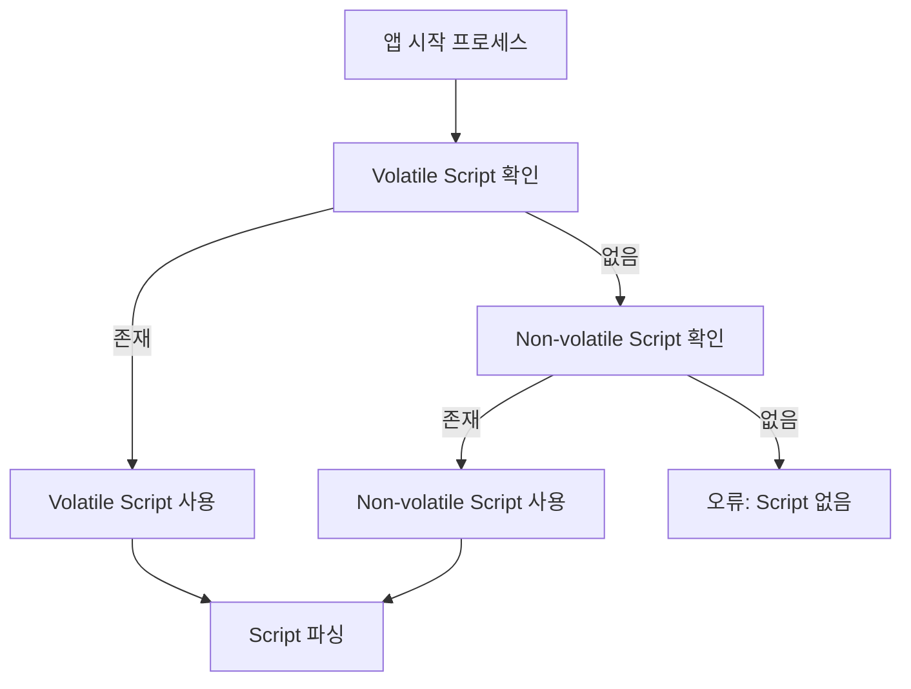
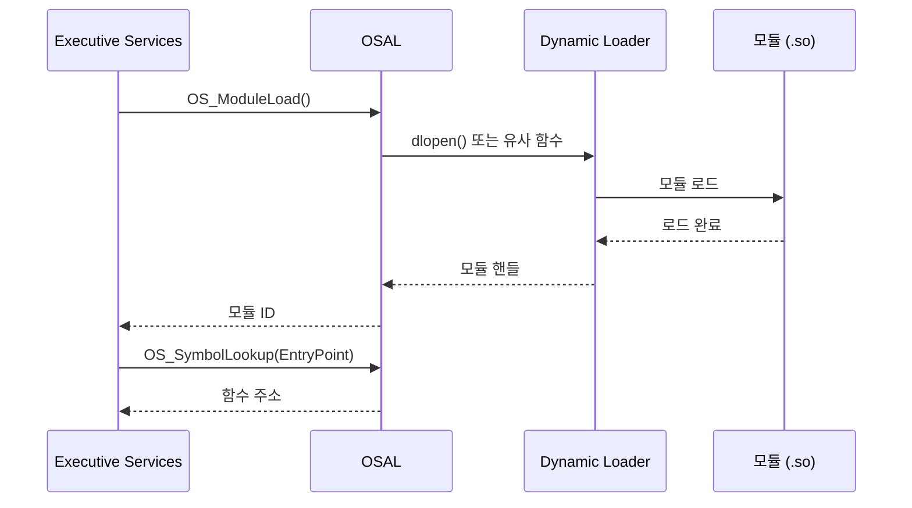
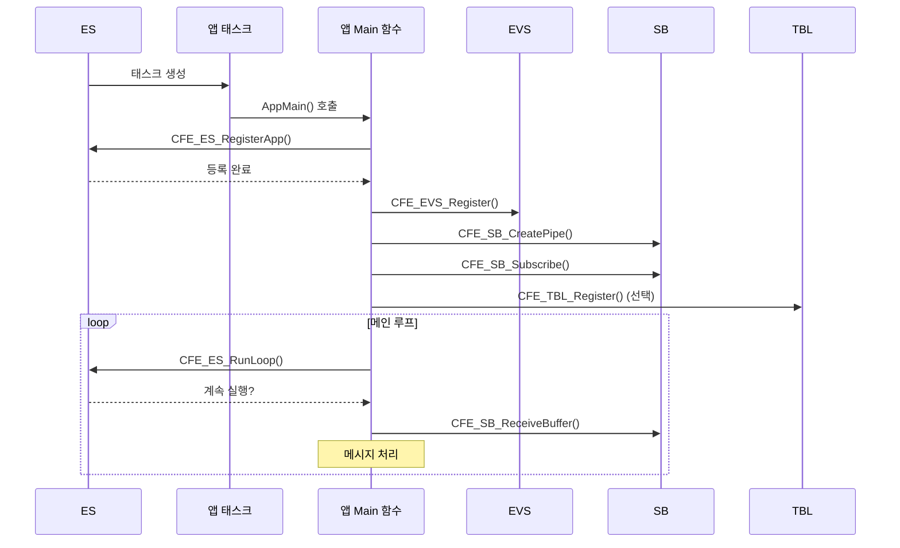
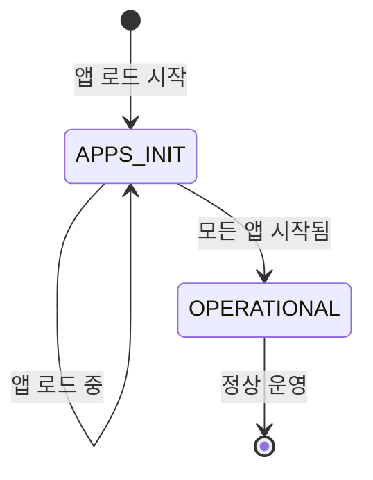
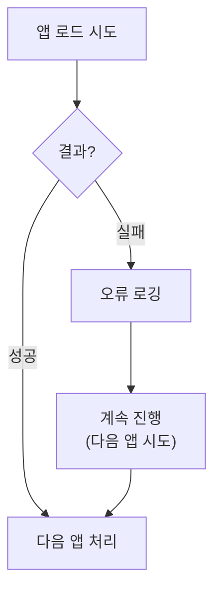

# Phase 2 ES-04: 시스템 부팅 시퀀스 (3) - 애플리케이션 시작

## 서론

cFE 핵심 서비스들이 초기화된 후, 시스템은 애플리케이션을 로드하고 시작할 준비가 된다. 이 과정은 startup script를 통해 제어되며, ES가 이 스크립트를 읽어 지정된 애플리케이션과 라이브러리를 순차적으로 로드한다.

본 문서에서는 startup script의 구조, 애플리케이션 로딩 메커니즘, 그리고 애플리케이션이 시작되는 과정을 상세히 살펴본다. 이 과정을 이해하면 cFS 시스템에 새로운 애플리케이션을 추가하거나 시작 순서를 조정하는 방법을 알 수 있다.

---

## 1. Startup Script 개요

### 1.1 Startup Script의 역할

Startup script는 cFE가 시작할 때 어떤 애플리케이션과 라이브러리를 로드할지 정의하는 텍스트 파일이다. ES는 이 스크립트를 파싱하여 지정된 모듈들을 순서대로 로드하고 시작한다.


### 1.2 Startup Script 위치

ES는 두 가지 위치에서 startup script를 찾는다:

| 우선순위 | 위치 | 설명 |
|:---:|:---|:---|
| 1 | Volatile (RAM) | `CFE_PLATFORM_ES_VOLATILE_STARTUP_FILE` |
| 2 | Non-volatile (Flash) | `CFE_PLATFORM_ES_NONVOL_STARTUP_FILE` |

```c
/* 기본 경로 설정 예시 */
#define CFE_PLATFORM_ES_VOLATILE_STARTUP_FILE   "/ram/cfe_es_startup.scr"
#define CFE_PLATFORM_ES_NONVOL_STARTUP_FILE     "/cf/cfe_es_startup.scr"
```

### 1.3 Script 검색 로직



---

## 2. Startup Script 형식

### 2.1 기본 구문

Startup script의 각 라인은 다음 형식을 따른다:

```
CFE_LIB, /cf/lib_name.so, LIB_Init, LIB_NAME, 0, 0, 0x0, 0;
CFE_APP, /cf/app_name.so, APP_Main, APP_NAME, priority, stack_size, 0x0, 0;
```

### 2.2 필드 설명

| 필드 | 설명 | 예시 값 |
|:---|:---|:---|
| **Entry Type** | 항목 유형 | `CFE_LIB`, `CFE_APP` |
| **Object Path** | 공유 객체 파일 경로 | `/cf/sample_app.so` |
| **Entry Point** | 진입점 함수 이름 | `SAMPLE_APP_Main` |
| **Name** | cFE 등록 이름 | `SAMPLE_APP` |
| **Priority** | 태스크 우선순위 | `50` |
| **Stack Size** | 스택 크기 (bytes) | `16384` |
| **Load Address** | 로드 주소 (보통 0) | `0x0` |
| **Exception Action** | 예외 발생 시 동작 | `0` |

### 2.3 실제 Startup Script 예시

```text
!
! Startup Script for cFS Training Mission
! 
! Object Type | File Path               | Entry Point        | Name      | Pri | Stack | Addr | Exc
!

CFE_LIB,  /cf/cfs_lib.so,         CFS_LibInit,        CFS_LIB,     0,     0,  0x0, 0;
CFE_LIB,  /cf/sample_lib.so,      SAMPLE_LIB_Init,    SAMPLE_LIB,  0,     0,  0x0, 0;

CFE_APP,  /cf/sch_lab.so,         SCH_LAB_AppMain,    SCH_LAB,    80, 16384, 0x0, 0;
CFE_APP,  /cf/ci_lab.so,          CI_LAB_AppMain,     CI_LAB,     60, 16384, 0x0, 0;
CFE_APP,  /cf/to_lab.so,          TO_LAB_AppMain,     TO_LAB,     70, 16384, 0x0, 0;
CFE_APP,  /cf/sample_app.so,      SAMPLE_APP_Main,    SAMPLE_APP, 50, 16384, 0x0, 0;

!
! End of Script
!
```

### 2.4 주석 규칙

- `!`로 시작하는 라인은 주석으로 무시된다
- 빈 라인도 무시된다
- 각 항목은 세미콜론(`;`)으로 끝나야 한다

---

## 3. 애플리케이션 로드 프로세스

### 3.1 CFE_ES_StartApplications 함수

ES는 `CFE_ES_StartApplications()` 함수를 통해 startup script를 처리한다:

```c
void CFE_ES_StartApplications(uint32 ResetType, const char *StartFilePath)
{
    FILE *FilePtr;
    char  Line[CFE_ES_STARTUP_SCRIPT_MAX_LINE];
    
    /*
    ** Volatile script 먼저 시도
    */
    FilePtr = fopen(CFE_PLATFORM_ES_VOLATILE_STARTUP_FILE, "r");
    
    if (FilePtr == NULL)
    {
        /*
        ** Non-volatile script 시도
        */
        FilePtr = fopen(CFE_PLATFORM_ES_NONVOL_STARTUP_FILE, "r");
    }
    
    if (FilePtr != NULL)
    {
        /*
        ** Script의 각 라인 처리
        */
        while (fgets(Line, sizeof(Line), FilePtr) != NULL)
        {
            CFE_ES_ParseScriptLine(Line);
        }
        
        fclose(FilePtr);
    }
    else
    {
        CFE_ES_WriteToSysLog("ES Startup: Cannot open startup script\n");
    }
}
```

### 3.2 라인 파싱

각 라인은 파싱되어 개별 필드로 분리된다:

```c
int32 CFE_ES_ParseScriptLine(const char *Line)
{
    CFE_ES_StartupRecord_t Record;
    int NumFields;
    
    /*
    ** 주석 또는 빈 라인 건너뛰기
    */
    if (Line[0] == '!' || Line[0] == '\n' || Line[0] == '\r')
    {
        return CFE_SUCCESS;
    }
    
    /*
    ** 필드 파싱
    */
    NumFields = sscanf(Line, "%s %s %s %s %u %u %x %u",
                       Record.EntryType,
                       Record.ObjectPath,
                       Record.EntryPoint,
                       Record.AppName,
                       &Record.Priority,
                       &Record.StackSize,
                       &Record.LoadAddress,
                       &Record.ExceptionAction);
    
    if (NumFields >= 4)
    {
        return CFE_ES_LoadEntry(&Record);
    }
    
    return CFE_ES_ERR_SCRIPT_PARSE;
}
```

### 3.3 모듈 로드



---

## 4. 라이브러리 vs 애플리케이션 로드

### 4.1 라이브러리 로드 (CFE_LIB)

라이브러리는 먼저 로드되며, 초기화 함수가 호출된 후 즉시 반환된다:

```c
int32 CFE_ES_LoadLibrary(const char *Path, 
                         const char *EntryPoint,
                         const char *Name)
{
    osal_id_t ModuleId;
    cpuaddr InitAddr;
    int32 Status;
    
    /*
    ** 공유 라이브러리 로드
    */
    Status = OS_ModuleLoad(&ModuleId, Name, Path, OS_MODULE_FLAG_GLOBAL_SYMBOLS);
    if (Status != OS_SUCCESS)
    {
        return CFE_ES_ERR_FILE;
    }
    
    /*
    ** 초기화 함수 주소 찾기
    */
    Status = OS_SymbolLookup(&InitAddr, EntryPoint);
    if (Status != OS_SUCCESS)
    {
        OS_ModuleUnload(ModuleId);
        return CFE_ES_ERR_SYMBOL;
    }
    
    /*
    ** 초기화 함수 호출
    */
    typedef int32 (*LibInitFunc)(void);
    LibInitFunc InitFunc = (LibInitFunc)InitAddr;
    
    Status = InitFunc();  /* 즉시 반환됨 */
    
    /*
    ** 라이브러리 테이블에 등록
    */
    CFE_ES_AddLibRecord(Name, ModuleId);
    
    return Status;
}
```

### 4.2 애플리케이션 로드 (CFE_APP)

애플리케이션은 새로운 태스크로 생성되어 병렬로 실행된다:

```c
int32 CFE_ES_LoadApplication(const char *Path,
                              const char *EntryPoint,
                              const char *Name,
                              uint32 Priority,
                              uint32 StackSize,
                              uint32 ExceptionAction)
{
    osal_id_t ModuleId;
    cpuaddr EntryAddr;
    CFE_ES_AppRecord_t *AppRecord;
    int32 Status;
    
    /*
    ** 공유 라이브러리 로드
    */
    Status = OS_ModuleLoad(&ModuleId, Name, Path, OS_MODULE_FLAG_LOCAL_SYMBOLS);
    if (Status != OS_SUCCESS)
    {
        return CFE_ES_ERR_FILE;
    }
    
    /*
    ** 진입점 함수 주소 찾기
    */
    Status = OS_SymbolLookup(&EntryAddr, EntryPoint);
    if (Status != OS_SUCCESS)
    {
        OS_ModuleUnload(ModuleId);
        return CFE_ES_ERR_SYMBOL;
    }
    
    /*
    ** 앱 테이블에 슬롯 할당
    */
    AppRecord = CFE_ES_AllocateAppSlot(Name);
    if (AppRecord == NULL)
    {
        OS_ModuleUnload(ModuleId);
        return CFE_ES_ERR_APP_TABLE_FULL;
    }
    
    /*
    ** 앱 정보 설정
    */
    AppRecord->ModuleId = ModuleId;
    AppRecord->EntryPoint = (CFE_ES_TaskEntryFuncPtr_t)EntryAddr;
    AppRecord->Priority = Priority;
    AppRecord->StackSize = StackSize;
    AppRecord->ExceptionAction = ExceptionAction;
    
    /*
    ** 메인 태스크 생성
    */
    Status = CFE_ES_CreateMainTask(AppRecord);
    
    return Status;
}
```

### 4.3 라이브러리와 애플리케이션의 차이


---

## 5. 애플리케이션 시작 상세

### 5.1 메인 태스크 생성

ES는 각 애플리케이션을 위한 메인 태스크를 생성한다:

```c
int32 CFE_ES_CreateMainTask(CFE_ES_AppRecord_t *AppRecord)
{
    osal_id_t TaskId;
    int32 Status;
    
    /*
    ** OSAL을 통해 태스크 생성
    */
    Status = OS_TaskCreate(
        &TaskId,                              /* 태스크 ID 반환 */
        AppRecord->Name,                      /* 태스크 이름 */
        (osal_task_entry)CFE_ES_AppEntryPoint, /* 래퍼 함수 */
        OSAL_TASK_STACK_ALLOCATE,             /* 스택 자동 할당 */
        AppRecord->StackSize,                 /* 스택 크기 */
        AppRecord->Priority,                  /* 우선순위 */
        0                                     /* 플래그 */
    );
    
    if (Status == OS_SUCCESS)
    {
        AppRecord->TaskId = TaskId;
        AppRecord->State = CFE_ES_AppState_STARTING;
    }
    
    return Status;
}
```

### 5.2 앱 진입점 래퍼

ES는 래퍼 함수를 통해 앱을 시작한다:

```c
void CFE_ES_AppEntryPoint(void)
{
    CFE_ES_AppRecord_t *AppRecord;
    
    /*
    ** 현재 태스크의 앱 레코드 찾기
    */
    AppRecord = CFE_ES_GetCurrentAppRecord();
    
    if (AppRecord != NULL)
    {
        /*
        ** 실제 앱 Main 함수 호출
        */
        AppRecord->EntryPoint();
        
        /*
        ** Main 함수가 반환하면 앱 종료
        */
        CFE_ES_ExitApp(CFE_ES_RunStatus_APP_EXIT);
    }
}
```

### 5.3 앱 초기화 흐름

앱이 시작되면 다음 순서로 초기화된다:



---

## 6. 시작 순서와 동기화

### 6.1 로드 순서의 중요성

Startup script에서의 순서가 로드 순서를 결정한다:

```text
! 라이브러리가 먼저 로드되어야 앱이 사용할 수 있음
CFE_LIB,  /cf/cfs_lib.so,    CFS_LibInit,    CFS_LIB,     0, 0, 0x0, 0;

! 스케줄러가 먼저 시작되어야 다른 앱들을 wakeup 할 수 있음
CFE_APP,  /cf/sch_lab.so,    SCH_LAB_Main,   SCH_LAB,    80, 16384, 0x0, 0;

! CI/TO가 시작되어야 지상 통신 가능
CFE_APP,  /cf/ci_lab.so,     CI_LAB_Main,    CI_LAB,     60, 16384, 0x0, 0;
CFE_APP,  /cf/to_lab.so,     TO_LAB_Main,    TO_LAB,     70, 16384, 0x0, 0;

! 미션 앱들은 마지막에 시작
CFE_APP,  /cf/sample_app.so, SAMPLE_Main,    SAMPLE_APP, 50, 16384, 0x0, 0;
```

### 6.2 시스템 상태 전이

모든 앱이 로드되면 시스템 상태가 변경된다:



```c
/* 모든 앱 로드 후 */
CFE_ES_Global.SystemState = CFE_ES_SystemState_OPERATIONAL;

CFE_ES_WriteToSysLog("ES Startup: System operational\n");
```

### 6.3 앱 간 동기화

앱들이 서로 의존하는 경우, 초기화 순서에 주의해야 한다:

```c
/* 앱 초기화에서 다른 앱 대기 예시 */
CFE_Status_t MY_APP_Init(void)
{
    int32 TimeoutCounter = 0;
    CFE_ES_AppId_t RequiredAppId;
    CFE_ES_AppInfo_t AppInfo;
    
    /*
    ** 필요한 다른 앱이 시작될 때까지 대기
    */
    while (TimeoutCounter < 100)  /* 최대 10초 대기 */
    {
        if (CFE_ES_GetAppIDByName(&RequiredAppId, "REQUIRED_APP") == CFE_SUCCESS)
        {
            CFE_ES_GetAppInfo(&AppInfo, RequiredAppId);
            if (AppInfo.ExecutionCounter > 0)
            {
                /* 필요한 앱이 실행 중 */
                break;
            }
        }
        
        OS_TaskDelay(100);  /* 100ms 대기 */
        TimeoutCounter++;
    }
    
    /* 나머지 초기화 계속... */
    return CFE_SUCCESS;
}
```

---

## 7. 동적 앱 시작/중지

### 7.1 런타임 앱 시작

ES는 지상 명령을 통해 런타임에 앱을 시작할 수 있다:

```c
/* ES START_APP 명령 처리 */
void CFE_ES_StartAppCmd(const CFE_ES_StartApp_t *Cmd)
{
    int32 Status;
    
    Status = CFE_ES_LoadApplication(
        Cmd->AppFileName,        /* 파일 경로 */
        Cmd->AppEntryPoint,      /* 진입점 */
        Cmd->Application,        /* 앱 이름 */
        Cmd->Priority,           /* 우선순위 */
        Cmd->StackSize,          /* 스택 크기 */
        Cmd->ExceptionAction     /* 예외 동작 */
    );
    
    if (Status == CFE_SUCCESS)
    {
        CFE_EVS_SendEvent(CFE_ES_START_INF_EID,
                          CFE_EVS_EventType_INFORMATION,
                          "Started %s", Cmd->Application);
    }
}
```

### 7.2 런타임 앱 중지

```c
/* ES STOP_APP 명령 처리 */
void CFE_ES_StopAppCmd(const CFE_ES_StopApp_t *Cmd)
{
    CFE_ES_AppId_t AppId;
    int32 Status;
    
    /*
    ** 앱 ID 찾기
    */
    Status = CFE_ES_GetAppIDByName(&AppId, Cmd->Application);
    
    if (Status == CFE_SUCCESS)
    {
        /*
        ** 앱 삭제 요청
        */
        Status = CFE_ES_DeleteApp(AppId);
        
        if (Status == CFE_SUCCESS)
        {
            CFE_EVS_SendEvent(CFE_ES_STOP_INF_EID,
                              CFE_EVS_EventType_INFORMATION,
                              "Stopped %s", Cmd->Application);
        }
    }
}
```

---

## 8. 시작 오류 처리

### 8.1 로드 실패

```c
int32 CFE_ES_LoadEntry(CFE_ES_StartupRecord_t *Record)
{
    int32 Status;
    
    if (strcmp(Record->EntryType, "CFE_LIB") == 0)
    {
        Status = CFE_ES_LoadLibrary(Record->ObjectPath,
                                    Record->EntryPoint,
                                    Record->AppName);
    }
    else if (strcmp(Record->EntryType, "CFE_APP") == 0)
    {
        Status = CFE_ES_LoadApplication(Record->ObjectPath,
                                        Record->EntryPoint,
                                        Record->AppName,
                                        Record->Priority,
                                        Record->StackSize,
                                        Record->ExceptionAction);
    }
    else
    {
        Status = CFE_ES_ERR_SCRIPT_PARSE;
    }
    
    if (Status != CFE_SUCCESS)
    {
        CFE_ES_WriteToSysLog("ES Startup: Failed to load %s, error=0x%X\n",
                             Record->AppName, (unsigned int)Status);
    }
    
    return Status;
}
```

### 8.2 시작 실패 정책

개별 앱 시작 실패가 전체 시스템에 영향을 주지 않도록 설계되어 있다:



---

## 9. 부팅 완료 확인

### 9.1 OPERATIONAL 상태

모든 startup script 처리가 완료되면:

```c
/* 모든 앱 시작 후 */
CFE_ES_Global.SystemState = CFE_ES_SystemState_OPERATIONAL;

/*
** 시작 완료 이벤트
*/
CFE_EVS_SendEvent(CFE_ES_STARTUP_INF_EID,
                  CFE_EVS_EventType_INFORMATION,
                  "ES Startup: %d Apps Loaded. System Operational.",
                  CFE_ES_Global.AppCount);
```

### 9.2 부팅 통계

ES Housekeeping에서 부팅 결과를 확인할 수 있다:

| 필드 | 설명 |
|:---|:---|
| `ResetType` | 리셋 유형 |
| `ResetSubtype` | 리셋 부유형 |
| `RegisteredApps` | 등록된 앱 수 |
| `RegisteredLibs` | 등록된 라이브러리 수 |
| `RegisteredTasks` | 등록된 태스크 수 |

---

## 결론

cFS의 애플리케이션 시작 과정은 startup script에 의해 제어된다. ES는 이 스크립트를 파싱하여 라이브러리를 먼저 로드하고, 그 다음 애플리케이션을 순서대로 로드한다. 각 애플리케이션은 자체 태스크로 생성되어 병렬로 실행된다.

이 메커니즘의 특징:
- **유연성**: 텍스트 파일 수정만으로 시작 구성 변경 가능
- **순서 제어**: 로드 순서를 명시적으로 제어 가능
- **동적 제어**: 런타임에도 앱 시작/중지 가능
- **오류 허용**: 개별 앱 실패가 전체 시스템에 영향 없음

다음 문서에서는 ES의 애플리케이션 생명주기 관리 기능을 상세히 살펴볼 것이다.

---

## 참고 문헌

1. NASA, "cFE User's Guide"
2. NASA, "cFE Application Developer's Guide"
3. NASA cFE GitHub, cfe/modules/es/fsw/src/cfe_es_apps.c

---

[이전 문서: Phase 2 ES-03: 시스템 부팅 시퀀스 (2) - cFE 초기화](./Phase2_ES_03_시스템_부팅_시퀀스_2_cFE_초기화.md)

[다음 문서: Phase 2 ES-05: 애플리케이션 생명주기 관리](./Phase2_ES_05_애플리케이션_생명주기_관리.md)
