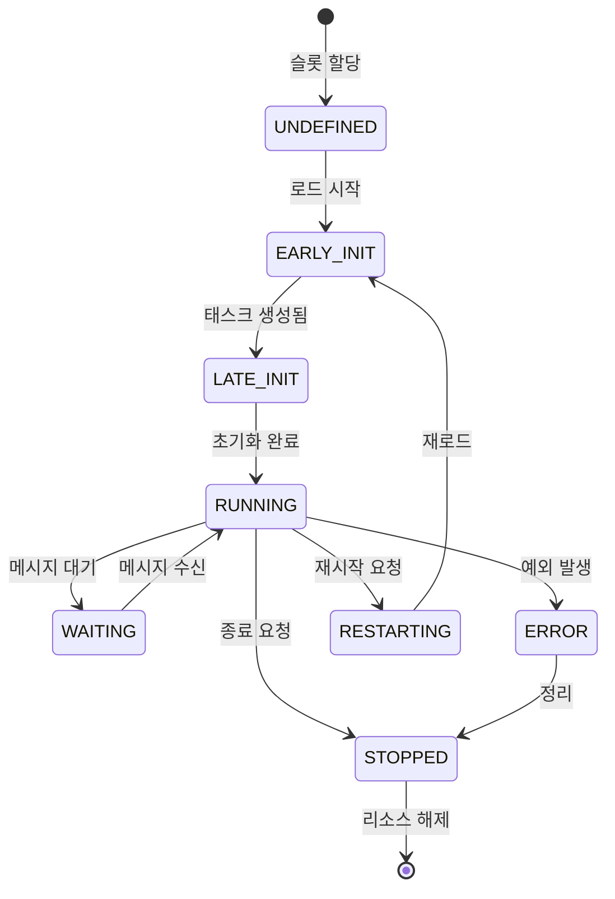
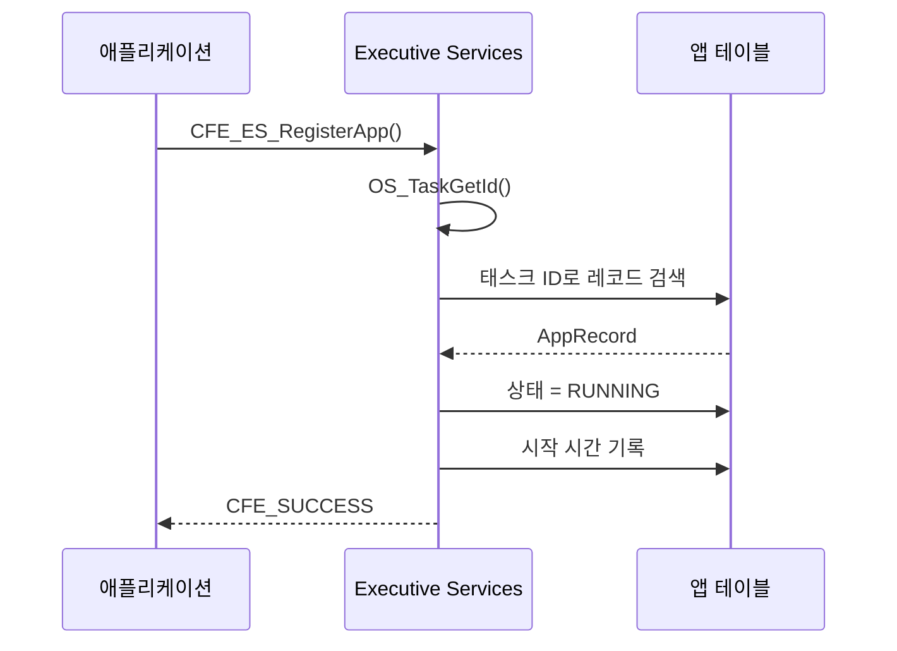
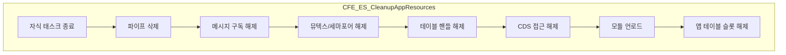
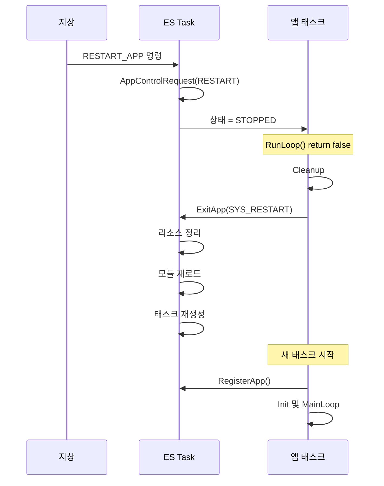

# Phase 2 ES-05: 애플리케이션 생명주기 관리

## 서론

Executive Services(ES)의 핵심 기능 중 하나는 cFS 애플리케이션의 전체 생명주기를 관리하는 것이다. 애플리케이션이 로드되어 시작하는 순간부터, 실행 중 모니터링, 재시작, 그리고 최종 종료까지 ES가 관여한다.

본 문서에서는 ES가 제공하는 애플리케이션 생명주기 관리 기능을 상세히 살펴본다. 앱 등록, 상태 관리, 재시작/삭제 메커니즘, 그리고 관련 API 함수들을 분석한다.

---

## 1. 애플리케이션 생명주기 개요

### 1.1 생명주기 상태

cFS 애플리케이션은 다음과 같은 상태를 거친다:



### 1.2 상태 정의

```c
typedef enum {
    CFE_ES_AppState_UNDEFINED,      /* 정의되지 않음 */
    CFE_ES_AppState_EARLY_INIT,     /* 초기 초기화 중 */
    CFE_ES_AppState_LATE_INIT,      /* 후기 초기화 중 */
    CFE_ES_AppState_RUNNING,        /* 정상 실행 중 */
    CFE_ES_AppState_WAITING,        /* 대기 중 */
    CFE_ES_AppState_STOPPED,        /* 중지됨 */
    CFE_ES_AppState_ERROR           /* 오류 상태 */
} CFE_ES_AppState_t;
```

---

## 2. 애플리케이션 등록

### 2.1 CFE_ES_RegisterApp 함수

모든 cFS 애플리케이션은 시작 시 ES에 자신을 등록해야 한다:

```c
/**
 * @brief 애플리케이션을 ES에 등록
 *
 * 이 함수는 앱 Main 함수 시작 시 호출되어야 한다.
 * ES가 앱을 추적하고 관리할 수 있게 해준다.
 *
 * @return CFE_SUCCESS 성공
 * @return CFE_ES_ERR_APP_REGISTER 등록 실패
 */
CFE_Status_t CFE_ES_RegisterApp(void)
{
    CFE_ES_AppRecord_t *AppRecord;
    osal_id_t TaskId;
    
    /*
    ** 현재 태스크 ID 획득
    */
    TaskId = OS_TaskGetId();
    
    /*
    ** 이 태스크에 해당하는 앱 레코드 찾기
    */
    AppRecord = CFE_ES_GetAppRecordByTaskId(TaskId);
    
    if (AppRecord == NULL)
    {
        return CFE_ES_ERR_APP_REGISTER;
    }
    
    /*
    ** 앱 상태를 RUNNING으로 설정
    */
    AppRecord->State = CFE_ES_AppState_RUNNING;
    AppRecord->StartTime = CFE_TIME_GetTime();
    
    CFE_ES_WriteToSysLog("ES: App %s registered\n", AppRecord->Name);
    
    return CFE_SUCCESS;
}
```

### 2.2 등록 과정



### 2.3 앱 정보 구조체

ES가 각 앱에 대해 유지하는 정보:

```c
typedef struct {
    char              Name[CFE_MISSION_MAX_API_LEN];
    CFE_ES_AppState_t State;
    CFE_ES_AppType_t  Type;           /* CORE 또는 EXTERNAL */
    
    osal_id_t         MainTaskId;
    osal_id_t         ModuleId;
    
    cpuaddr           EntryPoint;
    uint32            Priority;
    size_t            StackSize;
    uint32            ExceptionAction;
    
    CFE_TIME_SysTime_t StartTime;
    uint32            ExecutionCounter;
    
    /* 예외 정보 */
    uint32            LastExceptionResetType;
    
} CFE_ES_AppRecord_t;
```

---

## 3. 실행 루프 제어

### 3.1 CFE_ES_RunLoop 함수

앱의 메인 루프는 `CFE_ES_RunLoop()`를 통해 ES와 협력한다:

```c
/**
 * @brief 앱 실행 루프 제어
 *
 * 앱은 메인 루프에서 이 함수를 호출하여
 * ES에게 실행 상태를 알리고, 종료 요청을 확인한다.
 *
 * @param RunStatus 앱의 실행 상태 포인터
 * @return true 계속 실행
 * @return false 종료 필요
 */
bool CFE_ES_RunLoop(uint32 *RunStatus)
{
    CFE_ES_AppRecord_t *AppRecord;
    bool Result = true;
    
    /*
    ** 현재 앱 레코드 획득
    */
    AppRecord = CFE_ES_GetCurrentAppRecord();
    
    if (AppRecord != NULL)
    {
        /*
        ** 실행 카운터 증가
        */
        AppRecord->ExecutionCounter++;
        
        /*
        ** 앱 상태 확인
        */
        switch (AppRecord->State)
        {
            case CFE_ES_AppState_RUNNING:
                /* 정상 - 계속 실행 */
                Result = true;
                break;
                
            case CFE_ES_AppState_STOPPED:
                /* 종료 요청됨 */
                *RunStatus = CFE_ES_RunStatus_APP_EXIT;
                Result = false;
                break;
                
            default:
                /* 비정상 상태 */
                *RunStatus = CFE_ES_RunStatus_APP_ERROR;
                Result = false;
                break;
        }
    }
    
    return Result;
}
```

### 3.2 RunStatus 값

```c
typedef enum {
    CFE_ES_RunStatus_UNDEFINED,     /* 정의되지 않음 */
    CFE_ES_RunStatus_APP_RUN,       /* 정상 실행 */
    CFE_ES_RunStatus_APP_EXIT,      /* 정상 종료 */
    CFE_ES_RunStatus_APP_ERROR,     /* 오류로 종료 */
    CFE_ES_RunStatus_SYS_EXCEPTION, /* 시스템 예외 */
    CFE_ES_RunStatus_SYS_RESTART,   /* 시스템 재시작 */
    CFE_ES_RunStatus_SYS_RELOAD,    /* 시스템 재로드 */
    CFE_ES_RunStatus_SYS_DELETE,    /* 시스템 삭제 */
    CFE_ES_RunStatus_CORE_APP_INIT_ERROR, /* 코어 앱 초기화 오류 */
    CFE_ES_RunStatus_CORE_APP_RUNTIME_ERROR /* 코어 앱 런타임 오류 */
} CFE_ES_RunStatus_t;
```

### 3.3 표준 메인 루프 패턴

```c
void MY_APP_Main(void)
{
    CFE_Status_t Status;
    uint32 RunStatus = CFE_ES_RunStatus_APP_RUN;
    CFE_SB_Buffer_t *BufPtr;
    
    /*
    ** ES에 앱 등록
    */
    CFE_ES_RegisterApp();
    
    /*
    ** 앱 초기화
    */
    Status = MY_APP_Init();
    if (Status != CFE_SUCCESS)
    {
        RunStatus = CFE_ES_RunStatus_APP_ERROR;
    }
    
    /*
    ** 메인 루프
    */
    while (CFE_ES_RunLoop(&RunStatus) == true)
    {
        /*
        ** 메시지 대기 및 처리
        */
        Status = CFE_SB_ReceiveBuffer(&BufPtr, 
                                      MY_APP_Data.CmdPipe,
                                      CFE_SB_PEND_FOREVER);
        
        if (Status == CFE_SUCCESS)
        {
            MY_APP_ProcessMessage(BufPtr);
        }
    }
    
    /*
    ** 종료 처리
    */
    MY_APP_Cleanup();
    
    /*
    ** ES에 종료 알림
    */
    CFE_ES_ExitApp(RunStatus);
}
```

---

## 4. 애플리케이션 종료

### 4.1 CFE_ES_ExitApp 함수

앱이 종료될 때 호출하는 함수:

```c
/**
 * @brief 애플리케이션 종료
 *
 * 앱 Main 함수가 반환하기 전에 호출한다.
 * ES에게 종료 이유를 알리고 리소스를 정리하게 한다.
 *
 * @param ExitStatus 종료 상태 (RunStatus 값)
 */
void CFE_ES_ExitApp(uint32 ExitStatus)
{
    CFE_ES_AppRecord_t *AppRecord;
    
    AppRecord = CFE_ES_GetCurrentAppRecord();
    
    if (AppRecord != NULL)
    {
        AppRecord->State = CFE_ES_AppState_STOPPED;
        
        CFE_EVS_SendEvent(CFE_ES_EXIT_APP_INF_EID,
                          CFE_EVS_EventType_INFORMATION,
                          "App %s exited with status %d",
                          AppRecord->Name,
                          (int)ExitStatus);
        
        /*
        ** 종료 상태에 따른 처리
        */
        switch (ExitStatus)
        {
            case CFE_ES_RunStatus_APP_EXIT:
                /* 정상 종료 */
                CFE_ES_CleanupAppResources(AppRecord);
                break;
                
            case CFE_ES_RunStatus_APP_ERROR:
                /* 오류 종료 - 로그 기록 */
                CFE_ES_WriteToSysLog("App %s exited with error\n", 
                                     AppRecord->Name);
                CFE_ES_CleanupAppResources(AppRecord);
                break;
                
            case CFE_ES_RunStatus_SYS_RESTART:
                /* 재시작 요청 */
                CFE_ES_QueueRestartRequest(AppRecord);
                break;
        }
    }
    
    /*
    ** 태스크 종료 (반환하지 않음)
    */
    OS_TaskExit();
}
```

### 4.2 리소스 정리

앱 종료 시 ES는 다음 리소스들을 정리한다:



---

## 5. 애플리케이션 재시작

### 5.1 CFE_ES_RestartApp 함수

외부에서 앱을 재시작하는 API:

```c
/**
 * @brief 애플리케이션 재시작
 *
 * 앱을 중지하고 다시 시작한다.
 * 앱 코드는 변경되지 않고 재로드된다.
 *
 * @param AppId 재시작할 앱의 ID
 * @return CFE_SUCCESS 재시작 요청 성공
 * @return CFE_ES_ERR_RESOURCEID_NOT_VALID 잘못된 앱 ID
 */
CFE_Status_t CFE_ES_RestartApp(CFE_ES_AppId_t AppId)
{
    CFE_ES_AppRecord_t *AppRecord;
    int32 Status;
    
    /*
    ** 앱 레코드 획득
    */
    AppRecord = CFE_ES_LocateAppRecordByID(AppId);
    
    if (AppRecord == NULL)
    {
        return CFE_ES_ERR_RESOURCEID_NOT_VALID;
    }
    
    /*
    ** 코어 앱은 재시작 불가
    */
    if (AppRecord->Type == CFE_ES_AppType_CORE)
    {
        return CFE_ES_ERR_OPERATION_NOT_SUPPORTED;
    }
    
    /*
    ** 재시작 요청 큐에 추가
    */
    Status = CFE_ES_AppControlRequest(AppRecord, 
                                      CFE_ES_RunStatus_SYS_RESTART);
    
    return Status;
}
```

### 5.2 재시작 프로세스



### 5.3 CFE_ES_ReloadApp 함수

다른 파일에서 앱을 재로드:

```c
/**
 * @brief 다른 파일로 애플리케이션 재로드
 *
 * 앱을 중지하고 지정된 파일에서 새로 로드한다.
 * 소프트웨어 업데이트에 사용된다.
 *
 * @param AppId 재로드할 앱의 ID
 * @param AppFileName 새 앱 파일 경로
 * @return CFE_SUCCESS 재로드 요청 성공
 */
CFE_Status_t CFE_ES_ReloadApp(CFE_ES_AppId_t AppId, 
                               const char *AppFileName)
{
    CFE_ES_AppRecord_t *AppRecord;
    
    AppRecord = CFE_ES_LocateAppRecordByID(AppId);
    
    if (AppRecord == NULL)
    {
        return CFE_ES_ERR_RESOURCEID_NOT_VALID;
    }
    
    /*
    ** 새 파일 경로 저장
    */
    strncpy(AppRecord->NewFileName, AppFileName, 
            sizeof(AppRecord->NewFileName));
    
    /*
    ** 재로드 요청
    */
    return CFE_ES_AppControlRequest(AppRecord, 
                                    CFE_ES_RunStatus_SYS_RELOAD);
}
```

---

## 6. 애플리케이션 삭제

### 6.1 CFE_ES_DeleteApp 함수

앱을 완전히 제거:

```c
/**
 * @brief 애플리케이션 삭제
 *
 * 앱을 중지하고 시스템에서 완전히 제거한다.
 *
 * @param AppId 삭제할 앱의 ID
 * @return CFE_SUCCESS 삭제 요청 성공
 */
CFE_Status_t CFE_ES_DeleteApp(CFE_ES_AppId_t AppId)
{
    CFE_ES_AppRecord_t *AppRecord;
    
    AppRecord = CFE_ES_LocateAppRecordByID(AppId);
    
    if (AppRecord == NULL)
    {
        return CFE_ES_ERR_RESOURCEID_NOT_VALID;
    }
    
    if (AppRecord->Type == CFE_ES_AppType_CORE)
    {
        return CFE_ES_ERR_OPERATION_NOT_SUPPORTED;
    }
    
    return CFE_ES_AppControlRequest(AppRecord, 
                                    CFE_ES_RunStatus_SYS_DELETE);
}
```

### 6.2 삭제 vs 재시작

| 동작 | 결과 |
|:---|:---|
| **삭제 (Delete)** | 앱이 완전히 제거됨, 테이블 슬롯 해제 |
| **재시작 (Restart)** | 앱이 같은 파일에서 다시 시작 |
| **재로드 (Reload)** | 앱이 다른 파일에서 다시 시작 |

---

## 7. 앱 정보 조회

### 7.1 앱 ID 조회

```c
/* 현재 앱의 ID 획득 */
CFE_Status_t CFE_ES_GetAppID(CFE_ES_AppId_t *AppIdPtr)
{
    CFE_ES_AppRecord_t *AppRecord;
    
    AppRecord = CFE_ES_GetCurrentAppRecord();
    
    if (AppRecord != NULL)
    {
        *AppIdPtr = CFE_ES_AppRecordGetID(AppRecord);
        return CFE_SUCCESS;
    }
    
    return CFE_ES_ERR_APP_NOT_RUNNING;
}

/* 이름으로 앱 ID 조회 */
CFE_Status_t CFE_ES_GetAppIDByName(CFE_ES_AppId_t *AppIdPtr, 
                                    const char *AppName)
{
    CFE_ES_AppRecord_t *AppRecord;
    
    AppRecord = CFE_ES_LocateAppRecordByName(AppName);
    
    if (AppRecord != NULL)
    {
        *AppIdPtr = CFE_ES_AppRecordGetID(AppRecord);
        return CFE_SUCCESS;
    }
    
    return CFE_ES_ERR_NAME_NOT_FOUND;
}
```

### 7.2 앱 상세 정보

```c
/* 앱 정보 구조체 (외부 인터페이스용) */
typedef struct {
    CFE_ES_AppId_t  AppId;
    CFE_ES_AppType_t Type;
    char            Name[CFE_MISSION_MAX_API_LEN];
    char            EntryPoint[CFE_MISSION_MAX_API_LEN];
    char            FileName[CFE_MISSION_MAX_PATH_LEN];
    
    uint32          StackSize;
    uint32          Priority;
    
    osal_id_t       MainTaskId;
    char            MainTaskName[CFE_MISSION_MAX_API_LEN];
    
    uint32          ExecutionCounter;
    uint32          NumOfChildTasks;
    
    CFE_TIME_SysTime_t StartTime;
    
} CFE_ES_AppInfo_t;

/* 앱 정보 조회 */
CFE_Status_t CFE_ES_GetAppInfo(CFE_ES_AppInfo_t *AppInfo, 
                                CFE_ES_AppId_t AppId);
```

### 7.3 사용 예시

```c
void QueryAppInfo(const char *AppName)
{
    CFE_ES_AppId_t AppId;
    CFE_ES_AppInfo_t AppInfo;
    
    if (CFE_ES_GetAppIDByName(&AppId, AppName) == CFE_SUCCESS)
    {
        if (CFE_ES_GetAppInfo(&AppInfo, AppId) == CFE_SUCCESS)
        {
            CFE_EVS_SendEvent(MY_APP_INFO_EID,
                              CFE_EVS_EventType_INFORMATION,
                              "%s: ExecCnt=%u, Priority=%u",
                              AppInfo.Name,
                              (unsigned int)AppInfo.ExecutionCounter,
                              (unsigned int)AppInfo.Priority);
        }
    }
}
```

---

## 8. 앱 상태 모니터링

### 8.1 ES의 앱 모니터링

ES 태스크는 주기적으로 등록된 앱들의 상태를 모니터링한다:

```c
void CFE_ES_TaskMain(void)
{
    while (CFE_ES_Global.SystemState != CFE_ES_SystemState_SHUTDOWN)
    {
        /* 메시지 처리... */
        
        /*
        ** 앱 상태 모니터링
        */
        CFE_ES_ScanAppTable();
        
        /*
        ** 워치독 서비스
        */
        CFE_PSP_WatchdogService();
    }
}

void CFE_ES_ScanAppTable(void)
{
    CFE_ES_AppRecord_t *AppRecord;
    int i;
    
    for (i = 0; i < CFE_PLATFORM_ES_MAX_APPLICATIONS; i++)
    {
        AppRecord = &CFE_ES_Global.AppTable[i];
        
        if (AppRecord->State != CFE_ES_AppState_UNDEFINED)
        {
            /*
            ** 펜딩된 제어 요청 처리
            */
            if (AppRecord->ControlRequest != CFE_ES_RunStatus_APP_RUN)
            {
                CFE_ES_ProcessControlRequest(AppRecord);
            }
        }
    }
}
```

### 8.2 Housekeeping 데이터

ES Housekeeping 텔레메트리에 포함되는 앱 관련 정보:

```c
typedef struct {
    /* 앱 통계 */
    uint32 RegisteredExternalApps;
    uint32 RegisteredCoreApps;
    uint32 RegisteredTasks;
    uint32 RegisteredLibs;
    
    /* 리셋 정보 */
    uint32 ResetType;
    uint32 ResetSubtype;
    uint32 BootSource;
    uint32 ProcessorResets;
    
    /* 시스템 상태 */
    uint32 SysLogBytesUsed;
    uint32 SysLogSize;
    uint32 SysLogEntries;
    uint32 SysLogMode;
    
} CFE_ES_HousekeepingTlm_Payload_t;
```

---

## 9. 예외 처리

### 9.1 앱 예외 발생 시

앱에서 예외(Exception)가 발생하면 ES가 처리한다:

```c
void CFE_ES_ProcessException(osal_id_t TaskId, 
                              const char *ReasonString)
{
    CFE_ES_AppRecord_t *AppRecord;
    
    AppRecord = CFE_ES_GetAppRecordByTaskId(TaskId);
    
    if (AppRecord != NULL)
    {
        CFE_ES_WriteToSysLog("ES: App %s exception: %s\n",
                             AppRecord->Name, ReasonString);
        
        /*
        ** 예외 동작에 따른 처리
        */
        switch (AppRecord->ExceptionAction)
        {
            case CFE_ES_ExceptionAction_RESTART_APP:
                /* 앱만 재시작 */
                CFE_ES_AppControlRequest(AppRecord,
                                        CFE_ES_RunStatus_SYS_RESTART);
                break;
                
            case CFE_ES_ExceptionAction_PROC_RESTART:
                /* 전체 프로세서 리셋 */
                CFE_ES_ResetCFE(CFE_PSP_RST_TYPE_PROCESSOR);
                break;
        }
    }
}
```

### 9.2 예외 동작 설정

Startup script에서 설정:

```text
! ExceptionAction: 0 = 앱 재시작, 1 = 프로세서 리셋
CFE_APP, /cf/critical_app.so, CRIT_Main, CRIT_APP, 50, 16384, 0x0, 1;
CFE_APP, /cf/normal_app.so,   NORM_Main, NORM_APP, 50, 16384, 0x0, 0;
```

---

## 10. 정리: 생명주기 API 요약

| 함수 | 용도 | 호출자 |
|:---|:---|:---|
| `CFE_ES_RegisterApp()` | 앱 등록 | 앱 (시작 시) |
| `CFE_ES_RunLoop()` | 실행 루프 제어 | 앱 (메인 루프) |
| `CFE_ES_ExitApp()` | 앱 종료 | 앱 (종료 시) |
| `CFE_ES_RestartApp()` | 앱 재시작 | ES/지상 |
| `CFE_ES_ReloadApp()` | 앱 재로드 | ES/지상 |
| `CFE_ES_DeleteApp()` | 앱 삭제 | ES/지상 |
| `CFE_ES_GetAppID()` | 앱 ID 조회 | 앱/다른 앱 |
| `CFE_ES_GetAppInfo()` | 앱 정보 조회 | 앱/ES |

---

## 결론

ES의 애플리케이션 생명주기 관리 기능은 cFS 시스템의 안정성과 유연성을 보장한다. 앱이 등록, 실행, 종료되는 전체 과정이 ES에 의해 추적되고 관리되며, 문제 발생 시 적절한 복구 조치가 자동으로 수행된다.

이러한 관리 체계 덕분에:
- 개별 앱 오류가 전체 시스템에 영향을 최소화한다
- 런타임에 앱을 동적으로 시작/중지할 수 있다
- 예외 상황에서 자동 복구가 가능하다
- 지상에서 앱을 원격으로 관리할 수 있다

다음 문서에서는 ES의 태스크 관리 기능을 상세히 살펴볼 것이다.

---

## 참고 문헌

1. NASA, "cFE Application Developer's Guide"
2. NASA cFE GitHub, cfe/modules/es/fsw/src/cfe_es_apps.c
3. NASA, "ES API Reference"

---

[이전 문서: Phase 2 ES-04: 시스템 부팅 시퀀스 (3) - 애플리케이션 시작](./Phase2_ES_04_시스템_부팅_시퀀스_3_애플리케이션_시작.md)

[다음 문서: Phase 2 ES-06: 태스크 관리 메커니즘](./Phase2_ES_06_태스크_관리_메커니즘.md)
