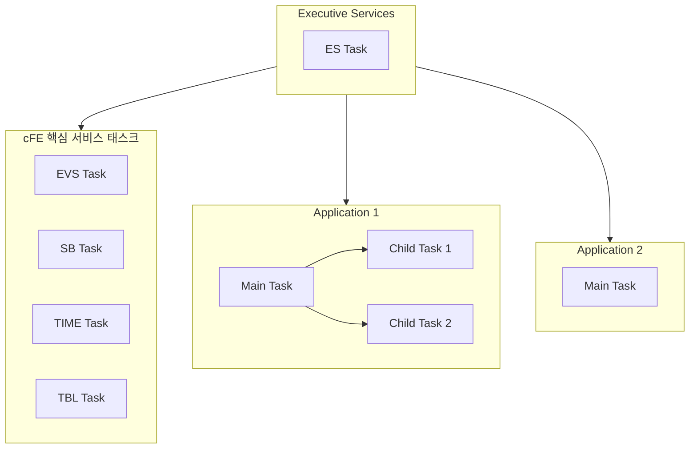
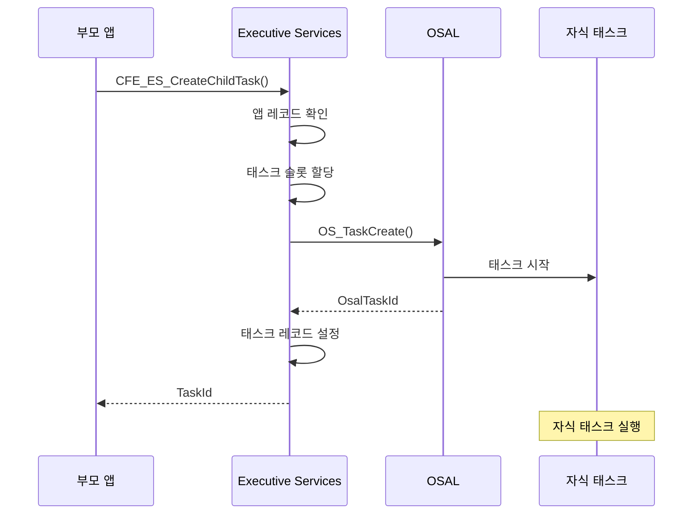
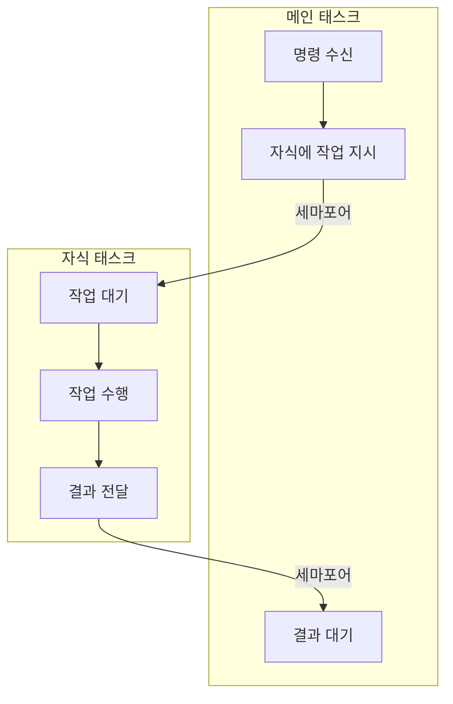
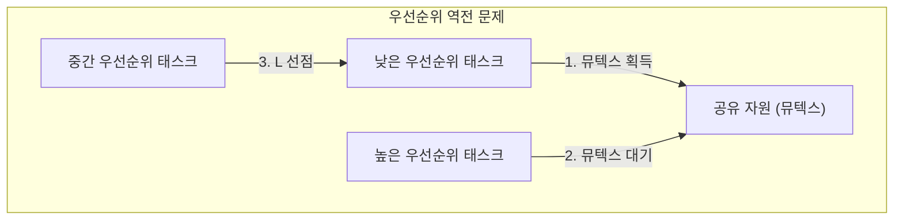
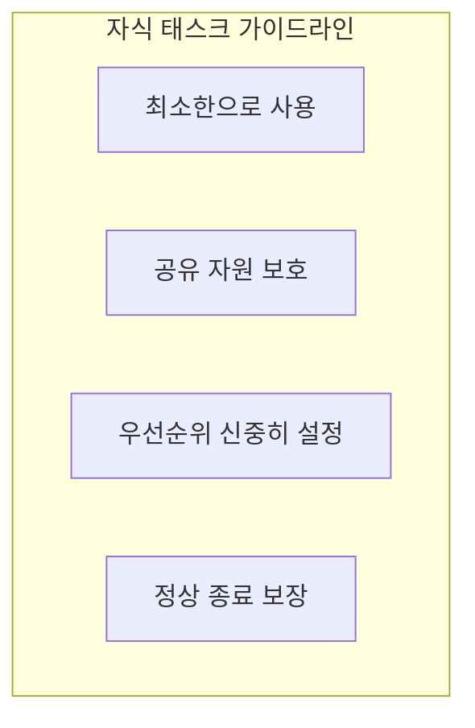

# Phase 2 ES-06: 태스크 관리 메커니즘

## 서론

cFS에서 모든 코드 실행은 태스크(Task) 단위로 이루어진다. 각 애플리케이션은 최소 하나의 메인 태스크를 가지며, 필요에 따라 추가적인 자식 태스크(Child Task)를 생성할 수 있다. Executive Services(ES)는 이러한 태스크들의 생성, 관리, 종료를 담당한다.

본 문서에서는 ES의 태스크 관리 메커니즘을 상세히 살펴본다. 메인 태스크와 자식 태스크의 차이, 자식 태스크 생성 API, 태스크 정보 조회 방법 등을 다룬다.

---

## 1. 태스크 구조 개요

### 1.1 cFS 태스크 계층

cFS에서의 태스크 구조:



### 1.2 메인 태스크 vs 자식 태스크

| 특성 | 메인 태스크 | 자식 태스크 |
|:---|:---|:---|
| **생성자** | ES (startup script) | 앱 (API 호출) |
| **개수** | 앱당 1개 | 앱당 0개 이상 |
| **종료 영향** | 앱 전체 종료 | 해당 태스크만 종료 |
| **관리** | ES가 직접 관리 | 부모 앱이 관리 |

### 1.3 태스크 테이블

ES는 모든 태스크 정보를 태스크 테이블에 저장한다:

```c
typedef struct {
    osal_id_t     TaskId;           /* OSAL 태스크 ID */
    CFE_ES_AppId_t ParentAppId;     /* 부모 앱 ID */
    char          TaskName[CFE_MISSION_MAX_API_LEN];
    
    cpuaddr       EntryPoint;       /* 진입점 함수 주소 */
    uint32        Priority;         /* 우선순위 */
    size_t        StackSize;        /* 스택 크기 */
    
    uint32        ExecutionCounter; /* 실행 카운터 */
    bool          IsMainTask;       /* 메인 태스크 여부 */
    
} CFE_ES_TaskRecord_t;

/* 태스크 테이블 */
CFE_ES_TaskRecord_t TaskTable[CFE_PLATFORM_ES_MAX_TASKS];
```

---

## 2. 자식 태스크 생성

### 2.1 CFE_ES_CreateChildTask 함수

자식 태스크를 생성하는 핵심 API:

```c
/**
 * @brief 자식 태스크 생성
 *
 * 현재 앱의 자식 태스크를 생성한다.
 * 자식 태스크는 부모 앱과 같은 주소 공간을 공유한다.
 *
 * @param TaskIdPtr    생성된 태스크 ID 반환
 * @param TaskName     태스크 이름 (고유해야 함)
 * @param FunctionPtr  태스크 진입점 함수
 * @param StackPtr     스택 포인터 (NULL이면 자동 할당)
 * @param StackSize    스택 크기 (bytes)
 * @param Priority     태스크 우선순위
 * @param Flags        생성 플래그
 *
 * @return CFE_SUCCESS 성공
 * @return CFE_ES_ERR_CHILD_TASK_CREATE 생성 실패
 */
CFE_Status_t CFE_ES_CreateChildTask(
    CFE_ES_TaskId_t *TaskIdPtr,
    const char *TaskName,
    CFE_ES_ChildTaskMainFuncPtr_t FunctionPtr,
    CFE_ES_StackPointer_t StackPtr,
    size_t StackSize,
    CFE_ES_TaskPriority_Atom_t Priority,
    uint32 Flags)
{
    CFE_ES_AppRecord_t *AppRecord;
    CFE_ES_TaskRecord_t *TaskRecord;
    osal_id_t OsalTaskId;
    int32 Status;
    
    /*
    ** 현재 앱 확인
    */
    AppRecord = CFE_ES_GetCurrentAppRecord();
    if (AppRecord == NULL)
    {
        return CFE_ES_ERR_APP_NOT_RUNNING;
    }
    
    /*
    ** 태스크 테이블 슬롯 할당
    */
    TaskRecord = CFE_ES_AllocateTaskSlot(TaskName);
    if (TaskRecord == NULL)
    {
        return CFE_ES_ERR_CHILD_TASK_CREATE;
    }
    
    /*
    ** OSAL을 통해 태스크 생성
    */
    Status = OS_TaskCreate(&OsalTaskId,
                           TaskName,
                           (osal_task_entry)FunctionPtr,
                           StackPtr,
                           StackSize,
                           Priority,
                           Flags);
    
    if (Status != OS_SUCCESS)
    {
        CFE_ES_FreeTaskSlot(TaskRecord);
        return CFE_ES_ERR_CHILD_TASK_CREATE;
    }
    
    /*
    ** 태스크 레코드 설정
    */
    TaskRecord->TaskId = OsalTaskId;
    TaskRecord->ParentAppId = CFE_ES_AppRecordGetID(AppRecord);
    TaskRecord->IsMainTask = false;
    TaskRecord->Priority = Priority;
    TaskRecord->StackSize = StackSize;
    strncpy(TaskRecord->TaskName, TaskName, sizeof(TaskRecord->TaskName));
    
    /*
    ** 부모 앱의 자식 태스크 수 증가
    */
    AppRecord->NumOfChildTasks++;
    
    /*
    ** 태스크 ID 반환
    */
    *TaskIdPtr = CFE_ES_TaskRecordGetID(TaskRecord);
    
    return CFE_SUCCESS;
}
```

### 2.2 자식 태스크 함수 형식

자식 태스크의 진입점 함수:

```c
/* 자식 태스크 함수 프로토타입 */
typedef void (*CFE_ES_ChildTaskMainFuncPtr_t)(void);

/* 자식 태스크 함수 예시 */
void MY_APP_ChildTask(void)
{
    /*
    ** 자식 태스크 초기화
    */
    CFE_EVS_SendEvent(MY_CHILD_INIT_EID,
                      CFE_EVS_EventType_INFORMATION,
                      "Child task started");
    
    /*
    ** 태스크 루프
    */
    while (MY_APP_Data.ChildTaskRunning)
    {
        /*
        ** 작업 수행
        */
        MY_APP_ProcessData();
        
        /*
        ** 주기적 대기
        */
        OS_TaskDelay(100);  /* 100ms */
    }
    
    /*
    ** 자식 태스크 종료
    */
    CFE_ES_ExitChildTask();
}
```

### 2.3 생성 과정



---

## 3. 자식 태스크 종료

### 3.1 CFE_ES_ExitChildTask 함수

자식 태스크가 스스로를 종료:

```c
/**
 * @brief 자식 태스크 종료
 *
 * 자식 태스크가 정상적으로 종료할 때 호출한다.
 * 이 함수는 반환하지 않는다.
 */
void CFE_ES_ExitChildTask(void)
{
    osal_id_t TaskId;
    CFE_ES_TaskRecord_t *TaskRecord;
    CFE_ES_AppRecord_t *AppRecord;
    
    /*
    ** 현재 태스크 ID 획득
    */
    TaskId = OS_TaskGetId();
    
    /*
    ** 태스크 레코드 찾기
    */
    TaskRecord = CFE_ES_GetTaskRecordByOsalId(TaskId);
    
    if (TaskRecord != NULL)
    {
        /*
        ** 부모 앱의 자식 태스크 수 감소
        */
        AppRecord = CFE_ES_LocateAppRecordByID(TaskRecord->ParentAppId);
        if (AppRecord != NULL)
        {
            AppRecord->NumOfChildTasks--;
        }
        
        /*
        ** 태스크 슬롯 해제
        */
        CFE_ES_FreeTaskSlot(TaskRecord);
    }
    
    /*
    ** OSAL 태스크 종료
    */
    OS_TaskExit();
}
```

### 3.2 CFE_ES_DeleteChildTask 함수

부모 앱이 자식 태스크를 강제 종료:

```c
/**
 * @brief 자식 태스크 삭제
 *
 * 부모 앱이 자식 태스크를 강제로 종료한다.
 * 
 * @warning 자원 누수 가능성이 있으므로 주의해서 사용
 *
 * @param TaskId 삭제할 태스크 ID
 * @return CFE_SUCCESS 성공
 */
CFE_Status_t CFE_ES_DeleteChildTask(CFE_ES_TaskId_t TaskId)
{
    CFE_ES_TaskRecord_t *TaskRecord;
    CFE_ES_AppRecord_t *ParentApp;
    CFE_ES_AppRecord_t *CurrentApp;
    int32 OsStatus;
    
    /*
    ** 태스크 레코드 찾기
    */
    TaskRecord = CFE_ES_LocateTaskRecordByID(TaskId);
    
    if (TaskRecord == NULL)
    {
        return CFE_ES_ERR_RESOURCEID_NOT_VALID;
    }
    
    /*
    ** 메인 태스크는 삭제 불가
    */
    if (TaskRecord->IsMainTask)
    {
        return CFE_ES_ERR_CHILD_TASK_DELETE_MAIN_TASK;
    }
    
    /*
    ** 현재 앱이 부모인지 확인
    */
    CurrentApp = CFE_ES_GetCurrentAppRecord();
    ParentApp = CFE_ES_LocateAppRecordByID(TaskRecord->ParentAppId);
    
    if (CurrentApp != ParentApp)
    {
        return CFE_ES_ERR_CHILD_TASK_DELETE;
    }
    
    /*
    ** OSAL 태스크 삭제
    */
    OsStatus = OS_TaskDelete(TaskRecord->TaskId);
    
    if (OsStatus == OS_SUCCESS)
    {
        ParentApp->NumOfChildTasks--;
        CFE_ES_FreeTaskSlot(TaskRecord);
        return CFE_SUCCESS;
    }
    
    return CFE_ES_ERR_CHILD_TASK_DELETE;
}
```

---

## 4. 태스크 정보 조회

### 4.1 CFE_ES_GetTaskID 함수

현재 태스크의 ID 조회:

```c
/**
 * @brief 현재 태스크 ID 획득
 *
 * @param TaskIdPtr 태스크 ID 반환
 * @return CFE_SUCCESS 성공
 */
CFE_Status_t CFE_ES_GetTaskID(CFE_ES_TaskId_t *TaskIdPtr)
{
    osal_id_t OsalTaskId;
    CFE_ES_TaskRecord_t *TaskRecord;
    
    OsalTaskId = OS_TaskGetId();
    
    TaskRecord = CFE_ES_GetTaskRecordByOsalId(OsalTaskId);
    
    if (TaskRecord != NULL)
    {
        *TaskIdPtr = CFE_ES_TaskRecordGetID(TaskRecord);
        return CFE_SUCCESS;
    }
    
    return CFE_ES_ERR_RESOURCEID_NOT_VALID;
}
```

### 4.2 CFE_ES_GetTaskInfo 함수

태스크 상세 정보 조회:

```c
/* 태스크 정보 구조체 */
typedef struct {
    CFE_ES_TaskId_t TaskId;
    CFE_ES_AppId_t  AppId;
    char            TaskName[CFE_MISSION_MAX_API_LEN];
    char            AppName[CFE_MISSION_MAX_API_LEN];
    
    uint32          Priority;
    uint32          StackSize;
    uint32          ExecutionCounter;
    
} CFE_ES_TaskInfo_t;

/**
 * @brief 태스크 정보 조회
 *
 * @param TaskInfo 태스크 정보 구조체
 * @param TaskId 조회할 태스크 ID
 * @return CFE_SUCCESS 성공
 */
CFE_Status_t CFE_ES_GetTaskInfo(CFE_ES_TaskInfo_t *TaskInfo,
                                 CFE_ES_TaskId_t TaskId)
{
    CFE_ES_TaskRecord_t *TaskRecord;
    CFE_ES_AppRecord_t *AppRecord;
    
    TaskRecord = CFE_ES_LocateTaskRecordByID(TaskId);
    
    if (TaskRecord == NULL)
    {
        return CFE_ES_ERR_RESOURCEID_NOT_VALID;
    }
    
    /*
    ** 정보 복사
    */
    TaskInfo->TaskId = TaskId;
    TaskInfo->AppId = TaskRecord->ParentAppId;
    TaskInfo->Priority = TaskRecord->Priority;
    TaskInfo->StackSize = TaskRecord->StackSize;
    TaskInfo->ExecutionCounter = TaskRecord->ExecutionCounter;
    
    strncpy(TaskInfo->TaskName, TaskRecord->TaskName,
            sizeof(TaskInfo->TaskName));
    
    /*
    ** 앱 이름 조회
    */
    AppRecord = CFE_ES_LocateAppRecordByID(TaskRecord->ParentAppId);
    if (AppRecord != NULL)
    {
        strncpy(TaskInfo->AppName, AppRecord->Name,
                sizeof(TaskInfo->AppName));
    }
    
    return CFE_SUCCESS;
}
```

---

## 5. 자식 태스크 사용 패턴

### 5.1 데이터 수집 태스크

주기적인 데이터 수집을 위한 자식 태스크:

```c
/* 앱 데이터 구조 */
typedef struct {
    bool DataTaskRunning;
    CFE_ES_TaskId_t DataTaskId;
    int16 SensorData[100];
} MY_APP_Data_t;

MY_APP_Data_t MY_APP_Data;

/* 메인 태스크에서 자식 생성 */
CFE_Status_t MY_APP_Init(void)
{
    CFE_Status_t Status;
    
    MY_APP_Data.DataTaskRunning = true;
    
    /*
    ** 데이터 수집 자식 태스크 생성
    */
    Status = CFE_ES_CreateChildTask(
        &MY_APP_Data.DataTaskId,
        "MY_APP_DATA",
        MY_APP_DataTask,
        NULL,                    /* 스택 자동 할당 */
        4096,                    /* 4KB 스택 */
        100,                     /* 우선순위 */
        0                        /* 플래그 */
    );
    
    return Status;
}

/* 데이터 수집 자식 태스크 */
void MY_APP_DataTask(void)
{
    int i = 0;
    
    while (MY_APP_Data.DataTaskRunning)
    {
        /*
        ** 센서 데이터 읽기
        */
        MY_APP_Data.SensorData[i] = ReadSensor();
        
        i = (i + 1) % 100;
        
        /*
        ** 10Hz로 샘플링
        */
        OS_TaskDelay(100);
    }
    
    CFE_ES_ExitChildTask();
}
```

### 5.2 통신 수신 태스크

비동기 통신을 위한 자식 태스크:

```c
void MY_APP_RecvTask(void)
{
    uint8 Buffer[256];
    int32 BytesRead;
    
    while (MY_APP_Data.RecvTaskRunning)
    {
        /*
        ** 블로킹 수신
        */
        BytesRead = HW_Receive(Buffer, sizeof(Buffer), 
                               OS_PEND);  /* 무한 대기 */
        
        if (BytesRead > 0)
        {
            /*
            ** 수신 데이터를 큐에 전달
            */
            OS_QueuePut(MY_APP_Data.RecvQueue, Buffer, 
                        BytesRead, OS_CHECK);
        }
    }
    
    CFE_ES_ExitChildTask();
}
```

### 5.3 태스크 간 동기화

부모와 자식 간의 동기화:



```c
/* 동기화 예시 */
typedef struct {
    osal_id_t WorkSem;     /* 작업 시작 신호 */
    osal_id_t DoneSem;     /* 작업 완료 신호 */
    int32     WorkData;
    int32     ResultData;
} MY_APP_TaskSync_t;

/* 메인 태스크 */
void ProcessCommand(int32 Data)
{
    MY_APP_Data.Sync.WorkData = Data;
    
    /* 자식에게 작업 신호 */
    OS_BinSemGive(MY_APP_Data.Sync.WorkSem);
    
    /* 결과 대기 */
    OS_BinSemTake(MY_APP_Data.Sync.DoneSem, OS_PEND);
    
    /* 결과 사용 */
    UseResult(MY_APP_Data.Sync.ResultData);
}

/* 자식 태스크 */
void MY_APP_WorkerTask(void)
{
    while (MY_APP_Data.WorkerRunning)
    {
        /* 작업 신호 대기 */
        OS_BinSemTake(MY_APP_Data.Sync.WorkSem, OS_PEND);
        
        /* 작업 수행 */
        MY_APP_Data.Sync.ResultData = 
            DoWork(MY_APP_Data.Sync.WorkData);
        
        /* 완료 신호 */
        OS_BinSemGive(MY_APP_Data.Sync.DoneSem);
    }
    
    CFE_ES_ExitChildTask();
}
```

---

## 6. 태스크 우선순위 관리

### 6.1 우선순위 설정

cFS에서 태스크 우선순위 (일반적으로 낮은 값 = 높은 우선순위):

| 범위 | 용도 |
|:---|:---|
| 1-50 | 시스템 크리티컬 |
| 50-80 | 핵심 서비스 |
| 80-150 | 일반 애플리케이션 |
| 150-200 | 백그라운드 작업 |

### 6.2 우선순위 역전 방지

뮤텍스 사용 시 우선순위 역전에 주의:



해결책: 우선순위 상속(Priority Inheritance)이 지원되는 OSAL 뮤텍스 사용

```c
/* 뮤텍스 생성 시 우선순위 상속 옵션 */
OS_MutSemCreate(&MutexId, "MyMutex", 0);
```

---

## 7. 태스크 관련 명령 및 텔레메트리

### 7.1 ES App/Task 조회 명령

ES는 앱과 태스크 정보를 조회하는 명령을 제공:

| 명령 | 설명 |
|:---|:---|
| `QUERY_ALL_APPS` | 모든 앱 정보 덤프 |
| `QUERY_ALL_TASKS` | 모든 태스크 정보 덤프 |
| `QUERY_ONE_APP` | 특정 앱 정보 조회 |

### 7.2 태스크 관련 텔레메트리

ES Housekeeping에 포함되는 태스크 정보:

```c
typedef struct {
    uint32 RegisteredTasks;
    uint32 RegisteredExternalApps;
    uint32 RegisteredCoreApps;
    /* ... */
} CFE_ES_HousekeepingTlm_Payload_t;
```

---

## 8. 태스크 관리 모범 사례

### 8.1 자식 태스크 사용 시기

자식 태스크가 적합한 경우:
- 블로킹 I/O 처리
- 높은 주기 데이터 수집
- CPU 집약적 백그라운드 작업
- 비동기 통신

### 8.2 자식 태스크 사용 주의사항



1. **최소한 사용**: 불필요한 자식 태스크는 복잡성 증가
2. **동기화 필수**: 공유 데이터는 반드시 뮤텍스로 보호
3. **우선순위 설계**: 메인 태스크와의 관계 고려
4. **정상 종료**: 앱 종료 전 자식 태스크 정리

### 8.3 종료 처리 패턴

```c
/* 앱 종료 시 자식 태스크 정리 */
void MY_APP_Cleanup(void)
{
    /*
    ** 자식 태스크에 종료 신호
    */
    MY_APP_Data.DataTaskRunning = false;
    MY_APP_Data.RecvTaskRunning = false;
    
    /*
    ** 자식이 종료할 시간 허용
    */
    OS_TaskDelay(200);
    
    /*
    ** 아직 실행 중이면 강제 삭제
    */
    if (/* 태스크가 아직 실행 중 */)
    {
        CFE_ES_DeleteChildTask(MY_APP_Data.DataTaskId);
    }
}
```

---

## 9. 정리: 태스크 API 요약

| 함수 | 용도 |
|:---|:---|
| `CFE_ES_CreateChildTask()` | 자식 태스크 생성 |
| `CFE_ES_DeleteChildTask()` | 자식 태스크 강제 삭제 |
| `CFE_ES_ExitChildTask()` | 자식 태스크 자체 종료 |
| `CFE_ES_GetTaskID()` | 현재 태스크 ID 조회 |
| `CFE_ES_GetTaskInfo()` | 태스크 상세 정보 조회 |
| `CFE_ES_GetTaskIDByName()` | 이름으로 태스크 ID 조회 |

---

## 결론

ES의 태스크 관리 기능은 cFS 애플리케이션이 복잡한 동시성 요구사항을 충족할 수 있게 해준다. 메인 태스크는 ES에 의해 자동으로 관리되며, 필요한 경우 앱은 추가 자식 태스크를 생성하여 병렬 처리를 구현할 수 있다.

효과적인 태스크 관리를 위해서는:
- 자식 태스크를 필요한 경우에만 사용한다
- 태스크 간 동기화를 철저히 한다
- 우선순위를 신중하게 설계한다
- 종료 처리를 완벽하게 구현한다

다음 문서에서는 ES의 메모리 풀 관리 기능을 살펴볼 것이다.

---

## 참고 문헌

1. NASA, "cFE Application Developer's Guide"
2. NASA, "OSAL API Reference"
3. NASA cFE GitHub, cfe/modules/es/fsw/src/cfe_es_task.c

---

[이전 문서: Phase 2 ES-05: 애플리케이션 생명주기 관리](./Phase2_ES_05_애플리케이션_생명주기_관리.md)

[다음 문서: Phase 2 ES-07: 메모리 풀 관리](./Phase2_ES_07_메모리_풀_관리.md)
