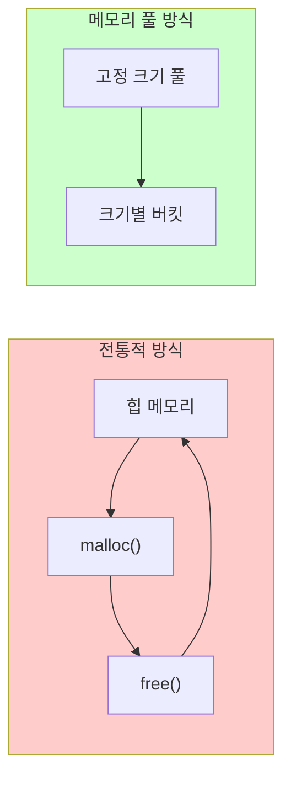
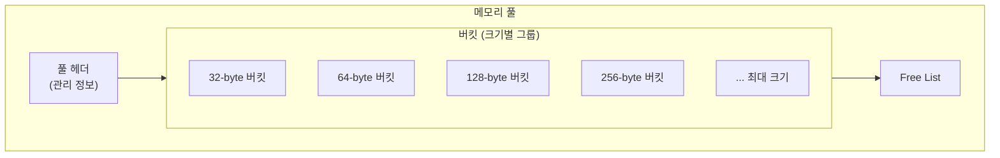
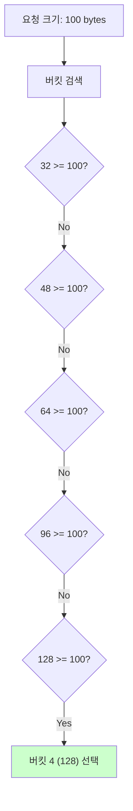
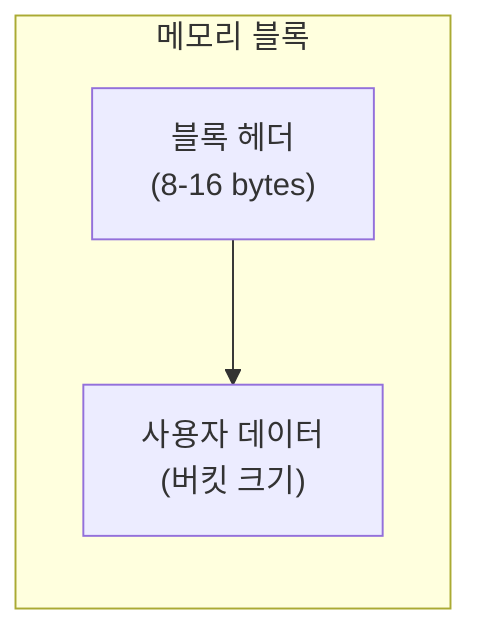
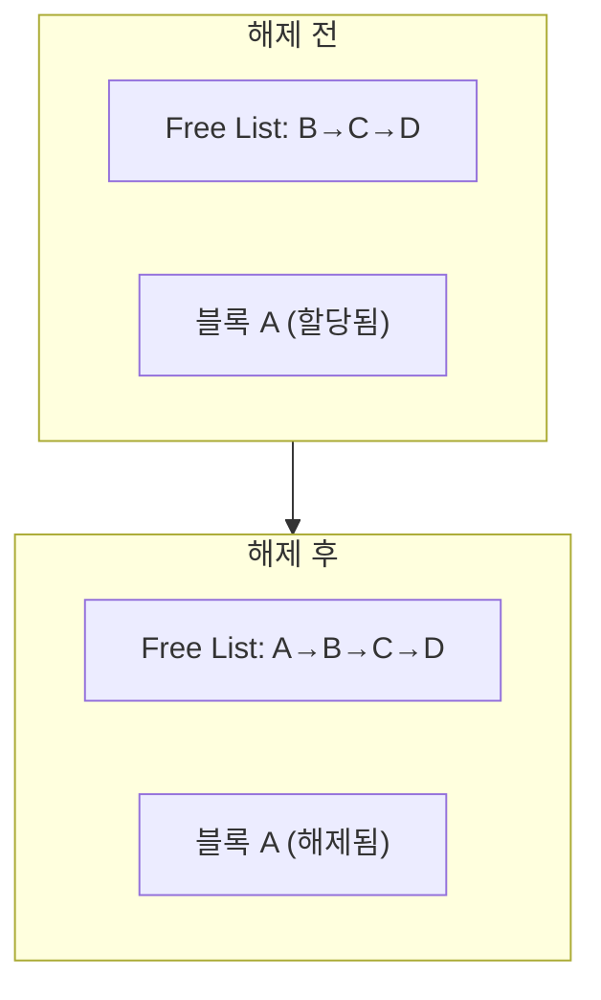
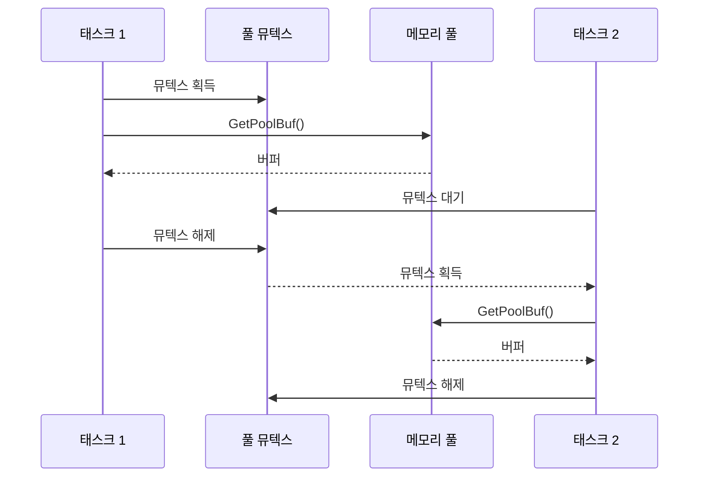

# Phase 2 ES-07: 메모리 풀 관리

## 서론

동적 메모리 할당은 비행 소프트웨어에서 특별한 주의가 필요한 영역이다. 일반적인 malloc/free는 메모리 단편화, 할당 시간의 비결정성, 메모리 누수 등의 문제를 야기할 수 있다. cFE의 Executive Services(ES)는 이러한 문제를 해결하기 위해 메모리 풀(Memory Pool) 시스템을 제공한다.

본 문서에서는 ES의 메모리 풀 관리 기능을 상세히 살펴본다. 풀 생성, 버퍼 할당/해제, 풀 통계 조회 등의 API와 내부 동작 원리를 분석한다.

---

## 1. 메모리 풀 개요

### 1.1 메모리 풀의 필요성

전통적인 동적 메모리 할당의 문제점:

| 문제 | 설명 |
|:---|:---|
| **단편화** | 반복적인 할당/해제로 사용 가능한 연속 공간 감소 |
| **비결정성** | 할당 시간이 일정하지 않음 |
| **메모리 누수** | 해제되지 않은 메모리 축적 |
| **힙 손상** | 버퍼 오버런 등으로 힙 구조 손상 |

### 1.2 메모리 풀의 해결책



메모리 풀의 장점:
- **결정론적 할당 시간**: O(1) 복잡도
- **단편화 방지**: 고정 크기 블록 사용
- **통계 추적**: 사용량 모니터링 가능
- **경계 검사**: 버퍼 오버런 탐지

### 1.3 cFE 메모리 풀 구조



---

## 2. 메모리 풀 생성

### 2.1 CFE_ES_PoolCreate 함수

기본 메모리 풀 생성:

```c
/**
 * @brief 메모리 풀 생성
 *
 * 주어진 메모리 영역에 풀을 생성한다.
 * 기본 버킷 크기가 사용된다.
 *
 * @param PoolID      풀 ID 반환
 * @param MemPtr      풀로 사용할 메모리 시작 주소
 * @param Size        메모리 영역 크기
 *
 * @return CFE_SUCCESS 성공
 * @return CFE_ES_BAD_ARGUMENT 잘못된 인수
 */
CFE_Status_t CFE_ES_PoolCreate(
    CFE_ES_MemHandle_t *PoolID,
    void *MemPtr,
    size_t Size)
{
    return CFE_ES_PoolCreateEx(PoolID, MemPtr, Size,
                               CFE_PLATFORM_ES_POOL_MAX_BUCKETS,
                               NULL,  /* 기본 버킷 크기 사용 */
                               CFE_ES_NO_MUTEX);
}
```

### 2.2 CFE_ES_PoolCreateEx 함수

확장된 풀 생성 (커스텀 버킷 크기):

```c
/**
 * @brief 확장 메모리 풀 생성
 *
 * 커스텀 버킷 크기와 옵션을 지정하여 풀을 생성한다.
 *
 * @param PoolID         풀 ID 반환
 * @param MemPtr         풀로 사용할 메모리 시작 주소
 * @param Size           메모리 영역 크기
 * @param NumBlockSizes  버킷 개수
 * @param BlockSizes     버킷 크기 배열 (NULL이면 기본값)
 * @param UseMutex       뮤텍스 사용 여부
 *
 * @return CFE_SUCCESS 성공
 */
CFE_Status_t CFE_ES_PoolCreateEx(
    CFE_ES_MemHandle_t *PoolID,
    void *MemPtr,
    size_t Size,
    uint16 NumBlockSizes,
    const size_t *BlockSizes,
    CFE_ES_MemPoolMutex_t UseMutex)
{
    CFE_ES_MemPoolRecord_t *PoolRecord;
    CFE_ES_MemPoolBucket_t *BucketPtr;
    size_t Offset;
    int i;
    
    /*
    ** 풀 레코드 할당
    */
    PoolRecord = CFE_ES_AllocatePoolRecord();
    if (PoolRecord == NULL)
    {
        return CFE_ES_ERR_MEM_POOL_CREATE;
    }
    
    /*
    ** 풀 메모리 초기화
    */
    PoolRecord->PoolAddress = (cpuaddr)MemPtr;
    PoolRecord->PoolSize = Size;
    PoolRecord->CurrentOffset = 0;
    PoolRecord->AllocationCount = 0;
    
    /*
    ** 뮤텍스 생성
    */
    if (UseMutex == CFE_ES_USE_MUTEX)
    {
        OS_MutSemCreate(&PoolRecord->MutexId, "PoolMutex", 0);
        PoolRecord->UseMutex = true;
    }
    else
    {
        PoolRecord->UseMutex = false;
    }
    
    /*
    ** 버킷 초기화
    */
    if (BlockSizes == NULL)
    {
        /* 기본 버킷 크기 사용 */
        CFE_ES_InitDefaultBuckets(PoolRecord);
    }
    else
    {
        /* 커스텀 버킷 크기 */
        for (i = 0; i < NumBlockSizes; i++)
        {
            PoolRecord->Buckets[i].BlockSize = BlockSizes[i];
            PoolRecord->Buckets[i].FreeList = NULL;
            PoolRecord->Buckets[i].AllocCount = 0;
            PoolRecord->Buckets[i].FreeCount = 0;
        }
        PoolRecord->NumBuckets = NumBlockSizes;
    }
    
    *PoolID = CFE_ES_PoolRecordGetID(PoolRecord);
    
    return CFE_SUCCESS;
}
```

### 2.3 기본 버킷 크기

```c
/* 기본 버킷 크기 (플랫폼 구성) */
#define CFE_PLATFORM_ES_POOL_MAX_BUCKETS  17

static const size_t CFE_ES_DefaultPoolBlockSizes[] =
{
    32,      /* 버킷 0 */
    48,      /* 버킷 1 */
    64,      /* 버킷 2 */
    96,      /* 버킷 3 */
    128,     /* 버킷 4 */
    160,     /* 버킷 5 */
    256,     /* 버킷 6 */
    512,     /* 버킷 7 */
    1024,    /* 버킷 8 */
    2048,    /* 버킷 9 */
    4096,    /* 버킷 10 */
    8192,    /* 버킷 11 */
    16384,   /* 버킷 12 */
    32768,   /* 버킷 13 */
    65536,   /* 버킷 14 */
    131072,  /* 버킷 15 */
    262144   /* 버킷 16 */
};
```

---

## 3. 버퍼 할당

### 3.1 CFE_ES_GetPoolBuf 함수

풀에서 버퍼 할당:

```c
/**
 * @brief 풀에서 버퍼 할당
 *
 * 요청 크기 이상의 버퍼를 풀에서 할당한다.
 * 적합한 버킷에서 블록을 선택한다.
 *
 * @param BufPtr   할당된 버퍼 주소 반환
 * @param PoolID   풀 ID
 * @param Size     요청 크기
 *
 * @return 할당된 실제 블록 크기 (양수)
 * @return CFE_ES_ERR_MEM_BLOCK_SIZE 너무 큰 요청
 * @return CFE_ES_ERR_MEM_POOL_EXHAUSTED 풀 소진
 */
int32 CFE_ES_GetPoolBuf(
    CFE_ES_MemPoolBuf_t *BufPtr,
    CFE_ES_MemHandle_t PoolID,
    size_t Size)
{
    CFE_ES_MemPoolRecord_t *PoolRecord;
    CFE_ES_MemPoolBucket_t *BucketPtr;
    CFE_ES_MemPoolBlock_t *BlockPtr;
    size_t AllocSize;
    int BucketIdx;
    
    /*
    ** 풀 레코드 조회
    */
    PoolRecord = CFE_ES_LocatePoolRecordByID(PoolID);
    if (PoolRecord == NULL)
    {
        return CFE_ES_ERR_RESOURCEID_NOT_VALID;
    }
    
    /*
    ** 뮤텍스 획득
    */
    if (PoolRecord->UseMutex)
    {
        OS_MutSemTake(PoolRecord->MutexId);
    }
    
    /*
    ** 적합한 버킷 찾기
    */
    BucketIdx = CFE_ES_FindBucket(PoolRecord, Size);
    if (BucketIdx < 0)
    {
        if (PoolRecord->UseMutex)
        {
            OS_MutSemGive(PoolRecord->MutexId);
        }
        return CFE_ES_ERR_MEM_BLOCK_SIZE;
    }
    
    BucketPtr = &PoolRecord->Buckets[BucketIdx];
    
    /*
    ** Free List에서 블록 획득 또는 새로 할당
    */
    if (BucketPtr->FreeList != NULL)
    {
        /* Free List에서 재사용 */
        BlockPtr = BucketPtr->FreeList;
        BucketPtr->FreeList = BlockPtr->Next;
        BucketPtr->FreeCount--;
    }
    else
    {
        /* 풀에서 새 블록 할당 */
        AllocSize = sizeof(CFE_ES_MemPoolBlock_t) + BucketPtr->BlockSize;
        
        if (PoolRecord->CurrentOffset + AllocSize > PoolRecord->PoolSize)
        {
            if (PoolRecord->UseMutex)
            {
                OS_MutSemGive(PoolRecord->MutexId);
            }
            return CFE_ES_ERR_MEM_POOL_EXHAUSTED;
        }
        
        BlockPtr = (CFE_ES_MemPoolBlock_t *)
                   (PoolRecord->PoolAddress + PoolRecord->CurrentOffset);
        PoolRecord->CurrentOffset += AllocSize;
    }
    
    /*
    ** 블록 헤더 설정
    */
    BlockPtr->BucketIndex = BucketIdx;
    BlockPtr->IsAllocated = true;
    BlockPtr->CheckBits = CFE_ES_POOL_CHECK_PATTERN;
    
    /*
    ** 통계 업데이트
    */
    BucketPtr->AllocCount++;
    PoolRecord->AllocationCount++;
    
    /*
    ** 뮤텍스 해제
    */
    if (PoolRecord->UseMutex)
    {
        OS_MutSemGive(PoolRecord->MutexId);
    }
    
    /*
    ** 사용자 데이터 영역 반환
    */
    *BufPtr = (CFE_ES_MemPoolBuf_t)(BlockPtr + 1);
    
    return BucketPtr->BlockSize;
}
```

### 3.2 버킷 선택 알고리즘



```c
int CFE_ES_FindBucket(CFE_ES_MemPoolRecord_t *Pool, size_t Size)
{
    int i;
    
    for (i = 0; i < Pool->NumBuckets; i++)
    {
        if (Pool->Buckets[i].BlockSize >= Size)
        {
            return i;
        }
    }
    
    return -1;  /* 적합한 버킷 없음 */
}
```

### 3.3 블록 구조



```c
typedef struct {
    uint16 BucketIndex;         /* 소속 버킷 인덱스 */
    uint16 IsAllocated;         /* 할당 여부 */
    uint32 CheckBits;           /* 무결성 검사 패턴 */
    struct CFE_ES_MemPoolBlock *Next;  /* Free List 링크 */
} CFE_ES_MemPoolBlock_t;

#define CFE_ES_POOL_CHECK_PATTERN  0x5A5A5A5A
```

---

## 4. 버퍼 해제

### 4.1 CFE_ES_PutPoolBuf 함수

버퍼를 풀에 반환:

```c
/**
 * @brief 버퍼를 풀에 반환
 *
 * 할당된 버퍼를 풀에 반환한다.
 * 버퍼는 Free List에 추가되어 재사용된다.
 *
 * @param PoolID   풀 ID
 * @param BufPtr   반환할 버퍼 주소
 *
 * @return 반환된 블록 크기 (양수)
 * @return CFE_ES_ERR_MEM_HANDLE 잘못된 버퍼
 */
int32 CFE_ES_PutPoolBuf(
    CFE_ES_MemHandle_t PoolID,
    CFE_ES_MemPoolBuf_t BufPtr)
{
    CFE_ES_MemPoolRecord_t *PoolRecord;
    CFE_ES_MemPoolBucket_t *BucketPtr;
    CFE_ES_MemPoolBlock_t *BlockPtr;
    size_t BlockSize;
    
    /*
    ** 풀 레코드 조회
    */
    PoolRecord = CFE_ES_LocatePoolRecordByID(PoolID);
    if (PoolRecord == NULL)
    {
        return CFE_ES_ERR_RESOURCEID_NOT_VALID;
    }
    
    /*
    ** 블록 헤더 접근
    */
    BlockPtr = ((CFE_ES_MemPoolBlock_t *)BufPtr) - 1;
    
    /*
    ** 무결성 검사
    */
    if (BlockPtr->CheckBits != CFE_ES_POOL_CHECK_PATTERN)
    {
        CFE_ES_WriteToSysLog("ES MemPool: Block corruption detected\n");
        return CFE_ES_ERR_MEM_HANDLE;
    }
    
    if (!BlockPtr->IsAllocated)
    {
        CFE_ES_WriteToSysLog("ES MemPool: Double free detected\n");
        return CFE_ES_ERR_MEM_HANDLE;
    }
    
    /*
    ** 뮤텍스 획득
    */
    if (PoolRecord->UseMutex)
    {
        OS_MutSemTake(PoolRecord->MutexId);
    }
    
    /*
    ** 버킷 조회
    */
    BucketPtr = &PoolRecord->Buckets[BlockPtr->BucketIndex];
    BlockSize = BucketPtr->BlockSize;
    
    /*
    ** Free List에 추가
    */
    BlockPtr->IsAllocated = false;
    BlockPtr->Next = BucketPtr->FreeList;
    BucketPtr->FreeList = BlockPtr;
    BucketPtr->FreeCount++;
    
    /*
    ** 통계 업데이트
    */
    PoolRecord->AllocationCount--;
    
    /*
    ** 뮤텍스 해제
    */
    if (PoolRecord->UseMutex)
    {
        OS_MutSemGive(PoolRecord->MutexId);
    }
    
    return BlockSize;
}
```

### 4.2 Free List 동작



---

## 5. 풀 통계

### 5.1 CFE_ES_GetPoolStats 함수

풀 사용 통계 조회:

```c
/* 풀 통계 구조체 */
typedef struct {
    size_t   PoolSize;          /* 전체 풀 크기 */
    uint32   NumBlocksRequested; /* 총 할당 요청 수 */
    uint32   CheckErrCtr;       /* 무결성 오류 수 */
    size_t   NumFreeBytes;      /* 사용 가능 바이트 */
} CFE_ES_MemPoolStats_t;

/**
 * @brief 풀 통계 조회
 *
 * @param Stats   통계 구조체
 * @param PoolID  풀 ID
 * @return CFE_SUCCESS 성공
 */
CFE_Status_t CFE_ES_GetPoolStats(
    CFE_ES_MemPoolStats_t *Stats,
    CFE_ES_MemHandle_t PoolID)
{
    CFE_ES_MemPoolRecord_t *PoolRecord;
    
    PoolRecord = CFE_ES_LocatePoolRecordByID(PoolID);
    if (PoolRecord == NULL)
    {
        return CFE_ES_ERR_RESOURCEID_NOT_VALID;
    }
    
    Stats->PoolSize = PoolRecord->PoolSize;
    Stats->NumBlocksRequested = PoolRecord->TotalAllocations;
    Stats->CheckErrCtr = PoolRecord->CheckErrorCount;
    Stats->NumFreeBytes = PoolRecord->PoolSize - PoolRecord->CurrentOffset;
    
    /* 버킷별 통계도 포함 가능 */
    
    return CFE_SUCCESS;
}
```

### 5.2 버킷별 통계

```c
typedef struct {
    size_t BlockSize;           /* 블록 크기 */
    uint32 NumCreated;          /* 생성된 블록 수 */
    uint32 NumFree;             /* Free List 블록 수 */
    uint32 NumAllocated;        /* 할당된 블록 수 */
    uint32 MaxAllocated;        /* 최대 동시 할당 수 */
} CFE_ES_BucketStats_t;
```

---

## 6. 메모리 풀 사용 예시

### 6.1 앱에서 풀 생성 및 사용

```c
/* 앱 데이터 구조 */
typedef struct {
    CFE_ES_MemHandle_t MessagePool;
    uint8              PoolMemory[32768];  /* 32KB 풀 */
} MY_APP_Data_t;

MY_APP_Data_t MY_APP_Data;

/* 초기화에서 풀 생성 */
CFE_Status_t MY_APP_Init(void)
{
    CFE_Status_t Status;
    
    /*
    ** 메모리 풀 생성
    */
    Status = CFE_ES_PoolCreate(
        &MY_APP_Data.MessagePool,
        MY_APP_Data.PoolMemory,
        sizeof(MY_APP_Data.PoolMemory)
    );
    
    if (Status != CFE_SUCCESS)
    {
        CFE_EVS_SendEvent(MY_POOL_ERR_EID,
                          CFE_EVS_EventType_ERROR,
                          "Failed to create memory pool");
        return Status;
    }
    
    return CFE_SUCCESS;
}

/* 메시지 버퍼 할당 */
void *MY_APP_AllocMessage(size_t Size)
{
    CFE_ES_MemPoolBuf_t BufPtr;
    int32 AllocSize;
    
    AllocSize = CFE_ES_GetPoolBuf(&BufPtr,
                                  MY_APP_Data.MessagePool,
                                  Size);
    
    if (AllocSize > 0)
    {
        return BufPtr;
    }
    
    return NULL;
}

/* 메시지 버퍼 해제 */
void MY_APP_FreeMessage(void *MsgPtr)
{
    CFE_ES_PutPoolBuf(MY_APP_Data.MessagePool,
                      (CFE_ES_MemPoolBuf_t)MsgPtr);
}
```

### 6.2 커스텀 버킷 크기

특정 크기 패턴에 최적화:

```c
/* 커스텀 버킷 크기 정의 */
static const size_t MY_APP_BucketSizes[] = {
    64,     /* 작은 메시지 */
    256,    /* 중간 메시지 */
    1024,   /* 큰 메시지 */
    4096    /* 최대 메시지 */
};

/* 커스텀 풀 생성 */
Status = CFE_ES_PoolCreateEx(
    &MY_APP_Data.MessagePool,
    MY_APP_Data.PoolMemory,
    sizeof(MY_APP_Data.PoolMemory),
    4,                          /* 버킷 개수 */
    MY_APP_BucketSizes,         /* 버킷 크기 배열 */
    CFE_ES_USE_MUTEX            /* 멀티태스크 안전 */
);
```

---

## 7. 스레드 안전성

### 7.1 뮤텍스 사용

멀티태스크 환경에서의 안전한 사용:



### 7.2 뮤텍스 없이 사용

단일 태스크만 접근하는 경우:

```c
/* 뮤텍스 없이 생성 (오버헤드 감소) */
Status = CFE_ES_PoolCreateEx(
    &MY_APP_Data.PrivatePool,
    MY_APP_Data.PoolMemory,
    sizeof(MY_APP_Data.PoolMemory),
    CFE_PLATFORM_ES_POOL_MAX_BUCKETS,
    NULL,                       /* 기본 버킷 */
    CFE_ES_NO_MUTEX             /* 뮤텍스 없음 */
);
```

---

## 8. 오류 처리 및 디버깅

### 8.1 일반적인 오류

| 오류 | 원인 | 해결 |
|:---|:---|:---|
| `ERR_MEM_BLOCK_SIZE` | 요청이 최대 버킷보다 큼 | 요청 크기 확인 또는 버킷 추가 |
| `ERR_MEM_POOL_EXHAUSTED` | 풀 공간 부족 | 풀 크기 증가 또는 누수 확인 |
| `ERR_MEM_HANDLE` | 잘못된 버퍼 또는 중복 해제 | 버퍼 관리 로직 검토 |

### 8.2 디버깅 패턴

```c
void MY_APP_MonitorPool(void)
{
    CFE_ES_MemPoolStats_t Stats;
    
    CFE_ES_GetPoolStats(&Stats, MY_APP_Data.MessagePool);
    
    CFE_EVS_SendEvent(MY_POOL_STATS_EID,
                      CFE_EVS_EventType_DEBUG,
                      "Pool: Size=%u, Free=%u, Allocs=%u, Errors=%u",
                      (unsigned int)Stats.PoolSize,
                      (unsigned int)Stats.NumFreeBytes,
                      (unsigned int)Stats.NumBlocksRequested,
                      (unsigned int)Stats.CheckErrCtr);
    
    /* 경고 조건 */
    if (Stats.NumFreeBytes < Stats.PoolSize / 10)
    {
        CFE_EVS_SendEvent(MY_POOL_LOW_EID,
                          CFE_EVS_EventType_WARNING,
                          "Pool low: only %u bytes free",
                          (unsigned int)Stats.NumFreeBytes);
    }
}
```

---

## 9. 정리: 메모리 풀 API 요약

| 함수 | 용도 |
|:---|:---|
| `CFE_ES_PoolCreate()` | 기본 풀 생성 |
| `CFE_ES_PoolCreateEx()` | 확장 풀 생성 |
| `CFE_ES_GetPoolBuf()` | 버퍼 할당 |
| `CFE_ES_PutPoolBuf()` | 버퍼 해제 |
| `CFE_ES_GetPoolStats()` | 풀 통계 조회 |

---

## 결론

ES의 메모리 풀 시스템은 비행 소프트웨어에 적합한 안전하고 효율적인 동적 메모리 관리를 제공한다. 고정 크기 버킷을 사용하여 단편화를 방지하고, 결정론적 할당 시간을 보장하며, 무결성 검사를 통해 메모리 손상을 탐지한다.

효과적인 메모리 풀 활용을 위해:
- 예상 메모리 사용 패턴에 맞게 풀 크기 설정
- 필요시 커스텀 버킷 크기 사용
- 풀 통계를 주기적으로 모니터링
- 멀티태스크 환경에서는 뮤텍스 사용

다음 문서에서는 Critical Data Store(CDS)를 통한 리셋 간 데이터 보존 기능을 살펴볼 것이다.

---

## 참고 문헌

1. NASA, "cFE Application Developer's Guide"
2. NASA cFE GitHub, cfe/modules/es/fsw/src/cfe_es_mempool.c
3. NASA, "ES API Reference"

---

[이전 문서: Phase 2 ES-06: 태스크 관리 메커니즘](./Phase2_ES_06_태스크_관리_메커니즘.md)

[다음 문서: Phase 2 ES-08: Critical Data Store (CDS)](./Phase2_ES_08_Critical_Data_Store.md)
