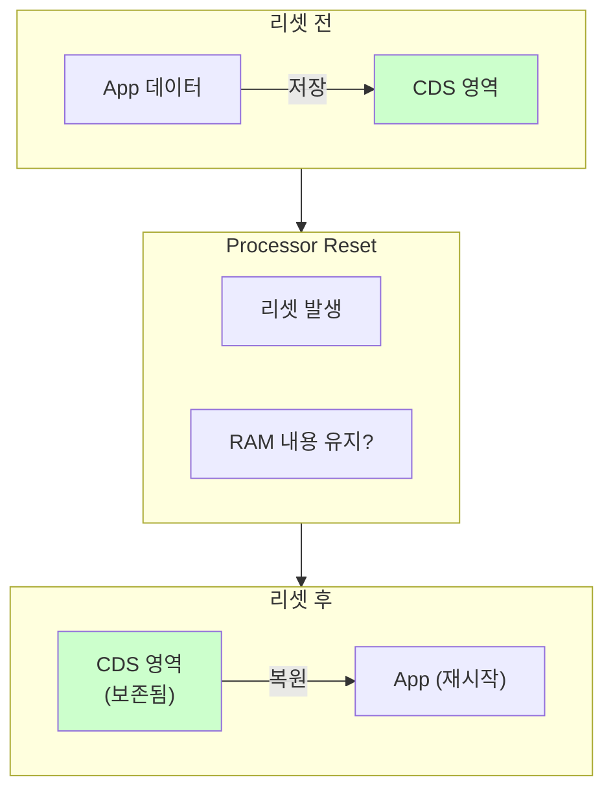
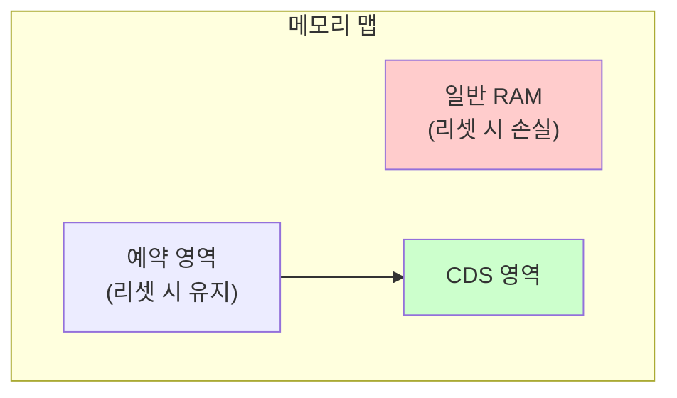
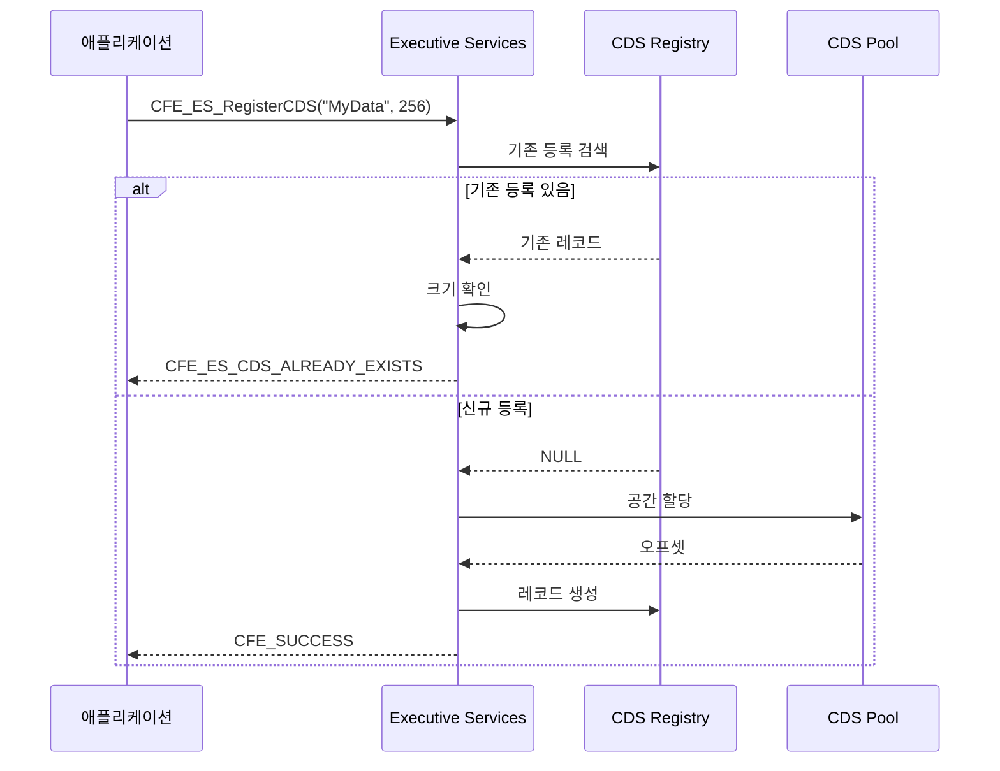
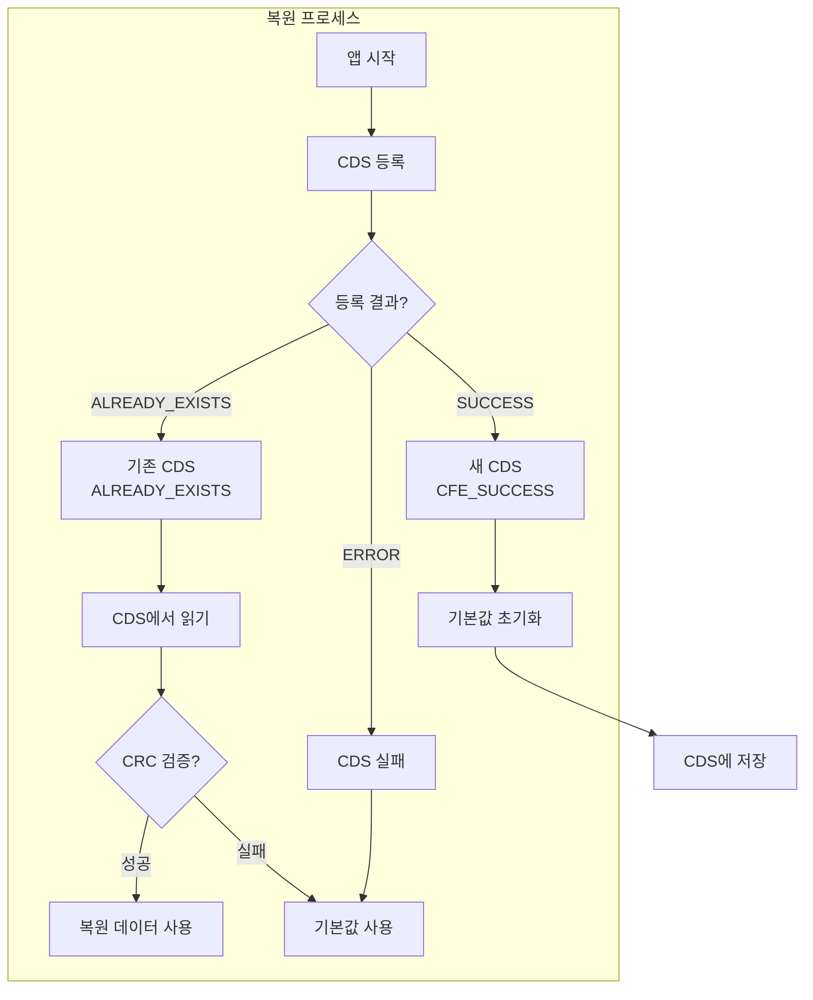
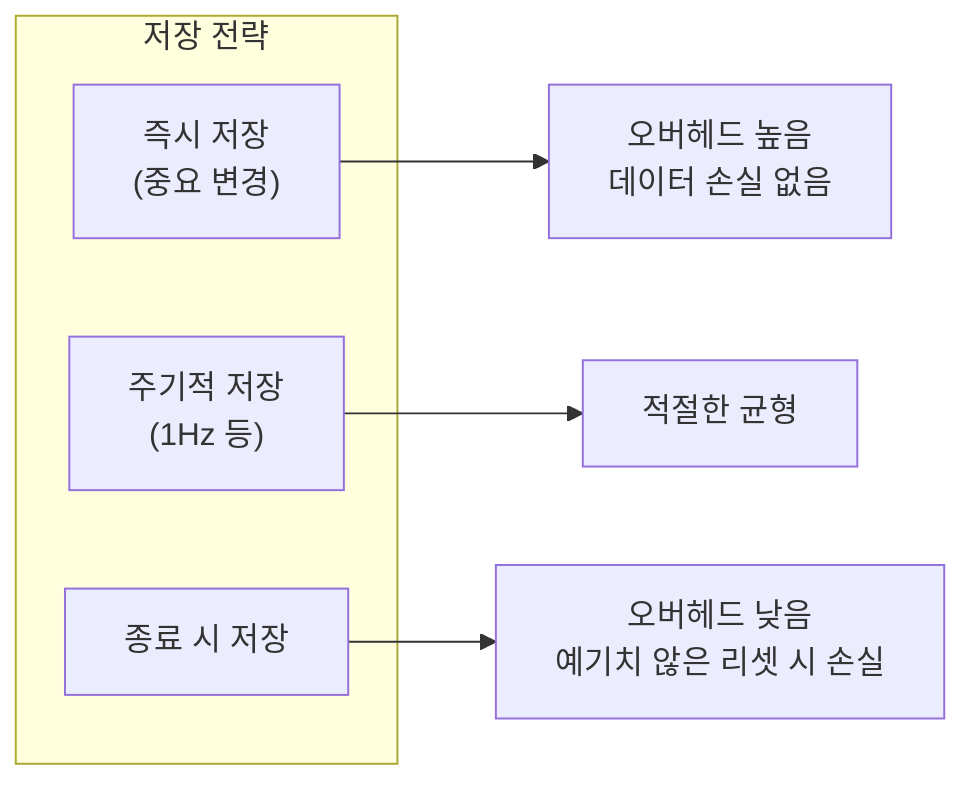

# Phase 2 ES-08: Critical Data Store (CDS)

## 서론

우주 비행 소프트웨어에서 리셋은 피할 수 없는 현실이다. 방사선에 의한 소프트 에러, 소프트웨어 버그, 또는 의도적인 유지보수 리셋 등 다양한 원인으로 프로세서가 재시작될 수 있다. 이때 중요한 데이터를 잃지 않고 보존하는 것이 Critical Data Store(CDS)의 역할이다.

본 문서에서는 ES가 제공하는 CDS 기능을 상세히 살펴본다. CDS의 개념, 등록 및 사용 방법, 리셋 유형에 따른 동작, 그리고 효과적인 활용 패턴을 다룬다.

---

## 1. CDS 개요

### 1.1 CDS의 목적

CDS는 Processor Reset 후에도 보존되어야 하는 데이터를 저장하는 메커니즘이다.



### 1.2 리셋 유형과 CDS

| 리셋 유형 | CDS 상태 | 설명 |
|:---|:---:|:---|
| **Power-On Reset** | 초기화 | 전원 완전 차단, 모든 데이터 손실 |
| **Processor Reset** | 보존 | SW 리셋, CDS 영역 유지 |

### 1.3 CDS 저장 위치



CDS는 플랫폼에 따라 다른 방법으로 구현된다:
- **물리적 보존**: 리셋해도 초기화되지 않는 RAM 영역
- **배터리 백업 SRAM**: 전원이 꺼져도 유지되는 메모리
- **파일 시스템**: PC-Linux에서는 파일로 시뮬레이션

---

## 2. CDS 등록

### 2.1 CFE_ES_RegisterCDS 함수

앱이 CDS 영역을 등록:

```c
/**
 * @brief CDS 영역 등록
 *
 * 앱이 사용할 CDS 영역을 등록한다.
 * 이미 등록된 영역이 있으면 기존 핸들을 반환한다.
 *
 * @param CDSHandlePtr  CDS 핸들 반환
 * @param BlockSize     필요한 블록 크기
 * @param Name          CDS 블록 이름 (앱 내에서 고유)
 *
 * @return CFE_SUCCESS 새로 등록됨
 * @return CFE_ES_CDS_ALREADY_EXISTS 기존 영역 재사용
 * @return CFE_ES_ERR_CDS_NOT_AVAILABLE CDS 사용 불가
 */
CFE_Status_t CFE_ES_RegisterCDS(
    CFE_ES_CDSHandle_t *CDSHandlePtr,
    size_t BlockSize,
    const char *Name)
{
    CFE_ES_CDS_RegRec_t *RegRecPtr;
    CFE_ES_AppRecord_t *AppRecord;
    char FullName[CFE_MISSION_ES_CDS_MAX_NAME_LEN];
    int32 Status;
    
    /*
    ** 현재 앱 확인
    */
    AppRecord = CFE_ES_GetCurrentAppRecord();
    if (AppRecord == NULL)
    {
        return CFE_ES_ERR_APP_NOT_RUNNING;
    }
    
    /*
    ** 전체 이름 생성 (AppName.BlockName)
    */
    snprintf(FullName, sizeof(FullName), "%s.%s",
             AppRecord->Name, Name);
    
    /*
    ** 기존 등록 확인
    */
    RegRecPtr = CFE_ES_FindCDSByName(FullName);
    
    if (RegRecPtr != NULL)
    {
        /*
        ** 기존 영역 발견 - 크기 확인
        */
        if (RegRecPtr->BlockSize == BlockSize)
        {
            *CDSHandlePtr = CFE_ES_CDSRegRecGetID(RegRecPtr);
            return CFE_ES_CDS_ALREADY_EXISTS;
        }
        else
        {
            /*
            ** 크기 불일치 - 재등록
            */
            CFE_ES_DeleteCDS(FullName, true);
        }
    }
    
    /*
    ** 새 CDS 영역 할당
    */
    RegRecPtr = CFE_ES_AllocateCDSRecord();
    if (RegRecPtr == NULL)
    {
        return CFE_ES_ERR_CDS_NOT_AVAILABLE;
    }
    
    /*
    ** CDS 풀에서 공간 할당
    */
    Status = CFE_ES_AllocateCDSBlock(RegRecPtr, BlockSize);
    if (Status != CFE_SUCCESS)
    {
        CFE_ES_FreeCDSRecord(RegRecPtr);
        return Status;
    }
    
    /*
    ** 레지스트리 정보 설정
    */
    strncpy(RegRecPtr->Name, FullName, sizeof(RegRecPtr->Name));
    RegRecPtr->BlockSize = BlockSize;
    RegRecPtr->Table = false;  /* 테이블용이 아님 */
    
    /*
    ** 핸들 반환
    */
    *CDSHandlePtr = CFE_ES_CDSRegRecGetID(RegRecPtr);
    
    return CFE_SUCCESS;
}
```

### 2.2 등록 프로세스



### 2.3 반환 값 처리

등록 결과에 따른 처리:

```c
CFE_Status_t MY_APP_InitCDS(void)
{
    CFE_Status_t Status;
    
    Status = CFE_ES_RegisterCDS(&MY_APP_Data.CDSHandle,
                                sizeof(MY_APP_CDSData_t),
                                "AppData");
    
    switch (Status)
    {
        case CFE_SUCCESS:
            /*
            ** 새로 등록됨 - 기본값으로 초기화
            */
            CFE_EVS_SendEvent(MY_CDS_NEW_EID,
                              CFE_EVS_EventType_INFORMATION,
                              "CDS block created, initializing");
            MY_APP_InitCDSData();
            CFE_ES_CopyToCDS(MY_APP_Data.CDSHandle, 
                             &MY_APP_Data.CDSContent);
            break;
            
        case CFE_ES_CDS_ALREADY_EXISTS:
            /*
            ** 기존 데이터 복원
            */
            CFE_EVS_SendEvent(MY_CDS_RESTORE_EID,
                              CFE_EVS_EventType_INFORMATION,
                              "CDS block found, restoring data");
            Status = CFE_ES_RestoreFromCDS(&MY_APP_Data.CDSContent,
                                           MY_APP_Data.CDSHandle);
            if (Status != CFE_SUCCESS)
            {
                /* 복원 실패 - 기본값 사용 */
                MY_APP_InitCDSData();
            }
            break;
            
        default:
            /*
            ** CDS 사용 불가
            */
            CFE_EVS_SendEvent(MY_CDS_ERR_EID,
                              CFE_EVS_EventType_ERROR,
                              "CDS registration failed: 0x%08X",
                              (unsigned int)Status);
            MY_APP_Data.CDSHandle = CFE_ES_CDS_BAD_HANDLE;
            break;
    }
    
    return Status;
}
```

---

## 3. CDS 데이터 저장

### 3.1 CFE_ES_CopyToCDS 함수

데이터를 CDS에 저장:

```c
/**
 * @brief 데이터를 CDS에 저장
 *
 * RAM의 데이터를 CDS 영역에 복사한다.
 *
 * @param CDSHandle    CDS 핸들
 * @param DataToCopy   복사할 데이터 포인터
 *
 * @return CFE_SUCCESS 성공
 * @return CFE_ES_ERR_RESOURCEID_NOT_VALID 잘못된 핸들
 */
CFE_Status_t CFE_ES_CopyToCDS(
    CFE_ES_CDSHandle_t CDSHandle,
    const void *DataToCopy)
{
    CFE_ES_CDS_RegRec_t *RegRecPtr;
    int32 Status;
    
    /*
    ** CDS 레코드 조회
    */
    RegRecPtr = CFE_ES_LocateCDSRecordByID(CDSHandle);
    if (RegRecPtr == NULL)
    {
        return CFE_ES_ERR_RESOURCEID_NOT_VALID;
    }
    
    /*
    ** 데이터 복사
    */
    Status = CFE_PSP_WriteToCDS(DataToCopy,
                                RegRecPtr->Offset,
                                RegRecPtr->BlockSize);
    
    if (Status != CFE_PSP_SUCCESS)
    {
        return CFE_ES_ERR_CDS_ACCESS;
    }
    
    /*
    ** CRC 업데이트
    */
    RegRecPtr->CRC = CFE_ES_CalculateCRC(DataToCopy,
                                         RegRecPtr->BlockSize,
                                         0,
                                         CFE_MISSION_ES_DEFAULT_CRC);
    
    return CFE_SUCCESS;
}
```

### 3.2 저장 시점

CDS에 저장해야 하는 시점:

```c
/* 1. 주기적 저장 */
void MY_APP_PeriodicUpdate(void)
{
    if (MY_APP_Data.CDSHandle != CFE_ES_CDS_BAD_HANDLE)
    {
        CFE_ES_CopyToCDS(MY_APP_Data.CDSHandle,
                         &MY_APP_Data.CDSContent);
    }
}

/* 2. 중요 상태 변경 시 */
void MY_APP_UpdateCriticalState(uint32 NewState)
{
    MY_APP_Data.CDSContent.State = NewState;
    
    if (MY_APP_Data.CDSHandle != CFE_ES_CDS_BAD_HANDLE)
    {
        CFE_ES_CopyToCDS(MY_APP_Data.CDSHandle,
                         &MY_APP_Data.CDSContent);
    }
}

/* 3. 종료 전 저장 */
void MY_APP_Cleanup(void)
{
    if (MY_APP_Data.CDSHandle != CFE_ES_CDS_BAD_HANDLE)
    {
        CFE_ES_CopyToCDS(MY_APP_Data.CDSHandle,
                         &MY_APP_Data.CDSContent);
    }
}
```

---

## 4. CDS 데이터 복원

### 4.1 CFE_ES_RestoreFromCDS 함수

CDS에서 데이터 복원:

```c
/**
 * @brief CDS에서 데이터 복원
 *
 * CDS 영역의 데이터를 RAM으로 복원한다.
 *
 * @param RestoreToMemory  복원 대상 메모리 포인터
 * @param CDSHandle        CDS 핸들
 *
 * @return CFE_SUCCESS 성공 (데이터 유효)
 * @return CFE_ES_CDS_BLOCK_CRC_ERR CRC 불일치
 */
CFE_Status_t CFE_ES_RestoreFromCDS(
    void *RestoreToMemory,
    CFE_ES_CDSHandle_t CDSHandle)
{
    CFE_ES_CDS_RegRec_t *RegRecPtr;
    uint32 StoredCRC;
    uint32 ComputedCRC;
    int32 Status;
    
    /*
    ** CDS 레코드 조회
    */
    RegRecPtr = CFE_ES_LocateCDSRecordByID(CDSHandle);
    if (RegRecPtr == NULL)
    {
        return CFE_ES_ERR_RESOURCEID_NOT_VALID;
    }
    
    /*
    ** 데이터 읽기
    */
    Status = CFE_PSP_ReadFromCDS(RestoreToMemory,
                                 RegRecPtr->Offset,
                                 RegRecPtr->BlockSize);
    
    if (Status != CFE_PSP_SUCCESS)
    {
        return CFE_ES_ERR_CDS_ACCESS;
    }
    
    /*
    ** CRC 검증
    */
    StoredCRC = RegRecPtr->CRC;
    ComputedCRC = CFE_ES_CalculateCRC(RestoreToMemory,
                                      RegRecPtr->BlockSize,
                                      0,
                                      CFE_MISSION_ES_DEFAULT_CRC);
    
    if (StoredCRC != ComputedCRC)
    {
        CFE_ES_WriteToSysLog("CDS: Block '%s' CRC mismatch\n",
                             RegRecPtr->Name);
        return CFE_ES_CDS_BLOCK_CRC_ERR;
    }
    
    return CFE_SUCCESS;
}
```

### 4.2 복원 프로세스



---

## 5. CDS 데이터 구조 설계

### 5.1 버전 관리

소프트웨어 업데이트 시 데이터 구조가 변경될 수 있으므로 버전 정보를 포함:

```c
/* CDS 데이터 구조 (버전 포함) */
typedef struct {
    uint32 Version;              /* 데이터 구조 버전 */
    uint32 Signature;            /* 유효성 시그니처 */
    
    /* 앱 데이터 */
    uint32 OperationCount;
    uint32 LastCommand;
    int16  CalibrationFactor[10];
    
} MY_APP_CDSData_t;

#define MY_APP_CDS_VERSION     1
#define MY_APP_CDS_SIGNATURE   0x4D594150  /* "MYAP" */

/* 복원 시 버전 확인 */
CFE_Status_t MY_APP_RestoreCDS(void)
{
    CFE_Status_t Status;
    
    Status = CFE_ES_RestoreFromCDS(&MY_APP_Data.CDSContent,
                                   MY_APP_Data.CDSHandle);
    
    if (Status == CFE_SUCCESS)
    {
        /* 시그니처 및 버전 확인 */
        if (MY_APP_Data.CDSContent.Signature != MY_APP_CDS_SIGNATURE)
        {
            CFE_EVS_SendEvent(MY_CDS_SIG_ERR_EID,
                              CFE_EVS_EventType_WARNING,
                              "CDS signature mismatch, reinitializing");
            MY_APP_InitCDSData();
            Status = CFE_ES_CDS_BLOCK_CRC_ERR;
        }
        else if (MY_APP_Data.CDSContent.Version != MY_APP_CDS_VERSION)
        {
            CFE_EVS_SendEvent(MY_CDS_VER_EID,
                              CFE_EVS_EventType_INFORMATION,
                              "CDS version %u, expected %u, migrating",
                              (unsigned int)MY_APP_Data.CDSContent.Version,
                              MY_APP_CDS_VERSION);
            MY_APP_MigrateCDSData();
        }
    }
    
    return Status;
}
```

### 5.2 데이터 마이그레이션

```c
/* 구버전에서 신버전으로 마이그레이션 */
void MY_APP_MigrateCDSData(void)
{
    switch (MY_APP_Data.CDSContent.Version)
    {
        case 0:
            /* v0 → v1: 새 필드 추가 */
            MY_APP_Data.CDSContent.LastCommand = 0;
            /* fall through */
            
        case 1:
            /* 현재 버전 */
            break;
            
        default:
            /* 알 수 없는 버전 - 초기화 */
            MY_APP_InitCDSData();
            break;
    }
    
    /* 버전 업데이트 */
    MY_APP_Data.CDSContent.Version = MY_APP_CDS_VERSION;
    
    /* 저장 */
    CFE_ES_CopyToCDS(MY_APP_Data.CDSHandle,
                     &MY_APP_Data.CDSContent);
}
```

---

## 6. CDS 사용 예시

### 6.1 완전한 CDS 사용 패턴

```c
/* CDS 데이터 구조 */
typedef struct {
    uint32 Version;
    uint32 Signature;
    uint32 TotalCommands;
    uint32 TotalErrors;
    uint32 LastResetTime;
    int16  SensorBias[4];
} MY_APP_CDSData_t;

/* 앱 데이터 */
typedef struct {
    CFE_ES_CDSHandle_t CDSHandle;
    MY_APP_CDSData_t   CDSContent;
    bool               CDSValid;
} MY_APP_Data_t;

MY_APP_Data_t MY_APP_Data;

/* 초기화 */
CFE_Status_t MY_APP_Init(void)
{
    CFE_Status_t Status;
    
    /* CDS 등록 */
    Status = CFE_ES_RegisterCDS(&MY_APP_Data.CDSHandle,
                                sizeof(MY_APP_CDSData_t),
                                "AppData");
    
    if (Status == CFE_ES_CDS_ALREADY_EXISTS)
    {
        /* 복원 시도 */
        Status = CFE_ES_RestoreFromCDS(&MY_APP_Data.CDSContent,
                                       MY_APP_Data.CDSHandle);
        
        if (Status == CFE_SUCCESS &&
            MY_APP_Data.CDSContent.Signature == MY_APP_CDS_SIGNATURE)
        {
            CFE_EVS_SendEvent(MY_CDS_RESTORED_EID,
                              CFE_EVS_EventType_INFORMATION,
                              "CDS restored: %u commands, %u errors",
                              (unsigned int)MY_APP_Data.CDSContent.TotalCommands,
                              (unsigned int)MY_APP_Data.CDSContent.TotalErrors);
            MY_APP_Data.CDSValid = true;
        }
        else
        {
            MY_APP_InitCDSDefaults();
        }
    }
    else if (Status == CFE_SUCCESS)
    {
        MY_APP_InitCDSDefaults();
    }
    else
    {
        MY_APP_Data.CDSHandle = CFE_ES_CDS_BAD_HANDLE;
        MY_APP_Data.CDSValid = false;
    }
    
    return CFE_SUCCESS;
}

/* 기본값 초기화 */
void MY_APP_InitCDSDefaults(void)
{
    memset(&MY_APP_Data.CDSContent, 0, sizeof(MY_APP_CDSData_t));
    
    MY_APP_Data.CDSContent.Version = MY_APP_CDS_VERSION;
    MY_APP_Data.CDSContent.Signature = MY_APP_CDS_SIGNATURE;
    MY_APP_Data.CDSContent.LastResetTime = CFE_TIME_GetTime().Seconds;
    
    MY_APP_SaveCDS();
    MY_APP_Data.CDSValid = true;
}

/* CDS 저장 */
void MY_APP_SaveCDS(void)
{
    if (MY_APP_Data.CDSHandle != CFE_ES_CDS_BAD_HANDLE)
    {
        CFE_ES_CopyToCDS(MY_APP_Data.CDSHandle,
                         &MY_APP_Data.CDSContent);
    }
}

/* 명령 처리 후 업데이트 */
void MY_APP_ProcessCommand(void)
{
    /* 명령 처리... */
    
    MY_APP_Data.CDSContent.TotalCommands++;
    
    /* 주기적 또는 즉시 저장 */
    if (MY_APP_Data.CDSContent.TotalCommands % 100 == 0)
    {
        MY_APP_SaveCDS();
    }
}
```

---

## 7. CDS 관리 명령

### 7.1 ES CDS 명령

ES는 CDS 관련 지상 명령을 제공한다:

| 명령 | 설명 |
|:---|:---|
| `DELETE_CDS` | 특정 CDS 블록 삭제 |
| `DUMP_CDS_REGISTRY` | CDS 레지스트리 덤프 |

### 7.2 CDS 정보 조회

```c
/* CDS 레지스트리 정보 */
typedef struct {
    char   Name[CFE_MISSION_ES_CDS_MAX_NAME_LEN];
    size_t Size;
    uint32 CRC;
    bool   Critical;
} CFE_ES_CDSRegDumpEntry_t;
```

---

## 8. CDS 모범 사례

### 8.1 CDS에 저장하지 말아야 할 것

| 저장하지 말 것 | 이유 |
|:---|:---|
| 포인터 | 리셋 후 주소 무효 |
| 파일 디스크립터 | OS 리소스는 리셋 후 무효 |
| OSAL ID | 리셋 후 재생성 필요 |
| 메시지 버퍼 | 동적 할당 주소 무효 |

### 8.2 CDS에 저장해야 하는 것

| 저장할 것 | 예시 |
|:---|:---|
| 통계 카운터 | 명령 수, 오류 수 |
| 캘리브레이션 데이터 | 센서 보정값 |
| 운영 모드 | 마지막 상태 |
| 시퀀스 번호 | 중복 방지 카운터 |

### 8.3 저장 빈도



---

## 결론

Critical Data Store는 cFS 애플리케이션이 Processor Reset 후에도 중요한 데이터를 보존할 수 있게 해주는 필수적인 기능이다. 올바르게 사용하면 리셋으로 인한 데이터 손실을 최소화하고, 시스템의 연속성을 유지할 수 있다.

효과적인 CDS 사용을 위해:
- 버전과 시그니처를 포함하여 데이터 유효성 검증
- 복원 실패 시 graceful한 기본값 처리
- 적절한 저장 빈도 선택
- 포인터나 OS 리소스는 저장하지 않음

다음 문서에서는 ES의 리셋 유형과 처리 메커니즘을 상세히 살펴볼 것이다.

---

## 참고 문헌

1. NASA, "cFE Application Developer's Guide"
2. NASA cFE GitHub, cfe/modules/es/fsw/src/cfe_es_cds.c
3. NASA, "ES API Reference"

---

[이전 문서: Phase 2 ES-07: 메모리 풀 관리](./Phase2_ES_07_메모리_풀_관리.md)

[다음 문서: Phase 2 ES-09: 리셋 유형과 처리](./Phase2_ES_09_리셋_유형과_처리.md)
