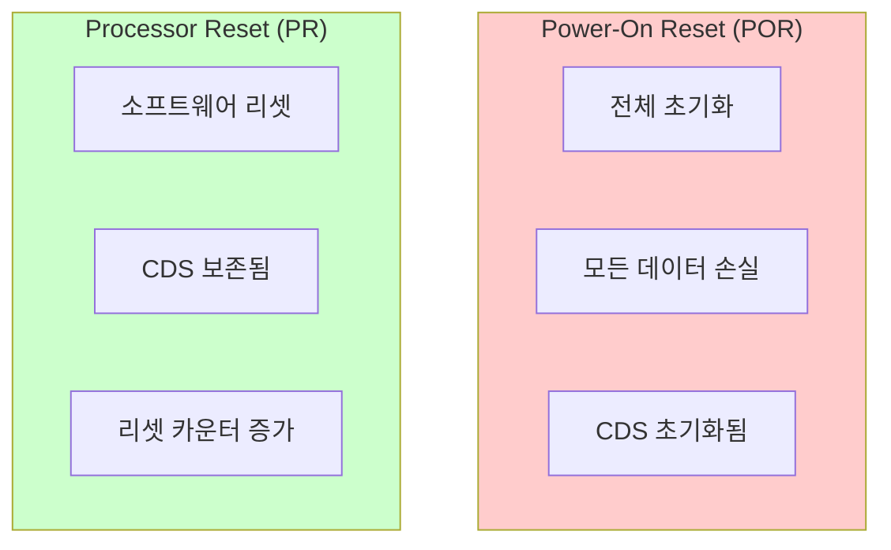
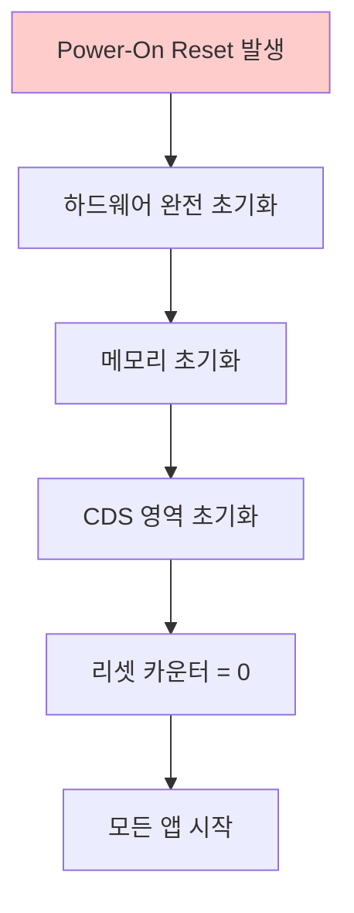
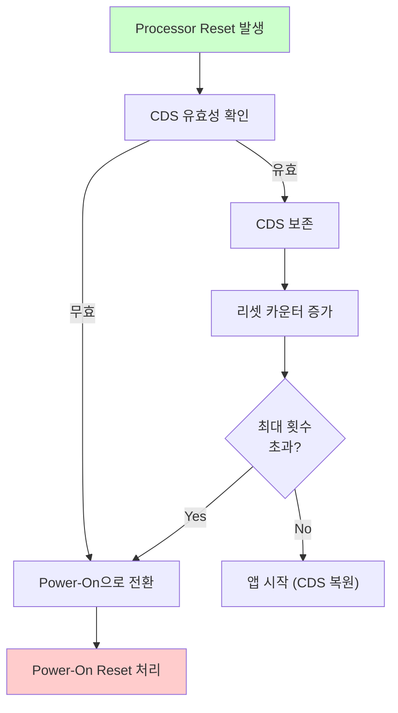
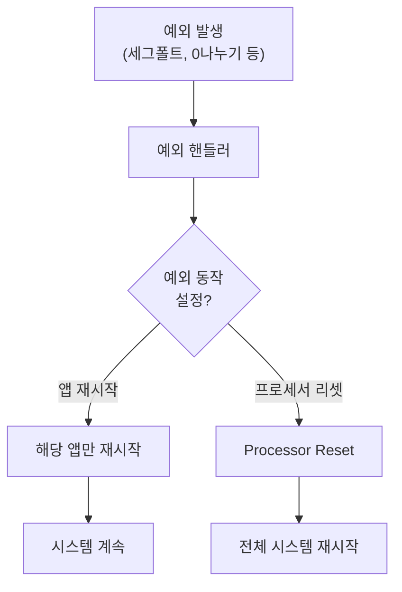
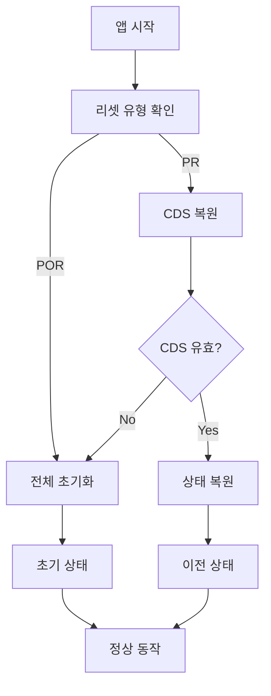
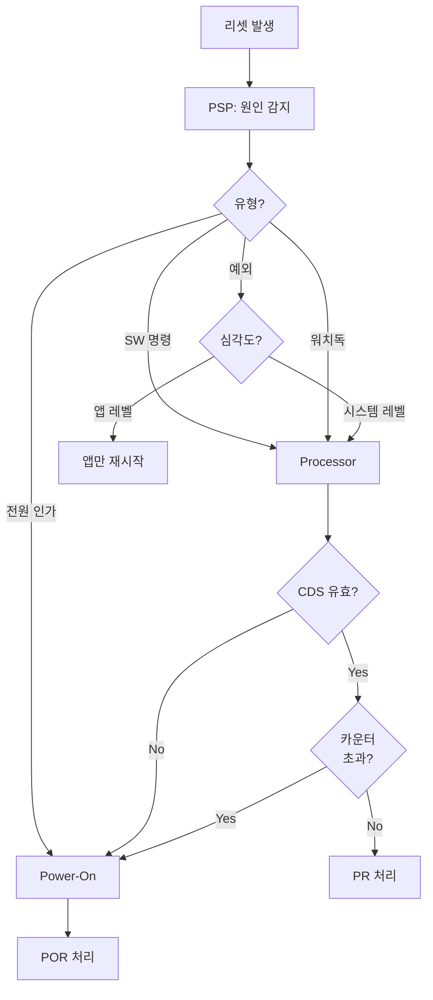

# Phase 2 ES-09: 리셋 유형과 처리

## 서론

우주 비행 소프트웨어에서 리셋은 시스템 복구와 유지보수를 위한 핵심 메커니즘이다. 리셋은 다양한 원인으로 발생할 수 있으며, 각 유형에 따라 다른 처리가 필요하다. Executive Services(ES)는 이러한 리셋들을 감지하고, 적절히 처리하며, 관련 정보를 기록한다.

본 문서에서는 cFE에서 지원하는 리셋 유형들, 각 유형의 특성, 리셋 처리 과정, 그리고 리셋 관련 API를 상세히 살펴본다.

---

## 1. 리셋 유형 분류

### 1.1 주요 리셋 유형

cFE는 크게 두 가지 유형의 리셋을 구분한다:



### 1.2 리셋 유형 상수

```c
/* 리셋 유형 */
#define CFE_PSP_RST_TYPE_POWERON    1  /* Power-on Reset */
#define CFE_PSP_RST_TYPE_PROCESSOR  2  /* Processor Reset */

/* 리셋 부유형 (상세 원인) */
#define CFE_PSP_RST_SUBTYPE_POWER_CYCLE     1  /* 전원 사이클 */
#define CFE_PSP_RST_SUBTYPE_PUSH_BUTTON     2  /* Reset 버튼 */
#define CFE_PSP_RST_SUBTYPE_HW_SPECIAL_CMD  3  /* 하드웨어 명령 */
#define CFE_PSP_RST_SUBTYPE_HW_WATCHDOG     4  /* 워치독 타임아웃 */
#define CFE_PSP_RST_SUBTYPE_RESET_COMMAND   5  /* 소프트웨어 명령 */
#define CFE_PSP_RST_SUBTYPE_EXCEPTION       6  /* 예외 발생 */
#define CFE_PSP_RST_SUBTYPE_UNDEFINED       7  /* 알 수 없음 */
#define CFE_PSP_RST_SUBTYPE_HWDEBUG         8  /* 하드웨어 디버그 */
#define CFE_PSP_RST_SUBTYPE_BANKSWITCH      9  /* 뱅크 스위치 */
```

### 1.3 리셋 유형 비교

| 특성 | Power-On Reset | Processor Reset |
|:---|:---:|:---:|
| **원인** | 전원 인가, 전원 사이클 | SW 명령, 워치독, 예외 |
| **RAM 상태** | 완전 초기화 | 일부 보존 (CDS 영역) |
| **CDS** | 초기화됨 | 보존됨 |
| **앱 상태** | 모두 시작 | 모두 시작 (CDS 복원) |
| **리셋 카운터** | 0으로 초기화 | 증가 |

---

## 2. Power-On Reset

Power-On Reset(POR)은 시스템이 완전히 새로운 상태에서 시작하는 것을 의미한다. 이 리셋 유형에서는 모든 메모리 영역이 초기화되며, CDS에 저장된 데이터도 유효하지 않은 것으로 취급된다. Power-On Reset은 가장 철저한 형태의 리셋으로, 시스템을 마치 처음 전원이 인가된 것처럼 깨끗한 상태로 만든다.

### 2.1 발생 원인

Power-On Reset은 다양한 상황에서 발생할 수 있다. 가장 명확한 경우는 우주선에 최초로 전원이 인가될 때이다. 또한 전원 사이클, 즉 전원을 완전히 차단했다가 다시 인가하는 경우에도 Power-On Reset이 발생한다. 하드웨어 Reset 버튼을 누르거나 특수한 하드웨어 명령을 통해서도 이 유형의 리셋을 트리거할 수 있다.

중요한 점은 Processor Reset이 연속적으로 너무 많이 발생하면 시스템이 자동으로 Power-On Reset으로 전환된다는 것이다. 이는 반복적인 Processor Reset이 문제를 해결하지 못하는 상황에서 보다 철저한 초기화를 통해 시스템을 복구하려는 안전 메커니즘이다.

Power-On Reset이 발생하는 주요 상황은 다음과 같다:

- 최초 전원 인가
- 전원 사이클 (전원 끄고 켜기)
- 하드웨어 Reset 버튼
- 특수 하드웨어 명령
- Processor Reset 횟수 초과

### 2.2 시스템 동작

Power-On Reset이 발생하면 시스템은 완전한 초기화 과정을 거친다. 하드웨어 레벨에서 모든 레지스터와 메모리가 초기화되고, CDS 영역도 유효하지 않은 것으로 표시된다. 리셋 카운터는 0으로 초기화되어 새로운 세션이 시작됨을 나타낸다. 이 과정에서 이전 세션의 모든 상태 정보가 손실되므로, 애플리케이션들은 완전히 새로운 상태에서 시작해야 한다.



### 2.3 ES 처리

```c
void CFE_ES_Main(uint32 StartType, uint32 StartSubtype, ...)
{
    if (StartType == CFE_PSP_RST_TYPE_POWERON)
    {
        /*
        ** Power-On Reset 처리
        */
        CFE_ES_WriteToSysLog("ES: Power-On Reset detected\n");
        
        /* 리셋 영역 초기화 */
        CFE_ES_InitResetArea();
        
        /* CDS 초기화 */
        CFE_ES_InitCDS();
        
        /* 리셋 카운터 초기화 */
        CFE_ES_Global.ResetDataPtr->ProcessorResetCount = 0;
        
        /* 시스템 상태 초기화 */
        CFE_ES_Global.ResetDataPtr->ResetType = CFE_PSP_RST_TYPE_POWERON;
        CFE_ES_Global.ResetDataPtr->ResetSubtype = StartSubtype;
    }
    
    /* 이후 초기화 계속... */
}
```

---

## 3. Processor Reset

### 3.1 발생 원인

Processor Reset이 발생하는 상황:

- 지상 리셋 명령
- 워치독 타임아웃
- 심각한 예외 발생
- 앱으로부터의 리셋 요청

### 3.2 시스템 동작



### 3.3 ES 처리

```c
void CFE_ES_Main(uint32 StartType, uint32 StartSubtype, ...)
{
    if (StartType == CFE_PSP_RST_TYPE_PROCESSOR)
    {
        /*
        ** Processor Reset 처리
        */
        CFE_ES_WriteToSysLog("ES: Processor Reset detected\n");
        
        /* CDS 유효성 확인 */
        if (CFE_ES_ValidateCDS() != CFE_SUCCESS)
        {
            CFE_ES_WriteToSysLog("ES: CDS invalid, converting to POR\n");
            StartType = CFE_PSP_RST_TYPE_POWERON;
            CFE_ES_InitResetArea();
            CFE_ES_InitCDS();
        }
        else
        {
            /* 리셋 카운터 증가 */
            CFE_ES_Global.ResetDataPtr->ProcessorResetCount++;
            
            /* 최대 리셋 횟수 확인 */
            if (CFE_ES_Global.ResetDataPtr->ProcessorResetCount >=
                CFE_PLATFORM_ES_MAX_PROCESSOR_RESETS)
            {
                CFE_ES_WriteToSysLog("ES: Max resets exceeded, POR\n");
                StartType = CFE_PSP_RST_TYPE_POWERON;
                CFE_ES_InitResetArea();
                CFE_ES_InitCDS();
            }
        }
    }
}
```

---

## 4. 리셋 API

### 4.1 리셋 정보 조회

```c
/**
 * @brief 현재 리셋 유형 조회
 *
 * @param ResetSubtypePtr  리셋 부유형 반환 (NULL 가능)
 * @return 리셋 유형 (CFE_PSP_RST_TYPE_*)
 */
CFE_Status_t CFE_ES_GetResetType(uint32 *ResetSubtypePtr)
{
    if (ResetSubtypePtr != NULL)
    {
        *ResetSubtypePtr = CFE_ES_Global.ResetDataPtr->ResetSubtype;
    }
    
    return CFE_ES_Global.ResetDataPtr->ResetType;
}
```

### 4.2 사용 예시

```c
void MY_APP_CheckResetType(void)
{
    uint32 ResetType;
    uint32 ResetSubtype;
    
    ResetType = CFE_ES_GetResetType(&ResetSubtype);
    
    if (ResetType == CFE_PSP_RST_TYPE_POWERON)
    {
        CFE_EVS_SendEvent(MY_POR_EID,
                          CFE_EVS_EventType_INFORMATION,
                          "Starting after Power-On Reset");
        /* 전체 초기화 수행 */
        MY_APP_FullInit();
    }
    else  /* Processor Reset */
    {
        CFE_EVS_SendEvent(MY_PR_EID,
                          CFE_EVS_EventType_INFORMATION,
                          "Starting after Processor Reset (subtype %u)",
                          (unsigned int)ResetSubtype);
        /* CDS에서 복원 시도 */
        MY_APP_RestoreState();
    }
}
```

### 4.3 리셋 트리거

```c
/**
 * @brief cFE 리셋 요청
 *
 * cFE 시스템의 리셋을 트리거한다.
 *
 * @param ResetType  요청 리셋 유형
 * @return 이 함수는 반환하지 않음
 */
uint32 CFE_ES_ResetCFE(uint32 ResetType)
{
    CFE_ES_WriteToSysLog("ES: Reset requested, type=%u\n",
                         (unsigned int)ResetType);
    
    /* 리셋 유형 저장 */
    CFE_ES_Global.ResetDataPtr->ResetType = ResetType;
    
    /* PSP를 통해 실제 리셋 수행 */
    CFE_PSP_Restart(ResetType);
    
    /* 이 지점에 도달하면 안 됨 */
    return CFE_SUCCESS;
}
```

---

## 5. 리셋 카운터 관리

### 5.1 리셋 카운터 구조

```c
typedef struct {
    uint32 ResetType;               /* 마지막 리셋 유형 */
    uint32 ResetSubtype;            /* 마지막 리셋 부유형 */
    uint32 ProcessorResetCount;     /* 연속 Processor Reset 수 */
    uint32 MaxProcessorResetLimit;  /* 최대 허용 횟수 */
    uint32 BootSource;              /* 부트 소스 */
    /* ... */
} CFE_ES_ResetData_t;
```

### 5.2 최대 리셋 횟수

```c
/* 플랫폼 구성 */
#define CFE_PLATFORM_ES_MAX_PROCESSOR_RESETS  5
```


### 5.3 카운터 리셋

정상 운영이 확인되면 카운터를 리셋할 수 있다:

```c
/* ES 명령: CLEAR_ER_LOG_CC (ES 비상 리셋 로그 클리어) */
/* 또는 앱에서 정상 동작 확인 후 */

void MY_APP_ConfirmNormalOperation(void)
{
    /*
    ** 앱이 정상 동작 중임을 확인한 후
    ** (예: 일정 시간 동안 오류 없이 동작)
    */
    
    /* 
    ** 참고: 리셋 카운터 직접 리셋은 ES 명령을 통해
    ** 지상에서 수행하는 것이 일반적
    */
    CFE_EVS_SendEvent(MY_STABLE_EID,
                      CFE_EVS_EventType_INFORMATION,
                      "System stable, recommend reset counter clear if needed");
}
```

---

## 6. 예외 기반 리셋

### 6.1 예외 발생 시 리셋

앱에서 심각한 예외가 발생하면 리셋될 수 있다:



### 6.2 예외 동작 설정

Startup script에서 설정:

```text
! ExceptionAction: 0 = 앱 재시작, 1 = 프로세서 리셋
!
! 중요 앱: 예외 시 전체 리셋
CFE_APP, /cf/critical_app.so, CRIT_Main, CRIT_APP, 50, 16384, 0x0, 1;
!
! 일반 앱: 예외 시 앱만 재시작
CFE_APP, /cf/normal_app.so, NORM_Main, NORM_APP, 50, 16384, 0x0, 0;
```

---

## 7. 리셋 로그

### 7.1 Exception & Reset (ER) Log

ES는 예외와 리셋 정보를 로그에 기록한다:

```c
typedef struct {
    uint32 LogEntryType;            /* 엔트리 유형 */
    uint32 ResetType;               /* 리셋 유형 */
    uint32 ResetSubtype;            /* 리셋 부유형 */
    uint32 BootSource;              /* 부트 소스 */
    uint32 ProcessorResetCount;     /* 리셋 카운터 */
    char   Description[CFE_MISSION_MAX_ER_LOG_DESCRIPTION];
    CFE_TIME_SysTime_t TimeCode;    /* 발생 시간 */
    uint32 ContextSize;             /* 컨텍스트 크기 */
    uint32 Context[CFE_PLATFORM_ES_ER_LOG_MAX_CONTEXT_SIZE];
} CFE_ES_ERLog_Entry_t;
```

### 7.2 로그 조회

```c
/* ES 명령으로 로그 덤프 */
/* WRITE_ER_LOG_CC - ER 로그를 파일로 출력 */

/* 또는 Housekeeping에서 요약 정보 */
typedef struct {
    uint32 ERLogIndex;       /* 현재 로그 인덱스 */
    uint32 ERLogEntries;     /* 총 엔트리 수 */
    /* ... */
} CFE_ES_HousekeepingTlm_Payload_t;
```

---

## 8. 리셋 복구 전략

### 8.1 앱 리셋 복구 패턴

```c
CFE_Status_t MY_APP_Init(void)
{
    CFE_Status_t Status;
    uint32 ResetType;
    
    /* 리셋 유형 확인 */
    ResetType = CFE_ES_GetResetType(NULL);
    
    /* 공통 초기화 */
    MY_APP_CommonInit();
    
    if (ResetType == CFE_PSP_RST_TYPE_POWERON)
    {
        /*
        ** Power-On Reset: 완전 초기화
        */
        MY_APP_FullInitialization();
    }
    else
    {
        /*
        ** Processor Reset: CDS 복원 시도
        */
        Status = MY_APP_RestoreFromCDS();
        
        if (Status != CFE_SUCCESS)
        {
            /* 복원 실패 - 기본값 사용 */
            MY_APP_FullInitialization();
        }
    }
    
    return CFE_SUCCESS;
}
```

### 8.2 상태 머신 복원



---

## 9. 정리: 리셋 관련 요약

### 9.1 리셋 유형 결정 흐름



### 9.2 API 요약

| 함수 | 용도 |
|:---|:---|
| `CFE_ES_GetResetType()` | 리셋 유형 조회 |
| `CFE_ES_ResetCFE()` | cFE 리셋 트리거 |
| `CFE_PSP_Restart()` | PSP 레벨 리셋 (내부) |

---

## 결론

cFE의 리셋 처리 시스템은 다양한 리셋 상황에서 적절한 복구를 가능하게 한다. Power-On Reset은 완전한 초기화를, Processor Reset은 CDS를 보존하면서 빠른 복구를 제공한다.

효과적인 리셋 복구를 위해:
- 시작 시 리셋 유형을 확인하여 적절한 초기화 수행
- CDS를 활용하여 Processor Reset 시 상태 복원
- 연속 리셋에 대한 보호 메커니즘 활용
- 예외 동작을 앱의 중요도에 맞게 설정

다음 문서에서는 ES의 시스템 로그와 성능 모니터링 기능을 살펴볼 것이다.

---

## 참고 문헌

1. NASA, "cFE User's Guide"
2. NASA cFE GitHub, cfe/modules/es/fsw/src/cfe_es_start.c
3. NASA, "PSP API Reference"

---

[이전 문서: Phase 2 ES-08: Critical Data Store](./Phase2_ES_08_Critical_Data_Store.md)

[다음 문서: Phase 2 ES-10: 시스템 로그와 성능 모니터링](./Phase2_ES_10_시스템_로그와_성능_모니터링.md)
