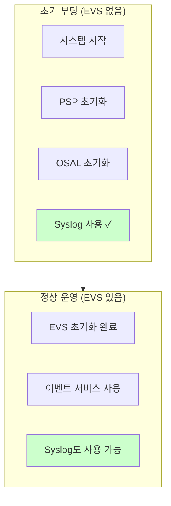
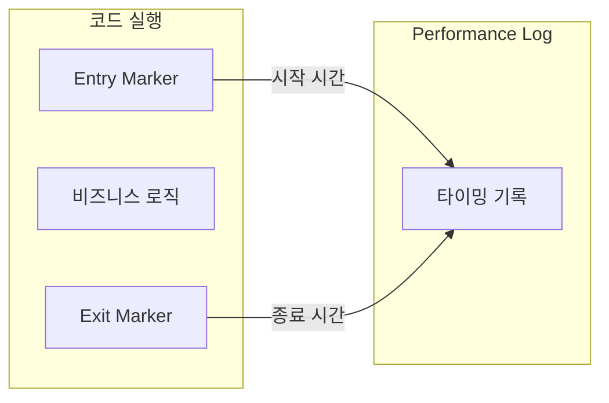
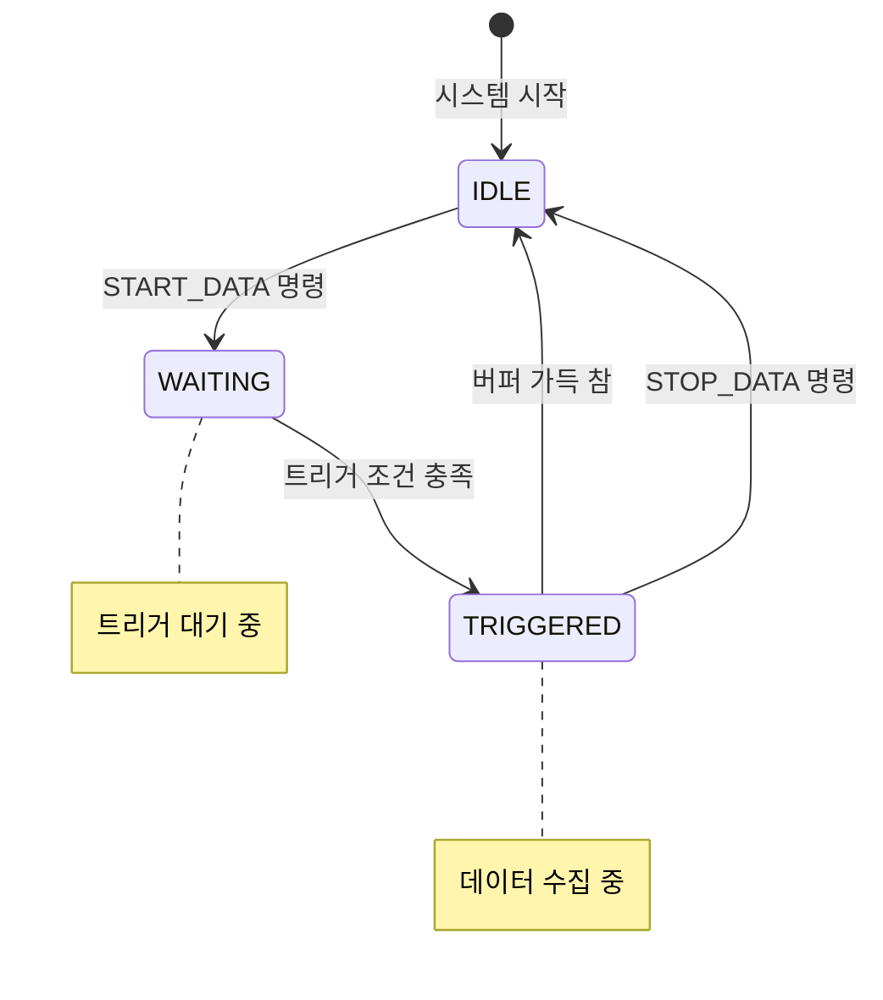
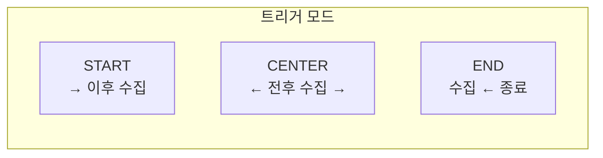

# Phase 2 ES-10: 시스템 로그와 성능 모니터링

## 서론

비행 소프트웨어의 운영과 디버깅에 있어 로깅과 성능 모니터링은 필수적인 기능이다. Executive Services(ES)는 두 가지 핵심 기능을 제공한다: 저수준 시스템 로그(Syslog)와 성능 분석을 위한 Performance Log이다.

본 문서에서는 이 두 가지 기능의 구조와 사용 방법을 상세히 살펴본다.

---

## 1. 시스템 로그 (Syslog)

시스템 로그는 cFE의 가장 기본적인 로깅 메커니즘이다. EVS(Event Services)가 아직 초기화되지 않은 부팅 초기 단계에서도 바로 사용할 수 있으며, 시스템 에러나 중요한 상태 변동을 기록하는 데 필수적인 역할을 한다. 일반적인 애플리케이션 로깅을 위해서는 EVS를 사용하는 것이 권장되지만, EVS가 사용 불가능한 상황에서는 Syslog가 유일한 로깅 수단이다.

### 1.1 Syslog의 역할

Syslog는 시스템의 저수준 로깅을 담당한다. EVS가 아직 초기화되지 않은 부팅 시퀀스 초반에도 사용 가능하다는 것이 핵심 특징이다. PSP와 OSAL 초기화 단계에서 발생하는 용이나 오류는 EVS로 보고할 수 없으므로, Syslog를 통해 기록되어야 한다. 정상 운영 중에는 EVS 이벤트를 사용하는 것이 바람직하지만, 심각한 오류 상황에서는 Syslog도 함께 사용할 수 있다.

Syslog는 EVS(Event Services)가 초기화되기 전에도 사용할 수 있는 저수준 로깅 메커니즘이다.



### 1.2 Syslog 버퍼 구조

```c
/* Syslog 설정 */
#define CFE_PLATFORM_ES_SYSTEM_LOG_SIZE  3072  /* 버퍼 크기 */

/* Syslog 관리 구조 */
typedef struct {
    char    LogData[CFE_PLATFORM_ES_SYSTEM_LOG_SIZE];  /* 로그 버퍼 */
    size_t  EndIdx;          /* 다음 쓰기 위치 */
    size_t  Size;            /* 사용된 크기 */
    uint32  Mode;            /* 로그 모드 */
} CFE_ES_SysLogState_t;

/* 로그 모드 */
#define CFE_ES_SYS_LOG_OVERWRITE  0  /* 가득 차면 덮어쓰기 */
#define CFE_ES_SYS_LOG_DISCARD    1  /* 가득 차면 버리기 */
```

### 1.3 CFE_ES_WriteToSysLog 함수

```c
/**
 * @brief 시스템 로그에 메시지 기록
 *
 * printf 스타일의 포맷 문자열을 시스템 로그에 기록한다.
 * EVS가 초기화되기 전에도 사용 가능하다.
 *
 * @param SpecStringPtr  포맷 문자열
 * @param ...            가변 인수
 *
 * @return 기록된 문자 수
 */
int32 CFE_ES_WriteToSysLog(const char *SpecStringPtr, ...)
{
    va_list ArgPtr;
    char    TmpBuffer[CFE_ES_MAX_SYSLOG_MSG_SIZE];
    size_t  MsgLen;
    int32   RetVal;
    
    /*
    ** 포맷 문자열 처리
    */
    va_start(ArgPtr, SpecStringPtr);
    MsgLen = vsnprintf(TmpBuffer, sizeof(TmpBuffer), 
                       SpecStringPtr, ArgPtr);
    va_end(ArgPtr);
    
    /*
    ** 타임스탬프 추가
    */
    CFE_ES_SysLogAddTimestamp(TmpBuffer, sizeof(TmpBuffer));
    
    /*
    ** 버퍼에 기록
    */
    RetVal = CFE_ES_SysLogAppend(TmpBuffer, MsgLen);
    
    /*
    ** 콘솔에도 출력 (개발 환경)
    */
    OS_printf("%s", TmpBuffer);
    
    return RetVal;
}
```

### 1.4 사용 예시

```c
/* ES 초기화 중 */
CFE_ES_WriteToSysLog("ES Startup: Beginning initialization\n");

/* 오류 발생 시 */
CFE_ES_WriteToSysLog("ES Error: Failed to load app %s, RC=0x%08X\n",
                     AppName, (unsigned int)Status);

/* 상태 보고 */
CFE_ES_WriteToSysLog("ES: System state changed to %d\n",
                     (int)CFE_ES_Global.SystemState);
```

### 1.5 Syslog 관리 명령

| 명령 | 설명 |
|:---|:---|
| `WRITE_SYSLOG` | Syslog를 파일로 출력 |
| `CLEAR_SYSLOG` | Syslog 버퍼 클리어 |
| `SET_SYSLOG_MODE` | 로그 모드 설정 (덮어쓰기/버리기) |

---

## 2. 성능 모니터링 (Performance Log)

성능 모니터링은 비행 소프트웨어의 실시간 동작을 분석하는 데 필수적인 도구이다. 코드의 특정 구간이 얼마나 걸리는지, 태스크들이 어떤 순서로 실행되는지, 그리고 시스템이 실시간 데드라인을 충족하는지 여부를 확인할 수 있다. ES는 이를 위해 Performance Log 기능을 제공한다.

### 2.1 Performance Log 개요

Performance Log는 코드 실행 시간을 정밀하게 측정하는 기능이다. 개발자는 측정하고자 하는 코드 구간의 시작과 끝에 마커를 삽입하고, ES는 이 마커들의 타임스탬프를 기록한다. 수집된 데이터는 지상 도구를 통해 분석되어 태스크 스케줄링, 실행 시간 통계, 타이밍 다이어그램 등을 생성한다.

Performance Log는 코드 실행 시간을 측정하고 분석하는 기능이다.



### 2.2 성능 마커 API

```c
/**
 * @brief 성능 엔트리 마커
 *
 * 코드 구간 시작 시 호출한다.
 * 현재 타임스탬프와 마커 ID를 기록한다.
 *
 * @param Marker  마커 식별자 (0 ~ CFE_MISSION_ES_PERF_MAX_IDS-1)
 */
void CFE_ES_PerfLogEntry(uint32 Marker)
{
    CFE_ES_PerfLogRecord_t *RecordPtr;
    
    /* 성능 로깅이 활성화되어 있는지 확인 */
    if (CFE_ES_Global.PerfLogState.State != CFE_ES_PERF_IDLE)
    {
        RecordPtr = CFE_ES_GetNextPerfRecord();
        
        if (RecordPtr != NULL)
        {
            RecordPtr->Marker = Marker;
            RecordPtr->Type = CFE_ES_PERF_ENTRY;
            RecordPtr->TimeStamp = CFE_PSP_GetTimeValue();
        }
        
        /* 트리거 체크 */
        CFE_ES_PerfCheckTrigger(Marker, CFE_ES_PERF_ENTRY);
    }
}

/**
 * @brief 성능 엑시트 마커
 *
 * 코드 구간 종료 시 호출한다.
 *
 * @param Marker  마커 식별자 (Entry와 동일해야 함)
 */
void CFE_ES_PerfLogExit(uint32 Marker)
{
    CFE_ES_PerfLogRecord_t *RecordPtr;
    
    if (CFE_ES_Global.PerfLogState.State != CFE_ES_PERF_IDLE)
    {
        RecordPtr = CFE_ES_GetNextPerfRecord();
        
        if (RecordPtr != NULL)
        {
            RecordPtr->Marker = Marker;
            RecordPtr->Type = CFE_ES_PERF_EXIT;
            RecordPtr->TimeStamp = CFE_PSP_GetTimeValue();
        }
        
        CFE_ES_PerfCheckTrigger(Marker, CFE_ES_PERF_EXIT);
    }
}
```

### 2.3 마커 정의

각 앱은 고유한 마커 ID를 정의해야 한다:

```c
/* 애플리케이션 성능 마커 정의 */

/* 미션 레벨 정의 (mission_cfg.h) */
#define CFE_MISSION_ES_PERF_MAX_IDS  128

/* 앱별 마커 정의 (앱_perfids.h) */
#define MY_APP_MAIN_PERF_ID      50
#define MY_APP_PROCESS_PERF_ID   51
#define MY_APP_SENSOR_PERF_ID    52
```

### 2.4 사용 예시

```c
void MY_APP_Main(void)
{
    /* 초기화... */
    
    while (CFE_ES_RunLoop(&RunStatus))
    {
        /* 메인 루프 시작 마킹 */
        CFE_ES_PerfLogEntry(MY_APP_MAIN_PERF_ID);
        
        /* 메시지 대기 */
        Status = CFE_SB_ReceiveBuffer(&BufPtr, PipeId, 
                                      CFE_SB_PEND_FOREVER);
        
        if (Status == CFE_SUCCESS)
        {
            /* 메시지 처리 시작 마킹 */
            CFE_ES_PerfLogEntry(MY_APP_PROCESS_PERF_ID);
            
            MY_APP_ProcessMsg(BufPtr);
            
            /* 메시지 처리 종료 마킹 */
            CFE_ES_PerfLogExit(MY_APP_PROCESS_PERF_ID);
        }
        
        /* 메인 루프 종료 마킹 */
        CFE_ES_PerfLogExit(MY_APP_MAIN_PERF_ID);
    }
}
```

### 2.5 Performance Log 제어



| 명령 | 설명 |
|:---|:---|
| `PERF_SETFILTER` | 필터 마스크 설정 |
| `PERF_SETTRIGGER` | 트리거 마스크 설정 |
| `PERF_STARTDATA` | 성능 데이터 수집 시작 |
| `PERF_STOPDATA` | 성능 데이터 수집 중지 및 파일 출력 |

---

## 3. 성능 데이터 분석

수집된 성능 데이터는 바이너리 파일로 저장되며, 지상의 분석 도구를 통해 시각화된다. NASA는 이 데이터를 처리하는 다양한 도구를 제공하며, 태스크 실행 타임라인, 실행 시간 통계, 스케줄링 분석 등을 수행할 수 있다.

### 3.1 데이터 형식

각 성능 로그 엔트리는 마커 ID, 엔트리 유형(ENTRY 또는 EXIT), 그리고 타임스탬프를 포함한다. 이 간단한 구조로도 많은 정보를 도출할 수 있다. 동일한 마커의 ENTRY와 EXIT 사이의 시간 차이는 해당 코드 구간의 실행 시간을 나타내며, 여러 마커들의 관계를 분석하면 태스크 간 상호작용과 스케줄링 패턴을 파악할 수 있다.

```c
/* 성능 로그 엔트리 */
typedef struct {
    uint32 Marker;          /* 마커 ID */
    uint32 Type;            /* ENTRY(1) 또는 EXIT(2) */
    uint64 TimeStamp;       /* 타임스탬프 (틱) */
} CFE_ES_PerfLogRecord_t;
```

### 3.2 분석 도구

NASA는 성능 데이터를 분석하기 위한 지상 도구를 제공한다:

```
성능 데이터 파일 (.dat)
         ↓
    분석 도구
         ↓
    ┌─────────────────┐
    │ 실행 시간 통계   │
    │ - 최소/최대/평균  │
    │ - 히스토그램     │
    └─────────────────┘
    ┌─────────────────┐
    │ 타이밍 다이어그램 │
    │ - 태스크 스케줄  │
    │ - 메시지 흐름   │
    └─────────────────┘
```

### 3.3 시각화 예시

```mermaid
gantt
    title 태스크 실행 타이밍
    dateFormat X
    axisFormat %L
    
    section SCH
    Frame Start        :f1, 0, 5
    Frame End          :milestone, 1000, 0
    
    section App A
    Processing         :a1, 10, 30
    Processing         :a2, 210, 30
    Processing         :a3, 410, 30
    
    section App B
    Processing         :b1, 50, 100
    Processing         :b2, 550, 100
```



---

## 4. 필터와 트리거

### 4.1 필터 마스크

어떤 마커를 기록할지 선택:

```c
/* 필터 마스크 설정 */
#define CFE_PLATFORM_ES_PERF_FILTERMASK_SIZE  4  /* 128 비트 마스크 */

typedef struct {
    uint32 FilterMask[CFE_PLATFORM_ES_PERF_FILTERMASK_SIZE];
} CFE_ES_PerfFilterMask_t;

/* 특정 마커 활성화 */
void EnableMarker(uint32 Marker)
{
    uint32 MaskIdx = Marker / 32;
    uint32 BitPos = Marker % 32;
    
    CFE_ES_Global.PerfLogState.FilterMask[MaskIdx] |= (1 << BitPos);
}
```

### 4.2 트리거 메커니즘

특정 마커가 발생할 때 데이터 수집 시작:

```c
typedef enum {
    CFE_ES_PERF_TRIGGER_START,  /* 트리거 시 수집 시작 */
    CFE_ES_PERF_TRIGGER_CENTER, /* 트리거를 중심으로 수집 */
    CFE_ES_PERF_TRIGGER_END     /* 트리거 시 수집 종료 */
} CFE_ES_PerfTriggerMode_t;
```



---

## 5. Generic Counter

### 5.1 Generic Counter 개요

ES는 앱이 사용할 수 있는 범용 카운터를 제공한다:

```c
/**
 * @brief Generic Counter 등록
 *
 * @param CounterIdPtr  카운터 ID 반환
 * @param CounterName   카운터 이름
 *
 * @return CFE_SUCCESS 성공
 */
CFE_Status_t CFE_ES_RegisterGenCounter(
    CFE_ES_CounterId_t *CounterIdPtr,
    const char *CounterName);

/**
 * @brief Generic Counter 증가
 *
 * @param CounterId  카운터 ID
 * @return CFE_SUCCESS 성공
 */
CFE_Status_t CFE_ES_IncrementGenCounter(CFE_ES_CounterId_t CounterId);

/**
 * @brief Generic Counter 값 설정
 *
 * @param CounterId  카운터 ID
 * @param Count      설정할 값
 * @return CFE_SUCCESS 성공
 */
CFE_Status_t CFE_ES_SetGenCount(CFE_ES_CounterId_t CounterId, 
                                 uint32 Count);

/**
 * @brief Generic Counter 값 조회
 *
 * @param CounterId  카운터 ID
 * @param Count      현재 값 반환
 * @return CFE_SUCCESS 성공
 */
CFE_Status_t CFE_ES_GetGenCount(CFE_ES_CounterId_t CounterId,
                                 uint32 *Count);
```

### 5.2 사용 예시

```c
CFE_ES_CounterId_t MY_APP_MsgCounter;

CFE_Status_t MY_APP_Init(void)
{
    /* 카운터 등록 */
    CFE_ES_RegisterGenCounter(&MY_APP_MsgCounter, "MY_APP_MSGS");
    
    return CFE_SUCCESS;
}

void MY_APP_ProcessMsg(void)
{
    /* 메시지 처리 */
    
    /* 카운터 증가 */
    CFE_ES_IncrementGenCounter(MY_APP_MsgCounter);
}
```

---

## 6. 정리

### 6.1 로깅/모니터링 API 요약

| 함수 | 용도 |
|:---|:---|
| `CFE_ES_WriteToSysLog()` | 시스템 로그 기록 |
| `CFE_ES_PerfLogEntry()` | 성능 마커 시작 |
| `CFE_ES_PerfLogExit()` | 성능 마커 종료 |
| `CFE_ES_RegisterGenCounter()` | 카운터 등록 |
| `CFE_ES_IncrementGenCounter()` | 카운터 증가 |
| `CFE_ES_GetGenCount()` | 카운터 조회 |

### 6.2 사용 가이드라인

| 기능 | 사용 시점 |
|:---|:---|
| **Syslog** | EVS 초기화 전, 심각한 오류 |
| **EVS** | 정상 운영 중 이벤트 (권장) |
| **Performance Log** | 성능 분석/디버깅 필요 시 |
| **Generic Counter** | 통계 수집 |

---

## 결론

ES의 로깅과 성능 모니터링 기능은 비행 소프트웨어의 운영과 디버깅에 필수적인 도구이다. Syslog는 부팅 초기나 EVS가 없는 상황에서도 로깅이 가능하게 하고, Performance Log는 실시간 성능 분석을 위한 정밀한 타이밍 데이터를 제공한다.

효과적인 활용을 위해:
- EVS가 없는 상황에서만 Syslog 사용
- 성능이 중요한 구간에 Performance 마커 배치
- 지상 도구를 활용한 체계적인 성능 분석

다음 문서에서는 ES의 명령과 텔레메트리 인터페이스를 살펴볼 것이다.

---

## 참고 문헌

1. NASA, "cFE Application Developer's Guide"
2. NASA cFE GitHub, cfe/modules/es/fsw/src/cfe_es_syslog.c
3. NASA, "ES Performance Monitor User's Guide"

---

[이전 문서: Phase 2 ES-09: 리셋 유형과 처리](./Phase2_ES_09_리셋_유형과_처리.md)

[다음 문서: Phase 2 ES-11: ES 명령 및 텔레메트리](./Phase2_ES_11_ES_명령_및_텔레메트리.md)
