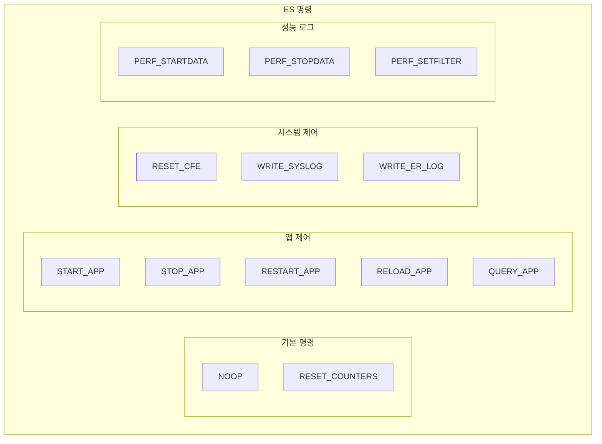
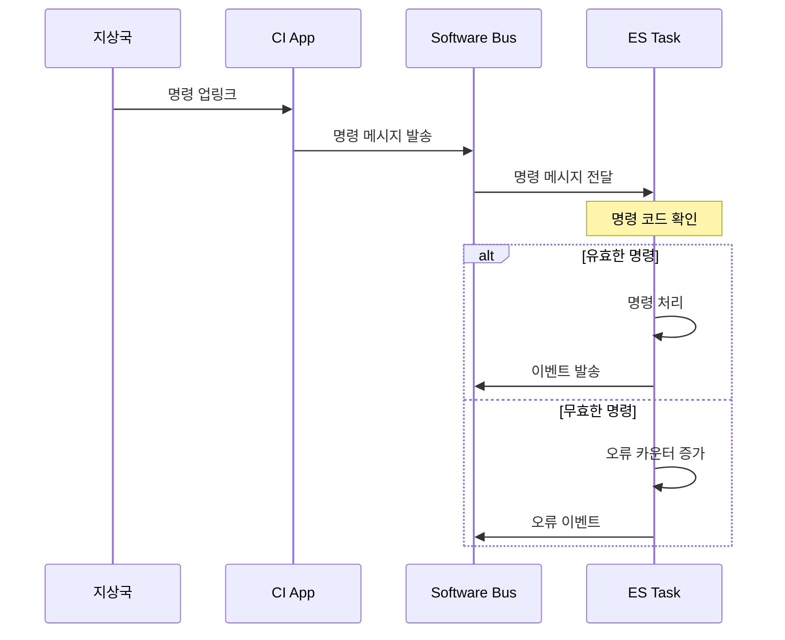

# Phase 2 ES-11: ES 명령 및 텔레메트리

## 서론

Executive Services(ES)는 지상국과의 인터페이스를 위해 다양한 명령과 텔레메트리를 제공한다. 이러한 인터페이스를 통해 지상에서 시스템을 모니터링하고, 앱을 제어하며, 진단 정보를 수집할 수 있다.

본 문서에서는 ES가 처리하는 명령과 생성하는 텔레메트리 패킷을 상세히 살펴본다.

---

## 1. ES 명령 개요

### 1.1 명령 분류

ES 명령은 기능에 따라 다음과 같이 분류된다:



### 1.2 명령 메시지 구조

```c
/* ES 명령 코드 */
typedef enum {
    CFE_ES_NOOP_CC                = 0,
    CFE_ES_RESET_COUNTERS_CC      = 1,
    CFE_ES_RESTART_CC             = 2,
    /* ... */
} CFE_ES_CmdCode_t;

/* 명령 기본 구조 */
typedef struct {
    CFE_MSG_CommandHeader_t CommandHeader;
    /* 명령별 페이로드 */
} CFE_ES_XXXCmd_t;
```

---

## 2. 기본 명령

### 2.1 NOOP (No Operation)

통신 확인용 명령으로, 아무 동작도 하지 않는다.

```c
/* 명령 코드: 0 */
typedef struct {
    CFE_MSG_CommandHeader_t CommandHeader;
} CFE_ES_NoopCmd_t;

/* 처리 */
void CFE_ES_NoopCmd(const CFE_ES_NoopCmd_t *Cmd)
{
    CFE_ES_Global.CommandCounter++;
    
    CFE_EVS_SendEvent(CFE_ES_NOOP_INF_EID,
                      CFE_EVS_EventType_INFORMATION,
                      "No-op command. cFE Version %d.%d.%d.%d",
                      CFE_MAJOR_VERSION, CFE_MINOR_VERSION,
                      CFE_REVISION, CFE_MISSION_REV);
}
```

### 2.2 RESET_COUNTERS

ES 내부 카운터를 리셋한다.

```c
/* 명령 코드: 1 */
typedef struct {
    CFE_MSG_CommandHeader_t CommandHeader;
} CFE_ES_ResetCountersCmd_t;

/* 처리 */
void CFE_ES_ResetCountersCmd(const CFE_ES_ResetCountersCmd_t *Cmd)
{
    CFE_ES_Global.CommandCounter = 0;
    CFE_ES_Global.CommandErrorCounter = 0;
    
    CFE_EVS_SendEvent(CFE_ES_RESET_INF_EID,
                      CFE_EVS_EventType_INFORMATION,
                      "Reset Counters command");
}
```

---

## 3. 애플리케이션 제어 명령

### 3.1 START_APP

새 애플리케이션을 시작한다.

```c
/* 명령 페이로드 */
typedef struct {
    char    Application[CFE_MISSION_MAX_API_LEN];  /* 앱 이름 */
    char    AppEntryPoint[CFE_MISSION_MAX_API_LEN]; /* 진입점 */
    char    AppFileName[CFE_MISSION_MAX_PATH_LEN];  /* 파일 경로 */
    size_t  StackSize;     /* 스택 크기 */
    uint16  Priority;      /* 우선순위 */
    uint16  ExceptionAction; /* 예외 동작 */
} CFE_ES_StartAppCmd_Payload_t;

typedef struct {
    CFE_MSG_CommandHeader_t CommandHeader;
    CFE_ES_StartAppCmd_Payload_t Payload;
} CFE_ES_StartAppCmd_t;
```

### 3.2 STOP_APP

실행 중인 앱을 중지하고 제거한다.

```c
typedef struct {
    char Application[CFE_MISSION_MAX_API_LEN];
} CFE_ES_StopAppCmd_Payload_t;

typedef struct {
    CFE_MSG_CommandHeader_t CommandHeader;
    CFE_ES_StopAppCmd_Payload_t Payload;
} CFE_ES_StopAppCmd_t;
```

### 3.3 RESTART_APP

앱을 재시작한다 (같은 파일에서).

```c
typedef struct {
    char Application[CFE_MISSION_MAX_API_LEN];
} CFE_ES_RestartAppCmd_Payload_t;
```

### 3.4 RELOAD_APP

다른 파일에서 앱을 재로드한다.

```c
typedef struct {
    char Application[CFE_MISSION_MAX_API_LEN];
    char AppFileName[CFE_MISSION_MAX_PATH_LEN];
} CFE_ES_ReloadAppCmd_Payload_t;
```

### 3.5 QUERY_ONE_APP

특정 앱의 정보를 조회한다.

```c
typedef struct {
    char Application[CFE_MISSION_MAX_API_LEN];
} CFE_ES_QueryOneAppCmd_Payload_t;
```

### 3.6 QUERY_ALL_APPS

모든 앱 정보를 파일로 덤프한다.

```c
typedef struct {
    char FileName[CFE_MISSION_MAX_PATH_LEN];
} CFE_ES_QueryAllAppsCmd_Payload_t;
```

---

## 4. 시스템 제어 명령

### 4.1 RESTART (Reset cFE)

cFE 시스템을 리셋한다.

```c
typedef struct {
    uint16 RestartType;  /* 1=Power-On, 2=Processor */
} CFE_ES_RestartCmd_Payload_t;

typedef struct {
    CFE_MSG_CommandHeader_t CommandHeader;
    CFE_ES_RestartCmd_Payload_t Payload;
} CFE_ES_RestartCmd_t;

/* 처리 */
void CFE_ES_RestartCmd(const CFE_ES_RestartCmd_t *Cmd)
{
    if (Cmd->Payload.RestartType == CFE_PSP_RST_TYPE_POWERON ||
        Cmd->Payload.RestartType == CFE_PSP_RST_TYPE_PROCESSOR)
    {
        CFE_EVS_SendEvent(CFE_ES_RESTART_INF_EID,
                          CFE_EVS_EventType_INFORMATION,
                          "Reset cFE command, type=%d",
                          (int)Cmd->Payload.RestartType);
        
        CFE_ES_ResetCFE(Cmd->Payload.RestartType);
    }
    else
    {
        CFE_ES_Global.CommandErrorCounter++;
    }
}
```

### 4.2 WRITE_SYSLOG

시스템 로그를 파일로 출력한다.

```c
typedef struct {
    char FileName[CFE_MISSION_MAX_PATH_LEN];
} CFE_ES_WriteSysLogCmd_Payload_t;
```

### 4.3 CLEAR_SYSLOG

시스템 로그를 클리어한다.

```c
typedef struct {
    CFE_MSG_CommandHeader_t CommandHeader;
} CFE_ES_ClearSysLogCmd_t;
```

### 4.4 WRITE_ER_LOG

Exception/Reset 로그를 파일로 출력한다.

```c
typedef struct {
    char FileName[CFE_MISSION_MAX_PATH_LEN];
} CFE_ES_WriteERLogCmd_Payload_t;
```

---

## 5. CDS 명령

### 5.1 DELETE_CDS

CDS 블록을 삭제한다.

```c
typedef struct {
    char CdsName[CFE_MISSION_ES_CDS_MAX_FULL_NAME_LEN];
} CFE_ES_DeleteCDSCmd_Payload_t;
```

### 5.2 DUMP_CDS_REGISTRY

CDS 레지스트리를 파일로 덤프한다.

```c
typedef struct {
    char FileName[CFE_MISSION_MAX_PATH_LEN];
} CFE_ES_DumpCDSRegistryCmd_Payload_t;
```

---

## 6. 성능 로그 명령

### 6.1 PERF_STARTDATA

성능 데이터 수집을 시작한다.

```c
typedef struct {
    uint32 TriggerMode;  /* START, CENTER, END */
} CFE_ES_StartPerfDataCmd_Payload_t;
```

### 6.2 PERF_STOPDATA

성능 데이터 수집을 중지하고 파일로 출력한다.

```c
typedef struct {
    char DataFileName[CFE_MISSION_MAX_PATH_LEN];
} CFE_ES_StopPerfDataCmd_Payload_t;
```

### 6.3 PERF_SETFILTER

필터 마스크를 설정한다.

```c
typedef struct {
    uint32 FilterMaskNum;  /* 마스크 인덱스 (0-3) */
    uint32 FilterMask;     /* 32비트 마스크 값 */
} CFE_ES_SetPerfFilterMaskCmd_Payload_t;
```

### 6.4 PERF_SETTRIGGER

트리거 마스크를 설정한다.

```c
typedef struct {
    uint32 TrigMaskNum;
    uint32 TrigMask;
} CFE_ES_SetPerfTriggerMaskCmd_Payload_t;
```

---

## 7. ES 텔레메트리

### 7.1 Housekeeping 텔레메트리

ES는 주기적으로 Housekeeping 패킷을 발송한다:

```c
typedef struct {
    /*
    ** 명령 통계
    */
    uint8   CommandCounter;
    uint8   CommandErrorCounter;
    
    /*
    ** 시스템 정보
    */
    uint16  CFECoreChecksum;          /* cFE 코어 체크섬 */
    uint8   CFEMajorVersion;
    uint8   CFEMinorVersion;
    uint8   CFERevision;
    uint8   CFEMissionRevision;
    
    uint8   OSALMajorVersion;
    uint8   OSALMinorVersion;
    uint8   OSALRevision;
    uint8   OSALMissionRevision;
    
    uint8   PSPMajorVersion;
    uint8   PSPMinorVersion;
    uint8   PSPRevision;
    uint8   PSPMissionRevision;
    
    /*
    ** 리셋 정보
    */
    uint32  ResetType;
    uint32  ResetSubtype;
    uint32  ProcessorResets;
    uint32  MaxProcessorResets;
    uint32  BootSource;
    
    /*
    ** 리소스 통계
    */
    uint32  PerfState;
    uint32  PerfMode;
    uint32  PerfTriggerCount;
    uint32  PerfFilterMask[4];
    uint32  PerfTriggerMask[4];
    uint32  PerfDataStart;
    uint32  PerfDataEnd;
    uint32  PerfDataCount;
    uint32  PerfDataToWrite;
    
    /*
    ** Syslog 정보
    */
    uint32  SysLogBytesUsed;
    uint32  SysLogSize;
    uint32  SysLogEntries;
    uint32  SysLogMode;
    
    /*
    ** ER Log 정보
    */
    uint32  ERLogIndex;
    uint32  ERLogEntries;
    
    /*
    ** 등록 리소스
    */
    uint32  RegisteredCoreApps;
    uint32  RegisteredExternalApps;
    uint32  RegisteredTasks;
    uint32  RegisteredLibs;
    
    /*
    ** Heap 정보
    */
    uint32  HeapBytesFree;
    uint32  HeapBlocksFree;
    uint32  HeapMaxBlockSize;
    
} CFE_ES_HousekeepingTlm_Payload_t;

typedef struct {
    CFE_MSG_TelemetryHeader_t TelemetryHeader;
    CFE_ES_HousekeepingTlm_Payload_t Payload;
} CFE_ES_HousekeepingTlm_t;
```

### 7.2 앱 정보 텔레메트리

QUERY_ONE_APP 명령에 대한 응답:

```c
typedef struct {
    CFE_ES_AppId_t AppId;
    uint32         Type;           /* CORE 또는 EXTERNAL */
    char           Name[CFE_MISSION_MAX_API_LEN];
    char           EntryPoint[CFE_MISSION_MAX_API_LEN];
    char           FileName[CFE_MISSION_MAX_PATH_LEN];
    
    size_t         StackSize;
    CFE_ES_MemAddress_t StartAddress;
    CFE_ES_MemAddress_t CodeSize;
    CFE_ES_MemAddress_t DataSize;
    CFE_ES_MemAddress_t BSSSize;
    
    uint16         Priority;
    uint16         ExceptionAction;
    
    osal_id_t      MainTaskId;
    char           MainTaskName[CFE_MISSION_MAX_API_LEN];
    
    uint32         ExecutionCounter;
    uint32         NumOfChildTasks;
    
    uint32         AddressesAreValid;
    
} CFE_ES_OneAppTlm_Payload_t;

typedef struct {
    CFE_MSG_TelemetryHeader_t TelemetryHeader;
    CFE_ES_OneAppTlm_Payload_t Payload;
} CFE_ES_OneAppTlm_t;
```

### 7.3 메모리 풀 통계 텔레메트리

```c
typedef struct {
    CFE_ES_MemHandle_t PoolHandle;
    CFE_ES_MemPoolStats_t PoolStats;
} CFE_ES_MemStatsTlm_Payload_t;
```

---

## 8. 명령 처리 구조

### 8.1 ES 명령 파이프라인



### 8.2 명령 디스패치

```c
void CFE_ES_TaskPipe(const CFE_SB_Buffer_t *BufPtr)
{
    CFE_MSG_FcnCode_t CommandCode;
    CFE_SB_MsgId_t MessageID;
    
    CFE_MSG_GetMsgId(&BufPtr->Msg, &MessageID);
    CFE_MSG_GetFcnCode(&BufPtr->Msg, &CommandCode);
    
    if (CFE_SB_MsgIdToValue(MessageID) == CFE_ES_CMD_MID)
    {
        switch (CommandCode)
        {
            case CFE_ES_NOOP_CC:
                CFE_ES_NoopCmd((const CFE_ES_NoopCmd_t *)BufPtr);
                break;
                
            case CFE_ES_RESET_COUNTERS_CC:
                CFE_ES_ResetCountersCmd((const CFE_ES_ResetCountersCmd_t *)BufPtr);
                break;
                
            case CFE_ES_START_APP_CC:
                CFE_ES_StartAppCmd((const CFE_ES_StartAppCmd_t *)BufPtr);
                break;
                
            /* ... 기타 명령 ... */
                
            default:
                CFE_ES_Global.CommandErrorCounter++;
                CFE_EVS_SendEvent(CFE_ES_CC1_ERR_EID,
                                  CFE_EVS_EventType_ERROR,
                                  "Invalid command code: %d",
                                  (int)CommandCode);
                break;
        }
    }
    else if (CFE_SB_MsgIdToValue(MessageID) == CFE_ES_SEND_HK_MID)
    {
        CFE_ES_HousekeepingCmd((const CFE_MSG_CommandHeader_t *)BufPtr);
    }
}
```

---

## 9. 정리: ES 명령 요약

| 명령 | CC | 설명 |
|:---|:---:|:---|
| NOOP | 0 | 통신 확인 |
| RESET_COUNTERS | 1 | 카운터 리셋 |
| RESTART | 2 | cFE 리셋 |
| START_APP | 4 | 앱 시작 |
| STOP_APP | 5 | 앱 중지 |
| RESTART_APP | 6 | 앱 재시작 |
| RELOAD_APP | 7 | 앱 재로드 |
| QUERY_ONE_APP | 8 | 앱 정보 조회 |
| QUERY_ALL_APPS | 9 | 모든 앱 덤프 |
| WRITE_SYSLOG | 10 | Syslog 출력 |
| CLEAR_SYSLOG | 11 | Syslog 클리어 |
| WRITE_ER_LOG | 12 | ER 로그 출력 |
| CLEAR_ER_LOG | 13 | ER 로그 클리어 |
| PERF_STARTDATA | 14 | 성능 수집 시작 |
| PERF_STOPDATA | 15 | 성능 수집 중지 |
| PERF_SETFILTER | 16 | 성능 필터 설정 |
| PERF_SETTRIGGER | 17 | 성능 트리거 설정 |

---

## 결론

ES의 명령/텔레메트리 인터페이스는 지상에서 비행 소프트웨어를 제어하고 모니터링하는 핵심 수단이다. 앱 관리, 시스템 제어, 진단 정보 수집 등 다양한 기능을 제공한다.

다음 문서에서는 ES의 주요 API 함수들을 종합적으로 분석하고 정리할 것이다.

---

## 참고 문헌

1. NASA, "cFE User's Guide"
2. NASA cFE GitHub, cfe/modules/es/fsw/src/cfe_es_task.c
3. NASA, "ES Command & Telemetry Reference"

---

[이전 문서: Phase 2 ES-10: 시스템 로그와 성능 모니터링](./Phase2_ES_10_시스템_로그와_성능_모니터링.md)

[다음 문서: Phase 2 ES-12: ES 주요 API 함수 분석](./Phase2_ES_12_ES_주요_API_함수_분석.md)
