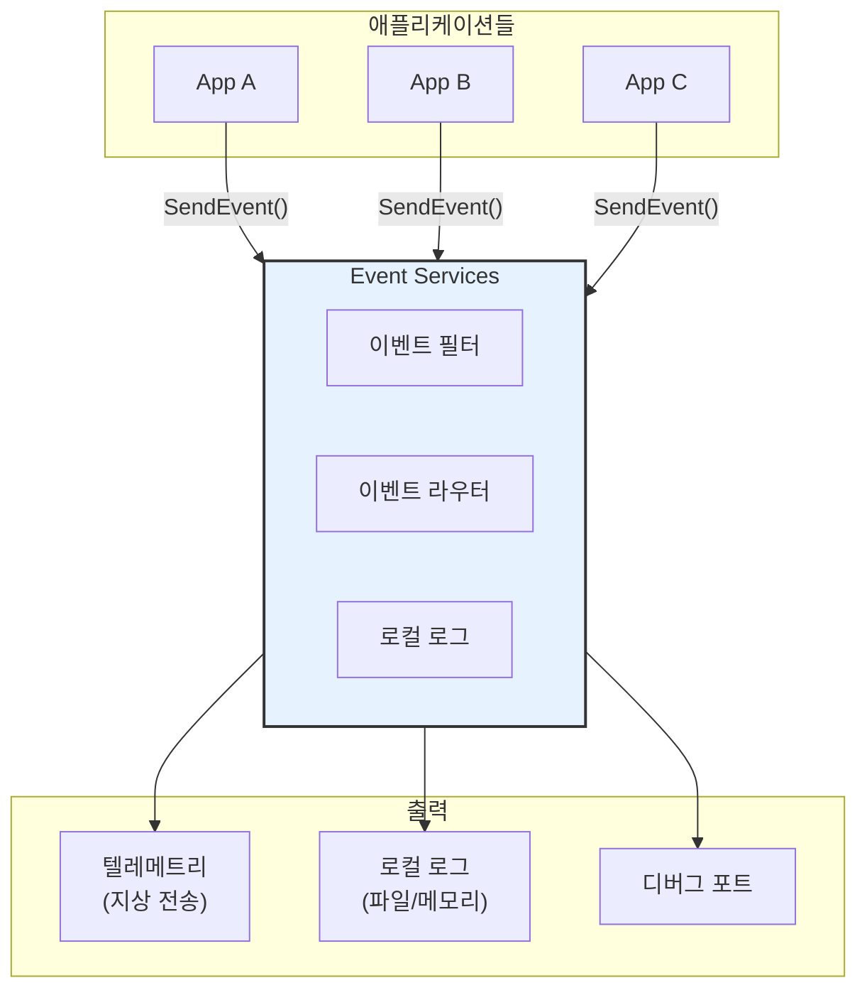
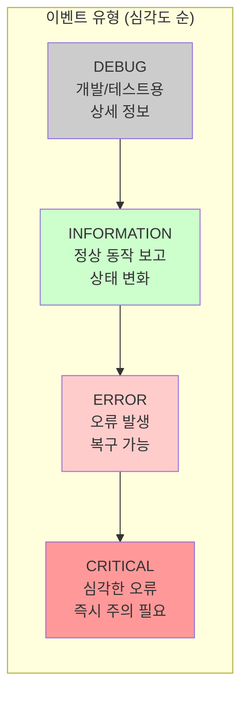
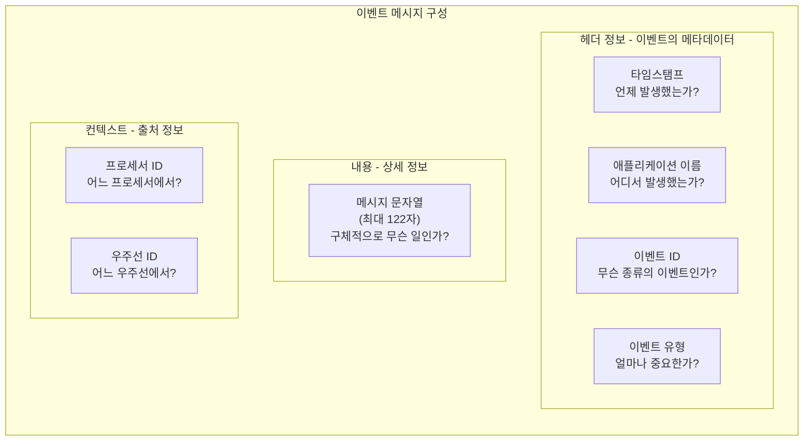
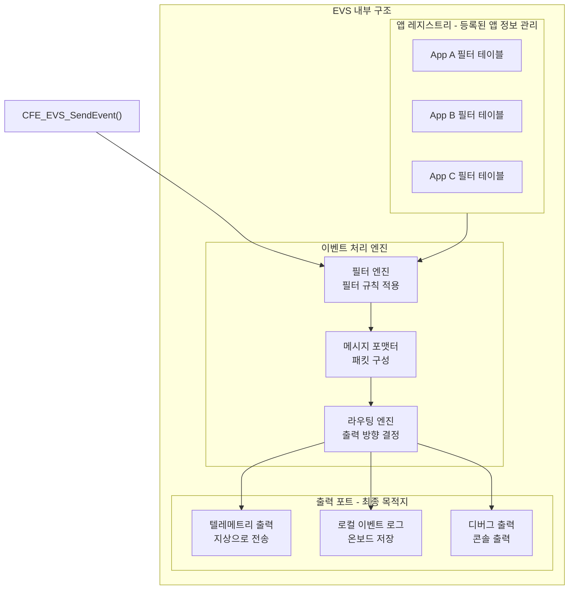
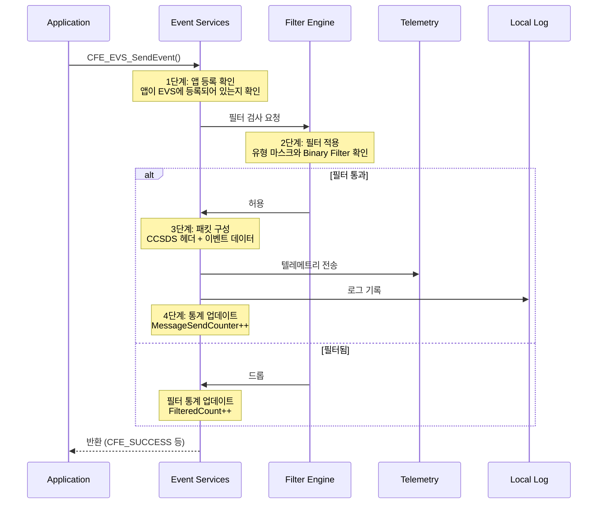
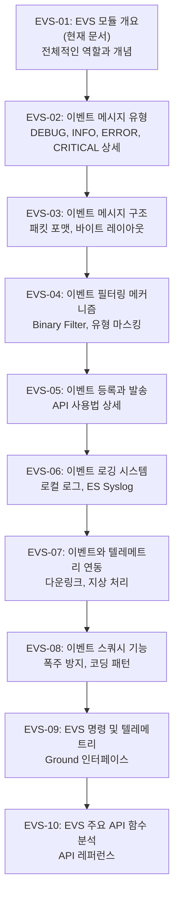

# Phase 2 EVS-01: Event Services 모듈 개요 및 역할

## 서론

Event Services(EVS)는 cFE(core Flight Executive)의 핵심 서비스 중 하나로, 시스템 전체의 이벤트 메시지를 관리하는 역할을 담당한다. 우주 비행 소프트웨어에서 "이벤트"란 무엇인지, 그리고 왜 이벤트 관리가 중요한지를 먼저 이해해야 한다.

지구에서 수백만 킬로미터 떨어진 곳에서 동작하는 우주선 소프트웨어를 생각해 보자. 운영자는 우주선이 현재 어떤 상태인지, 어떤 동작을 수행하고 있는지, 문제가 발생했는지를 알아야 한다. 이때 소프트웨어가 자신의 상태와 동작을 알려주는 방법이 바로 **이벤트 메시지**이다. 이벤트 메시지는 소프트웨어가 운영자에게 보내는 일종의 "보고서"라고 할 수 있다.

EVS는 각 애플리케이션에서 발생하는 이벤트를 수집하고, 필요에 따라 필터링하며, 텔레메트리를 통해 지상에 전달하거나 로컬 로그에 기록한다. 이 모든 과정을 체계적으로 관리하여 운영자가 우주선의 상태를 실시간으로 파악할 수 있도록 돕는다.

본 문서에서는 EVS의 전반적인 역할, 아키텍처, 그리고 핵심 개념을 개요 수준에서 살펴본다. 이 문서를 통해 EVS가 왜 필요한지, 어떻게 동작하는지에 대한 기본적인 이해를 얻을 수 있다.

---

## 1. Event Services 개요

### 1.1 EVS의 역할

EVS는 cFS 시스템에서 이벤트 메시지와 관련된 모든 것을 관리하는 중앙 집중식 서비스이다. 마치 회사의 홍보부서가 각 부서의 소식을 수집하여 외부에 발표하는 것처럼, EVS는 각 애플리케이션의 이벤트를 수집하여 외부(지상 운영팀)에 전달한다.

EVS가 담당하는 주요 역할은 다음과 같다.

| 역할 | 설명 | 비유 |
|:---|:---|:---|
| **이벤트 발송** | 앱에서 발생한 이벤트를 수집하고 배포 | 각 부서 소식을 모아 발표 |
| **이벤트 필터링** | 빈도 제한, 마스킹 등으로 이벤트 양 제어 | 중요한 소식만 선별 |
| **텔레메트리 연동** | 이벤트를 텔레메트리 패킷으로 변환하여 전송 | 소식을 공식 문서로 작성 |
| **로컬 로깅** | 이벤트를 로컬 로그에 기록 | 사내 기록 보관 |
| **이벤트 통계** | 앱별, 유형별 이벤트 발생 횟수 추적 | 발표 현황 통계 |

이 역할들을 그림으로 표현하면 다음과 같다. 여러 애플리케이션에서 발생한 이벤트가 EVS를 통해 다양한 경로로 출력되는 것을 볼 수 있다.



위 그림에서 볼 수 있듯이, 모든 애플리케이션은 `CFE_EVS_SendEvent()` 함수를 호출하여 이벤트를 EVS로 보낸다. EVS는 이 이벤트들을 받아서 필터링한 후, 텔레메트리로 지상에 전송하거나, 로컬 로그에 저장하거나, 디버그 포트로 출력한다.

### 1.2 이벤트의 중요성

우주 비행 소프트웨어에서 이벤트 메시지가 왜 그토록 중요할까? 다음 세 가지 이유를 살펴보자.

**첫째, 이벤트는 시스템 상태의 변화를 실시간으로 알려준다.**

운영자는 지구에서 우주선을 모니터링하고 있다. 우주선과의 통신에는 지연이 있고, 직접 눈으로 볼 수도 없다. 이벤트 메시지는 운영자에게 "지금 우주선에서 이런 일이 일어났습니다"라고 알려주는 유일한 방법이다. 예를 들어, 애플리케이션이 시작되면 "App initialized" 이벤트가 발생하고, 명령이 처리되면 "Command received" 이벤트가 발생하며, 오류가 발생하면 "Error detected" 이벤트가 발생한다.

운영자는 이러한 이벤트 스트림을 실시간으로 모니터링하면서 우주선의 상태를 파악한다. 마치 심전도 모니터가 환자의 심장 박동을 실시간으로 보여주는 것처럼, 이벤트 스트림은 우주선의 "생명 신호"를 보여준다.

**둘째, 이벤트는 문제 진단의 핵심 도구이다.**

우주 미션에서 문제가 발생했을 때, 가장 먼저 확인하는 것이 이벤트 로그이다. 언제, 어느 앱에서, 무슨 일이 일어났는지가 모두 이벤트에 기록되어 있기 때문이다. 이벤트에는 타임스탬프, 발생 앱 이름, 상세 메시지가 포함되어 있어서 복잡한 시스템에서 문제의 원인을 추적하는 데 필수적이다.

예를 들어, 우주선의 데이터 수집이 갑자기 멈췄다고 가정해 보자. 운영자는 이벤트 로그를 검토하여 "데이터 수집 앱의 파이프가 가득 찼다"는 이벤트를 발견할 수 있다. 이를 통해 문제의 원인이 파이프 용량 부족임을 알 수 있고, 적절한 조치를 취할 수 있다.

**셋째, 이벤트는 비행 이력의 중요한 기록이다.**

로컬 로그에 저장된 이벤트는 비행 후 분석이나 이상 상황 재구성에 활용된다. 통신이 두절된 동안 무슨 일이 있었는지, 이상 상황이 발생하기 직전에 어떤 이벤트들이 있었는지를 나중에 분석할 수 있다. 이는 향후 미션 개선이나 유사 문제 방지에 귀중한 자료가 된다.

### 1.3 EVS와 다른 로깅 메커니즘의 차이

cFS에는 EVS 외에도 ES Syslog와 Performance Log 등 다양한 로깅 메커니즘이 있다. 각각의 용도와 특징이 다르므로, 상황에 맞게 적절한 메커니즘을 선택해야 한다.

| 메커니즘 | 용도 | 특징 | 사용 시점 |
|:---|:---|:---|:---|
| **EVS Event** | 앱 상태/이벤트 보고 | 텔레메트리 전송, 필터링, 앱 등록 필요 | 앱이 정상 동작 중일 때 |
| **ES Syslog** | 시스템 레벨 로깅 | 항상 사용 가능, 링 버퍼, 제한된 용량 | EVS 등록 전, 심각한 오류 시 |
| **Perf Log** | 성능 분석 | 타이밍 마커, 오버헤드 최소화 | 성능 측정이 필요할 때 |

**EVS Event**는 가장 일반적인 로깅 방법이다. 앱이 EVS에 등록한 후에 사용할 수 있으며, 이벤트 필터링, 텔레메트리 전송, 다양한 출력 포트 등 풍부한 기능을 제공한다. 대부분의 앱 상태 보고에 EVS Event를 사용한다.

**ES Syslog**는 시스템 레벨의 로깅 메커니즘이다. EVS에 등록하기 전에도 사용할 수 있으므로 앱 초기화 초기 단계나 EVS 자체에 문제가 있을 때 유용하다. 다만 용량이 제한되어 있고 텔레메트리로 직접 전송되지 않는다는 한계가 있다.

**Performance Log**는 성능 분석을 위한 특수 로깅이다. 함수 진입/종료 시점에 마커를 기록하여 실행 시간을 측정하는 데 사용된다. 오버헤드가 매우 작아서 실시간 시스템에서도 안전하게 사용할 수 있다.

---

## 2. 이벤트 메시지 유형

### 2.1 네 가지 이벤트 유형

EVS는 이벤트를 심각도에 따라 네 가지 유형으로 분류한다. 이 분류는 운영자가 이벤트의 중요도를 신속하게 파악하고 적절하게 대응할 수 있도록 돕는다. 마치 병원의 응급실에서 환자를 중증도에 따라 분류(triage)하는 것과 유사하다.



위 그림은 네 가지 이벤트 유형을 심각도 순서로 보여준다. DEBUG가 가장 낮은 심각도이고, CRITICAL이 가장 높은 심각도이다. 각 유형은 서로 다른 색상으로 표시되어 운영자가 한눈에 중요도를 파악할 수 있다.

### 2.2 유형별 상세 설명

각 이벤트 유형이 언제, 왜 사용되는지 자세히 알아보자.

**DEBUG 이벤트**

DEBUG 이벤트는 개발자와 테스터를 위한 상세한 정보를 제공한다. 이 유형의 이벤트는 소프트웨어의 내부 동작을 추적하고 문제를 진단하는 데 도움이 된다. 예를 들어, 함수가 호출될 때마다 "Function X called with parameter Y" 같은 메시지를 기록할 수 있다.

DEBUG 이벤트는 매우 빈번하게 발생할 수 있으므로, 일반적인 운영 환경에서는 필터링되어 텔레메트리로 전송되지 않는 경우가 많다. 이렇게 하면 텔레메트리 대역폭을 절약하고, 운영자가 정말 중요한 이벤트에 집중할 수 있다. 문제가 발생했을 때만 DEBUG 이벤트 필터를 해제하여 상세 정보를 수집할 수 있다.

DEBUG 이벤트 예시:
- "Processing message MID=0x1880"
- "Table validation complete, 15 entries checked"
- "Entering state CALIBRATION"

**INFORMATION 이벤트**

INFORMATION 이벤트는 정상적인 시스템 동작과 상태 변화를 보고한다. 이것은 운영 중 가장 흔히 볼 수 있는 이벤트 유형으로, 시스템이 예상대로 작동하고 있음을 알려준다. INFORMATION 이벤트를 통해 운영자는 시스템의 현재 상태를 파악할 수 있다.

INFORMATION 이벤트는 주로 다음과 같은 상황에서 발생한다:
- 애플리케이션 초기화 완료
- 명령 수신 및 처리
- 모드 변경
- 테이블 로드 완료
- 주기적 상태 보고

INFORMATION 이벤트 예시:
- "MY_APP Initialized successfully, Version 1.2.3"
- "NOOP command received"
- "Mode changed from STANDBY to SCIENCE"
- "Configuration table loaded"

**ERROR 이벤트**

ERROR 이벤트는 오류 상황이 발생했음을 알린다. 중요한 점은 ERROR 이벤트가 발생해도 시스템이 여전히 동작하고 복구 가능한 상태라는 것이다. 운영자는 ERROR 이벤트를 모니터링하여 문제를 조사하고 필요시 조치를 취해야 한다.

ERROR 이벤트가 발생하는 전형적인 상황:
- 잘못된 명령 수신 (잘못된 명령 코드, 길이, 체크섬)
- 리소스 할당 실패 (복구 가능한 경우)
- 데이터 유효성 검증 실패
- 통신 오류 (재시도 가능)
- 예상치 못한 상태 값

ERROR 이벤트 예시:
- "Invalid command code: received=5, expected<=3"
- "Table validation failed at entry 7"
- "Subscription error for MID 0x1800: RC=0xC4000001"
- "Sensor read timeout, retrying..."

**CRITICAL 이벤트**

CRITICAL 이벤트는 가장 심각한 수준의 오류를 알린다. 이 유형의 이벤트는 시스템 안정성에 위협이 될 수 있는 상황, 데이터 손실 가능성, 또는 즉각적인 대응이 필요한 상황에서 발생한다. 운영자는 CRITICAL 이벤트가 발생하면 즉시 주의를 기울이고 적절한 조치를 취해야 한다.

CRITICAL 이벤트는 다음과 같은 심각한 상황에서만 사용해야 한다:
- 복구 불가능한 오류로 앱 종료가 필요한 경우
- 중요 데이터 손상 또는 무결성 위반
- 안전 제한 초과
- 하드웨어 오류 감지
- 시스템 전체에 영향을 미치는 문제

CRITICAL 이벤트 예시:
- "CRITICAL: Memory allocation failed, cannot continue"
- "CRITICAL: Task creation failed, app shutting down"
- "CRITICAL: Data corruption detected, entering safe mode"
- "CRITICAL: Temperature limit exceeded, 95°C"

### 2.3 이벤트 유형 사용 코드

이벤트 유형은 C 코드에서 열거형으로 정의되어 있다. 개발자는 이벤트를 발송할 때 적절한 유형을 지정해야 한다.

```c
/* 이벤트 유형 열거형 */
typedef enum
{
    CFE_EVS_EventType_DEBUG       = 0,  /* 디버그 - 개발용 상세 정보 */
    CFE_EVS_EventType_INFORMATION = 1,  /* 정보 - 정상 동작 보고 */
    CFE_EVS_EventType_ERROR       = 2,  /* 오류 - 복구 가능한 오류 */
    CFE_EVS_EventType_CRITICAL    = 3   /* 심각 - 즉시 대응 필요 */
} CFE_EVS_EventType_Enum_t;
```

다음은 실제 앱에서 각 유형의 이벤트를 발송하는 예시이다. 상황에 맞는 적절한 유형을 선택하는 것이 중요하다.

```c
/* INFORMATION 이벤트: 초기화 완료 */
CFE_EVS_SendEvent(INIT_INF_EID, 
                  CFE_EVS_EventType_INFORMATION,
                  "MY_APP Initialized, Version %d.%d.%d",
                  MAJOR, MINOR, REV);

/* ERROR 이벤트: 잘못된 명령 코드 */
CFE_EVS_SendEvent(CMD_ERR_EID, 
                  CFE_EVS_EventType_ERROR,
                  "Invalid command code: CC=%u, expected range [0-%u]",
                  (unsigned int)CommandCode,
                  (unsigned int)MAX_CMD_CODE);

/* CRITICAL 이벤트: 메모리 할당 실패 */
CFE_EVS_SendEvent(MEM_CRIT_EID, 
                  CFE_EVS_EventType_CRITICAL,
                  "CRITICAL: Memory allocation failed for %u bytes, cannot continue",
                  (unsigned int)Size);
```

---

## 3. 이벤트 메시지 구조

### 3.1 이벤트 메시지의 구성요소

이벤트 메시지는 단순한 문자열이 아니라, 여러 가지 정보가 포함된 구조화된 데이터이다. 운영자가 이벤트를 받았을 때 언제, 어디서, 무슨 일이 일어났는지를 명확하게 알 수 있도록 다양한 정보가 함께 전달된다.



위 그림은 이벤트 메시지의 주요 구성요소를 보여준다. 각 요소의 역할을 자세히 살펴보자.

**타임스탬프**: 이벤트가 발생한 정확한 시간을 기록한다. 이를 통해 이벤트들의 순서를 파악하고, 문제 발생 시점을 정확히 알 수 있다. 타임스탬프는 EVS가 자동으로 기록하므로 개발자가 신경 쓸 필요가 없다.

**애플리케이션 이름**: 이벤트를 발생시킨 앱의 이름이다. 여러 앱이 동시에 동작하는 cFS에서 어느 앱에서 이벤트가 발생했는지를 알려준다. 예를 들어, "MY_APP", "CFE_ES", "SCH_LAB" 등이 될 수 있다.

**이벤트 ID (EID)**: 앱 내에서 이벤트의 종류를 식별하는 번호이다. 같은 앱에서 발생하는 다양한 이벤트를 구분하는 데 사용된다. 예를 들어, 초기화 완료는 EID=1, NOOP 명령은 EID=2, 명령 오류는 EID=10 등으로 정의할 수 있다.

**이벤트 유형**: 앞서 설명한 DEBUG, INFORMATION, ERROR, CRITICAL 중 하나이다. 이벤트의 중요도를 나타낸다.

**메시지 문자열**: 이벤트에 대한 상세 정보를 담은 텍스트이다. 최대 122자까지 가능하며, printf 형식의 포맷 문자열을 지원한다. 예를 들어, "Command received: CC=5, result=SUCCESS" 같은 형식이다.

**프로세서 ID와 우주선 ID**: 다중 프로세서 또는 다중 우주선 시스템에서 이벤트의 발생 위치를 식별하는 데 사용된다. 단일 프로세서 시스템에서는 항상 같은 값이다.

### 3.2 이벤트 식별자 (Event ID)

각 이벤트는 고유한 Event ID(EID)로 식별된다. Event ID는 앱 내에서 고유해야 하며, **앱 이름과 EID의 조합**으로 시스템 전체에서 유일하게 식별된다.

EID를 체계적으로 관리하는 것이 중요하다. 다음은 권장되는 EID 범위 체계이다.

```c
/* 이벤트 ID 정의 예시 - 체계적인 범위 분리 */

/* 정보성 이벤트 (1-9): 정상 동작 보고용 */
#define MY_APP_INIT_INF_EID         1   /* 초기화 완료 */
#define MY_APP_NOOP_INF_EID         2   /* NOOP 명령 수신 */
#define MY_APP_RESET_INF_EID        3   /* 리셋 명령 수신 */
#define MY_APP_MODE_INF_EID         4   /* 모드 변경 */

/* 명령 관련 오류 (10-19): 명령 처리 중 발생하는 오류 */
#define MY_APP_CMD_LEN_ERR_EID      10  /* 명령 길이 오류 */
#define MY_APP_CMD_CC_ERR_EID       11  /* 명령 코드 오류 */
#define MY_APP_CMD_CHECKSUM_ERR_EID 12  /* 체크섬 오류 */

/* 초기화/리소스 오류 (20-29): 초기화 단계 오류 */
#define MY_APP_PIPE_ERR_EID         20  /* 파이프 생성 오류 */
#define MY_APP_SUB_ERR_EID          21  /* 구독 오류 */
#define MY_APP_TBL_ERR_EID          22  /* 테이블 오류 */

/* 런타임 오류 (30-39): 동작 중 발생하는 오류 */
#define MY_APP_DATA_ERR_EID         30  /* 데이터 오류 */
#define MY_APP_TIMEOUT_ERR_EID      31  /* 타임아웃 오류 */

/* 심각한 오류 (40-49): CRITICAL 수준 오류 */
#define MY_APP_MEM_CRIT_EID         40  /* 메모리 오류 */
#define MY_APP_TASK_CRIT_EID        41  /* 태스크 오류 */

/* 디버그 (50-99): 개발/테스트용 */
#define MY_APP_DBG_MSG_EID          50  /* 디버그 메시지 */
#define MY_APP_DBG_STATE_EID        51  /* 상태 추적 */
```

이렇게 체계적으로 EID를 관리하면, 이벤트 로그를 분석할 때 EID 번호만 보고도 어떤 종류의 이벤트인지 대략적으로 파악할 수 있다. 예를 들어, EID가 10-19 범위에 있으면 명령 관련 오류임을 바로 알 수 있다.

---

## 4. EVS 아키텍처

### 4.1 EVS 내부 구조

EVS의 내부 구조를 이해하면 이벤트가 어떻게 처리되는지 더 잘 이해할 수 있다. EVS는 크게 세 부분으로 구성된다: 앱 레지스트리, 이벤트 처리 엔진, 출력 포트.



**앱 레지스트리:** 각 애플리케이션이 EVS에 등록할 때 제공한 필터 테이블과 설정 정보를 저장한다. EVS는 이벤트를 처리할 때 이 레지스트리를 참조하여 해당 앱의 필터 규칙을 적용한다.

**이벤트 처리 엔진:** 이벤트가 EVS에 도착하면 처리 엔진이 여러 단계를 거쳐 처리한다.
- 필터 엔진: 앱의 필터 테이블에 따라 이벤트를 통과시킬지 드롭할지 결정한다.
- 메시지 포맷터: 이벤트를 CCSDS 표준 패킷 형식으로 변환한다.
- 라우팅 엔진: 이벤트를 어느 출력 포트로 보낼지 결정한다.

**출력 포트:** 처리된 이벤트는 하나 이상의 출력 포트로 전송된다.
- 텔레메트리: Software Bus를 통해 TO(Telemetry Output) 앱으로 전달되고, 지상으로 다운링크된다.
- 로컬 로그: 온보드 메모리에 이벤트를 저장한다. 통신 두절 시에도 이벤트가 보존된다.
- 디버그 출력: 개발 환경에서 콘솔에 이벤트를 출력한다.

### 4.2 이벤트 처리 흐름

앱이 `CFE_EVS_SendEvent()`를 호출하면 어떤 일이 일어날까? 다음 시퀀스 다이어그램은 이벤트가 생성되어 목적지에 도달하기까지의 전체 흐름을 보여준다.



이 흐름을 단계별로 설명하면 다음과 같다.

**1단계 - 앱 등록 확인:** EVS는 먼저 이벤트를 보낸 앱이 등록되어 있는지 확인한다. 등록되지 않은 앱이 이벤트를 보내면 오류가 반환된다.

**2단계 - 필터 적용:** 필터 엔진이 두 가지 종류의 필터를 확인한다. 첫째로 앱의 이벤트 유형 마스크를 확인하여 해당 유형(DEBUG, INFO 등)이 활성화되어 있는지 본다. 둘째로 특정 EID에 대한 Binary Filter가 있으면 그 규칙을 적용한다.

**3단계 - 패킷 구성:** 필터를 통과한 이벤트는 텔레메트리 패킷으로 변환된다. CCSDS 표준 헤더에 이벤트 데이터가 추가된다.

**4단계 - 출력 및 통계:** 패킷이 활성화된 출력 포트로 전송되고, 통계 카운터가 업데이트된다.

---

## 5. EVS 등록

### 5.1 앱 등록의 필요성

애플리케이션이 이벤트를 발송하려면 **반드시** 먼저 EVS에 등록해야 한다. 등록은 앱 초기화 과정의 가장 첫 단계 중 하나로 수행되어야 한다. 등록하지 않은 앱이 이벤트를 발송하려고 하면 `CFE_EVS_APP_NOT_REGISTERED` 오류가 반환된다.

등록 과정에서 다음과 같은 일이 일어난다:
1. EVS가 내부 레지스트리에 앱 정보를 기록한다.
2. 앱이 제공한 이벤트 필터 테이블이 EVS에 저장된다.
3. 앱의 이벤트 통계 카운터가 초기화된다.
4. 기본 이벤트 유형 마스크가 설정된다.

### 5.2 등록 함수

EVS 등록에 사용하는 함수와 파라미터를 살펴보자.

```c
/**
 * @brief EVS에 애플리케이션 등록
 *
 * 앱이 이벤트를 발송하기 전에 반드시 호출해야 하는 함수이다.
 *
 * @param Filters       이벤트 필터 배열
 *                      필터가 필요 없으면 NULL 전달
 * @param NumEventFilters 필터 배열의 크기
 *                      NULL이면 0 전달
 * @param FilterScheme    필터링 방식
 *                      현재는 CFE_EVS_EventFilter_BINARY만 지원
 *
 * @return CFE_SUCCESS              성공
 * @return CFE_EVS_APP_FILTER_OVERLOAD 필터 수 초과
 * @return CFE_EVS_UNKNOWN_FILTER   알 수 없는 필터 방식
 */
CFE_Status_t CFE_EVS_Register(const CFE_EVS_BinFilter_t *Filters,
                               uint16 NumEventFilters,
                               uint16 FilterScheme);
```

Binary Filter 항목의 구조는 다음과 같다. 각 항목은 필터링할 이벤트 ID와 적용할 마스크로 구성된다.

```c
/**
 * Binary Filter 항목 구조체
 */
typedef struct
{
    uint16 EventID;  /**< 필터링할 이벤트의 ID */
    uint16 Mask;     /**< 적용할 필터 마스크 */
} CFE_EVS_BinFilter_t;
```

필터 방식 상수는 현재 하나만 정의되어 있다.

```c
/* 필터링 방식 - Binary 필터만 지원 */
#define CFE_EVS_EventFilter_BINARY  0
```

### 5.3 등록 예시

실제 앱에서 EVS 등록을 수행하는 두 가지 예시를 살펴보자.

**예시 1: 필터 없이 등록**

가장 간단한 형태의 등록이다. 모든 이벤트가 필터링 없이 전송된다.

```c
CFE_Status_t MY_APP_Init(void)
{
    CFE_Status_t Status;
    
    /* 
     * EVS 등록 - 이것이 앱 초기화의 첫 번째 단계여야 한다.
     * 필터가 필요 없으므로 NULL과 0을 전달한다.
     */
    Status = CFE_EVS_Register(NULL, 0, CFE_EVS_EventFilter_BINARY);
    
    if (Status != CFE_SUCCESS)
    {
        /* 
         * EVS 등록 실패 시에는 이벤트를 발송할 수 없으므로
         * ES Syslog를 사용하여 오류를 기록한다.
         */
        CFE_ES_WriteToSysLog("MY_APP: EVS Register failed, RC=0x%08X\n",
                             (unsigned int)Status);
        return Status;
    }
    
    /* 이제 이벤트를 발송할 수 있다 */
    CFE_EVS_SendEvent(MY_APP_INIT_INF_EID,
                      CFE_EVS_EventType_INFORMATION,
                      "MY_APP: Initialization started");
    
    /* 나머지 초기화 작업... */
    
    return CFE_SUCCESS;
}
```

**예시 2: 필터와 함께 등록**

고빈도 이벤트의 발생을 제한하기 위해 필터를 설정하는 예시이다.

```c
/* 
 * 필터 테이블 정의
 * 각 항목은 {이벤트ID, 필터마스크} 형식이다.
 */
CFE_EVS_BinFilter_t MY_APP_EventFilters[] =
{
    /* 
     * 고빈도 디버그 이벤트: 처음 16개만 전송
     * 이후에는 필터되어 전송되지 않는다.
     */
    {MY_APP_DEBUG_MSG_EID, CFE_EVS_FIRST_16_STOP},
    
    /* 
     * 파이프 가득 참 오류: 처음 8개만 전송
     * 반복되는 오류 이벤트의 폭주를 방지한다.
     */
    {MY_APP_PIPE_FULL_EID, CFE_EVS_FIRST_8_STOP},
};

/* 필터 개수 자동 계산 */
#define MY_APP_NUM_EVENT_FILTERS \
    (sizeof(MY_APP_EventFilters) / sizeof(MY_APP_EventFilters[0]))

CFE_Status_t MY_APP_Init_WithFilters(void)
{
    CFE_Status_t Status;
    
    /* 필터와 함께 EVS 등록 */
    Status = CFE_EVS_Register(MY_APP_EventFilters,
                              MY_APP_NUM_EVENT_FILTERS,
                              CFE_EVS_EventFilter_BINARY);
    
    if (Status != CFE_SUCCESS)
    {
        CFE_ES_WriteToSysLog("MY_APP: EVS Register failed\n");
        return Status;
    }
    
    CFE_EVS_SendEvent(MY_APP_INIT_INF_EID,
                      CFE_EVS_EventType_INFORMATION,
                      "MY_APP Initialized with %u event filters",
                      (unsigned int)MY_APP_NUM_EVENT_FILTERS);
    
    return CFE_SUCCESS;
}
```

---

## 6. 이벤트 발송

### 6.1 CFE_EVS_SendEvent

`CFE_EVS_SendEvent()`는 가장 일반적으로 사용되는 이벤트 발송 함수이다. 이 함수를 호출하면 EVS가 현재 시간으로 타임스탬프를 자동으로 기록한다.

```c
/**
 * @brief 이벤트 메시지 발송
 *
 * 이 함수는 앱에서 이벤트를 발송할 때 가장 많이 사용된다.
 *
 * @param EventID    이벤트 식별자 (앱 내에서 고유)
 * @param EventType  이벤트 유형 (DEBUG, INFO, ERROR, CRITICAL)
 * @param Spec       printf 형식의 메시지 문자열
 * @param ...        포맷 문자열에 대응하는 가변 인자
 *
 * @return CFE_SUCCESS              성공
 * @return CFE_EVS_APP_NOT_REGISTERED 앱이 EVS에 등록되지 않음
 */
CFE_Status_t CFE_EVS_SendEvent(uint16 EventID,
                                uint16 EventType,
                                const char *Spec, ...);
```

다음은 다양한 상황에서 이벤트를 발송하는 예시이다.

```c
/* 정보 이벤트: 명령 수신 확인 */
CFE_EVS_SendEvent(NOOP_INF_EID,
                  CFE_EVS_EventType_INFORMATION,
                  "NOOP command received");

/* 정보 이벤트: 모드 변경 */
CFE_EVS_SendEvent(MODE_INF_EID,
                  CFE_EVS_EventType_INFORMATION,
                  "Mode changed from %s to %s",
                  OldModeName, NewModeName);

/* 오류 이벤트: 잘못된 명령 코드 */
CFE_EVS_SendEvent(CMD_ERR_EID,
                  CFE_EVS_EventType_ERROR,
                  "Invalid command: CC=%u, expected range [0-%u]",
                  (unsigned int)ReceivedCC, 
                  (unsigned int)MAX_CC);

/* 오류 이벤트: 데이터 유효성 실패 */
CFE_EVS_SendEvent(DATA_ERR_EID,
                  CFE_EVS_EventType_ERROR,
                  "Data validation failed: value=%d, limit=%d",
                  (int)Value, (int)Limit);
```

### 6.2 CFE_EVS_SendTimedEvent

때로는 이벤트가 발생한 시점과 그것을 보고하는 시점이 다를 수 있다. 예를 들어, 데이터를 수집한 후 처리하는 데 시간이 걸리는 경우, 데이터 수집 시점의 시간을 기록하고 싶을 수 있다. 이때 `CFE_EVS_SendTimedEvent()`를 사용한다.

```c
/**
 * @brief 지정된 시간으로 이벤트 발송
 *
 * 타임스탬프를 직접 지정하고 싶을 때 사용한다.
 *
 * @param Time       이벤트의 타임스탬프로 사용할 시간
 * @param EventID    이벤트 식별자
 * @param EventType  이벤트 유형
 * @param Spec       메시지 형식
 * @param ...        가변 인자
 */
CFE_Status_t CFE_EVS_SendTimedEvent(CFE_TIME_SysTime_t Time,
                                     uint16 EventID,
                                     uint16 EventType,
                                     const char *Spec, ...);
```

사용 예시:

```c
/* 데이터 수집 시점의 시간 캡처 */
CFE_TIME_SysTime_t DataAcquisitionTime = CFE_TIME_GetTime();

/* ... 데이터 처리 (시간 소요) ... */

/* 데이터 수집 시점의 시간으로 이벤트 발송 */
CFE_EVS_SendTimedEvent(DataAcquisitionTime,
                       DATA_ACQUIRED_EID,
                       CFE_EVS_EventType_DEBUG,
                       "Data acquired: samples=%u, quality=%u",
                       (unsigned int)SampleCount,
                       (unsigned int)Quality);
```

### 6.3 CFE_EVS_SendEventWithAppID

`CFE_EVS_SendEventWithAppID()`는 특수한 상황에서 사용된다. 주로 라이브러리가 여러 앱에서 호출될 때, 호출한 앱의 이름으로 이벤트를 발송하고 싶을 때 사용한다.

```c
/**
 * @brief 앱 ID 지정하여 이벤트 발송
 *
 * 라이브러리 등에서 호출 앱을 명시할 때 사용한다.
 *
 * @param EventID    이벤트 식별자
 * @param EventType  이벤트 유형
 * @param AppID      이벤트 소유자로 표시할 앱의 ID
 * @param Spec       메시지 형식
 * @param ...        가변 인자
 */
CFE_Status_t CFE_EVS_SendEventWithAppID(uint16 EventID,
                                         uint16 EventType,
                                         CFE_ES_AppId_t AppID,
                                         const char *Spec, ...);
```

---

## 7. EVS 구성 옵션

### 7.1 플랫폼 구성 파라미터

EVS의 동작은 플랫폼 구성 파일에서 설정할 수 있다. 이 파라미터들은 미션의 요구에 맞게 조정된다.

```c
/* platform_cfg.h - EVS 관련 구성 */

/*
 * 이벤트 메시지 최대 길이 (문자)
 * 
 * 이벤트 메시지 텍스트의 최대 길이이다.
 * 이 값을 초과하는 메시지는 잘린다.
 * 기본값인 122자면 대부분의 경우 충분하다.
 */
#define CFE_MISSION_EVS_MAX_MESSAGE_LENGTH    122

/*
 * 앱당 최대 필터 이벤트 수
 * 
 * 하나의 앱이 등록할 수 있는 필터의 최대 개수이다.
 * 필터가 많이 필요한 경우 이 값을 늘려야 한다.
 */
#define CFE_PLATFORM_EVS_MAX_EVENT_FILTERS    8

/*
 * 로컬 이벤트 로그 항목 수
 * 
 * 온보드에 저장할 수 있는 이벤트의 최대 개수이다.
 * 통신 두절 시간과 이벤트 발생 빈도를 고려하여 설정한다.
 */
#define CFE_PLATFORM_EVS_LOG_MAX              20

/*
 * 로그 모드: 0=Overwrite, 1=Discard
 * 
 * Overwrite: 로그가 가득 차면 가장 오래된 항목을 덮어쓴다.
 * Discard: 로그가 가득 차면 새 항목을 버린다.
 */
#define CFE_PLATFORM_EVS_DEFAULT_LOG_MODE     0

/*
 * 기본 이벤트 유형 마스크
 * 
 * 비트 0: DEBUG
 * 비트 1: INFORMATION
 * 비트 2: ERROR
 * 비트 3: CRITICAL
 * 
 * 0x0F = 모든 유형 활성화 (1111)
 * 0x0E = DEBUG 제외 (1110)
 */
#define CFE_PLATFORM_EVS_DEFAULT_TYPE_FLAG    0x0F
```

### 7.2 이벤트 출력 포트

EVS는 여러 출력 포트를 통해 이벤트를 다양한 목적지로 보낼 수 있다. 각 포트는 독립적으로 활성화/비활성화할 수 있다.

| 포트 | 설명 | 기본 상태 | 용도 |
|:---|:---|:---|:---|
| **Port 1** | 텔레메트리 출력 | 활성 | 지상 시스템으로 실시간 전송 |
| **Port 2** | 로컬 이벤트 로그 | 구성 가능 | 온보드 저장, 나중에 다운로드 |
| **Port 3** | 디버그 출력 (콘솔) | 구성 가능 | 개발 환경에서 콘솔 출력 |
| **Port 4** | 예약 | 미사용 | 향후 확장용 |

운영 환경에서는 보통 Port 1(텔레메트리)만 활성화하고, 개발 환경에서는 Port 3(디버그)도 활성화하여 콘솔에서 이벤트를 바로 확인할 수 있다.

---

## 8. EVS 문서 로드맵

이 문서는 EVS 모듈 시리즈의 첫 번째 문서이다. 앞으로 다룰 내용의 로드맵을 확인하자.



---

## 결론

Event Services는 cFE에서 시스템 전체의 이벤트 메시지를 관리하는 핵심 서비스이다. 이벤트는 시스템 상태 변화, 오류 발생, 중요한 동작을 알리는 핵심 메커니즘으로, 우주 미션의 운영과 문제 진단에 필수적이다.

이 문서에서 다룬 핵심 개념을 정리하면 다음과 같다:

- **EVS의 역할**: 이벤트 수집, 필터링, 텔레메트리 전송, 로컬 로깅, 통계 관리
- **네 가지 이벤트 유형**: DEBUG(개발용), INFORMATION(정상 동작), ERROR(복구 가능 오류), CRITICAL(심각한 오류)
- **이벤트 메시지 구조**: 타임스탬프, 앱 이름, 이벤트 ID, 유형, 메시지로 구성
- **등록 필수**: `CFE_EVS_Register()`로 등록 후에만 이벤트 발송 가능
- **필터링**: 이벤트 폭주 방지를 위한 빈도 제한 메커니즘
- **다중 출력**: 텔레메트리, 로컬 로그, 디버그 포트 지원

다음 문서에서는 네 가지 이벤트 유형의 상세한 사용법과 각 유형별 모범 사례를 살펴볼 것이다.

---

## 참고 문헌

1. NASA, "cFE Application Developer's Guide"
2. NASA, "Event Services User's Guide"
3. NASA cFE GitHub, cfe/modules/evs/
4. NASA, "cFS Logging and Telemetry Best Practices"

---

[이전 문서: Phase 2 SB-11: SB 주요 API 함수 분석](./Phase2_SB_11_SB_주요_API_함수_분석.md)

[다음 문서: Phase 2 EVS-02: 이벤트 메시지 유형](./Phase2_EVS_02_이벤트_메시지_유형.md)
