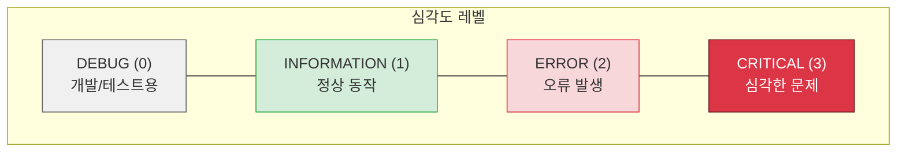
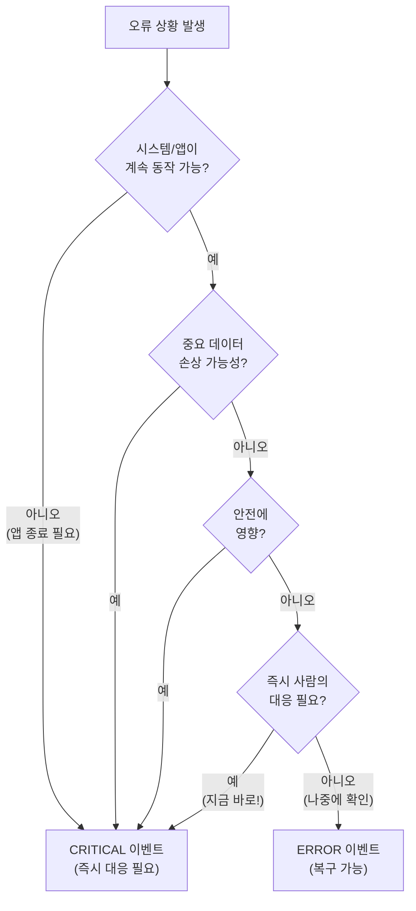
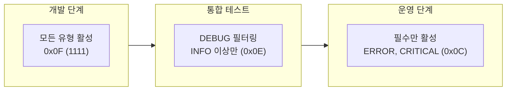
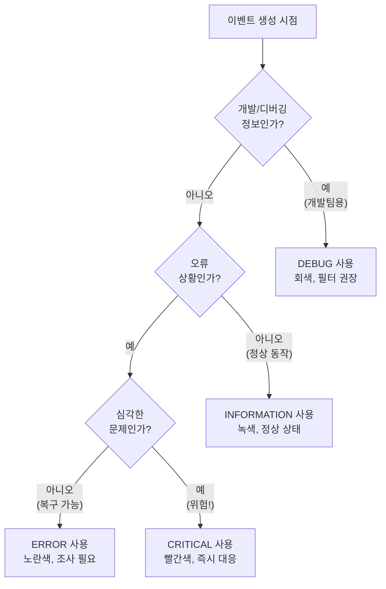

# Phase 2 EVS-02: 이벤트 메시지 유형

## 서론

Event Services는 이벤트 메시지를 네 가지 심각도 수준으로 분류한다: **DEBUG**, **INFORMATION**, **ERROR**, **CRITICAL**. 이 분류 체계는 병원 응급실에서 환자를 중증도에 따라 분류(triage)하는 것과 유사하다. 가장 심각한 환자가 먼저 치료를 받듯이, 가장 중요한 이벤트가 먼저 운영자의 주의를 끌어야 한다.

올바른 이벤트 유형을 선택하는 것은 매우 중요하다. 모든 오류를 CRITICAL로 표시하면 "늑대 소년" 효과가 발생하여 정말 심각한 상황에서도 운영자가 둔감해질 수 있다. 반대로 DEBUG 이벤트를 너무 많이 발생시키면 텔레메트리 대역폭이 낭비되고 중요한 이벤트가 묻힐 수 있다.

본 문서에서는 각 이벤트 유형의 정의와 목적을 깊이 이해하고, 실제 상황에서 어떤 유형을 선택해야 하는지에 대한 명확한 가이드라인을 제시한다.

---

## 1. 이벤트 유형 체계

### 1.1 네 가지 유형 개요

EVS의 네 가지 이벤트 유형은 심각도에 따라 0부터 3까지의 숫자 값을 갖는다. 숫자가 높을수록 더 심각한 상황을 나타낸다.



위 그림에서 각 유형은 서로 다른 색상으로 표시된다. 지상 시스템에서도 이와 유사한 색상 코딩을 사용하여 운영자가 화면에서 이벤트 유형을 한눈에 파악할 수 있도록 한다.

- **회색(DEBUG)**: 무시해도 되는 배경 정보
- **녹색(INFORMATION)**: 정상 동작, 안심해도 됨
- **노란색/주황색(ERROR)**: 문제 발생, 조사 필요
- **빨간색(CRITICAL)**: 긴급 상황, 즉시 대응 필요

### 1.2 유형 정의

이벤트 유형은 C 코드에서 열거형으로 정의되어 있다. 이 열거형을 사용하여 이벤트를 발송할 때 심각도를 지정한다.

```c
/**
 * EVS 이벤트 유형 열거형
 *
 * 각 이벤트 유형은 고유한 숫자 값을 갖는다.
 * 숫자가 클수록 더 심각한 상황을 나타낸다.
 */
typedef enum
{
    CFE_EVS_EventType_DEBUG       = 0,  /**< 디버그 정보: 개발자용 상세 정보 */
    CFE_EVS_EventType_INFORMATION = 1,  /**< 정보: 정상 동작 알림 */
    CFE_EVS_EventType_ERROR       = 2,  /**< 오류: 문제 발생, 복구 가능 */
    CFE_EVS_EventType_CRITICAL    = 3   /**< 심각: 긴급 상황, 즉시 대응 필요 */
} CFE_EVS_EventType_Enum_t;
```

### 1.3 유형별 특성 비교

다음 표는 네 가지 이벤트 유형의 특성을 비교한다. 이 표를 참고하여 상황에 맞는 적절한 유형을 선택할 수 있다.

| 유형 | 심각도 | 용도 | 필터링 | 지상 대응 | 발생 빈도 |
|:---|:---:|:---|:---:|:---|:---|
| DEBUG | 0 (최저) | 개발/테스트 시 상세 추적 | 보통 필터 | 불필요 | 매우 빈번 |
| INFO | 1 | 정상 동작 상태 보고 | 선택적 | 인지만 | 적당함 |
| ERROR | 2 | 오류 발생 알림 | 드물게 | 조사 필요 | 드물게 |
| CRITICAL | 3 (최고) | 긴급 상황 알림 | 절대 안함 | 즉시 대응 | 매우 드물게 |

**필터링**: 이벤트 폭주를 방지하기 위해 특정 이벤트를 제한할 수 있다. DEBUG는 거의 항상 필터링하고, CRITICAL은 절대 필터링하지 않는다.

**지상 대응**: 운영자가 이벤트를 보고 취해야 할 조치이다. DEBUG는 별다른 조치가 필요 없고, CRITICAL은 즉각적인 대응이 필요하다.

---

## 2. DEBUG 이벤트

### 2.1 정의와 목적

DEBUG 이벤트는 개발자와 테스터를 위한 **상세 정보 메시지**이다. 이 유형은 마치 소프트웨어의 "속삭임"과 같다. 소프트웨어가 자신의 내부 동작을 상세하게 설명하지만, 일반 운영에서는 듣지 않아도 되는 정보이다.

DEBUG 이벤트의 가장 큰 특징은 **운영 환경에서는 보통 비활성화**된다는 것이다. 개발 중이나 문제 진단 시에만 활성화하여 필요한 정보를 수집한다. 이렇게 하면 정상 운영 중에는 텔레메트리 대역폭을 절약하고, 필요할 때만 상세 정보를 얻을 수 있다.

DEBUG 이벤트를 생각할 때 다음 질문을 해보자: "이 정보가 운영팀에게 필요한가, 아니면 개발팀에게만 필요한가?" 개발팀에게만 필요하다면 DEBUG이다.

### 2.2 사용 시나리오

DEBUG 이벤트는 다음과 같은 상황에서 사용한다. 모두 **소프트웨어의 내부 동작을 추적**하기 위한 것이다.

**1. 함수 진입/종료 추적**
함수가 호출될 때와 반환될 때 이벤트를 발생시켜 프로그램의 실행 흐름을 추적한다. "어떤 함수가 호출되고 있는가?"를 파악하는 데 유용하다.

**2. 중간 계산 결과 확인**
복잡한 계산이나 알고리즘의 중간 결과를 기록한다. 계산이 올바르게 진행되고 있는지 확인할 수 있다.

**3. 상태 전이 상세 정보**
상태 머신에서 상태가 변할 때 이전 상태, 새 상태, 전이 이유를 기록한다. 상태 변화의 흐름을 이해하는 데 도움이 된다.

**4. 루프 반복 진행 상황**
반복문에서 현재 진행 상황을 기록한다. 다만, 매 반복마다 이벤트를 발생시키면 이벤트 폭주가 발생할 수 있으므로 주의가 필요하다.

**5. 조건문 분기 경로**
if-else나 switch 문에서 어떤 경로로 분기했는지 기록한다. 예상과 다른 경로로 분기하지 않았는지 확인할 수 있다.

### 2.3 코드 예시

다양한 상황에서 DEBUG 이벤트를 사용하는 예시를 살펴보자. 각 예시에는 왜 DEBUG가 적절한지에 대한 설명이 포함되어 있다.

```c
/* 
 * 함수 진입 추적
 * 
 * 이 정보는 개발자가 프로그램 흐름을 추적할 때만 필요하다.
 * 운영팀은 ProcessData 함수가 호출되는지 궁금하지 않다.
 */
CFE_EVS_SendEvent(PROCESS_DBG_EID,
                  CFE_EVS_EventType_DEBUG,
                  "ProcessData: Entering, buffer size=%u",
                  (unsigned int)BufferSize);

/* 
 * 중간 계산 결과 기록
 * 
 * 계산 알고리즘 검증 시 유용하지만, 운영 중에는 불필요하다.
 */
CFE_EVS_SendEvent(CALC_DBG_EID,
                  CFE_EVS_EventType_DEBUG,
                  "Calculation: sum=%d, count=%d, avg=%d",
                  (int)Sum, (int)Count, (int)Average);

/* 
 * 상태 전이 상세
 * 
 * 상태 머신의 동작을 이해하는 데 도움이 된다.
 * 모드 변경 자체는 INFO로 보고하되, 상세 전이 정보는 DEBUG로 기록.
 */
CFE_EVS_SendEvent(STATE_DBG_EID,
                  CFE_EVS_EventType_DEBUG,
                  "State machine: %s -> %s, trigger=%u, condition=%d",
                  OldStateName, NewStateName, 
                  (unsigned int)Trigger, (int)ConditionValue);

/* 
 * 조건 분기 경로
 * 
 * 복잡한 로직에서 어떤 경로로 실행되었는지 추적.
 */
CFE_EVS_SendEvent(BRANCH_DBG_EID,
                  CFE_EVS_EventType_DEBUG,
                  "Decision point: taking %s path (value=%d, threshold=%d)",
                  PathName, (int)Value, (int)Threshold);
```

### 2.4 좋은 예와 나쁜 예

DEBUG 이벤트를 효과적으로 사용하려면 다음 원칙을 따라야 한다.

```c
/* 
 * 좋은 예: 구체적이고 컨텍스트가 있는 정보
 * 
 * 무엇을 하고 있는지, 관련 값이 무엇인지 명확하다.
 * 문제 발생 시 이 정보만 보고도 상황을 파악할 수 있다.
 */
CFE_EVS_SendEvent(DBG_EID, CFE_EVS_EventType_DEBUG,
                  "Validating table '%s': checking %u entries, size=%u bytes",
                  TableName, EntryCount, TableSize);

CFE_EVS_SendEvent(DBG_EID, CFE_EVS_EventType_DEBUG,
                  "Sensor read: channel=%u, raw=%d, calibrated=%.2f",
                  (unsigned int)Channel, (int)RawValue, CalibratedValue);

/* 
 * 나쁜 예 1: 너무 일반적인 정보
 * 
 * "Here"나 "Checkpoint 1" 같은 메시지는 로그를 볼 때
 * 무슨 의미인지 알기 어렵다.
 */
CFE_EVS_SendEvent(DBG_EID, CFE_EVS_EventType_DEBUG,
                  "Here");  /* 어디? 무엇을 하고 있는데? */

CFE_EVS_SendEvent(DBG_EID, CFE_EVS_EventType_DEBUG,
                  "Checkpoint 1");  /* 무슨 체크포인트? */

/* 
 * 나쁜 예 2: 너무 빈번한 이벤트 (필터 없이)
 * 
 * 매 루프 반복마다 이벤트를 발생시키면
 * 초당 수천 개의 이벤트가 발생할 수 있다.
 */
for (int i = 0; i < 10000; i++)
{
    CFE_EVS_SendEvent(DBG_EID, CFE_EVS_EventType_DEBUG,
                      "Counter=%d", i);  /* 이벤트 폭주 발생! */
    DoSomething(i);
}
```

### 2.5 필터링 권장

DEBUG 이벤트는 매우 빈번하게 발생할 수 있으므로, **반드시 필터를 설정**해야 한다. 필터를 설정하지 않으면 이벤트 폭주로 인해 시스템 성능이 저하되고 텔레메트리 대역폭이 낭비된다.

```c
/* 
 * 앱 등록 시 DEBUG 이벤트에 필터 설정
 * 
 * 각 이벤트 ID별로 적절한 필터 마스크를 선택한다.
 * CFE_EVS_FIRST_N_STOP: 처음 N개만 전송 후 중지
 */
CFE_EVS_BinFilter_t MyFilters[] =
{
    /* 처음 16개만 전송 - 초기 동작 확인용 */
    {PROCESS_DBG_EID, CFE_EVS_FIRST_16_STOP},
    
    /* 처음 8개만 전송 - 계산 검증용 */
    {CALC_DBG_EID, CFE_EVS_FIRST_8_STOP},
    
    /* 필터 없음 - 상태 전이는 중요하므로 모두 전송 */
    {STATE_DBG_EID, CFE_EVS_NO_FILTER},
};

/* 
 * 권장 전략:
 * 1. 고빈도 DEBUG: FIRST_8_STOP 또는 FIRST_16_STOP
 * 2. 중요한 DEBUG: NO_FILTER 또는 FIRST_32_STOP
 * 3. 루프 내 DEBUG: FIRST_4_STOP 또는 아예 사용하지 않음
 */
```

---

## 3. INFORMATION 이벤트

### 3.1 정의와 목적

INFORMATION 이벤트는 **정상적인 시스템 동작**을 보고하는 메시지이다. 이 유형은 "모든 것이 잘 되고 있습니다"라고 알려주는 것과 같다. 시스템이 예상대로 작동하고 있음을 확인시켜주는 역할을 한다.

운영자는 INFORMATION 이벤트를 통해 우주선의 상태를 파악한다. 마치 비행기의 조종석 계기판처럼, INFORMATION 이벤트는 시스템의 현재 상태와 동작을 실시간으로 보여준다. 앱이 초기화되면 "초기화 완료" 이벤트가 발생하고, 명령이 처리되면 "명령 처리 완료" 이벤트가 발생한다.

INFORMATION 이벤트를 판단하는 기준: "이 정보가 운영팀이 시스템 상태를 이해하는 데 도움이 되는가?" 그렇다면 INFORMATION이다.

### 3.2 사용 시나리오

INFORMATION 이벤트는 **정상적이고 예상된 상황**에서 사용한다.

**1. 애플리케이션 초기화 완료**
앱이 성공적으로 시작되었음을 알린다. 초기화 완료 이벤트가 없으면 운영팀은 앱이 제대로 시작되었는지 알 수 없다.

**2. 명령 수신 및 처리 완료**
지상에서 보낸 명령이 수신되고 처리되었음을 확인한다. 이를 통해 명령 링크가 정상 동작하고 있음을 알 수 있다.

**3. 동작 모드 변경**
시스템이 새로운 모드로 전환되었음을 알린다. 예를 들어, STANDBY에서 SCIENCE 모드로 변경.

**4. 주기적 상태 보고**
시스템이 정상적으로 동작하고 있음을 주기적으로 확인. 다만, 너무 빈번하면 DEBUG로 분류하는 것이 좋다.

**5. 정상적인 데이터 처리 완료**
예상대로 데이터가 처리되었음을 알린다.

### 3.3 코드 예시

INFORMATION 이벤트의 다양한 사용 예시를 살펴보자.

```c
/* 
 * 앱 초기화 완료
 * 
 * 모든 앱은 초기화 완료 시 이 이벤트를 발생시켜야 한다.
 * 버전 정보를 포함하면 운영팀이 어떤 버전이 동작하는지 알 수 있다.
 */
CFE_EVS_SendEvent(INIT_INF_EID,
                  CFE_EVS_EventType_INFORMATION,
                  "MY_APP Initialized successfully. Version %d.%d.%d",
                  MY_APP_MAJOR_VERSION,
                  MY_APP_MINOR_VERSION,
                  MY_APP_REVISION);

/* 
 * NOOP 명령 수신
 * 
 * NOOP(No Operation) 명령은 통신 경로 테스트에 사용된다.
 * 이벤트가 발생하면 명령 링크가 정상임을 확인할 수 있다.
 */
CFE_EVS_SendEvent(NOOP_INF_EID,
                  CFE_EVS_EventType_INFORMATION,
                  "NOOP command received and processed");

/* 
 * 카운터 리셋
 * 
 * 명령에 의해 통계 카운터가 리셋되었음을 알린다.
 */
CFE_EVS_SendEvent(RESET_INF_EID,
                  CFE_EVS_EventType_INFORMATION,
                  "Counters reset: cmd_count=0, err_count=0");

/* 
 * 모드 변경
 * 
 * 시스템의 동작 모드가 변경됨을 알린다.
 * 이전 모드와 새 모드를 모두 표시하면 변경 이력을 추적할 수 있다.
 */
CFE_EVS_SendEvent(MODE_INF_EID,
                  CFE_EVS_EventType_INFORMATION,
                  "Mode changed: %s -> %s",
                  GetModeName(OldMode),
                  GetModeName(NewMode));

/* 
 * 설정 변경
 * 
 * 명령에 의해 파라미터가 변경되었음을 알린다.
 */
CFE_EVS_SendEvent(CONFIG_INF_EID,
                  CFE_EVS_EventType_INFORMATION,
                  "Configuration updated: %s = %d (was %d)",
                  ParamName, (int)NewValue, (int)OldValue);

/* 
 * 테이블 로드 완료
 * 
 * 새 테이블이 성공적으로 로드되었음을 알린다.
 */
CFE_EVS_SendEvent(TBL_INF_EID,
                  CFE_EVS_EventType_INFORMATION,
                  "Table '%s' loaded: %u entries, CRC=0x%04X",
                  TableName, (unsigned int)EntryCount, 
                  (unsigned int)TableCRC);
```

### 3.4 좋은 예와 나쁜 예

INFORMATION 이벤트의 품질이 운영 효율성에 직접 영향을 미친다.

```c
/* 
 * 좋은 예: 명확하고 완전한 정보
 * 
 * 무슨 일이 일어났는지, 결과가 어땠는지 명확하다.
 */
CFE_EVS_SendEvent(CMD_INF_EID,
                  CFE_EVS_EventType_INFORMATION,
                  "Command processed: CC=%u, result=SUCCESS, elapsed=%u ms",
                  (unsigned int)CommandCode, (unsigned int)ElapsedTime);

CFE_EVS_SendEvent(TBL_INF_EID,
                  CFE_EVS_EventType_INFORMATION,
                  "Table '%s' validated: %u entries OK, 0 errors",
                  TableName, (unsigned int)EntryCount);

/* 
 * 나쁜 예 1: 너무 간략한 정보
 * 
 * 무슨 명령인지, 결과가 어땠는지 알 수 없다.
 */
CFE_EVS_SendEvent(CMD_INF_EID,
                  CFE_EVS_EventType_INFORMATION,
                  "Command done");  /* 어떤 명령? 결과는? */

/* 
 * 나쁜 예 2: DEBUG여야 할 것을 INFO로 사용
 * 
 * 루프 진행 상황은 개발팀에게만 필요한 정보이다.
 * 이것을 INFO로 분류하면 이벤트가 너무 많아진다.
 */
for (int i = 0; i < total; i++)
{
    CFE_EVS_SendEvent(EID, CFE_EVS_EventType_INFORMATION,
                      "Processing %d of %d", i, total);  /* DEBUG여야 함! */
}

/* 
 * 나쁜 예 3: 너무 빈번한 INFO
 * 
 * 1Hz 이상의 빈도로 발생하는 이벤트는 DEBUG로 분류해야 한다.
 */
void PeriodicFunction(void)  /* 10Hz로 호출됨 */
{
    CFE_EVS_SendEvent(TICK_INF_EID,
                      CFE_EVS_EventType_INFORMATION,
                      "Heartbeat");  /* 너무 빈번함! */
}
```

### 3.5 표준 INFORMATION 이벤트 목록

대부분의 앱에서 발생시키는 표준 INFORMATION 이벤트 목록이다. 이 이벤트들은 앱의 기본 동작을 모니터링하는 데 사용된다.

| EID | 이벤트 이름 | 설명 | 발생 시점 |
|:---:|:---|:---|:---|
| 1 | INIT_INF | 초기화 완료 | 앱 시작 시 |
| 2 | NOOP_INF | NOOP 명령 수신 | NOOP 명령 처리 시 |
| 3 | RESET_INF | 카운터 리셋 | 리셋 명령 처리 시 |
| 4 | CMD_INF | 일반 명령 처리 | 명령 처리 완료 시 |
| 5 | MODE_INF | 모드 변경 | 동작 모드 변경 시 |
| 6 | TBL_INF | 테이블 로드/업데이트 | 테이블 작업 완료 시 |

---

## 4. ERROR 이벤트

### 4.1 정의와 목적

ERROR 이벤트는 **오류 상황 발생**을 알리는 메시지이다. 이 유형의 핵심 특징은 **시스템이 여전히 복구 가능한 상태**라는 것이다. 문제가 발생했지만, 시스템은 계속 동작할 수 있고, 적절한 조치를 통해 정상 상태로 돌아갈 수 있다.

ERROR 이벤트를 비유하자면, 자동차의 "엔진 경고등"과 같다. 문제가 있으니 확인이 필요하지만, 당장 차를 세워야 할 정도는 아니다. 운전자(운영팀)는 경고등을 보고 원인을 조사하고 필요한 조치를 취해야 한다.

ERROR와 CRITICAL을 구분하는 기준: "시스템이 여전히 정상적으로 동작할 수 있는가?" 그렇다면 ERROR, 아니라면 CRITICAL이다.

### 4.2 사용 시나리오

ERROR 이벤트는 **문제가 발생했지만 계속 진행할 수 있는 상황**에서 사용한다.

**1. 잘못된 명령 수신**
명령 코드, 길이, 체크섬 등이 잘못된 명령을 받았을 때. 앱은 그 명령을 무시하고 다음 명령을 기다린다.

**2. 리소스 할당 실패 (복구 가능한 경우)**
버퍼 할당이 실패했지만, 재시도하거나 다른 방법으로 처리할 수 있을 때.

**3. 데이터 유효성 검증 실패**
수신한 데이터가 유효하지 않을 때. 해당 데이터만 버리고 계속 진행할 수 있다.

**4. 통신 오류 (재시도 가능)**
한 번의 통신 실패. 재시도를 통해 복구할 수 있다.

**5. 예상치 못한 상태 또는 값**
예상과 다른 값을 받았지만, 기본값이나 안전한 값으로 대체할 수 있을 때.

### 4.3 코드 예시

다양한 ERROR 상황의 예시를 살펴보자.

```c
/* 
 * 잘못된 명령 코드
 * 
 * 알 수 없는 명령 코드를 받았다. 이 명령은 무시하고
 * 다음 명령을 기다린다. 시스템은 계속 동작한다.
 */
CFE_EVS_SendEvent(CC_ERR_EID,
                  CFE_EVS_EventType_ERROR,
                  "Invalid command code: received=%u, valid range=[0, %u]",
                  (unsigned int)CommandCode,
                  (unsigned int)MAX_CMD_CODE);

/* 
 * 명령 길이 오류
 * 
 * 명령 패킷의 길이가 예상과 다르다.
 * 손상된 패킷이거나 잘못된 형식일 수 있다.
 */
CFE_EVS_SendEvent(LEN_ERR_EID,
                  CFE_EVS_EventType_ERROR,
                  "Command length mismatch: MID=0x%04X, received=%u, expected=%u",
                  (unsigned int)MsgId,
                  (unsigned int)ReceivedLength,
                  (unsigned int)ExpectedLength);

/* 
 * 체크섬 오류
 * 
 * 명령 패킷의 체크섬이 일치하지 않는다.
 * 전송 중 데이터가 손상되었을 수 있다.
 */
CFE_EVS_SendEvent(CHECKSUM_ERR_EID,
                  CFE_EVS_EventType_ERROR,
                  "Command checksum failed: MID=0x%04X, computed=0x%02X, received=0x%02X",
                  (unsigned int)MsgId,
                  (unsigned int)ComputedChecksum,
                  (unsigned int)ReceivedChecksum);

/* 
 * 데이터 범위 초과
 * 
 * 파라미터 값이 허용 범위를 벗어났다.
 * 잘못된 값은 무시하고 기존 값을 유지한다.
 */
CFE_EVS_SendEvent(DATA_ERR_EID,
                  CFE_EVS_EventType_ERROR,
                  "Parameter out of range: %s=%d, valid range=[%d, %d], keeping old value",
                  ParamName, (int)NewValue, MIN_VAL, MAX_VAL);

/* 
 * 구독 실패
 * 
 * Message ID 구독에 실패했다. 해당 메시지를 받지 못하겠지만,
 * 앱의 다른 기능은 정상 동작할 수 있다.
 */
CFE_EVS_SendEvent(SUB_ERR_EID,
                  CFE_EVS_EventType_ERROR,
                  "Subscription failed: MID=0x%04X, RC=0x%08X - continuing without this message",
                  (unsigned int)MsgId, (unsigned int)Status);

/* 
 * 센서 읽기 타임아웃
 * 
 * 센서 응답이 없다. 재시도하거나 이전 값을 사용할 수 있다.
 */
CFE_EVS_SendEvent(SENSOR_ERR_EID,
                  CFE_EVS_EventType_ERROR,
                  "Sensor read timeout: channel=%u, using last known value",
                  (unsigned int)Channel);
```

### 4.4 좋은 예와 나쁜 예

ERROR 이벤트는 문제 진단에 핵심적인 정보를 제공해야 한다.

```c
/* 
 * 좋은 예: 오류의 원인, 컨텍스트, 반환 코드를 모두 포함
 * 
 * 이 정보만 보고도 무슨 일이 일어났는지 파악할 수 있다.
 */
CFE_EVS_SendEvent(TBL_VAL_ERR_EID,
                  CFE_EVS_EventType_ERROR,
                  "Table validation failed: table='%s', entry=%u, field='%s', reason='%s'",
                  TableName, EntryIndex, FieldName, ErrorReason);

CFE_EVS_SendEvent(ALLOC_ERR_EID,
                  CFE_EVS_EventType_ERROR,
                  "Buffer allocation failed: requested=%u bytes, available=%u, RC=0x%08X",
                  (unsigned int)RequestedSize, 
                  (unsigned int)AvailableSize,
                  (unsigned int)Status);

/* 
 * 나쁜 예 1: 정보가 너무 부족
 * 
 * "Error occurred"만으로는 아무것도 알 수 없다.
 * 무슨 오류인지, 어디서 발생했는지, 원인이 무엇인지 전혀 알 수 없다.
 */
CFE_EVS_SendEvent(ERR_EID, CFE_EVS_EventType_ERROR,
                  "Error occurred");  /* 무슨 오류? */

CFE_EVS_SendEvent(ERR_EID, CFE_EVS_EventType_ERROR,
                  "Failed");  /* 뭐가 실패? */

/* 
 * 나쁜 예 2: 반환 코드 없음
 * 
 * 반환 코드가 없으면 오류의 정확한 원인을 파악하기 어렵다.
 */
CFE_EVS_SendEvent(ERR_EID, CFE_EVS_EventType_ERROR,
                  "Pipe error");  /* 어떤 파이프? RC는? */
```

### 4.5 ERROR 이벤트 카테고리

ERROR 이벤트를 체계적으로 관리하려면 EID 범위를 카테고리별로 나누는 것이 좋다.

| 카테고리 | EID 범위 | 예시 상황 |
|:---|:---:|:---|
| 명령 오류 | 10-19 | 잘못된 CC, 길이, 체크섬, 인자 |
| 초기화 오류 | 20-29 | 파이프, 구독, 테이블, 태스크 생성 실패 |
| 데이터 오류 | 30-39 | 유효성 실패, 범위 초과, CRC 불일치 |
| 리소스 오류 | 40-49 | 메모리 할당, 한도 도달, 풀 고갈 |
| 통신 오류 | 50-59 | 수신 타임아웃, 전송 실패, 연결 끊김 |

---

## 5. CRITICAL 이벤트

### 5.1 정의와 목적

CRITICAL 이벤트는 **가장 심각한 수준의 오류**를 알리는 메시지이다. 이 유형은 비상 사이렌과 같다. 운영팀은 CRITICAL 이벤트가 발생하면 **모든 것을 멈추고 즉시 대응**해야 한다.

CRITICAL 이벤트의 핵심 특징은 **시스템 안정성에 위협이 되거나, 데이터 손실 가능성이 있거나, 즉각적인 대응이 필요한 상황**이라는 것이다. ERROR와 달리, 시스템이 정상적으로 계속 동작하기 어려운 상황이다.

CRITICAL 이벤트는 **매우 드물게** 발생해야 한다. 빈번하게 발생하면 그 심각성이 희석되어 "늑대 소년" 효과가 발생한다. 진짜 위기 상황에서도 운영팀이 무덤덤해질 수 있다.

### 5.2 사용 시나리오

CRITICAL 이벤트는 **정말로 심각한 상황**에서만 사용한다.

**1. 복구 불가능한 오류로 앱/시스템 종료가 필요한 경우**
더 이상 진행할 수 없어서 앱을 종료해야 하는 상황.

**2. 데이터 손상 또는 무결성 위반**
중요 데이터가 손상되어 신뢰할 수 없는 상황. CRC 불일치, 메모리 오염 등.

**3. 안전 제한 초과**
온도, 전압 등이 안전 한계를 벗어난 상황. 하드웨어 손상이나 미션 실패로 이어질 수 있다.

**4. 하드웨어 오류 감지**
센서 고장, 통신 장치 오류 등 하드웨어 문제가 감지된 상황.

**5. 시스템 전체에 영향을 미치는 문제**
한 컴포넌트의 오류가 전체 시스템에 영향을 미치는 상황.

### 5.3 코드 예시

CRITICAL 이벤트의 예시를 살펴보자. 각 예시가 왜 CRITICAL인지 주의 깊게 살펴보자.

```c
/* 
 * 메모리 할당 치명적 실패
 * 
 * 필수 메모리를 할당받지 못했고, 대안도 없다.
 * 앱은 더 이상 진행할 수 없어 종료해야 한다.
 */
CFE_EVS_SendEvent(MEM_CRIT_EID,
                  CFE_EVS_EventType_CRITICAL,
                  "CRITICAL: Memory allocation failed - size=%u bytes, app cannot continue",
                  (unsigned int)RequiredSize);
/* 이후 앱 종료 처리... */

/* 
 * 데이터 손상 감지
 * 
 * 중요 데이터의 CRC가 일치하지 않는다.
 * 데이터를 신뢰할 수 없으므로 안전 모드로 전환해야 한다.
 */
CFE_EVS_SendEvent(DATA_CRIT_EID,
                  CFE_EVS_EventType_CRITICAL,
                  "CRITICAL: Data corruption in '%s', CRC mismatch (stored=0x%04X, computed=0x%04X) - entering safe mode",
                  DataStoreName,
                  (unsigned int)StoredCRC,
                  (unsigned int)ComputedCRC);

/* 
 * 안전 한도 초과
 * 
 * 하드웨어 손상이나 미션 실패로 이어질 수 있는 상황.
 * 즉각적인 조치가 필요하다.
 */
CFE_EVS_SendEvent(SAFETY_CRIT_EID,
                  CFE_EVS_EventType_CRITICAL,
                  "CRITICAL: Temperature limit exceeded - sensor=%s, value=%d C, limit=%d C - initiating thermal shutdown",
                  SensorName, (int)CurrentTemp, (int)LimitTemp);

/* 
 * 태스크 생성 실패
 * 
 * 핵심 태스크를 생성하지 못해서 앱이 정상 동작할 수 없다.
 */
CFE_EVS_SendEvent(TASK_CRIT_EID,
                  CFE_EVS_EventType_CRITICAL,
                  "CRITICAL: Failed to create task '%s', RC=0x%08X - app shutting down",
                  TaskName, (unsigned int)Status);

/* 
 * 초기화 연쇄 실패
 * 
 * 필수 초기화 단계가 실패하여 앱이 시작할 수 없다.
 */
CFE_EVS_SendEvent(INIT_CRIT_EID,
                  CFE_EVS_EventType_CRITICAL,
                  "CRITICAL: Initialization failed at step %u (%s) - cannot start app",
                  (unsigned int)InitStep, StepDescription);
```

### 5.4 CRITICAL 이벤트 작성 지침

CRITICAL 이벤트는 특별히 신중하게 작성해야 한다.

```c
/* 
 * 좋은 예: 상황, 영향, 조치를 모두 포함
 * 
 * 무슨 일이 일어났는지, 왜 심각한지, 무엇을 하고 있는지 명확하다.
 */
CFE_EVS_SendEvent(CRIT_EID,
                  CFE_EVS_EventType_CRITICAL,
                  "CRITICAL: %s - impact: %s - action: entering safe mode",
                  ProblemDescription,
                  ImpactDescription);

CFE_EVS_SendEvent(CRIT_EID,
                  CFE_EVS_EventType_CRITICAL,
                  "CRITICAL: Sensor %s failed (error=0x%08X) - switching to backup sensor",
                  SensorName, (unsigned int)ErrorCode);

/* 
 * 권장 형식:
 * 
 * "CRITICAL: [문제] - [영향] - [조치]"
 * 
 * 예:
 * "CRITICAL: Main bus undervoltage - risk of power loss - switching to backup"
 * "CRITICAL: Watchdog timeout - possible hang - initiating restart"
 */
```

### 5.5 ERROR vs CRITICAL 판단 기준

다음 결정 트리를 사용하여 ERROR와 CRITICAL 중 어떤 것을 사용할지 결정할 수 있다.



위 결정 트리를 활용하면:

1. **시스템 동작 불가**: 앱이나 시스템을 종료해야 하면 CRITICAL
2. **데이터 손상**: 데이터 무결성이 위협받으면 CRITICAL
3. **안전 영향**: 하드웨어나 미션 안전에 영향을 주면 CRITICAL
4. **즉시 대응**: 지금 당장 사람이 개입해야 하면 CRITICAL
5. **나머지 오류**: 위 조건에 해당하지 않으면 ERROR

---

## 6. 유형 마스킹

### 6.1 유형별 활성화/비활성화

EVS는 이벤트 유형을 **마스킹**하여 특정 유형의 이벤트를 전체적으로 활성화하거나 비활성화할 수 있다. 이 기능은 대역폭 관리나 운영 상황에 따른 유연한 제어에 유용하다.

각 유형은 비트 마스크로 표현된다.

```c
/* 유형 마스크 비트 정의 */
#define CFE_EVS_DEBUG_BIT       0x01  /* 비트 0: DEBUG */
#define CFE_EVS_INFORMATION_BIT 0x02  /* 비트 1: INFORMATION */
#define CFE_EVS_ERROR_BIT       0x04  /* 비트 2: ERROR */
#define CFE_EVS_CRITICAL_BIT    0x08  /* 비트 3: CRITICAL */

/* 기본값: 모든 유형 활성 (1111 = 0x0F) */
#define CFE_PLATFORM_EVS_DEFAULT_TYPE_FLAG  0x0F

/* 
 * 마스크 해석:
 * 0x0F = 1111: DEBUG, INFO, ERROR, CRITICAL 모두 활성
 * 0x0E = 1110: DEBUG 비활성, 나머지 활성
 * 0x0C = 1100: DEBUG와 INFO 비활성, ERROR와 CRITICAL만 활성
 */
```

### 6.2 앱별 유형 제어

지상 명령을 통해 특정 앱의 이벤트 유형을 제어할 수 있다. 이 기능은 특정 앱의 이벤트 출력을 조절하는 데 유용하다.

```c
/* 
 * 명령 예시: MY_APP의 DEBUG 이벤트 비활성화
 *
 * 명령: CFE_EVS_DISABLE_APP_EVENT_TYPE_CC
 * AppName: "MY_APP"
 * BitMask: 0x01 (CFE_EVS_DEBUG_BIT)
 *
 * 결과: MY_APP의 DEBUG 이벤트만 비활성화
 *       INFO, ERROR, CRITICAL은 계속 전송
 */

/* 
 * 명령 예시: MY_APP의 DEBUG 이벤트 재활성화
 *
 * 명령: CFE_EVS_ENABLE_APP_EVENT_TYPE_CC
 * AppName: "MY_APP"
 * BitMask: 0x01 (CFE_EVS_DEBUG_BIT)
 *
 * 결과: MY_APP의 DEBUG 이벤트 다시 활성화
 */
```

### 6.3 운영 단계별 유형 마스크 활용

개발, 테스트, 운영 단계에 따라 다른 유형 마스크 전략을 사용할 수 있다.



**개발 단계**: 모든 정보가 필요하므로 모든 유형을 활성화한다. 버그를 찾고 동작을 검증하는 데 DEBUG 정보가 필수적이다.

**통합 테스트 단계**: DEBUG의 양을 줄이되 필요시 활성화할 수 있도록 한다. 시스템 통합 시 INFO 이상의 이벤트에 집중한다.

**운영 단계**: 실질적으로 필요한 이벤트만 전송한다. 대역폭과 운영팀의 집중도를 위해 ERROR와 CRITICAL에 집중한다.

---

## 7. 유형 선택 가이드

### 7.1 결정 트리

이벤트를 발생시킬 때 어떤 유형을 선택해야 할지 결정하는 트리이다.



### 7.2 유형별 권장 빈도

각 유형별로 권장되는 발생 빈도이다. 이 가이드라인을 벗어나면 시스템에 문제가 있거나 잘못된 유형을 사용하고 있는 것이다.

| 유형 | 권장 빈도 | 필터링 권장 | 비정상 지표 |
|:---|:---|:---|:---|
| DEBUG | 제한 없음 (필터링됨) | 강력히 권장 | 필터 없이 빈번 발생 |
| INFO | 분당 1-10회 | 선택적 | 분당 50회 이상 |
| ERROR | 발생 시마다 | 반복 오류만 | 분당 10회 이상 |
| CRITICAL | 매우 드물게 | 절대 안함 | 하루에 여러 번 |

**DEBUG**는 필터가 설정되어 있다면 얼마든지 빈번하게 발생해도 된다. 필터가 이벤트 폭주를 막아준다.

**INFORMATION**은 분당 1-10회 정도가 적당하다. 너무 빈번하면 DEBUG로 변경해야 한다.

**ERROR**는 문제가 있을 때만 발생해야 한다. ERROR가 빈번하다면 시스템에 구조적 문제가 있다.

**CRITICAL**은 매우 드물어야 한다. 하루에 여러 번 발생한다면 시스템에 심각한 문제가 있거나, CRITICAL을 남용하고 있는 것이다.

### 7.3 일반적인 실수와 교정

개발자들이 흔히 저지르는 이벤트 유형 선택 실수와 그 교정 방법이다.

```c
/* 
 * 실수 1: DEBUG 대신 INFO 사용
 * 
 * 루프 진행 상황이나 상세 추적 정보는 DEBUG여야 한다.
 * INFO로 분류하면 이벤트가 너무 많아져서 중요한 정보가 묻힌다.
 */
/* 잘못됨 */
CFE_EVS_SendEvent(EID, CFE_EVS_EventType_INFORMATION,
                  "Processing message %d of %d", i, total);
/* 올바름 */
CFE_EVS_SendEvent(EID, CFE_EVS_EventType_DEBUG,
                  "Processing message %d of %d", i, total);

/* 
 * 실수 2: ERROR 대신 CRITICAL 남용
 * 
 * 복구 가능한 오류에 CRITICAL을 사용하면
 * 정말 심각한 상황에서 운영팀이 둔감해진다.
 */
/* 잘못됨 - 명령 오류는 복구 가능함 */
CFE_EVS_SendEvent(EID, CFE_EVS_EventType_CRITICAL,
                  "Invalid command code");
/* 올바름 */
CFE_EVS_SendEvent(EID, CFE_EVS_EventType_ERROR,
                  "Invalid command code: CC=%u, ignoring", CC);

/* 
 * 실수 3: 심각한 오류에 ERROR 사용
 * 
 * 앱 종료나 시스템 불안정 상황은 CRITICAL이어야 한다.
 * ERROR로 분류하면 운영팀이 긴급성을 인식하지 못한다.
 */
/* 잘못됨 - 앱 종료는 CRITICAL임 */
CFE_EVS_SendEvent(EID, CFE_EVS_EventType_ERROR,
                  "Cannot continue - shutting down");
/* 올바름 */
CFE_EVS_SendEvent(EID, CFE_EVS_EventType_CRITICAL,
                  "CRITICAL: %s - app cannot continue, shutting down",
                  FailureReason);

/* 
 * 실수 4: 모든 것을 INFO로 분류
 * 
 * DEBUG, ERROR, CRITICAL을 적절히 사용해야 
 * 이벤트 스트림에서 중요한 정보를 빠르게 찾을 수 있다.
 */
/* 잘못됨 - 오류인데 INFO 사용 */
CFE_EVS_SendEvent(EID, CFE_EVS_EventType_INFORMATION,
                  "Command failed");  /* ERROR여야 함! */
```

---

## 결론

올바른 이벤트 유형 선택은 효과적인 시스템 모니터링과 문제 진단의 기초이다. 각 유형의 목적과 특성을 이해하고, 상황에 맞는 적절한 유형을 선택해야 한다.

핵심 사항을 정리하면 다음과 같다:

| 유형 | 핵심 질문 | 사용 상황 | 특징 |
|:---|:---|:---|:---|
| **DEBUG** | "개발팀에게만 필요한가?" | 내부 추적, 상세 정보 | 필터링 필수 |
| **INFO** | "정상 동작을 알리는가?" | 초기화, 명령 처리, 모드 변경 | 적당한 빈도 |
| **ERROR** | "복구 가능한 오류인가?" | 잘못된 입력, 재시도 가능한 실패 | 조사 필요 |
| **CRITICAL** | "즉각 대응이 필요한가?" | 앱 종료, 데이터 손상, 안전 위협 | 매우 드물게 |

다음 문서에서는 이벤트 메시지의 내부 구조(Long Event, Short Event 패킷 형식)를 상세히 살펴볼 것이다.

---

## 참고 문헌

1. NASA, "cFE Application Developer's Guide"
2. NASA, "Event Services User's Guide"
3. NASA, "cFS Logging Best Practices"
4. NASA cFE GitHub, cfe/modules/evs/

---

[이전 문서: Phase 2 EVS-01: EVS 모듈 개요 및 역할](./Phase2_EVS_01_EVS_모듈_개요.md)

[다음 문서: Phase 2 EVS-03: 이벤트 메시지 구조](./Phase2_EVS_03_이벤트_메시지_구조.md)
