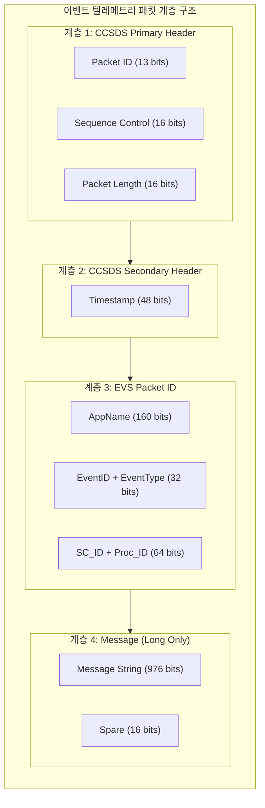
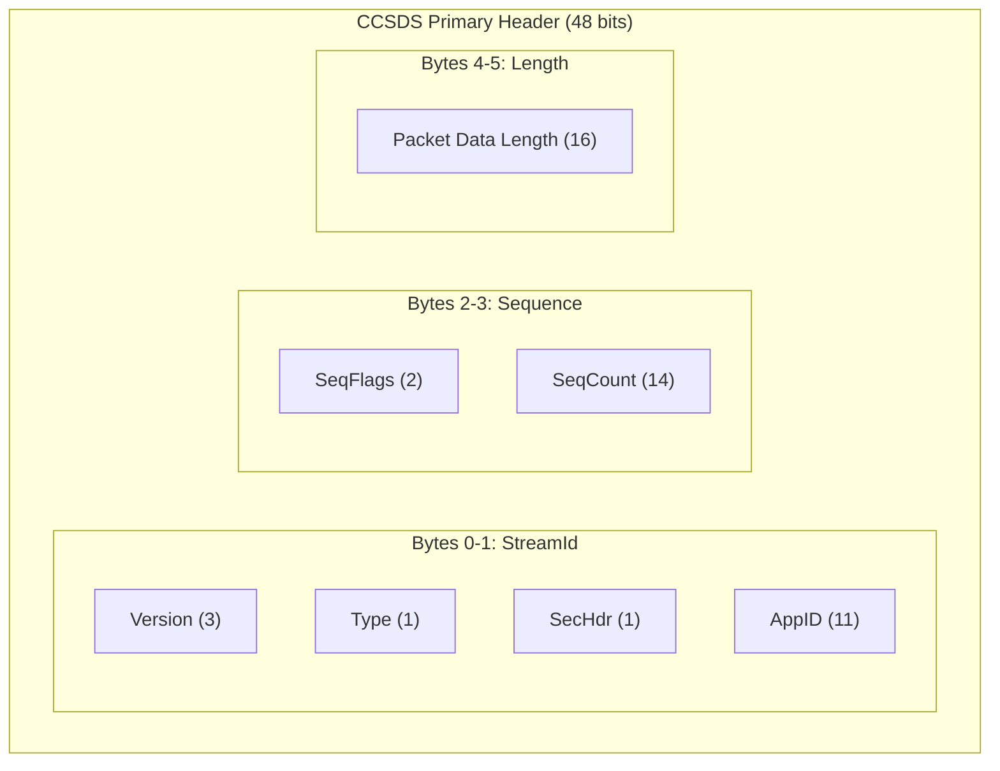
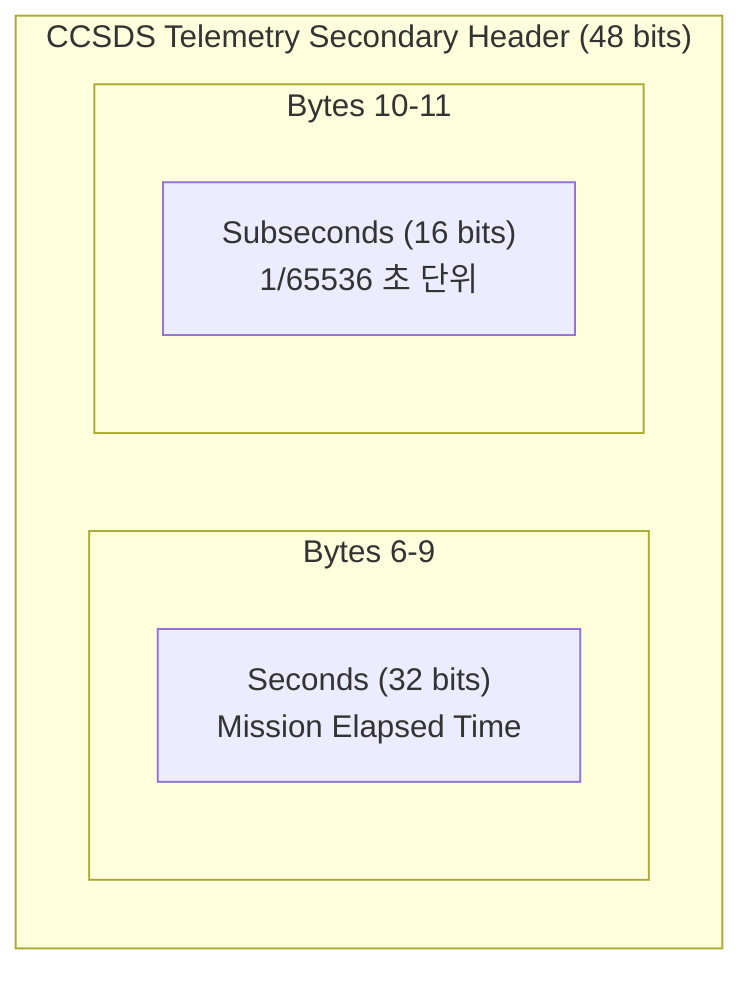
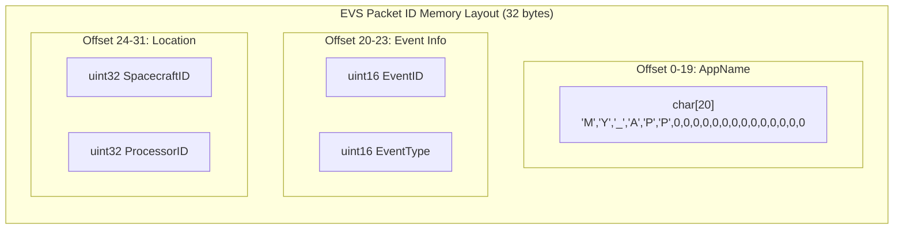
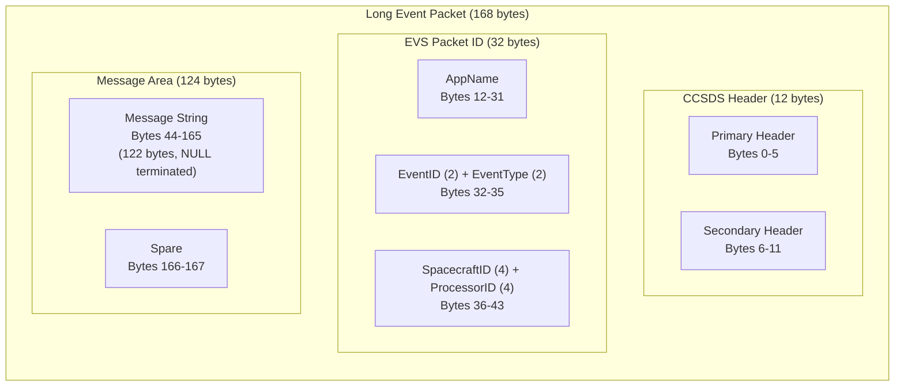
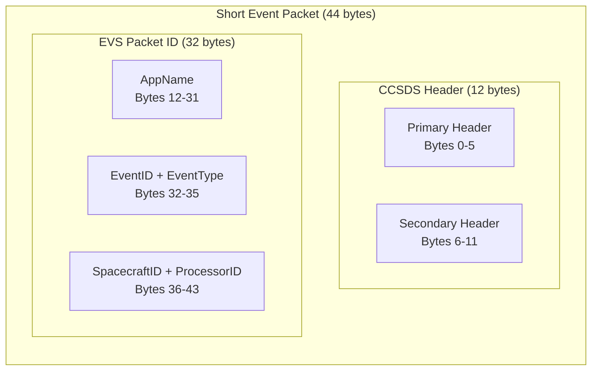
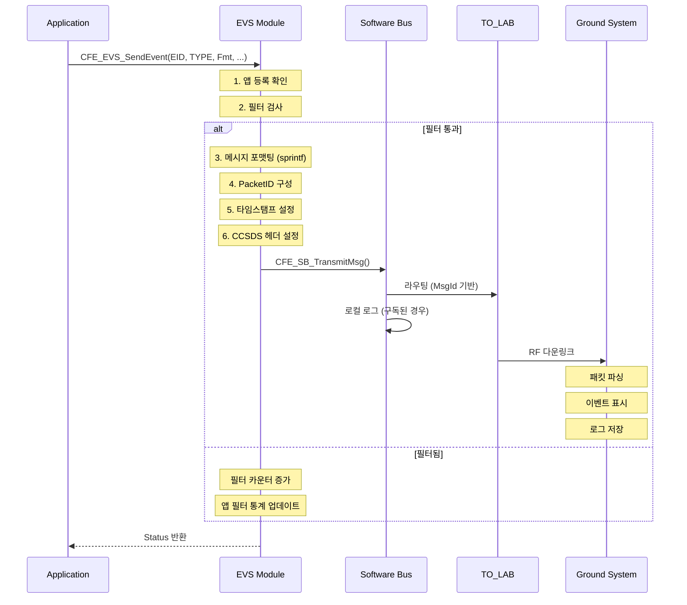

# Phase 2 EVS-03: 이벤트 메시지 구조

## 서론

이벤트 메시지는 단순한 텍스트 문자열이 아니라, 엄격하게 정의된 구조를 갖는 데이터 패킷이다. 이 구조에는 이벤트 발생 시간, 발생 앱, 이벤트 ID, 메시지 내용 등 다양한 정보가 포함되어 있다. 이벤트 메시지 구조를 이해하는 것은 효과적인 이벤트 처리와 분석에 필수적이다.

cFS의 이벤트 메시지는 CCSDS(Consultative Committee for Space Data Systems) 표준 패킷 형식을 기반으로 하며, 표준 텔레메트리 헤더 뒤에 이벤트 고유의 페이로드가 뒤따른다. 이 구조는 지상 시스템과의 상호 운용성을 보장하고, 이벤트 데이터의 효율적인 처리를 가능하게 한다.

본 문서에서는 이벤트 메시지의 내부 구조, 각 필드의 의미와 바이트 레벨 분석, 메시지 형식화 방법, 그리고 패킷 인코딩/디코딩을 상세히 살펴본다.

---

## 1. 이벤트 텔레메트리 패킷 개요

### 1.1 패킷 계층 구조

EVS가 생성하는 이벤트 메시지는 Software Bus를 통해 텔레메트리 패킷으로 전송된다. 이 패킷은 여러 계층으로 구성된다.



### 1.2 패킷 크기 분석

| 구성 요소 | Long Event | Short Event |
|:---|:---:|:---:|
| CCSDS Primary Header | 6 bytes | 6 bytes |
| CCSDS Secondary Header | 6 bytes | 6 bytes |
| EVS Packet ID | 32 bytes | 32 bytes |
| Message + Spare | 124 bytes | 0 bytes |
| **전체** | **168 bytes** | **44 bytes** |

### 1.3 이벤트 메시지 Message ID

이벤트 텔레메트리는 EVS 전용 Message ID로 발행된다. 이 Message ID는 CCSDS Primary Header의 AppID 필드에서 파생되며, 미션 구성에 따라 값이 결정된다.

```c
/* eve_msgids.h - 이벤트 텔레메트리 Message ID */
#define CFE_EVS_LONG_EVENT_MSG_MID    0x0808  /* Long 이벤트 (메시지 포함) */
#define CFE_EVS_SHORT_EVENT_MSG_MID   0x080A  /* Short 이벤트 (헤더만) */

/*
 * Message ID 구성 (CCSDS v1 기준):
 * - 0x08xx: 텔레메트리 패킷 (MSB=0)
 * - xx08: EVS에 할당된 AppID
 */
```

---

## 2. CCSDS 헤더 구조

### 2.1 Primary Header (6 bytes)

이벤트 패킷의 CCSDS Primary Header는 SB 모듈 문서에서 다룬 것과 동일한 구조를 갖는다.

```c
/**
 * CCSDS Primary Header (6 bytes)
 */
typedef struct
{
    uint16 StreamId;        /**< Packet ID + 부가 정보 */
    uint16 Sequence;        /**< 시퀀스 플래그 + 카운터 */
    uint16 Length;          /**< 패킷 길이 - 7 */
} CCSDS_PrimaryHeader_t;
```



**이벤트 패킷의 Primary Header 필드 값:**

| 필드 | 값 | 설명 |
|:---|:---:|:---|
| Version | 0 | CCSDS Version 1 |
| Type | 0 | 텔레메트리 |
| SecHdr | 1 | Secondary Header 있음 |
| AppID | 0x008 (예시) | EVS 할당 ID |
| SeqFlags | 3 | Standalone 패킷 |
| SeqCount | 0-16383 | 자동 증가 |
| Length | 161 (Long) / 37 (Short) | 패킷 데이터 길이 - 1 |

### 2.2 Secondary Header (6 bytes)

텔레메트리 Secondary Header는 타임스탬프를 포함한다.

```c
/**
 * CCSDS Telemetry Secondary Header (6 bytes)
 */
typedef struct
{
    uint32 Seconds;         /**< 초 단위 시간 */
    uint16 Subseconds;      /**< 서브초 (1/65536 초) */
} CCSDS_TlmSecHeader_t;
```



**타임스탬프 해석 예시:**
```c
/* 타임스탬프 값이 다음과 같다면: */
Seconds = 0x12345678  /* 305,419,896 초 */
Subseconds = 0x8000   /* 0.5 초 (32768/65536) */

/* 실제 시간: 305,419,896.5 초 (Mission Elapsed Time) */
/* 이를 UTC로 변환하려면 미션의 Epoch 시간을 더해야 함 */
```

---

## 3. EVS Packet ID 구조

### 3.1 구조 정의

EVS Packet ID는 이벤트의 출처와 유형을 식별하는 정보를 담는다.

```c
/**
 * EVS Packet ID 구조 (32 bytes)
 *
 * 이 구조체는 모든 이벤트 패킷에 공통으로 포함된다.
 */
typedef struct
{
    char    AppName[CFE_MISSION_MAX_API_LEN];  /**< 앱 이름 (20 bytes) */
    uint16  EventID;                           /**< 이벤트 ID (2 bytes) */
    uint16  EventType;                         /**< 이벤트 유형 (2 bytes) */
    uint32  SpacecraftID;                      /**< 우주선 ID (4 bytes) */
    uint32  ProcessorID;                       /**< 프로세서 ID (4 bytes) */
    
} CFE_EVS_PacketID_t;

/* 전체 크기: 20 + 2 + 2 + 4 + 4 = 32 bytes */
```

### 3.2 메모리 레이아웃



### 3.3 각 필드 상세

#### 3.3.1 AppName 필드 (20 bytes)

애플리케이션을 식별하는 이름 문자열이다.

```c
/* AppName 관련 상수 */
#define CFE_MISSION_MAX_API_LEN  20

/*
 * AppName 특성:
 * - NULL 종료 문자열
 * - 최대 19 글자 + 1 NULL
 * - 미사용 바이트는 0으로 채워짐
 * - ES에서 앱 등록 시 설정된 이름 사용
 */

/* 예시 값들 */
"MY_APP\0\0\0\0\0\0\0\0\0\0\0\0\0\0"   /* 미션 앱 */
"CFE_ES\0\0\0\0\0\0\0\0\0\0\0\0\0\0"   /* cFE 서비스 */
"SCH_LAB\0\0\0\0\0\0\0\0\0\0\0\0\0"    /* Lab 앱 */
"TO_LAB\0\0\0\0\0\0\0\0\0\0\0\0\0\0"   /* Lab 앱 */
```

AppName과 EventID의 조합으로 시스템 전체에서 이벤트를 고유하게 식별할 수 있다. 이는 지상 시스템에서 이벤트를 분류하고 필터링하는 핵심 기준이 된다.

#### 3.3.2 EventID 필드 (2 bytes)

앱 내에서 이벤트를 고유하게 식별하는 16비트 정수이다.

```c
/* EventID 값 범위 */
/* 0 - 65535 (16비트 unsigned) */

/* 권장 Event ID 체계 */
#define MY_APP_RESERVED_EID         0    /* 예약됨 (사용 안함) */

/* 정보성 이벤트 (1-9) */
#define MY_APP_INIT_INF_EID         1    /* 초기화 완료 */
#define MY_APP_NOOP_INF_EID         2    /* NOOP 명령 */
#define MY_APP_RESET_INF_EID        3    /* 리셋 명령 */
#define MY_APP_MODE_INF_EID         4    /* 모드 변경 */
#define MY_APP_CONFIG_INF_EID       5    /* 설정 변경 */

/* 명령 오류 (10-19) */
#define MY_APP_CC_ERR_EID           10   /* 잘못된 명령 코드 */
#define MY_APP_LEN_ERR_EID          11   /* 잘못된 길이 */
#define MY_APP_CHECKSUM_ERR_EID     12   /* 체크섬 오류 */

/* 초기화 오류 (20-29) */
#define MY_APP_PIPE_ERR_EID         20   /* 파이프 생성 실패 */
#define MY_APP_SUB_ERR_EID          21   /* 구독 실패 */
#define MY_APP_TBL_ERR_EID          22   /* 테이블 오류 */

/* 런타임 오류 (30-39) */
#define MY_APP_DATA_ERR_EID         30   /* 데이터 오류 */
#define MY_APP_TIMEOUT_ERR_EID      31   /* 타임아웃 */

/* CRITICAL (40-49) */
#define MY_APP_MEM_CRIT_EID         40   /* 메모리 문제 */
#define MY_APP_SAFETY_CRIT_EID      41   /* 안전 위반 */

/* DEBUG (50-99) */
#define MY_APP_DBG_MSG_EID          50   /* 디버그 메시지 */
#define MY_APP_DBG_STATE_EID        51   /* 상태 추적 */
```

#### 3.3.3 EventType 필드 (2 bytes)

이벤트 심각도를 나타내는 필드이다.

```c
/* EventType 열거형 */
typedef enum
{
    CFE_EVS_EventType_DEBUG       = 0,  /* 디버그 정보 */
    CFE_EVS_EventType_INFORMATION = 1,  /* 정보성 메시지 */
    CFE_EVS_EventType_ERROR       = 2,  /* 오류 발생 */
    CFE_EVS_EventType_CRITICAL    = 3   /* 심각한 오류 */
} CFE_EVS_EventType_Enum_t;

/*
 * 바이트 표현 (Little Endian 기준):
 * DEBUG:       0x00 0x00
 * INFORMATION: 0x01 0x00
 * ERROR:       0x02 0x00
 * CRITICAL:    0x03 0x00
 */
```

#### 3.3.4 SpacecraftID 및 ProcessorID (각 4 bytes)

다중 우주선 또는 다중 프로세서 시스템에서 이벤트 발생 위치를 식별한다.

```c
/* 미션 구성 파일에서 정의 */
/* cfe_mission_cfg.h 또는 platform_cfg.h */

#define CFE_MISSION_SPACECRAFT_ID    0x42   /* 우주선 ID */
#define CFE_PLATFORM_CPU_ID          1      /* 프로세서 ID */

/*
 * 사용 시나리오:
 *
 * 1. 단일 우주선, 단일 프로세서:
 *    - SC_ID = 0x01, CPU_ID = 1
 *    - 모든 이벤트가 동일한 값
 *
 * 2. 단일 우주선, 다중 프로세서:
 *    - SC_ID = 0x01
 *    - CPU_ID = 1 (메인), 2 (페이로드), 3 (백업)
 *
 * 3. 다중 우주선 (성능 비행):
 *    - SC_ID = 0x01 (A호), 0x02 (B호)
 *    - 각 우주선별 CPU_ID
 */
```

---

## 4. Long Event 패킷 구조

### 4.1 전체 구조

Long Event 패킷은 최대 122자의 메시지 문자열을 포함하는 완전한 이벤트 패킷이다.

```c
/**
 * Long Event 텔레메트리 페이로드
 */
typedef struct
{
    CFE_EVS_PacketID_t PacketID;  /**< 이벤트 헤더 (32 bytes) */
    
    char Message[CFE_MISSION_EVS_MAX_MESSAGE_LENGTH];  /**< 메시지 (122 bytes) */
    
    uint8 Spare1;                 /**< 정렬용 (1 byte) */
    uint8 Spare2;                 /**< 정렬용 (1 byte) */
    
} CFE_EVS_LongEventTlm_Payload_t;

/* 페이로드 크기: 32 + 122 + 2 = 156 bytes */

/**
 * Long Event 텔레메트리 전체 패킷
 */
typedef struct
{
    CFE_MSG_TelemetryHeader_t       TelemetryHeader;  /**< 12 bytes */
    CFE_EVS_LongEventTlm_Payload_t  Payload;          /**< 156 bytes */
} CFE_EVS_LongEventTlm_t;

/* 전체 패킷 크기: 12 + 156 = 168 bytes */
```

### 4.2 메모리 레이아웃 상세



### 4.3 Message 필드 상세

```c
/* 메시지 최대 길이 */
#define CFE_MISSION_EVS_MAX_MESSAGE_LENGTH  122

/*
 * Message 필드 특성:
 * - NULL 종료 문자열
 * - 최대 121 글자 + 1 NULL
 * - printf 스타일 포맷팅 결과
 * - 잘림 발생 시 EVS가 MessageTruncCounter 증가
 */

/* 메시지 예시와 바이트 표현 */
Message = "MY_APP Initialized. Version 1.2.3"
/* 
 * Bytes: 'M','Y','_','A','P','P',' ','I','n','i','t','i','a','l','i','z',
 *        'e','d','.',' ','V','e','r','s','i','o','n',' ','1','.','2','.',
 *        '3',0,0,0,0,... (나머지 NULL)
 */
```

---

## 5. Short Event 패킷 구조

### 5.1 전체 구조

Short Event 패킷은 메시지 문자열 없이 헤더 정보만 포함한다. 대역폭이 제한된 환경에서 사용된다.

```c
/**
 * Short Event 텔레메트리 페이로드
 */
typedef struct
{
    CFE_EVS_PacketID_t PacketID;  /**< 이벤트 헤더만 (32 bytes) */
    
} CFE_EVS_ShortEventTlm_Payload_t;

/* 페이로드 크기: 32 bytes */

/**
 * Short Event 텔레메트리 전체 패킷
 */
typedef struct
{
    CFE_MSG_TelemetryHeader_t        TelemetryHeader;  /**< 12 bytes */
    CFE_EVS_ShortEventTlm_Payload_t  Payload;          /**< 32 bytes */
} CFE_EVS_ShortEventTlm_t;

/* 전체 패킷 크기: 12 + 32 = 44 bytes */
```

### 5.2 메모리 레이아웃



### 5.3 Long vs Short 상세 비교

| 특성 | Long Event | Short Event |
|:---|:---|:---|
| 패킷 크기 | 168 bytes | 44 bytes |
| 메시지 문자열 | 최대 122자 | 없음 |
| Message ID | CFE_EVS_LONG_EVENT_MSG_MID | CFE_EVS_SHORT_EVENT_MSG_MID |
| 대역폭 사용 | 4배 | 기준 |
| 용도 | 일반 운영, 디버깅 | 대역폭 제한, 긴급 상황 |
| 정보량 | 완전 | 제한적 (EID만으로 의미 파악) |
| 지상 처리 | 즉시 이해 가능 | EID 데이터베이스 필요 |

### 5.4 포맷 모드 전환

```c
/* 이벤트 포맷 모드 설정 */
#define CFE_EVS_MsgFormat_LONG   0  /* Long 포맷 (기본) */
#define CFE_EVS_MsgFormat_SHORT  1  /* Short 포맷 */

/*
 * 지상 명령으로 포맷 모드 변경:
 * 명령 코드: CFE_EVS_SET_EVENT_FORMAT_MODE_CC
 *
 * 사용 시나리오:
 * 1. 정상 시: Long 포맷 사용
 * 2. 대역폭 부족 시: Short로 전환
 * 3. 문제 진단 시: Long으로 복원
 */
```

---

## 6. 메시지 포맷팅

### 6.1 printf 스타일 포맷

`CFE_EVS_SendEvent()` 함수는 표준 C printf 스타일의 포맷 문자열을 지원한다.

```c
/* 지원되는 포맷 지정자 */

/* 정수 */
CFE_EVS_SendEvent(EID, TYPE, "Counter: %d", Counter);      /* signed int */
CFE_EVS_SendEvent(EID, TYPE, "Unsigned: %u", Value);       /* unsigned int */
CFE_EVS_SendEvent(EID, TYPE, "Hex: 0x%08X", HexValue);     /* 8자리 hex */
CFE_EVS_SendEvent(EID, TYPE, "Long: %ld", LongValue);      /* long int */
CFE_EVS_SendEvent(EID, TYPE, "LongHex: 0x%08lX", LongHex); /* long hex */

/* 문자열 */
CFE_EVS_SendEvent(EID, TYPE, "Name: %s", AppName);
CFE_EVS_SendEvent(EID, TYPE, "File: %.32s", Filename);     /* 최대 32자 */

/* 문자 */
CFE_EVS_SendEvent(EID, TYPE, "Char: %c", Character);

/* 부동소수점 - 플랫폼별 주의 필요 */
CFE_EVS_SendEvent(EID, TYPE, "Float: %f", FloatValue);     /* 일부 미지원 */
CFE_EVS_SendEvent(EID, TYPE, "Double: %.2f", DoubleValue); /* 소수점 2자리 */

/* 혼합 */
CFE_EVS_SendEvent(EID, TYPE, 
                  "Status: %s, Count=%u, Value=0x%04X",
                  StatusString, Count, Value);
```

### 6.2 메시지 길이 제한

메시지는 최대 122자로 제한된다. 이 제한을 초과하면 메시지가 잘린다.

```c
/*
 * 메시지 길이 제한:
 * - 최대 122 bytes (NULL 포함)
 * - 즉, 최대 121 글자 + NULL
 * - 잘림 발생 시 EVS HK의 MessageTruncCounter 증가
 */

/* 좋은 예: 간결하고 핵심 정보 포함 */
CFE_EVS_SendEvent(CMD_EID, TYPE,
                  "Cmd processed: CC=%u, RC=0x%08X", CC, RC);
/* 약 40자 - 안전 */

/* 경계 사례: 길이 주의 */
CFE_EVS_SendEvent(ERR_EID, TYPE,
                  "Invalid cmd: MID=0x%04X, CC=%u, len=%u, exp=%u, RC=0x%08X",
                  MID, CC, ActLen, ExpLen, RC);
/* 약 70자 - 아직 안전 */

/* 나쁜 예: 너무 긴 메시지 */
CFE_EVS_SendEvent(ERR_EID, TYPE,
                  "The application has encountered an error while processing "
                  "the received command packet with message ID 0x%04X and "
                  "command code %u. The expected length was %u bytes but the "
                  "actual length received was %u bytes.", 
                  MID, CC, ExpLen, ActLen);
/* 잘림 발생! */

/* 해결책: 핵심만 포함 */
CFE_EVS_SendEvent(ERR_EID, TYPE,
                  "Cmd len err: MID=0x%04X, got=%u, want=%u",
                  MID, ActLen, ExpLen);
```

### 6.3 가변 인자 타입 안전성

가변 인자 함수에서는 타입 일치가 중요하다. 잘못된 타입은 정의되지 않은 동작을 유발할 수 있다.

```c
/*
 * 가변 인자 규칙:
 * 1. char, short → int로 프로모션
 * 2. float → double로 프로모션
 * 3. 명시적 캐스팅 권장
 */

/* 올바른 사용 */
uint16 SmallValue = 100;
CFE_EVS_SendEvent(EID, TYPE, "Value: %u", (unsigned int)SmallValue);

int8 SignedByte = -5;
CFE_EVS_SendEvent(EID, TYPE, "Byte: %d", (int)SignedByte);

CFE_Status_t Status = CFE_SUCCESS;
CFE_EVS_SendEvent(EID, TYPE, "Status: 0x%08X", (unsigned int)Status);

/* 위험한 사용 */
uint16 Value1 = 100;
CFE_EVS_SendEvent(EID, TYPE, "Value: %d", Value1);  /* 프로모션 의존 */

uint64 BigValue = 0x123456789ABCDEF0;
CFE_EVS_SendEvent(EID, TYPE, "Big: 0x%X", BigValue);  /* 잘림! */
/* 수정: "Big: 0x%016llX", (unsigned long long)BigValue */
```

### 6.4 포맷 문자열 모범 사례

```c
/* 1. 상태 반환 코드 */
CFE_EVS_SendEvent(EID, TYPE, "Operation result: RC=0x%08X", 
                  (unsigned int)Status);

/* 2. 카운터/통계 */
CFE_EVS_SendEvent(EID, TYPE, "Stats: sent=%u, recv=%u, err=%u",
                  (unsigned int)Sent, (unsigned int)Recv, (unsigned int)Err);

/* 3. 식별자 */
CFE_EVS_SendEvent(EID, TYPE, "Processing MID=0x%04X, CC=%u",
                  (unsigned int)MsgId, (unsigned int)CmdCode);

/* 4. 포인터/주소 */
CFE_EVS_SendEvent(EID, TYPE, "Buffer at 0x%lX, size=%u",
                  (unsigned long)BufferPtr, (unsigned int)Size);

/* 5. 열거형 */
CFE_EVS_SendEvent(EID, TYPE, "Mode changed to %s (%d)",
                  GetModeName(Mode), (int)Mode);
```

---

## 7. 이벤트 패킷 처리 흐름

### 7.1 이벤트 생성에서 수신까지



### 7.2 EVS 내부 처리 상세

```c
/**
 * EVS 내부 이벤트 처리 (개념적 구현)
 */
CFE_Status_t EVS_GenerateEventPacket(uint16 EventID, uint16 EventType,
                                      const char *Message)
{
    CFE_EVS_LongEventTlm_t EventPacket;
    CFE_ES_AppId_t AppId;
    CFE_TIME_SysTime_t Time;
    
    /* 1. 앱 ID 획득 */
    CFE_ES_GetAppID(&AppId);
    
    /* 2. 현재 시간 획득 */
    Time = CFE_TIME_GetTime();
    
    /* 3. CCSDS 헤더 초기화 */
    CFE_MSG_Init(&EventPacket.TelemetryHeader.Msg,
                 CFE_SB_ValueToMsgId(CFE_EVS_LONG_EVENT_MSG_MID),
                 sizeof(EventPacket));
    
    /* 4. 타임스탬프 설정 */
    CFE_MSG_SetMsgTime(&EventPacket.TelemetryHeader.Msg, Time);
    
    /* 5. Packet ID 구성 */
    CFE_ES_GetAppName(EventPacket.Payload.PacketID.AppName,
                      AppId,
                      sizeof(EventPacket.Payload.PacketID.AppName));
    
    EventPacket.Payload.PacketID.EventID = EventID;
    EventPacket.Payload.PacketID.EventType = EventType;
    EventPacket.Payload.PacketID.SpacecraftID = CFE_MISSION_SPACECRAFT_ID;
    EventPacket.Payload.PacketID.ProcessorID = CFE_PLATFORM_CPU_ID;
    
    /* 6. 메시지 복사 */
    strncpy(EventPacket.Payload.Message, Message,
            CFE_MISSION_EVS_MAX_MESSAGE_LENGTH);
    EventPacket.Payload.Message[CFE_MISSION_EVS_MAX_MESSAGE_LENGTH - 1] = '\0';
    
    /* 7. 정렬 바이트 */
    EventPacket.Payload.Spare1 = 0;
    EventPacket.Payload.Spare2 = 0;
    
    /* 8. 전송 */
    CFE_SB_TransmitMsg(&EventPacket.TelemetryHeader.Msg, true);
    
    return CFE_SUCCESS;
}
```

---

## 8. 이벤트 패킷 바이트 시퀀스 예시

### 8.1 Long Event 패킷 예시

다음은 "MY_APP Initialized" 이벤트의 실제 바이트 시퀀스 예시이다.

```
Offset   Hex Values                                         ASCII
------   ---------                                          -----
0x0000   08 08 C0 00 00 A1 12 34 56 78 80 00                ...4Vx..
         [Primary Hdr ][  Secondary Header   ]

0x000C   4D 59 5F 41 50 50 00 00 00 00 00 00 00 00 00 00    MY_APP..........
         [          AppName (20 bytes)                      
0x001C   00 00 00 00                                        ....
                     ]

0x0020   01 00 01 00                                        ....
         [EID ][Type]

0x0024   42 00 00 00 01 00 00 00                            B.......
         [  SC_ID   ][  CPU_ID  ]

0x002C   4D 59 5F 41 50 50 20 49 6E 69 74 69 61 6C 69 7A    MY_APP Initializ
0x003C   65 64 00 00 00 00 00 00 00 00 00 00 00 00 00 00    ed..............
         [        Message (122 bytes)                       
...      (remaining NULL bytes)
0x00A2   00 00                                              ..
                                                    ][Spare]
```

### 8.2 필드별 해석

```
Primary Header (6 bytes):
  08 08 -> StreamId: Version=0, Type=0, SecHdr=1, AppID=0x008
  C0 00 -> Sequence: SeqFlags=3, SeqCount=0
  00 A1 -> Length: 161 (패킷 데이터 길이 - 1 = 162 - 1)

Secondary Header (6 bytes):
  12 34 56 78 -> Seconds: 0x78563412 (Little Endian)
  80 00 -> Subseconds: 0x0080

Packet ID (32 bytes):
  AppName: "MY_APP" + NULL padding
  EventID: 0x0001 (INIT_EID)
  EventType: 0x0001 (INFORMATION)
  SpacecraftID: 0x00000042
  ProcessorID: 0x00000001

Message (122 + 2 bytes):
  "MY_APP Initialized" + NULL padding + Spare
```

---

## 9. 지상 시스템 이벤트 표시

### 9.1 표준 표시 형식

지상 시스템에서 이벤트는 일반적으로 다음과 같은 형식으로 표시된다:

```
[시간] [우주선.프로세서] [앱이름] [유형] (EventID) 메시지

예시:
[2024/180-12:34:56.789] [SC42.CPU1] MY_APP INFO (1) MY_APP Initialized. Version 1.2.3
[2024/180-12:34:57.123] [SC42.CPU1] MY_APP ERROR (10) Invalid command code: received=5
[2024/180-12:35:00.456] [SC42.CPU2] THERMAL CRITICAL (40) Temperature limit exceeded: 85C
```

### 9.2 색상 코딩

| 유형 | 색상 | 배경 | 의미 |
|:---|:---|:---|:---|
| DEBUG | 회색 | - | 개발/테스트 정보 |
| INFORMATION | 녹색/흰색 | - | 정상 동작 |
| ERROR | 노란색 | - | 오류 (복구 가능) |
| CRITICAL | 흰색 | 빨간색 | 심각 (즉시 주의) |

### 9.3 이벤트 필터링 및 검색

```python
# 지상 시스템 이벤트 처리 예시 (Python 의사 코드)

def parse_event_packet(packet_bytes):
    """이벤트 패킷을 파싱하여 구조화된 데이터로 변환"""
    
    event = {}
    
    # CCSDS 헤더 파싱
    event['stream_id'] = struct.unpack('<H', packet_bytes[0:2])[0]
    event['sequence'] = struct.unpack('<H', packet_bytes[2:4])[0]
    event['length'] = struct.unpack('<H', packet_bytes[4:6])[0]
    
    # 타임스탬프
    event['seconds'] = struct.unpack('<I', packet_bytes[6:10])[0]
    event['subsecs'] = struct.unpack('<H', packet_bytes[10:12])[0]
    event['time'] = convert_to_utc(event['seconds'], event['subsecs'])
    
    # Packet ID
    event['app_name'] = packet_bytes[12:32].decode().rstrip('\x00')
    event['event_id'] = struct.unpack('<H', packet_bytes[32:34])[0]
    event['event_type'] = struct.unpack('<H', packet_bytes[34:36])[0]
    event['sc_id'] = struct.unpack('<I', packet_bytes[36:40])[0]
    event['cpu_id'] = struct.unpack('<I', packet_bytes[40:44])[0]
    
    # Message (Long Event인 경우)
    if len(packet_bytes) > 44:
        event['message'] = packet_bytes[44:166].decode().rstrip('\x00')
    else:
        event['message'] = f"EID={event['event_id']}"  # Short Event
    
    return event

def filter_events(events, app_name=None, event_type=None, event_id=None):
    """이벤트 필터링"""
    result = events
    
    if app_name:
        result = [e for e in result if e['app_name'] == app_name]
    if event_type is not None:
        result = [e for e in result if e['event_type'] == event_type]
    if event_id is not None:
        result = [e for e in result if e['event_id'] == event_id]
    
    return result

# 사용 예시
all_events = [parse_event_packet(p) for p in received_packets]
my_app_errors = filter_events(all_events, app_name='MY_APP', event_type=2)
critical_events = filter_events(all_events, event_type=3)
```

---

## 10. 글로벌 이벤트 식별

### 10.1 고유 식별자 조합

시스템 전체에서 이벤트를 고유하게 식별하려면 다음 조합이 필요하다:

```
글로벌 이벤트 ID = (SpacecraftID, ProcessorID, AppName, EventID)
```

```c
/*
 * 예시:
 * 이벤트 A: (0x42, 1, "MY_APP", 10)
 * 이벤트 B: (0x42, 1, "MY_APP", 11)  - 다른 EID
 * 이벤트 C: (0x42, 2, "MY_APP", 10)  - 다른 CPU
 * 이벤트 D: (0x43, 1, "MY_APP", 10)  - 다른 우주선
 *
 * 모두 서로 다른 이벤트임
 */
```

### 10.2 이벤트 데이터베이스 스키마 예시

```sql
-- 이벤트 정의 테이블
CREATE TABLE event_definitions (
    id INTEGER PRIMARY KEY,
    spacecraft_id INTEGER NOT NULL,
    processor_id INTEGER NOT NULL,
    app_name VARCHAR(20) NOT NULL,
    event_id INTEGER NOT NULL,
    event_name VARCHAR(50),
    description TEXT,
    default_message_format VARCHAR(200),
    
    UNIQUE(spacecraft_id, processor_id, app_name, event_id)
);

-- 이벤트 로그 테이블
CREATE TABLE event_log (
    id INTEGER PRIMARY KEY,
    receive_time TIMESTAMP,
    event_time TIMESTAMP,
    spacecraft_id INTEGER,
    processor_id INTEGER,
    app_name VARCHAR(20),
    event_id INTEGER,
    event_type INTEGER,
    message VARCHAR(122)
);
```

---

## 결론

이벤트 메시지는 CCSDS 표준 헤더와 EVS 고유 페이로드로 구성된 구조화된 데이터 패킷이다. Long Event는 메시지 문자열을 포함하여 168 bytes, Short Event는 헤더만으로 44 bytes 크기를 갖는다. 각 필드의 의미와 바이트 레이아웃을 이해하면 효과적인 이벤트 처리와 분석이 가능하다.

핵심 사항을 정리하면 다음과 같다:
- **패킷 구조**: CCSDS 헤더 (12B) + EVS Packet ID (32B) + Message (선택)
- **Long Event**: 168 bytes, 최대 122자 메시지 포함
- **Short Event**: 44 bytes, 대역폭 절약용
- **고유 식별**: (SC_ID, CPU_ID, AppName, EventID) 조합
- **메시지 포맷**: printf 스타일, 122자 제한, 타입 캐스팅 권장
- **타임스탬프**: CCSDS Secondary Header에 자동 기록

다음 문서에서는 이벤트 필터링 메커니즘을 상세히 살펴볼 것이다.

---

## 참고 문헌

1. NASA, "cFE Application Developer's Guide"
2. NASA, "Event Services User's Guide"
3. NASA cFE GitHub, cfe/modules/evs/fsw/inc/cfe_evs_msg.h
4. CCSDS, "Space Packet Protocol" (CCSDS 133.0-B-1)
5. NASA, "cFS Telemetry Handbook"

---

[이전 문서: Phase 2 EVS-02: 이벤트 메시지 유형](./Phase2_EVS_02_이벤트_메시지_유형.md)

[다음 문서: Phase 2 EVS-04: 이벤트 필터링 메커니즘](./Phase2_EVS_04_이벤트_필터링_메커니즘.md)
