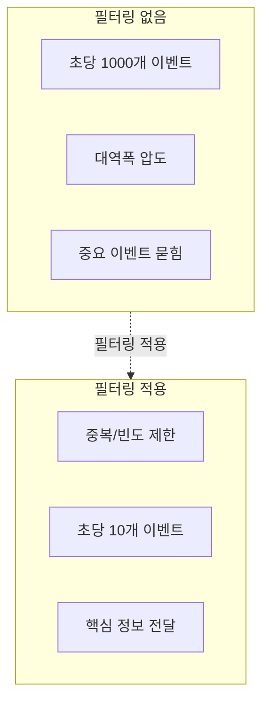
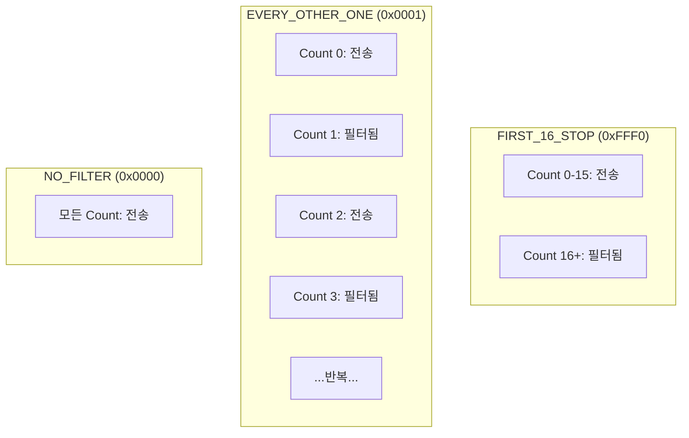
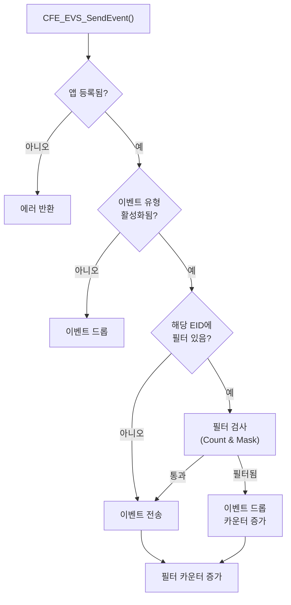
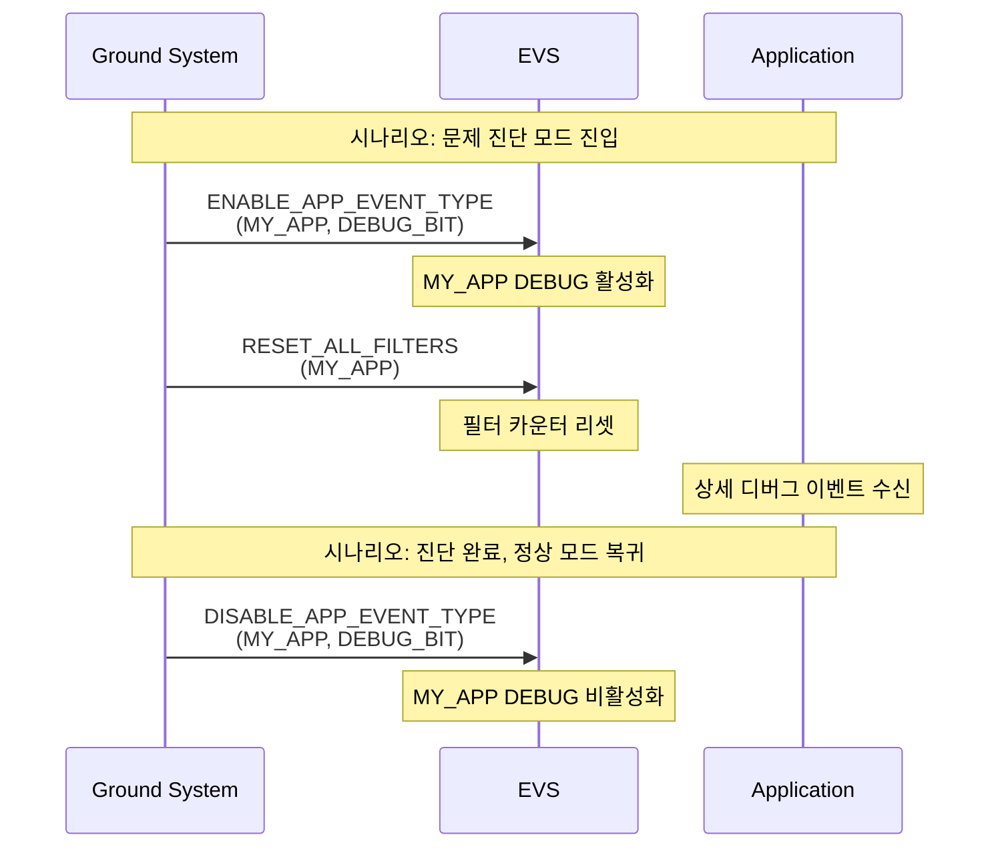

# Phase 2 EVS-04: 이벤트 필터링 메커니즘

## 서론

우주 비행 소프트웨어에서 이벤트는 매우 빈번하게 발생할 수 있다. 모든 이벤트를 텔레메트리로 전송하면 다운링크 대역폭을 압도하고, 중요한 이벤트가 덜 중요한 이벤트에 묻힐 수 있다. Event Services는 이벤트 필터링 메커니즘을 통해 이 문제를 해결한다. 필터링을 통해 특정 이벤트의 발생 빈도를 제한하거나, 특정 유형의 이벤트를 완전히 차단할 수 있다.

본 문서에서는 EVS의 필터링 메커니즘, 필터 유형, 구성 방법, 그리고 운영 중 필터 제어를 상세히 살펴본다.

---

## 1. 필터링 개요

### 1.1 필터링의 필요성

이벤트 필터링이 필요한 이유는 다음과 같다.

첫째, **대역폭 보호**이다. 우주 통신 대역폭은 제한되어 있다. 모든 이벤트를 전송하면 중요한 텔레메트리 데이터 전송에 지장을 줄 수 있다.

둘째, **이벤트 폭주 방지**이다. 루프 내에서 발생하는 이벤트나 반복되는 오류 상황에서는 동일한 이벤트가 초당 수백 번 발생할 수 있다. 이러한 폭주를 제한하지 않으면 시스템 성능에 영향을 미칠 수 있다.

셋째, **가독성 향상**이다. 너무 많은 이벤트는 운영자가 중요한 정보를 파악하기 어렵게 만든다. 필터링을 통해 정말 중요한 이벤트에 집중할 수 있다.



### 1.2 필터링 레벨

EVS는 여러 레벨에서 필터링을 지원한다.

| 레벨 | 범위 | 제어 방법 |
|:---|:---|:---|
| **이벤트 ID** | 특정 이벤트 | 앱 등록 시 필터 테이블 |
| **이벤트 유형** | DEBUG/INFO/ERROR/CRITICAL | 앱별 유형 마스크 |
| **앱 전체** | 앱의 모든 이벤트 | 앱 활성화/비활성화 |
| **출력 포트** | 개별 출력 채널 | 포트별 유형 마스크 |

---

## 2. Binary Filter 메커니즘

### 2.1 Binary Filter 개념

cFE EVS는 "Binary Filter" 방식을 사용한다. 이 방식에서 각 이벤트 ID에 대해 마스크와 카운터를 사용하여 해당 이벤트의 전송 여부를 결정한다.

```c
/**
 * Binary Filter 항목
 */
typedef struct
{
    uint16 EventID;   /**< 필터링할 이벤트 ID */
    uint16 Mask;      /**< 필터 마스크 */
} CFE_EVS_BinFilter_t;
```

### 2.2 필터 마스크 동작 원리

Binary Filter는 이벤트 발생 카운터와 마스크의 AND 연산 결과에 따라 이벤트 전송을 결정한다.

```c
/* 필터 동작 원리 */
bool ShouldSendEvent(uint16 EventCount, uint16 Mask)
{
    /* Count AND Mask가 0이면 이벤트 전송 */
    return ((EventCount & Mask) == 0);
}

/* 예시:
 * Mask = 0x0001 (1)
 * Count 0: 0 & 1 = 0 → 전송
 * Count 1: 1 & 1 = 1 → 필터됨
 * Count 2: 2 & 1 = 0 → 전송
 * Count 3: 3 & 1 = 1 → 필터됨
 * → 2회 중 1회만 전송 (50%)
 */
```

### 2.3 사전 정의된 필터 마스크

```c
/* EVS 필터 마스크 정의 */
#define CFE_EVS_NO_FILTER           0x0000  /* 필터 없음 (모두 전송) */
#define CFE_EVS_FIRST_ONE_STOP      0xFFFF  /* 1회만 전송 */
#define CFE_EVS_FIRST_TWO_STOP      0xFFFE  /* 2회만 전송 */
#define CFE_EVS_FIRST_4_STOP        0xFFFC  /* 4회만 전송 */
#define CFE_EVS_FIRST_8_STOP        0xFFF8  /* 8회만 전송 */
#define CFE_EVS_FIRST_16_STOP       0xFFF0  /* 16회만 전송 */
#define CFE_EVS_FIRST_32_STOP       0xFFE0  /* 32회만 전송 */
#define CFE_EVS_FIRST_64_STOP       0xFFC0  /* 64회만 전송 */
#define CFE_EVS_EVERY_OTHER_ONE     0x0001  /* 2회 중 1회 */
#define CFE_EVS_EVERY_OTHER_TWO     0x0002  /* 4회 중 1회 */
#define CFE_EVS_EVERY_FOURTH_ONE    0x0003  /* 4회 중 1회 */
```

### 2.4 필터 마스크 동작 예시



---

## 3. 필터 등록

### 3.1 앱 초기화 시 필터 등록

앱은 EVS 등록 시 필터 테이블을 제공한다.

```c
/* 필터 테이블 정의 */
CFE_EVS_BinFilter_t MY_APP_EventFilters[] =
{
    /* 자주 발생하는 DEBUG 이벤트 */
    {MY_APP_DEBUG_LOOP_EID,  CFE_EVS_FIRST_16_STOP},
    
    /* 반복될 수 있는 오류 */
    {MY_APP_PIPE_FULL_EID,   CFE_EVS_FIRST_8_STOP},
    
    /* 빈번한 상태 보고 */
    {MY_APP_STATUS_EID,      CFE_EVS_EVERY_OTHER_TWO},  /* 4회 중 1회 */
    
    /* 필터 없이 모두 전송 */
    {MY_APP_CRITICAL_EID,    CFE_EVS_NO_FILTER},
};

#define MY_APP_EVENT_FILTER_COUNT \
    (sizeof(MY_APP_EventFilters) / sizeof(MY_APP_EventFilters[0]))

/* EVS 등록 */
CFE_Status_t MY_APP_Init(void)
{
    CFE_Status_t Status;
    
    /* 필터와 함께 EVS 등록 */
    Status = CFE_EVS_Register(MY_APP_EventFilters,
                              MY_APP_EVENT_FILTER_COUNT,
                              CFE_EVS_EventFilter_BINARY);
    
    if (Status != CFE_SUCCESS)
    {
        CFE_ES_WriteToSysLog("MY_APP: EVS Register failed, RC=0x%08X\n",
                             (unsigned int)Status);
        return Status;
    }
    
    return CFE_SUCCESS;
}
```

### 3.2 필터 없이 등록

필터가 필요 없는 경우 NULL과 0을 전달한다.

```c
/* 필터 없이 등록 */
Status = CFE_EVS_Register(NULL, 0, CFE_EVS_EventFilter_BINARY);

/* 이 경우 모든 이벤트가 필터링 없이 전송됨 */
```

### 3.3 필터 최대 개수

앱당 필터의 최대 개수는 플랫폼 구성에 의해 제한된다.

```c
/* platform_cfg.h */
#define CFE_PLATFORM_EVS_MAX_EVENT_FILTERS  8

/* 이 값을 초과하는 필터는 무시됨 */
```

---

## 4. 이벤트 유형 필터링

### 4.1 유형 마스크 개념

필터 테이블 외에도 EVS는 이벤트 유형(DEBUG, INFO, ERROR, CRITICAL) 전체를 활성화/비활성화할 수 있다.

```c
/* 유형 비트 마스크 */
#define CFE_EVS_DEBUG_BIT       0x01  /* DEBUG 활성화 */
#define CFE_EVS_INFORMATION_BIT 0x02  /* INFO 활성화 */
#define CFE_EVS_ERROR_BIT       0x04  /* ERROR 활성화 */
#define CFE_EVS_CRITICAL_BIT    0x08  /* CRITICAL 활성화 */

/* 기본값: 모든 유형 활성 */
#define CFE_PLATFORM_EVS_DEFAULT_TYPE_FLAG  0x0F
```

### 4.2 앱별 유형 제어 (지상 명령)

```c
/* 앱의 특정 이벤트 유형 비활성화 */
/* 명령: CFE_EVS_DISABLE_APP_EVENT_TYPE_CC */
/* 페이로드:
 *   AppName: "MY_APP"
 *   BitMask: CFE_EVS_DEBUG_BIT (0x01)
 */
/* 결과: MY_APP의 DEBUG 이벤트 비활성화 */

/* 앱의 특정 이벤트 유형 활성화 */
/* 명령: CFE_EVS_ENABLE_APP_EVENT_TYPE_CC */
/* 페이로드:
 *   AppName: "MY_APP"
 *   BitMask: CFE_EVS_DEBUG_BIT (0x01)
 */
/* 결과: MY_APP의 DEBUG 이벤트 활성화 */
```

### 4.3 출력 포트별 유형 제어

```c
/* 특정 출력 포트의 이벤트 유형 설정 */
/* 명령: CFE_EVS_SET_EVENT_FORMAT_MODE_CC */

/* 포트 1 (텔레메트리): 모든 유형 */
/* 포트 2 (로컬 로그): ERROR, CRITICAL만 */
/* 포트 3 (디버그): DEBUG만 */
```

---

## 5. 런타임 필터 제어

### 5.1 필터 리셋

필터 카운터를 리셋하여 제한된 이벤트를 다시 전송할 수 있다.

```c
/* 지상 명령으로 필터 리셋 */
/* 명령: CFE_EVS_RESET_FILTER_CC */
/* 페이로드:
 *   AppName: "MY_APP"
 *   EventID: MY_APP_DEBUG_LOOP_EID
 */
/* 결과: 해당 이벤트의 필터 카운터가 0으로 리셋 */

/* 앱의 모든 필터 리셋 */
/* 명령: CFE_EVS_RESET_ALL_FILTERS_CC */
/* 페이로드:
 *   AppName: "MY_APP"
 */
/* 결과: MY_APP의 모든 필터 카운터 리셋 */
```

### 5.2 필터 추가

런타임에 새 필터를 추가할 수 있다.

```c
/* 지상 명령으로 필터 추가 */
/* 명령: CFE_EVS_ADD_EVENT_FILTER_CC */
/* 페이로드:
 *   AppName: "MY_APP"
 *   EventID: NEW_EVENT_ID
 *   Mask: CFE_EVS_FIRST_8_STOP
 */
/* 결과: 새 필터가 앱의 필터 테이블에 추가됨 */
```

### 5.3 필터 삭제

```c
/* 지상 명령으로 필터 삭제 */
/* 명령: CFE_EVS_DELETE_EVENT_FILTER_CC */
/* 페이로드:
 *   AppName: "MY_APP"
 *   EventID: MY_APP_DEBUG_LOOP_EID
 */
/* 결과: 해당 이벤트의 필터가 제거되고, 이후 필터링 없이 전송 */
```

### 5.4 필터 마스크 변경

```c
/* 지상 명령으로 필터 마스크 변경 */
/* 명령: CFE_EVS_SET_FILTER_CC */
/* 페이로드:
 *   AppName: "MY_APP"
 *   EventID: MY_APP_STATUS_EID
 *   Mask: CFE_EVS_EVERY_OTHER_ONE  (변경된 마스크)
 */
/* 결과: 기존 필터 마스크가 새 값으로 변경 */
```

---

## 6. 필터링 흐름

### 6.1 이벤트 발송 시 필터 검사



### 6.2 필터 검사 의사 코드

```c
/* EVS 내부 필터 검사 로직 (개념적) */
bool EVS_CheckFilters(AppId, EventId, EventType)
{
    AppData = GetAppData(AppId);
    
    /* 유형 마스크 검사 */
    if (!IsEventTypeEnabled(AppData, EventType))
    {
        AppData->FilteredEventCount++;
        return false;  /* 필터됨 */
    }
    
    /* Binary Filter 검사 */
    FilterEntry = FindFilter(AppData, EventId);
    if (FilterEntry != NULL)
    {
        /* (Count & Mask) == 0 이면 통과 */
        if ((FilterEntry->Count & FilterEntry->Mask) != 0)
        {
            FilterEntry->Count++;
            AppData->FilteredEventCount++;
            return false;  /* 필터됨 */
        }
        FilterEntry->Count++;
    }
    
    return true;  /* 통과 */
}
```

---

## 7. 필터 사용 모범 사례

### 7.1 필터 대상 이벤트 선정

| 필터 필요 | 필터 불필요 |
|:---|:---|
| 루프 내 DEBUG 이벤트 | 초기화 완료 |
| 반복 가능한 오류 | 명령 수신 확인 |
| 고빈도 상태 보고 | CRITICAL 이벤트 |
| 주기적 동작 로그 | 일회성 상태 변화 |

### 7.2 적절한 필터 마스크 선택

```c
/* 시나리오별 권장 마스크 */

/* 시나리오 1: 초기 디버깅만 필요 */
/* 처음 몇 번만 보고 이후 불필요 */
{DEBUG_LOOP_EID, CFE_EVS_FIRST_16_STOP}

/* 시나리오 2: 지속적으로 일부만 */
/* 계속 샘플링하며 모니터링 */
{STATUS_REPORT_EID, CFE_EVS_EVERY_OTHER_TWO}  /* 25% */

/* 시나리오 3: 첫 발생만 중요 */
/* 한 번 알면 충분 */
{INIT_WARNING_EID, CFE_EVS_FIRST_ONE_STOP}

/* 시나리오 4: 절대 필터 안함 */
/* 모든 발생이 중요 */
{SAFETY_ALERT_EID, CFE_EVS_NO_FILTER}
```

### 7.3 필터 테이블 설계 예시

```c
/* 잘 설계된 필터 테이블 */
CFE_EVS_BinFilter_t MY_APP_Filters[] =
{
    /* DEBUG 이벤트: 강하게 필터링 */
    {MY_APP_MSG_RCVD_DBG_EID,   CFE_EVS_FIRST_16_STOP},
    {MY_APP_PROCESSING_DBG_EID, CFE_EVS_FIRST_8_STOP},
    
    /* 반복 가능한 오류: 적절히 제한 */
    {MY_APP_PIPE_FULL_ERR_EID,  CFE_EVS_FIRST_8_STOP},
    {MY_APP_DATA_INVALID_EID,  CFE_EVS_FIRST_4_STOP},
    
    /* 주기적 보고: 샘플링 */
    {MY_APP_PERIODIC_STATUS_EID, CFE_EVS_EVERY_OTHER_TWO},
    
    /* 중요 이벤트: 필터 없음 (명시적) */
    {MY_APP_MODE_CHANGE_EID,   CFE_EVS_NO_FILTER},
    {MY_APP_CRITICAL_ERR_EID,  CFE_EVS_NO_FILTER},
};

/* 주의: 필터 최대 개수 확인 */
#if (sizeof(MY_APP_Filters)/sizeof(MY_APP_Filters[0]) > CFE_PLATFORM_EVS_MAX_EVENT_FILTERS)
#error "Too many event filters defined"
#endif
```

---

## 8. 필터 통계 모니터링

### 8.1 앱별 필터 통계

EVS HK 텔레메트리에는 앱별 이벤트 통계가 포함된다.

```c
/* 앱별 통계 (개념적) */
typedef struct
{
    char AppName[20];
    uint32 EventsSent;       /* 전송된 이벤트 수 */
    uint32 EventsFiltered;   /* 필터된 이벤트 수 */
    uint8 EventTypeMask;     /* 활성 유형 마스크 */
} EVS_AppStats_t;
```

### 8.2 통계 활용

```c
/* 필터 효과 분석 */
/*
 * 예시 데이터:
 *   MY_APP: Sent=50, Filtered=2000
 *
 * 분석:
 * - 필터 비율: 2000/(50+2000) = 97.5%
 * - 필터가 효과적으로 이벤트 폭주 방지
 *
 * 주의 상황:
 * - Filtered가 매우 높으면 → 필터가 너무 강함?
 * - Sent가 예상보다 적으면 → 필터 조정 필요?
 */
```

---

## 9. 고급 필터링 시나리오

### 9.1 동적 필터 조정

운영 시나리오에 따라 필터를 동적으로 조정하는 절차:



### 9.2 운영 단계별 필터 전략

| 단계 | 필터 전략 |
|:---|:---|
| 개발/테스트 | 모든 유형 활성, 필터 최소화 |
| 통합 테스트 | DEBUG 필터링 시작 |
| 시스템 테스트 | 실 운영과 유사한 필터 |
| 비행 운영 | 최적화된 필터, ERROR/CRITICAL 집중 |
| 이상 상황 | 필터 완화하여 상세 정보 수집 |

---

## 결론

이벤트 필터링은 효과적인 이벤트 관리의 핵심이다. Binary Filter 메커니즘과 유형 마스킹을 조합하여 이벤트 폭주를 방지하고, 중요한 이벤트에 집중할 수 있다.

핵심 사항을 정리하면 다음과 같다:
- **Binary Filter**: 마스크와 카운터로 빈도 제한
- **사전 정의 마스크**: FIRST_N_STOP, EVERY_OTHER 등
- **유형 마스킹**: DEBUG/INFO/ERROR/CRITICAL 전체 제어
- **런타임 제어**: 필터 추가/삭제/리셋/변경 가능
- **모범 사례**: DEBUG 필터링, CRITICAL은 필터 없음

다음 문서에서는 이벤트 등록과 발송의 상세한 사용법을 살펴볼 것이다.

---

## 참고 문헌

1. NASA, "cFE Application Developer's Guide"
2. NASA, "Event Services User's Guide"
3. NASA cFE GitHub, cfe/modules/evs/fsw/src/
4. NASA, "cFS Event Filtering Best Practices"

---

[이전 문서: Phase 2 EVS-03: 이벤트 메시지 구조](./Phase2_EVS_03_이벤트_메시지_구조.md)

[다음 문서: Phase 2 EVS-05: 이벤트 등록과 발송](./Phase2_EVS_05_이벤트_등록과_발송.md)
