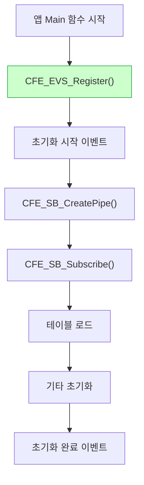

# Phase 2 EVS-05: 이벤트 등록과 발송

## 서론

애플리케이션이 이벤트 서비스를 사용하려면 먼저 EVS에 등록해야 한다. 등록이 완료되면 다양한 이벤트 발송 함수를 사용하여 이벤트를 발생시킬 수 있다. 이 과정은 cFS 애플리케이션 개발의 기본이며, 거의 모든 앱에서 사용된다.

본 문서에서는 EVS 등록 과정, 다양한 이벤트 발송 함수, 그리고 실제 앱에서의 사용 패턴을 상세히 살펴본다.

---

## 1. EVS 등록

### 1.1 등록의 필요성

앱은 이벤트를 발송하기 전에 반드시 EVS에 등록해야 한다. 등록하지 않은 앱이 이벤트를 발송하면 `CFE_EVS_APP_NOT_REGISTERED` 에러가 반환된다.

등록 과정에서 다음이 수행된다:
- EVS 내부 레지스트리에 앱 정보 기록
- 앱의 이벤트 필터 테이블 설정
- 앱의 이벤트 유형 마스크 초기화
- 앱의 이벤트 통계 카운터 초기화

### 1.2 CFE_EVS_Register 함수

```c
/**
 * @brief EVS에 애플리케이션 등록
 *
 * @param[in] Filters         이벤트 필터 배열 (NULL 가능)
 * @param[in] NumEventFilters 필터 개수 (0 가능)
 * @param[in] FilterScheme    필터링 방식 (CFE_EVS_EventFilter_BINARY)
 *
 * @return CFE_SUCCESS                  성공
 * @return CFE_EVS_APP_FILTER_OVERLOAD  필터 수 초과
 * @return CFE_EVS_UNKNOWN_FILTER       알 수 없는 필터 방식
 * @return CFE_EVS_APP_ILLEGAL_APP_ID   잘못된 앱 ID
 */
CFE_Status_t CFE_EVS_Register(const CFE_EVS_BinFilter_t *Filters,
                               uint16 NumEventFilters,
                               uint16 FilterScheme);
```

### 1.3 등록 예시: 필터 없음

가장 간단한 형태의 등록이다.

```c
CFE_Status_t MY_APP_Init(void)
{
    CFE_Status_t Status;
    
    /* EVS 등록 - 필터 없음 */
    Status = CFE_EVS_Register(NULL, 0, CFE_EVS_EventFilter_BINARY);
    
    if (Status != CFE_SUCCESS)
    {
        CFE_ES_WriteToSysLog("MY_APP: EVS Register failed, RC=0x%08X\n",
                             (unsigned int)Status);
        return Status;
    }
    
    /* 등록 후 이벤트 발송 가능 */
    CFE_EVS_SendEvent(MY_APP_INIT_INF_EID,
                      CFE_EVS_EventType_INFORMATION,
                      "MY_APP: EVS Registration complete");
    
    /* 나머지 초기화... */
    
    return CFE_SUCCESS;
}
```

### 1.4 등록 예시: 필터 포함

```c
/* 필터 테이블 정의 */
static CFE_EVS_BinFilter_t MY_APP_EventFilters[] =
{
    {MY_APP_DEBUG_MSG_EID,    CFE_EVS_FIRST_16_STOP},
    {MY_APP_PIPE_FULL_EID,    CFE_EVS_FIRST_8_STOP},
    {MY_APP_DATA_STATUS_EID,  CFE_EVS_EVERY_OTHER_TWO},
};

#define MY_APP_EVENT_FILTER_COUNT \
    (sizeof(MY_APP_EventFilters) / sizeof(MY_APP_EventFilters[0]))

CFE_Status_t MY_APP_Init(void)
{
    CFE_Status_t Status;
    
    /* EVS 등록 - 필터 포함 */
    Status = CFE_EVS_Register(MY_APP_EventFilters,
                              MY_APP_EVENT_FILTER_COUNT,
                              CFE_EVS_EventFilter_BINARY);
    
    if (Status != CFE_SUCCESS)
    {
        CFE_ES_WriteToSysLog("MY_APP: EVS Register failed, RC=0x%08X\n",
                             (unsigned int)Status);
        return Status;
    }
    
    CFE_EVS_SendEvent(MY_APP_INIT_INF_EID,
                      CFE_EVS_EventType_INFORMATION,
                      "MY_APP Initialized with %u event filters",
                      (unsigned int)MY_APP_EVENT_FILTER_COUNT);
    
    return CFE_SUCCESS;
}
```

### 1.5 초기화 순서에서의 위치

EVS 등록은 앱 초기화의 가장 첫 단계 중 하나여야 한다.



---

## 2. 이벤트 발송 함수

### 2.1 CFE_EVS_SendEvent

가장 일반적으로 사용되는 이벤트 발송 함수이다.

```c
/**
 * @brief 이벤트 메시지 발송
 *
 * @param[in] EventID   이벤트 식별자
 * @param[in] EventType 이벤트 유형 (DEBUG/INFO/ERROR/CRITICAL)
 * @param[in] Spec      printf 스타일 포맷 문자열
 * @param[in] ...       가변 인자
 *
 * @return CFE_SUCCESS                성공
 * @return CFE_EVS_APP_NOT_REGISTERED 앱 미등록
 * @return CFE_EVS_APP_ILLEGAL_APP_ID 잘못된 앱 ID
 */
CFE_Status_t CFE_EVS_SendEvent(uint16 EventID,
                                uint16 EventType,
                                const char *Spec, ...);
```

**사용 예시:**

```c
/* INFORMATION 이벤트 */
CFE_EVS_SendEvent(MY_APP_CMD_RCVD_EID,
                  CFE_EVS_EventType_INFORMATION,
                  "Command received: CC=%d", 
                  (int)CommandCode);

/* ERROR 이벤트 */
CFE_EVS_SendEvent(MY_APP_CMD_ERR_EID,
                  CFE_EVS_EventType_ERROR,
                  "Invalid command length: expected=%u, received=%u",
                  (unsigned int)ExpectedLen,
                  (unsigned int)ActualLen);

/* DEBUG 이벤트 */
CFE_EVS_SendEvent(MY_APP_DEBUG_EID,
                  CFE_EVS_EventType_DEBUG,
                  "Processing buffer: addr=0x%08lX, size=%u",
                  (unsigned long)BufferAddr,
                  (unsigned int)BufferSize);

/* CRITICAL 이벤트 */
CFE_EVS_SendEvent(MY_APP_CRIT_EID,
                  CFE_EVS_EventType_CRITICAL,
                  "CRITICAL: Memory corruption detected at 0x%08lX",
                  (unsigned long)CorruptAddr);
```

### 2.2 CFE_EVS_SendTimedEvent

특정 시간을 명시적으로 지정하여 이벤트를 발송한다.

```c
/**
 * @brief 지정된 시간으로 이벤트 발송
 *
 * @param[in] Time      이벤트 타임스탬프
 * @param[in] EventID   이벤트 식별자
 * @param[in] EventType 이벤트 유형
 * @param[in] Spec      포맷 문자열
 * @param[in] ...       가변 인자
 *
 * @return 반환값은 SendEvent와 동일
 */
CFE_Status_t CFE_EVS_SendTimedEvent(CFE_TIME_SysTime_t Time,
                                     uint16 EventID,
                                     uint16 EventType,
                                     const char *Spec, ...);
```

**사용 예시:**

```c
/* 데이터 수집 시점의 시간으로 이벤트 발송 */
CFE_TIME_SysTime_t AcquisitionTime = GetDataTimestamp();

CFE_EVS_SendTimedEvent(AcquisitionTime,
                       MY_APP_DATA_EID,
                       CFE_EVS_EventType_DEBUG,
                       "Data acquired at specified time, count=%u",
                       (unsigned int)DataCount);

/* 외부 이벤트 시간 기록 */
CFE_TIME_SysTime_t ExternalEventTime = ConvertExternalTime(ExternalTS);

CFE_EVS_SendTimedEvent(ExternalEventTime,
                       MY_APP_EXT_EVENT_EID,
                       CFE_EVS_EventType_INFORMATION,
                       "External event detected: type=%d",
                       (int)ExternalEventType);
```

### 2.3 CFE_EVS_SendEventWithAppID

다른 앱을 대신하여 이벤트를 발송한다. 주로 라이브러리에서 사용된다.

```c
/**
 * @brief 앱 ID 지정하여 이벤트 발송
 *
 * @param[in] EventID   이벤트 식별자
 * @param[in] EventType 이벤트 유형
 * @param[in] AppID     이벤트 소유 앱 ID
 * @param[in] Spec      포맷 문자열
 * @param[in] ...       가변 인자
 *
 * @return 반환값은 SendEvent와 동일
 */
CFE_Status_t CFE_EVS_SendEventWithAppID(uint16 EventID,
                                         uint16 EventType,
                                         CFE_ES_AppId_t AppID,
                                         const char *Spec, ...);
```

**사용 예시:**

```c
/* 라이브러리에서 호출 앱 이름으로 이벤트 발송 */
void MY_LIB_Function(CFE_ES_AppId_t CallerAppId)
{
    /* 라이브러리 작업 수행 */
    if (ErrorOccurred)
    {
        /* 호출 앱의 이름으로 이벤트 발송 */
        CFE_EVS_SendEventWithAppID(MY_LIB_ERR_EID,
                                   CFE_EVS_EventType_ERROR,
                                   CallerAppId,
                                   "Library operation failed: reason=%d",
                                   (int)ErrorReason);
    }
}
```

---

## 3. 이벤트 발송 패턴

### 3.1 초기화 이벤트 패턴

```c
CFE_Status_t MY_APP_Init(void)
{
    CFE_Status_t Status;
    
    /* 1. EVS 등록 */
    Status = CFE_EVS_Register(NULL, 0, CFE_EVS_EventFilter_BINARY);
    if (Status != CFE_SUCCESS)
    {
        CFE_ES_WriteToSysLog("MY_APP: EVS Register failed\n");
        return Status;
    }
    
    /* 2. 초기화 시작 이벤트 (선택적) */
    CFE_EVS_SendEvent(MY_APP_STARTUP_EID,
                      CFE_EVS_EventType_INFORMATION,
                      "MY_APP: Initialization starting, Version %d.%d.%d",
                      MAJOR, MINOR, REV);
    
    /* 3. 각 초기화 단계 */
    Status = CreatePipes();
    if (Status != CFE_SUCCESS)
    {
        CFE_EVS_SendEvent(MY_APP_PIPE_ERR_EID,
                          CFE_EVS_EventType_ERROR,
                          "Pipe creation failed: RC=0x%08X",
                          (unsigned int)Status);
        return Status;
    }
    
    /* 4. 초기화 완료 이벤트 */
    CFE_EVS_SendEvent(MY_APP_INIT_INF_EID,
                      CFE_EVS_EventType_INFORMATION,
                      "MY_APP Initialized. Version %d.%d.%d, Build %s",
                      MAJOR, MINOR, REV, BUILD_DATE);
    
    return CFE_SUCCESS;
}
```

### 3.2 명령 처리 이벤트 패턴

```c
void MY_APP_ProcessCommand(const CFE_SB_Buffer_t *BufPtr)
{
    CFE_MSG_FcnCode_t CC;
    CFE_MSG_Size_t MsgSize;
    
    CFE_MSG_GetFcnCode(&BufPtr->Msg, &CC);
    CFE_MSG_GetSize(&BufPtr->Msg, &MsgSize);
    
    switch (CC)
    {
        case MY_APP_NOOP_CC:
            /* NOOP: 항상 이벤트 발송 */
            MY_APP_Data.CmdCounter++;
            CFE_EVS_SendEvent(MY_APP_NOOP_EID,
                              CFE_EVS_EventType_INFORMATION,
                              "NOOP command received");
            break;
            
        case MY_APP_RESET_CC:
            /* 리셋: 성공 시 이벤트 */
            MY_APP_Data.CmdCounter = 0;
            MY_APP_Data.CmdErrCounter = 0;
            CFE_EVS_SendEvent(MY_APP_RESET_EID,
                              CFE_EVS_EventType_INFORMATION,
                              "Counters reset by command");
            break;
            
        case MY_APP_SET_MODE_CC:
            /* 복잡한 명령: 성공/실패 모두 이벤트 */
            if (VerifyLength(MsgSize, sizeof(MY_APP_SetModeCmd_t)))
            {
                if (SetMode(BufPtr) == CFE_SUCCESS)
                {
                    MY_APP_Data.CmdCounter++;
                    CFE_EVS_SendEvent(MY_APP_MODE_EID,
                                      CFE_EVS_EventType_INFORMATION,
                                      "Mode set to %d",
                                      (int)NewMode);
                }
                else
                {
                    MY_APP_Data.CmdErrCounter++;
                    CFE_EVS_SendEvent(MY_APP_MODE_ERR_EID,
                                      CFE_EVS_EventType_ERROR,
                                      "Mode set failed: invalid mode %d",
                                      (int)RequestedMode);
                }
            }
            break;
            
        default:
            MY_APP_Data.CmdErrCounter++;
            CFE_EVS_SendEvent(MY_APP_CC_ERR_EID,
                              CFE_EVS_EventType_ERROR,
                              "Invalid command code: CC=%u",
                              (unsigned int)CC);
            break;
    }
}
```

### 3.3 오류 처리 이벤트 패턴

```c
CFE_Status_t MY_APP_ProcessData(void)
{
    CFE_Status_t Status;
    
    /* 리소스 할당 */
    DataPtr = AllocateBuffer(BUFFER_SIZE);
    if (DataPtr == NULL)
    {
        /* ERROR: 복구 가능한 오류 */
        CFE_EVS_SendEvent(MY_APP_ALLOC_ERR_EID,
                          CFE_EVS_EventType_ERROR,
                          "Buffer allocation failed: size=%u",
                          (unsigned int)BUFFER_SIZE);
        return CFE_STATUS_ERROR;
    }
    
    /* 데이터 유효성 검사 */
    Status = ValidateData(DataPtr);
    if (Status != CFE_SUCCESS)
    {
        /* ERROR 또는 CRITICAL 판단 */
        if (IsCriticalError(Status))
        {
            CFE_EVS_SendEvent(MY_APP_DATA_CRIT_EID,
                              CFE_EVS_EventType_CRITICAL,
                              "CRITICAL: Data corruption detected, RC=0x%08X",
                              (unsigned int)Status);
            /* 복구 조치 수행 */
            PerformEmergencyRecovery();
        }
        else
        {
            CFE_EVS_SendEvent(MY_APP_DATA_ERR_EID,
                              CFE_EVS_EventType_ERROR,
                              "Data validation failed: RC=0x%08X",
                              (unsigned int)Status);
        }
        
        FreeBuffer(DataPtr);
        return Status;
    }
    
    /* 성공 */
    return CFE_SUCCESS;
}
```

---

## 4. 이벤트 ID 관리

### 4.1 EID 정의 체계

```c
/* my_app_events.h */
#ifndef MY_APP_EVENTS_H
#define MY_APP_EVENTS_H

/**
 * MY_APP 이벤트 ID 정의
 *
 * 범위 규칙:
 *   0      - 예약됨 (사용 안함)
 *   1-9    - INFORMATION 이벤트 (초기화, 일반 동작)
 *   10-19  - 명령 관련 ERROR 이벤트
 *   20-29  - 초기화/리소스 ERROR 이벤트
 *   30-39  - 런타임 ERROR 이벤트
 *   40-49  - CRITICAL 이벤트
 *   50-99  - DEBUG 이벤트
 */

/* INFORMATION 이벤트 (1-9) */
#define MY_APP_INIT_INF_EID         1
#define MY_APP_NOOP_INF_EID         2
#define MY_APP_RESET_INF_EID        3
#define MY_APP_MODE_INF_EID         4
#define MY_APP_TBL_INF_EID          5

/* 명령 ERROR 이벤트 (10-19) */
#define MY_APP_CC_ERR_EID           10
#define MY_APP_LEN_ERR_EID          11
#define MY_APP_CHECKSUM_ERR_EID     12
#define MY_APP_PARAM_ERR_EID        13

/* 초기화 ERROR 이벤트 (20-29) */
#define MY_APP_PIPE_ERR_EID         20
#define MY_APP_SUB_ERR_EID          21
#define MY_APP_TBL_ERR_EID          22
#define MY_APP_ALLOC_ERR_EID        23

/* 런타임 ERROR 이벤트 (30-39) */
#define MY_APP_DATA_ERR_EID         30
#define MY_APP_TIMEOUT_ERR_EID      31
#define MY_APP_COMM_ERR_EID         32

/* CRITICAL 이벤트 (40-49) */
#define MY_APP_MEM_CRIT_EID         40
#define MY_APP_DATA_CRIT_EID        41
#define MY_APP_SAFETY_CRIT_EID      42

/* DEBUG 이벤트 (50-99) */
#define MY_APP_PROCESS_DBG_EID      50
#define MY_APP_LOOP_DBG_EID         51
#define MY_APP_STATE_DBG_EID        52

#endif /* MY_APP_EVENTS_H */
```

### 4.2 이벤트 문서화

```c
/**
 * @defgroup MY_APP_EVENTS MY_APP Event IDs
 * @{
 */

/**
 * @brief Initialization complete event
 *
 * This event is issued when MY_APP has successfully completed
 * all initialization steps.
 *
 * Event Type: INFORMATION
 * Event ID: 1
 * Event Text: "MY_APP Initialized. Version %d.%d.%d"
 */
#define MY_APP_INIT_INF_EID  1

/**
 * @brief Invalid command code error
 *
 * This event is issued when a command with an unrecognized
 * command code is received.
 *
 * Event Type: ERROR
 * Event ID: 10
 * Event Text: "Invalid command code: CC=%u"
 */
#define MY_APP_CC_ERR_EID  10

/** @} */
```

---

## 5. 반환값 처리

### 5.1 이벤트 발송 반환값

대부분의 경우 이벤트 발송 반환값은 무시해도 되지만, 일부 상황에서는 확인이 필요하다.

```c
/* 일반적 사용: 반환값 무시 */
CFE_EVS_SendEvent(INFO_EID, CFE_EVS_EventType_INFORMATION, "Message");

/* 중요한 이벤트: 반환값 확인 */
CFE_Status_t Status;
Status = CFE_EVS_SendEvent(CRITICAL_EID,
                           CFE_EVS_EventType_CRITICAL,
                           "Critical error occurred");

if (Status != CFE_SUCCESS)
{
    /* EVS 발송 실패 - Syslog에 기록 */
    CFE_ES_WriteToSysLog("MY_APP: Failed to send CRITICAL event, RC=0x%08X\n",
                         (unsigned int)Status);
}
```

### 5.2 앱 미등록 처리

```c
CFE_Status_t Status;
Status = CFE_EVS_SendEvent(EID, TYPE, "Message");

if (Status == CFE_EVS_APP_NOT_REGISTERED)
{
    /* EVS 등록 전에 이벤트 발송 시도됨 */
    CFE_ES_WriteToSysLog("MY_APP: Event sent before EVS registration\n");
    
    /* 등록 시도 */
    CFE_EVS_Register(NULL, 0, CFE_EVS_EventFilter_BINARY);
}
```

---

## 6. 성능 고려사항

### 6.1 이벤트 발송 오버헤드

이벤트 발송은 일정한 오버헤드가 있다. 고빈도 루프 내에서는 주의가 필요하다.

```c
/* 비효율적: 매 반복마다 이벤트 */
for (int i = 0; i < 1000; i++)
{
    ProcessItem(i);
    CFE_EVS_SendEvent(DBG_EID, CFE_EVS_EventType_DEBUG,
                      "Processed item %d", i);  /* 1000개 이벤트! */
}

/* 효율적: 요약 이벤트만 */
int ProcessedCount = 0;
for (int i = 0; i < 1000; i++)
{
    if (ProcessItem(i))
    {
        ProcessedCount++;
    }
}
CFE_EVS_SendEvent(DBG_EID, CFE_EVS_EventType_DEBUG,
                  "Processed %d items", ProcessedCount);  /* 1개 이벤트 */
```

### 6.2 문자열 포맷팅 비용

```c
/* 가능하면 단순한 포맷 사용 */

/* 효율적 */
CFE_EVS_SendEvent(EID, TYPE, "Count: %d", Count);

/* 덜 효율적 (복잡한 포맷) */
CFE_EVS_SendEvent(EID, TYPE,
                  "Result: val1=%08X, val2=%08X, val3=%08X, str=%s, float=%.2f",
                  Val1, Val2, Val3, String, FloatVal);
```

---

## 7. 이벤트 등록/발송 모범 사례

### 7.1 요약

| 모범 사례 | 설명 |
|:---|:---|
| 조기 등록 | 초기화 첫 단계에서 EVS 등록 |
| 적절한 EID | 체계적인 EID 범위 사용 |
| 적절한 유형 | 상황에 맞는 이벤트 유형 선택 |
| 정보 포함 | 구체적이고 유용한 메시지 |
| 필터 사용 | 고빈도 이벤트에 필터 적용 |
| 길이 제한 | 122자 이내로 간결하게 |

### 7.2 체크리스트

```c
/* EVS 사용 체크리스트 */

/* ✓ 이벤트 헤더 파일 작성 */
#include "my_app_events.h"

/* ✓ 필터 테이블 정의 (필요시) */
static CFE_EVS_BinFilter_t Filters[] = {...};

/* ✓ 초기화에서 EVS 등록 */
CFE_EVS_Register(...);

/* ✓ 초기화 완료 이벤트 */
CFE_EVS_SendEvent(INIT_EID, INFO, "Initialized");

/* ✓ 명령 수신 이벤트 */
CFE_EVS_SendEvent(CMD_EID, INFO, "Command %d received", CC);

/* ✓ 오류 이벤트 (상세 정보 포함) */
CFE_EVS_SendEvent(ERR_EID, ERROR, "Error: %s, RC=0x%08X", Reason, Status);

/* ✓ 심각한 오류에 CRITICAL 사용 */
CFE_EVS_SendEvent(CRIT_EID, CRITICAL, "CRITICAL: %s", CriticalError);
```

---

## 결론

EVS 등록과 이벤트 발송은 cFS 앱 개발의 기본이다. 올바른 등록, 적절한 이벤트 유형 선택, 유용한 메시지 작성이 효과적인 시스템 모니터링의 핵심이다.

핵심 사항을 정리하면 다음과 같다:
- **등록**: 초기화 첫 단계에서 CFE_EVS_Register() 호출
- **SendEvent**: 가장 일반적인 이벤트 발송 함수
- **SendTimedEvent**: 특정 시간 지정 필요 시
- **SendEventWithAppID**: 라이브러리에서 호출 앱 이름으로 발송
- **EID 관리**: 체계적인 범위와 문서화
- **성능**: 고빈도 이벤트 주의, 필터 활용

다음 문서에서는 이벤트 로깅 시스템을 살펴볼 것이다.

---

## 참고 문헌

1. NASA, "cFE Application Developer's Guide"
2. NASA, "Event Services User's Guide"
3. NASA cFE GitHub, cfe/modules/evs/fsw/inc/cfe_evs.h
4. NASA, "cFS Coding Standards"

---

[이전 문서: Phase 2 EVS-04: 이벤트 필터링 메커니즘](./Phase2_EVS_04_이벤트_필터링_메커니즘.md)

[다음 문서: Phase 2 EVS-06: 이벤트 로깅 시스템](./Phase2_EVS_06_이벤트_로깅_시스템.md)
