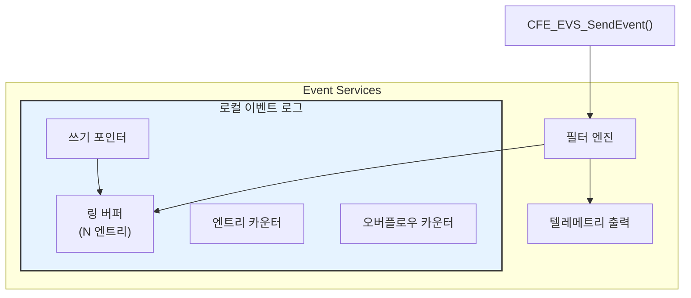
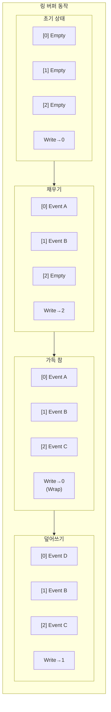
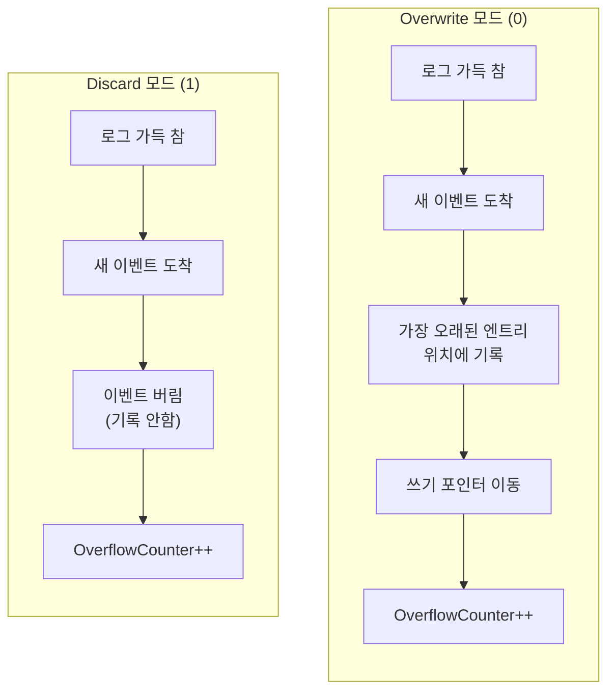
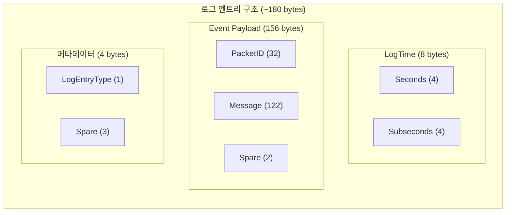
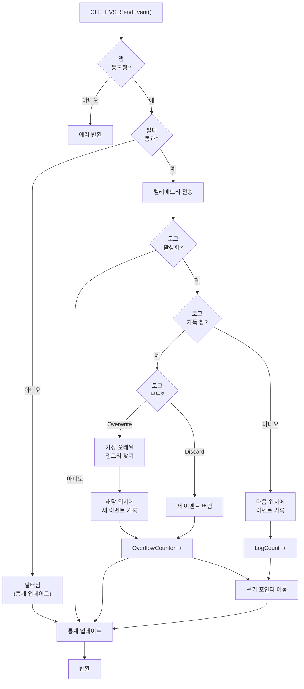
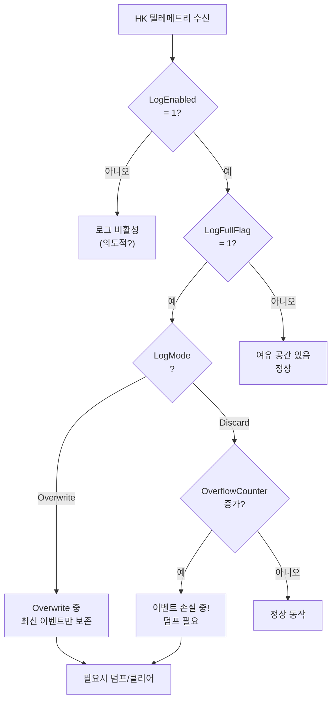
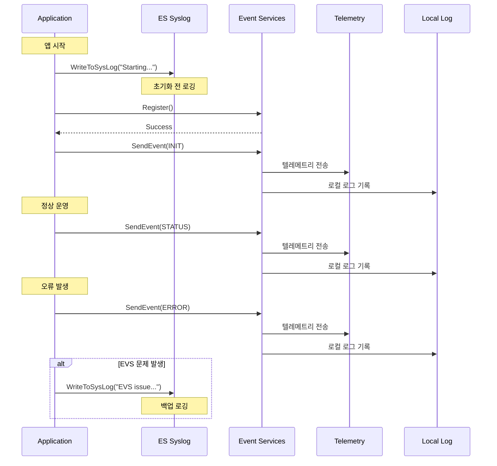

# Phase 2 EVS-06: 이벤트 로깅 시스템

## 서론

EVS는 이벤트를 텔레메트리로 전송하는 것 외에도 로컬 메모리에 이벤트를 저장하는 로컬 이벤트 로그 기능을 제공한다. 이 로그는 통신이 불가능한 상황에서 발생한 이벤트를 기록하거나, 비행 후 분석을 위한 이력을 보존하는 데 활용된다. 또한 ES Syslog와의 연동을 통해 더 광범위한 시스템 로깅도 가능하다.

로컬 이벤트 로그는 링 버퍼(Ring Buffer) 구조로 구현되어 있으며, 두 가지 모드(Overwrite/Discard)로 동작할 수 있다. 이 기능은 특히 발사 시퀀스나 통신 두절 기간 동안의 이벤트 기록에 중요하다.

본 문서에서는 EVS 로컬 이벤트 로그의 구조, 운영, 지상 명령을 통한 관리, 그리고 ES Syslog와의 관계를 상세히 살펴본다.

---

## 1. 로컬 이벤트 로그 개요

### 1.1 로컬 로그의 목적

로컬 이벤트 로그는 다음과 같은 중요한 목적으로 사용된다.

| 목적 | 설명 | 중요도 |
|:---|:---|:---:|
| **오프라인 기록** | 다운링크가 불가능할 때 이벤트를 보존 | 높음 |
| **비행 후 분석** | 미션 후 상세 분석을 위한 데이터 제공 | 높음 |
| **빠른 조회** | 최근 이벤트를 신속하게 확인 | 중간 |
| **디버깅 지원** | 개발/테스트 시 이벤트 추적 | 중간 |
| **이상 재구성** | 이상 상황 발생 전후 이벤트 시퀀스 재구성 | 높음 |

### 1.2 로그 아키텍처



### 1.3 링 버퍼 동작 원리

로컬 로그는 원형 버퍼(Circular Buffer) 구조로 구현된다.



---

## 2. 로그 구성 파라미터

### 2.1 플랫폼 구성

```c
/* platform_cfg.h - 이벤트 로그 구성 */

/**
 * @brief 로그 최대 항목 수
 *
 * 로컬 이벤트 로그에 저장할 수 있는 최대 이벤트 수.
 * 각 엔트리는 약 180 bytes를 사용하므로 메모리 고려 필요.
 *
 * 20 엔트리 = 약 3.6 KB
 * 100 엔트리 = 약 18 KB
 * 500 엔트리 = 약 90 KB
 */
#define CFE_PLATFORM_EVS_LOG_MAX  20

/**
 * @brief 기본 로그 모드
 *
 * 0 = Overwrite: 가득 차면 가장 오래된 항목 덮어쓰기
 * 1 = Discard: 가득 차면 새 항목 버림
 */
#define CFE_PLATFORM_EVS_DEFAULT_LOG_MODE  0
```

### 2.2 로그 크기 결정 가이드

```c
/*
 * 로그 크기 결정 시 고려사항:
 *
 * 1. 예상 이벤트 발생 빈도
 *    - 정상 운영: 분당 1-10개
 *    - 활발한 명령 처리: 분당 10-50개
 *    - 이상 상황: 초당 10-100개
 *
 * 2. 통신 두절 예상 시간
 *    - 예: 30분 두절, 분당 10개 = 300개 이벤트
 *    - 마진 50% = 450개 로그 필요
 *
 * 3. 메모리 제약
 *    - 엔트리당 약 180 bytes
 *    - 100 엔트리 = ~18 KB
 *    - RAM 여유 공간 고려
 *
 * 4. 분석 요구사항
 *    - 이상 직전 몇 분간 이벤트 필요?
 *    - 부팅 시퀀스 전체 기록 필요?
 *
 * 예시 계산:
 * - 요구: 이상 전 10분간 + 마진
 * - 빈도: 분당 20개
 * - 계산: 10 * 20 * 1.5 = 300개
 * → CFE_PLATFORM_EVS_LOG_MAX = 300
 */
```

### 2.3 로그 모드 상세

| 모드 | 값 | 동작 | 장점 | 단점 |
|:---|:---:|:---|:---|:---|
| **Overwrite** | 0 | 오래된 항목 덮어쓰기 | 항상 최신 이벤트 유지 | 초기 이벤트 손실 |
| **Discard** | 1 | 새 항목 버림 | 초기 이벤트 보존 | 최신 이벤트 손실 |



---

## 3. 로그 엔트리 구조

### 3.1 엔트리 데이터 구조

```c
/**
 * 이벤트 로그 엔트리 구조
 *
 * 각 로그 엔트리는 완전한 이벤트 정보를 포함한다.
 */
typedef struct
{
    CFE_TIME_SysTime_t LogTime;           /**< 로그 기록 시간 (8 bytes) */
    CFE_EVS_LongEventTlm_Payload_t Event; /**< 이벤트 내용 (156 bytes) */
    uint8 LogEntryType;                    /**< 엔트리 타입 (1 byte) */
    uint8 Spare[3];                        /**< 정렬용 (3 bytes) */
    
} CFE_EVS_LogEntry_t;

/* 엔트리 크기: 8 + 156 + 4 = 168 bytes (정렬 포함하면 약 180 bytes) */
```

### 3.2 메모리 레이아웃



### 3.3 LogEntryType 값

```c
/* 로그 엔트리 타입 */
#define CFE_EVS_LOG_ENTRY_UNUSED  0  /* 미사용 엔트리 */
#define CFE_EVS_LOG_ENTRY_USED    1  /* 사용된 엔트리 */
```

---

## 4. 로그 운영 흐름

### 4.1 이벤트 로깅 상세 흐름



### 4.2 EVS 내부 로깅 로직

```c
/**
 * EVS 내부 로그 기록 (개념적 구현)
 */
void EVS_WriteToLog(const CFE_EVS_LongEventTlm_Payload_t *EventPtr)
{
    uint32 WriteIndex;
    
    /* 로그 활성화 확인 */
    if (!EVS_GlobalData.LogEnabled)
    {
        return;
    }
    
    /* 로그 가득 참 확인 */
    if (EVS_GlobalData.LogCount >= CFE_PLATFORM_EVS_LOG_MAX)
    {
        /* 로그 모드에 따른 처리 */
        if (EVS_GlobalData.LogMode == CFE_EVS_LOG_OVERWRITE)
        {
            /* Overwrite: 가장 오래된 위치에 기록 */
            WriteIndex = EVS_GlobalData.LogWriteIndex;
            
            /* 쓰기 포인터 증가 (순환) */
            EVS_GlobalData.LogWriteIndex = 
                (EVS_GlobalData.LogWriteIndex + 1) % CFE_PLATFORM_EVS_LOG_MAX;
        }
        else /* CFE_EVS_LOG_DISCARD */
        {
            /* Discard: 기록하지 않음 */
            EVS_GlobalData.LogOverflowCounter++;
            return;
        }
        
        EVS_GlobalData.LogOverflowCounter++;
    }
    else
    {
        /* 로그에 여유 공간 있음 */
        WriteIndex = EVS_GlobalData.LogCount;
        EVS_GlobalData.LogCount++;
        EVS_GlobalData.LogWriteIndex = 
            (EVS_GlobalData.LogWriteIndex + 1) % CFE_PLATFORM_EVS_LOG_MAX;
    }
    
    /* 현재 시간 기록 */
    EVS_GlobalData.LogTable[WriteIndex].LogTime = CFE_TIME_GetTime();
    
    /* 이벤트 데이터 복사 */
    memcpy(&EVS_GlobalData.LogTable[WriteIndex].Event,
           EventPtr,
           sizeof(CFE_EVS_LongEventTlm_Payload_t));
    
    /* 엔트리 타입 설정 */
    EVS_GlobalData.LogTable[WriteIndex].LogEntryType = CFE_EVS_LOG_ENTRY_USED;
}
```

---

## 5. 지상 명령을 통한 로그 관리

### 5.1 로그 파일 쓰기 (WRITE_LOG_DATA_FILE_CC)

로컬 로그 내용을 파일 시스템에 덤프한다.

```c
/**
 * 로그 파일 쓰기 명령 페이로드
 */
typedef struct
{
    CFE_MSG_CommandHeader_t CommandHeader;
    char LogFilename[CFE_MISSION_MAX_PATH_LEN];  /**< 출력 파일 경로 */
} CFE_EVS_WriteLogDataFileCmd_t;

/*
 * 사용 예시:
 * - LogFilename = "/cf/evs_log.dat"
 * - LogFilename = "/ram/event_dump_001.bin"
 */
```

**파일 형식 상세:**

```c
/*
 * 로그 파일 구조:
 *
 * +----------------------------------+
 * | 파일 헤더 (CFE_FS_Header_t)       |
 * +----------------------------------+
 * | 로그 엔트리 0                     |
 * +----------------------------------+
 * | 로그 엔트리 1                     |
 * +----------------------------------+
 * | ...                              |
 * +----------------------------------+
 * | 로그 엔트리 N-1                   |
 * +----------------------------------+
 */

/* cFE 파일 헤더 */
typedef struct
{
    uint32 ContentType;      /* 파일 타입 식별자 */
    uint32 SubType;          /* 서브타입 */
    uint32 Length;           /* 헤더 길이 */
    uint32 SpacecraftID;     /* 우주선 ID */
    uint32 ProcessorID;      /* 프로세서 ID */
    uint32 ApplicationID;    /* 앱 ID */
    uint32 TimeSeconds;      /* 생성 시간 (초) */
    uint32 TimeSubSeconds;   /* 생성 시간 (서브초) */
    char   Description[32];  /* 설명 */
} CFE_FS_Header_t;
```

### 5.2 로그 클리어 (CLEAR_LOG_CC)

로그 내용을 모두 삭제한다.

```c
/**
 * 로그 클리어 명령
 */
typedef struct
{
    CFE_MSG_CommandHeader_t CommandHeader;
    /* 페이로드 없음 */
} CFE_EVS_ClearLogCmd_t;

/*
 * 동작:
 * 1. 모든 엔트리를 UNUSED로 표시
 * 2. LogCount = 0
 * 3. LogWriteIndex = 0
 * 4. LogOverflowCounter는 유지
 */
```

### 5.3 로그 모드 변경 (SET_LOG_MODE_CC)

로그 동작 모드를 변경한다.

```c
/**
 * 로그 모드 설정 명령
 */
typedef struct
{
    CFE_MSG_CommandHeader_t CommandHeader;
    uint8 LogMode;      /* 0=Overwrite, 1=Discard */
    uint8 Spare[3];     /* 정렬용 */
} CFE_EVS_SetLogModeCmd_t;

/*
 * 주의사항:
 * - 모드 변경은 즉시 적용됨
 * - 기존 로그 내용은 영향받지 않음
 * - 변경 후 새로 도착하는 이벤트부터 새 모드 적용
 */
```

### 5.4 출력 포트 제어

로그 출력을 포트 단위로 제어할 수 있다.

```c
/**
 * 출력 포트 활성화/비활성화
 */
typedef struct
{
    CFE_MSG_CommandHeader_t CommandHeader;
    uint8 BitMask;      /* 포트 비트 마스크 */
    uint8 Spare[3];
} CFE_EVS_BitMaskCmd_t;

/* 포트 비트 정의 */
#define CFE_EVS_PORT1_BIT  0x01  /* Port 1: 텔레메트리 */
#define CFE_EVS_PORT2_BIT  0x02  /* Port 2: 로컬 로그 */
#define CFE_EVS_PORT3_BIT  0x04  /* Port 3: 디버그 출력 */
#define CFE_EVS_PORT4_BIT  0x08  /* Port 4: 예약 */

/*
 * 명령 코드:
 * - CFE_EVS_ENABLE_PORTS_CC: 지정 포트 활성화
 * - CFE_EVS_DISABLE_PORTS_CC: 지정 포트 비활성화
 *
 * 예시: 로컬 로그만 비활성화
 * 명령: DISABLE_PORTS_CC, BitMask=0x02
 */
```

---

## 6. 로그 통계 모니터링

### 6.1 EVS HK 텔레메트리의 로그 필드

```c
/**
 * EVS HK 텔레메트리 중 로그 관련 필드
 */
typedef struct
{
    /* ... 다른 필드 ... */
    
    uint8  LogEnabled;           /**< 로그 포트 활성화 여부 */
    uint8  LogMode;              /**< 현재 로그 모드 (0/1) */
    uint16 LogEntriesUsed;       /**< 사용 중인 로그 항목 수 */
    uint16 LogOverflowCounter;   /**< 오버플로우 발생 횟수 */
    uint8  LogFullFlag;          /**< 로그 가득 참 플래그 */
    uint32 LogFileWriteCount;    /**< 로그 파일 쓰기 횟수 */
    
    /* ... */
    
} CFE_EVS_HkTlm_Payload_t;
```

### 6.2 통계 해석 가이드

| 필드 | 정상 범위 | 경고 상황 | 대응 |
|:---|:---|:---|:---|
| LogEntriesUsed | 0 ~ MAX | MAX 근접 | 덤프 또는 클리어 |
| LogOverflowCounter | 0 | 증가 | Discard 모드면 클리어 고려 |
| LogFullFlag | 0 | 1 | 덤프 후 클리어 |
| LogEnabled | 1 | 0 | 필요시 활성화 |

### 6.3 로그 상태 판단 흐름



---

## 7. ES Syslog와의 관계

### 7.1 두 로깅 시스템 비교

cFS에는 EVS 이벤트 로그 외에 ES Syslog도 있다. 두 시스템은 상호 보완적이다.

| 특성 | EVS Event Log | ES Syslog |
|:---|:---|:---|
| **용도** | 앱 이벤트 기록 | 시스템 레벨 로깅 |
| **형식** | 구조화된 패킷 | 자유 형식 문자열 |
| **필터링** | EVS 필터 적용됨 | 필터 없음 |
| **등록 요구** | CFE_EVS_Register 필요 | 항상 사용 가능 |
| **크기 제한** | 항목 수 제한 | 바이트 크기 제한 |
| **타임스탬프** | 구조화됨 | 없음 |
| **앱 정보** | 자동 포함 | 수동 포함 |

### 7.2 사용 시나리오 구분

```c
/*
 * ES Syslog 사용 시나리오:
 * 1. EVS 등록 전 (앱 초기화 초기)
 * 2. EVS 등록 실패 시
 * 3. 매우 저수준 시스템 문제
 * 4. cFE 서비스 자체의 문제
 */

/* 앱 초기화 시작 (EVS 등록 전) */
CFE_ES_WriteToSysLog("MY_APP: Starting initialization...\n");

/* EVS 등록 수행 */
Status = CFE_EVS_Register(NULL, 0, CFE_EVS_EventFilter_BINARY);

if (Status != CFE_SUCCESS)
{
    /* EVS 등록 실패 - Syslog 사용 */
    CFE_ES_WriteToSysLog("MY_APP: EVS Register failed, RC=0x%08X\n",
                         (unsigned int)Status);
    return Status;
}

/* 이후부터는 EVS 사용 */
CFE_EVS_SendEvent(MY_APP_INIT_EID,
                  CFE_EVS_EventType_INFORMATION,
                  "MY_APP: Initialization continuing...");
```

### 7.3 통합 로깅 전략



### 7.4 ES Syslog API

```c
/**
 * @brief 시스템 로그에 메시지 기록
 *
 * @param SpecStringPtr  printf 스타일 포맷 문자열
 * @param ...            가변 인자
 *
 * @return CFE_SUCCESS    성공
 * @return CFE_ES_ERR_SYS_LOG_FULL  로그 가득 참
 *
 * @note EVS 등록 없이도 사용 가능
 * @note 포맷팅 후 최대 128자
 */
CFE_Status_t CFE_ES_WriteToSysLog(const char *SpecStringPtr, ...);

/* 사용 예시 */
CFE_ES_WriteToSysLog("MY_APP: Critical error at %s:%d\n", __FILE__, __LINE__);
CFE_ES_WriteToSysLog("MY_APP: Value=0x%08X, State=%d\n", Value, State);
```

---

## 8. 로그 활용 운영 시나리오

### 8.1 발사 전 점검 절차

```
발사 전 이벤트 로그 점검 절차:

1. 로그 클리어
   명령: CFE_EVS_CLEAR_LOG_CC
   목적: 클린 상태에서 시작

2. 로그 모드 설정
   명령: CFE_EVS_SET_LOG_MODE_CC
   모드: OVERWRITE (0)
   목적: 최신 이벤트 유지

3. 시스템 테스트 수행
   - 전체 기능 점검
   - 시나리오 테스트

4. 로그 파일 덤프
   명령: CFE_EVS_WRITE_LOG_DATA_FILE_CC
   파일: /cf/prelaunch_evs.dat

5. 파일 다운로드 및 분석

6. 이상 없으면:
   - 로그 클리어
   - 발사 준비 완료

7. 이상 발견 시:
   - 문제 분석
   - 수정 후 재점검
```

### 8.2 이상 상황 분석 절차

```
이상 상황 발생 시 이벤트 분석 절차:

1. 즉시 로그 덤프
   명령: CFE_EVS_WRITE_LOG_DATA_FILE_CC
   파일: /cf/anomaly_001.dat
   목적: 현재 상태 보존

2. 텔레메트리 분석
   - HK 데이터 확인
   - 최근 이벤트 검토

3. 로그 파일 다운로드
   - 우선순위 높음
   - 다른 텔레메트리보다 먼저

4. 이벤트 시퀀스 재구성
   - 시간순 정렬
   - 관련 앱 필터링
   - 오류 이전 이벤트 확인

5. 근본 원인 분석
   - 첫 오류 이벤트 식별
   - 선행 조건 파악

6. 대응 조치 결정
   - 복구 가능 여부
   - 안전 모드 필요 여부
```

### 8.3 통신 두절 대비

```c
/*
 * 통신 두절 시나리오 대비:
 *
 * 1. 두절 전 설정:
 *    - 로그 모드: OVERWRITE (최신 보존)
 *    - 로그 크기: 두절 예상 시간 × 이벤트 빈도 × 1.5
 *
 * 2. 두절 중:
 *    - 이벤트 계속 기록됨
 *    - 텔레메트리 전송은 안됨
 *    - 로컬 로그에 보존
 *
 * 3. 통신 재개 후:
 *    - 즉시 로그 덤프
 *    - 파일 다운로드 우선
 *    - 두절 기간 이벤트 분석
 *
 * 또는 초기 이벤트 보존이 중요한 경우:
 *
 * 1. 두절 전 설정:
 *    - 로그 클리어
 *    - 로그 모드: DISCARD (초기 보존)
 *
 * 2. 통신 재개 후:
 *    - 초기 이벤트 확보됨
 *    - 로그 덤프 및 분석
 */
```

---

## 9. 디버그 출력 포트

### 9.1 개요

EVS는 텔레메트리와 로컬 로그 외에도 디버그 출력 포트를 지원한다. 이 포트는 개발/테스트 환경에서 이벤트를 콘솔에 직접 출력하는 데 사용된다.

```c
/* 디버그 출력 구현 (플랫폼별) */
void EVS_OutputDebugPort(const CFE_EVS_LongEventTlm_Payload_t *EventPtr)
{
    OS_printf("[EVS] %s %s (%u): %s\n",
              EventPtr->PacketID.AppName,
              GetEventTypeName(EventPtr->PacketID.EventType),
              EventPtr->PacketID.EventID,
              EventPtr->Message);
}

/* 출력 예시 */
/*
 * [EVS] MY_APP INFO (1): MY_APP Initialized. Version 1.2.3
 * [EVS] MY_APP ERROR (10): Invalid command code: CC=5
 * [EVS] SENSOR WARNING (30): Sensor reading out of range
 */
```

### 9.2 디버그 포트 제어

```c
/* 디버그 포트 활성화 */
/* 명령: CFE_EVS_ENABLE_PORTS_CC */
/* BitMask: 0x04 (Port 3) */

/* 디버그 포트 비활성화 */
/* 명령: CFE_EVS_DISABLE_PORTS_CC */
/* BitMask: 0x04 (Port 3) */

/*
 * 주의사항:
 * - 운영 중에는 일반적으로 비활성화
 * - OS_printf는 시스템 성능에 영향 줄 수 있음
 * - 디버깅 목적으로만 사용
 */
```

---

## 10. 로그 파일 분석

### 10.1 파일 파싱 방법

```python
#!/usr/bin/env python3
"""EVS 로그 파일 파싱 도구"""

import struct

def parse_evs_log_file(filepath):
    """EVS 로그 파일을 파싱하여 이벤트 목록 반환"""
    
    events = []
    
    with open(filepath, 'rb') as f:
        # cFE 파일 헤더 읽기 (64 bytes)
        header = f.read(64)
        
        content_type = struct.unpack('<I', header[0:4])[0]
        sub_type = struct.unpack('<I', header[4:8])[0]
        description = header[32:64].decode().rstrip('\x00')
        
        print(f"File: {filepath}")
        print(f"Type: {content_type}, SubType: {sub_type}")
        print(f"Description: {description}")
        print("-" * 60)
        
        # 로그 엔트리 읽기
        entry_num = 0
        while True:
            entry_data = f.read(180)  # 엔트리 크기
            if len(entry_data) < 180:
                break
            
            # LogTime (8 bytes)
            log_seconds = struct.unpack('<I', entry_data[0:4])[0]
            log_subsecs = struct.unpack('<I', entry_data[4:8])[0]
            
            # Event Payload
            app_name = entry_data[8:28].decode().rstrip('\x00')
            event_id = struct.unpack('<H', entry_data[28:30])[0]
            event_type = struct.unpack('<H', entry_data[30:32])[0]
            sc_id = struct.unpack('<I', entry_data[32:36])[0]
            cpu_id = struct.unpack('<I', entry_data[36:40])[0]
            message = entry_data[40:162].decode().rstrip('\x00')
            
            # LogEntryType
            entry_type = entry_data[164]
            
            if entry_type == 1:  # USED
                event = {
                    'num': entry_num,
                    'time': (log_seconds, log_subsecs),
                    'app': app_name,
                    'eid': event_id,
                    'type': ['DEBUG', 'INFO', 'ERROR', 'CRITICAL'][event_type],
                    'sc': sc_id,
                    'cpu': cpu_id,
                    'msg': message
                }
                events.append(event)
                
                print(f"[{entry_num:03d}] {event['time'][0]}.{event['time'][1]:05d} "
                      f"{event['app']:12s} {event['type']:8s} ({event['eid']:3d}) "
                      f"{event['msg']}")
            
            entry_num += 1
    
    return events

# 사용 예시
if __name__ == '__main__':
    events = parse_evs_log_file('/cf/evs_log.dat')
    print(f"\nTotal events: {len(events)}")
```

### 10.2 분석 자동화

```python
def analyze_events(events):
    """이벤트 분석 및 요약"""
    
    # 유형별 카운트
    type_counts = {}
    for e in events:
        type_counts[e['type']] = type_counts.get(e['type'], 0) + 1
    
    # 앱별 카운트
    app_counts = {}
    for e in events:
        app_counts[e['app']] = app_counts.get(e['app'], 0) + 1
    
    # 오류 이벤트 추출
    errors = [e for e in events if e['type'] in ['ERROR', 'CRITICAL']]
    
    print("\n=== 이벤트 분석 결과 ===\n")
    
    print("유형별 분포:")
    for t, c in sorted(type_counts.items()):
        print(f"  {t}: {c}")
    
    print("\n앱별 분포:")
    for a, c in sorted(app_counts.items(), key=lambda x: -x[1]):
        print(f"  {a}: {c}")
    
    if errors:
        print(f"\n오류 이벤트 ({len(errors)}개):")
        for e in errors:
            print(f"  [{e['app']}] {e['type']} ({e['eid']}): {e['msg']}")
    else:
        print("\n오류 이벤트 없음")
```

---

## 결론

EVS 로컬 이벤트 로그는 텔레메트리 전송과 독립적으로 이벤트를 보존하는 중요한 기능이다. 링 버퍼 구조와 Overwrite/Discard 모드를 통해 다양한 운영 요구사항을 충족한다. ES Syslog와 함께 사용하면 완전한 시스템 로깅 전략을 구현할 수 있다.

핵심 사항을 정리하면 다음과 같다:
- **링 버퍼 구조**: 고정 크기, 순환 기록
- **두 가지 모드**: Overwrite (최신 유지) vs Discard (초기 보존)
- **지상 명령**: 덤프, 클리어, 모드 변경
- **ES Syslog**: EVS 등록 전/장애 시 대안
- **활용**: 발사 전 점검, 이상 분석, 통신 두절 대비
- **분석 도구**: 파일 파싱 및 자동화 가능

다음 문서에서는 이벤트와 텔레메트리의 연동을 상세히 살펴볼 것이다.

---

## 참고 문헌

1. NASA, "cFE Application Developer's Guide"
2. NASA, "Event Services User's Guide"
3. NASA cFE GitHub, cfe/modules/evs/fsw/src/
4. NASA cFE GitHub, cfe/modules/es/ (Syslog 관련)
5. NASA, "cFS Logging Architecture"

---

[이전 문서: Phase 2 EVS-05: 이벤트 등록과 발송](./Phase2_EVS_05_이벤트_등록과_발송.md)

[다음 문서: Phase 2 EVS-07: 이벤트와 텔레메트리 연동](./Phase2_EVS_07_이벤트와_텔레메트리_연동.md)
