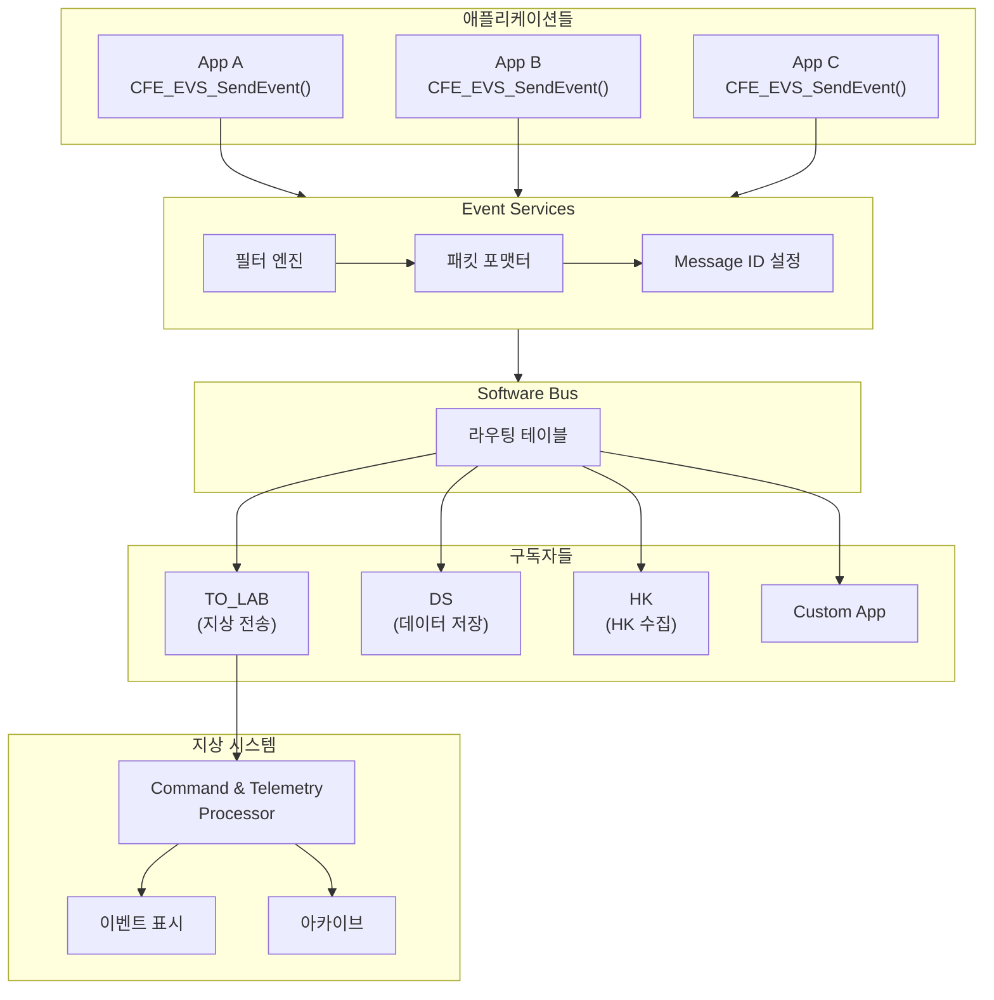
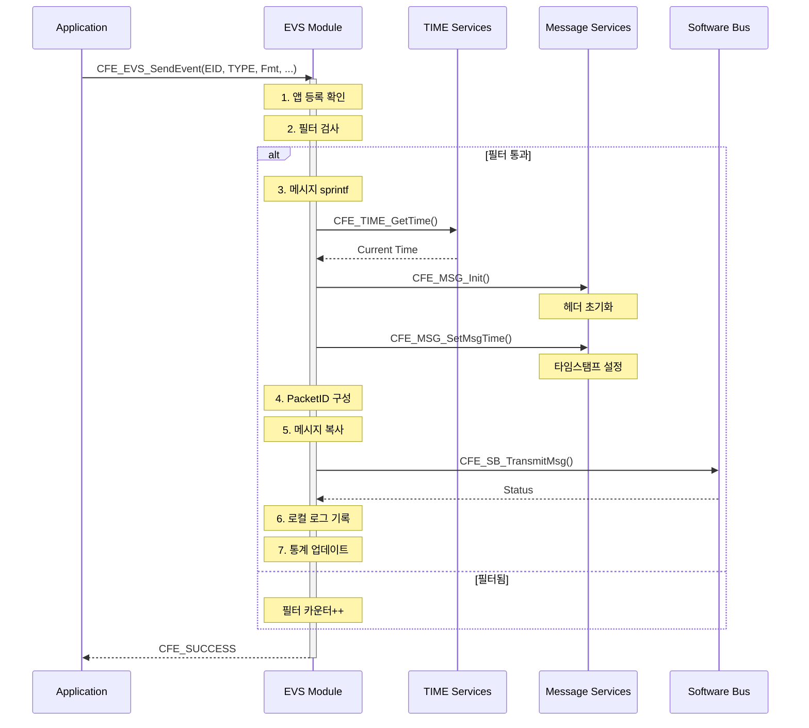
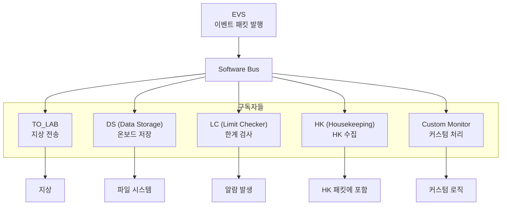
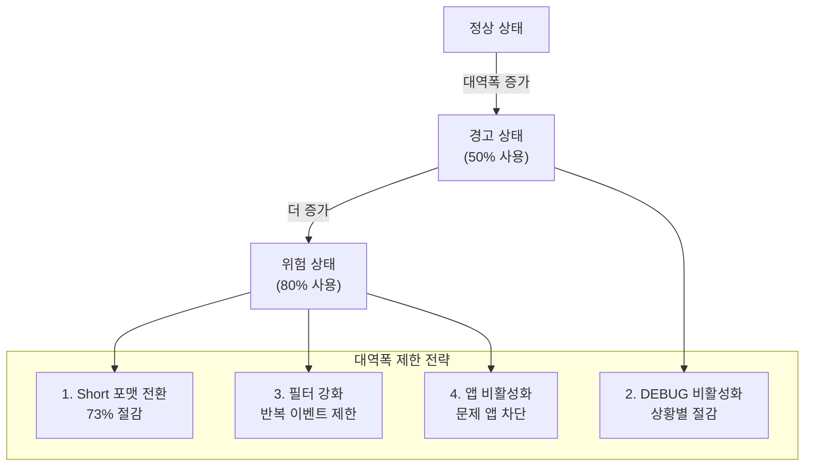
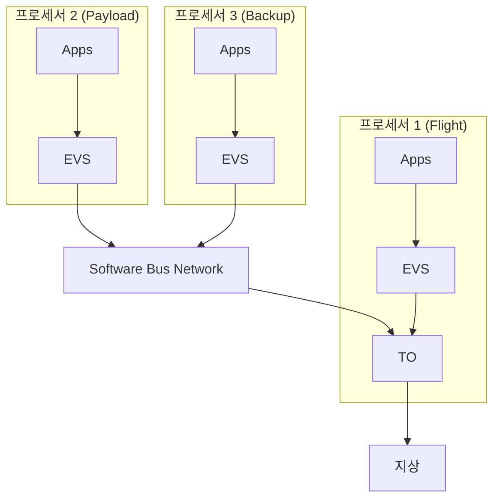

# Phase 2 EVS-07: 이벤트와 텔레메트리 연동

## 서론

Event Services의 주요 출력 경로는 텔레메트리(Telemetry) 전송이다. 이벤트 메시지는 EVS에 의해 CCSDS 텔레메트리 패킷으로 변환되어 Software Bus를 통해 전송된다. 이 패킷은 TO(Telemetry Output) 앱에 의해 지상 시스템으로 다운링크된다.

이벤트 텔레메트리는 실시간 시스템 모니터링의 핵심이다. 운영자는 텔레메트리를 통해 우주선에서 발생하는 이벤트를 실시간으로 확인하고, 필요한 조치를 취할 수 있다. 본 문서에서는 이벤트의 텔레메트리 변환 과정, 패킷 라우팅, 대역폭 관리, 그리고 지상 시스템에서의 처리를 상세히 살펴본다.

---

## 1. 이벤트 텔레메트리 아키텍처

### 1.1 전체 흐름



### 1.2 이벤트 Message ID

이벤트 텔레메트리는 전용 Message ID로 발행된다. 두 가지 Message ID가 사용된다.

```c
/* cfe_msgids.h - 이벤트 텔레메트리 Message ID */

/**
 * @brief Long Event Message ID
 *
 * 메시지 문자열을 포함하는 완전한 이벤트 패킷.
 */
#define CFE_EVS_LONG_EVENT_MSG_MID    0x0808

/**
 * @brief Short Event Message ID
 *
 * 메시지 없이 헤더 정보만 포함하는 압축 이벤트 패킷.
 */
#define CFE_EVS_SHORT_EVENT_MSG_MID   0x080A

/*
 * Message ID 구성 (CCSDS v1 기준):
 * 
 * Bits 15-11: 0 (Telemetry)
 * Bits 10-7:  App ID high bits
 * Bits 6-0:   App ID low bits
 *
 * 0x0808 = 0000 1000 0000 1000 (binary)
 *        = Type=TLM, AppID=0x008
 */
```

### 1.3 패킷 크기 비교

| 특성 | Long Event | Short Event | 차이 |
|:---|:---:|:---:|:---:|
| 전체 크기 | 168 bytes | 44 bytes | 124 bytes |
| 메시지 필드 | 122 bytes | 없음 | - |
| 대역폭 (100 evt/s) | 16.8 KB/s | 4.4 KB/s | 73% 절감 |
| 정보량 | 완전 | App/EID만 | - |
| 디버깅 용이성 | 높음 | 낮음 | - |

---

## 2. 이벤트 패킷 생성

### 2.1 EVS 내부 처리 과정



### 2.2 패킷 구성 상세

```c
/**
 * EVS 이벤트 패킷 생성 (개념적 구현)
 */
CFE_Status_t EVS_GenerateEventTelemetry(
    CFE_ES_AppId_t AppId,
    uint16 EventID,
    uint16 EventType,
    const char *Message)
{
    CFE_EVS_LongEventTlm_t  LongEventTlm;
    CFE_EVS_ShortEventTlm_t ShortEventTlm;
    CFE_TIME_SysTime_t      CurrentTime;
    CFE_MSG_Message_t       *MsgPtr;
    CFE_SB_MsgId_t          MsgId;
    size_t                  MsgSize;
    
    /* 현재 시간 획득 */
    CurrentTime = CFE_TIME_GetTime();
    
    /* 포맷 모드에 따라 패킷 선택 */
    if (EVS_GlobalData.MessageFormatMode == CFE_EVS_MsgFormat_LONG)
    {
        MsgPtr = &LongEventTlm.TelemetryHeader.Msg;
        MsgId = CFE_SB_ValueToMsgId(CFE_EVS_LONG_EVENT_MSG_MID);
        MsgSize = sizeof(CFE_EVS_LongEventTlm_t);
        
        /* Long: 메시지 포함 */
        strncpy(LongEventTlm.Payload.Message, Message,
                CFE_MISSION_EVS_MAX_MESSAGE_LENGTH - 1);
        LongEventTlm.Payload.Message[CFE_MISSION_EVS_MAX_MESSAGE_LENGTH - 1] = '\0';
        LongEventTlm.Payload.Spare1 = 0;
        LongEventTlm.Payload.Spare2 = 0;
        
        /* PacketID는 공통 함수로 설정 */
        EVS_SetPacketID(&LongEventTlm.Payload.PacketID, AppId, EventID, EventType);
    }
    else /* CFE_EVS_MsgFormat_SHORT */
    {
        MsgPtr = &ShortEventTlm.TelemetryHeader.Msg;
        MsgId = CFE_SB_ValueToMsgId(CFE_EVS_SHORT_EVENT_MSG_MID);
        MsgSize = sizeof(CFE_EVS_ShortEventTlm_t);
        
        /* Short: 메시지 없음 */
        EVS_SetPacketID(&ShortEventTlm.Payload.PacketID, AppId, EventID, EventType);
    }
    
    /* CCSDS 헤더 초기화 */
    CFE_MSG_Init(MsgPtr, MsgId, MsgSize);
    
    /* 타임스탬프 설정 */
    CFE_MSG_SetMsgTime(MsgPtr, CurrentTime);
    
    /* Software Bus로 전송 */
    CFE_SB_TransmitMsg(MsgPtr, true);
    
    /* 통계 업데이트 */
    EVS_GlobalData.MessageSendCounter++;
    
    return CFE_SUCCESS;
}

/**
 * PacketID 설정 헬퍼 함수
 */
void EVS_SetPacketID(
    CFE_EVS_PacketID_t *PacketIdPtr,
    CFE_ES_AppId_t AppId,
    uint16 EventID,
    uint16 EventType)
{
    /* 앱 이름 획득 */
    CFE_ES_GetAppName(PacketIdPtr->AppName, AppId,
                      sizeof(PacketIdPtr->AppName));
    
    /* 나머지 필드 설정 */
    PacketIdPtr->EventID = EventID;
    PacketIdPtr->EventType = EventType;
    PacketIdPtr->SpacecraftID = CFE_MISSION_SPACECRAFT_ID;
    PacketIdPtr->ProcessorID = CFE_PLATFORM_CPU_ID;
}
```

---

## 3. 텔레메트리 라우팅

### 3.1 이벤트 패킷 구독

이벤트 텔레메트리 패킷은 여러 앱이 구독할 수 있다. 각 구독자는 자신의 용도에 맞게 이벤트를 처리한다.

```c
/**
 * TO_LAB 앱의 이벤트 구독 예시
 */
CFE_Status_t TO_LAB_SubscribeEvents(void)
{
    CFE_Status_t Status;
    
    /* Long 이벤트 구독 */
    Status = CFE_SB_Subscribe(
        CFE_SB_ValueToMsgId(CFE_EVS_LONG_EVENT_MSG_MID),
        TO_LAB_Data.TlmPipeId);
    
    if (Status != CFE_SUCCESS)
    {
        CFE_EVS_SendEvent(TO_LAB_SUB_ERR_EID,
                          CFE_EVS_EventType_ERROR,
                          "Failed to subscribe LONG_EVENT_MSG_MID");
        return Status;
    }
    
    /* Short 이벤트도 구독 (포맷 변경 대비) */
    Status = CFE_SB_Subscribe(
        CFE_SB_ValueToMsgId(CFE_EVS_SHORT_EVENT_MSG_MID),
        TO_LAB_Data.TlmPipeId);
    
    if (Status != CFE_SUCCESS)
    {
        CFE_EVS_SendEvent(TO_LAB_SUB_ERR_EID,
                          CFE_EVS_EventType_ERROR,
                          "Failed to subscribe SHORT_EVENT_MSG_MID");
        return Status;
    }
    
    return CFE_SUCCESS;
}
```

### 3.2 다중 구독자 시나리오



### 3.3 구독자별 처리

| 구독자 | 역할 | 처리 방법 |
|:---|:---|:---|
| **TO** | 지상 전송 | RF 다운링크 프레임에 포함 |
| **DS** | 온보드 저장 | 파일 시스템에 이벤트 로그 저장 |
| **LC** | 한계 검사 | 특정 이벤트 발생 시 대응 수행 |
| **HK** | HK 수집 | 앱 HK에 이벤트 정보 요약 포함 |
| **Custom** | 커스텀 | 미션별 특수 처리 |

---

## 4. 대역폭 관리

### 4.1 이벤트 텔레메트리 대역폭 계산

```c
/*
 * 대역폭 계산 예시:
 *
 * 가정:
 * - 이벤트 발생률: 평균 10 evt/sec
 * - 피크: 100 evt/sec
 * - 포맷: Long (168 bytes/evt)
 *
 * 평상 시:
 * 10 evt/sec × 168 bytes = 1,680 bytes/sec = 1.64 KB/s
 *
 * 피크 시:
 * 100 evt/sec × 168 bytes = 16,800 bytes/sec = 16.4 KB/s
 *
 * Short 포맷 사용 시:
 * 100 evt/sec × 44 bytes = 4,400 bytes/sec = 4.3 KB/s
 * → 73% 대역폭 절감
 */
```

### 4.2 대역폭 제한 전략



### 4.3 포맷 모드 전환

```c
/**
 * 이벤트 포맷 모드 설정 명령
 */
typedef struct
{
    CFE_MSG_CommandHeader_t CommandHeader;
    uint8 MsgFormat;    /* 0=Long, 1=Short */
    uint8 Spare[3];
} CFE_EVS_SetEventFormatModeCmd_t;

/*
 * 전환 시나리오:
 *
 * 1. 정상 운영: Long 포맷
 *    - 완전한 메시지 정보
 *    - 즉시 해석 가능
 *
 * 2. 대역폭 부족: Short로 전환
 *    - 명령: SET_EVENT_FORMAT_MODE_CC
 *    - MsgFormat = 1
 *
 * 3. 문제 해결 후: Long으로 복원
 *    - 명령: SET_EVENT_FORMAT_MODE_CC
 *    - MsgFormat = 0
 */
```

### 4.4 유형별 비활성화

```c
/**
 * 대역폭 관리를 위한 이벤트 유형 제어
 */

/* 전역 DEBUG 비활성화 */
/* 모든 앱의 DEBUG 이벤트를 비활성화하여 대역폭 절약 */
for (each registered app)
{
    /* 명령: CFE_EVS_DISABLE_APP_EVENT_TYPE_CC */
    /* AppName: <app_name> */
    /* BitMask: 0x01 (DEBUG) */
}

/* 또는 특정 앱만 비활성화 */
/* 이벤트가 많이 발생하는 앱 식별 후 선택적 비활성화 */
```

---

## 5. 지상 시스템 처리

### 5.1 이벤트 패킷 수신 및 파싱

```python
#!/usr/bin/env python3
"""지상 시스템 이벤트 처리기"""

import struct
from datetime import datetime, timedelta

# 미션 Epoch (예시: J2000)
MISSION_EPOCH = datetime(2000, 1, 1, 12, 0, 0)

# 이벤트 유형 이름
EVENT_TYPE_NAMES = {
    0: 'DEBUG',
    1: 'INFO',
    2: 'ERROR',
    3: 'CRITICAL'
}

# 이벤트 유형 색상 (터미널)
EVENT_TYPE_COLORS = {
    0: '\033[90m',    # Gray
    1: '\033[32m',    # Green
    2: '\033[33m',    # Yellow
    3: '\033[91m',    # Red
}
RESET_COLOR = '\033[0m'

def parse_ccsds_time(seconds, subseconds):
    """CCSDS 타임스탬프를 UTC로 변환"""
    delta = timedelta(
        seconds=seconds,
        microseconds=(subseconds / 65536.0) * 1000000
    )
    return MISSION_EPOCH + delta

def parse_long_event(packet_bytes):
    """Long Event 패킷 파싱"""
    
    if len(packet_bytes) < 168:
        raise ValueError(f"Packet too short: {len(packet_bytes)} bytes")
    
    event = {}
    
    # CCSDS Primary Header (0-5)
    stream_id = struct.unpack('>H', packet_bytes[0:2])[0]
    sequence = struct.unpack('>H', packet_bytes[2:4])[0]
    length = struct.unpack('>H', packet_bytes[4:6])[0]
    
    event['stream_id'] = stream_id
    event['sequence'] = sequence & 0x3FFF
    event['packet_length'] = length + 7
    
    # CCSDS Secondary Header - Timestamp (6-11)
    time_sec = struct.unpack('>I', packet_bytes[6:10])[0]
    time_subsec = struct.unpack('>H', packet_bytes[10:12])[0]
    event['timestamp'] = parse_ccsds_time(time_sec, time_subsec)
    
    # EVS Packet ID (12-43)
    event['app_name'] = packet_bytes[12:32].decode('ascii').rstrip('\x00')
    event['event_id'] = struct.unpack('<H', packet_bytes[32:34])[0]
    event['event_type'] = struct.unpack('<H', packet_bytes[34:36])[0]
    event['spacecraft_id'] = struct.unpack('<I', packet_bytes[36:40])[0]
    event['processor_id'] = struct.unpack('<I', packet_bytes[40:44])[0]
    
    # Message (44-165)
    event['message'] = packet_bytes[44:166].decode('ascii').rstrip('\x00')
    
    return event

def parse_short_event(packet_bytes):
    """Short Event 패킷 파싱"""
    
    if len(packet_bytes) < 44:
        raise ValueError(f"Packet too short: {len(packet_bytes)} bytes")
    
    event = {}
    
    # CCSDS Headers (동일)
    stream_id = struct.unpack('>H', packet_bytes[0:2])[0]
    sequence = struct.unpack('>H', packet_bytes[2:4])[0]
    
    event['stream_id'] = stream_id
    event['sequence'] = sequence & 0x3FFF
    
    time_sec = struct.unpack('>I', packet_bytes[6:10])[0]
    time_subsec = struct.unpack('>H', packet_bytes[10:12])[0]
    event['timestamp'] = parse_ccsds_time(time_sec, time_subsec)
    
    # EVS Packet ID
    event['app_name'] = packet_bytes[12:32].decode('ascii').rstrip('\x00')
    event['event_id'] = struct.unpack('<H', packet_bytes[32:34])[0]
    event['event_type'] = struct.unpack('<H', packet_bytes[34:36])[0]
    event['spacecraft_id'] = struct.unpack('<I', packet_bytes[36:40])[0]
    event['processor_id'] = struct.unpack('<I', packet_bytes[40:44])[0]
    
    # Short 이벤트는 메시지 없음
    event['message'] = f"<EID {event['event_id']}>"
    
    return event

def display_event(event, use_color=True):
    """이벤트를 화면에 표시"""
    
    type_name = EVENT_TYPE_NAMES.get(event['event_type'], 'UNKNOWN')
    
    if use_color:
        color = EVENT_TYPE_COLORS.get(event['event_type'], '')
        line = (f"{color}[{event['timestamp']}] "
                f"[SC{event['spacecraft_id']:02X}.CPU{event['processor_id']}] "
                f"{event['app_name']:12s} {type_name:8s} "
                f"({event['event_id']:3d}) {event['message']}{RESET_COLOR}")
    else:
        line = (f"[{event['timestamp']}] "
                f"[SC{event['spacecraft_id']:02X}.CPU{event['processor_id']}] "
                f"{event['app_name']:12s} {type_name:8s} "
                f"({event['event_id']:3d}) {event['message']}")
    
    print(line)
    return line
```

### 5.2 이벤트 필터링 및 검색

```python
class EventDatabase:
    """이벤트 저장 및 검색 클래스"""
    
    def __init__(self):
        self.events = []
    
    def add_event(self, event):
        """이벤트 추가"""
        self.events.append(event)
    
    def filter_by_app(self, app_name):
        """앱 이름으로 필터"""
        return [e for e in self.events if e['app_name'] == app_name]
    
    def filter_by_type(self, event_type):
        """이벤트 유형으로 필터"""
        return [e for e in self.events if e['event_type'] == event_type]
    
    def filter_by_time_range(self, start_time, end_time):
        """시간 범위로 필터"""
        return [e for e in self.events 
                if start_time <= e['timestamp'] <= end_time]
    
    def get_errors_and_criticals(self):
        """ERROR와 CRITICAL 이벤트만"""
        return [e for e in self.events if e['event_type'] >= 2]
    
    def search_message(self, keyword):
        """메시지 내 키워드 검색"""
        return [e for e in self.events 
                if keyword.lower() in e['message'].lower()]
    
    def get_statistics(self):
        """이벤트 통계"""
        stats = {
            'total': len(self.events),
            'by_type': {},
            'by_app': {}
        }
        
        for e in self.events:
            # 유형별 통계
            type_name = EVENT_TYPE_NAMES.get(e['event_type'], 'UNKNOWN')
            stats['by_type'][type_name] = stats['by_type'].get(type_name, 0) + 1
            
            # 앱별 통계
            app = e['app_name']
            stats['by_app'][app] = stats['by_app'].get(app, 0) + 1
        
        return stats
```

### 5.3 이벤트 알림 시스템

```python
class EventAlertSystem:
    """이벤트 기반 알림 시스템"""
    
    def __init__(self):
        self.rules = []
        self.alert_callbacks = []
    
    def add_rule(self, rule_name, condition_func, priority='NORMAL'):
        """알림 규칙 추가"""
        self.rules.append({
            'name': rule_name,
            'condition': condition_func,
            'priority': priority
        })
    
    def add_callback(self, callback_func):
        """알림 콜백 추가"""
        self.alert_callbacks.append(callback_func)
    
    def check_event(self, event):
        """이벤트 검사 및 알림 발생"""
        for rule in self.rules:
            if rule['condition'](event):
                alert = {
                    'rule': rule['name'],
                    'priority': rule['priority'],
                    'event': event
                }
                for callback in self.alert_callbacks:
                    callback(alert)

# 사용 예시
alert_system = EventAlertSystem()

# 규칙 1: 모든 CRITICAL 이벤트
alert_system.add_rule(
    'Critical Event',
    lambda e: e['event_type'] == 3,
    priority='HIGH'
)

# 규칙 2: 특정 앱의 ERROR
alert_system.add_rule(
    'Thermal Error',
    lambda e: e['app_name'] == 'THERMAL' and e['event_type'] >= 2,
    priority='HIGH'
)

# 규칙 3: 메시지에 특정 키워드
alert_system.add_rule(
    'Memory Issue',
    lambda e: 'memory' in e['message'].lower() or 'alloc' in e['message'].lower(),
    priority='MEDIUM'
)

# 알림 콜백
def send_operator_alert(alert):
    print(f"*** ALERT [{alert['priority']}] {alert['rule']} ***")
    display_event(alert['event'])

alert_system.add_callback(send_operator_alert)
```

---

## 6. 다중 프로세서/우주선 환경

### 6.1 프로세서 간 이벤트 통합

다중 프로세서 cFS 시스템에서는 각 프로세서의 EVS가 독립적으로 동작한다. SBN(Software Bus Network)을 통해 이벤트가 중앙 프로세서로 전달되거나 각 프로세서에서 독립적으로 다운링크될 수 있다.



### 6.2 이벤트 출처 식별

```c
/*
 * 다중 프로세서 환경에서 이벤트 출처 식별:
 *
 * 방법 1: SpacecraftID + ProcessorID
 * - 패킷 내 필드로 식별
 * - SC_ID: 우주선 (다중 우주선 미션)
 * - CPU_ID: 프로세서
 *
 * 방법 2: Message ID 범위 분리
 * - 각 프로세서에 다른 MID 범위 할당
 * - Proc1: 0x0800-0x08FF
 * - Proc2: 0x0900-0x09FF
 *
 * 방법 3: 중앙 집중식
 * - 모든 이벤트를 한 프로세서로 전송
 * - 해당 프로세서에서 통합 처리
 */

/* 지상 시스템에서 출처 식별 */
void IdentifyEventSource(const Event *event)
{
    printf("Event from: SC=0x%02X, CPU=%d, App=%s\n",
           event->SpacecraftID,
           event->ProcessorID,
           event->AppName);
}
```

---

## 7. 이벤트 텔레메트리 모니터링

### 7.1 EVS HK에서 모니터링

```c
/**
 * EVS HK 텔레메트리 - 이벤트 전송 관련 필드
 */
typedef struct
{
    /* 메시지 전송 통계 */
    uint16 MessageSendCounter;     /**< 전송된 이벤트 총 수 */
    uint8  MessageFormatMode;      /**< 현재 포맷 모드 (0=Long, 1=Short) */
    uint8  MessageTruncCounter;    /**< 메시지 잘림 발생 횟수 */
    
    /* 출력 포트 상태 */
    uint8  OutputPort;             /**< 활성화된 출력 포트 비트맵 */
    
    /* 필터 통계 */
    uint8  UnregisteredAppCounter; /**< 미등록 앱 이벤트 시도 */
    
    /* ... */
    
} CFE_EVS_HkTlm_Payload_t;
```

### 7.2 모니터링 지표

| 지표 | 계산 | 정상 범위 | 경고 상황 |
|:---|:---|:---|:---|
| 이벤트 빈도 | ΔMessageSendCounter / Δt | < 10/sec | > 50/sec |
| 잘림 비율 | TruncCounter / SendCounter | 0% | > 1% |
| 미등록 시도 | UnregisteredAppCounter | 0 | 증가 |

### 7.3 이상 감지 로직

```python
class EventTelemetryMonitor:
    """이벤트 텔레메트리 모니터링"""
    
    def __init__(self):
        self.prev_send_count = 0
        self.prev_time = None
        self.alert_threshold_rate = 50  # events/sec
    
    def process_hk(self, hk_data, current_time):
        """HK 데이터 처리 및 이상 감지"""
        
        anomalies = []
        
        # 이벤트 빈도 계산
        if self.prev_time:
            delta_count = hk_data['MessageSendCounter'] - self.prev_send_count
            delta_time = (current_time - self.prev_time).total_seconds()
            
            if delta_time > 0:
                rate = delta_count / delta_time
                
                if rate > self.alert_threshold_rate:
                    anomalies.append(f"High event rate: {rate:.1f} evt/sec")
        
        # 미등록 앱 체크
        if hk_data['UnregisteredAppCounter'] > 0:
            anomalies.append("Unregistered app event attempts detected")
        
        # 메시지 잘림 체크
        if hk_data['MessageTruncCounter'] > 0:
            anomalies.append(f"Message truncation: {hk_data['MessageTruncCounter']} times")
        
        # 상태 저장
        self.prev_send_count = hk_data['MessageSendCounter']
        self.prev_time = current_time
        
        return anomalies
```

---

## 8. 이벤트 아카이빙

### 8.1 지상 아카이브 전략

```
이벤트 아카이빙 전략:

1. 실시간 저장
   - 수신 즉시 데이터베이스에 저장
   - 타임스탬프, 앱, EID, 유형, 메시지 모두 저장

2. 계층적 저장
   - 최근: 메모리/SSD (빠른 접근)
   - 중기: 일반 디스크 (일주일)
   - 장기: 아카이브 (미션 전체)

3. 인덱싱
   - 시간순 인덱스 (기본)
   - 앱별 인덱스
   - 유형별 인덱스
   - 키워드 전문 검색

4. 압축
   - 장기 저장 시 압축
   - 메시지 사전 압축 (반복되는 포맷)
```

### 8.2 데이터베이스 스키마

```sql
-- 이벤트 로그 테이블
CREATE TABLE event_log (
    id              SERIAL PRIMARY KEY,
    receive_time    TIMESTAMP NOT NULL,
    event_time      TIMESTAMP NOT NULL,
    spacecraft_id   INTEGER NOT NULL,
    processor_id    INTEGER NOT NULL,
    app_name        VARCHAR(20) NOT NULL,
    event_id        INTEGER NOT NULL,
    event_type      INTEGER NOT NULL,
    message         VARCHAR(122),
    raw_packet      BYTEA,
    
    -- 인덱스용
    CONSTRAINT event_time_idx USING btree (event_time),
    CONSTRAINT app_idx USING btree (app_name),
    CONSTRAINT type_idx USING btree (event_type)
);

-- 이벤트 정의 참조 테이블
CREATE TABLE event_definitions (
    id              SERIAL PRIMARY KEY,
    spacecraft_id   INTEGER NOT NULL,
    processor_id    INTEGER NOT NULL,
    app_name        VARCHAR(20) NOT NULL,
    event_id        INTEGER NOT NULL,
    event_name      VARCHAR(50),
    default_format  VARCHAR(200),
    description     TEXT,
    
    UNIQUE(spacecraft_id, processor_id, app_name, event_id)
);

-- 통계 집계 테이블 (시간별)
CREATE TABLE event_hourly_stats (
    hour            TIMESTAMP NOT NULL,
    app_name        VARCHAR(20) NOT NULL,
    event_type      INTEGER NOT NULL,
    count           INTEGER NOT NULL,
    
    PRIMARY KEY (hour, app_name, event_type)
);
```

---

## 결론

이벤트 텔레메트리는 지상 시스템과의 실시간 통신 핵심 채널이다. EVS는 이벤트를 CCSDS 형식의 텔레메트리 패킷으로 변환하여 Software Bus를 통해 전송하고, 다양한 구독자가 이를 활용한다. Long/Short 포맷 전환과 필터링을 통해 대역폭을 효과적으로 관리할 수 있다.

핵심 사항을 정리하면 다음과 같다:
- **Message ID**: LONG_EVENT_MSG_MID (0x0808), SHORT_EVENT_MSG_MID (0x080A)
- **패킷 크기**: Long (~168B), Short (~44B)
- **구독자**: TO, DS, HK, 커스텀 앱
- **대역폭 관리**: 포맷 전환, 유형 비활성화, 필터 강화
- **지상 처리**: 파싱, 표시, 필터링, 알림, 아카이빙
- **다중 프로세서**: SC_ID, CPU_ID로 출처 식별

다음 문서에서는 이벤트 스쿼시(폭주 방지) 기능을 살펴볼 것이다.

---

## 참고 문헌

1. NASA, "cFE Application Developer's Guide"
2. NASA, "Event Services User's Guide"
3. NASA, "cFS Telemetry Handbook"
4. NASA cFE GitHub, cfe/modules/evs/
5. CCSDS, "Space Packet Protocol" (CCSDS 133.0-B-1)

---

[이전 문서: Phase 2 EVS-06: 이벤트 로깅 시스템](./Phase2_EVS_06_이벤트_로깅_시스템.md)

[다음 문서: Phase 2 EVS-08: 이벤트 스쿼시 기능](./Phase2_EVS_08_이벤트_스쿼시_기능.md)
