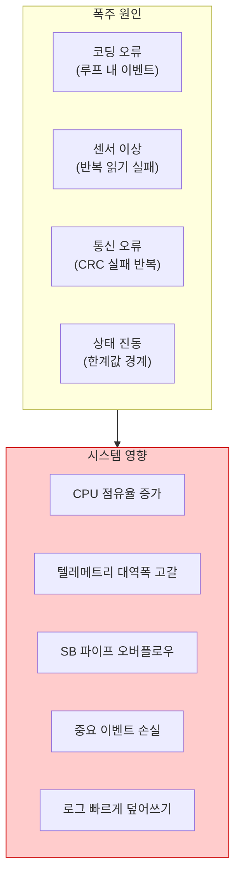
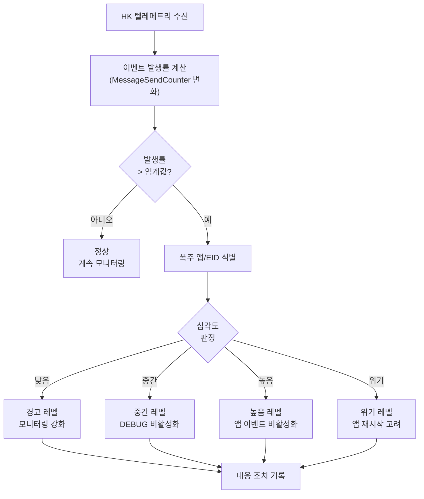

# Phase 2 EVS-08: 이벤트 스쿼시(Squelch) 기능

## 서론

이벤트 스쿼시(Squelch)는 이벤트 폭주(Event Storm)를 방지하기 위한 메커니즘이다. 소프트웨어 오류, 센서 이상, 또는 외부 자극으로 인해 동일한 이벤트가 매우 빠르게 반복 발생할 수 있다. 이러한 이벤트 폭주는 시스템 성능 저하, 텔레메트리 대역폭 고갈, 중요 이벤트 매몰 등 심각한 문제를 일으킨다.

cFE EVS는 Binary Filter 메커니즘과 앱/유형별 제어를 통해 이벤트 폭주를 방지한다. 또한 앱 개발자는 코딩 단계에서 폭주 방지 패턴을 적용해야 한다. 본 문서에서는 이벤트 폭주 시나리오, 방지 메커니즘, 코딩 패턴, 그리고 운영 대응 절차를 상세히 살펴본다.

---

## 1. 이벤트 폭주 문제

### 1.1 폭주의 정의와 영향

이벤트 폭주란 짧은 시간 동안 비정상적으로 많은 이벤트가 발생하는 현상이다.



### 1.2 폭주 심각도 레벨

| 레벨 | 이벤트 빈도 | CPU 영향 | 대역폭 영향 | 대응 긴급도 |
|:---|:---|:---|:---|:---|
| 정상 | < 10/sec | 무시 | 수용 | - |
| 경고 | 10-50/sec | 낮음 | 중간 | 모니터링 |
| 높음 | 50-200/sec | 중간 | 높음 | 필터 조정 |
| 위험 | 200-1000/sec | 높음 | 압도 | 즉시 차단 |
| 위기 | > 1000/sec | 심각 | 마비 | 긴급 대응 |

### 1.3 폭주 시나리오 분석

#### 시나리오 1: 루프 내 이벤트

```c
/* 문제 코드: 매 바이트마다 이벤트 발생 */
void ProcessData_Bad(uint8 *Data, size_t Size)
{
    for (size_t i = 0; i < Size; i++)
    {
        /* 잘못된 패턴: 루프 내에서 이벤트! */
        CFE_EVS_SendEvent(PROCESS_DBG_EID,
                          CFE_EVS_EventType_DEBUG,
                          "Processing byte %u: 0x%02X",
                          (unsigned int)i, Data[i]);
        
        ProcessByte(Data[i]);
    }
    
    /*
     * 영향 분석:
     * - Size = 1000 → 1000개 이벤트
     * - 10Hz 호출 → 초당 10,000개 이벤트!
     * - CPU: 이벤트 포맷팅/전송에 과부하
     * - 대역폭: 10,000 * 168 = 1.68 MB/sec
     */
}
```

#### 시나리오 2: 반복 오류

```c
/* 문제 코드: 지속적인 센서 실패 */
void ReadSensor_Bad(void)
{
    CFE_Status_t Status;
    
    while (1)  /* 메인 루프 */
    {
        Status = HwSensorRead(&SensorData);
        
        if (Status != CFE_SUCCESS)
        {
            /* 잘못된 패턴: 매번 오류 이벤트! */
            CFE_EVS_SendEvent(SENSOR_ERR_EID,
                              CFE_EVS_EventType_ERROR,
                              "Sensor read failed: RC=0x%08X",
                              (unsigned int)Status);
        }
        
        OS_TaskDelay(10);  /* 10ms 주기 */
    }
    
    /*
     * 센서 고장 시:
     * - 100Hz 오류 이벤트 발생
     * - 시간당 360,000개 이벤트
     * - 지상 시스템 이벤트 창 마비
     */
}
```

#### 시나리오 3: 상태 진동

```c
/* 문제 코드: 한계값 경계에서 진동 */
void CheckLimit_Bad(float Value)
{
    if (Value > LIMIT_HIGH)
    {
        /* 잘못된 패턴: 조건 충족마다 이벤트! */
        CFE_EVS_SendEvent(LIMIT_ERR_EID,
                          CFE_EVS_EventType_ERROR,
                          "Limit exceeded: value=%.2f, limit=%.2f",
                          Value, LIMIT_HIGH);
    }
    
    /*
     * Value가 한계값 주변에서 진동할 때:
     * - 예: 100.1, 99.9, 100.1, 99.9...
     * - 매 진동마다 이벤트 발생
     * - 1Hz 점검 시 초당 1개 (괜찮음)
     * - 100Hz 점검 시 초당 50개 (문제)
     */
}
```

---

## 2. Binary Filter 기반 폭주 방지

### 2.1 필터 마스크 동작 원리

Binary Filter는 이벤트 발생 횟수(Count)와 마스크(Mask)의 AND 연산을 사용하여 이벤트 전송 여부를 결정한다.

```c
/*
 * 필터 판정 로직:
 * 
 * if ((Count & Mask) == 0)
 *     이벤트 전송
 * else
 *     이벤트 필터 (카운터만 증가)
 */

/* 예시: Mask = 0xFFFF (FIRST_ONE_STOP) */
/*
 * Count 0: (0 & 0xFFFF) = 0 → 전송
 * Count 1: (1 & 0xFFFF) = 1 → 필터
 * Count 2: (2 & 0xFFFF) = 2 → 필터
 * ...
 * 이후 모든 이벤트 필터됨
 * → 첫 번째만 전송
 */

/* 예시: Mask = 0xFFF8 (FIRST_8_STOP) */
/*
 * Count 0-7: (0-7 & 0xFFF8) = 0 → 전송 (8회)
 * Count 8+:  (8+ & 0xFFF8) ≠ 0 → 필터
 * → 처음 8개만 전송
 */

/* 예시: Mask = 0x0001 (EVERY_OTHER_ONE) */
/*
 * Count 0: (0 & 1) = 0 → 전송
 * Count 1: (1 & 1) = 1 → 필터
 * Count 2: (2 & 1) = 0 → 전송
 * Count 3: (3 & 1) = 1 → 필터
 * → 50%만 전송
 */
```

### 2.2 폭주 방지를 위한 필터 전략

```c
/* 폭주 가능 이벤트에 대한 필터 설정 */
CFE_EVS_BinFilter_t MY_APP_EventFilters[] =
{
    /* 
     * 전략 1: 처음 N개만 전송
     * - 반복 가능한 오류에 적합
     * - 첫 발생만 확인하면 충분한 경우
     */
    {SENSOR_FAIL_EID,      CFE_EVS_FIRST_ONE_STOP},   /* 1개만 */
    {DATA_INVALID_EID,     CFE_EVS_FIRST_8_STOP},     /* 8개까지 */
    {COMM_ERROR_EID,       CFE_EVS_FIRST_16_STOP},    /* 16개까지 */
    
    /*
     * 전략 2: 샘플링
     * - 주기적으로 발생하는 이벤트에 적합
     * - 전체 추세 파악이 필요한 경우
     */
    {PERIODIC_STATUS_EID,  CFE_EVS_EVERY_OTHER_ONE},  /* 50% */
    {HIGH_FREQ_DBG_EID,    CFE_EVS_EVERY_FOURTH_ONE}, /* 25% */
    
    /*
     * 전략 3: 필터 없음
     * - 항상 전송해야 하는 중요 이벤트
     * - 자주 발생하지 않을 것으로 예상
     */
    {CRITICAL_ERR_EID,     CFE_EVS_NO_FILTER},        /* 100% */
    {MODE_CHANGE_EID,      CFE_EVS_NO_FILTER},        /* 100% */
};
```

### 2.3 필터 리셋을 통한 재활성화

```c
/*
 * 필터 리셋 시나리오:
 *
 * 1. 새 동작 시작 시
 *    - 새 데이터 처리 시작
 *    - 새 모드 진입
 *
 * 2. 오류 복구 후
 *    - 센서 재초기화 후
 *    - 통신 재연결 후
 *
 * 3. 주기적 리셋
 *    - 시간 기반 리셋
 *    - 카운터 기반 리셋
 */

/* 새 동작 시작 시 필터 리셋 */
void MY_APP_StartNewOperation(void)
{
    /* 관련 필터들 리셋 */
    CFE_EVS_ResetFilter(DATA_INVALID_EID);
    CFE_EVS_ResetFilter(PROCESS_DBG_EID);
    
    CFE_EVS_SendEvent(NEW_OP_EID,
                      CFE_EVS_EventType_INFORMATION,
                      "New operation started, filters reset");
}

/* 오류 복구 후 필터 리셋 */
void MY_APP_HandleSensorRecovery(void)
{
    /* 센서 재초기화 성공 */
    CFE_EVS_ResetFilter(SENSOR_FAIL_EID);
    
    CFE_EVS_SendEvent(SENSOR_RECOVER_EID,
                      CFE_EVS_EventType_INFORMATION,
                      "Sensor recovered, filter reset");
}
```

---

## 3. 앱 레벨 폭주 방지 패턴

### 3.1 패턴 1: 루프 외부 요약 이벤트

```c
/* 좋은 예: 루프 후 한 번만 이벤트 */
void ProcessData_Good(uint8 *Data, size_t Size)
{
    uint32 SuccessCount = 0;
    uint32 ErrorCount = 0;
    uint32 BytesProcessed = 0;
    
    for (size_t i = 0; i < Size; i++)
    {
        CFE_Status_t Status = ProcessByte(Data[i]);
        
        if (Status == CFE_SUCCESS)
        {
            SuccessCount++;
        }
        else
        {
            ErrorCount++;
        }
        
        BytesProcessed++;
    }
    
    /* 루프 완료 후 한 번만 이벤트 */
    if (ErrorCount > 0)
    {
        CFE_EVS_SendEvent(PROCESS_ERR_EID,
                          CFE_EVS_EventType_ERROR,
                          "Processing complete: %u bytes, %u errors",
                          (unsigned int)BytesProcessed,
                          (unsigned int)ErrorCount);
    }
    else
    {
        CFE_EVS_SendEvent(PROCESS_DBG_EID,
                          CFE_EVS_EventType_DEBUG,
                          "Processing complete: %u bytes OK",
                          (unsigned int)BytesProcessed);
    }
}
```

### 3.2 패턴 2: 상태 변화 기반 이벤트

```c
/* 좋은 예: 상태가 변할 때만 이벤트 */
typedef struct
{
    bool SensorHealthy;
    bool LimitExceeded;
    bool CommunicationOK;
    
} MY_APP_StateFlags_t;

static MY_APP_StateFlags_t PreviousState = {true, false, true};
static MY_APP_StateFlags_t CurrentState = {true, false, true};

void MY_APP_CheckAndReportStateChanges(void)
{
    /* 센서 상태 변화 */
    if (CurrentState.SensorHealthy != PreviousState.SensorHealthy)
    {
        if (CurrentState.SensorHealthy)
        {
            CFE_EVS_SendEvent(SENSOR_HEALTHY_EID,
                              CFE_EVS_EventType_INFORMATION,
                              "Sensor health restored");
        }
        else
        {
            CFE_EVS_SendEvent(SENSOR_UNHEALTHY_EID,
                              CFE_EVS_EventType_ERROR,
                              "Sensor health degraded");
        }
    }
    
    /* 한계 초과 변화 */
    if (CurrentState.LimitExceeded != PreviousState.LimitExceeded)
    {
        if (CurrentState.LimitExceeded)
        {
            CFE_EVS_SendEvent(LIMIT_EXCEED_EID,
                              CFE_EVS_EventType_ERROR,
                              "Limit exceeded condition entered");
        }
        else
        {
            CFE_EVS_SendEvent(LIMIT_NORMAL_EID,
                              CFE_EVS_EventType_INFORMATION,
                              "Limit returned to normal");
        }
    }
    
    /* 상태 저장 */
    PreviousState = CurrentState;
}
```

### 3.3 패턴 3: 시간 기반 이벤트 제한

```c
/* 좋은 예: 최소 간격 강제 */
typedef struct
{
    CFE_TIME_SysTime_t LastEventTime;
    uint32 MinIntervalMs;
    uint32 SuppressedCount;
    
} MY_APP_RateLimiter_t;

static MY_APP_RateLimiter_t SensorErrorLimiter = {
    .LastEventTime = {0, 0},
    .MinIntervalMs = 5000,  /* 최소 5초 간격 */
    .SuppressedCount = 0
};

bool MY_APP_IsEventAllowed(MY_APP_RateLimiter_t *Limiter)
{
    CFE_TIME_SysTime_t CurrentTime = CFE_TIME_GetTime();
    CFE_TIME_SysTime_t Diff = CFE_TIME_Subtract(CurrentTime, Limiter->LastEventTime);
    
    /* 밀리초로 변환 */
    uint32 ElapsedMs = (Diff.Seconds * 1000) + (Diff.Subseconds / 65536);
    
    if (ElapsedMs >= Limiter->MinIntervalMs)
    {
        /* 간격 충족: 이벤트 허용 */
        if (Limiter->SuppressedCount > 0)
        {
            /* 억제된 이벤트 수 보고 */
            CFE_EVS_SendEvent(RATE_LIMIT_INFO_EID,
                              CFE_EVS_EventType_DEBUG,
                              "Rate limiter: %u events were suppressed",
                              (unsigned int)Limiter->SuppressedCount);
        }
        
        Limiter->LastEventTime = CurrentTime;
        Limiter->SuppressedCount = 0;
        return true;
    }
    else
    {
        /* 간격 미충족: 이벤트 억제 */
        Limiter->SuppressedCount++;
        return false;
    }
}

void MY_APP_HandleSensorError(CFE_Status_t ErrorCode)
{
    if (MY_APP_IsEventAllowed(&SensorErrorLimiter))
    {
        CFE_EVS_SendEvent(SENSOR_ERR_EID,
                          CFE_EVS_EventType_ERROR,
                          "Sensor error: RC=0x%08X",
                          (unsigned int)ErrorCode);
    }
    /* 억제된 경우 카운터만 증가 */
}
```

### 3.4 패턴 4: 버킷 카운터

```c
/* 좋은 예: 주기적 집계 보고 */
typedef struct
{
    uint32 EventCount;
    uint32 LastReportCount;
    uint32 ReportThreshold;
    
} MY_APP_EventBucket_t;

static MY_APP_EventBucket_t ErrorBucket = {
    .EventCount = 0,
    .LastReportCount = 0,
    .ReportThreshold = 100  /* 100개마다 보고 */
};

void MY_APP_IncrementErrorBucket(void)
{
    ErrorBucket.EventCount++;
}

void MY_APP_ReportErrorBucket(void)
{
    /* 주기적 호출 (예: 1Hz) */
    uint32 NewErrors = ErrorBucket.EventCount - ErrorBucket.LastReportCount;
    
    if (NewErrors > 0)
    {
        if (NewErrors >= ErrorBucket.ReportThreshold)
        {
            CFE_EVS_SendEvent(ERROR_BUCKET_WARN_EID,
                              CFE_EVS_EventType_ERROR,
                              "High error rate: %u errors in last period, total=%u",
                              (unsigned int)NewErrors,
                              (unsigned int)ErrorBucket.EventCount);
        }
        else
        {
            CFE_EVS_SendEvent(ERROR_BUCKET_INFO_EID,
                              CFE_EVS_EventType_DEBUG,
                              "Error count: %u new, %u total",
                              (unsigned int)NewErrors,
                              (unsigned int)ErrorBucket.EventCount);
        }
        
        ErrorBucket.LastReportCount = ErrorBucket.EventCount;
    }
}
```

---

## 4. 앱 비활성화를 통한 긴급 차단

### 4.1 앱 전체 이벤트 비활성화

심각한 폭주 상황에서는 해당 앱의 모든 이벤트를 즉시 비활성화할 수 있다.

```c
/**
 * 앱 이벤트 비활성화 명령
 * 
 * 명령 코드: CFE_EVS_DISABLE_APP_EVENTS_CC
 */
typedef struct
{
    CFE_MSG_CommandHeader_t CommandHeader;
    char AppName[CFE_MISSION_MAX_API_LEN];  /* 대상 앱 이름 */
} CFE_EVS_AppNameCmd_t;

/*
 * 사용 시나리오:
 *
 * 1. 폭주 감지
 *    - HK에서 MessageSendCounter 급증 확인
 *    - 특정 앱에서 이벤트 집중 발생
 *
 * 2. 긴급 차단
 *    명령: DISABLE_APP_EVENTS_CC
 *    AppName: "PROBLEM_APP"
 *
 * 3. 결과
 *    - PROBLEM_APP의 모든 이벤트 차단
 *    - 시스템 정상화
 *
 * 4. 분석 후 복구
 *    명령: ENABLE_APP_EVENTS_CC
 *    AppName: "PROBLEM_APP"
 */
```

### 4.2 유형별 선택적 비활성화

```c
/**
 * 앱 이벤트 유형 비활성화 명령
 *
 * 명령 코드: CFE_EVS_DISABLE_APP_EVENT_TYPE_CC
 */
typedef struct
{
    CFE_MSG_CommandHeader_t CommandHeader;
    char AppName[CFE_MISSION_MAX_API_LEN];
    uint8 BitMask;      /* 비활성화할 유형 비트마스크 */
    uint8 Spare;
} CFE_EVS_AppNameBitMaskCmd_t;

/* 비트마스크 값 */
#define CFE_EVS_DEBUG_BIT       0x01
#define CFE_EVS_INFORMATION_BIT 0x02
#define CFE_EVS_ERROR_BIT       0x04
#define CFE_EVS_CRITICAL_BIT    0x08

/*
 * 선택적 비활성화 예시:
 *
 * DEBUG만 비활성화:
 *   BitMask = 0x01
 *   결과: DEBUG 차단, INFO/ERROR/CRITICAL 전송
 *
 * DEBUG와 INFO 비활성화:
 *   BitMask = 0x03
 *   결과: DEBUG/INFO 차단, ERROR/CRITICAL만 전송
 *
 * ERROR/CRITICAL 제외 비활성화:
 *   BitMask = 0x03
 *   결과: 오류 관련만 전송
 */
```

---

## 5. 폭주 감지 및 대응 절차

### 5.1 폭주 감지 흐름



### 5.2 대응 명령 시퀀스

```
폭주 대응 절차:

=== 1단계: 감지 ===
- HK 모니터링
- MessageSendCounter 급증 확인
- 이벤트 스트림에서 반복 패턴 확인

=== 2단계: 식별 ===
- 폭주 발생 앱 이름 확인
- 반복되는 EventID 확인
- 이벤트 유형 확인

=== 3단계: 즉시 대응 ===

Level 1 (DEBUG): 
  명령: DISABLE_APP_EVENT_TYPE_CC
  AppName: <폭주앱>
  BitMask: 0x01 (DEBUG)

Level 2 (DEBUG+INFO):
  명령: DISABLE_APP_EVENT_TYPE_CC
  AppName: <폭주앱>
  BitMask: 0x03 (DEBUG+INFO)

Level 3 (전체 차단):
  명령: DISABLE_APP_EVENTS_CC
  AppName: <폭주앱>

=== 4단계: 분석 ===
- 폭주 원인 분석
- 로그 파일 검토
- 앱 상태 확인

=== 5단계: 복구 ===
- 원인 해결 후 이벤트 재활성화
- 필터 추가 고려
- 앱 패치 고려
```

---

## 6. 폭주 방지 모범 사례

### 6.1 개발 단계 체크리스트

| 단계 | 체크 항목 | 중요도 |
|:---|:---|:---:|
| **설계** | 예상 이벤트 빈도 문서화 | 높음 |
| **설계** | 높은 빈도 이벤트에 필터 계획 | 높음 |
| **코딩** | 루프 내 이벤트 금지 | 높음 |
| **코딩** | 상태 변화 기반 이벤트 | 중간 |
| **코딩** | 시간 기반 제한 적용 | 중간 |
| **리뷰** | 이벤트 발생 패턴 검토 | 높음 |
| **테스트** | 폭주 시나리오 테스트 | 높음 |
| **테스트** | 필터 동작 검증 | 중간 |

### 6.2 필터 설계 가이드라인

```c
/*
 * 이벤트 유형별 권장 필터:
 */

/* DEBUG 이벤트: 강한 필터 적용 */
/* 개발/테스트용이므로 운영 시 많이 억제 */
{MY_APP_DBG_EID, CFE_EVS_FIRST_16_STOP}
{MY_APP_LOOP_DBG_EID, CFE_EVS_FIRST_8_STOP}
{MY_APP_TRACE_DBG_EID, CFE_EVS_FIRST_4_STOP}

/* 반복 가능 ERROR: 중간 필터 */
/* 처음 몇 번만 보고, 상세는 HK/다른 TLM으로 */
{MY_APP_SENSOR_ERR_EID, CFE_EVS_FIRST_8_STOP}
{MY_APP_DATA_ERR_EID, CFE_EVS_FIRST_4_STOP}

/* 주기적 INFO: 샘플링 */
/* 트렌드만 파악 가능하면 충분 */
{MY_APP_STATUS_INFO_EID, CFE_EVS_EVERY_OTHER_TWO}  /* 25% */

/* 중요 이벤트: 필터 없음 */
/* 모든 발생이 중요하고, 자주 발생 안함 */
{MY_APP_MODE_CHANGE_EID, CFE_EVS_NO_FILTER}
{MY_APP_CRITICAL_EID, CFE_EVS_NO_FILTER}
{MY_APP_INIT_EID, CFE_EVS_NO_FILTER}
```

### 6.3 안티패턴 목록

```c
/*
 * 피해야 할 패턴들:
 */

/* X 패턴 1: 루프 내 이벤트 */
for (i = 0; i < N; i++) {
    CFE_EVS_SendEvent(EID, TYPE, "...");  /* 금지! */
}

/* X 패턴 2: 무조건 오류 이벤트 */
while (1) {
    if (error) {
        CFE_EVS_SendEvent(ERR_EID, ...);  /* 조건 유지 시 폭주 */
    }
}

/* X 패턴 3: 고빈도 상태 보고 */
/* 10Hz 이상 호출되는 함수에서 */
void HighFreqFunc(void) {
    CFE_EVS_SendEvent(STATUS_EID, ...);  /* 금지! */
}

/* X 패턴 4: 필터 없는 DEBUG */
CFE_EVS_Register(NULL, 0, CFE_EVS_EventFilter_BINARY);
/* 모든 DEBUG에 필터 없음 → 위험 */
```

---

## 7. 폭주 통계 모니터링

### 7.1 EVS HK 관련 필드

```c
/**
 * EVS HK 텔레메트리 - 폭주 모니터링 필드
 */
typedef struct
{
    uint16 MessageSendCounter;     /**< 총 전송 이벤트 */
    uint16 MessageFilteredCount;   /**< 필터된 이벤트 */
    uint16 MessageTruncCounter;    /**< 잘린 메시지 수 */
    uint8  UnregisteredAppCounter; /**< 미등록 앱 시도 */
    
    /* 앱별 상세는 앱 데이터 파일로 */
    
} CFE_EVS_HkTlm_Relevant_t;
```

### 7.2 모니터링 스크립트 예시

```python
class EventFloodMonitor:
    """이벤트 폭주 모니터 클래스"""
    
    def __init__(self):
        self.prev_count = 0
        self.prev_time = None
        
        # 임계값 설정
        self.warning_rate = 20     # events/sec
        self.high_rate = 50        # events/sec
        self.critical_rate = 100   # events/sec
    
    def check_rate(self, hk_data, current_time):
        """이벤트 발생률 체크 및 경고"""
        
        current_count = hk_data['MessageSendCounter']
        
        if self.prev_time is None:
            self.prev_count = current_count
            self.prev_time = current_time
            return 'NORMAL', 0
        
        delta_count = current_count - self.prev_count
        delta_time = (current_time - self.prev_time).total_seconds()
        
        if delta_time > 0:
            rate = delta_count / delta_time
        else:
            rate = 0
        
        self.prev_count = current_count
        self.prev_time = current_time
        
        # 심각도 판정
        if rate >= self.critical_rate:
            return 'CRITICAL', rate
        elif rate >= self.high_rate:
            return 'HIGH', rate
        elif rate >= self.warning_rate:
            return 'WARNING', rate
        else:
            return 'NORMAL', rate
    
    def generate_report(self, severity, rate):
        """경고 보고서 생성"""
        
        if severity == 'NORMAL':
            return None
        
        report = {
            'severity': severity,
            'rate': rate,
            'message': f"Event flood detected: {rate:.1f} evt/sec ({severity})",
            'recommended_action': self.get_recommended_action(severity)
        }
        
        return report
    
    def get_recommended_action(self, severity):
        """권장 조치 반환"""
        
        actions = {
            'WARNING': "Monitor closely, consider DEBUG disable",
            'HIGH': "Disable DEBUG events for high-rate apps",
            'CRITICAL': "Disable all events for problem app immediately"
        }
        
        return actions.get(severity, "Unknown severity")
```

---

## 결론

이벤트 폭주는 시스템 안정성과 텔레메트리 가용성에 심각한 위협이 된다. Binary Filter, 앱/유형별 제어, 그리고 적절한 코딩 패턴을 통해 폭주를 예방하고 관리할 수 있다.

핵심 사항을 정리하면 다음과 같다:
- **폭주 원인**: 루프 내 이벤트, 반복 오류, 상태 진동
- **예방 메커니즘**: Binary Filter (FIRST_N_STOP, EVERY_OTHER)
- **코딩 패턴**: 요약 이벤트, 상태 변화 기반, 시간 제한
- **긴급 대응**: 앱/유형별 비활성화
- **모니터링**: HK 기반 발생률 추적
- **모범 사례**: 설계 시 고려, 코드 리뷰, 테스트

다음 문서에서는 EVS 명령 및 텔레메트리 인터페이스를 상세히 살펴볼 것이다.

---

## 참고 문헌

1. NASA, "cFE Application Developer's Guide"
2. NASA, "Event Services User's Guide"
3. NASA, "cFS Anti-Pattern Guide"
4. NASA cFE GitHub, cfe/modules/evs/
5. NASA, "Flight Software Coding Standards"

---

[이전 문서: Phase 2 EVS-07: 이벤트와 텔레메트리 연동](./Phase2_EVS_07_이벤트와_텔레메트리_연동.md)

[다음 문서: Phase 2 EVS-09: EVS 명령 및 텔레메트리](./Phase2_EVS_09_EVS_명령_및_텔레메트리.md)
