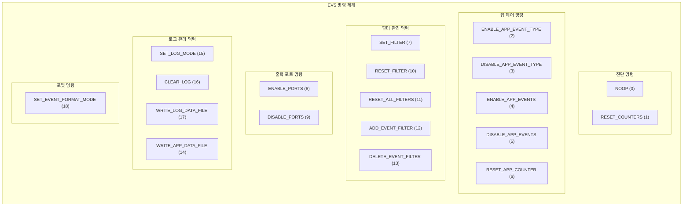
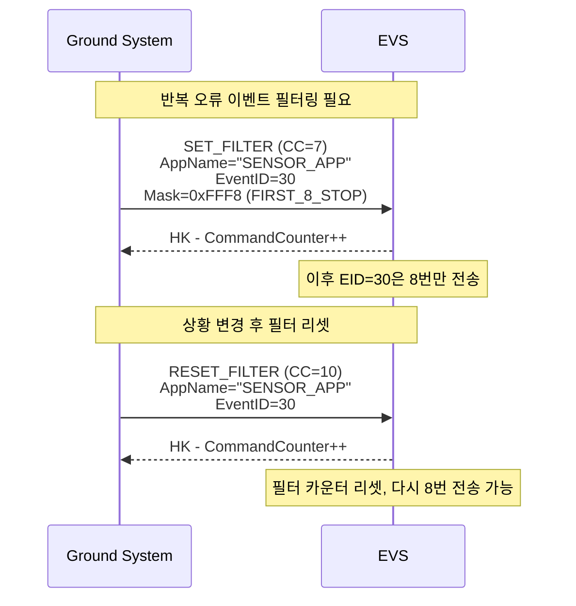
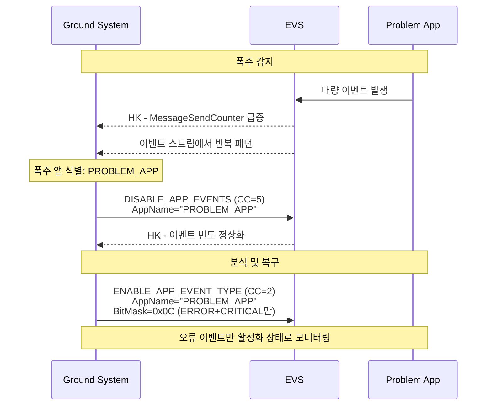
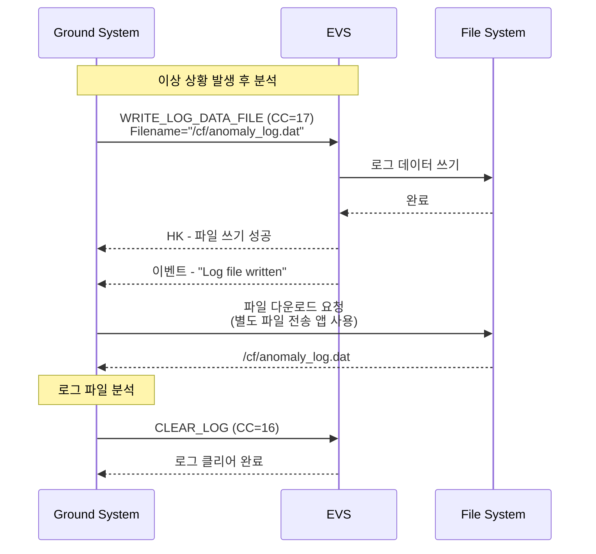

# Phase 2 EVS-09: EVS 명령 및 텔레메트리

## 서론

Event Services는 다른 cFE 서비스들과 마찬가지로 지상 시스템과의 인터페이스를 위한 명령(Command)과 텔레메트리(Telemetry)를 제공한다. 이를 통해 운영자는 이벤트 필터를 조정하고, 앱별 이벤트를 제어하며, 이벤트 로그를 관리할 수 있다. EVS의 명령과 텔레메트리 인터페이스는 효과적인 이벤트 관리의 핵심이다.

본 문서에서는 EVS가 제공하는 모든 명령과 텔레메트리 메시지의 구조, 사용법, 그리고 운영 시나리오를 상세히 살펴본다.

---

## 1. EVS 명령 개요

### 1.1 명령 Message ID

```c
/* EVS 명령 Message ID */
#define CFE_EVS_CMD_MID       0x1801  /* 일반 명령 */
#define CFE_EVS_SEND_HK_MID   0x1809  /* HK 요청 (스케줄러가 사용) */
```

### 1.2 명령 분류



### 1.3 명령 코드 전체 목록

| CC | 명령명 | 설명 | 페이로드 |
|:---:|:---|:---|:---|
| 0 | NOOP | 연결 테스트 | 없음 |
| 1 | RESET_COUNTERS | 통계 리셋 | 없음 |
| 2 | ENABLE_APP_EVENT_TYPE | 앱의 이벤트 유형 활성화 | AppName, BitMask |
| 3 | DISABLE_APP_EVENT_TYPE | 앱의 이벤트 유형 비활성화 | AppName, BitMask |
| 4 | ENABLE_APP_EVENTS | 앱의 모든 이벤트 활성화 | AppName |
| 5 | DISABLE_APP_EVENTS | 앱의 모든 이벤트 비활성화 | AppName |
| 6 | RESET_APP_COUNTER | 앱의 카운터 리셋 | AppName |
| 7 | SET_FILTER | 이벤트 필터 마스크 설정 | AppName, EventID, Mask |
| 8 | ENABLE_PORTS | 출력 포트 활성화 | BitMask |
| 9 | DISABLE_PORTS | 출력 포트 비활성화 | BitMask |
| 10 | RESET_FILTER | 이벤트 필터 리셋 | AppName, EventID |
| 11 | RESET_ALL_FILTERS | 앱의 모든 필터 리셋 | AppName |
| 12 | ADD_EVENT_FILTER | 필터 추가 | AppName, EventID, Mask |
| 13 | DELETE_EVENT_FILTER | 필터 삭제 | AppName, EventID |
| 14 | WRITE_APP_DATA_FILE | 앱 데이터 파일 쓰기 | Filename |
| 15 | SET_LOG_MODE | 로그 모드 설정 | LogMode |
| 16 | CLEAR_LOG | 이벤트 로그 클리어 | 없음 |
| 17 | WRITE_LOG_DATA_FILE | 로그 파일 쓰기 | Filename |
| 18 | SET_EVENT_FORMAT_MODE | 이벤트 포맷 모드 설정 | MsgFormat |

---

## 2. 진단 명령

### 2.1 NOOP (CC=0)

연결 테스트 및 EVS 동작 확인용 명령이다.

```c
/**
 * NOOP 명령 구조
 */
typedef struct
{
    CFE_MSG_CommandHeader_t CommandHeader;
    /* 페이로드 없음 */
} CFE_EVS_NoopCmd_t;

/* 크기: 8 bytes (헤더만) */
```

**동작:**
- CommandCounter 증가
- 이벤트 발생: "EVS No-op command, Version X.Y.Z"

**사용 시나리오:**
```
목적: 지상-우주선 명령 경로 검증
순서:
1. NOOP 명령 전송 (CC=0)
2. EVS HK에서 CommandCounter 증가 확인
3. 이벤트 텔레메트리에서 NOOP 이벤트 확인
결과: 명령 경로 및 EVS 동작 정상
```

### 2.2 RESET_COUNTERS (CC=1)

EVS 통계 카운터를 리셋한다.

```c
/**
 * RESET_COUNTERS 명령 구조
 */
typedef struct
{
    CFE_MSG_CommandHeader_t CommandHeader;
    /* 페이로드 없음 */
} CFE_EVS_ResetCountersCmd_t;
```

**리셋되는 카운터:**
- CommandCounter
- CommandErrorCounter
- MessageSendCounter
- MessageTruncCounter
- UnregisteredAppCounter

**사용 시나리오:**
```
목적: 통계 기준점 재설정
언제: 
- 새로운 동작 시작
- 문제 해결 후 클린 상태 확인
- 장기 운영 후 카운터 오버플로우 방지
```

---

## 3. 앱 제어 명령

### 3.1 ENABLE/DISABLE_APP_EVENT_TYPE (CC=2/3)

특정 앱의 특정 이벤트 유형을 활성화/비활성화한다.

```c
/**
 * 앱 이벤트 유형 제어 명령 구조
 */
typedef struct
{
    CFE_MSG_CommandHeader_t CommandHeader;
    char    AppName[CFE_MISSION_MAX_API_LEN];  /**< 대상 앱 이름 (20 bytes) */
    uint8   BitMask;                            /**< 유형 비트 마스크 */
    uint8   Spare;                              /**< 정렬용 */
} CFE_EVS_AppNameBitMaskCmd_t;

/* 크기: 8 + 20 + 2 = 30 bytes */
```

**BitMask 값:**
```c
#define CFE_EVS_DEBUG_BIT       0x01  /* DEBUG 이벤트 */
#define CFE_EVS_INFORMATION_BIT 0x02  /* INFO 이벤트 */
#define CFE_EVS_ERROR_BIT       0x04  /* ERROR 이벤트 */
#define CFE_EVS_CRITICAL_BIT    0x08  /* CRITICAL 이벤트 */
```

**사용 예시:**
```
예시 1: MY_APP의 DEBUG 비활성화
명령: CC=3 (DISABLE_APP_EVENT_TYPE)
AppName: "MY_APP"
BitMask: 0x01

예시 2: PROBLEM_APP의 DEBUG와 INFO 비활성화
명령: CC=3
AppName: "PROBLEM_APP"
BitMask: 0x03 (0x01 | 0x02)

예시 3: 비활성화된 DEBUG 재활성화
명령: CC=2 (ENABLE_APP_EVENT_TYPE)
AppName: "MY_APP"
BitMask: 0x01
```

### 3.2 ENABLE/DISABLE_APP_EVENTS (CC=4/5)

앱의 모든 이벤트를 활성화/비활성화한다.

```c
/**
 * 앱 이벤트 전체 제어 명령 구조
 */
typedef struct
{
    CFE_MSG_CommandHeader_t CommandHeader;
    char AppName[CFE_MISSION_MAX_API_LEN];  /**< 대상 앱 이름 */
} CFE_EVS_AppNameCmd_t;

/* 크기: 8 + 20 = 28 bytes */
```

**사용 시나리오:**
```
시나리오: 이벤트 폭주 앱 긴급 차단

1. 폭주 감지
   - HK에서 MessageSendCounter 급증
   - 이벤트 스트림에서 특정 앱 이벤트 집중

2. 긴급 차단
   명령: CC=5 (DISABLE_APP_EVENTS)
   AppName: "FLOOD_APP"

3. 결과 확인
   - MessageSendCounter 안정화
   - FLOOD_APP 이벤트 없음

4. 분석 후 복구
   명령: CC=4 (ENABLE_APP_EVENTS)
   AppName: "FLOOD_APP"
```

### 3.3 RESET_APP_COUNTER (CC=6)

앱의 이벤트 통계 카운터를 리셋한다.

```c
/**
 * 앱 카운터 리셋 명령 (AppNameCmd_t 사용)
 */

/*
 * 리셋되는 카운터:
 * - 앱의 전송된 이벤트 수
 * - 앱의 스쿼시된 이벤트 수
 */
```

---

## 4. 필터 관리 명령

### 4.1 SET_FILTER (CC=7)

특정 이벤트의 필터 마스크를 변경한다.

```c
/**
 * 필터 마스크 설정 명령 구조
 */
typedef struct
{
    CFE_MSG_CommandHeader_t CommandHeader;
    char    AppName[CFE_MISSION_MAX_API_LEN];  /**< 앱 이름 */
    uint16  EventID;                            /**< 대상 이벤트 ID */
    uint16  Mask;                               /**< 새 필터 마스크 */
} CFE_EVS_SetFilterCmd_t;

/* 크기: 8 + 20 + 4 = 32 bytes */
```

**마스크 값 참조:**
```c
#define CFE_EVS_NO_FILTER           0x0000  /* 필터 없음 */
#define CFE_EVS_FIRST_ONE_STOP      0xFFFF  /* 1회만 */
#define CFE_EVS_FIRST_TWO_STOP      0xFFFE  /* 2회만 */
#define CFE_EVS_FIRST_4_STOP        0xFFFC  /* 4회만 */
#define CFE_EVS_FIRST_8_STOP        0xFFF8  /* 8회만 */
#define CFE_EVS_FIRST_16_STOP       0xFFF0  /* 16회만 */
#define CFE_EVS_FIRST_32_STOP       0xFFE0  /* 32회만 */
#define CFE_EVS_FIRST_64_STOP       0xFFC0  /* 64회만 */
#define CFE_EVS_EVERY_OTHER_ONE     0x0001  /* 50% */
#define CFE_EVS_EVERY_FOURTH_ONE    0x0003  /* 25% */
```

**사용 예시:**
```
예시: 반복 오류 이벤트 필터 강화
명령: CC=7 (SET_FILTER)
AppName: "SENSOR_APP"
EventID: 30
Mask: 0xFFFF (FIRST_ONE_STOP)
결과: 이후 EID=30 이벤트는 첫 번째만 전송
```

### 4.2 RESET_FILTER (CC=10)

특정 이벤트의 필터 카운터를 리셋한다.

```c
/**
 * 필터 리셋 명령 구조
 */
typedef struct
{
    CFE_MSG_CommandHeader_t CommandHeader;
    char    AppName[CFE_MISSION_MAX_API_LEN];
    uint16  EventID;
    uint16  Spare;
} CFE_EVS_ResetFilterCmd_t;
```

**효과:**
- 해당 이벤트의 필터 카운터가 0으로 리셋
- FIRST_N_STOP 필터의 경우 다시 N번 전송 가능

### 4.3 RESET_ALL_FILTERS (CC=11)

앱의 모든 필터 카운터를 리셋한다.

```c
/* AppNameCmd_t 구조 사용 */

/*
 * 효과:
 * - 앱에 등록된 모든 필터 카운터 리셋
 * - FIRST_N_STOP 필터들이 재활성화
 *
 * 사용 시나리오:
 * - 새 동작 시작
 * - 문제 해결 후 재테스트
 */
```

### 4.4 ADD_EVENT_FILTER (CC=12)

런타임에 새 필터를 추가한다.

```c
/**
 * 필터 추가 명령 (SetFilterCmd_t와 동일 구조)
 */
typedef struct
{
    CFE_MSG_CommandHeader_t CommandHeader;
    char    AppName[CFE_MISSION_MAX_API_LEN];
    uint16  EventID;
    uint16  Mask;
} CFE_EVS_AddEventFilterCmd_t;

/*
 * 주의사항:
 * - 앱의 필터 최대 개수 제한 있음 (CFE_PLATFORM_EVS_MAX_EVENT_FILTERS)
 * - 이미 필터가 있는 EID에는 추가 불가 (SET_FILTER 사용)
 */
```

### 4.5 DELETE_EVENT_FILTER (CC=13)

필터를 삭제한다.

```c
/**
 * 필터 삭제 명령
 */
typedef struct
{
    CFE_MSG_CommandHeader_t CommandHeader;
    char    AppName[CFE_MISSION_MAX_API_LEN];
    uint16  EventID;
    uint16  Spare;
} CFE_EVS_DeleteEventFilterCmd_t;

/*
 * 효과:
 * - 해당 EID의 필터가 제거됨
 * - 이후 해당 EID 이벤트는 필터 없이 전송
 */
```

---

## 5. 출력 포트 명령

### 5.1 ENABLE/DISABLE_PORTS (CC=8/9)

이벤트 출력 포트를 제어한다.

```c
/**
 * 출력 포트 제어 명령 구조
 */
typedef struct
{
    CFE_MSG_CommandHeader_t CommandHeader;
    uint8   BitMask;      /**< 포트 비트 마스크 */
    uint8   Spare[3];     /**< 정렬용 */
} CFE_EVS_BitMaskCmd_t;

/* 크기: 8 + 4 = 12 bytes */
```

**포트 비트:**
```c
#define CFE_EVS_PORT1_BIT  0x01  /* Port 1: 텔레메트리 */
#define CFE_EVS_PORT2_BIT  0x02  /* Port 2: 로컬 로그 */
#define CFE_EVS_PORT3_BIT  0x04  /* Port 3: 디버그 출력 */
#define CFE_EVS_PORT4_BIT  0x08  /* Port 4: 예약 */
```

**사용 예시:**
```
예시 1: 로컬 로그 비활성화
명령: CC=9 (DISABLE_PORTS)
BitMask: 0x02

예시 2: 디버그 출력 활성화
명령: CC=8 (ENABLE_PORTS)
BitMask: 0x04

예시 3: 텔레메트리만 유지, 나머지 비활성화
명령: CC=9
BitMask: 0x0E (0x02 | 0x04 | 0x08)
```

---

## 6. 로그 관리 명령

### 6.1 SET_LOG_MODE (CC=15)

로그 모드를 설정한다.

```c
/**
 * 로그 모드 설정 명령 구조
 */
typedef struct
{
    CFE_MSG_CommandHeader_t CommandHeader;
    uint8   LogMode;      /**< 0=Overwrite, 1=Discard */
    uint8   Spare[3];     /**< 정렬용 */
} CFE_EVS_SetLogModeCmd_t;
```

**모드 값:**
```c
#define CFE_EVS_LOG_OVERWRITE  0  /* 오래된 항목 덮어쓰기 */
#define CFE_EVS_LOG_DISCARD    1  /* 새 항목 버림 */
```

### 6.2 CLEAR_LOG (CC=16)

이벤트 로그를 클리어한다.

```c
/**
 * 로그 클리어 명령 (페이로드 없음)
 */
typedef struct
{
    CFE_MSG_CommandHeader_t CommandHeader;
} CFE_EVS_ClearLogCmd_t;

/*
 * 효과:
 * - 모든 로그 엔트리 삭제
 * - 로그 카운터 리셋
 * - OverflowCounter는 유지
 */
```

### 6.3 WRITE_LOG_DATA_FILE (CC=17)

로컬 로그를 파일로 덤프한다.

```c
/**
 * 로그 파일 쓰기 명령 구조
 */
typedef struct
{
    CFE_MSG_CommandHeader_t CommandHeader;
    char LogFilename[CFE_MISSION_MAX_PATH_LEN];  /**< 출력 파일 경로 */
} CFE_EVS_WriteLogDataFileCmd_t;

/* CFE_MISSION_MAX_PATH_LEN = 64 (일반적) */
/* 크기: 8 + 64 = 72 bytes */
```

**사용 예시:**
```
명령: CC=17
LogFilename: "/cf/evs_log.dat"

결과:
- 파일 생성: /cf/evs_log.dat
- 내용: cFE 헤더 + 로그 엔트리들
- 파일 다운로드하여 분석
```

### 6.4 WRITE_APP_DATA_FILE (CC=14)

앱별 EVS 데이터를 파일로 저장한다.

```c
/**
 * 앱 데이터 파일 쓰기 명령 구조
 */
typedef struct
{
    CFE_MSG_CommandHeader_t CommandHeader;
    char AppDataFilename[CFE_MISSION_MAX_PATH_LEN];
} CFE_EVS_WriteAppDataFileCmd_t;

/*
 * 저장되는 정보:
 * - 등록된 각 앱의 상태
 * - 앱별 이벤트 유형 마스크
 * - 앱별 이벤트 카운터
 * - 앱별 필터 설정
 */
```

---

## 7. 포맷 설정 명령

### 7.1 SET_EVENT_FORMAT_MODE (CC=18)

이벤트 텔레메트리 포맷을 설정한다.

```c
/**
 * 이벤트 포맷 모드 설정 명령 구조
 */
typedef struct
{
    CFE_MSG_CommandHeader_t CommandHeader;
    uint8   MsgFormat;    /**< 0=Long, 1=Short */
    uint8   Spare[3];     /**< 정렬용 */
} CFE_EVS_SetEventFormatModeCmd_t;
```

**모드 값:**
```c
#define CFE_EVS_MsgFormat_LONG   0  /* 168 bytes, 메시지 포함 */
#define CFE_EVS_MsgFormat_SHORT  1  /* 44 bytes, 메시지 없음 */
```

**사용 시나리오:**
```
시나리오: 대역폭 부족 시 Short 포맷 전환

1. 대역폭 부족 감지
2. Short 포맷 전환
   명령: CC=18
   MsgFormat: 1
3. 대역폭 73% 절감
4. 상황 해소 후 Long 복귀
   명령: CC=18
   MsgFormat: 0
```

---

## 8. Housekeeping 텔레메트리

### 8.1 HK 텔레메트리 개요

```c
/* EVS HK 텔레메트리 Message ID */
#define CFE_EVS_HK_TLM_MID    0x0801
```

EVS HK(Housekeeping) 텔레메트리는 EVS의 상태와 통계를 제공한다.

### 8.2 HK 페이로드 구조

```c
/**
 * EVS HK 텔레메트리 페이로드 구조
 */
typedef struct
{
    /* 명령 처리 통계 */
    uint8   CommandCounter;          /**< 유효 명령 수 */
    uint8   CommandErrorCounter;     /**< 무효 명령 수 */
    
    /* 이벤트 통계 */
    uint8   MessageFormatMode;       /**< 포맷 모드 (0=Long, 1=Short) */
    uint8   MessageTruncCounter;     /**< 메시지 잘림 횟수 */
    
    uint8   UnregisteredAppCounter;  /**< 미등록 앱 이벤트 시도 */
    uint8   OutputPort;              /**< 활성 출력 포트 비트맵 */
    uint8   LogFullFlag;             /**< 로그 가득 참 플래그 */
    uint8   LogMode;                 /**< 로그 모드 */
    
    uint16  MessageSendCounter;      /**< 전송된 이벤트 총 수 */
    uint16  LogOverflowCounter;      /**< 로그 오버플로우 횟수 */
    
    uint8   LogEnabled;              /**< 로그 활성화 여부 */
    uint8   Spare1;
    uint8   Spare2;
    uint8   Spare3;
    
    /* 앱별 상세 통계는 AppData 파일로 확인 */
    
} CFE_EVS_HkTlm_Payload_t;
```

### 8.3 HK 필드 상세 설명

| 필드 | 설명 | 정상 값 | 주의 상황 |
|:---|:---|:---|:---|
| CommandCounter | 성공 명령 수 | 증가 | - |
| CommandErrorCounter | 실패 명령 수 | 0 | > 0 |
| MessageFormatMode | 포맷 모드 | 0 (Long) | 변경 시 확인 |
| MessageTruncCounter | 잘린 메시지 | 0 | > 0 (메시지 길이 문제) |
| UnregisteredAppCounter | 미등록 앱 시도 | 0 | > 0 (앱 문제) |
| OutputPort | 활성 포트 | 0x01+ | 필요 포트 확인 |
| LogFullFlag | 로그 가득 참 | 0 | 1 (덤프 필요) |
| MessageSendCounter | 전송 이벤트 수 | 증가 | 급증 (폭주) |
| LogOverflowCounter | 로그 오버플로우 | 0 | 증가 (설정 확인) |

### 8.4 HK 모니터링 예시

```python
def monitor_evs_hk(hk_data, prev_hk):
    """EVS HK 모니터링"""
    
    issues = []
    
    # 명령 오류 체크
    if hk_data['CommandErrorCounter'] > prev_hk.get('CommandErrorCounter', 0):
        issues.append("New command errors detected")
    
    # 이벤트 폭주 체크
    delta_send = hk_data['MessageSendCounter'] - prev_hk.get('MessageSendCounter', 0)
    if delta_send > 50:  # 1 HK 주기 (보통 1초) 동안 50개 이상
        issues.append(f"High event rate: {delta_send} events/period")
    
    # 미등록 앱 체크
    if hk_data['UnregisteredAppCounter'] > 0:
        issues.append("Unregistered app event attempts")
    
    # 로그 상태 체크
    if hk_data['LogFullFlag'] == 1:
        issues.append("Event log is full")
    
    # 메시지 잘림 체크
    if hk_data['MessageTruncCounter'] > prev_hk.get('MessageTruncCounter', 0):
        issues.append("Message truncation occurred")
    
    return issues
```

---

## 9. 이벤트 텔레메트리

### 9.1 이벤트 패킷 Message ID

```c
/* Long Event */
#define CFE_EVS_LONG_EVENT_MSG_MID    0x0808

/* Short Event */
#define CFE_EVS_SHORT_EVENT_MSG_MID   0x080A
```

### 9.2 이벤트 패킷 구조 요약

| 필드 | Long Event | Short Event |
|:---|:---:|:---:|
| CCSDS 헤더 | 12 bytes | 12 bytes |
| AppName | 20 bytes | 20 bytes |
| EventID | 2 bytes | 2 bytes |
| EventType | 2 bytes | 2 bytes |
| SpacecraftID | 4 bytes | 4 bytes |
| ProcessorID | 4 bytes | 4 bytes |
| Message | 122 bytes | 없음 |
| Spare | 2 bytes | 없음 |
| **전체** | **168 bytes** | **44 bytes** |

---

## 10. 운영 시나리오

### 10.1 시나리오: 이벤트 필터 조정



### 10.2 시나리오: 이벤트 폭주 대응



### 10.3 시나리오: 로그 분석



### 10.4 시나리오: 대역폭 관리

```
상황: 텔레메트리 대역폭 부족

1. 현재 상태 확인
   - HK에서 MessageFormatMode = 0 (Long)
   - 이벤트 빈도 높음

2. Short 포맷 전환
   명령: SET_EVENT_FORMAT_MODE (CC=18)
   MsgFormat: 1
   효과: 대역폭 73% 절감

3. 추가 조치: DEBUG 비활성화
   명령: DISABLE_APP_EVENT_TYPE (CC=3)
   (각 앱에 대해)
   AppName: <app>
   BitMask: 0x01

4. 상황 해소 후 복구
   - Long 포맷 복귀
   - DEBUG 재활성화 (필요 시)
```

---

## 결론

EVS의 명령 및 텔레메트리 인터페이스는 이벤트 시스템의 완전한 제어를 제공한다. 진단, 앱 제어, 필터 관리, 포트 제어, 로그 관리, 포맷 설정 등 다양한 명령을 통해 효과적인 이벤트 관리가 가능하다.

핵심 사항을 정리하면 다음과 같다:
- **진단**: NOOP, RESET_COUNTERS
- **앱 제어**: 유형별/전체 활성화/비활성화
- **필터 관리**: SET, RESET, ADD, DELETE
- **출력 포트**: ENABLE/DISABLE_PORTS
- **로그 관리**: SET_LOG_MODE, CLEAR_LOG, WRITE_LOG
- **포맷**: SET_EVENT_FORMAT_MODE
- **HK**: 통계, 상태, 모니터링 정보

다음 문서에서는 EVS 주요 API 함수를 종합적으로 정리할 것이다.

---

## 참고 문헌

1. NASA, "cFE Application Developer's Guide"
2. NASA, "Event Services User's Guide"
3. NASA cFE GitHub, cfe/modules/evs/fsw/inc/cfe_evs_msg.h
4. NASA, "cFE Command and Telemetry Guide"

---

[이전 문서: Phase 2 EVS-08: 이벤트 스쿼시 기능](./Phase2_EVS_08_이벤트_스쿼시_기능.md)

[다음 문서: Phase 2 EVS-10: EVS 주요 API 함수 분석](./Phase2_EVS_10_EVS_주요_API_함수_분석.md)
