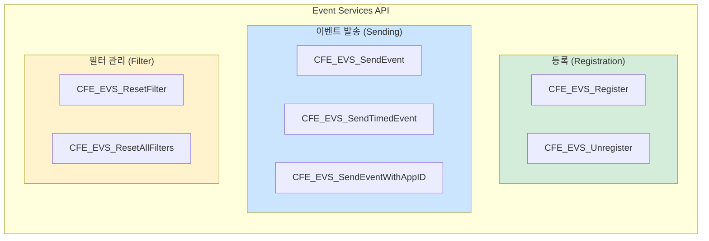
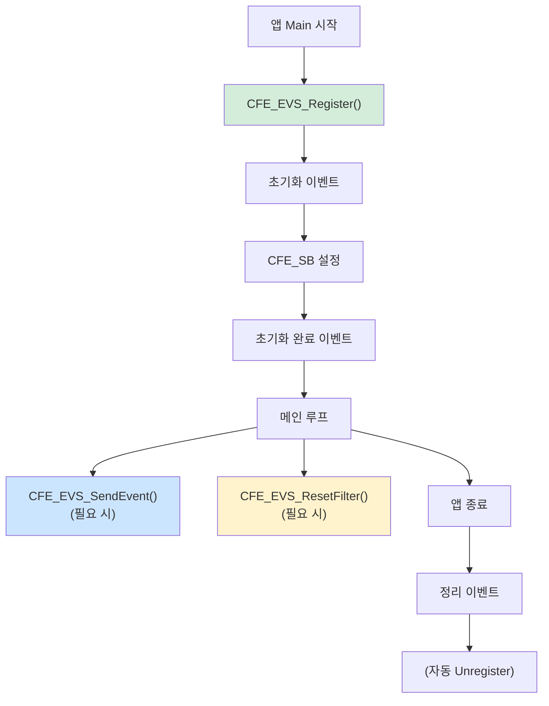

# Phase 2 EVS-10: EVS 주요 API 함수 분석

## 서론

본 문서는 Event Services 모듈의 핵심 API 함수들을 종합적으로 정리한 레퍼런스 가이드이다. 앞선 문서들에서 개별적으로 다룬 함수들을 한 곳에 모아 체계적으로 분류하고, 각 함수의 프로토타입, 파라미터, 반환값, 에러 코드, 그리고 실제 사용 예시를 제공한다.

EVS API는 이벤트 등록, 발송, 필터 관리로 크게 나눌 수 있으며, 모든 cFE 애플리케이션 개발에서 필수적으로 사용된다. 본 문서를 통해 EVS API의 전체 그림을 파악하고 효과적으로 활용할 수 있다.

---

## 1. API 함수 분류

### 1.1 분류 체계



### 1.2 함수 요약표

| 함수명 | 범주 | 필수 | 설명 |
|:---|:---|:---:|:---|
| `CFE_EVS_Register` | 등록 | ✓ | EVS에 앱 등록 |
| `CFE_EVS_Unregister` | 등록 | - | EVS 등록 해제 |
| `CFE_EVS_SendEvent` | 발송 | ✓ | 기본 이벤트 발송 |
| `CFE_EVS_SendTimedEvent` | 발송 | - | 타임스탬프 지정 발송 |
| `CFE_EVS_SendEventWithAppID` | 발송 | - | 앱 ID 지정 발송 |
| `CFE_EVS_ResetFilter` | 필터 | - | 특정 필터 리셋 |
| `CFE_EVS_ResetAllFilters` | 필터 | - | 모든 필터 리셋 |

---

## 2. 등록 함수

### 2.1 CFE_EVS_Register

애플리케이션을 EVS에 등록한다. 이벤트를 발송하기 전에 반드시 호출해야 한다.

#### 프로토타입

```c
CFE_Status_t CFE_EVS_Register(
    const CFE_EVS_BinFilter_t *Filters,
    uint16 NumEventFilters,
    uint16 FilterScheme
);
```

#### 파라미터

| 파라미터 | 타입 | 방향 | 설명 |
|:---|:---|:---:|:---|
| `Filters` | `const CFE_EVS_BinFilter_t *` | IN | 이벤트 필터 배열 (NULL 가능) |
| `NumEventFilters` | `uint16` | IN | 필터 배열 크기 (0 가능) |
| `FilterScheme` | `uint16` | IN | 필터링 방식 |

#### 필터 구조체

```c
/**
 * Binary Filter 항목 구조체
 */
typedef struct
{
    uint16 EventID;  /**< 필터링할 이벤트 ID */
    uint16 Mask;     /**< 필터 마스크 */
} CFE_EVS_BinFilter_t;
```

#### FilterScheme 값

```c
#define CFE_EVS_EventFilter_BINARY  0  /* Binary 필터 방식 (유일한 옵션) */
```

#### 반환값

| 값 | 설명 |
|:---|:---|
| `CFE_SUCCESS` | 성공 |
| `CFE_EVS_APP_FILTER_OVERLOAD` | 필터 수가 최대치 초과 |
| `CFE_EVS_UNKNOWN_FILTER` | 알 수 없는 필터 방식 |
| `CFE_EVS_APP_ILLEGAL_APP_ID` | 잘못된 앱 ID |

#### 사용 예시

```c
/* 예시 1: 필터 없이 등록 */
CFE_Status_t Status;

Status = CFE_EVS_Register(NULL, 0, CFE_EVS_EventFilter_BINARY);
if (Status != CFE_SUCCESS)
{
    CFE_ES_WriteToSysLog("MY_APP: EVS Register failed, RC=0x%08X\n",
                         (unsigned int)Status);
    return Status;
}
```

```c
/* 예시 2: 필터와 함께 등록 */
static CFE_EVS_BinFilter_t MY_APP_EventFilters[] =
{
    {MY_APP_DEBUG_MSG_EID,    CFE_EVS_FIRST_16_STOP},
    {MY_APP_LOOP_DBG_EID,     CFE_EVS_FIRST_8_STOP},
    {MY_APP_SENSOR_ERR_EID,   CFE_EVS_FIRST_4_STOP},
    {MY_APP_STATUS_EID,       CFE_EVS_EVERY_OTHER_TWO},
    {MY_APP_CRITICAL_EID,     CFE_EVS_NO_FILTER},
};

#define MY_APP_FILTER_COUNT \
    (sizeof(MY_APP_EventFilters) / sizeof(MY_APP_EventFilters[0]))

CFE_Status_t MY_APP_Init(void)
{
    CFE_Status_t Status;
    
    Status = CFE_EVS_Register(MY_APP_EventFilters,
                              MY_APP_FILTER_COUNT,
                              CFE_EVS_EventFilter_BINARY);
    
    if (Status != CFE_SUCCESS)
    {
        CFE_ES_WriteToSysLog("MY_APP: EVS Register failed\n");
        return Status;
    }
    
    CFE_EVS_SendEvent(MY_APP_INIT_EID,
                      CFE_EVS_EventType_INFORMATION,
                      "MY_APP Initialized with %u filters",
                      (unsigned int)MY_APP_FILTER_COUNT);
    
    return CFE_SUCCESS;
}
```

#### 주의사항

1. **초기화 순서**: 다른 EVS 함수 호출 전에 반드시 Register 호출
2. **필터 최대 개수**: `CFE_PLATFORM_EVS_MAX_EVENT_FILTERS` 초과 불가
3. **중복 등록**: 이미 등록된 앱은 오류 반환

---

### 2.2 CFE_EVS_Unregister

EVS 등록을 해제한다.

#### 프로토타입

```c
CFE_Status_t CFE_EVS_Unregister(void);
```

#### 파라미터

없음

#### 반환값

| 값 | 설명 |
|:---|:---|
| `CFE_SUCCESS` | 성공 |
| `CFE_EVS_APP_NOT_REGISTERED` | 등록되지 않은 앱 |

#### 사용 예시

```c
/* 앱 종료 시 (일반적으로 ES가 자동 처리) */
CFE_Status_t MY_APP_Cleanup(void)
{
    CFE_Status_t Status;
    
    /* 일반적으로 명시적 호출 불필요 */
    Status = CFE_EVS_Unregister();
    
    return Status;
}
```

#### 주의사항

1. **자동 해제**: 앱 종료 시 ES가 자동으로 EVS 등록 해제
2. **명시적 호출**: 특별한 경우가 아니면 불필요

---

## 3. 이벤트 발송 함수

### 3.1 CFE_EVS_SendEvent

가장 일반적인 이벤트 발송 함수이다. 현재 시간으로 타임스탬프가 자동 설정된다.

#### 프로토타입

```c
CFE_Status_t CFE_EVS_SendEvent(
    uint16 EventID,
    uint16 EventType,
    const char *Spec,
    ...
);
```

#### 파라미터

| 파라미터 | 타입 | 방향 | 설명 |
|:---|:---|:---:|:---|
| `EventID` | `uint16` | IN | 이벤트 식별자 (앱 내 고유) |
| `EventType` | `uint16` | IN | 이벤트 유형 |
| `Spec` | `const char *` | IN | printf 스타일 포맷 문자열 |
| `...` | 가변 | IN | 포맷 인자 |

#### EventType 값

```c
typedef enum
{
    CFE_EVS_EventType_DEBUG       = 0,  /**< 디버그 정보 */
    CFE_EVS_EventType_INFORMATION = 1,  /**< 정보성 메시지 */
    CFE_EVS_EventType_ERROR       = 2,  /**< 오류 발생 */
    CFE_EVS_EventType_CRITICAL    = 3   /**< 심각한 오류 */
} CFE_EVS_EventType_Enum_t;
```

#### 반환값

| 값 | 설명 |
|:---|:---|
| `CFE_SUCCESS` | 성공 |
| `CFE_EVS_APP_NOT_REGISTERED` | 앱 미등록 |
| `CFE_EVS_APP_ILLEGAL_APP_ID` | 잘못된 앱 ID |

#### 사용 예시

```c
/* INFORMATION 이벤트 */
CFE_EVS_SendEvent(MY_APP_INIT_EID,
                  CFE_EVS_EventType_INFORMATION,
                  "MY_APP Initialized. Version %d.%d.%d",
                  MAJOR_VERSION, MINOR_VERSION, REVISION);

/* ERROR 이벤트 */
CFE_EVS_SendEvent(MY_APP_CMD_ERR_EID,
                  CFE_EVS_EventType_ERROR,
                  "Invalid command: CC=%u, expected range=[0,%u]",
                  (unsigned int)ReceivedCC,
                  (unsigned int)MAX_CC);

/* DEBUG 이벤트 */
CFE_EVS_SendEvent(MY_APP_DEBUG_EID,
                  CFE_EVS_EventType_DEBUG,
                  "Processing data: addr=0x%lX, size=%u",
                  (unsigned long)DataPtr,
                  (unsigned int)DataSize);

/* CRITICAL 이벤트 */
CFE_EVS_SendEvent(MY_APP_CRIT_EID,
                  CFE_EVS_EventType_CRITICAL,
                  "CRITICAL: Memory corruption at 0x%lX, system unstable",
                  (unsigned long)CorruptAddr);
```

#### 포맷 문자열 가이드라인

```c
/* 타입별 권장 포맷 */

/* 정수 */
CFE_EVS_SendEvent(EID, TYPE, "Count: %d", (int)Value);
CFE_EVS_SendEvent(EID, TYPE, "Unsigned: %u", (unsigned int)Value);

/* 16진수 */
CFE_EVS_SendEvent(EID, TYPE, "Hex: 0x%04X", (unsigned int)Value);
CFE_EVS_SendEvent(EID, TYPE, "Status: 0x%08X", (unsigned int)Status);

/* 포인터/주소 */
CFE_EVS_SendEvent(EID, TYPE, "Address: 0x%lX", (unsigned long)Ptr);

/* 문자열 */
CFE_EVS_SendEvent(EID, TYPE, "Name: %s", String);
CFE_EVS_SendEvent(EID, TYPE, "File: %.32s", Filename);  /* 최대 32자 */

/* 혼합 */
CFE_EVS_SendEvent(EID, TYPE,
                  "Result: RC=0x%08X, count=%u, state=%s",
                  (unsigned int)RetCode,
                  (unsigned int)Count,
                  StateName);
```

#### 주의사항

1. **메시지 길이**: 최대 122자 (초과 시 잘림)
2. **타입 캐스팅**: 가변 인자에 명시적 캐스팅 권장
3. **앱 등록**: 반드시 Register 후 호출
4. **반환값**: 일반적으로 무시해도 되나, 중요 이벤트는 확인 권장

---

### 3.2 CFE_EVS_SendTimedEvent

특정 시간을 명시적으로 지정하여 이벤트를 발송한다.

#### 프로토타입

```c
CFE_Status_t CFE_EVS_SendTimedEvent(
    CFE_TIME_SysTime_t Time,
    uint16 EventID,
    uint16 EventType,
    const char *Spec,
    ...
);
```

#### 파라미터

| 파라미터 | 타입 | 방향 | 설명 |
|:---|:---|:---:|:---|
| `Time` | `CFE_TIME_SysTime_t` | IN | 이벤트 타임스탬프 |
| `EventID` | `uint16` | IN | 이벤트 식별자 |
| `EventType` | `uint16` | IN | 이벤트 유형 |
| `Spec` | `const char *` | IN | 포맷 문자열 |
| `...` | 가변 | IN | 포맷 인자 |

#### CFE_TIME_SysTime_t 구조

```c
typedef struct
{
    uint32 Seconds;      /**< 초 (Mission Elapsed Time) */
    uint32 Subseconds;   /**< 서브초 (1/2^32 초 단위) */
} CFE_TIME_SysTime_t;
```

#### 반환값

`CFE_EVS_SendEvent`와 동일

#### 사용 예시

```c
/* 데이터 수집 시점의 시간으로 이벤트 발송 */
CFE_TIME_SysTime_t AcquisitionTime;

/* 데이터 수집 시 시간 캡처 */
AcquisitionTime = CFE_TIME_GetTime();

/* ... 데이터 처리 ... */

/* 수집 시점 시간으로 이벤트 발송 */
CFE_EVS_SendTimedEvent(AcquisitionTime,
                       MY_APP_DATA_ACQ_EID,
                       CFE_EVS_EventType_DEBUG,
                       "Data acquired: samples=%u, quality=%u",
                       (unsigned int)SampleCount,
                       (unsigned int)Quality);
```

```c
/* 외부 이벤트 시간 기록 */
CFE_TIME_SysTime_t ExternalEventTime;

/* 외부 시스템 시간을 cFE 시간으로 변환 */
ExternalEventTime.Seconds = ExternalTimestamp / 1000;
ExternalEventTime.Subseconds = (ExternalTimestamp % 1000) * 4294967;  /* 근사 변환 */

CFE_EVS_SendTimedEvent(ExternalEventTime,
                       MY_APP_EXT_EVENT_EID,
                       CFE_EVS_EventType_INFORMATION,
                       "External event detected: type=%u",
                       (unsigned int)ExtEventType);
```

#### 사용 시나리오

1. **데이터 처리 지연**: 데이터 수집과 처리 사이에 지연이 있을 때
2. **외부 이벤트**: 외부 시스템에서 보고된 시간 기록
3. **일괄 처리**: 여러 이벤트를 나중에 처리할 때 원래 시간 유지

---

### 3.3 CFE_EVS_SendEventWithAppID

다른 앱의 ID로 이벤트를 발송한다. 주로 라이브러리에서 사용된다.

#### 프로토타입

```c
CFE_Status_t CFE_EVS_SendEventWithAppID(
    uint16 EventID,
    uint16 EventType,
    CFE_ES_AppId_t AppID,
    const char *Spec,
    ...
);
```

#### 파라미터

| 파라미터 | 타입 | 방향 | 설명 |
|:---|:---|:---:|:---|
| `EventID` | `uint16` | IN | 이벤트 식별자 |
| `EventType` | `uint16` | IN | 이벤트 유형 |
| `AppID` | `CFE_ES_AppId_t` | IN | 이벤트 소유 앱 ID |
| `Spec` | `const char *` | IN | 포맷 문자열 |
| `...` | 가변 | IN | 포맷 인자 |

#### 반환값

`CFE_EVS_SendEvent`와 동일

#### 사용 예시

```c
/* 라이브러리 함수에서 호출 앱 이름으로 이벤트 발송 */

/* 라이브러리 함수 */
void MY_LIB_ProcessData(CFE_ES_AppId_t CallerAppId, void *Data, size_t Size)
{
    CFE_Status_t Status;
    
    /* 데이터 처리 */
    Status = InternalProcess(Data, Size);
    
    if (Status != CFE_SUCCESS)
    {
        /* 호출 앱의 이름으로 이벤트 발송 */
        CFE_EVS_SendEventWithAppID(MY_LIB_PROCESS_ERR_EID,
                                   CFE_EVS_EventType_ERROR,
                                   CallerAppId,
                                   "Data processing failed: size=%u, RC=0x%08X",
                                   (unsigned int)Size,
                                   (unsigned int)Status);
    }
}

/* 앱에서 라이브러리 호출 */
void MY_APP_MainFunction(void)
{
    CFE_ES_AppId_t MyAppId;
    
    CFE_ES_GetAppID(&MyAppId);
    
    MY_LIB_ProcessData(MyAppId, DataBuffer, BufferSize);
    
    /* 
     * 결과: 이벤트가 MY_LIB_PROCESS_ERR_EID로 발생하지만
     * AppName은 "MY_APP"로 표시됨
     */
}
```

#### 사용 시나리오

1. **공용 라이브러리**: 여러 앱이 사용하는 라이브러리
2. **서비스 함수**: 다른 앱을 대신하여 작업 수행
3. **위임 처리**: 한 앱이 다른 앱의 요청을 처리

---

## 4. 필터 관리 함수

### 4.1 CFE_EVS_ResetFilter

특정 이벤트의 필터 카운터를 리셋한다.

#### 프로토타입

```c
CFE_Status_t CFE_EVS_ResetFilter(uint16 EventID);
```

#### 파라미터

| 파라미터 | 타입 | 방향 | 설명 |
|:---|:---|:---:|:---|
| `EventID` | `uint16` | IN | 리셋할 이벤트 ID |

#### 반환값

| 값 | 설명 |
|:---|:---|
| `CFE_SUCCESS` | 성공 |
| `CFE_EVS_APP_NOT_REGISTERED` | 앱 미등록 |
| `CFE_EVS_EVT_NOT_REGISTERED` | 해당 EID에 필터 없음 |

#### 사용 예시

```c
/* 새 동작 시작 시 관련 필터 리셋 */
void MY_APP_StartNewSequence(void)
{
    CFE_Status_t Status;
    
    /* 시퀀스 관련 이벤트 필터 리셋 */
    Status = CFE_EVS_ResetFilter(MY_APP_SEQ_DBG_EID);
    if (Status != CFE_SUCCESS)
    {
        CFE_EVS_SendEvent(MY_APP_RESET_ERR_EID,
                          CFE_EVS_EventType_ERROR,
                          "Failed to reset filter for EID=%u, RC=0x%08X",
                          MY_APP_SEQ_DBG_EID,
                          (unsigned int)Status);
    }
    
    CFE_EVS_SendEvent(MY_APP_SEQ_START_EID,
                      CFE_EVS_EventType_INFORMATION,
                      "New sequence started, filters reset");
}
```

```c
/* 오류 복구 후 필터 리셋 */
void MY_APP_HandleSensorRecovery(void)
{
    /* 센서 오류 필터 리셋 */
    CFE_EVS_ResetFilter(MY_APP_SENSOR_ERR_EID);
    
    CFE_EVS_SendEvent(MY_APP_SENSOR_OK_EID,
                      CFE_EVS_EventType_INFORMATION,
                      "Sensor recovered, error filter reset");
}
```

#### 주의사항

1. **필터 존재 여부**: 등록 시 해당 EID에 필터가 있어야 함
2. **FIRST_N_STOP 효과**: 리셋 후 다시 N번 전송 가능

---

### 4.2 CFE_EVS_ResetAllFilters

앱의 모든 필터 카운터를 리셋한다.

#### 프로토타입

```c
CFE_Status_t CFE_EVS_ResetAllFilters(void);
```

#### 파라미터

없음

#### 반환값

| 값 | 설명 |
|:---|:---|
| `CFE_SUCCESS` | 성공 |
| `CFE_EVS_APP_NOT_REGISTERED` | 앱 미등록 |

#### 사용 예시

```c
/* 주요 상태 변경 시 모든 필터 리셋 */
void MY_APP_EnterNewMode(uint8 NewMode)
{
    /* 모든 필터 리셋 */
    CFE_EVS_ResetAllFilters();
    
    CFE_EVS_SendEvent(MY_APP_MODE_CHANGE_EID,
                      CFE_EVS_EventType_INFORMATION,
                      "Entered mode %u, all filters reset",
                      (unsigned int)NewMode);
    
    /* 새 모드에서 이벤트들이 다시 정상 전송 */
}
```

```c
/* 자정 또는 주기적 리셋 */
void MY_APP_PeriodicReset(void)
{
    static uint32 CallCount = 0;
    
    CallCount++;
    
    /* 매 1000번 호출마다 (또는 시간 기반) */
    if ((CallCount % 1000) == 0)
    {
        CFE_EVS_ResetAllFilters();
        
        CFE_EVS_SendEvent(MY_APP_PERIODIC_RESET_EID,
                          CFE_EVS_EventType_DEBUG,
                          "Periodic filter reset, call count=%u",
                          (unsigned int)CallCount);
    }
}
```

---

## 5. 필터 마스크 상수

### 5.1 사전 정의된 마스크

```c
/* 필터 없음 - 모든 이벤트 전송 */
#define CFE_EVS_NO_FILTER           0x0000

/* 처음 N개만 전송 후 중지 */
#define CFE_EVS_FIRST_ONE_STOP      0xFFFF  /* 1개 */
#define CFE_EVS_FIRST_TWO_STOP      0xFFFE  /* 2개 */
#define CFE_EVS_FIRST_4_STOP        0xFFFC  /* 4개 */
#define CFE_EVS_FIRST_8_STOP        0xFFF8  /* 8개 */
#define CFE_EVS_FIRST_16_STOP       0xFFF0  /* 16개 */
#define CFE_EVS_FIRST_32_STOP       0xFFE0  /* 32개 */
#define CFE_EVS_FIRST_64_STOP       0xFFC0  /* 64개 */

/* 샘플링 - 일부만 전송 */
#define CFE_EVS_EVERY_OTHER_ONE     0x0001  /* 50% (2회 중 1회) */
#define CFE_EVS_EVERY_OTHER_TWO     0x0002  /* 25% (4회 중 1회) */
#define CFE_EVS_EVERY_FOURTH_ONE    0x0003  /* 25% (4회 중 1회) */
```

### 5.2 마스크 선택 가이드

| 마스크 | 동작 | 권장 용도 |
|:---|:---|:---|
| `NO_FILTER` | 모두 전송 | 중요 이벤트, 드물게 발생 |
| `FIRST_ONE_STOP` | 1회만 | 한 번만 보면 충분 |
| `FIRST_8_STOP` | 8회까지 | 반복 가능 오류 |
| `FIRST_16_STOP` | 16회까지 | 디버그 추적 |
| `EVERY_OTHER_ONE` | 50% | 빈번한 상태 보고 |
| `EVERY_FOURTH_ONE` | 25% | 고빈도 디버그 |

---

## 6. 에러 코드 요약

### 6.1 EVS 에러 코드 목록

```c
/* 성공 */
#define CFE_SUCCESS                      0x00000000

/* EVS 에러 코드 */
#define CFE_EVS_APP_NOT_REGISTERED       0xC4000001  /* 앱 미등록 */
#define CFE_EVS_APP_ILLEGAL_APP_ID       0xC4000002  /* 잘못된 앱 ID */
#define CFE_EVS_APP_FILTER_OVERLOAD      0xC4000003  /* 필터 수 초과 */
#define CFE_EVS_UNKNOWN_FILTER           0xC4000004  /* 알 수 없는 필터 유형 */
#define CFE_EVS_EVT_NOT_REGISTERED       0xC4000005  /* 이벤트 필터 없음 */
```

### 6.2 에러 처리 패턴

```c
/* 반환값 확인 패턴 */
CFE_Status_t Status;

Status = CFE_EVS_Register(...);
if (Status != CFE_SUCCESS)
{
    /* 등록 실패 - Syslog 사용 (EVS 불가) */
    CFE_ES_WriteToSysLog("MY_APP: EVS Register failed, RC=0x%08X\n",
                         (unsigned int)Status);
    
    /* 에러별 처리 */
    switch (Status)
    {
        case CFE_EVS_APP_FILTER_OVERLOAD:
            CFE_ES_WriteToSysLog("MY_APP: Too many filters\n");
            break;
        case CFE_EVS_UNKNOWN_FILTER:
            CFE_ES_WriteToSysLog("MY_APP: Invalid filter scheme\n");
            break;
        default:
            CFE_ES_WriteToSysLog("MY_APP: Unknown error\n");
            break;
    }
    
    return Status;
}

/* 이벤트 발송 반환값 (일반적으로 무시 가능) */
Status = CFE_EVS_SendEvent(EID, TYPE, "Message");
/* 대부분의 경우 반환값 확인 생략 */

/* 중요 이벤트의 경우 확인 */
Status = CFE_EVS_SendEvent(CRITICAL_EID, CFE_EVS_EventType_CRITICAL, "...");
if (Status != CFE_SUCCESS)
{
    /* 백업 로깅 */
    CFE_ES_WriteToSysLog("MY_APP: Critical event send failed\n");
}
```

---

## 7. 전체 사용 예시

### 7.1 표준 앱 구조

```c
/* my_app_events.h */
#ifndef MY_APP_EVENTS_H
#define MY_APP_EVENTS_H

/* INFORMATION 이벤트 (1-9) */
#define MY_APP_INIT_EID           1
#define MY_APP_NOOP_EID           2
#define MY_APP_RESET_EID          3
#define MY_APP_MODE_EID           4

/* ERROR 이벤트 (10-29) */
#define MY_APP_CC_ERR_EID         10
#define MY_APP_LEN_ERR_EID        11
#define MY_APP_PIPE_ERR_EID       20
#define MY_APP_DATA_ERR_EID       25

/* CRITICAL 이벤트 (30-39) */
#define MY_APP_CRIT_ERR_EID       30

/* DEBUG 이벤트 (40-99) */
#define MY_APP_DBG_EID            40
#define MY_APP_LOOP_DBG_EID       41

#endif /* MY_APP_EVENTS_H */
```

```c
/* my_app.c */
#include "cfe.h"
#include "my_app_events.h"

/* 필터 테이블 */
static CFE_EVS_BinFilter_t MY_APP_Filters[] =
{
    {MY_APP_DBG_EID,      CFE_EVS_FIRST_16_STOP},
    {MY_APP_LOOP_DBG_EID, CFE_EVS_FIRST_8_STOP},
    {MY_APP_DATA_ERR_EID, CFE_EVS_FIRST_4_STOP},
};

#define MY_APP_FILTER_COUNT \
    (sizeof(MY_APP_Filters) / sizeof(MY_APP_Filters[0]))

/* 앱 초기화 */
CFE_Status_t MY_APP_Init(void)
{
    CFE_Status_t Status;
    
    /* 1. EVS 등록 (첫 번째로 수행) */
    Status = CFE_EVS_Register(MY_APP_Filters,
                              MY_APP_FILTER_COUNT,
                              CFE_EVS_EventFilter_BINARY);
    if (Status != CFE_SUCCESS)
    {
        CFE_ES_WriteToSysLog("MY_APP: EVS Register failed\n");
        return Status;
    }
    
    /* 2. 초기화 시작 이벤트 */
    CFE_EVS_SendEvent(MY_APP_INIT_EID,
                      CFE_EVS_EventType_INFORMATION,
                      "MY_APP: Initialization starting...");
    
    /* 3. 파이프 생성 */
    Status = CFE_SB_CreatePipe(&MY_APP_Data.CmdPipe, 10, "MY_APP_CMD");
    if (Status != CFE_SUCCESS)
    {
        CFE_EVS_SendEvent(MY_APP_PIPE_ERR_EID,
                          CFE_EVS_EventType_ERROR,
                          "Pipe creation failed: RC=0x%08X",
                          (unsigned int)Status);
        return Status;
    }
    
    /* 4. 구독 */
    /* ... */
    
    /* 5. 초기화 완료 이벤트 */
    CFE_EVS_SendEvent(MY_APP_INIT_EID,
                      CFE_EVS_EventType_INFORMATION,
                      "MY_APP Initialized. Version %d.%d.%d",
                      MAJOR_VER, MINOR_VER, REV);
    
    return CFE_SUCCESS;
}

/* 명령 처리 */
void MY_APP_ProcessCommand(const CFE_SB_Buffer_t *BufPtr)
{
    CFE_MSG_FcnCode_t CC;
    
    CFE_MSG_GetFcnCode(&BufPtr->Msg, &CC);
    
    switch (CC)
    {
        case MY_APP_NOOP_CC:
            CFE_EVS_SendEvent(MY_APP_NOOP_EID,
                              CFE_EVS_EventType_INFORMATION,
                              "NOOP command received");
            break;
            
        case MY_APP_RESET_CC:
            CFE_EVS_ResetAllFilters();
            CFE_EVS_SendEvent(MY_APP_RESET_EID,
                              CFE_EVS_EventType_INFORMATION,
                              "Counters and filters reset");
            break;
            
        default:
            CFE_EVS_SendEvent(MY_APP_CC_ERR_EID,
                              CFE_EVS_EventType_ERROR,
                              "Invalid command code: CC=%u",
                              (unsigned int)CC);
            break;
    }
}
```

---

## 8. API 호출 순서

### 8.1 앱 생명주기에서의 EVS 사용



---

## 결론

본 문서는 Event Services의 모든 핵심 API 함수를 체계적으로 정리하였다. 이 레퍼런스를 통해 cFE 애플리케이션 개발 시 EVS 함수를 정확하고 효과적으로 활용할 수 있다.

핵심 사항을 정리하면 다음과 같다:

**등록 함수:**
- `CFE_EVS_Register()`: 필수, 초기화 첫 단계
- `CFE_EVS_Unregister()`: 일반적으로 자동 처리

**발송 함수:**
- `CFE_EVS_SendEvent()`: 가장 일반적인 이벤트 발송
- `CFE_EVS_SendTimedEvent()`: 타임스탬프 지정 필요 시
- `CFE_EVS_SendEventWithAppID()`: 라이브러리에서 사용

**필터 함수:**
- `CFE_EVS_ResetFilter()`: 특정 EID 필터 리셋
- `CFE_EVS_ResetAllFilters()`: 전체 필터 리셋

**필터 마스크:**
- `CFE_EVS_NO_FILTER`: 필터 없음
- `CFE_EVS_FIRST_N_STOP`: 처음 N개만
- `CFE_EVS_EVERY_OTHER`: 샘플링

이로써 Event Services 모듈 시리즈(EVS-01 ~ EVS-10)가 완료되었다. 다음은 Table Services(TBL) 모듈을 다룰 것이다.

---

## 참고 문헌

1. NASA, "cFE Application Developer's Guide"
2. NASA, "Event Services API Reference"
3. NASA cFE GitHub, cfe/modules/evs/fsw/inc/cfe_evs.h
4. NASA, "cFE Header Files Documentation"

---

[이전 문서: Phase 2 EVS-09: EVS 명령 및 텔레메트리](./Phase2_EVS_09_EVS_명령_및_텔레메트리.md)

[다음 문서: Phase 2 TBL-01: TBL 모듈 개요 및 역할](./Phase2_TBL_01_TBL_모듈_개요.md)
