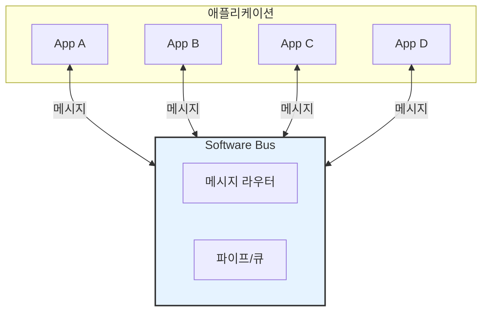
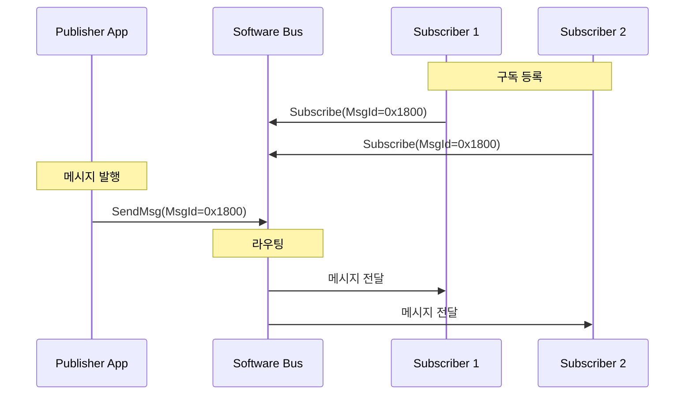
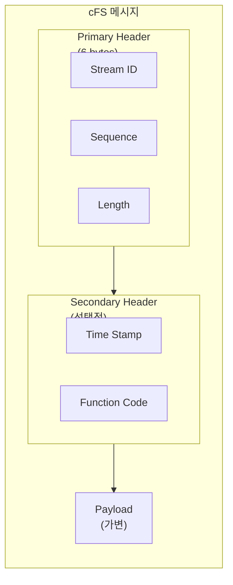
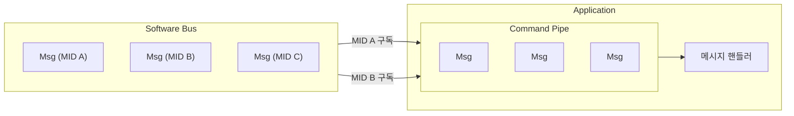
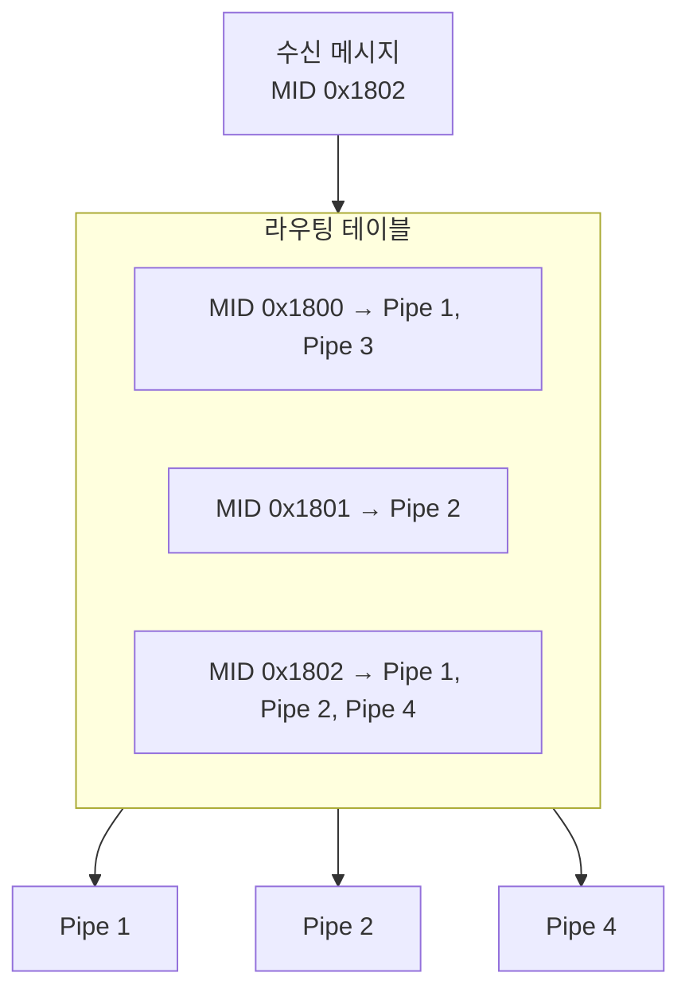
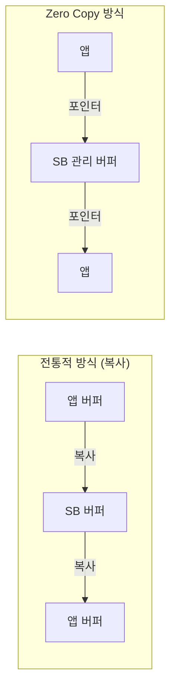
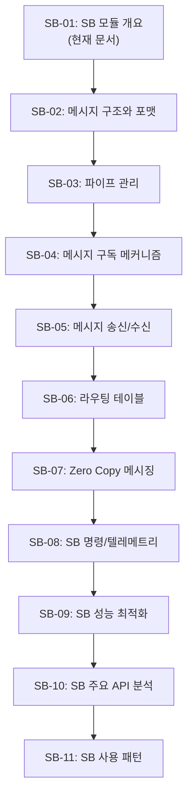

# Phase 2 SB-01: Software Bus 모듈 개요

## 서론

Software Bus(SB)는 cFE의 핵심 통신 메커니즘이다. cFS 아키텍처에서 모든 애플리케이션 간 통신은 SB를 통해 이루어진다. SB는 Publish/Subscribe 패턴을 기반으로, 앱들이 서로를 직접 알지 않고도 메시지를 교환할 수 있게 해준다.

본 문서에서는 SB의 개념, 아키텍처, 주요 기능을 개요 수준에서 살펴본다.

---

## 1. Software Bus 개요

### 1.1 SB의 역할

SB는 cFS에서 앱 간 통신의 유일한 수단이다:



### 1.2 SB의 핵심 개념

| 개념 | 설명 |
|:---|:---|
| **Message** | 앱 간에 교환되는 데이터 단위 |
| **Message ID** | 메시지를 식별하는 고유 식별자 |
| **Pipe** | 메시지를 수신하는 큐 |
| **Subscribe** | 특정 Message ID를 수신하겠다고 등록 |
| **Publish** | 메시지를 SB에 발송 |

### 1.3 Publish/Subscribe 패턴

SB는 Publish/Subscribe 패턴을 사용한다:



**장점**:
- **느슨한 결합**: Publisher는 Subscriber를 알 필요 없음
- **유연성**: 런타임에 구독 변경 가능
- **확장성**: 새 앱 추가 시 기존 앱 수정 불필요

---

## 2. 메시지 구조

### 2.1 CCSDS 메시지 형식

cFS 메시지는 CCSDS(Consultative Committee for Space Data Systems) 표준을 따른다:



### 2.2 Message ID

Message ID는 메시지를 고유하게 식별한다:

```c
/* Message ID 예시 */
#define MY_APP_CMD_MID      0x1880  /* 명령 메시지 */
#define MY_APP_HK_TLM_MID   0x0880  /* 텔레메트리 메시지 */

/* Message ID 구성 */
/* Bit 15: 0=Telemetry, 1=Command */
/* Bit 14-11: 시스템/프로세서 식별 */
/* Bit 10-0: 앱/기능 식별 */
```

### 2.3 명령 vs 텔레메트리

| 유형 | MID 범위 | 용도 |
|:---|:---|:---|
| **Command** | 0x1800-0x1FFF | 앱에 동작 지시 |
| **Telemetry** | 0x0800-0x0FFF | 상태/데이터 보고 |

---

## 3. 파이프 (Pipe)

### 3.1 파이프 개념

파이프는 메시지를 수신하는 큐이다:



### 3.2 파이프 생성

```c
CFE_SB_PipeId_t PipeId;
CFE_Status_t Status;

/* 파이프 생성 */
Status = CFE_SB_CreatePipe(&PipeId,    /* 파이프 ID 반환 */
                           10,          /* 큐 깊이 */
                           "MY_PIPE");  /* 파이프 이름 */
```

### 3.3 메시지 구독

```c
/* 특정 Message ID 구독 */
CFE_SB_Subscribe(MY_APP_CMD_MID, PipeId);
CFE_SB_Subscribe(MY_APP_SEND_HK_MID, PipeId);
```

---

## 4. 메시지 송수신

### 4.1 메시지 송신

```c
/* 메시지 버퍼 할당 */
MY_APP_HkTlm_t *HkMsgPtr;
HkMsgPtr = (MY_APP_HkTlm_t *)CFE_SB_AllocateMessageBuffer(sizeof(*HkMsgPtr));

/* 메시지 헤더 초기화 */
CFE_MSG_Init(&HkMsgPtr->TelemetryHeader.Msg,
             CFE_SB_ValueToMsgId(MY_APP_HK_TLM_MID),
             sizeof(*HkMsgPtr));

/* 페이로드 설정 */
HkMsgPtr->Payload.Counter = MyData.Counter;

/* 메시지 송신 */
CFE_SB_TransmitMsg(&HkMsgPtr->TelemetryHeader.Msg, true);
```

### 4.2 메시지 수신

```c
CFE_SB_Buffer_t *BufPtr;
CFE_Status_t Status;

/* 메시지 대기 및 수신 */
Status = CFE_SB_ReceiveBuffer(&BufPtr,    /* 버퍼 포인터 */
                              PipeId,      /* 파이프 ID */
                              CFE_SB_PEND_FOREVER); /* 타임아웃 */

if (Status == CFE_SUCCESS)
{
    ProcessMessage(BufPtr);
}
```

---

## 5. 라우팅 테이블

### 5.1 라우팅 구조

SB는 라우팅 테이블을 사용하여 메시지를 적절한 파이프로 전달한다:



### 5.2 구독 시 라우팅 등록

```c
/* 앱 1이 MID 0x1800 구독 */
CFE_SB_Subscribe(0x1800, Pipe1);  /* 라우팅 테이블에 추가 */

/* 앱 2도 MID 0x1800 구독 */
CFE_SB_Subscribe(0x1800, Pipe2);  /* 동일 MID, 다른 파이프 추가 */
```

---

## 6. Zero Copy 메시지

### 6.1 Zero Copy 개념

SB는 Zero Copy 메시지 전달을 지원하여 성능을 최적화한다:



### 6.2 Zero Copy 사용

```c
/* SB에서 버퍼 할당 (Zero Copy) */
MY_MSG_t *MsgPtr;
MsgPtr = (MY_MSG_t *)CFE_SB_AllocateMessageBuffer(sizeof(*MsgPtr));

/* 메시지 설정 */
CFE_MSG_Init(&MsgPtr->Msg, MsgId, sizeof(*MsgPtr));

/* 송신 (버퍼 소유권 이전) */
CFE_SB_TransmitMsg(&MsgPtr->Msg, true);
/* 이후 MsgPtr 사용 금지 */
```

---

## 7. SB 서비스 구성

### 7.1 SB 구성 파라미터

```c
/* 플랫폼 구성 (platform_cfg.h) */
#define CFE_PLATFORM_SB_MAX_MSG_IDS        256  /* 최대 Message ID 수 */
#define CFE_PLATFORM_SB_MAX_PIPES          64   /* 최대 파이프 수 */
#define CFE_PLATFORM_SB_MAX_DEST_PER_PKT   16   /* MID당 최대 구독자 */
#define CFE_PLATFORM_SB_DEFAULT_MSG_LIMIT  4    /* 기본 메시지 제한 */
#define CFE_PLATFORM_SB_BUF_MEMORY_BYTES   524288 /* 버퍼 풀 크기 */
```

### 7.2 SB 명령/텔레메트리

| 타입 | 설명 |
|:---|:---|
| **명령** | 라우팅 정보 덤프, 통계 조회 |
| **텔레메트리** | Housekeeping, 파이프 정보, 라우팅 정보 |

---

## 8. SB 모듈 문서 로드맵



---

## 결론

Software Bus는 cFS의 통신 중추로서, Publish/Subscribe 패턴을 통해 앱 간의 느슨한 결합을 실현한다. 앱들은 Message ID를 통해 통신하며, SB가 메시지를 적절한 구독자에게 라우팅한다.

SB의 주요 특징:
- **단순한 API**: 파이프 생성, 구독, 송수신
- **유연한 라우팅**: 다대다 통신 지원
- **Zero Copy**: 효율적인 메시지 전달
- **표준 메시지 형식**: CCSDS 호환

다음 문서에서는 cFS 메시지의 구조와 포맷을 상세히 살펴볼 것이다.

---

## 참고 문헌

1. NASA, "cFE Application Developer's Guide"
2. NASA, "Software Bus User's Guide"
3. NASA cFE GitHub, cfe/modules/sb/

---

[이전 문서: Phase 2 ES-12: ES 주요 API 함수 분석](./Phase2_ES_12_ES_주요_API_함수_분석.md)

[다음 문서: Phase 2 SB-02: 메시지 구조와 포맷](./Phase2_SB_02_메시지_구조와_포맷.md)
