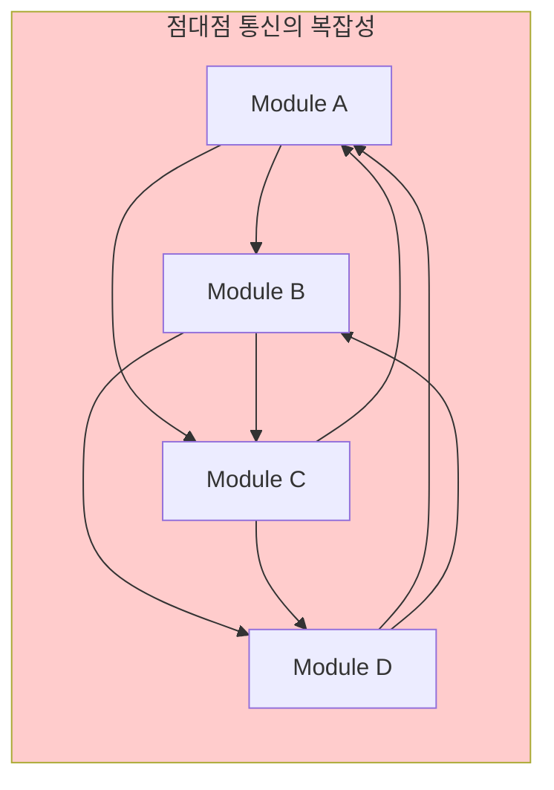
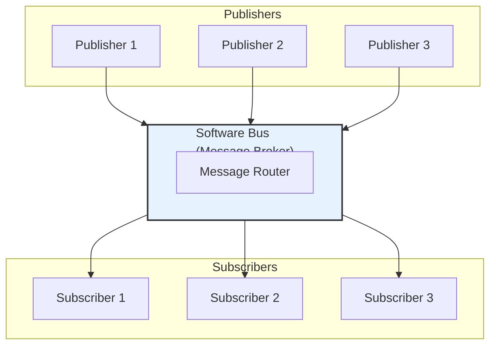
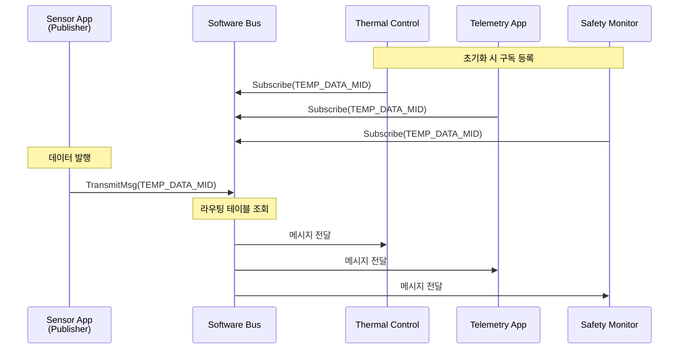
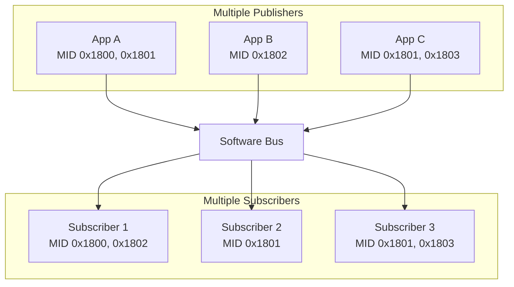
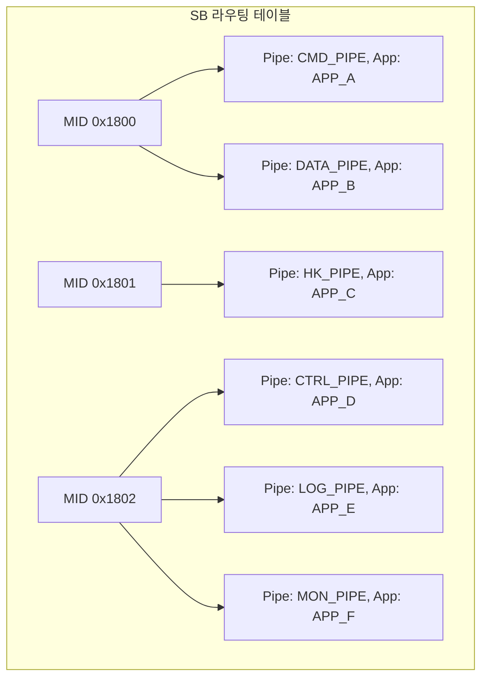
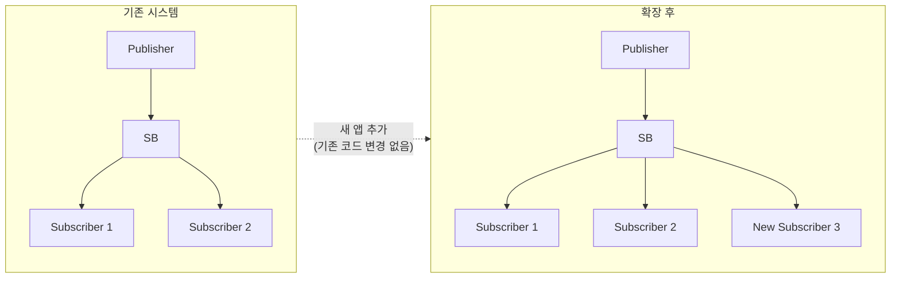
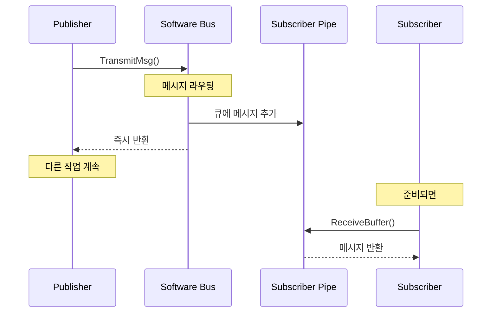

# Phase 2 SB-02: Publish/Subscribe 패턴의 이해

## 서론

Software Bus의 핵심은 Publish/Subscribe(발행/구독) 패턴이다. 이 통신 패러다임은 전통적인 점대점(Point-to-Point) 통신과 근본적으로 다른 접근 방식을 취한다. Publish/Subscribe 패턴에서 메시지 발신자(Publisher)는 수신자(Subscriber)를 직접 알지 못하며, 반대로 수신자도 발신자를 알 필요가 없다. 이러한 느슨한 결합(Loose Coupling)은 비행 소프트웨어 개발에서 매우 중요한 이점을 제공한다.

본 문서에서는 Publish/Subscribe 패턴의 개념, cFE SB에서의 구현 방식, 그리고 이 패턴이 제공하는 장점을 상세히 살펴본다.

---

## 1. 통신 패턴의 진화

### 1.1 전통적인 점대점 통신

전통적인 소프트웨어에서 모듈 간 통신은 주로 점대점 방식으로 이루어졌다. 이 방식에서 모듈 A가 모듈 B에 데이터를 전달하려면, A는 B의 존재를 알고 있어야 하며 B의 인터페이스를 직접 호출한다. 이러한 방식은 단순한 시스템에서는 효과적이지만, 시스템이 복잡해지면서 여러 문제가 발생한다.

점대점 통신의 문제점은 다음과 같다. 첫째, 모듈 간 강한 의존성이 생겨서 하나의 모듈을 변경하면 연결된 다른 모듈도 수정해야 한다. 둘째, 동일한 데이터를 여러 모듈에 전달해야 하는 경우 발신자가 모든 수신자를 개별적으로 호출해야 한다. 셋째, 새로운 모듈을 추가하거나 기존 모듈을 제거할 때 관련된 모든 모듈의 코드를 수정해야 한다.



### 1.2 Publish/Subscribe 패턴의 등장

Publish/Subscribe 패턴은 이러한 문제를 해결하기 위해 중간에 메시지 브로커(Message Broker)를 두는 방식이다. cFE에서는 Software Bus가 바로 이 메시지 브로커 역할을 담당한다. Publisher는 메시지를 SB에 발행하고, Subscriber는 관심 있는 메시지를 SB에 등록(구독)한다. SB는 발행된 메시지를 해당 메시지에 관심을 등록한 모든 Subscriber에게 전달한다.

이 패턴의 핵심은 Publisher와 Subscriber가 서로를 알 필요가 없다는 것이다. Publisher는 단지 메시지를 발행할 뿐이고, 누가 그 메시지를 받는지 신경 쓰지 않는다. Subscriber는 단지 관심 있는 메시지 유형을 등록할 뿐이고, 누가 그 메시지를 발행하는지 알 필요가 없다.



---

## 2. cFE SB에서의 Publish/Subscribe

### 2.1 Message ID 기반 통신

cFE SB에서 Publish/Subscribe 패턴은 Message ID를 중심으로 동작한다. Message ID는 메시지의 유형을 고유하게 식별하는 값으로, 모든 구독과 발행은 이 ID를 기준으로 이루어진다.

Publisher 측에서는 메시지를 생성할 때 해당 메시지의 Message ID를 헤더에 설정한다. 그런 다음 `CFE_SB_TransmitMsg()` 함수를 호출하여 메시지를 SB에 전달한다. Publisher는 이 메시지가 어디로 전달될지, 누가 받을지 전혀 알지 못한다.

Subscriber 측에서는 먼저 `CFE_SB_CreatePipe()` 함수로 메시지를 수신할 파이프를 생성한다. 그런 다음 `CFE_SB_Subscribe()` 함수를 호출하여 관심 있는 Message ID를 해당 파이프에 구독 등록한다. 이후 해당 Message ID의 메시지가 SB에 발행되면 자동으로 파이프로 전달된다.

```c
/* Publisher 측 코드 */
void PublishSensorData(void)
{
    SENSOR_Data_t *MsgPtr;
    
    /* 메시지 버퍼 할당 */
    MsgPtr = (SENSOR_Data_t *)CFE_SB_AllocateMessageBuffer(sizeof(*MsgPtr));
    
    /* 메시지 헤더 초기화 (Message ID 설정) */
    CFE_MSG_Init(&MsgPtr->TelemetryHeader.Msg,
                 CFE_SB_ValueToMsgId(SENSOR_DATA_MID),
                 sizeof(*MsgPtr));
    
    /* 페이로드 설정 */
    MsgPtr->Payload.Temperature = ReadTemperature();
    MsgPtr->Payload.Pressure = ReadPressure();
    
    /* 메시지 발행 - 누가 받는지 모름 */
    CFE_SB_TransmitMsg(&MsgPtr->TelemetryHeader.Msg, true);
}
```

```c
/* Subscriber 측 코드 */
CFE_Status_t InitSubscriber(void)
{
    CFE_Status_t Status;
    
    /* 파이프 생성 */
    Status = CFE_SB_CreatePipe(&MyPipeId, 10, "MY_PIPE");
    if (Status != CFE_SUCCESS)
    {
        return Status;
    }
    
    /* Message ID 구독 - 누가 보내는지 모름 */
    Status = CFE_SB_Subscribe(CFE_SB_ValueToMsgId(SENSOR_DATA_MID), MyPipeId);
    
    return Status;
}
```

### 2.2 일대다(One-to-Many) 통신

Publish/Subscribe 패턴의 강력한 특징 중 하나는 일대다 통신이 자연스럽게 지원된다는 것이다. 하나의 Publisher가 발행한 메시지는 해당 Message ID를 구독한 모든 Subscriber에게 동시에 전달된다. Publisher는 Subscriber가 몇 개인지, 또는 아예 없는지도 알 필요가 없다.

예를 들어, 센서 앱이 온도 데이터를 발행하면, 이 데이터에 관심 있는 모든 앱(열 제어 앱, 텔레메트리 앱, 안전 모니터링 앱 등)이 동일한 메시지를 수신한다.



### 2.3 다대다(Many-to-Many) 통신

SB는 다대다 통신도 자연스럽게 지원한다. 여러 Publisher가 동일한 Message ID로 메시지를 발행할 수 있으며, 여러 Subscriber가 해당 메시지를 수신할 수 있다. 물론 일반적으로는 하나의 Message ID에 대해 하나의 Publisher만 존재하는 것이 권장되지만, 아키텍처에 따라 다양한 구성이 가능하다.



---

## 3. 구독 메커니즘

### 3.1 구독 등록

`CFE_SB_Subscribe()` 함수는 특정 Message ID를 특정 파이프에 구독 등록한다. 이 함수가 호출되면 SB는 내부 라우팅 테이블에 해당 Message ID와 파이프의 연결 정보를 기록한다.

```c
/**
 * @brief Message ID 구독
 *
 * 지정된 Message ID의 메시지를 파이프로 수신한다.
 * 동일한 MID를 여러 파이프가 구독할 수 있다.
 *
 * @param MsgId   구독할 Message ID
 * @param PipeId  메시지를 수신할 파이프
 *
 * @return CFE_SUCCESS 성공
 * @return CFE_SB_MAX_MSGS_MET 최대 메시지 수 초과
 * @return CFE_SB_MAX_DESTS_MET 최대 구독자 수 초과
 */
CFE_Status_t CFE_SB_Subscribe(CFE_SB_MsgId_t MsgId, CFE_SB_PipeId_t PipeId);
```

SB는 각 파이프에 대해 기본 메시지 제한(Message Limit)을 적용한다. 이는 특정 Message ID의 메시지가 파이프에 쌓일 수 있는 최대 개수를 의미한다. 기본값은 `CFE_PLATFORM_SB_DEFAULT_MSG_LIMIT`로 정의되며, 필요시 `CFE_SB_SubscribeEx()` 함수를 사용하여 개별 구독에 다른 제한을 설정할 수 있다.

```c
/**
 * @brief 확장 구독 함수
 *
 * 메시지 제한과 QoS를 지정하여 구독한다.
 *
 * @param MsgId    구독할 Message ID
 * @param PipeId   메시지를 수신할 파이프
 * @param Quality  QoS 설정 (현재 미지원)
 * @param MsgLim   해당 MID에 대한 파이프 내 최대 메시지 수
 */
CFE_Status_t CFE_SB_SubscribeEx(CFE_SB_MsgId_t MsgId,
                                 CFE_SB_PipeId_t PipeId,
                                 CFE_SB_Qos_t Quality,
                                 uint16 MsgLim);
```

### 3.2 구독 해제

앱이 더 이상 특정 메시지를 수신하지 않아도 되는 경우, `CFE_SB_Unsubscribe()` 함수로 구독을 해제할 수 있다. 이 함수가 호출되면 SB는 라우팅 테이블에서 해당 연결을 제거하고, 이후 해당 Message ID의 메시지는 더 이상 해당 파이프로 전달되지 않는다.

```c
/**
 * @brief Message ID 구독 해제
 *
 * 지정된 Message ID에 대한 구독을 해제한다.
 *
 * @param MsgId   구독 해제할 Message ID
 * @param PipeId  해당 파이프
 *
 * @return CFE_SUCCESS 성공
 */
CFE_Status_t CFE_SB_Unsubscribe(CFE_SB_MsgId_t MsgId, CFE_SB_PipeId_t PipeId);
```

구독 해제는 런타임에 동적으로 수행될 수 있으며, 이는 시스템의 유연성을 높인다. 예를 들어, 시스템 모드가 변경될 때 특정 메시지 구독을 동적으로 변경할 수 있다.

### 3.3 구독 정보 관리

SB는 내부적으로 모든 구독 정보를 관리하며, 지상 명령을 통해 현재 라우팅 상태를 조회할 수 있다. `SB_WRITE_ROUTING_INFO` 명령은 현재의 모든 라우팅 정보를 파일로 덤프한다.



---

## 4. Publish/Subscribe 패턴의 장점

### 4.1 느슨한 결합 (Loose Coupling)

Publish/Subscribe 패턴의 가장 큰 장점은 모듈 간의 느슨한 결합이다. Publisher와 Subscriber가 서로를 알 필요가 없기 때문에, 한 모듈의 변경이 다른 모듈에 직접적인 영향을 미치지 않는다. 이는 다음과 같은 이점을 제공한다.

첫째, 모듈 독립적 개발이 가능하다. 각 앱은 자신이 발행하거나 구독하는 Message ID만 알면 되므로, 다른 앱의 구현 세부사항을 알 필요가 없다. 이러한 독립성은 여러 팀이 동시에 개발을 진행하는 대규모 프로젝트에서 특히 유용하다.

둘째, 테스트가 용이하다. 각 앱을 독립적으로 테스트할 수 있으며, 테스트 시 실제 앱 대신 테스트 스텁을 사용하여 메시지를 발행하거나 수신할 수 있다.

셋째, 재사용성이 높아진다. 앱이 특정 다른 앱에 의존하지 않으므로, 다른 미션에서 동일한 앱을 재사용하기 쉽다.

### 4.2 동적 시스템 구성

Publish/Subscribe 패턴은 런타임에 시스템 구성을 동적으로 변경할 수 있게 해준다. 앱은 언제든지 새로운 Message ID를 구독하거나 기존 구독을 해제할 수 있다. 새로운 앱이 시작되어 메시지를 구독하거나 발행해도 기존 앱들은 전혀 영향을 받지 않는다.

이러한 동적 구성은 비행 소프트웨어에서 중요한 의미를 갖는다. 미션 중에 새로운 앱을 업로드하거나 기존 앱을 재시작해도 시스템 전체가 안정적으로 동작할 수 있다.

```c
/* 동적 구독 변경 예시 */
void ChangeOperatingMode(uint32 NewMode)
{
    if (NewMode == SCIENCE_MODE)
    {
        /* Science 모드에서만 필요한 데이터 구독 */
        CFE_SB_Subscribe(SCIENCE_DATA_MID, MyPipeId);
    }
    else
    {
        /* Science 모드 해제 시 구독 해제 */
        CFE_SB_Unsubscribe(SCIENCE_DATA_MID, MyPipeId);
    }
}
```

### 4.3 확장성

새로운 기능을 추가할 때 기존 코드를 수정할 필요가 없다. 새 앱이 기존 메시지를 구독하기만 하면 해당 데이터를 받기 시작한다. 마찬가지로, 새 앱이 새로운 메시지를 발행하기 시작하면 관심 있는 다른 앱들이 그 메시지를 구독할 수 있다.



---

## 5. 메시지 전달 동작

### 5.1 동기 vs 비동기 전달

cFE SB에서 메시지 전달은 기본적으로 비동기적이다. Publisher가 `CFE_SB_TransmitMsg()`를 호출하면, SB는 메시지를 각 Subscriber의 파이프 큐에 복사하고 즉시 반환한다. Subscriber는 자신의 스케줄에 따라 파이프에서 메시지를 꺼내어 처리한다.

이러한 비동기 방식은 Publisher가 Subscriber의 처리 속도에 영향을 받지 않게 해준다. Publisher는 메시지를 발행한 직후 다른 작업을 계속할 수 있다.



### 5.2 메시지 복사

기본적으로 SB는 메시지를 각 Subscriber의 파이프에 복사한다. 이는 각 Subscriber가 독립적인 메시지 사본을 받으므로, 한 Subscriber가 메시지를 수정해도 다른 Subscriber에게 영향을 미치지 않는다는 것을 의미한다.

Zero Copy 모드를 사용하면 복사 오버헤드를 줄일 수 있지만, 이 경우 메시지의 불변성(immutability)을 보장하기 위한 프로그래밍 규율이 필요하다.

### 5.3 메시지 손실 처리

파이프 큐가 가득 찬 경우, 새로 도착한 메시지는 드롭될 수 있다. SB는 이러한 상황을 추적하고 통계를 유지한다. 앱 개발자는 파이프 깊이와 메시지 제한을 적절히 설정하여 메시지 손실을 방지해야 한다.

```c
/* 적절한 파이프 깊이 설정 */
#define MY_APP_PIPE_DEPTH  20  /* 예상 메시지 빈도 고려 */

Status = CFE_SB_CreatePipe(&PipeId, MY_APP_PIPE_DEPTH, "MY_PIPE");
```

---

## 6. Publish/Subscribe 구현 예시

### 6.1 완전한 Publisher 예시

```c
#include "cfe.h"
#include "my_publisher.h"

/* 앱 데이터 */
typedef struct {
    CFE_SB_Buffer_t *MsgPtr;
    uint32 Counter;
} MY_PUB_Data_t;

MY_PUB_Data_t MY_PUB_Data;

/* 초기화 */
CFE_Status_t MY_PUB_Init(void)
{
    /* 다른 초기화... */
    MY_PUB_Data.Counter = 0;
    
    return CFE_SUCCESS;
}

/* 데이터 발행 함수 */
void MY_PUB_PublishData(void)
{
    MY_PUB_DataMsg_t *MsgPtr;
    
    /* SB에서 버퍼 할당 */
    MsgPtr = (MY_PUB_DataMsg_t *)CFE_SB_AllocateMessageBuffer(sizeof(*MsgPtr));
    
    if (MsgPtr != NULL)
    {
        /* 헤더 초기화 */
        CFE_MSG_Init(&MsgPtr->TelemetryHeader.Msg,
                     CFE_SB_ValueToMsgId(MY_PUB_DATA_MID),
                     sizeof(*MsgPtr));
        
        /* 타임스탬프 설정 */
        CFE_SB_TimeStampMsg(&MsgPtr->TelemetryHeader.Msg);
        
        /* 페이로드 설정 */
        MsgPtr->Payload.Counter = MY_PUB_Data.Counter++;
        MsgPtr->Payload.Status = GetCurrentStatus();
        
        /* 메시지 발행 */
        CFE_SB_TransmitMsg(&MsgPtr->TelemetryHeader.Msg, true);
        
        CFE_EVS_SendEvent(MY_PUB_DATA_SENT_EID,
                          CFE_EVS_EventType_DEBUG,
                          "Data message published, Counter=%u",
                          (unsigned int)MY_PUB_Data.Counter);
    }
}
```

### 6.2 완전한 Subscriber 예시

```c
#include "cfe.h"
#include "my_subscriber.h"

/* 앱 데이터 */
typedef struct {
    CFE_SB_PipeId_t CmdPipe;
    uint32 ReceivedCount;
} MY_SUB_Data_t;

MY_SUB_Data_t MY_SUB_Data;

/* 초기화 */
CFE_Status_t MY_SUB_Init(void)
{
    CFE_Status_t Status;
    
    /* 파이프 생성 */
    Status = CFE_SB_CreatePipe(&MY_SUB_Data.CmdPipe,
                               MY_SUB_PIPE_DEPTH,
                               "MY_SUB_PIPE");
    if (Status != CFE_SUCCESS)
    {
        CFE_EVS_SendEvent(MY_SUB_PIPE_ERR_EID,
                          CFE_EVS_EventType_ERROR,
                          "Failed to create pipe: 0x%08X",
                          (unsigned int)Status);
        return Status;
    }
    
    /* 관심 있는 메시지 구독 */
    Status = CFE_SB_Subscribe(CFE_SB_ValueToMsgId(MY_PUB_DATA_MID),
                              MY_SUB_Data.CmdPipe);
    if (Status != CFE_SUCCESS)
    {
        CFE_EVS_SendEvent(MY_SUB_SUBSCRIBE_ERR_EID,
                          CFE_EVS_EventType_ERROR,
                          "Failed to subscribe: 0x%08X",
                          (unsigned int)Status);
        return Status;
    }
    
    /* 다른 메시지도 구독 가능 */
    CFE_SB_Subscribe(CFE_SB_ValueToMsgId(ANOTHER_DATA_MID),
                     MY_SUB_Data.CmdPipe);
    
    MY_SUB_Data.ReceivedCount = 0;
    
    return CFE_SUCCESS;
}

/* 메인 루프 */
void MY_SUB_ProcessMessages(void)
{
    CFE_SB_Buffer_t *BufPtr;
    CFE_Status_t Status;
    CFE_SB_MsgId_t MsgId;
    
    /* 메시지 수신 대기 */
    Status = CFE_SB_ReceiveBuffer(&BufPtr,
                                  MY_SUB_Data.CmdPipe,
                                  CFE_SB_PEND_FOREVER);
    
    if (Status == CFE_SUCCESS)
    {
        /* Message ID 확인 */
        CFE_MSG_GetMsgId(&BufPtr->Msg, &MsgId);
        
        /* 메시지 유형에 따른 처리 */
        if (CFE_SB_MsgIdToValue(MsgId) == MY_PUB_DATA_MID)
        {
            ProcessDataMessage((MY_PUB_DataMsg_t *)BufPtr);
        }
        else if (CFE_SB_MsgIdToValue(MsgId) == ANOTHER_DATA_MID)
        {
            ProcessAnotherMessage((ANOTHER_DataMsg_t *)BufPtr);
        }
        
        MY_SUB_Data.ReceivedCount++;
    }
}

/* 데이터 메시지 처리 */
void ProcessDataMessage(const MY_PUB_DataMsg_t *MsgPtr)
{
    CFE_EVS_SendEvent(MY_SUB_DATA_RCVD_EID,
                      CFE_EVS_EventType_DEBUG,
                      "Received data: Counter=%u, Status=%u",
                      (unsigned int)MsgPtr->Payload.Counter,
                      (unsigned int)MsgPtr->Payload.Status);
    
    /* 비즈니스 로직 처리 */
    UpdateLocalState(MsgPtr->Payload.Counter,
                     MsgPtr->Payload.Status);
}
```

---

## 결론

Publish/Subscribe 패턴은 cFE Software Bus의 핵심 설계 원칙이다. 이 패턴을 통해 cFS 애플리케이션들은 서로를 직접 알지 않고도 효과적으로 통신할 수 있다. Message ID를 중심으로 한 이 통신 방식은 느슨한 결합, 동적 구성, 높은 확장성이라는 중요한 이점을 제공한다.

핵심 개념을 다시 정리하면 다음과 같다:
- **Publisher**는 메시지를 발행하되 수신자를 알 필요가 없다
- **Subscriber**는 관심 있는 메시지를 구독하되 발신자를 알 필요가 없다
- **Software Bus**가 Message ID를 기반으로 메시지를 라우팅한다
- **파이프**가 수신 메시지를 큐잉한다

다음 문서에서는 cFS 메시지의 구체적인 구조, 특히 CCSDS 헤더 형식을 상세히 살펴볼 것이다.

---

## 참고 문헌

1. NASA, "cFE Application Developer's Guide"
2. NASA, "Software Bus User's Guide"
3. Hohpe & Woolf, "Enterprise Integration Patterns"
4. NASA cFE GitHub, cfe/modules/sb/

---

[이전 문서: Phase 2 SB-01: SB 모듈 개요](./Phase2_SB_01_SB_모듈_개요.md)

[다음 문서: Phase 2 SB-03: 메시지 구조 (1) - CCSDS 헤더](./Phase2_SB_03_메시지_구조_CCSDS_헤더.md)
