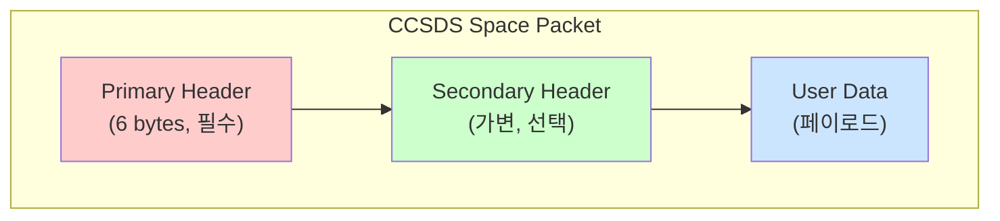
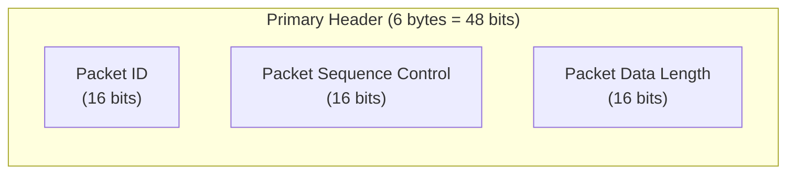
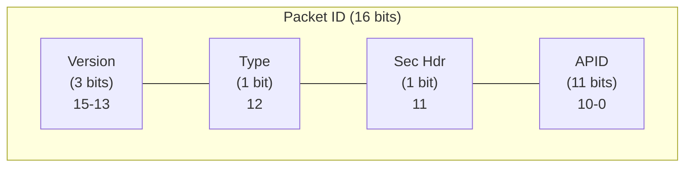
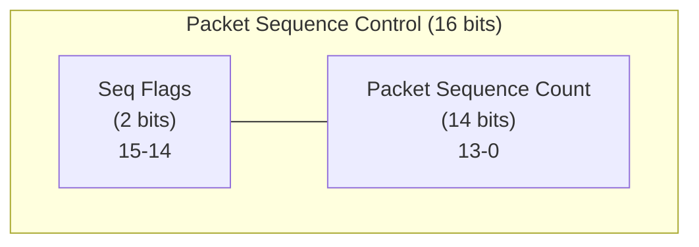
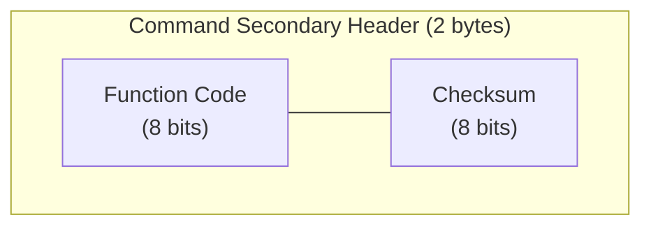
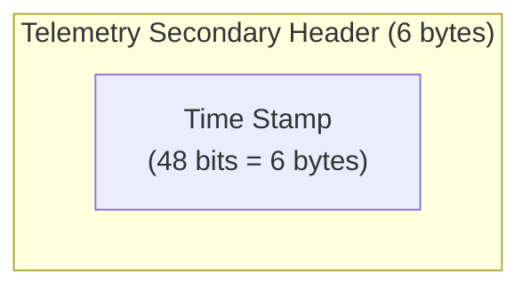
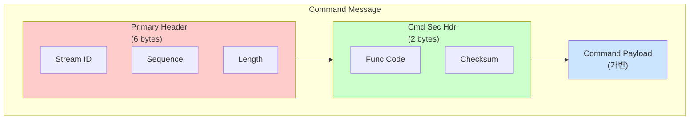
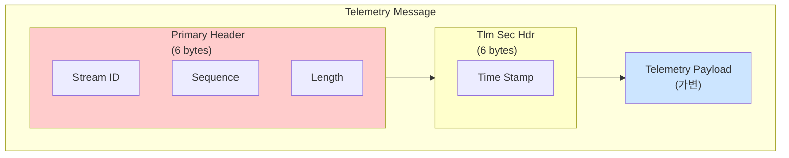
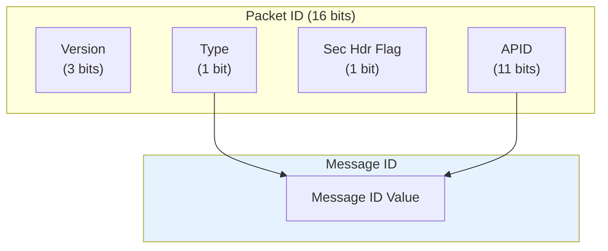
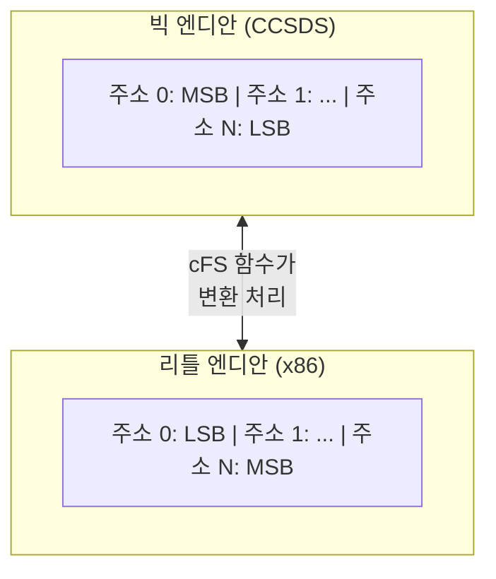

# Phase 2 SB-03: 메시지 구조 (1) - CCSDS 헤더

## 서론

cFS의 모든 메시지는 CCSDS(Consultative Committee for Space Data Systems) 표준을 따르는 헤더 구조를 갖는다. CCSDS는 국제적인 우주 데이터 시스템 표준화 기구로, 우주 통신에 사용되는 다양한 프로토콜과 데이터 형식을 정의한다. cFS가 CCSDS 표준을 채택한 것은 우연이 아니다. NASA 미션들은 대부분 CCSDS 호환 지상 시스템과 통신해야 하므로, 비행 소프트웨어 내부에서도 동일한 메시지 형식을 사용하면 지상과의 데이터 교환이 자연스럽게 통합된다.

본 문서에서는 cFS 메시지의 헤더 구조, 특히 CCSDS Primary Header와 Secondary Header의 세부 사항을 상세히 살펴본다.

---

## 1. CCSDS 표준 개요

### 1.1 CCSDS란 무엇인가

CCSDS(Consultative Committee for Space Data Systems)는 1982년에 설립된 국제 기구로, 우주 데이터 및 정보 시스템에 대한 표준을 개발하고 유지한다. NASA, ESA, JAXA 등 세계 주요 우주 기관들이 참여하고 있으며, 이 기구에서 정의한 표준은 전 세계 우주 미션에서 널리 사용된다.

CCSDS는 다양한 영역의 표준을 정의하지만, cFS에서 특히 관련 있는 것은 Space Packet Protocol이다. 이 프로토콜은 우주에서 데이터 패킷을 구성하고 전송하는 방법을 정의하며, cFS 메시지 헤더의 기반이 된다.

### 1.2 Space Packet Protocol

CCSDS Space Packet Protocol(SPP)은 우주 미션에서 데이터를 패킷화하는 표준 방법을 제공한다. 이 프로토콜의 핵심 요소는 Primary Header로, 모든 패킷에 반드시 포함되어야 한다. Secondary Header는 선택적이지만, cFS에서는 명령 메시지와 텔레메트리 메시지 모두에서 사용된다.



---

## 2. Primary Header 구조

### 2.1 Primary Header 개요

CCSDS Primary Header는 6바이트(48비트)로 구성되며, 세 개의 16비트 필드로 나뉜다. 이 헤더는 패킷의 가장 기본적인 정보를 담고 있으며, 패킷 식별, 시퀀스 관리, 데이터 길이 정보를 제공한다.



### 2.2 Packet ID 필드 (16 bits)

Packet ID는 패킷을 고유하게 식별하는 필드이다. 이 필드는 다시 세 개의 하위 필드로 나뉜다.

| 비트 범위 | 필드명 | 설명 |
|:---:|:---|:---|
| 15-13 | Version Number | CCSDS 버전 (현재 0) |
| 12 | Packet Type | 0=텔레메트리, 1=명령 |
| 11 | Secondary Header Flag | 1=Secondary Header 존재 |
| 10-0 | Application Process ID (APID) | 애플리케이션 식별자 |



**Version Number (비트 15-13)**: 현재 CCSDS 표준에서는 0으로 설정된다. 향후 프로토콜 변경 시 버전 구분에 사용될 수 있다.

**Packet Type (비트 12)**: 패킷이 텔레메트리인지 명령인지를 구분한다. 이 비트가 0이면 텔레메트리 패킷으로, 우주선에서 지상으로 전송되는 데이터를 나타낸다. 1이면 명령 패킷으로, 지상에서 우주선으로 전송되는 명령을 나타낸다.

**Secondary Header Flag (비트 11)**: Secondary Header의 존재 여부를 나타낸다. cFS에서는 거의 항상 1로 설정되어 Secondary Header가 포함된다.

**Application Process ID (비트 10-0)**: 11비트 필드로, 0부터 2047까지의 값을 가질 수 있다. 이 값은 메시지의 소유자 애플리케이션을 식별한다. cFS에서는 이 APID가 Message ID의 일부가 된다.

### 2.3 Packet Sequence Control 필드 (16 bits)

Packet Sequence Control 필드는 패킷의 순서와 분할 정보를 관리한다.

| 비트 범위 | 필드명 | 설명 |
|:---:|:---|:---|
| 15-14 | Sequence Flags | 분할 상태 표시 |
| 13-0 | Packet Sequence Count | 순차 카운터 |



**Sequence Flags (비트 15-14)**: 패킷이 더 큰 데이터의 일부인지, 독립적인 패킷인지를 나타낸다.

| 값 | 의미 |
|:---:|:---|
| 00 | 중간 세그먼트 (Continuation) |
| 01 | 첫 번째 세그먼트 (First) |
| 10 | 마지막 세그먼트 (Last) |
| 11 | 독립 패킷 (Unsegmented) |

cFS에서 대부분의 메시지는 독립 패킷(11)으로 설정된다.

**Packet Sequence Count (비트 13-0)**: 14비트 카운터로, 0부터 16383까지 순환한다. 이 카운터는 각 APID별로 독립적으로 유지되며, 패킷이 발송될 때마다 1씩 증가한다. 수신 측에서는 이 카운터를 확인하여 패킷 손실이나 중복을 감지할 수 있다.

### 2.4 Packet Data Length 필드 (16 bits)

Packet Data Length는 Primary Header 이후의 데이터 길이를 바이트 단위로 나타낸다. 중요한 점은 이 값이 "실제 데이터 길이 - 1"이라는 것이다. 즉, Secondary Header와 User Data를 합한 길이에서 1을 뺀 값이 저장된다.

```
Packet Data Length = (Secondary Header 크기 + User Data 크기) - 1
```

예를 들어, Secondary Header가 8바이트이고 User Data가 100바이트라면:
```
Packet Data Length = (8 + 100) - 1 = 107
```

이러한 인코딩 방식은 CCSDS 표준에서 정의된 것으로, 최소 1바이트의 데이터가 항상 존재함을 보장한다.

### 2.5 Primary Header C 구조체

cFS에서 Primary Header는 다음과 같은 구조체로 정의된다:

```c
/* CCSDS Primary Header 구조체 */
typedef struct
{
    uint8 StreamId[2];      /* Packet ID (16 bits) */
    uint8 Sequence[2];      /* Packet Sequence Control (16 bits) */
    uint8 Length[2];        /* Packet Data Length (16 bits) */
} CCSDS_PrimaryHeader_t;
```

각 필드가 `uint8[2]` 배열로 정의된 이유는 엔디안(Endian) 독립적인 접근을 위해서이다. 네트워크 바이트 순서(빅 엔디안)와 프로세서 바이트 순서가 다를 수 있으므로, 바이트 단위로 접근하여 올바른 변환을 수행한다.

---

## 3. Secondary Header 구조

### 3.1 Secondary Header의 역할

Secondary Header는 Primary Header만으로는 충분하지 않은 추가 정보를 제공한다. CCSDS 표준은 Secondary Header의 구체적인 형식을 정의하지 않으며, 각 미션에서 자유롭게 정의할 수 있다. cFS에서는 명령과 텔레메트리에 대해 각각 다른 Secondary Header 형식을 사용한다.

### 3.2 명령 메시지 Secondary Header

명령 메시지의 Secondary Header는 2바이트로 구성되며, Function Code와 Checksum을 포함한다.

```c
/* 명령 Secondary Header */
typedef struct
{
    uint8 FunctionCode;     /* 명령 함수 코드 */
    uint8 Checksum;         /* 체크섬 */
} CCSDS_CmdSecHdr_t;
```



**Function Code (8 bits)**: 동일한 Message ID 내에서 여러 명령을 구분하는 데 사용된다. 예를 들어, 하나의 앱이 NOOP(0), RESET_COUNTERS(1), ENABLE_HK(2) 등 여러 명령을 지원할 수 있으며, 각 명령은 고유한 Function Code로 식별된다.

**Checksum (8 bits)**: 명령 메시지의 무결성을 검증하는 데 사용된다. 체크섬은 전체 메시지(Primary Header + Secondary Header + Payload)의 XOR 합산 결과가 0xFF가 되도록 계산된다.

### 3.3 텔레메트리 메시지 Secondary Header

텔레메트리 메시지의 Secondary Header는 가변 길이이며(일반적으로 6바이트), 주로 타임스탬프 정보를 포함한다.

```c
/* 텔레메트리 Secondary Header */
typedef struct
{
    uint8 Time[6];          /* 48비트 타임스탬프 */
} CCSDS_TlmSecHdr_t;
```



타임스탬프 형식은 미션 구성에 따라 달라질 수 있다. cFS는 다양한 시간 형식을 지원하며, 가장 일반적인 형식은 초(seconds)와 부분초(subseconds)의 조합이다.

---

## 4. 메시지 전체 구조

### 4.1 명령 메시지 전체 구조

명령 메시지는 Primary Header, Command Secondary Header, 그리고 Command Payload로 구성된다.



cFS에서 명령 메시지 구조체의 예:

```c
/* 명령 헤더 정의 */
typedef struct
{
    CFE_MSG_Message_t Msg;              /* 기본 메시지 (Primary Header 포함) */
    CFE_MSG_CommandSecondaryHeader_t Sec; /* Command Secondary Header */
} CFE_MSG_CommandHeader_t;

/* 앱 특정 명령 메시지 정의 */
typedef struct
{
    CFE_MSG_CommandHeader_t CommandHeader;  /* 완전한 명령 헤더 */
    MY_APP_ResetCounters_Payload_t Payload; /* 명령 페이로드 */
} MY_APP_ResetCountersCmd_t;
```

### 4.2 텔레메트리 메시지 전체 구조

텔레메트리 메시지는 Primary Header, Telemetry Secondary Header, 그리고 Telemetry Payload로 구성된다.



cFS에서 텔레메트리 메시지 구조체의 예:

```c
/* 텔레메트리 헤더 정의 */
typedef struct
{
    CFE_MSG_Message_t Msg;                   /* 기본 메시지 (Primary Header 포함) */
    CFE_MSG_TelemetrySecondaryHeader_t Sec;  /* Telemetry Secondary Header */
} CFE_MSG_TelemetryHeader_t;

/* 앱 특정 텔레메트리 메시지 정의 */
typedef struct
{
    CFE_MSG_TelemetryHeader_t TelemetryHeader;  /* 완전한 텔레메트리 헤더 */
    MY_APP_HkTlm_Payload_t Payload;             /* 텔레메트리 페이로드 */
} MY_APP_HkTlm_t;
```

---

## 5. Message ID와 CCSDS 헤더의 관계

### 5.1 Message ID 구성

cFS에서 Message ID(MID)는 Primary Header의 Packet ID 필드에서 파생된다. 정확한 매핑은 미션 구성에 따라 다를 수 있지만, 일반적으로 Packet Type과 APID를 조합하여 Message ID를 형성한다.



### 5.2 Message ID 예시

```c
/* 일반적인 Message ID 할당 예시 */

/* 명령 메시지: Packet Type = 1 (명령), APID = 앱 식별자 */
#define MY_APP_CMD_MID      0x1880    /* 0001 1000 1000 0000 */
                                       /* Type=1, APID=0x080 */

/* 텔레메트리 메시지: Packet Type = 0 (텔레메트리), APID = 앱 식별자 */
#define MY_APP_HK_TLM_MID   0x0880    /* 0000 1000 1000 0000 */
                                       /* Type=0, APID=0x080 */
```

### 5.3 Message ID 접근 함수

cFS는 Message ID를 조작하기 위한 다양한 함수를 제공한다:

```c
/* Message ID 설정 */
void CFE_MSG_SetMsgId(CFE_MSG_Message_t *MsgPtr, CFE_SB_MsgId_t MsgId);

/* Message ID 조회 */
CFE_Status_t CFE_MSG_GetMsgId(const CFE_MSG_Message_t *MsgPtr, 
                               CFE_SB_MsgId_t *MsgId);

/* 숫자 값과 MsgId 간 변환 */
CFE_SB_MsgId_t CFE_SB_ValueToMsgId(CFE_SB_MsgId_Atom_t MsgIdValue);
CFE_SB_MsgId_Atom_t CFE_SB_MsgIdToValue(CFE_SB_MsgId_t MsgId);
```

---

## 6. 헤더 필드 접근

### 6.1 Primary Header 필드 접근

cFS는 Primary Header의 각 필드에 접근하기 위한 함수를 제공한다:

```c
/* APID 접근 */
CFE_Status_t CFE_MSG_GetApId(const CFE_MSG_Message_t *MsgPtr, 
                              CFE_MSG_ApId_t *ApId);
CFE_Status_t CFE_MSG_SetApId(CFE_MSG_Message_t *MsgPtr, 
                              CFE_MSG_ApId_t ApId);

/* Sequence Count 접근 */
CFE_Status_t CFE_MSG_GetSequenceCount(const CFE_MSG_Message_t *MsgPtr, 
                                       CFE_MSG_SequenceCount_t *SeqCnt);
CFE_Status_t CFE_MSG_SetSequenceCount(CFE_MSG_Message_t *MsgPtr, 
                                       CFE_MSG_SequenceCount_t SeqCnt);

/* 메시지 크기 접근 */
CFE_Status_t CFE_MSG_GetSize(const CFE_MSG_Message_t *MsgPtr, 
                              CFE_MSG_Size_t *Size);
CFE_Status_t CFE_MSG_SetSize(CFE_MSG_Message_t *MsgPtr, 
                              CFE_MSG_Size_t Size);

/* 패킷 타입 접근 */
CFE_Status_t CFE_MSG_GetType(const CFE_MSG_Message_t *MsgPtr, 
                              CFE_MSG_Type_t *Type);
CFE_Status_t CFE_MSG_SetType(CFE_MSG_Message_t *MsgPtr, 
                              CFE_MSG_Type_t Type);
```

### 6.2 Secondary Header 필드 접근

명령 메시지의 Secondary Header 필드:

```c
/* Function Code 접근 */
CFE_Status_t CFE_MSG_GetFcnCode(const CFE_MSG_Message_t *MsgPtr, 
                                 CFE_MSG_FcnCode_t *FcnCode);
CFE_Status_t CFE_MSG_SetFcnCode(CFE_MSG_Message_t *MsgPtr, 
                                 CFE_MSG_FcnCode_t FcnCode);

/* 체크섬 접근 및 검증 */
CFE_Status_t CFE_MSG_GenerateChecksum(CFE_MSG_Message_t *MsgPtr);
CFE_Status_t CFE_MSG_ValidateChecksum(const CFE_MSG_Message_t *MsgPtr, 
                                       bool *IsValid);
```

텔레메트리 메시지의 Secondary Header 필드:

```c
/* 타임스탬프 접근 */
CFE_Status_t CFE_MSG_GetMsgTime(const CFE_MSG_Message_t *MsgPtr, 
                                 CFE_TIME_SysTime_t *Time);
CFE_Status_t CFE_MSG_SetMsgTime(CFE_MSG_Message_t *MsgPtr, 
                                 CFE_TIME_SysTime_t Time);

/* SB에서 제공하는 편의 함수 */
void CFE_SB_TimeStampMsg(CFE_MSG_Message_t *MsgPtr);
```

---

## 7. 메시지 초기화

### 7.1 CFE_MSG_Init 함수

새 메시지를 생성할 때는 `CFE_MSG_Init()` 함수를 사용하여 헤더를 초기화한다. 이 함수는 Message ID, 크기, 그리고 기타 기본 필드를 설정한다.

```c
/**
 * @brief 메시지 헤더 초기화
 *
 * Primary Header와 Secondary Header를 초기화한다.
 *
 * @param MsgPtr  초기화할 메시지 버퍼
 * @param MsgId   설정할 Message ID
 * @param Size    전체 메시지 크기
 *
 * @return CFE_SUCCESS 성공
 */
CFE_Status_t CFE_MSG_Init(CFE_MSG_Message_t *MsgPtr,
                           CFE_SB_MsgId_t MsgId,
                           CFE_MSG_Size_t Size);
```

### 7.2 초기화 예시

```c
/* 명령 메시지 초기화 */
MY_APP_NoopCmd_t NoopCmd;
CFE_MSG_Init(&NoopCmd.CommandHeader.Msg,
             CFE_SB_ValueToMsgId(MY_APP_CMD_MID),
             sizeof(NoopCmd));
CFE_MSG_SetFcnCode(&NoopCmd.CommandHeader.Msg, MY_APP_NOOP_CC);
CFE_MSG_GenerateChecksum(&NoopCmd.CommandHeader.Msg);

/* 텔레메트리 메시지 초기화 */
MY_APP_HkTlm_t HkTlm;
CFE_MSG_Init(&HkTlm.TelemetryHeader.Msg,
             CFE_SB_ValueToMsgId(MY_APP_HK_TLM_MID),
             sizeof(HkTlm));
CFE_SB_TimeStampMsg(&HkTlm.TelemetryHeader.Msg);
```

---

## 8. 바이트 순서 (Endianness) 처리

### 8.1 네트워크 바이트 순서

CCSDS 표준은 빅 엔디안(Big Endian) 바이트 순서를 사용한다. 이는 "네트워크 바이트 순서"라고도 불리며, 가장 중요한 바이트(MSB)가 먼저 전송된다, 그러나 많은 프로세서(특히 Intel 계열)는 리틀 엔디안(Little Endian)을 사용하므로, cFS 메시지 함수들은 내부적으로 필요한 바이트 순서 변환을 수행한다.



### 8.2 개발자 관점

개발자는 cFS에서 제공하는 메시지 접근 함수를 사용하면 바이트 순서에 대해 걱정할 필요가 없다. 이 함수들이 자동으로 올바른 변환을 수행한다. 그러나 메시지 버퍼에 직접 접근하는 경우(권장되지 않음), 바이트 순서를 수동으로 처리해야 할 수 있다.

```c
/* 권장: 함수를 통한 접근 (자동 바이트 순서 처리) */
CFE_MSG_Size_t Size;
CFE_MSG_GetSize(&MsgPtr->Msg, &Size);

/* 비권장: 직접 접근 (수동 바이트 순서 처리 필요) */
/* 이 방법은 이식성이 없으며 피해야 함 */
```

---

## 결론

CCSDS 메시지 헤더는 cFS 통신의 기초를 형성한다. Primary Header는 패킷 식별, 시퀀스 관리, 길이 정보를 제공하고, Secondary Header는 메시지 유형에 따른 추가 정보(명령의 Function Code/Checksum 또는 텔레메트리의 타임스탬프)를 제공한다.

핵심 개념을 정리하면 다음과 같다:
- **Primary Header (6 bytes)**: Packet ID, Sequence Control, Data Length
- **Command Secondary Header (2 bytes)**: Function Code, Checksum
- **Telemetry Secondary Header (6 bytes)**: Timestamp
- **Message ID**: Primary Header의 Packet ID에서 파생
- **바이트 순서**: cFS 함수가 자동으로 처리

다음 문서에서는 명령 메시지와 텔레메트리 메시지의 구체적인 사용 패턴을 살펴볼 것이다.

---

## 참고 문헌

1. CCSDS, "Space Packet Protocol", CCSDS 133.0-B-1
2. NASA, "cFE Application Developer's Guide"
3. NASA, "cFS Message Module Documentation"
4. NASA cFE GitHub, cfe/modules/msg/

---

[이전 문서: Phase 2 SB-02: Publish/Subscribe 패턴의 이해](./Phase2_SB_02_Publish_Subscribe_패턴.md)

[다음 문서: Phase 2 SB-04: 메시지 구조 (2) - 명령과 텔레메트리](./Phase2_SB_04_명령과_텔레메트리.md)
