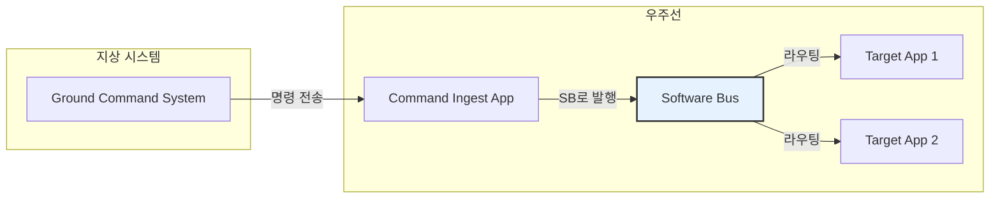
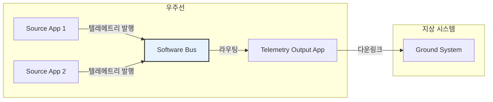
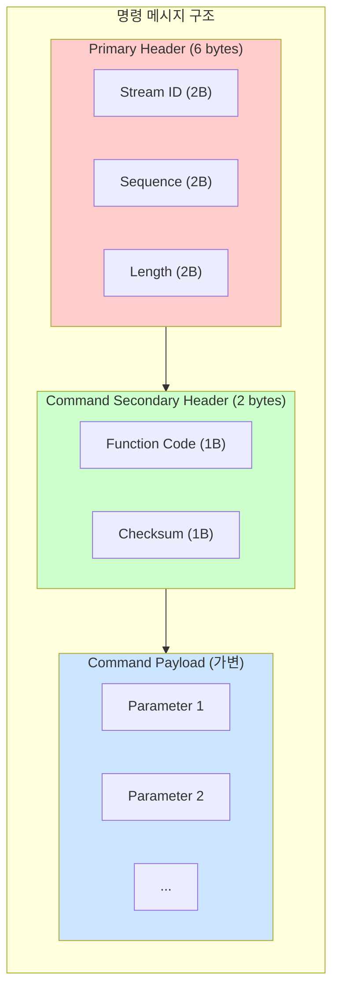
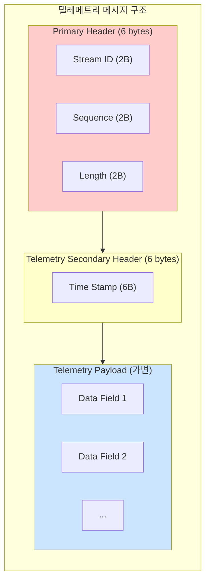
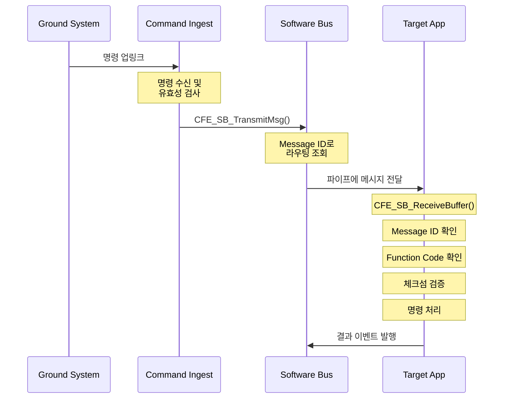
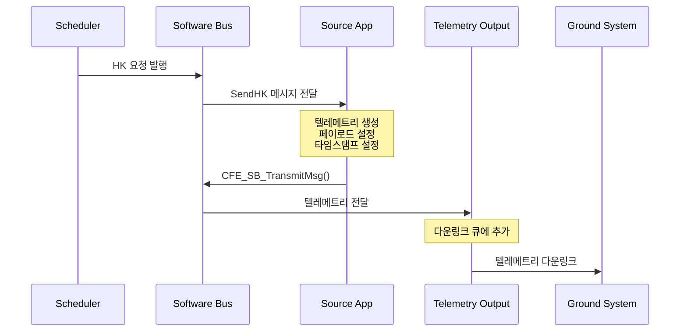

# Phase 2 SB-04: 메시지 구조 (2) - 명령과 텔레메트리

## 서론

cFS에서 모든 메시지는 크게 두 가지 유형으로 분류된다: 명령(Command)과 텔레메트리(Telemetry). 이 두 유형은 우주 비행 소프트웨어의 근본적인 통신 패러다임을 반영한다. 명령은 지상에서 우주선으로, 또는 시스템 내 한 애플리케이션에서 다른 애플리케이션으로 전달되는 지시사항이다. 텔레메트리는 우주선에서 지상으로, 또는 애플리케이션이 다른 애플리케이션에게 전달하는 상태 정보와 데이터이다.

이전 문서에서 CCSDS 헤더의 기본 구조를 살펴보았다. 본 문서에서는 명령 메시지와 텔레메트리 메시지의 구체적인 구조, 정의 방법, 그리고 실제 사용 패턴을 상세히 다룬다.

---

## 1. 명령과 텔레메트리의 개념

### 1.1 명령 메시지 (Command Message)

명령 메시지는 수신자에게 특정 동작을 수행하도록 지시하는 메시지이다. 우주 비행 소프트웨어에서 명령은 주로 지상 관제 시스템에서 발원하여 우주선에 전달되지만, cFS 아키텍처 내에서는 애플리케이션 간에도 명령이 교환될 수 있다.

명령 메시지의 특징은 다음과 같다. 첫째, 명령은 수신자의 상태나 동작을 변경하는 것을 목적으로 한다. 둘째, 각 명령은 고유한 Function Code를 가지며, 이를 통해 하나의 Message ID 내에서 여러 명령을 구분한다. 셋째, 명령 메시지에는 무결성 검증을 위한 체크섬이 포함된다.



### 1.2 텔레메트리 메시지 (Telemetry Message)

텔레메트리 메시지는 상태 정보, 측정 데이터, 이벤트 보고 등을 전달하는 메시지이다. 텔레메트리는 우주선의 "목소리"라고 할 수 있으며, 지상 운영팀이 우주선의 상태를 파악하고 적절한 결정을 내리는 데 필수적인 정보를 제공한다.

텔레메트리 메시지의 특징은 다음과 같다. 첫째, 텔레메트리는 정보를 전달하는 것이 목적이며 수신자의 상태를 변경하지 않는다. 둘째, 텔레메트리에는 타임스탬프가 포함되어 데이터가 생성된 시점을 기록한다. 셋째, 동일한 텔레메트리가 여러 수신자에게 동시에 전달될 수 있다.



### 1.3 Message ID를 통한 구분

cFS에서 명령과 텔레메트리는 Message ID의 특정 비트를 통해 구분된다. CCSDS Primary Header의 Packet Type 필드(비트 12)가 이 역할을 담당한다.

| Packet Type | 값 | 의미 | Message ID 범위 (예시) |
|:---|:---:|:---|:---|
| 텔레메트리 | 0 | 상태/데이터 보고 | 0x0800 - 0x0FFF |
| 명령 | 1 | 동작 지시 | 0x1800 - 0x1FFF |

이러한 구분 방식을 통해 SB는 메시지 유형을 신속하게 식별할 수 있으며, 메시지 처리 로직도 유형에 따라 분기할 수 있다.

---

## 2. 명령 메시지 상세

### 2.1 명령 메시지 구조

명령 메시지는 Primary Header, Command Secondary Header, 그리고 Command Payload의 세 부분으로 구성된다. Primary Header는 이전 문서에서 설명한 6바이트의 CCSDS 표준 헤더이다. Command Secondary Header는 2바이트로, Function Code와 Checksum을 포함한다. Command Payload는 명령의 구체적인 파라미터를 담는 가변 길이 영역이다.



### 2.2 Function Code의 역할

Function Code는 8비트 필드로, 0부터 255까지의 값을 가질 수 있다. 이 코드는 동일한 Message ID로 전달되는 여러 명령을 구분하는 데 사용된다. 각 애플리케이션은 자신만의 Function Code 체계를 정의하며, 일반적으로 다음과 같은 표준 코드들이 사용된다.

```c
/* 표준 Function Code 정의 예시 */
#define MY_APP_NOOP_CC              0   /* No Operation - 연결 테스트 */
#define MY_APP_RESET_COUNTERS_CC    1   /* 카운터 리셋 */
#define MY_APP_SET_MODE_CC          2   /* 동작 모드 설정 */
#define MY_APP_ENABLE_FUNC_CC       3   /* 기능 활성화 */
#define MY_APP_DISABLE_FUNC_CC      4   /* 기능 비활성화 */
#define MY_APP_LOAD_TABLE_CC        5   /* 테이블 로드 */
```

Function Code를 사용함으로써 각 애플리케이션은 하나의 Message ID만으로 다수의 명령을 효율적으로 관리할 수 있다. 이는 Message ID 공간의 효율적인 활용을 가능하게 한다.

### 2.3 체크섬(Checksum)

명령 메시지의 체크섬은 메시지 무결성을 검증하는 데 사용된다. 체크섬 계산 방식은 다음과 같다: 메시지의 모든 바이트를 XOR 연산한 결과가 0xFF가 되도록 체크섬 값을 설정한다.

```c
/* 체크섬 생성 */
CFE_MSG_GenerateChecksum(&CmdMsg.CommandHeader.Msg);

/* 체크섬 검증 */
bool IsValid;
CFE_MSG_ValidateChecksum(&CmdMsg.CommandHeader.Msg, &IsValid);
if (IsValid)
{
    /* 체크섬 유효 - 명령 처리 */
    ProcessCommand(&CmdMsg);
}
else
{
    /* 체크섬 오류 - 명령 거부 */
    CFE_EVS_SendEvent(CMD_CHECKSUM_ERR_EID, CFE_EVS_EventType_ERROR,
                      "Command checksum validation failed");
}
```

### 2.4 명령 메시지 정의 예시

애플리케이션에서 명령 메시지를 정의하는 전형적인 패턴은 다음과 같다. 먼저 메시지 구조체를 정의하고, 해당 구조체에 헤더와 페이로드를 포함시킨다.

```c
/*
 * 명령 메시지 정의 헤더 파일 (my_app_msg.h)
 */

#include "cfe_msg.h"
#include "my_app_platform_cfg.h"

/* No-Op 명령 - 페이로드 없음 */
typedef struct
{
    CFE_MSG_CommandHeader_t CommandHeader;
    /* 페이로드 없음 */
} MY_APP_NoopCmd_t;

/* 카운터 리셋 명령 - 페이로드 없음 */
typedef struct
{
    CFE_MSG_CommandHeader_t CommandHeader;
    /* 페이로드 없음 */
} MY_APP_ResetCountersCmd_t;

/* 모드 설정 명령 - 페이로드 있음 */
typedef struct
{
    uint8 NewMode;      /* 새로운 동작 모드 */
    uint8 Spare[3];     /* 정렬을 위한 패딩 */
} MY_APP_SetMode_Payload_t;

typedef struct
{
    CFE_MSG_CommandHeader_t CommandHeader;
    MY_APP_SetMode_Payload_t Payload;
} MY_APP_SetModeCmd_t;

/* 파라미터 설정 명령 - 복잡한 페이로드 */
typedef struct
{
    float Gain;         /* 제어 게인 값 */
    float Offset;       /* 오프셋 값 */
    uint32 UpdateRate;  /* 업데이트 주기 (ms) */
    uint8 EnableFlag;   /* 기능 활성화 플래그 */
    uint8 Spare[3];     /* 정렬을 위한 패딩 */
} MY_APP_SetParams_Payload_t;

typedef struct
{
    CFE_MSG_CommandHeader_t CommandHeader;
    MY_APP_SetParams_Payload_t Payload;
} MY_APP_SetParamsCmd_t;
```

---

## 3. 텔레메트리 메시지 상세

### 3.1 텔레메트리 메시지 구조

텔레메트리 메시지는 Primary Header, Telemetry Secondary Header, 그리고 Telemetry Payload로 구성된다. Primary Header는 명령 메시지와 동일한 6바이트 CCSDS 표준 헤더이다. 단, Packet Type 비트가 0으로 설정되어 텔레메트리임을 나타낸다. Telemetry Secondary Header는 일반적으로 6바이트의 타임스탬프를 포함한다. Telemetry Payload는 보고할 데이터를 담는 가변 길이 영역이다.



### 3.2 타임스탬프의 중요성

텔레메트리 메시지에 타임스탬프가 포함되는 것은 우주 미션에서 매우 중요한 의미를 갖는다. 지상으로 전송된 데이터가 언제 생성되었는지 알아야 정확한 분석이 가능하기 때문이다. 특히 통신 지연이 수 분에서 수십 분에 달하는 심우주 미션에서는 타임스탬프 없이는 데이터의 시간적 맥락을 파악할 수 없다.

cFS에서 타임스탬프는 `CFE_SB_TimeStampMsg()` 함수를 통해 자동으로 설정할 수 있다. 이 함수는 현재 우주선 시간을 조회하여 메시지 헤더에 기록한다.

```c
/* 텔레메트리 메시지에 타임스탬프 설정 */
MY_APP_HkTlm_t HkTlm;

/* 헤더 초기화 */
CFE_MSG_Init(&HkTlm.TelemetryHeader.Msg,
             CFE_SB_ValueToMsgId(MY_APP_HK_TLM_MID),
             sizeof(HkTlm));

/* 타임스탬프 설정 - 현재 시간 사용 */
CFE_SB_TimeStampMsg(&HkTlm.TelemetryHeader.Msg);

/* 또는 특정 시간을 직접 설정 */
CFE_TIME_SysTime_t SpecificTime;
SpecificTime.Seconds = 1234567890;
SpecificTime.Subseconds = 0;
CFE_MSG_SetMsgTime(&HkTlm.TelemetryHeader.Msg, SpecificTime);
```

### 3.3 Housekeeping 텔레메트리

Housekeeping(HK) 텔레메트리는 cFS 애플리케이션에서 가장 일반적인 텔레메트리 유형이다. HK 텔레메트리는 애플리케이션의 현재 상태, 통계 정보, 카운터 값 등을 주기적으로 보고한다. 지상 운영팀은 HK 텔레메트리를 통해 각 애플리케이션이 정상적으로 동작하는지 모니터링할 수 있다.

```c
/* Housekeeping 텔레메트리 페이로드 정의 */
typedef struct
{
    /* 명령 카운터 */
    uint16 CommandCounter;      /* 수신한 유효 명령 수 */
    uint16 CommandErrorCounter; /* 수신한 무효 명령 수 */
    
    /* 애플리케이션 상태 */
    uint8 AppState;             /* 현재 동작 상태 */
    uint8 LastCmdCode;          /* 마지막 처리한 명령 코드 */
    uint8 Spare[2];             /* 정렬용 패딩 */
    
    /* 동작 통계 */
    uint32 ProcessedMessages;    /* 처리한 메시지 수 */
    uint32 ErrorCount;           /* 오류 발생 횟수 */
    
} MY_APP_HkTlm_Payload_t;

/* 완전한 HK 텔레메트리 메시지 */
typedef struct
{
    CFE_MSG_TelemetryHeader_t TelemetryHeader;
    MY_APP_HkTlm_Payload_t    Payload;
} MY_APP_HkTlm_t;
```

### 3.4 텔레메트리 메시지 정의 예시

다양한 텔레메트리 메시지를 정의하는 패턴을 살펴보자.

```c
/*
 * 텔레메트리 메시지 정의 헤더 파일 (my_app_msg.h)
 */

#include "cfe_msg.h"

/* Housekeeping 텔레메트리 */
typedef struct
{
    /* 표준 HK 정보 */
    uint16 CmdCounter;
    uint16 CmdErrCounter;
    
    /* 앱 특정 상태 */
    uint8  CurrentMode;
    uint8  EnabledFlags;
    uint16 Spare;
    
    uint32 DataProcessedCount;
    uint32 LastUpdateTime;
    
} MY_APP_HkTlm_Payload_t;

typedef struct
{
    CFE_MSG_TelemetryHeader_t TelemetryHeader;
    MY_APP_HkTlm_Payload_t    Payload;
} MY_APP_HkTlm_t;

/* 데이터 텔레메트리 - 센서 데이터 예시 */
typedef struct
{
    float Temperature;        /* 온도 (섭씨) */
    float Pressure;           /* 압력 (hPa) */
    float Humidity;           /* 습도 (%) */
    uint32 SampleTimestamp;   /* 샘플링 시간 */
    uint16 SensorStatus;      /* 센서 상태 플래그 */
    uint16 SampleCount;       /* 샘플 번호 */
    
} MY_APP_SensorData_Payload_t;

typedef struct
{
    CFE_MSG_TelemetryHeader_t TelemetryHeader;
    MY_APP_SensorData_Payload_t Payload;
} MY_APP_SensorDataTlm_t;

/* 진단 텔레메트리 - 상세 디버그 정보 */
typedef struct
{
    uint32 MemoryUsage;       /* 메모리 사용량 */
    uint32 CpuUsage;          /* CPU 사용률 */
    uint32 PipeDepth;         /* 파이프 현재 깊이 */
    uint32 MaxPipeDepth;      /* 파이프 최대 깊이 */
    
    uint32 InternalErrors[8]; /* 내부 오류 카운터 배열 */
    
} MY_APP_DiagTlm_Payload_t;

typedef struct
{
    CFE_MSG_TelemetryHeader_t TelemetryHeader;
    MY_APP_DiagTlm_Payload_t Payload;
} MY_APP_DiagTlm_t;
```

---

## 4. 명령 처리 패턴

### 4.1 명령 수신 및 분기

애플리케이션에서 명령을 처리하는 전형적인 패턴은 다음과 같다. 먼저 Message ID를 확인하여 명령 메시지인지 확인하고, Function Code에 따라 적절한 핸들러를 호출한다.

```c
void MY_APP_ProcessCommandMsg(const CFE_SB_Buffer_t *BufPtr)
{
    CFE_MSG_FcnCode_t FunctionCode;
    CFE_MSG_Size_t    MsgSize;
    
    /* Function Code 추출 */
    CFE_MSG_GetFcnCode(&BufPtr->Msg, &FunctionCode);
    CFE_MSG_GetSize(&BufPtr->Msg, &MsgSize);
    
    switch (FunctionCode)
    {
        case MY_APP_NOOP_CC:
            MY_APP_NoopCmd((const MY_APP_NoopCmd_t *)BufPtr);
            break;
            
        case MY_APP_RESET_COUNTERS_CC:
            MY_APP_ResetCountersCmd((const MY_APP_ResetCountersCmd_t *)BufPtr);
            break;
            
        case MY_APP_SET_MODE_CC:
            if (MY_APP_VerifyCmdLength(MsgSize, sizeof(MY_APP_SetModeCmd_t)))
            {
                MY_APP_SetModeCmd((const MY_APP_SetModeCmd_t *)BufPtr);
            }
            break;
            
        case MY_APP_SET_PARAMS_CC:
            if (MY_APP_VerifyCmdLength(MsgSize, sizeof(MY_APP_SetParamsCmd_t)))
            {
                MY_APP_SetParamsCmd((const MY_APP_SetParamsCmd_t *)BufPtr);
            }
            break;
            
        default:
            MY_APP_Data.CmdErrCounter++;
            CFE_EVS_SendEvent(MY_APP_CC_ERR_EID, CFE_EVS_EventType_ERROR,
                              "Invalid command code: CC=%u", 
                              (unsigned int)FunctionCode);
            break;
    }
}
```

### 4.2 명령 길이 검증

명령을 처리하기 전에 메시지 길이가 예상과 일치하는지 검증하는 것이 중요하다. 잘못된 길이의 메시지는 버퍼 오버플로우나 잘못된 데이터 해석으로 이어질 수 있다.

```c
bool MY_APP_VerifyCmdLength(CFE_MSG_Size_t ActualLength, size_t ExpectedLength)
{
    if (ActualLength != ExpectedLength)
    {
        MY_APP_Data.CmdErrCounter++;
        CFE_EVS_SendEvent(MY_APP_LEN_ERR_EID, CFE_EVS_EventType_ERROR,
                          "Invalid msg length: expected=%u, actual=%u",
                          (unsigned int)ExpectedLength,
                          (unsigned int)ActualLength);
        return false;
    }
    return true;
}
```

### 4.3 개별 명령 핸들러 구현

각 명령에 대한 핸들러는 해당 명령의 비즈니스 로직을 구현한다.

```c
/* NOOP 명령 핸들러 */
void MY_APP_NoopCmd(const MY_APP_NoopCmd_t *CmdPtr)
{
    MY_APP_Data.CmdCounter++;
    CFE_EVS_SendEvent(MY_APP_NOOP_INF_EID, CFE_EVS_EventType_INFORMATION,
                      "NOOP command received, Version %d.%d.%d",
                      MY_APP_MAJOR_VERSION, MY_APP_MINOR_VERSION, 
                      MY_APP_REVISION);
}

/* 카운터 리셋 명령 핸들러 */
void MY_APP_ResetCountersCmd(const MY_APP_ResetCountersCmd_t *CmdPtr)
{
    MY_APP_Data.CmdCounter = 0;
    MY_APP_Data.CmdErrCounter = 0;
    MY_APP_Data.ProcessedMessages = 0;
    
    CFE_EVS_SendEvent(MY_APP_RESET_INF_EID, CFE_EVS_EventType_INFORMATION,
                      "Counters reset");
}

/* 모드 설정 명령 핸들러 */
void MY_APP_SetModeCmd(const MY_APP_SetModeCmd_t *CmdPtr)
{
    /* 파라미터 유효성 검사 */
    if (CmdPtr->Payload.NewMode > MY_APP_MAX_MODE)
    {
        MY_APP_Data.CmdErrCounter++;
        CFE_EVS_SendEvent(MY_APP_MODE_ERR_EID, CFE_EVS_EventType_ERROR,
                          "Invalid mode: %u", 
                          (unsigned int)CmdPtr->Payload.NewMode);
        return;
    }
    
    /* 모드 변경 */
    MY_APP_Data.CurrentMode = CmdPtr->Payload.NewMode;
    MY_APP_Data.CmdCounter++;
    
    CFE_EVS_SendEvent(MY_APP_MODE_INF_EID, CFE_EVS_EventType_INFORMATION,
                      "Mode changed to %u", 
                      (unsigned int)MY_APP_Data.CurrentMode);
}
```

---

## 5. 텔레메트리 생성 패턴

### 5.1 Housekeeping 텔레메트리 생성

HK 텔레메트리는 일반적으로 스케줄러로부터 HK 요청 메시지를 수신했을 때 생성된다. 이 패턴을 통해 모든 애플리케이션이 동기화된 시점에 HK를 보고하게 된다.

```c
void MY_APP_SendHkTlm(void)
{
    MY_APP_HkTlm_t *HkMsgPtr;
    
    /* SB에서 메시지 버퍼 할당 */
    HkMsgPtr = (MY_APP_HkTlm_t *)CFE_SB_AllocateMessageBuffer(sizeof(*HkMsgPtr));
    
    if (HkMsgPtr != NULL)
    {
        /* 헤더 초기화 */
        CFE_MSG_Init(&HkMsgPtr->TelemetryHeader.Msg,
                     CFE_SB_ValueToMsgId(MY_APP_HK_TLM_MID),
                     sizeof(*HkMsgPtr));
        
        /* 타임스탬프 설정 */
        CFE_SB_TimeStampMsg(&HkMsgPtr->TelemetryHeader.Msg);
        
        /* 페이로드 채우기 */
        HkMsgPtr->Payload.CmdCounter = MY_APP_Data.CmdCounter;
        HkMsgPtr->Payload.CmdErrCounter = MY_APP_Data.CmdErrCounter;
        HkMsgPtr->Payload.CurrentMode = MY_APP_Data.CurrentMode;
        HkMsgPtr->Payload.EnabledFlags = MY_APP_Data.EnabledFlags;
        HkMsgPtr->Payload.DataProcessedCount = MY_APP_Data.ProcessedMessages;
        HkMsgPtr->Payload.LastUpdateTime = MY_APP_Data.LastUpdateTime;
        
        /* 메시지 전송 */
        CFE_SB_TransmitMsg(&HkMsgPtr->TelemetryHeader.Msg, true);
    }
}
```

### 5.2 데이터 텔레메트리 생성

데이터 텔레메트리는 특정 이벤트가 발생하거나 주기적으로 데이터를 수집할 때 생성된다.

```c
void MY_APP_SendSensorData(void)
{
    MY_APP_SensorDataTlm_t *SensorMsgPtr;
    
    /* 버퍼 할당 */
    SensorMsgPtr = (MY_APP_SensorDataTlm_t *)
                   CFE_SB_AllocateMessageBuffer(sizeof(*SensorMsgPtr));
    
    if (SensorMsgPtr != NULL)
    {
        /* 헤더 초기화 */
        CFE_MSG_Init(&SensorMsgPtr->TelemetryHeader.Msg,
                     CFE_SB_ValueToMsgId(MY_APP_SENSOR_DATA_MID),
                     sizeof(*SensorMsgPtr));
        
        /* 타임스탬프 */
        CFE_SB_TimeStampMsg(&SensorMsgPtr->TelemetryHeader.Msg);
        
        /* 센서 데이터 읽기 및 페이로드 설정 */
        SensorMsgPtr->Payload.Temperature = ReadTemperatureSensor();
        SensorMsgPtr->Payload.Pressure = ReadPressureSensor();
        SensorMsgPtr->Payload.Humidity = ReadHumiditySensor();
        SensorMsgPtr->Payload.SampleTimestamp = GetCurrentTime();
        SensorMsgPtr->Payload.SensorStatus = GetSensorStatus();
        SensorMsgPtr->Payload.SampleCount = MY_APP_Data.SampleCounter++;
        
        /* 전송 */
        CFE_SB_TransmitMsg(&SensorMsgPtr->TelemetryHeader.Msg, true);
    }
}
```

### 5.3 정적 버퍼 사용 패턴

일부 경우에는 동적 버퍼 할당 대신 정적 버퍼를 사용하는 것이 더 적합할 수 있다. 이 패턴은 메모리 할당 실패 가능성을 제거한다.

```c
/* 정적 텔레메트리 버퍼 */
static MY_APP_HkTlm_t MY_APP_HkBuffer;

void MY_APP_Init(void)
{
    /* 초기화 시 헤더 설정 */
    CFE_MSG_Init(&MY_APP_HkBuffer.TelemetryHeader.Msg,
                 CFE_SB_ValueToMsgId(MY_APP_HK_TLM_MID),
                 sizeof(MY_APP_HkBuffer));
}

void MY_APP_SendHkTlm_Static(void)
{
    /* 타임스탬프 업데이트 */
    CFE_SB_TimeStampMsg(&MY_APP_HkBuffer.TelemetryHeader.Msg);
    
    /* 페이로드 업데이트 */
    MY_APP_HkBuffer.Payload.CmdCounter = MY_APP_Data.CmdCounter;
    MY_APP_HkBuffer.Payload.CmdErrCounter = MY_APP_Data.CmdErrCounter;
    /* ... 기타 필드 ... */
    
    /* 전송 (버퍼 소유권 이전 없음) */
    CFE_SB_TransmitMsg(&MY_APP_HkBuffer.TelemetryHeader.Msg, false);
}
```

---

## 6. 메시지 전체 플로우

### 6.1 명령 메시지 플로우

명령이 지상에서 발원하여 대상 애플리케이션에서 처리되기까지의 전체 흐름을 살펴보자.



### 6.2 텔레메트리 메시지 플로우

텔레메트리가 애플리케이션에서 생성되어 지상으로 전송되기까지의 흐름이다.



---

## 7. 메시지 정렬과 패딩

### 7.1 구조체 정렬의 중요성

메시지 페이로드를 정의할 때 구조체 멤버의 정렬(alignment)을 고려해야 한다. 프로세서에 따라 특정 데이터 타입은 특정 바이트 경계에 정렬되어야 효율적으로 접근할 수 있다. 잘못된 정렬은 성능 저하나 런타임 오류를 유발할 수 있다.

```c
/* 잘못된 정렬 예시 (비권장) */
typedef struct
{
    uint8 Flag;        /* 1 byte */
    uint32 Counter;    /* 4 bytes - 4바이트 정렬 필요! */
    uint8 Status;      /* 1 byte */
} BAD_Payload_t;
/* 컴파일러가 자동으로 패딩을 추가할 수 있음 */
/* 결과 크기가 플랫폼마다 다를 수 있음 */

/* 올바른 정렬 예시 (권장) */
typedef struct
{
    uint32 Counter;    /* 4 bytes - 첫 번째에 배치 */
    uint8 Flag;        /* 1 byte */
    uint8 Status;      /* 1 byte */
    uint8 Spare[2];    /* 명시적 패딩 */
} GOOD_Payload_t;
/* 크기가 명확하고 일관됨 */
```

### 7.2 패딩 규칙

cFS 메시지 구조체를 정의할 때 다음 규칙을 따르는 것이 좋다:

1. **큰 타입부터 배치**: uint32, float부터 배치하고 uint8은 마지막에 배치한다.
2. **명시적 패딩 사용**: 컴파일러에 의존하지 않고 Spare 필드로 명시적으로 패딩을 추가한다.
3. **4바이트 정렬 유지**: 전체 구조체 크기가 4의 배수가 되도록 한다.
4. **8바이트 정렬 고려**: double이나 64비트 타입 사용 시 8바이트 정렬을 고려한다.

```c
/* 패딩 예시 */
typedef struct
{
    /* 4바이트 정렬 필드들 */
    uint32 MessageCount;    /* 4 bytes */
    float Temperature;      /* 4 bytes */
    
    /* 2바이트 필드들 */
    uint16 Status;          /* 2 bytes */
    uint16 ErrorCode;       /* 2 bytes */
    
    /* 1바이트 필드들 */
    uint8 Mode;             /* 1 byte */
    uint8 Flags;            /* 1 byte */
    uint8 Spare[2];         /* 2 bytes - 4바이트 정렬 맞춤 */
    
} ALIGNED_Payload_t;        /* 총 20 bytes, 4의 배수 */
```

---

## 8. Message ID 관리

### 8.1 Message ID 할당 전략

미션 전체에서 Message ID가 충돌하지 않도록 체계적인 할당 전략이 필요하다. 일반적으로 다음과 같은 방식을 사용한다.

```c
/*
 * Message ID 할당 체계 예시
 *
 * 명령 MID: 0x18xx (Packet Type = 1)
 * 텔레메트리 MID: 0x08xx (Packet Type = 0)
 *
 * 앱별 APID 할당:
 *   - cFE 서비스: 0x00 - 0x0F
 *   - 표준 앱: 0x10 - 0x7F
 *   - 미션 앱: 0x80 - 0xFF
 */

/* cFE 서비스 */
#define CFE_ES_CMD_MID          0x1806
#define CFE_ES_HK_TLM_MID       0x0806

/* 표준 앱 */
#define SCH_CMD_MID             0x1820
#define SCH_HK_TLM_MID          0x0820

/* 미션 앱 */
#define MY_APP_CMD_MID          0x1880
#define MY_APP_HK_TLM_MID       0x0880
#define MY_APP_DATA_TLM_MID     0x0881
```

### 8.2 Message ID 정의 파일

Message ID는 별도의 헤더 파일에 중앙 집중식으로 정의하는 것이 좋다.

```c
/*
 * my_app_msgids.h - Message ID 정의
 */
#ifndef MY_APP_MSGIDS_H
#define MY_APP_MSGIDS_H

/* 명령 Message ID */
#define MY_APP_CMD_MID          0x1880  /* 앱 명령 */
#define MY_APP_SEND_HK_MID      0x1881  /* HK 요청 (스케줄러로부터) */

/* 텔레메트리 Message ID */
#define MY_APP_HK_TLM_MID       0x0880  /* Housekeeping 텔레메트리 */
#define MY_APP_SENSOR_TLM_MID   0x0881  /* 센서 데이터 텔레메트리 */
#define MY_APP_DIAG_TLM_MID     0x0882  /* 진단 텔레메트리 */

#endif /* MY_APP_MSGIDS_H */
```

---

## 결론

명령과 텔레메트리는 cFS 통신의 두 축을 형성한다. 명령은 동작을 지시하고, 텔레메트리는 상태를 보고한다. 이 두 메시지 유형은 CCSDS 표준을 기반으로 하면서도 각각의 목적에 맞는 Secondary Header를 갖는다.

핵심 개념을 정리하면 다음과 같다:
- **명령 메시지**: Function Code로 여러 명령 구분, 체크섬으로 무결성 검증
- **텔레메트리 메시지**: 타임스탬프로 시간 기록, HK 텔레메트리가 가장 일반적
- **메시지 정의**: 구조체로 헤더와 페이로드 정의, 정렬과 패딩 고려
- **Message ID 관리**: 체계적인 할당으로 충돌 방지

다음 문서에서는 Message ID와 라우팅 테이블의 구체적인 동작 원리를 살펴볼 것이다.

---

## 참고 문헌

1. NASA, "cFE Application Developer's Guide"
2. NASA, "Software Bus User's Guide"  
3. NASA, "cFS Message Module Documentation"
4. CCSDS, "Space Packet Protocol", CCSDS 133.0-B-1
5. NASA cFE GitHub, cfe/modules/msg/

---

[이전 문서: Phase 2 SB-03: 메시지 구조 (1) - CCSDS 헤더](./Phase2_SB_03_메시지_구조_CCSDS_헤더.md)

[다음 문서: Phase 2 SB-05: Message ID와 라우팅 테이블](./Phase2_SB_05_MessageID와_라우팅_테이블.md)
