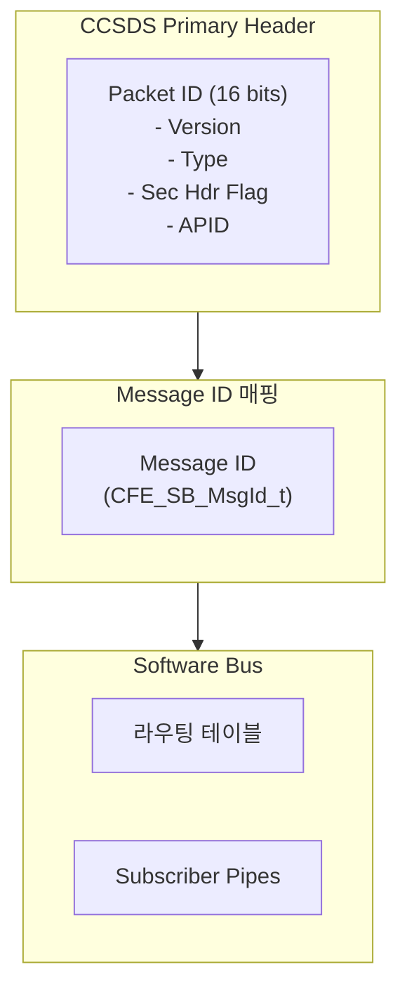
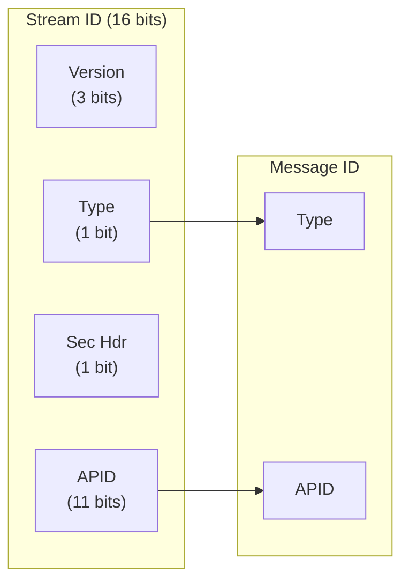
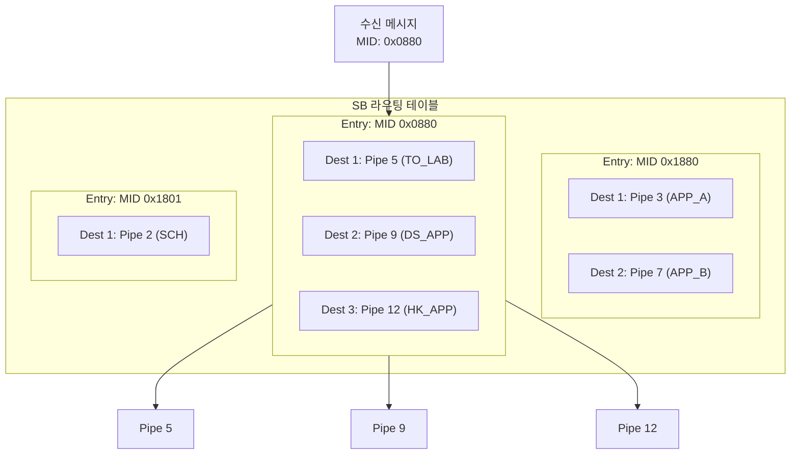
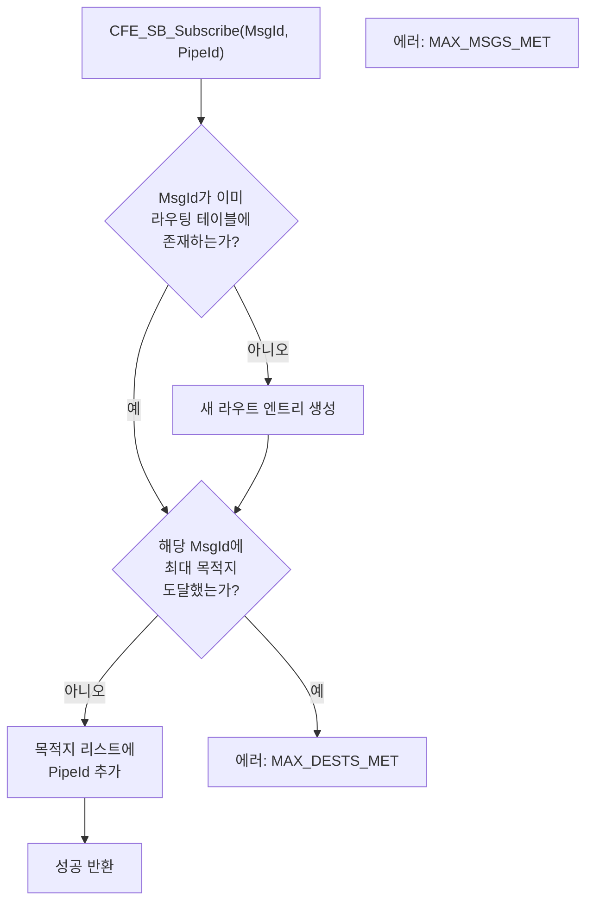
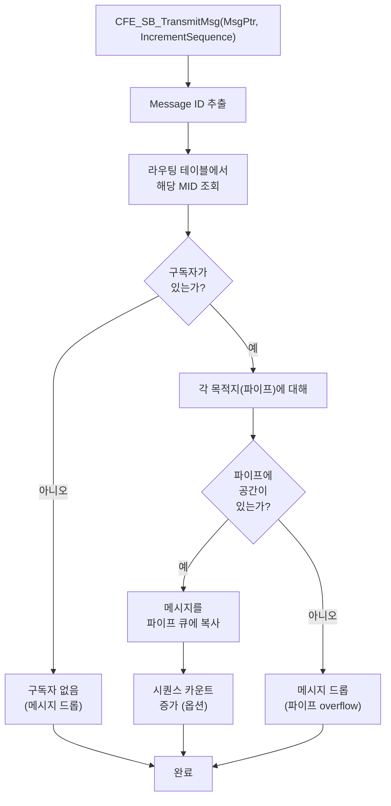
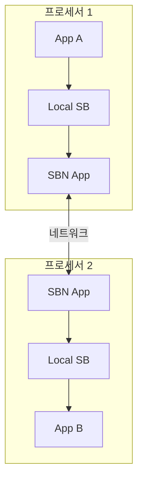

# Phase 2 SB-05: Message ID와 라우팅 테이블

## 서론

Software Bus의 핵심 메커니즘은 Message ID를 기반으로 한 메시지 라우팅이다. Publisher가 메시지를 발행하면, SB는 해당 메시지의 Message ID를 확인하고, 그 ID를 구독한 모든 파이프에게 메시지를 전달한다. 이러한 라우팅은 SB가 내부적으로 관리하는 라우팅 테이블을 통해 이루어진다.

본 문서에서는 Message ID의 구성과 할당 전략, 그리고 SB 라우팅 테이블의 구조와 동작 원리를 상세히 살펴본다. 이러한 내부 메커니즘을 이해하는 것은 cFS 애플리케이션을 효율적으로 설계하고 디버깅하는 데 필수적이다.

---

## 1. Message ID 개요

### 1.1 Message ID의 역할

Message ID(MID)는 cFS에서 메시지를 고유하게 식별하는 핵심 요소이다. SB는 Message ID를 사용하여 메시지를 적절한 수신자에게 라우팅한다. 모든 구독과 발행은 Message ID를 중심으로 이루어지며, 앱들은 Message ID를 통해 통신한다.

Message ID는 CCSDS Primary Header의 Packet ID 필드에서 파생된다. 그러나 cFS는 단순히 Packet ID를 그대로 사용하는 것이 아니라, 미션의 요구사항에 따라 다양한 Message ID 매핑 방식을 지원한다.



### 1.2 Message ID 타입

cFS에서 Message ID는 `CFE_SB_MsgId_t` 타입으로 정의된다. 이 타입은 미션 구성에 따라 다른 크기를 가질 수 있으며, 일반적으로 16비트 또는 32비트로 구현된다.

```c
/* Message ID 타입 정의 (플랫폼에 따라 다름) */
typedef uint32 CFE_SB_MsgId_t;  /* 32비트 Message ID */

/* 또는 */
typedef uint16 CFE_SB_MsgId_t;  /* 16비트 Message ID */
```

Message ID의 실제 값과의 변환을 위해 다음 함수들을 사용한다:

```c
/* 숫자 값을 MsgId로 변환 */
CFE_SB_MsgId_t MsgId = CFE_SB_ValueToMsgId(0x1880);

/* MsgId를 숫자 값으로 변환 */
CFE_SB_MsgId_Atom_t Value = CFE_SB_MsgIdToValue(MsgId);

/* Message ID 비교 */
if (CFE_SB_MsgIdToValue(MsgId) == MY_APP_CMD_MID)
{
    /* 매치 */
}
```

---

## 2. Message ID 구성

### 2.1 전통적인 16비트 Message ID

전통적인 cFS 구현에서 Message ID는 16비트로, CCSDS Primary Header의 첫 번째 16비트 필드(Stream ID)와 밀접하게 연관된다.



이 구성에서 Message ID는 다음과 같이 형성된다:
- **비트 15-11**: 사용되지 않거나 시스템/프로세서 식별자
- **비트 12**: Packet Type (0=텔레메트리, 1=명령)
- **비트 10-0**: Application Process ID (APID)

### 2.2 Message ID 예시 분석

일반적인 Message ID 값들을 비트 수준에서 분석해보자.

```
예시 1: MY_APP_CMD_MID = 0x1880

비트:  15 14 13 12 11 10  9  8  7  6  5  4  3  2  1  0
값:     0  0  0  1  1  0  0  0  1  0  0  0  0  0  0  0

- 비트 12 (Type) = 1 → 명령 메시지
- 비트 10-0 (APID) = 0x80 = 128 → 애플리케이션 식별자
```

```
예시 2: MY_APP_HK_TLM_MID = 0x0880

비트:  15 14 13 12 11 10  9  8  7  6  5  4  3  2  1  0
값:     0  0  0  0  1  0  0  0  1  0  0  0  0  0  0  0

- 비트 12 (Type) = 0 → 텔레메트리 메시지
- 비트 10-0 (APID) = 0x80 = 128 → 동일한 애플리케이션
```

### 2.3 Mission-Specific Message ID 구성

일부 미션에서는 더 복잡한 Message ID 구성을 사용한다. 예를 들어, 다중 프로세서 시스템에서는 프로세서 ID를 Message ID에 포함시킬 수 있다.

```c
/*
 * 확장 Message ID 구성 예시
 *
 * 비트 구성:
 *   31-16: 확장 필드 (미사용 또는 미션 특정)
 *   15-12: 서브시스템 ID
 *   11-8:  프로세서 ID
 *   7-0:   애플리케이션 ID
 *
 * 또는 CCSDS v2 기반:
 *   비트 12: Type
 *   비트 10-0: APID
 *   추가 비트: Subsystem ID, Processor ID
 */
 
/* 32비트 Message ID 구성 예시 */
#define MAKE_MID(type, subsys, cpu, app) \
    (((type) << 12) | ((subsys) << 8) | ((cpu) << 4) | (app))

#define MY_APP_CMD_MID    MAKE_MID(1, 0x8, 0x1, 0x00)  /* 0x1810 */
```

---

## 3. Message ID 할당 전략

### 3.1 체계적인 할당의 필요성

대규모 cFS 미션에서는 수백 개의 Message ID가 사용될 수 있다. 체계적인 할당 전략 없이는 ID 충돌이 발생하거나, 관련 메시지들이 분산되어 관리가 어려워진다. 따라서 미션 초기 단계에서 Message ID 할당 규칙을 수립하는 것이 중요하다.

### 3.2 할당 규칙 예시

다음은 일반적으로 사용되는 Message ID 할당 규칙의 예시이다.

```c
/*
 * cFS Message ID 할당 규칙
 *
 * =========================================================
 * 명령 Message ID (0x1800 - 0x1FFF)
 * =========================================================
 *
 * 0x1800 - 0x180F: cFE Core 서비스 명령
 *   - 0x1806: CFE_ES_CMD_MID
 *   - 0x1807: CFE_SB_CMD_MID
 *   - 0x1808: CFE_EVS_CMD_MID
 *   - 0x1809: CFE_TIME_CMD_MID
 *   - 0x180A: CFE_TBL_CMD_MID
 *
 * 0x1810 - 0x183F: cFS Lab 애플리케이션 명령
 *   - 0x1820: SCH_LAB_CMD_MID
 *   - 0x1821: CI_LAB_CMD_MID
 *   - 0x1822: TO_LAB_CMD_MID
 *
 * 0x1840 - 0x187F: 표준 미션 지원 애플리케이션 명령
 *   - 0x1840: DS_CMD_MID (Data Storage)
 *   - 0x1841: FM_CMD_MID (File Manager)
 *   - 0x1842: LC_CMD_MID (Limit Checker)
 *
 * 0x1880 - 0x18FF: 미션 고유 애플리케이션 명령
 *   - 0x1880: PAYLOAD_APP_CMD_MID
 *   - 0x1881: ATTITUDE_APP_CMD_MID
 *   - 0x1882: THERMAL_APP_CMD_MID
 *
 * =========================================================
 * 텔레메트리 Message ID (0x0800 - 0x0FFF)
 * =========================================================
 *
 * 동일한 APID 구조, Type 비트만 0
 *
 * 0x0800 - 0x080F: cFE Core 서비스 텔레메트리
 * 0x0810 - 0x083F: cFS Lab 애플리케이션 텔레메트리
 * 0x0840 - 0x087F: 표준 미션 지원 애플리케이션 텔레메트리
 * 0x0880 - 0x08FF: 미션 고유 애플리케이션 텔레메트리
 *
 * =========================================================
 * HK 요청 Message ID (특별 규칙)
 * =========================================================
 *
 * SCH에서 발행하는 HK 요청은 별도 범위 할당
 * 0x1900 - 0x19FF: HK 요청 (SEND_HK) MID
 */
```

### 3.3 중앙 집중식 정의

모든 Message ID는 중앙 헤더 파일에서 정의하는 것이 관리에 유리하다.

```c
/*
 * mission_msgids.h - 미션 전체 Message ID 정의
 */
#ifndef MISSION_MSGIDS_H
#define MISSION_MSGIDS_H

/*
 * cFE Core Service Message IDs
 */
#define CFE_ES_CMD_MID              0x1806
#define CFE_ES_HK_TLM_MID           0x0806
#define CFE_ES_SEND_HK_MID          0x1908

#define CFE_SB_CMD_MID              0x1807
#define CFE_SB_HK_TLM_MID           0x0807
#define CFE_SB_SEND_HK_MID          0x1909

/* ... 기타 cFE 서비스 ... */

/*
 * Mission Application Message IDs
 */
#define PAYLOAD_CMD_MID             0x1880
#define PAYLOAD_HK_TLM_MID          0x0880
#define PAYLOAD_DATA_TLM_MID        0x0881
#define PAYLOAD_SEND_HK_MID         0x1940

#define ATTITUDE_CMD_MID            0x1882
#define ATTITUDE_HK_TLM_MID         0x0882
#define ATTITUDE_SEND_HK_MID        0x1942

#endif /* MISSION_MSGIDS_H */
```

---

## 4. 라우팅 테이블 구조

### 4.1 라우팅 테이블 개요

SB 라우팅 테이블은 Message ID와 해당 메시지를 구독한 파이프들 간의 매핑을 저장한다. 메시지가 발행되면 SB는 라우팅 테이블을 조회하여 해당 Message ID에 등록된 모든 파이프를 찾고, 각 파이프에 메시지를 전달한다.



### 4.2 라우팅 테이블 내부 구조

SB 소스 코드에서 라우팅 테이블은 다음과 같은 구조로 구현된다.

```c
/* 목적지 정보 구조체 */
typedef struct
{
    CFE_SB_PipeId_t PipeId;        /* 대상 파이프 ID */
    uint16 MsgId2PipeLim;          /* 이 MID에 대한 파이프 내 최대 메시지 수 */
    uint16 BuffCount;              /* 현재 파이프 내 이 MID 메시지 수 */
    bool Active;                    /* 활성 상태 */
} CFE_SB_DestinationD_t;

/* 라우팅 정보 구조체 */
typedef struct
{
    CFE_SB_MsgId_t MsgId;                           /* Message ID */
    uint16 Destinations;                             /* 등록된 목적지 수 */
    CFE_SB_DestinationD_t DestList[CFE_PLATFORM_SB_MAX_DEST_PER_PKT];
} CFE_SB_RouteEntry_t;

/* 전체 라우팅 테이블 */
typedef struct
{
    CFE_SB_RouteEntry_t Routes[CFE_PLATFORM_SB_MAX_MSG_IDS];
    uint32 RouteCount;      /* 등록된 라우트 수 */
} CFE_SB_RoutingTbl_t;
```

### 4.3 라우팅 테이블 제한

라우팅 테이블의 크기는 플랫폼 구성 파라미터에 의해 제한된다.

```c
/* platform_cfg.h에서 정의 */

/* 최대 Message ID 수 */
#define CFE_PLATFORM_SB_MAX_MSG_IDS          256

/* 하나의 Message ID당 최대 목적지(구독자) 수 */
#define CFE_PLATFORM_SB_MAX_DEST_PER_PKT     16

/* 최대 파이프 수 */
#define CFE_PLATFORM_SB_MAX_PIPES            64

/* MID당 기본 메시지 제한 */
#define CFE_PLATFORM_SB_DEFAULT_MSG_LIMIT    4
```

이러한 제한을 초과하면 구독이 실패하거나 메시지가 드롭될 수 있다.

---

## 5. 구독과 라우팅 등록

### 5.1 구독 시 라우팅 등록 과정

`CFE_SB_Subscribe()` 함수가 호출되면 SB는 다음 과정을 수행한다.



### 5.2 구독 함수 사용

기본 구독과 확장 구독 함수의 사용 예시이다.

```c
/*
 * 기본 구독
 * - 기본 메시지 제한 사용
 */
CFE_Status_t Status;
Status = CFE_SB_Subscribe(CFE_SB_ValueToMsgId(MY_APP_CMD_MID), PipeId);

if (Status != CFE_SUCCESS)
{
    if (Status == CFE_SB_MAX_MSGS_MET)
    {
        /* 최대 Message ID 수 초과 */
        CFE_EVS_SendEvent(ERR_EID, CFE_EVS_EventType_ERROR,
                          "Max message IDs reached");
    }
    else if (Status == CFE_SB_MAX_DESTS_MET)
    {
        /* 해당 MID의 최대 구독자 수 초과 */
        CFE_EVS_SendEvent(ERR_EID, CFE_EVS_EventType_ERROR,
                          "Max destinations for MID reached");
    }
}

/*
 * 확장 구독
 * - 사용자 정의 메시지 제한 지정
 */
CFE_SB_Qos_t QoS = {0, 0};  /* 현재 미사용 */
uint16 MsgLimit = 10;       /* 파이프 내 최대 메시지 수 */

Status = CFE_SB_SubscribeEx(CFE_SB_ValueToMsgId(DATA_MID),
                            PipeId,
                            QoS,
                            MsgLimit);
```

### 5.3 구독 해제

```c
/* 구독 해제 */
CFE_Status_t Status;
Status = CFE_SB_Unsubscribe(CFE_SB_ValueToMsgId(MY_APP_CMD_MID), PipeId);

/* 구독 해제 시 라우팅 테이블에서 해당 목적지가 제거됨 */
```

---

## 6. 메시지 라우팅 동작

### 6.1 메시지 전송 시 라우팅

`CFE_SB_TransmitMsg()` 함수가 호출되면 SB는 다음 과정을 통해 메시지를 라우팅한다.



### 6.2 시퀀스 카운터 관리

SB는 각 Message ID에 대한 시퀀스 카운터를 자동으로 관리한다. `CFE_SB_TransmitMsg()` 함수의 두 번째 파라미터가 `true`이면 시퀀스 카운터가 증가한다.

```c
/* 시퀀스 카운터 자동 증가 */
CFE_SB_TransmitMsg(&MsgPtr->TelemetryHeader.Msg, true);

/* 시퀀스 카운터 수동 관리 */
CFE_SB_TransmitMsg(&MsgPtr->TelemetryHeader.Msg, false);
```

시퀀스 카운터는 패킷 손실이나 중복을 감지하는 데 사용된다. 수신자는 시퀀스 카운터가 연속적으로 증가하는지 확인하여 패킷 손실 여부를 판단할 수 있다.

### 6.3 라우팅 성능 고려사항

라우팅 성능은 다음 요소에 영향을 받는다.

| 요소 | 영향 | 최적화 방법 |
|:---|:---|:---|
| Message ID 수 | 테이블 검색 시간 | 사용하지 않는 MID 등록 피하기 |
| MID당 구독자 수 | 복사 횟수 | 필요한 구독만 등록 |
| 메시지 크기 | 복사 시간 | 적정 크기 유지 |
| 파이프 깊이 | 메모리 사용 | 적정 깊이 설정 |

---

## 7. 라우팅 정보 조회

### 7.1 라우팅 정보 덤프

SB는 현재 라우팅 테이블 상태를 파일로 덤프하는 명령을 제공한다.

```c
/* 지상 명령을 통한 라우팅 정보 덤프 */
/* Command: CFE_SB_WRITE_ROUTING_INFO_CC */

/* 결과 파일에 포함되는 정보:
 * - 등록된 모든 Message ID
 * - 각 MID에 대한 구독자 목록
 * - 각 구독의 파이프 이름, 앱 이름
 * - 메시지 제한 및 현재 카운트
 */
```

### 7.2 라우팅 정보 텔레메트리

SB Housekeeping 텔레메트리에는 라우팅 테이블 관련 통계가 포함된다.

```c
/* SB HK 텔레메트리의 라우팅 관련 필드 */
typedef struct
{
    uint32 MsgSendErrorCounter;     /* 전송 오류 카운터 */
    uint32 NoSubscribersCounter;    /* 구독자 없는 메시지 수 */
    uint32 DuplicateSubscriptions;  /* 중복 구독 시도 수 */
    uint32 MsgLimitErrorCounter;    /* 메시지 제한 초과 수 */
    
    uint16 CurrentNumberOfMsgs;     /* 현재 등록된 MID 수 */
    uint16 CurrentNumberOfPipes;    /* 현재 파이프 수 */
    uint16 CurrentNumberOfSubs;     /* 현재 총 구독 수 */
    
    /* ... 기타 필드 ... */
    
} CFE_SB_HkTlm_Payload_t;
```

### 7.3 라우팅 정보 API

앱에서 라우팅 정보를 프로그래밍 방식으로 조회할 수 있다.

```c
/* 특정 MID에 대한 라우팅 정보 조회 */
CFE_SB_MsgRouteIdx_t RouteIdx;
CFE_SB_RouteEntry_t *RoutePtr;

RouteIdx = CFE_SB_GetRoutingTblIdx(MsgId);
if (CFE_SB_IsValidRouteIdx(RouteIdx))
{
    RoutePtr = CFE_SB_GetRoutePtrFromIdx(RouteIdx);
    /* RoutePtr을 통해 구독 정보 접근 */
}
```

---

## 8. 특수 라우팅 시나리오

### 8.1 로컬 vs 리모트 라우팅

일부 cFS 구성에서는 여러 프로세서 간에 메시지를 라우팅해야 할 수 있다. 이 경우 Software Bus Network(SBN) 앱을 사용하여 프로세서 간 라우팅을 구현한다.



### 8.2 메시지 필터링

특정 조건에 따라 메시지를 필터링해야 하는 경우, 중간 앱을 통해 필터링을 구현할 수 있다.

```c
/* 필터링 앱 예시 */
void FilterApp_ProcessMessage(CFE_SB_Buffer_t *BufPtr)
{
    MY_DATA_t *DataPtr = (MY_DATA_t *)BufPtr;
    
    /* 필터 조건 확인 */
    if (DataPtr->Payload.Value > THRESHOLD)
    {
        /* 조건 만족 - 메시지 재발행 */
        CFE_SB_TransmitMsg(&BufPtr->Msg, false);
    }
    /* 조건 불만족 - 메시지 드롭 (재발행 안함) */
}
```

### 8.3 메시지 변환

서로 다른 메시지 형식 간 변환이 필요한 경우도 있다.

```c
/* 메시지 변환 앱 예시 */
void TransformApp_ProcessMessage(CFE_SB_Buffer_t *BufPtr)
{
    SOURCE_MSG_t *SrcPtr = (SOURCE_MSG_t *)BufPtr;
    DEST_MSG_t *DestPtr;
    
    /* 새 메시지 할당 */
    DestPtr = (DEST_MSG_t *)CFE_SB_AllocateMessageBuffer(sizeof(*DestPtr));
    
    /* 헤더 초기화 */
    CFE_MSG_Init(&DestPtr->TelemetryHeader.Msg,
                 CFE_SB_ValueToMsgId(DEST_MSG_MID),
                 sizeof(*DestPtr));
    
    /* 데이터 변환 */
    DestPtr->Payload.TransformedValue = 
        TransformFunction(SrcPtr->Payload.OriginalValue);
    
    /* 변환된 메시지 발행 */
    CFE_SB_TransmitMsg(&DestPtr->TelemetryHeader.Msg, true);
}
```

---

## 9. 라우팅 디버깅

### 9.1 일반적인 라우팅 문제

| 증상 | 가능한 원인 | 해결 방법 |
|:---|:---|:---|
| 메시지 수신 안됨 | 구독 누락 | 구독 확인, 라우팅 정보 덤프 |
| 메시지 수신 안됨 | MID 불일치 | 발신/수신 MID 값 확인 |
| 메시지 드롭 | 파이프 오버플로우 | 파이프 깊이 증가 |
| 메시지 드롭 | 메시지 제한 초과 | 메시지 제한 증가 |
| 구독 실패 | 최대 MID 도달 | 구성 파라미터 증가 |

### 9.2 디버깅 절차

```c
/* 1. 라우팅 정보 덤프 명령 전송 */
/* Ground: CFE_SB_WRITE_ROUTING_INFO_CC */

/* 2. 결과 파일 분석 */
/* /cf/sb_route.dat 또는 유사한 경로 */

/* 3. SB HK 텔레메트리 확인 */
/* - NoSubscribersCounter: 구독자 없는 메시지 수
 * - MsgLimitErrorCounter: 제한 초과 수
 * - MsgSendErrorCounter: 전송 오류 수
 */

/* 4. 이벤트 메시지 확인 */
/* SB는 문제 발생 시 이벤트를 생성함 */
```

### 9.3 런타임 라우팅 확인

앱에서 런타임에 자신의 구독 상태를 확인하는 방법:

```c
/* HK 텔레메트리에 구독 상태 포함 */
typedef struct
{
    /* 표준 HK 필드들 */
    uint16 CmdCounter;
    uint16 CmdErrCounter;
    
    /* 구독 상태 정보 */
    uint16 SubscribedMsgCount;  /* 구독한 MID 수 */
    uint16 MessageReceived;     /* 수신한 메시지 수 */
    uint16 MessageDropped;      /* 드롭된 메시지 수 (파이프에서) */
    
} MY_APP_HkTlm_Payload_t;
```

---

## 결론

Message ID와 라우팅 테이블은 Software Bus의 핵심 메커니즘이다. Message ID는 메시지를 고유하게 식별하고, 라우팅 테이블은 메시지를 적절한 구독자에게 전달하는 매핑 정보를 저장한다.

핵심 개념을 정리하면 다음과 같다:
- **Message ID**: CCSDS Packet ID에서 파생, Type과 APID로 구성
- **Message ID 할당**: 체계적인 규칙에 따라 중앙 집중식으로 관리
- **라우팅 테이블**: Message ID to Pipes 매핑 저장
- **구독**: 라우팅 테이블에 목적지 등록
- **라우팅**: 메시지 발행 시 테이블 조회하여 전달
- **디버깅**: 라우팅 정보 덤프와 HK 텔레메트리 활용

다음 문서에서는 파이프(Pipe)의 개념과 관리 메커니즘을 상세히 살펴볼 것이다.

---

## 참고 문헌

1. NASA, "cFE Application Developer's Guide"
2. NASA, "Software Bus User's Guide"
3. NASA cFE GitHub, cfe/modules/sb/fsw/src/
4. NASA, "cFS Configuration Guide"

---

[이전 문서: Phase 2 SB-04: 메시지 구조 (2) - 명령과 텔레메트리](./Phase2_SB_04_명령과_텔레메트리.md)

[다음 문서: Phase 2 SB-06: 파이프(Pipe) 개념과 관리](./Phase2_SB_06_파이프_개념과_관리.md)
