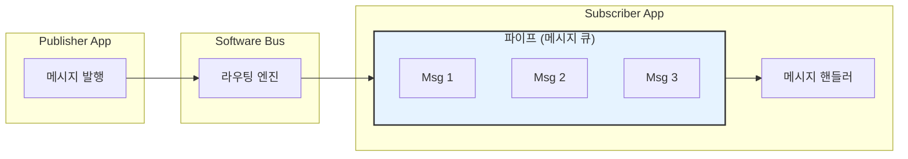
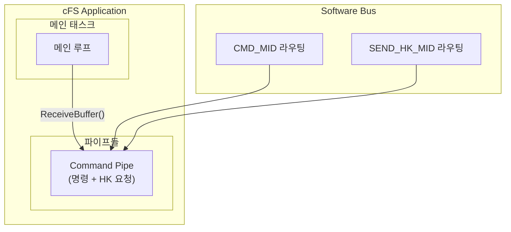
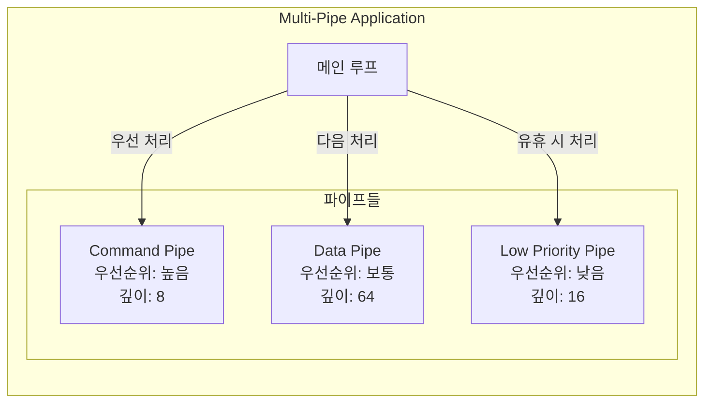

# Phase 2 SB-06: 파이프(Pipe) 개념과 관리

## 서론

Software Bus에서 파이프(Pipe)는 메시지를 수신하기 위한 핵심 메커니즘이다. 각 애플리케이션은 하나 이상의 파이프를 생성하여 관심 있는 메시지를 수신한다. 파이프는 본질적으로 메시지 큐로, Software Bus가 메시지를 라우팅할 때 해당 메시지를 수신하도록 등록된 파이프의 큐에 메시지를 삽입한다. 애플리케이션은 자신의 스케줄에 따라 파이프에서 메시지를 꺼내어 처리한다.

본 문서에서는 파이프의 개념, 생성 및 관리, 그리고 효과적인 파이프 사용 패턴을 상세히 살펴본다.

---

## 1. 파이프 개요

### 1.1 파이프의 역할

파이프는 Software Bus와 애플리케이션 사이의 인터페이스 역할을 한다. SB가 메시지를 라우팅할 때 메시지는 직접 애플리케이션에 전달되는 것이 아니라 파이프의 큐에 저장된다. 애플리케이션은 준비가 되면 파이프에서 메시지를 가져와 처리한다.

이러한 설계는 비동기 통신을 가능하게 한다. Publisher는 Subscriber의 처리 상태와 관계없이 메시지를 발행할 수 있고, Subscriber는 자신의 스케줄에 따라 메시지를 처리할 수 있다.



### 1.2 파이프의 특성

파이프는 다음과 같은 특성을 갖는다.

| 특성 | 설명 |
|:---|:---|
| **FIFO 순서** | 메시지는 도착 순서대로 처리됨 |
| **고정 깊이** | 생성 시 최대 메시지 수 지정 |
| **다중 구독** | 하나의 파이프로 여러 Message ID 수신 가능 |
| **소유권** | 파이프를 생성한 앱이 소유자 |
| **이름** | 각 파이프는 고유한 이름을 가짐 |

### 1.3 파이프와 태스크의 관계

일반적으로 각 cFS 애플리케이션은 적어도 하나의 메인 파이프를 갖는다. 이 파이프는 애플리케이션의 핵심 메시지(명령, HK 요청 등)를 수신한다. 애플리케이션의 메인 루프는 이 파이프에서 메시지를 대기하며, 메시지가 도착하면 처리한다.



---

## 2. 파이프 생성

### 2.1 CFE_SB_CreatePipe 함수

파이프는 `CFE_SB_CreatePipe()` 함수를 사용하여 생성한다. 이 함수는 파이프의 깊이(최대 메시지 수)와 이름을 인자로 받는다.

```c
/**
 * @brief 새 파이프 생성
 *
 * 지정된 깊이와 이름으로 새 파이프를 생성한다.
 *
 * @param PipeIdPtr  생성된 파이프 ID 반환
 * @param Depth      파이프 깊이 (최대 메시지 수)
 * @param PipeName   파이프 이름 (고유해야 함)
 *
 * @return CFE_SUCCESS 성공
 * @return CFE_SB_PIPE_CR_ERR 생성 실패
 * @return CFE_SB_MAX_PIPES_MET 최대 파이프 수 도달
 */
CFE_Status_t CFE_SB_CreatePipe(CFE_SB_PipeId_t *PipeIdPtr,
                                uint16 Depth,
                                const char *PipeName);
```

### 2.2 파이프 생성 예시

```c
CFE_Status_t MY_APP_CreatePipes(void)
{
    CFE_Status_t Status;
    
    /* 메인 커맨드 파이프 생성 */
    Status = CFE_SB_CreatePipe(&MY_APP_Data.CmdPipeId,
                               MY_APP_CMD_PIPE_DEPTH,
                               MY_APP_CMD_PIPE_NAME);
    
    if (Status != CFE_SUCCESS)
    {
        CFE_EVS_SendEvent(MY_APP_PIPE_ERR_EID,
                          CFE_EVS_EventType_ERROR,
                          "Failed to create Command Pipe: 0x%08X",
                          (unsigned int)Status);
        return Status;
    }
    
    CFE_EVS_SendEvent(MY_APP_PIPE_INF_EID,
                      CFE_EVS_EventType_INFORMATION,
                      "Command Pipe created: Depth=%u, Name=%s",
                      (unsigned int)MY_APP_CMD_PIPE_DEPTH,
                      MY_APP_CMD_PIPE_NAME);
    
    return CFE_SUCCESS;
}
```

### 2.3 파이프 깊이 결정

파이프 깊이는 신중하게 결정해야 한다. 너무 얕으면 메시지가 드롭될 수 있고, 너무 깊으면 메모리를 낭비한다. 적절한 깊이를 결정할 때 다음 요소를 고려한다.

| 고려 요소 | 설명 | 예시 |
|:---|:---|:---|
| 메시지 도착 빈도 | 예상되는 초당 메시지 수 | 10Hz 스케줄 → 최소 10 |
| 처리 지연 | 앱이 바쁠 때 최대 지연 | 최대 200ms 지연 |
| 버스트 처리 | 동시에 도착하는 메시지 수 | 초기화 시 5개 동시 |
| 안전 마진 | 예외 상황 대비 | 계산값의 2배 |

```c
/*
 * 파이프 깊이 계산 예시
 *
 * 시나리오:
 * - 명령: 불규칙, 최대 2개/초
 * - HK 요청: 1Hz (초당 1개)
 * - 버스트: 초기화 시 최대 10개
 *
 * 계산:
 * - 기본 깊이: (2 + 1) × 2 = 6
 * - 버스트 고려: max(6, 10) = 10
 * - 안전 마진: 10 × 1.5 = 15
 *
 * 권장 깊이: 16 (가장 가까운 2의 거듭제곱)
 */
#define MY_APP_CMD_PIPE_DEPTH  16
```

---

## 3. 메시지 구독

### 3.1 파이프에 Message ID 구독

파이프를 생성한 후에는 관심 있는 Message ID를 해당 파이프에 구독해야 한다. 하나의 파이프에 여러 Message ID를 구독할 수 있다.

```c
CFE_Status_t MY_APP_SubscribeMessages(void)
{
    CFE_Status_t Status;
    
    /* 앱 명령 Message ID 구독 */
    Status = CFE_SB_Subscribe(CFE_SB_ValueToMsgId(MY_APP_CMD_MID),
                              MY_APP_Data.CmdPipeId);
    if (Status != CFE_SUCCESS)
    {
        CFE_EVS_SendEvent(MY_APP_SUB_ERR_EID,
                          CFE_EVS_EventType_ERROR,
                          "Failed to subscribe CMD_MID: 0x%08X",
                          (unsigned int)Status);
        return Status;
    }
    
    /* HK 요청 Message ID 구독 */
    Status = CFE_SB_Subscribe(CFE_SB_ValueToMsgId(MY_APP_SEND_HK_MID),
                              MY_APP_Data.CmdPipeId);
    if (Status != CFE_SUCCESS)
    {
        CFE_EVS_SendEvent(MY_APP_SUB_ERR_EID,
                          CFE_EVS_EventType_ERROR,
                          "Failed to subscribe SEND_HK_MID: 0x%08X",
                          (unsigned int)Status);
        return Status;
    }
    
    /* 필요한 다른 메시지들 구독 */
    Status = CFE_SB_Subscribe(CFE_SB_ValueToMsgId(OTHER_APP_DATA_MID),
                              MY_APP_Data.CmdPipeId);
    
    return Status;
}
```

### 3.2 확장 구독

`CFE_SB_SubscribeEx()` 함수를 사용하면 메시지 제한을 지정할 수 있다. 메시지 제한은 특정 Message ID에 대해 파이프에 쌓일 수 있는 최대 메시지 수이다. 이는 하나의 Message ID가 파이프를 독점하는 것을 방지한다.

```c
/*
 * 확장 구독 예시
 *
 * 시나리오:
 * - 파이프 깊이: 16
 * - 명령: 메시지 제한 4 (버스트 대비)
 * - HK 요청: 메시지 제한 2 (1Hz이므로 2면 충분)
 * - 데이터: 메시지 제한 10 (고빈도 데이터)
 */

CFE_SB_Qos_t QoS = {0, 0};  /* 현재 미사용 */

/* 명령 구독 - 최대 4개 */
CFE_SB_SubscribeEx(CFE_SB_ValueToMsgId(MY_APP_CMD_MID),
                   MY_APP_Data.CmdPipeId,
                   QoS,
                   4);

/* HK 요청 구독 - 최대 2개 */
CFE_SB_SubscribeEx(CFE_SB_ValueToMsgId(MY_APP_SEND_HK_MID),
                   MY_APP_Data.CmdPipeId,
                   QoS,
                   2);

/* 데이터 구독 - 최대 10개 */
CFE_SB_SubscribeEx(CFE_SB_ValueToMsgId(SENSOR_DATA_MID),
                   MY_APP_Data.CmdPipeId,
                   QoS,
                   10);
```

---

## 4. 메시지 수신

### 4.1 CFE_SB_ReceiveBuffer 함수

파이프에서 메시지를 수신하려면 `CFE_SB_ReceiveBuffer()` 함수를 사용한다. 이 함수는 파이프에서 다음 메시지를 가져오거나, 지정된 시간 동안 메시지를 대기한다.

```c
/**
 * @brief 파이프에서 메시지 수신
 *
 * @param BufPtr    수신된 메시지 버퍼 포인터 반환
 * @param PipeId    메시지를 수신할 파이프
 * @param TimeOut   대기 시간 (밀리초)
 *                  CFE_SB_PEND_FOREVER: 무한 대기
 *                  CFE_SB_POLL: 즉시 반환 (대기 안함)
 *                  양수값: 해당 밀리초 동안 대기
 *
 * @return CFE_SUCCESS 메시지 수신 성공
 * @return CFE_SB_TIME_OUT 시간 초과
 * @return CFE_SB_NO_MESSAGE 메시지 없음 (POLL 모드)
 * @return CFE_SB_PIPE_RD_ERR 파이프 읽기 오류
 */
CFE_Status_t CFE_SB_ReceiveBuffer(CFE_SB_Buffer_t **BufPtr,
                                   CFE_SB_PipeId_t PipeId,
                                   int32 TimeOut);
```

### 4.2 타임아웃 옵션

세 가지 타임아웃 옵션을 상황에 맞게 사용한다.

```c
/* 무한 대기 (가장 일반적) */
CFE_SB_ReceiveBuffer(&BufPtr, PipeId, CFE_SB_PEND_FOREVER);
/* 메시지가 올 때까지 블록됨 */

/* 폴링 (비블로킹) */
Status = CFE_SB_ReceiveBuffer(&BufPtr, PipeId, CFE_SB_POLL);
if (Status == CFE_SB_NO_MESSAGE)
{
    /* 메시지 없음 - 다른 작업 수행 */
}

/* 타임아웃 지정 */
Status = CFE_SB_ReceiveBuffer(&BufPtr, PipeId, 1000);  /* 1초 대기 */
if (Status == CFE_SB_TIME_OUT)
{
    /* 1초 내 메시지 없음 */
}
```

### 4.3 메시지 수신 루프 패턴

전형적인 cFS 애플리케이션 메인 루프 패턴이다.

```c
void MY_APP_TaskMain(void)
{
    CFE_SB_Buffer_t *BufPtr = NULL;
    CFE_Status_t Status;
    
    /* 초기화 수행 */
    Status = MY_APP_Init();
    if (Status != CFE_SUCCESS)
    {
        CFE_ES_ExitApp(CFE_ES_RunStatus_APP_ERROR);
        return;
    }
    
    /* 메인 루프 */
    while (CFE_ES_RunLoop(&MY_APP_Data.RunStatus))
    {
        /* 메시지 대기 */
        Status = CFE_SB_ReceiveBuffer(&BufPtr,
                                      MY_APP_Data.CmdPipeId,
                                      CFE_SB_PEND_FOREVER);
        
        if (Status == CFE_SUCCESS)
        {
            /* 메시지 처리 */
            MY_APP_ProcessMessage(BufPtr);
        }
        else if (Status != CFE_SB_TIME_OUT)
        {
            /* 예기치 않은 오류 */
            CFE_EVS_SendEvent(MY_APP_RCV_ERR_EID,
                              CFE_EVS_EventType_ERROR,
                              "ReceiveBuffer error: 0x%08X",
                              (unsigned int)Status);
        }
    }
    
    /* 종료 처리 */
    MY_APP_Data.RunStatus = CFE_ES_RunStatus_APP_EXIT;
    CFE_ES_ExitApp(MY_APP_Data.RunStatus);
}
```

---

## 5. 메시지 처리

### 5.1 Message ID 기반 분기

수신된 메시지는 Message ID에 따라 적절한 핸들러로 분기한다.

```c
void MY_APP_ProcessMessage(const CFE_SB_Buffer_t *BufPtr)
{
    CFE_SB_MsgId_t MsgId;
    
    /* Message ID 추출 */
    CFE_MSG_GetMsgId(&BufPtr->Msg, &MsgId);
    
    /* Message ID에 따른 처리 */
    switch (CFE_SB_MsgIdToValue(MsgId))
    {
        case MY_APP_CMD_MID:
            MY_APP_ProcessCommand(BufPtr);
            break;
            
        case MY_APP_SEND_HK_MID:
            MY_APP_SendHkTlm();
            break;
            
        case SENSOR_DATA_MID:
            MY_APP_ProcessSensorData((const SENSOR_Data_t *)BufPtr);
            break;
            
        default:
            CFE_EVS_SendEvent(MY_APP_MID_ERR_EID,
                              CFE_EVS_EventType_ERROR,
                              "Unknown MID: 0x%04X",
                              (unsigned int)CFE_SB_MsgIdToValue(MsgId));
            break;
    }
}
```

### 5.2 명령 메시지 처리

명령 메시지는 추가로 Function Code를 확인하여 구체적인 명령을 식별한다.

```c
void MY_APP_ProcessCommand(const CFE_SB_Buffer_t *BufPtr)
{
    CFE_MSG_FcnCode_t FunctionCode;
    CFE_MSG_Size_t MsgSize;
    
    /* Function Code 추출 */
    CFE_MSG_GetFcnCode(&BufPtr->Msg, &FunctionCode);
    CFE_MSG_GetSize(&BufPtr->Msg, &MsgSize);
    
    switch (FunctionCode)
    {
        case MY_APP_NOOP_CC:
            if (MY_APP_VerifyLength(MsgSize, sizeof(MY_APP_NoopCmd_t)))
            {
                MY_APP_NoopCmd();
            }
            break;
            
        case MY_APP_RESET_CC:
            if (MY_APP_VerifyLength(MsgSize, sizeof(MY_APP_ResetCmd_t)))
            {
                MY_APP_ResetCmd();
            }
            break;
            
        default:
            MY_APP_Data.CmdErrCounter++;
            CFE_EVS_SendEvent(MY_APP_CC_ERR_EID,
                              CFE_EVS_EventType_ERROR,
                              "Invalid command code: %u",
                              (unsigned int)FunctionCode);
            break;
    }
}
```

---

## 6. 다중 파이프 사용

### 6.1 다중 파이프의 필요성

일부 상황에서는 하나의 애플리케이션이 여러 파이프를 사용하는 것이 유리하다. 예를 들어, 우선순위가 다른 메시지들을 분리하거나, 고빈도 데이터와 저빈도 명령을 분리할 때 다중 파이프를 사용한다.



### 6.2 다중 파이프 생성 및 관리

```c
/* 앱 데이터에 여러 파이프 ID 저장 */
typedef struct
{
    CFE_SB_PipeId_t CmdPipeId;     /* 명령 파이프 */
    CFE_SB_PipeId_t DataPipeId;    /* 데이터 파이프 */
    CFE_SB_PipeId_t AsyncPipeId;   /* 비동기 파이프 */
    
    /* ... 기타 데이터 ... */
    
} MY_APP_Data_t;

CFE_Status_t MY_APP_CreatePipes(void)
{
    CFE_Status_t Status;
    
    /* 명령 파이프 (작은 깊이) */
    Status = CFE_SB_CreatePipe(&MY_APP_Data.CmdPipeId,
                               8,
                               "MY_APP_CMD_PIPE");
    if (Status != CFE_SUCCESS) return Status;
    
    /* 데이터 파이프 (큰 깊이) */
    Status = CFE_SB_CreatePipe(&MY_APP_Data.DataPipeId,
                               64,
                               "MY_APP_DATA_PIPE");
    if (Status != CFE_SUCCESS) return Status;
    
    /* 비동기 파이프 */
    Status = CFE_SB_CreatePipe(&MY_APP_Data.AsyncPipeId,
                               16,
                               "MY_APP_ASYNC_PIPE");
    
    return Status;
}
```

### 6.3 다중 파이프 처리 패턴

```c
void MY_APP_TaskMain(void)
{
    CFE_SB_Buffer_t *BufPtr;
    CFE_Status_t Status;
    
    while (CFE_ES_RunLoop(&MY_APP_Data.RunStatus))
    {
        /* 1. 우선 명령 파이프 처리 (폴링) */
        while ((Status = CFE_SB_ReceiveBuffer(&BufPtr,
                                               MY_APP_Data.CmdPipeId,
                                               CFE_SB_POLL)) == CFE_SUCCESS)
        {
            MY_APP_ProcessCommand(BufPtr);
        }
        
        /* 2. 데이터 파이프 처리 (타임아웃) */
        Status = CFE_SB_ReceiveBuffer(&BufPtr,
                                      MY_APP_Data.DataPipeId,
                                      100);  /* 100ms 대기 */
        if (Status == CFE_SUCCESS)
        {
            MY_APP_ProcessData(BufPtr);
        }
        
        /* 3. 비동기 파이프 처리 (폴링) */
        Status = CFE_SB_ReceiveBuffer(&BufPtr,
                                      MY_APP_Data.AsyncPipeId,
                                      CFE_SB_POLL);
        if (Status == CFE_SUCCESS)
        {
            MY_APP_ProcessAsync(BufPtr);
        }
    }
}
```

---

## 7. 파이프 삭제

### 7.1 CFE_SB_DeletePipe 함수

애플리케이션 종료 시 파이프를 깨끗이 삭제해야 한다. `CFE_SB_DeletePipe()` 함수는 파이프와 관련된 모든 구독을 해제한다.

```c
/**
 * @brief 파이프 삭제
 *
 * 파이프와 모든 관련 구독을 삭제한다.
 *
 * @param PipeId  삭제할 파이프 ID
 *
 * @return CFE_SUCCESS 성공
 * @return CFE_SB_BAD_ARGUMENT 잘못된 파이프 ID
 */
CFE_Status_t CFE_SB_DeletePipe(CFE_SB_PipeId_t PipeId);
```

### 7.2 파이프 삭제 예시

```c
void MY_APP_Cleanup(void)
{
    CFE_Status_t Status;
    
    /* 명령 파이프 삭제 */
    Status = CFE_SB_DeletePipe(MY_APP_Data.CmdPipeId);
    if (Status != CFE_SUCCESS)
    {
        CFE_EVS_SendEvent(MY_APP_DEL_PIPE_ERR_EID,
                          CFE_EVS_EventType_ERROR,
                          "Failed to delete CmdPipe: 0x%08X",
                          (unsigned int)Status);
    }
    
    /* 데이터 파이프 삭제 */
    Status = CFE_SB_DeletePipe(MY_APP_Data.DataPipeId);
    if (Status != CFE_SUCCESS)
    {
        CFE_EVS_SendEvent(MY_APP_DEL_PIPE_ERR_EID,
                          CFE_EVS_EventType_ERROR,
                          "Failed to delete DataPipe: 0x%08X",
                          (unsigned int)Status);
    }
}
```

---

## 8. 파이프 정보 조회

### 8.1 파이프 정보 텔레메트리

SB는 파이프 상태 정보를 조회하는 명령을 제공한다. `CFE_SB_WRITE_PIPE_INFO_CC` 명령을 통해 모든 파이프 정보를 파일로 덤프할 수 있다.

```c
/* 파이프 정보 덤프 결과 예시 */
/*
 * Pipe ID: 3
 * Pipe Name: MY_APP_CMD_PIPE
 * Owner App: MY_APP
 * Depth: 16
 * Current Messages: 2
 * Peak Messages: 12
 * Subscriptions: 3
 */
```

### 8.2 런타임 파이프 상태 모니터링

앱에서 자신의 파이프 상태를 모니터링하여 HK 텔레메트리에 포함시킬 수 있다.

```c
/* HK 페이로드에 파이프 정보 포함 */
typedef struct
{
    uint16 CmdCounter;
    uint16 CmdErrCounter;
    
    /* 파이프 상태 정보 */
    uint8 CmdPipeDepth;       /* 파이프 깊이 (설정값) */
    uint8 CmdPipeCurrentMsgs; /* 현재 메시지 수 */
    uint8 CmdPipePeakMsgs;    /* 최대 메시지 수 (워터마크) */
    uint8 Spare;
    
} MY_APP_HkTlm_Payload_t;
```

---

## 9. 파이프 사용 모범 사례

### 9.1 파이프 설계 가이드라인

| 가이드라인 | 설명 | 권장사항 |
|:---|:---|:---|
| 적절한 깊이 | 메시지 드롭 방지 | 예상 최대 부하의 2배 |
| 의미 있는 이름 | 디버깅 용이성 | "APPNAME_PURPOSE_PIPE" |
| 메시지 제한 활용 | 파이프 독점 방지 | MID별로 적절한 제한 설정 |
| 다중 파이프 고려 | 우선순위 분리 | 명령/데이터 분리 |
| 에러 처리 | 견고한 애플리케이션 | 모든 반환값 확인 |

### 9.2 파이프 관련 일반적인 문제

```c
/* 문제 1: 파이프 오버플로우 */
/* 증상: 메시지 드롭, NoSubscribersCounter 증가하지 않음 */
/* 해결: 파이프 깊이 증가 또는 메시지 처리 속도 개선 */

/* 문제 2: 메시지 수신 블록 */
/* 증상: 앱이 응답하지 않음 */
/* 해결: 타임아웃 사용 또는 별도 태스크에서 처리 */

/* 문제 3: 구독 누락 */
/* 증상: 특정 메시지 수신 안됨 */
/* 해결: 라우팅 정보 덤프하여 구독 확인 */
```

### 9.3 완전한 초기화 시퀀스

```c
CFE_Status_t MY_APP_Init(void)
{
    CFE_Status_t Status;
    
    /* 1. 앱 데이터 초기화 */
    memset(&MY_APP_Data, 0, sizeof(MY_APP_Data));
    MY_APP_Data.RunStatus = CFE_ES_RunStatus_APP_RUN;
    
    /* 2. 앱 등록 */
    Status = CFE_EVS_Register(NULL, 0, CFE_EVS_EventFilter_BINARY);
    if (Status != CFE_SUCCESS)
    {
        CFE_ES_WriteToSysLog("MY_APP: EVS Register failed\n");
        return Status;
    }
    
    /* 3. 파이프 생성 */
    Status = CFE_SB_CreatePipe(&MY_APP_Data.CmdPipeId,
                               MY_APP_CMD_PIPE_DEPTH,
                               MY_APP_CMD_PIPE_NAME);
    if (Status != CFE_SUCCESS)
    {
        CFE_EVS_SendEvent(MY_APP_INIT_ERR_EID,
                          CFE_EVS_EventType_ERROR,
                          "CreatePipe failed: 0x%08X",
                          (unsigned int)Status);
        return Status;
    }
    
    /* 4. 메시지 구독 */
    Status = CFE_SB_Subscribe(CFE_SB_ValueToMsgId(MY_APP_CMD_MID),
                              MY_APP_Data.CmdPipeId);
    if (Status != CFE_SUCCESS)
    {
        CFE_EVS_SendEvent(MY_APP_INIT_ERR_EID,
                          CFE_EVS_EventType_ERROR,
                          "Subscribe CMD failed: 0x%08X",
                          (unsigned int)Status);
        return Status;
    }
    
    Status = CFE_SB_Subscribe(CFE_SB_ValueToMsgId(MY_APP_SEND_HK_MID),
                              MY_APP_Data.CmdPipeId);
    if (Status != CFE_SUCCESS)
    {
        CFE_EVS_SendEvent(MY_APP_INIT_ERR_EID,
                          CFE_EVS_EventType_ERROR,
                          "Subscribe SEND_HK failed: 0x%08X",
                          (unsigned int)Status);
        return Status;
    }
    
    /* 5. 다른 초기화... */
    
    /* 6. 초기화 완료 이벤트 */
    CFE_EVS_SendEvent(MY_APP_INIT_INF_EID,
                      CFE_EVS_EventType_INFORMATION,
                      "MY_APP Initialized. Version %d.%d.%d",
                      MY_APP_MAJOR_VERSION,
                      MY_APP_MINOR_VERSION,
                      MY_APP_REVISION);
    
    return CFE_SUCCESS;
}
```

---

## 결론

파이프는 cFS 애플리케이션이 Software Bus로부터 메시지를 수신하는 핵심 메커니즘이다. 적절한 파이프 설계와 관리는 안정적이고 효율적인 애플리케이션 개발에 필수적이다.

핵심 개념을 정리하면 다음과 같다:
- **파이프**: 메시지를 수신하는 FIFO 큐
- **생성**: `CFE_SB_CreatePipe()`로 깊이와 이름 지정
- **구독**: `CFE_SB_Subscribe()`로 관심 있는 MID 등록
- **수신**: `CFE_SB_ReceiveBuffer()`로 메시지 가져오기
- **타임아웃**: 무한 대기, 폴링, 지정 시간 대기 선택
- **다중 파이프**: 우선순위나 데이터 분리 시 활용

다음 문서에서는 메시지 송수신 함수를 더 상세히 분석할 것이다.

---

## 참고 문헌

1. NASA, "cFE Application Developer's Guide"
2. NASA, "Software Bus User's Guide"
3. NASA cFE GitHub, cfe/modules/sb/fsw/src/
4. NASA, "cFS Design and Operations Concepts"

---

[이전 문서: Phase 2 SB-05: Message ID와 라우팅 테이블](./Phase2_SB_05_MessageID와_라우팅_테이블.md)

[다음 문서: Phase 2 SB-07: 메시지 송수신 함수 분석](./Phase2_SB_07_메시지_송수신_함수_분석.md)
