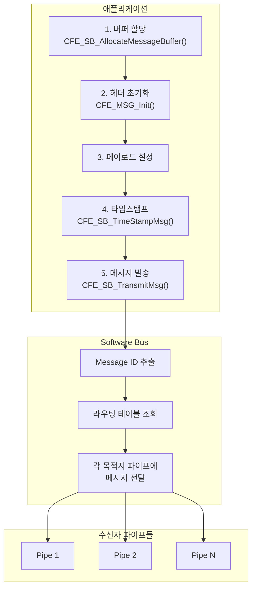
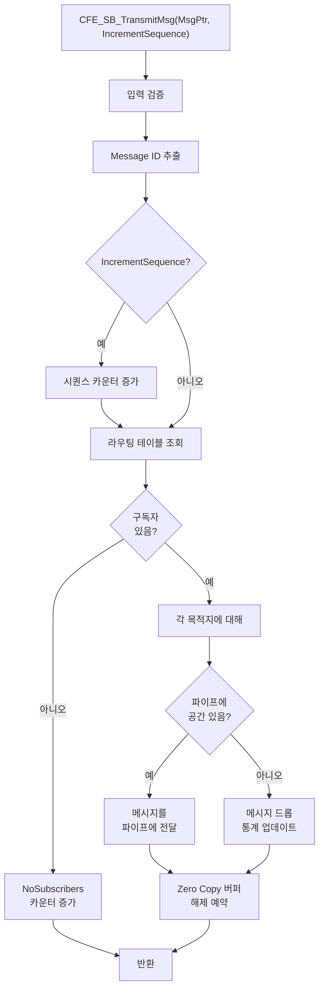
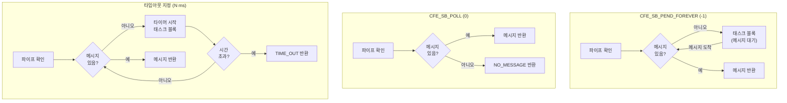
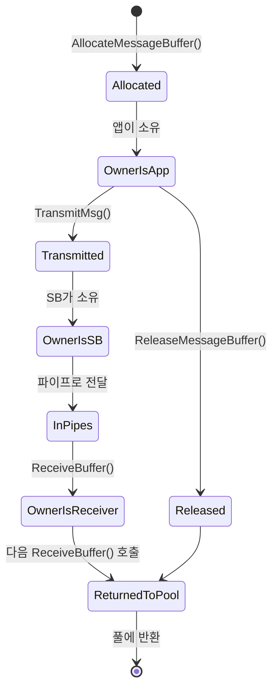

# Phase 2 SB-07: 메시지 송수신 함수 분석

## 서론

Software Bus를 통한 메시지 통신의 핵심은 메시지 송수신 함수들이다. cFE는 메시지를 발송하기 위한 `CFE_SB_TransmitMsg()` 함수와 메시지를 수신하기 위한 `CFE_SB_ReceiveBuffer()` 함수를 제공한다. 이 두 함수는 cFS 애플리케이션 개발에서 가장 빈번하게 사용되는 API이다.

본 문서에서는 이 핵심 함수들의 상세한 동작 원리, 내부 구현, 그리고 효과적인 사용 방법을 살펴본다. 또한 메시지 버퍼 관리와 Zero Copy 메커니즘에 대해서도 다룬다.

---

## 1. 메시지 송신 개요

### 1.1 메시지 송신 흐름

애플리케이션에서 메시지를 발송하는 전체 흐름은 다음과 같다.



### 1.2 버퍼 할당 방식

메시지를 송신할 때 두 가지 버퍼 할당 방식을 사용할 수 있다.

| 방식 | 장점 | 단점 | 사용 시나리오 |
|:---|:---|:---|:---|
| **동적 할당** | 메모리 효율적, Zero Copy 가능 | 할당 실패 가능성 | 일반적인 텔레메트리 |
| **정적 할당** | 할당 실패 없음, 예측 가능 | 메모리 고정 사용 | 주기적 HK, 안전 중요 |

---

## 2. CFE_SB_AllocateMessageBuffer

### 2.1 함수 개요

`CFE_SB_AllocateMessageBuffer()` 함수는 SB 메시지 버퍼 풀에서 메시지 버퍼를 할당한다. 이 함수는 Zero Copy 메시지 전송의 핵심이다.

```c
/**
 * @brief 메시지 버퍼 할당
 *
 * SB 버퍼 풀에서 지정된 크기의 버퍼를 할당한다.
 * 이 버퍼는 Zero Copy 메시지 전송에 사용된다.
 *
 * @param MsgSize  필요한 버퍼 크기 (바이트)
 *
 * @return 할당된 버퍼 포인터
 * @return NULL 할당 실패
 *
 * @note 할당된 버퍼는 CFE_SB_TransmitMsg()로 전송되거나
 *       CFE_SB_ReleaseMessageBuffer()로 해제되어야 한다.
 */
CFE_SB_Buffer_t *CFE_SB_AllocateMessageBuffer(size_t MsgSize);
```

### 2.2 사용 예시

```c
/* 버퍼 할당 및 사용 */
MY_APP_HkTlm_t *HkMsgPtr;

HkMsgPtr = (MY_APP_HkTlm_t *)CFE_SB_AllocateMessageBuffer(sizeof(*HkMsgPtr));

if (HkMsgPtr == NULL)
{
    /* 버퍼 할당 실패 처리 */
    CFE_EVS_SendEvent(MY_APP_BUF_ERR_EID,
                      CFE_EVS_EventType_ERROR,
                      "Failed to allocate message buffer");
    return;
}

/* 헤더 초기화 */
CFE_MSG_Init(&HkMsgPtr->TelemetryHeader.Msg,
             CFE_SB_ValueToMsgId(MY_APP_HK_TLM_MID),
             sizeof(*HkMsgPtr));

/* 페이로드 설정 */
HkMsgPtr->Payload.CmdCounter = MY_APP_Data.CmdCounter;
HkMsgPtr->Payload.CmdErrCounter = MY_APP_Data.CmdErrCounter;

/* 타임스탬프 */
CFE_SB_TimeStampMsg(&HkMsgPtr->TelemetryHeader.Msg);

/* 전송 (버퍼 소유권 이전) */
CFE_SB_TransmitMsg(&HkMsgPtr->TelemetryHeader.Msg, true);
/* 이후 HkMsgPtr 사용 금지! */
```

### 2.3 버퍼 풀 구성

SB 버퍼 풀은 플랫폼 구성 파라미터로 크기가 결정된다.

```c
/* platform_cfg.h */
#define CFE_PLATFORM_SB_BUF_MEMORY_BYTES    524288  /* 512KB */
```

버퍼 풀이 고갈되면 `CFE_SB_AllocateMessageBuffer()`가 NULL을 반환한다. 따라서 항상 반환값을 확인해야 한다.

---

## 3. CFE_SB_TransmitMsg

### 3.1 함수 개요

`CFE_SB_TransmitMsg()` 함수는 메시지를 Software Bus에 발행한다. 이 함수가 호출되면 SB는 메시지의 Message ID를 확인하고, 해당 ID를 구독한 모든 파이프에 메시지를 전달한다.

```c
/**
 * @brief 메시지 발송
 *
 * 메시지를 SB에 발행하여 구독자들에게 전달한다.
 *
 * @param MsgPtr             발송할 메시지
 * @param IncrementSequence  시퀀스 카운터 증가 여부
 *
 * @return CFE_SUCCESS 성공
 * @return CFE_SB_BAD_ARGUMENT 잘못된 인자
 *
 * @note IncrementSequence가 true이면 SB가 시퀀스 카운터를 자동으로 관리한다.
 *       Zero Copy 버퍼 사용 시, 전송 후 버퍼 소유권이 SB로 이전된다.
 */
CFE_Status_t CFE_SB_TransmitMsg(const CFE_MSG_Message_t *MsgPtr,
                                 bool IncrementSequence);
```

### 3.2 동작 원리

`CFE_SB_TransmitMsg()` 함수의 내부 동작을 이해하는 것이 중요하다.



### 3.3 시퀀스 카운터 관리

시퀀스 카운터는 패킷 손실을 감지하는 데 사용된다. `IncrementSequence` 파라미터가 `true`이면 SB가 자동으로 해당 Message ID의 시퀀스 카운터를 증가시킨다.

```c
/* 일반적인 사용: 시퀀스 자동 증가 */
CFE_SB_TransmitMsg(&MsgPtr->TelemetryHeader.Msg, true);
/*
 * SB가 CCSDS Primary Header의 Sequence Count 필드를
 * 자동으로 업데이트한다.
 */

/* 특수 경우: 시퀀스 수동 관리 */
CFE_MSG_SetSequenceCount(&MsgPtr->TelemetryHeader.Msg, MySequenceCount);
CFE_SB_TransmitMsg(&MsgPtr->TelemetryHeader.Msg, false);
/*
 * 앱이 직접 시퀀스 카운터를 설정한 경우.
 * 예: 외부 소스에서 수신한 메시지 재발행
 */
```

### 3.4 Zero Copy vs Copy 모드

`CFE_SB_AllocateMessageBuffer()`로 할당한 버퍼는 Zero Copy 모드로 전송된다. 정적 버퍼를 사용하면 Copy 모드로 전송된다.

```c
/* Zero Copy 모드 */
MY_APP_Tlm_t *TlmPtr;
TlmPtr = (MY_APP_Tlm_t *)CFE_SB_AllocateMessageBuffer(sizeof(*TlmPtr));
CFE_MSG_Init(&TlmPtr->TelemetryHeader.Msg, MsgId, sizeof(*TlmPtr));
/* 페이로드 설정... */
CFE_SB_TransmitMsg(&TlmPtr->TelemetryHeader.Msg, true);
/* 버퍼 소유권이 SB로 이전됨. TlmPtr 사용 금지! */


/* Copy 모드 (정적 버퍼) */
static MY_APP_Tlm_t StaticTlm;
CFE_MSG_Init(&StaticTlm.TelemetryHeader.Msg, MsgId, sizeof(StaticTlm));
/* 페이로드 설정... */
CFE_SB_TransmitMsg(&StaticTlm.TelemetryHeader.Msg, false);
/* 버퍼를 계속 사용할 수 있음 */
```

---

## 4. CFE_SB_ReceiveBuffer

### 4.1 함수 개요

`CFE_SB_ReceiveBuffer()` 함수는 지정된 파이프에서 메시지를 수신한다.

```c
/**
 * @brief 파이프에서 메시지 수신
 *
 * @param BufPtr    수신된 메시지 버퍼 포인터 (출력)
 * @param PipeId    수신할 파이프 ID
 * @param TimeOut   대기 시간
 *                  CFE_SB_PEND_FOREVER (-1): 무한 대기
 *                  CFE_SB_POLL (0): 즉시 반환
 *                  양수: 밀리초 단위 대기
 *
 * @return CFE_SUCCESS 메시지 수신 성공
 * @return CFE_SB_NO_MESSAGE 메시지 없음 (POLL 모드)
 * @return CFE_SB_TIME_OUT 시간 초과
 * @return CFE_SB_PIPE_RD_ERR 파이프 읽기 오류
 * @return CFE_SB_BAD_ARGUMENT 잘못된 인자
 */
CFE_Status_t CFE_SB_ReceiveBuffer(CFE_SB_Buffer_t **BufPtr,
                                   CFE_SB_PipeId_t PipeId,
                                   int32 TimeOut);
```

### 4.2 타임아웃 옵션 상세

세 가지 타임아웃 옵션의 동작을 이해하는 것이 중요하다.



### 4.3 타임아웃 선택 가이드

| 시나리오 | 권장 타임아웃 | 이유 |
|:---|:---|:---|
| 단순 메시지 기반 앱 | `PEND_FOREVER` | 메시지가 없으면 유휴 상태 |
| 주기적 작업 필요 | 타임아웃 지정 | 타임아웃 시 주기 작업 수행 |
| 다중 파이프 사용 | `POLL` | 여러 파이프 순회 |
| 백그라운드 작업 있음 | 타임아웃 지정 | 유휴 시간에 백그라운드 처리 |

### 4.4 메시지 수신 패턴

```c
/* 패턴 1: 단순 메시지 기반 (가장 일반적) */
void MY_APP_TaskMain_Simple(void)
{
    CFE_SB_Buffer_t *BufPtr;
    CFE_Status_t Status;
    
    while (CFE_ES_RunLoop(&MY_APP_Data.RunStatus))
    {
        Status = CFE_SB_ReceiveBuffer(&BufPtr,
                                      MY_APP_Data.CmdPipeId,
                                      CFE_SB_PEND_FOREVER);
        
        if (Status == CFE_SUCCESS)
        {
            MY_APP_ProcessMessage(BufPtr);
        }
    }
}

/* 패턴 2: 타임아웃과 주기 작업 */
void MY_APP_TaskMain_Periodic(void)
{
    CFE_SB_Buffer_t *BufPtr;
    CFE_Status_t Status;
    uint32 LastPeriodicTime = 0;
    
    while (CFE_ES_RunLoop(&MY_APP_Data.RunStatus))
    {
        Status = CFE_SB_ReceiveBuffer(&BufPtr,
                                      MY_APP_Data.CmdPipeId,
                                      100);  /* 100ms 타임아웃 */
        
        if (Status == CFE_SUCCESS)
        {
            MY_APP_ProcessMessage(BufPtr);
        }
        
        /* 타임아웃이던 메시지 수신이던 주기 작업 확인 */
        if ((GetCurrentTime() - LastPeriodicTime) >= 1000)
        {
            MY_APP_PeriodicTask();
            LastPeriodicTime = GetCurrentTime();
        }
    }
}

/* 패턴 3: 다중 파이프 폴링 */
void MY_APP_TaskMain_MultiPipe(void)
{
    CFE_SB_Buffer_t *BufPtr;
    CFE_Status_t Status;
    
    while (CFE_ES_RunLoop(&MY_APP_Data.RunStatus))
    {
        /* 우선순위 높은 파이프 먼저 (폴링) */
        while ((Status = CFE_SB_ReceiveBuffer(&BufPtr,
                                               MY_APP_Data.HighPriPipeId,
                                               CFE_SB_POLL)) == CFE_SUCCESS)
        {
            MY_APP_ProcessHighPri(BufPtr);
        }
        
        /* 일반 파이프 (타임아웃) */
        Status = CFE_SB_ReceiveBuffer(&BufPtr,
                                      MY_APP_Data.NormalPipeId,
                                      50);  /* 50ms */
        if (Status == CFE_SUCCESS)
        {
            MY_APP_ProcessNormal(BufPtr);
        }
    }
}
```

---

## 5. CFE_SB_ReleaseMessageBuffer

### 5.1 함수 개요

`CFE_SB_ReleaseMessageBuffer()` 함수는 `CFE_SB_AllocateMessageBuffer()`로 할당한 버퍼를 해제한다. 이 함수는 버퍼를 전송하지 않고 해제해야 할 때 사용한다.

```c
/**
 * @brief 메시지 버퍼 해제
 *
 * AllocateMessageBuffer로 할당한 버퍼를 풀에 반환한다.
 * TransmitMsg를 호출하지 않는 경우에만 사용한다.
 *
 * @param BufPtr  해제할 버퍼 포인터
 *
 * @return CFE_SUCCESS 성공
 * @return CFE_SB_BUFFER_INVALID 잘못된 버퍼
 */
CFE_Status_t CFE_SB_ReleaseMessageBuffer(CFE_SB_Buffer_t *BufPtr);
```

### 5.2 사용 시나리오

```c
void MY_APP_SendDataIfValid(void)
{
    MY_APP_Data_t *DataPtr;
    
    /* 버퍼 할당 */
    DataPtr = (MY_APP_Data_t *)CFE_SB_AllocateMessageBuffer(sizeof(*DataPtr));
    
    if (DataPtr == NULL)
    {
        return;
    }
    
    /* 헤더 초기화 */
    CFE_MSG_Init(&DataPtr->TelemetryHeader.Msg,
                 CFE_SB_ValueToMsgId(MY_APP_DATA_MID),
                 sizeof(*DataPtr));
    
    /* 데이터 수집 시도 */
    if (!CollectData(&DataPtr->Payload))
    {
        /* 데이터 수집 실패 - 버퍼 해제 */
        CFE_SB_ReleaseMessageBuffer((CFE_SB_Buffer_t *)DataPtr);
        
        CFE_EVS_SendEvent(MY_APP_DATA_ERR_EID,
                          CFE_EVS_EventType_ERROR,
                          "Data collection failed, message not sent");
        return;
    }
    
    /* 데이터 유효 - 메시지 전송 */
    CFE_SB_TimeStampMsg(&DataPtr->TelemetryHeader.Msg);
    CFE_SB_TransmitMsg(&DataPtr->TelemetryHeader.Msg, true);
    /* 전송 후에는 ReleaseMessageBuffer 호출 불필요 */
}
```

---

## 6. 타임스탬프 함수

### 6.1 CFE_SB_TimeStampMsg

텔레메트리 메시지에 현재 시간을 기록하는 편의 함수이다.

```c
/**
 * @brief 메시지에 현재 시간 기록
 *
 * 현재 우주선 시간을 조회하여 메시지 헤더에 설정한다.
 *
 * @param MsgPtr  타임스탬프를 설정할 메시지
 */
void CFE_SB_TimeStampMsg(CFE_MSG_Message_t *MsgPtr);
```

### 6.2 사용 패턴

```c
/* 기본 사용 */
MY_APP_Tlm_t *TlmPtr;
TlmPtr = (MY_APP_Tlm_t *)CFE_SB_AllocateMessageBuffer(sizeof(*TlmPtr));

CFE_MSG_Init(&TlmPtr->TelemetryHeader.Msg, MsgId, sizeof(*TlmPtr));

/* 페이로드 설정... */

/* 마지막에 타임스탬프 설정 (현재 시간) */
CFE_SB_TimeStampMsg(&TlmPtr->TelemetryHeader.Msg);

CFE_SB_TransmitMsg(&TlmPtr->TelemetryHeader.Msg, true);
```

```c
/* 특정 시간 설정이 필요한 경우 */
CFE_TIME_SysTime_t SpecificTime;
SpecificTime = GetDataAcquisitionTime();  /* 데이터 획득 시간 */

CFE_MSG_SetMsgTime(&TlmPtr->TelemetryHeader.Msg, SpecificTime);
/* CFE_SB_TimeStampMsg 대신 직접 설정 */
```

---

## 7. 메시지 버퍼 수명주기

### 7.1 Zero Copy 버퍼 수명주기

Zero Copy 버퍼의 소유권은 다음과 같이 이전된다.



### 7.2 중요 규칙

```c
/* 규칙 1: 할당 후 반드시 전송 또는 해제 */
void Rule1_AlwaysHandleBuffer(void)
{
    MyMsg_t *MsgPtr = (MyMsg_t *)CFE_SB_AllocateMessageBuffer(sizeof(*MsgPtr));
    
    if (MsgPtr == NULL) return;
    
    /* 반드시 다음 중 하나를 수행해야 함 */
    if (condition)
    {
        CFE_SB_TransmitMsg(&MsgPtr->Header.Msg, true);
    }
    else
    {
        CFE_SB_ReleaseMessageBuffer((CFE_SB_Buffer_t *)MsgPtr);
    }
    /* 버퍼가 처리되지 않으면 메모리 누수 발생! */
}

/* 규칙 2: 전송 후 버퍼 사용 금지 */
void Rule2_NoUseAfterTransmit(void)
{
    MyMsg_t *MsgPtr = (MyMsg_t *)CFE_SB_AllocateMessageBuffer(sizeof(*MsgPtr));
    
    /* ... 초기화 ... */
    
    CFE_SB_TransmitMsg(&MsgPtr->Header.Msg, true);
    
    /* 오류! 전송 후 버퍼 접근 */
    /* MsgPtr->Payload.Value = 10; */  /* 절대 금지! */
    /* 버퍼 소유권이 SB로 이전되었음 */
}

/* 규칙 3: 수신 버퍼는 읽기 전용 */
void Rule3_ReceivedBufferReadOnly(void)
{
    CFE_SB_Buffer_t *BufPtr;
    CFE_SB_ReceiveBuffer(&BufPtr, PipeId, CFE_SB_PEND_FOREVER);
    
    /* 수신 버퍼 읽기는 OK */
    MyMsg_t *MsgPtr = (MyMsg_t *)BufPtr;
    uint32 Value = MsgPtr->Payload.Value;  /* OK */
    
    /* 수신 버퍼 수정은 피해야 함 */
    /* MsgPtr->Payload.Value = 0; */  /* 비권장! */
    /* 다른 구독자에게 영향을 줄 수 있음 */
}
```

---

## 8. 에러 처리

### 8.1 송신 에러 처리

```c
CFE_Status_t MY_APP_SendMessage(MY_APP_Msg_t *MsgPtr)
{
    CFE_Status_t Status;
    
    Status = CFE_SB_TransmitMsg(&MsgPtr->Header.Msg, true);
    
    switch (Status)
    {
        case CFE_SUCCESS:
            MY_APP_Data.MsgSentCount++;
            break;
            
        case CFE_SB_BAD_ARGUMENT:
            CFE_EVS_SendEvent(MY_APP_TX_ERR_EID,
                              CFE_EVS_EventType_ERROR,
                              "TransmitMsg: Bad argument");
            MY_APP_Data.MsgErrCount++;
            break;
            
        default:
            CFE_EVS_SendEvent(MY_APP_TX_ERR_EID,
                              CFE_EVS_EventType_ERROR,
                              "TransmitMsg error: 0x%08X",
                              (unsigned int)Status);
            MY_APP_Data.MsgErrCount++;
            break;
    }
    
    return Status;
}
```

### 8.2 수신 에러 처리

```c
void MY_APP_MainLoop(void)
{
    CFE_SB_Buffer_t *BufPtr;
    CFE_Status_t Status;
    
    while (CFE_ES_RunLoop(&MY_APP_Data.RunStatus))
    {
        Status = CFE_SB_ReceiveBuffer(&BufPtr,
                                      MY_APP_Data.PipeId,
                                      CFE_SB_PEND_FOREVER);
        
        switch (Status)
        {
            case CFE_SUCCESS:
                MY_APP_ProcessMessage(BufPtr);
                break;
                
            case CFE_SB_TIME_OUT:
                /* 타임아웃 - 정상적인 경우일 수 있음 */
                MY_APP_PeriodicTask();
                break;
                
            case CFE_SB_NO_MESSAGE:
                /* POLL 모드에서 메시지 없음 - 정상 */
                break;
                
            case CFE_SB_PIPE_RD_ERR:
                CFE_EVS_SendEvent(MY_APP_RX_ERR_EID,
                                  CFE_EVS_EventType_ERROR,
                                  "Pipe read error");
                /* 심각한 오류 - 앱 종료 고려 */
                MY_APP_Data.RunStatus = CFE_ES_RunStatus_APP_ERROR;
                break;
                
            default:
                CFE_EVS_SendEvent(MY_APP_RX_ERR_EID,
                                  CFE_EVS_EventType_ERROR,
                                  "Unexpected ReceiveBuffer status: 0x%08X",
                                  (unsigned int)Status);
                break;
        }
    }
}
```

---

## 9. 성능 고려사항

### 9.1 버퍼 할당 최적화

```c
/* 비효율적: 매번 동적 할당 */
void IneffcientSend(void)
{
    for (int i = 0; i < 100; i++)
    {
        MyMsg_t *Msg = (MyMsg_t *)CFE_SB_AllocateMessageBuffer(sizeof(*Msg));
        /* ... 설정 ... */
        CFE_SB_TransmitMsg(&Msg->Header.Msg, true);
    }
}

/* 효율적: 정적 버퍼 재사용 (빈도가 높은 경우) */
static MyMsg_t StaticMsg;
static bool Initialized = false;

void EfficientSend(void)
{
    if (!Initialized)
    {
        CFE_MSG_Init(&StaticMsg.Header.Msg, MsgId, sizeof(StaticMsg));
        Initialized = true;
    }
    
    for (int i = 0; i < 100; i++)
    {
        /* 타임스탬프만 업데이트 */
        CFE_SB_TimeStampMsg(&StaticMsg.Header.Msg);
        /* ... 페이로드 업데이트 ... */
        CFE_SB_TransmitMsg(&StaticMsg.Header.Msg, false);
    }
}
```

### 9.2 메시지 크기 최적화

| 메시지 크기 | 영향 | 권장사항 |
|:---|:---|:---|
| 작은 메시지 (< 64B) | 오버헤드 비율 높음 | 여러 정보 결합 고려 |
| 중간 메시지 (64-512B) | 최적 | 일반적인 HK 크기 |
| 큰 메시지 (> 1KB) | 복사 시간 증가 | 분할 또는 참조 고려 |

### 9.3 파이프 튜닝

```c
/* 고빈도 메시지에 대한 파이프 최적화 */

/* 높은 메시지 제한으로 구독 */
CFE_SB_SubscribeEx(CFE_SB_ValueToMsgId(HIGH_FREQ_DATA_MID),
                   DataPipeId,
                   QoS,
                   50);  /* 최대 50개 버퍼링 */

/* 파이프 깊이도 충분히 설정 */
CFE_SB_CreatePipe(&DataPipeId,
                  64,  /* 파이프 깊이 */
                  "DATA_PIPE");
```

---

## 결론

메시지 송수신 함수는 cFS 애플리케이션의 핵심 통신 메커니즘이다. `CFE_SB_TransmitMsg()`와 `CFE_SB_ReceiveBuffer()` 함수의 올바른 사용은 안정적이고 효율적인 애플리케이션 개발에 필수적이다.

핵심 개념을 정리하면 다음과 같다:
- **버퍼 할당**: `CFE_SB_AllocateMessageBuffer()`로 Zero Copy 버퍼 할당
- **메시지 송신**: `CFE_SB_TransmitMsg()`로 SB에 발행
- **메시지 수신**: `CFE_SB_ReceiveBuffer()`로 파이프에서 수신
- **타임아웃**: PEND_FOREVER, POLL, 지정 시간 중 선택
- **버퍼 수명주기**: 소유권 이전 규칙 준수 필수
- **에러 처리**: 모든 반환값 확인

다음 문서에서는 구독 및 해제 메커니즘을 더 상세히 살펴볼 것이다.

---

## 참고 문헌

1. NASA, "cFE Application Developer's Guide"
2. NASA, "Software Bus User's Guide"
3. NASA cFE GitHub, cfe/modules/sb/fsw/src/
4. NASA, "cFS Performance Tuning Guide"

---

[이전 문서: Phase 2 SB-06: 파이프(Pipe) 개념과 관리](./Phase2_SB_06_파이프_개념과_관리.md)

[다음 문서: Phase 2 SB-08: 구독 및 해제 메커니즘](./Phase2_SB_08_구독_및_해제_메커니즘.md)
