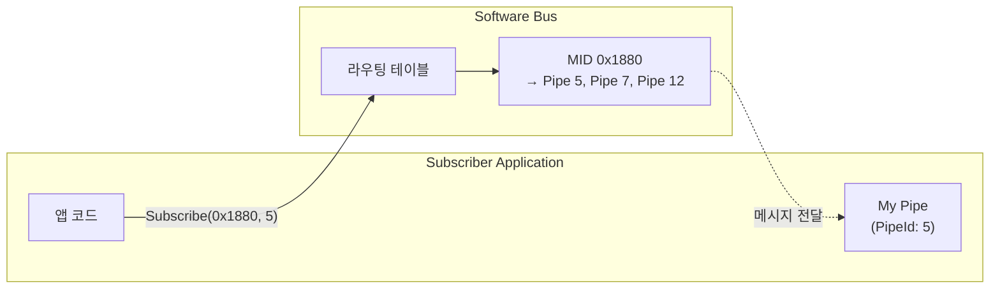
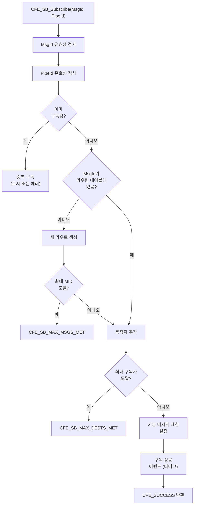
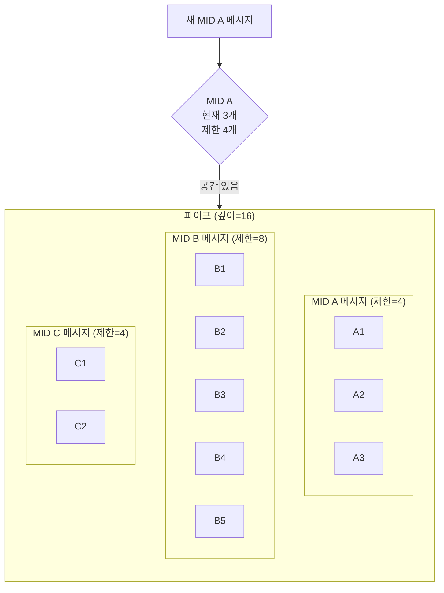
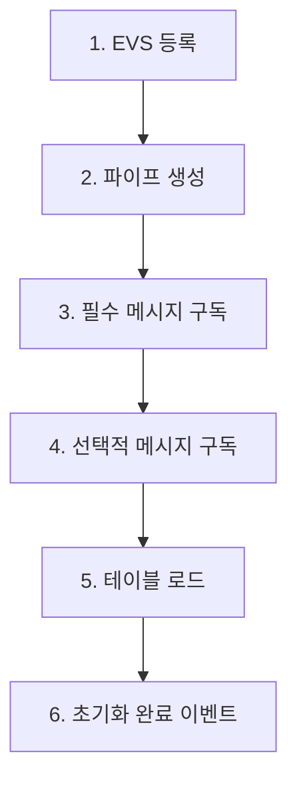

# Phase 2 SB-08: 구독 및 해제 메커니즘

## 서론

Publish/Subscribe 패턴의 핵심은 구독(Subscription) 메커니즘이다. cFS Software Bus에서 애플리케이션은 관심 있는 Message ID를 자신의 파이프에 구독함으로써 해당 메시지를 수신하게 된다. 구독은 런타임에 동적으로 등록하거나 해제할 수 있으며, 이러한 유연성은 시스템의 동적 재구성을 가능하게 한다.

본 문서에서는 `CFE_SB_Subscribe()`, `CFE_SB_SubscribeEx()`, `CFE_SB_Unsubscribe()` 함수들의 상세한 동작 원리와 사용 패턴을 살펴본다.

---

## 1. 구독 메커니즘 개요

### 1.1 구독의 의미

구독(Subscription)은 SB에게 "이 Message ID의 메시지가 발행되면 내 파이프로 전달해 달라"고 요청하는 것이다. 구독이 성공하면 SB의 라우팅 테이블에 해당 Message ID와 파이프 간의 매핑이 등록된다.



### 1.2 구독 관련 함수

cFE SB는 세 가지 구독 관련 함수를 제공한다.

| 함수 | 설명 |
|:---|:---|
| `CFE_SB_Subscribe()` | 기본 구독 함수 |
| `CFE_SB_SubscribeEx()` | 확장 구독 (메시지 제한, QoS 지정) |
| `CFE_SB_Unsubscribe()` | 구독 해제 |

---

## 2. CFE_SB_Subscribe

### 2.1 함수 정의

```c
/**
 * @brief Message ID 구독
 *
 * 지정된 Message ID를 파이프에 구독한다.
 * 해당 MID의 메시지가 발행되면 파이프로 전달된다.
 *
 * @param MsgId   구독할 Message ID
 * @param PipeId  메시지를 수신할 파이프 ID
 *
 * @return CFE_SUCCESS 성공
 * @return CFE_SB_BAD_ARGUMENT 잘못된 MsgId 또는 PipeId
 * @return CFE_SB_MAX_MSGS_MET 최대 Message ID 수 초과
 * @return CFE_SB_MAX_DESTS_MET 해당 MID의 최대 구독자 수 초과
 * @return CFE_SB_BUF_ALOC_ERR 내부 버퍼 할당 실패
 */
CFE_Status_t CFE_SB_Subscribe(CFE_SB_MsgId_t MsgId, 
                               CFE_SB_PipeId_t PipeId);
```

### 2.2 사용 예시

```c
CFE_Status_t MY_APP_SetupSubscriptions(void)
{
    CFE_Status_t Status;
    
    /* 앱 명령 메시지 구독 */
    Status = CFE_SB_Subscribe(CFE_SB_ValueToMsgId(MY_APP_CMD_MID),
                              MY_APP_Data.CmdPipeId);
    if (Status != CFE_SUCCESS)
    {
        CFE_EVS_SendEvent(MY_APP_SUB_ERR_EID,
                          CFE_EVS_EventType_ERROR,
                          "Failed to subscribe CMD_MID: RC=0x%08X",
                          (unsigned int)Status);
        return Status;
    }
    
    /* HK 요청 메시지 구독 */
    Status = CFE_SB_Subscribe(CFE_SB_ValueToMsgId(MY_APP_SEND_HK_MID),
                              MY_APP_Data.CmdPipeId);
    if (Status != CFE_SUCCESS)
    {
        CFE_EVS_SendEvent(MY_APP_SUB_ERR_EID,
                          CFE_EVS_EventType_ERROR,
                          "Failed to subscribe SEND_HK_MID: RC=0x%08X",
                          (unsigned int)Status);
        return Status;
    }
    
    CFE_EVS_SendEvent(MY_APP_SUB_INF_EID,
                      CFE_EVS_EventType_INFORMATION,
                      "Subscriptions established successfully");
    
    return CFE_SUCCESS;
}
```

### 2.3 내부 동작

`CFE_SB_Subscribe()` 함수가 호출되면 다음 과정이 수행된다.



---

## 3. CFE_SB_SubscribeEx

### 3.1 함수 정의

`CFE_SB_SubscribeEx()`는 확장 구독 함수로, 메시지 제한과 QoS를 지정할 수 있다.

```c
/**
 * @brief 확장 Message ID 구독
 *
 * 추가 옵션을 지정하여 구독한다.
 *
 * @param MsgId   구독할 Message ID
 * @param PipeId  메시지를 수신할 파이프 ID
 * @param Quality QoS 설정 (현재 미구현, 향후 확장용)
 * @param MsgLim  해당 MID에 대한 파이프 내 최대 메시지 수
 *
 * @return CFE_SUCCESS 및 기타 에러 코드 (Subscribe와 동일)
 */
CFE_Status_t CFE_SB_SubscribeEx(CFE_SB_MsgId_t MsgId,
                                 CFE_SB_PipeId_t PipeId,
                                 CFE_SB_Qos_t Quality,
                                 uint16 MsgLim);
```

### 3.2 메시지 제한(MsgLim)의 역할

메시지 제한은 특정 Message ID가 파이프에 쌓일 수 있는 최대 메시지 수를 지정한다. 이 제한에 도달하면 해당 MID의 추가 메시지는 드롭된다. 이 메커니즘은 하나의 고빈도 메시지가 파이프를 독점하는 것을 방지한다.



### 3.3 사용 예시

```c
CFE_Status_t MY_APP_SetupAdvancedSubscriptions(void)
{
    CFE_Status_t Status;
    CFE_SB_Qos_t QoS = {0, 0};  /* QoS 기본값 */
    
    /*
     * 명령 메시지: 저빈도, 작은 제한
     * - 명령은 자주 오지 않으므로 4개면 충분
     */
    Status = CFE_SB_SubscribeEx(CFE_SB_ValueToMsgId(MY_APP_CMD_MID),
                                MY_APP_Data.CmdPipeId,
                                QoS,
                                4);
    if (Status != CFE_SUCCESS)
    {
        return Status;
    }
    
    /*
     * HK 요청: 1Hz, 아주 작은 제한
     * - 1Hz이므로 2개면 충분
     */
    Status = CFE_SB_SubscribeEx(CFE_SB_ValueToMsgId(MY_APP_SEND_HK_MID),
                                MY_APP_Data.CmdPipeId,
                                QoS,
                                2);
    if (Status != CFE_SUCCESS)
    {
        return Status;
    }
    
    /*
     * 센서 데이터: 고빈도, 큰 제한
     * - 10Hz 데이터이므로 처리 지연 대비 충분한 버퍼
     */
    Status = CFE_SB_SubscribeEx(CFE_SB_ValueToMsgId(SENSOR_DATA_MID),
                                MY_APP_Data.DataPipeId,
                                QoS,
                                20);
    if (Status != CFE_SUCCESS)
    {
        return Status;
    }
    
    return CFE_SUCCESS;
}
```

### 3.4 메시지 제한 결정 가이드

| 메시지 유형 | 권장 제한 | 근거 |
|:---|:---:|:---|
| 명령 | 2-4 | 저빈도, 즉시 처리 |
| HK 요청 | 1-2 | 1Hz, 최신만 필요 |
| 고빈도 데이터 | 빈도 × 2 | 처리 지연 대비 |
| 비동기 이벤트 | 상황별 | 버스트 가능성 고려 |

---

## 4. CFE_SB_Unsubscribe

### 4.1 함수 정의

```c
/**
 * @brief Message ID 구독 해제
 *
 * 지정된 Message ID에 대한 구독을 해제한다.
 * 이후 해당 MID의 메시지는 파이프로 전달되지 않는다.
 *
 * @param MsgId   구독 해제할 Message ID
 * @param PipeId  해당 파이프 ID
 *
 * @return CFE_SUCCESS 성공
 * @return CFE_SB_NO_SUBSCRIBERS 해당 구독 없음
 * @return CFE_SB_BAD_ARGUMENT 잘못된 인자
 */
CFE_Status_t CFE_SB_Unsubscribe(CFE_SB_MsgId_t MsgId,
                                 CFE_SB_PipeId_t PipeId);
```

### 4.2 사용 시나리오

구독 해제는 다음 상황에서 사용된다.

```c
/* 시나리오 1: 동작 모드 변경 */
void MY_APP_ChangeMode(uint8 NewMode)
{
    CFE_Status_t Status;
    
    if (NewMode == SCIENCE_MODE)
    {
        /* Science 모드 진입 - 관련 데이터 구독 */
        Status = CFE_SB_Subscribe(CFE_SB_ValueToMsgId(SCIENCE_DATA_MID),
                                  MY_APP_Data.DataPipeId);
    }
    else
    {
        /* Science 모드 해제 - 구독 해제 */
        Status = CFE_SB_Unsubscribe(CFE_SB_ValueToMsgId(SCIENCE_DATA_MID),
                                    MY_APP_Data.DataPipeId);
    }
    
    if (Status != CFE_SUCCESS)
    {
        CFE_EVS_SendEvent(MY_APP_MODE_ERR_EID,
                          CFE_EVS_EventType_ERROR,
                          "Mode change subscription error: 0x%08X",
                          (unsigned int)Status);
    }
}

/* 시나리오 2: 자원 해제 (앱 종료 시) */
void MY_APP_Cleanup(void)
{
    /* 개별 구독 해제 (선택적) */
    CFE_SB_Unsubscribe(CFE_SB_ValueToMsgId(MY_APP_CMD_MID),
                       MY_APP_Data.CmdPipeId);
    CFE_SB_Unsubscribe(CFE_SB_ValueToMsgId(MY_APP_SEND_HK_MID),
                       MY_APP_Data.CmdPipeId);
    
    /* 파이프 삭제 (모든 구독 자동 해제) */
    CFE_SB_DeletePipe(MY_APP_Data.CmdPipeId);
}

/* 시나리오 3: 조건부 데이터 수신 */
void MY_APP_ToggleDataFeed(bool Enable)
{
    CFE_Status_t Status;
    static bool CurrentlyEnabled = false;
    
    if (Enable && !CurrentlyEnabled)
    {
        Status = CFE_SB_Subscribe(CFE_SB_ValueToMsgId(TELEMETRY_FEED_MID),
                                  MY_APP_Data.DataPipeId);
        if (Status == CFE_SUCCESS)
        {
            CurrentlyEnabled = true;
            CFE_EVS_SendEvent(MY_APP_FEED_INF_EID,
                              CFE_EVS_EventType_INFORMATION,
                              "Telemetry feed enabled");
        }
    }
    else if (!Enable && CurrentlyEnabled)
    {
        Status = CFE_SB_Unsubscribe(CFE_SB_ValueToMsgId(TELEMETRY_FEED_MID),
                                    MY_APP_Data.DataPipeId);
        if (Status == CFE_SUCCESS)
        {
            CurrentlyEnabled = false;
            CFE_EVS_SendEvent(MY_APP_FEED_INF_EID,
                              CFE_EVS_EventType_INFORMATION,
                              "Telemetry feed disabled");
        }
    }
}
```

---

## 5. 구독 정보 조회

### 5.1 라우팅 정보 덤프

SB는 현재 라우팅 테이블을 파일로 덤프하는 명령을 제공한다.

```c
/* 지상 명령: Write Routing Info */
/* CFE_SB_WRITE_ROUTING_INFO_CC */

/* 결과 파일 형식 예시:
 *
 * Message ID: 0x1880
 *   Dest 1: Pipe=MY_APP_CMD, App=MY_APP, MsgLim=4, BuffCnt=0
 *   Dest 2: Pipe=LOG_PIPE, App=LOGGER, MsgLim=8, BuffCnt=2
 *
 * Message ID: 0x0880
 *   Dest 1: Pipe=TO_OUTPUT, App=TO_LAB, MsgLim=10, BuffCnt=0
 *   Dest 2: Pipe=RECORDER, App=DS, MsgLim=16, BuffCnt=5
 */
```

### 5.2 파이프 정보 덤프

파이프별 구독 정보도 조회할 수 있다.

```c
/* 지상 명령: Write Pipe Info */
/* CFE_SB_WRITE_PIPE_INFO_CC */

/* 결과 파일 형식 예시:
 *
 * Pipe ID: 5
 *   Name: MY_APP_CMD
 *   Owner: MY_APP
 *   Depth: 16
 *   InUse: 3
 *   Peak: 12
 *   Subscriptions:
 *     MID 0x1880 (MsgLim=4)
 *     MID 0x1940 (MsgLim=2)
 *     MID 0x0850 (MsgLim=10)
 */
```

---

## 6. 구독 관련 에러 처리

### 6.1 에러 코드 상세

| 에러 코드 | 의미 | 대응 방법 |
|:---|:---|:---|
| `CFE_SB_MAX_MSGS_MET` | 최대 MID 수 초과 | 구성 파라미터 증가 또는 불필요한 구독 정리 |
| `CFE_SB_MAX_DESTS_MET` | 해당 MID 최대 구독자 초과 | 구성 파라미터 증가 또는 설계 검토 |
| `CFE_SB_BAD_ARGUMENT` | 잘못된 MID 또는 PipeId | 코드 수정 필요 |
| `CFE_SB_NO_SUBSCRIBERS` | 구독 해제할 대상 없음 | 구독 상태 확인 |

### 6.2 에러 처리 패턴

```c
CFE_Status_t MY_APP_SafeSubscribe(CFE_SB_MsgId_t MsgId, 
                                    CFE_SB_PipeId_t PipeId,
                                    const char *MidName)
{
    CFE_Status_t Status;
    
    Status = CFE_SB_Subscribe(MsgId, PipeId);
    
    switch (Status)
    {
        case CFE_SUCCESS:
            CFE_EVS_SendEvent(MY_APP_SUB_DBG_EID,
                              CFE_EVS_EventType_DEBUG,
                              "Subscribed to %s (0x%04X)",
                              MidName,
                              (unsigned int)CFE_SB_MsgIdToValue(MsgId));
            break;
            
        case CFE_SB_MAX_MSGS_MET:
            CFE_EVS_SendEvent(MY_APP_SUB_ERR_EID,
                              CFE_EVS_EventType_ERROR,
                              "Max MsgIds reached, cannot subscribe %s",
                              MidName);
            /* 계속 진행 가능할 수도, 치명적일 수도 */
            break;
            
        case CFE_SB_MAX_DESTS_MET:
            CFE_EVS_SendEvent(MY_APP_SUB_ERR_EID,
                              CFE_EVS_EventType_ERROR,
                              "Max destinations for %s reached",
                              MidName);
            break;
            
        case CFE_SB_BAD_ARGUMENT:
            CFE_EVS_SendEvent(MY_APP_SUB_ERR_EID,
                              CFE_EVS_EventType_ERROR,
                              "Invalid argument for %s subscription",
                              MidName);
            break;
            
        default:
            CFE_EVS_SendEvent(MY_APP_SUB_ERR_EID,
                              CFE_EVS_EventType_ERROR,
                              "Subscribe %s failed: 0x%08X",
                              MidName,
                              (unsigned int)Status);
            break;
    }
    
    return Status;
}

/* 사용 */
CFE_Status_t MY_APP_Init(void)
{
    CFE_Status_t Status;
    
    /* 안전한 구독 함수 사용 */
    Status = MY_APP_SafeSubscribe(
        CFE_SB_ValueToMsgId(MY_APP_CMD_MID),
        MY_APP_Data.CmdPipeId,
        "MY_APP_CMD_MID");
    
    if (Status != CFE_SUCCESS)
    {
        return Status;  /* 명령 구독 실패는 치명적 */
    }
    
    Status = MY_APP_SafeSubscribe(
        CFE_SB_ValueToMsgId(OPTIONAL_DATA_MID),
        MY_APP_Data.DataPipeId,
        "OPTIONAL_DATA_MID");
    
    /* 선택적 구독 실패는 경고만 발생, 계속 진행 */
    if (Status != CFE_SUCCESS)
    {
        CFE_EVS_SendEvent(MY_APP_INIT_WARN_EID,
                          CFE_EVS_EventType_WARNING,
                          "Optional data subscription failed, continuing");
    }
    
    return CFE_SUCCESS;
}
```

---

## 7. 동적 구독 패턴

### 7.1 조건부 구독

시스템 상태에 따라 구독을 동적으로 관리하는 패턴이다.

```c
/* 조건부 구독 관리자 */
typedef struct
{
    CFE_SB_MsgId_t MsgId;
    CFE_SB_PipeId_t PipeId;
    bool IsSubscribed;
    const char *Name;
} ConditionalSub_t;

ConditionalSub_t MY_APP_ConditionalSubs[] = 
{
    {0, 0, false, "SCIENCE_DATA"},
    {0, 0, false, "DIAGNOSTIC_DATA"},
    {0, 0, false, "DEBUG_STREAM"},
};

#define NUM_CONDITIONAL_SUBS  (sizeof(MY_APP_ConditionalSubs)/sizeof(MY_APP_ConditionalSubs[0]))

void MY_APP_InitConditionalSubs(void)
{
    MY_APP_ConditionalSubs[0].MsgId = CFE_SB_ValueToMsgId(SCIENCE_DATA_MID);
    MY_APP_ConditionalSubs[0].PipeId = MY_APP_Data.DataPipeId;
    
    MY_APP_ConditionalSubs[1].MsgId = CFE_SB_ValueToMsgId(DIAG_DATA_MID);
    MY_APP_ConditionalSubs[1].PipeId = MY_APP_Data.DataPipeId;
    
    MY_APP_ConditionalSubs[2].MsgId = CFE_SB_ValueToMsgId(DEBUG_STREAM_MID);
    MY_APP_ConditionalSubs[2].PipeId = MY_APP_Data.DebugPipeId;
}

CFE_Status_t MY_APP_EnableSubscription(uint32 Index)
{
    CFE_Status_t Status;
    
    if (Index >= NUM_CONDITIONAL_SUBS)
    {
        return CFE_SB_BAD_ARGUMENT;
    }
    
    if (MY_APP_ConditionalSubs[Index].IsSubscribed)
    {
        return CFE_SUCCESS;  /* 이미 구독됨 */
    }
    
    Status = CFE_SB_Subscribe(MY_APP_ConditionalSubs[Index].MsgId,
                              MY_APP_ConditionalSubs[Index].PipeId);
    
    if (Status == CFE_SUCCESS)
    {
        MY_APP_ConditionalSubs[Index].IsSubscribed = true;
        CFE_EVS_SendEvent(MY_APP_SUB_INF_EID,
                          CFE_EVS_EventType_INFORMATION,
                          "Enabled subscription: %s",
                          MY_APP_ConditionalSubs[Index].Name);
    }
    
    return Status;
}

CFE_Status_t MY_APP_DisableSubscription(uint32 Index)
{
    CFE_Status_t Status;
    
    if (Index >= NUM_CONDITIONAL_SUBS)
    {
        return CFE_SB_BAD_ARGUMENT;
    }
    
    if (!MY_APP_ConditionalSubs[Index].IsSubscribed)
    {
        return CFE_SUCCESS;  /* 이미 해제됨 */
    }
    
    Status = CFE_SB_Unsubscribe(MY_APP_ConditionalSubs[Index].MsgId,
                                MY_APP_ConditionalSubs[Index].PipeId);
    
    if (Status == CFE_SUCCESS)
    {
        MY_APP_ConditionalSubs[Index].IsSubscribed = false;
        CFE_EVS_SendEvent(MY_APP_SUB_INF_EID,
                          CFE_EVS_EventType_INFORMATION,
                          "Disabled subscription: %s",
                          MY_APP_ConditionalSubs[Index].Name);
    }
    
    return Status;
}
```

### 7.2 구독 상태 보고

HK 텔레메트리에 구독 상태를 포함시킬 수 있다.

```c
typedef struct
{
    uint16 CmdCounter;
    uint16 CmdErrCounter;
    
    /* 구독 상태 비트필드 */
    uint8 SubscriptionFlags;  /* 비트별 구독 상태 */
    uint8 Spare;
    
    /* 또는 개별 플래그 */
    uint8 ScienceDataEnabled;
    uint8 DiagDataEnabled;
    uint8 DebugStreamEnabled;
    
} MY_APP_HkTlm_Payload_t;

void MY_APP_UpdateHkTlm(void)
{
    MY_APP_HkTlmPkt.Payload.SubscriptionFlags = 0;
    
    for (uint32 i = 0; i < NUM_CONDITIONAL_SUBS; i++)
    {
        if (MY_APP_ConditionalSubs[i].IsSubscribed)
        {
            MY_APP_HkTlmPkt.Payload.SubscriptionFlags |= (1 << i);
        }
    }
}
```

---

## 8. 구독 모범 사례

### 8.1 초기화 순서



### 8.2 권장 사항

| 항목 | 권장 | 이유 |
|:---|:---|:---|
| 구독 순서 | 중요한 것 먼저 | 실패 시 조기 발견 |
| 에러 처리 | 항상 확인 | 숨겨진 문제 방지 |
| 메시지 제한 | 명시적 설정 | 기본값 의존 피함 |
| 구독 로깅 | 디버그 이벤트 | 문제 추적 용이 |
| 동적 구독 | 상태 추적 | 일관성 유지 |

### 8.3 전체 구독 설정 예시

```c
CFE_Status_t MY_APP_SetupAllSubscriptions(void)
{
    CFE_Status_t Status;
    CFE_SB_Qos_t QoS = {0, 0};
    
    /*
     * 필수 구독 - 실패 시 앱 시작 중단
     */
    
    /* 명령 메시지 */
    Status = CFE_SB_SubscribeEx(
        CFE_SB_ValueToMsgId(MY_APP_CMD_MID),
        MY_APP_Data.CmdPipeId,
        QoS,
        MY_APP_CMD_MSG_LIMIT);
    
    if (Status != CFE_SUCCESS)
    {
        CFE_EVS_SendEvent(MY_APP_INIT_ERR_EID,
                          CFE_EVS_EventType_ERROR,
                          "CRITICAL: CMD subscription failed");
        return Status;
    }
    
    /* HK 요청 */
    Status = CFE_SB_SubscribeEx(
        CFE_SB_ValueToMsgId(MY_APP_SEND_HK_MID),
        MY_APP_Data.CmdPipeId,
        QoS,
        MY_APP_HK_MSG_LIMIT);
    
    if (Status != CFE_SUCCESS)
    {
        CFE_EVS_SendEvent(MY_APP_INIT_ERR_EID,
                          CFE_EVS_EventType_ERROR,
                          "CRITICAL: SEND_HK subscription failed");
        return Status;
    }
    
    /*
     * 선택적 구독 - 실패해도 계속 진행
     */
    
    /* 스케줄 Wakeup */
    Status = CFE_SB_Subscribe(
        CFE_SB_ValueToMsgId(MY_APP_WAKEUP_MID),
        MY_APP_Data.CmdPipeId);
    
    if (Status != CFE_SUCCESS)
    {
        CFE_EVS_SendEvent(MY_APP_INIT_WARN_EID,
                          CFE_EVS_EventType_WARNING,
                          "WAKEUP subscription failed, using timeout mode");
        /* 대체 동작 설정 */
        MY_APP_Data.UseTimeoutMode = true;
    }
    
    /* 조건부 구독 초기화 (비활성 상태) */
    MY_APP_InitConditionalSubs();
    
    CFE_EVS_SendEvent(MY_APP_INIT_INF_EID,
                      CFE_EVS_EventType_INFORMATION,
                      "All subscriptions established");
    
    return CFE_SUCCESS;
}
```

---

## 결론

구독 메커니즘은 Publish/Subscribe 패턴의 핵심이다. `CFE_SB_Subscribe()`, `CFE_SB_SubscribeEx()`, `CFE_SB_Unsubscribe()` 함수를 올바르게 사용하면 유연하고 동적인 메시지 라우팅이 가능하다.

핵심 개념을 정리하면 다음과 같다:
- **구독**: Message ID와 파이프 간 매핑 등록
- **메시지 제한**: 파이프 내 MID별 최대 메시지 수
- **구독 해제**: 동적으로 라우팅 변경 가능
- **에러 처리**: 모든 구독 결과 확인
- **동적 구독**: 시스템 상태에 따른 구독 관리

다음 문서에서는 SB의 성능과 제한사항을 살펴볼 것이다.

---

## 참고 문헌

1. NASA, "cFE Application Developer's Guide"
2. NASA, "Software Bus User's Guide"
3. NASA cFE GitHub, cfe/modules/sb/fsw/src/
4. NASA, "cFS Design Patterns"

---

[이전 문서: Phase 2 SB-07: 메시지 송수신 함수 분석](./Phase2_SB_07_메시지_송수신_함수_분석.md)

[다음 문서: Phase 2 SB-09: SB 성능과 제한사항](./Phase2_SB_09_SB_성능과_제한사항.md)
