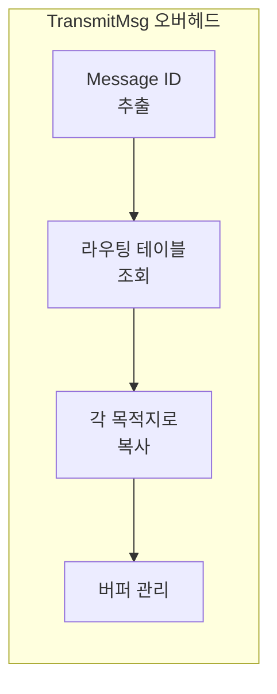
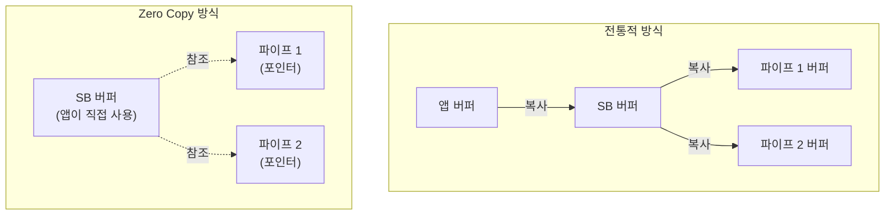
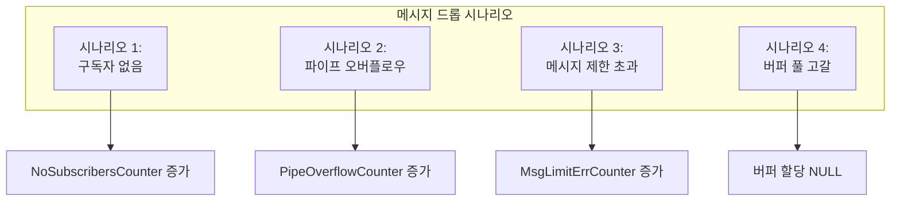
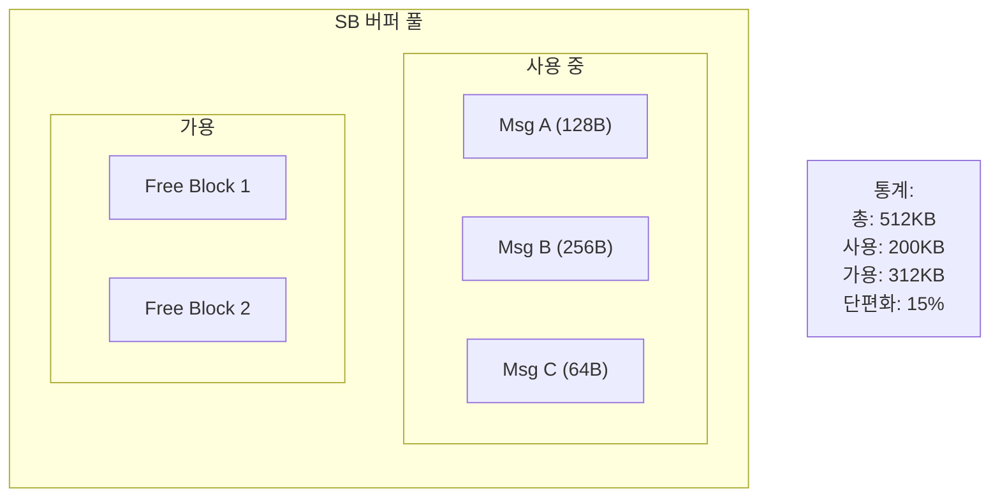

# Phase 2 SB-09: SB 성능과 제한사항

## 서론

Software Bus는 cFS의 핵심 통신 인프라로서 높은 성능과 신뢰성을 제공해야 한다. 그러나 모든 시스템과 마찬가지로 SB도 설계상의 제한과 성능 특성을 갖고 있다. 이러한 제한사항을 이해하고 적절히 대응하는 것은 안정적인 비행 소프트웨어 개발에 필수적이다.

본 문서에서는 SB의 구성 제한, 성능 특성, 메시지 드롭 시나리오, 그리고 성능 튜닝 방법을 상세히 살펴본다.

---

## 1. 구성 제한사항

### 1.1 플랫폼 구성 파라미터

SB의 제한은 `platform_cfg.h` 파일에서 정의된다. 이 파라미터들은 컴파일 시점에 결정되며, 시스템의 메모리 사용량과 성능에 직접적인 영향을 미친다.

```c
/* platform_cfg.h - SB 관련 구성 */

/* 최대 Message ID 수 */
#define CFE_PLATFORM_SB_MAX_MSG_IDS             256

/* 최대 파이프 수 */
#define CFE_PLATFORM_SB_MAX_PIPES               64

/* 하나의 Message ID당 최대 구독자(목적지) 수 */
#define CFE_PLATFORM_SB_MAX_DEST_PER_PKT        16

/* 파이프 내 MID당 기본 메시지 제한 */
#define CFE_PLATFORM_SB_DEFAULT_MSG_LIMIT       4

/* 최대 파이프 깊이 */
#define CFE_PLATFORM_SB_MAX_PIPE_DEPTH          256

/* 메시지 버퍼 풀 크기 (바이트) */
#define CFE_PLATFORM_SB_BUF_MEMORY_BYTES        524288  /* 512 KB */
```

### 1.2 제한 초과 시 동작

각 제한에 도달했을 때 SB의 동작을 이해해야 한다.

| 제한 | 초과 시 동작 | 에러 코드 |
|:---|:---|:---|
| MAX_MSG_IDS | 새 MID 구독 실패 | `CFE_SB_MAX_MSGS_MET` |
| MAX_PIPES | 새 파이프 생성 실패 | `CFE_SB_MAX_PIPES_MET` |
| MAX_DEST_PER_PKT | 해당 MID에 새 구독 실패 | `CFE_SB_MAX_DESTS_MET` |
| MAX_PIPE_DEPTH | 파이프 생성 실패 | `CFE_SB_PIPE_CR_ERR` |
| BUF_MEMORY | 버퍼 할당 실패 | NULL 반환 |

### 1.3 제한 모니터링

SB HK 텔레메트리를 통해 현재 자원 사용량을 모니터링할 수 있다.

```c
/* SB HK 텔레메트리 관련 필드 */
typedef struct
{
    /* 현재 자원 사용량 */
    uint16 MsgIdInUse;           /* 사용 중인 MsgId 수 */
    uint16 PipesInUse;           /* 사용 중인 파이프 수 */
    uint32 MemPoolBytesInUse;    /* 버퍼 풀 사용량 */
    
    /* 최대값 (워터마크) */
    uint16 PeakMsgIdsInUse;      /* MsgId 최대 사용량 */
    uint16 PeakPipesInUse;       /* 파이프 최대 사용량 */
    uint32 PeakMemPoolBytesInUse;/* 버퍼 풀 최대 사용량 */
    
    /* 에러 카운터 */
    uint32 MsgSendErrorCounter;  /* 송신 에러 */
    uint32 NoSubscribersCounter; /* 구독자 없는 메시지 */
    uint32 MsgLimitErrorCounter; /* 메시지 제한 초과 */
    uint32 PipeOverflowCounter;  /* 파이프 오버플로우 */
    
} CFE_SB_HkTlm_Payload_t;
```

---

## 2. 성능 특성

### 2.1 메시지 전송 오버헤드

메시지 전송 시 발생하는 주요 오버헤드를 이해하는 것이 중요하다.



| 동작 | 예상 오버헤드 | 영향 요소 |
|:---|:---|:---|
| MsgId 추출 | 최소 | 고정 |
| 라우팅 조회 | O(1) ~ O(n) | 해시 테이블 vs 선형 검색 |
| 메시지 복사 | O(msg_size × destinations) | 메시지 크기, 구독자 수 |
| 버퍼 관리 | 변동 | 풀 단편화, 할당 알고리즘 |

### 2.2 Zero Copy의 이점

Zero Copy 메커니즘은 메시지 복사 오버헤드를 크게 줄인다.



```c
/* Zero Copy 사용 시 성능 이점 */

/* 전통적 방식: 2KB 메시지, 5개 구독자 */
/* 복사량: 2KB × 5 = 10KB */

/* Zero Copy 방식: 동일 조건 */
/* 복사량: 0 (포인터만 전달) */
/* 다만 마지막 수신자가 버퍼를 해제할 때까지 메모리 점유 */
```

### 2.3 파이프 깊이와 지연

파이프 깊이는 메시지 처리 지연에 영향을 미친다.

```c
/*
 * 시나리오: 10Hz 데이터 스트림, 파이프 깊이 20
 *
 * 최악의 경우 지연:
 * - 파이프가 가득 차면 새 메시지 도착 시 최대 2초 지연
 * - 지연 = (파이프 깊이 - 1) / 메시지 빈도
 *        = (20 - 1) / 10 = 1.9초
 *
 * 권장: 파이프 깊이를 최소화하여 지연 감소
 * 단, 처리 지터를 흡수할 수 있을 만큼은 유지
 */
```

---

## 3. 메시지 드롭 시나리오

### 3.1 드롭 발생 조건

메시지가 드롭될 수 있는 여러 시나리오가 있다.



### 3.2 시나리오별 상세

**시나리오 1: 구독자 없음**
```c
/* 메시지는 발송되었으나 아무도 구독하지 않음 */
/* SB 통계: NoSubscribersCounter 증가 */
/* 영향: 메시지 손실, 그러나 발송 앱은 성공 반환 받음 */
/* 대응: 구독 상태 확인, 의도적인 경우 무시 */
```

**시나리오 2: 파이프 오버플로우**
```c
/* 파이프 큐가 가득 참 */
/* SB 통계: PipeOverflowCounter 증가 */
/* 영향: 해당 파이프로의 메시지 드롭 */
/* 대응: 파이프 깊이 증가 또는 처리 속도 개선 */
```

**시나리오 3: 메시지 제한 초과**
```c
/* 특정 MID가 파이프 내 메시지 제한 도달 */
/* SB 통계: MsgLimitErrCounter 증가 */
/* 영향: 해당 MID의 새 메시지 드롭 (다른 MID는 영향 없음) */
/* 대응: 메시지 제한 증가 또는 처리 속도 개선 */
```

**시나리오 4: 버퍼 풀 고갈**
```c
/* CFE_SB_AllocateMessageBuffer가 NULL 반환 */
/* SB 통계: MemPool 관련 통계 확인 */
/* 영향: 메시지 생성 자체 실패 */
/* 대응: 버퍼 풀 크기 증가 또는 메시지 누수 확인 */

/* 방어적 코딩 */
MsgPtr = (MyMsg_t *)CFE_SB_AllocateMessageBuffer(sizeof(*MsgPtr));
if (MsgPtr == NULL)
{
    CFE_EVS_SendEvent(BUF_ERR_EID, CFE_EVS_EventType_ERROR,
                      "Buffer allocation failed - pool exhausted?");
    MyData.BufAllocFailures++;
    return;
}
```

### 3.3 드롭 모니터링

```c
/* HK 텔레메트리에 드롭 모니터링 추가 */
typedef struct
{
    /* 앱 수준 드롭 모니터링 */
    uint32 MsgReceived;          /* 수신 메시지 수 */
    uint32 MsgDropped;           /* 드롭 추정 (시퀀스 갭) */
    uint32 BufAllocFailures;     /* 버퍼 할당 실패 */
    
} MY_APP_HkTlm_Payload_t;

/* 시퀀스 갭 감지 */
void MY_APP_CheckSequenceGap(const CFE_MSG_Message_t *MsgPtr)
{
    static uint16 ExpectedSeq = 0;
    uint16 ReceivedSeq;
    
    CFE_MSG_GetSequenceCount(MsgPtr, &ReceivedSeq);
    
    if (ExpectedSeq != 0 && ReceivedSeq != ExpectedSeq)
    {
        /* 시퀀스 갭 감지 - 메시지 드롭 가능성 */
        uint16 Gap = (ReceivedSeq > ExpectedSeq) ?
                     (ReceivedSeq - ExpectedSeq) :
                     (16384 - ExpectedSeq + ReceivedSeq);
        
        MY_APP_Data.MsgDropped += Gap;
        
        CFE_EVS_SendEvent(MY_APP_SEQ_GAP_EID,
                          CFE_EVS_EventType_WARNING,
                          "Sequence gap detected: expected=%u, received=%u",
                          ExpectedSeq, ReceivedSeq);
    }
    
    ExpectedSeq = (ReceivedSeq + 1) & 0x3FFF;  /* 14비트 wrap */
}
```

---

## 4. 성능 튜닝

### 4.1 구성 파라미터 튜닝

```c
/*
 * 미션 분석 기반 파라미터 결정
 *
 * 1. 예상 Message ID 수 산정
 *    - cFE 서비스: ~20 MIDs
 *    - 표준 앱: ~50 MIDs
 *    - 미션 앱: ~100 MIDs
 *    - 마진 20%: 170 × 1.2 = 204
 *    → CFE_PLATFORM_SB_MAX_MSG_IDS = 256
 *
 * 2. 예상 파이프 수 산정
 *    - 앱당 평균 1.5 파이프
 *    - 예상 앱 30개
 *    - 계산: 30 × 1.5 = 45
 *    - 마진: 45 × 1.4 = 63
 *    → CFE_PLATFORM_SB_MAX_PIPES = 64
 *
 * 3. 버퍼 풀 크기 산정
 *    - 동시 활성 메시지 수 추정
 *    - 평균 메시지 크기 × 동시 메시지 수 × 마진
 *    - 예: 200 bytes × 1000 × 2 = 400KB
 *    → CFE_PLATFORM_SB_BUF_MEMORY_BYTES = 524288 (512KB)
 */
```

### 4.2 파이프 최적화

```c
/*
 * 파이프 설계 최적화 가이드
 */

/* Bad: 모든 것을 하나의 큰 파이프로 */
CFE_SB_CreatePipe(&PipeId, 256, "MEGA_PIPE");
/* 문제: 지연 증가, 우선순위 처리 불가 */

/* Good: 용도별 분리 */
CFE_SB_CreatePipe(&CmdPipeId, 8, "CMD_PIPE");     /* 명령용 */
CFE_SB_CreatePipe(&HkPipeId, 4, "HK_PIPE");       /* HK용 */
CFE_SB_CreatePipe(&DataPipeId, 32, "DATA_PIPE"); /* 데이터용 */
/* 장점: 명령 우선 처리, 적절한 버퍼링 */
```

### 4.3 메시지 제한 최적화

```c
/*
 * 메시지 제한 설정 가이드
 */

CFE_SB_Qos_t QoS = {0, 0};

/* 명령: 낮은 제한 */
CFE_SB_SubscribeEx(CMD_MID, CmdPipeId, QoS, 2);
/* 이유: 저빈도, 즉시 처리 예상 */

/* 1Hz HK 요청: 최소 제한 */
CFE_SB_SubscribeEx(SEND_HK_MID, CmdPipeId, QoS, 1);
/* 이유: 최신 요청만 필요 */

/* 고빈도 센서 데이터: 적절한 버퍼 */
CFE_SB_SubscribeEx(SENSOR_MID, DataPipeId, QoS, 
                   SENSOR_RATE_HZ * MAX_PROCESSING_DELAY_SEC);
/* 이유: 처리 지연 동안 손실 방지 */
```

---

## 5. 메모리 관리

### 5.1 버퍼 풀 관리

SB 버퍼 풀은 동적 메시지 버퍼를 위한 메모리 풀이다.



### 5.2 버퍼 누수 방지

```c
/* 버퍼 누수 방지를 위한 규칙 */

/* 규칙 1: 할당한 버퍼는 반드시 처리 */
void SendMsg(void)
{
    MsgPtr = CFE_SB_AllocateMessageBuffer(sizeof(*MsgPtr));
    if (MsgPtr == NULL) return;
    
    /* ... 설정 ... */
    
    if (SomeConditionFailed())
    {
        /* 에러 시 명시적 해제 */
        CFE_SB_ReleaseMessageBuffer((CFE_SB_Buffer_t *)MsgPtr);
        return;
    }
    
    CFE_SB_TransmitMsg(&MsgPtr->Header.Msg, true);
    /* 전송 후에는 SB가 관리 - 해제 불필요 */
}

/* 규칙 2: 정적 버퍼 사용 고려 */
/* 빈번한 송신에는 정적 버퍼가 버퍼 풀 부담 감소 */
static MY_APP_HkTlm_t HkBuffer;

void SendHk_Static(void)
{
    CFE_SB_TimeStampMsg(&HkBuffer.TelemetryHeader.Msg);
    /* ... 페이로드 업데이트 ... */
    CFE_SB_TransmitMsg(&HkBuffer.TelemetryHeader.Msg, false);
    /* IncrementSequence=false: 정적 버퍼이므로 */
}
```

### 5.3 풀 모니터링

```c
/* SB 메모리 풀 상태 확인 */

/* HK 텔레메트리에서 모니터링 */
/*
 * MemPoolBytesInUse: 현재 사용량
 * PeakMemPoolBytesInUse: 최대 사용량 (워터마크)
 *
 * 경고 조건:
 * - PeakMemPoolBytesInUse > 80% of total: 풀 크기 증가 고려
 * - MemPoolBytesInUse 지속 증가: 누수 가능성
 */
```

---

## 6. 동시성 고려사항

### 6.1 스레드 안전성

SB API는 스레드 안전(Thread-safe)하게 설계되어 있다. 여러 태스크에서 동시에 메시지를 송수신해도 내부적으로 적절한 동기화가 이루어진다.

```c
/* 멀티태스크 환경에서 안전한 사용 */

/* 태스크 1 */
void Task1(void)
{
    CFE_SB_TransmitMsg(&Msg1->Header.Msg, true);
    /* SB 내부에서 동기화 */
}

/* 태스크 2 */
void Task2(void)
{
    CFE_SB_TransmitMsg(&Msg2->Header.Msg, true);
    /* 동시 호출 안전 */
}

/* 태스크 3 */
void Task3(void)
{
    CFE_SB_ReceiveBuffer(&BufPtr, PipeId, PEND);
    /* 다른 태스크의 송신과 동시 수행 가능 */
}
```

### 6.2 앱 레벨 동기화

앱 데이터에 대한 동기화는 앱 책임이다.

```c
/* 앱 전역 데이터에 대한 보호가 필요한 경우 */

typedef struct
{
    OS_MutSem_t DataMutex;
    uint32 SharedCounter;
    /* ... */
} MY_APP_Data_t;

void MY_APP_IncrementCounter(void)
{
    OS_MutSemTake(MY_APP_Data.DataMutex, OS_WAIT_FOREVER);
    MY_APP_Data.SharedCounter++;
    OS_MutSemGive(MY_APP_Data.DataMutex);
}

void MY_APP_ProcessMessage(const CFE_SB_Buffer_t *BufPtr)
{
    /* SB에서 메시지 수신은 이미 동기화됨 */
    
    /* 앱 데이터 접근 시 필요하면 보호 */
    OS_MutSemTake(MY_APP_Data.DataMutex, OS_WAIT_FOREVER);
    UpdateData(BufPtr);
    OS_MutSemGive(MY_APP_Data.DataMutex);
}
```

---

## 7. 진단 및 디버깅

### 7.1 SB 통계 명령

```c
/* 지상 명령으로 SB 통계 조회 */

/* 1. Routing Info 덤프 */
/* 명령: CFE_SB_WRITE_ROUTING_INFO_CC */
/* 결과: 모든 라우팅 정보 파일 생성 */

/* 2. Pipe Info 덤프 */
/* 명령: CFE_SB_WRITE_PIPE_INFO_CC */
/* 결과: 모든 파이프 정보 파일 생성 */

/* 3. Map Info 덤프 */
/* 명령: CFE_SB_WRITE_MAP_INFO_CC */
/* 결과: MsgId 맵핑 정보 파일 생성 */
```

### 7.2 일반적인 문제 해결

```c
/*
 * 문제: 메시지가 전달되지 않음
 *
 * 점검 순서:
 * 1. 라우팅 정보 덤프 → 구독 확인
 * 2. SB HK 통계 확인 → NoSubscribers, MsgSendError
 * 3. 파이프 정보 확인 → 파이프 오버플로우
 * 4. 발신자 앱 확인 → 실제로 메시지 발송하는지
 */

/*
 * 문제: 파이프 오버플로우
 *
 * 대응:
 * 1. 즉시: 파이프 깊이 증가
 * 2. 중기: 메시지 처리 속도 개선
 * 3. 장기: 아키텍처 검토 (분리 필요?)
 */

/*
 * 문제: 버퍼 풀 고갈
 *
 * 대응:
 * 1. 버퍼 누수 확인 (MemPoolBytesInUse 지속 증가?)
 * 2. 정적 버퍼 사용 확대
 * 3. 버퍼 풀 크기 증가
 * 4. 메시지 크기 최적화
 */
```

### 7.3 성능 측정

```c
/* 메시지 지연 측정 */
typedef struct
{
    CFE_MSG_TelemetryHeader_t TlmHeader;
    uint32 SendTimeSeconds;
    uint32 SendTimeSubseconds;
    /* ... */
} TimestampedMsg_t;

/* 발신 측 */
void SendWithTimestamp(void)
{
    TimestampedMsg_t *MsgPtr;
    CFE_TIME_SysTime_t CurrentTime;
    
    MsgPtr = (TimestampedMsg_t *)CFE_SB_AllocateMessageBuffer(sizeof(*MsgPtr));
    /* ... 초기화 ... */
    
    CurrentTime = CFE_TIME_GetTime();
    MsgPtr->SendTimeSeconds = CurrentTime.Seconds;
    MsgPtr->SendTimeSubseconds = CurrentTime.Subseconds;
    
    CFE_SB_TransmitMsg(&MsgPtr->TlmHeader.Msg, true);
}

/* 수신 측 */
void ReceiveAndMeasure(CFE_SB_Buffer_t *BufPtr)
{
    TimestampedMsg_t *MsgPtr = (TimestampedMsg_t *)BufPtr;
    CFE_TIME_SysTime_t CurrentTime, SendTime, Latency;
    
    CurrentTime = CFE_TIME_GetTime();
    SendTime.Seconds = MsgPtr->SendTimeSeconds;
    SendTime.Subseconds = MsgPtr->SendTimeSubseconds;
    
    Latency = CFE_TIME_Subtract(CurrentTime, SendTime);
    
    /* 지연 시간 기록/보고 */
    UpdateLatencyStats(Latency);
}
```

---

## 8. 모범 사례 요약

### 8.1 설계 시 고려사항

| 항목 | 권장 | 이유 |
|:---|:---|:---|
| 파이프 깊이 | 필요 최소값 × 2 | 여유 있되 과도하지 않게 |
| 메시지 제한 | MID별 특성에 맞게 | 파이프 독점 방지 |
| 버퍼 사용 | 고빈도는 정적, 저빈도는 동적 | 풀 부담 분산 |
| 구독 수 | 필요한 것만 | 라우팅 오버헤드 감소 |
| 모니터링 | HK에 SB 통계 포함 | 문제 조기 발견 |

### 8.2 운영 시 모니터링

```c
/* 정기 모니터링 항목 */

/* 1. SB HK 텔레메트리 기준값 대비 비교 */
/*    - MsgIdInUse 비정상 증가?
 *    - PipeOverflowCounter 증가?
 *    - NoSubscribersCounter 증가?
 *    - MemPoolBytesInUse 지속 증가?
 */

/* 2. 앱별 통계 확인 */
/*    - 시퀀스 갭 발생?
 *    - 예상 메시지 수신률 대비 실제?
 */

/* 3. 성능 트렌드 */
/*    - 피크 사용량 변화 추이
 *    - 에러 카운터 증가 패턴
 */
```

---

## 결론

SB의 성능과 제한사항을 이해하고 적절히 대응하는 것은 안정적인 cFS 애플리케이션 개발의 핵심이다. 구성 파라미터를 미션 요구에 맞게 튜닝하고, 메시지 드롭을 모니터링하며, 성능 최적화를 적용함으로써 신뢰성 높은 비행 소프트웨어를 구현할 수 있다.

핵심 개념을 정리하면 다음과 같다:
- **구성 제한**: MAX_MSG_IDS, MAX_PIPES, MAX_DEST_PER_PKT 등
- **성능 특성**: 복사 오버헤드, Zero Copy 이점, 파이프 지연
- **드롭 시나리오**: 구독자 없음, 오버플로우, 제한 초과
- **튜닝 방법**: 파라미터 조정, 파이프 최적화, 버퍼 관리
- **모니터링**: HK 통계, 시퀀스 갭, 풀 사용량

다음 문서에서는 SB 명령 및 텔레메트리 인터페이스를 살펴볼 것이다.

---

## 참고 문헌

1. NASA, "cFE Application Developer's Guide"
2. NASA, "Software Bus User's Guide"
3. NASA, "cFS Performance Analysis"
4. NASA cFE GitHub, cfe/modules/sb/fsw/src/

---

[이전 문서: Phase 2 SB-08: 구독 및 해제 메커니즘](./Phase2_SB_08_구독_및_해제_메커니즘.md)

[다음 문서: Phase 2 SB-10: SB 명령 및 텔레메트리](./Phase2_SB_10_SB_명령_및_텔레메트리.md)
