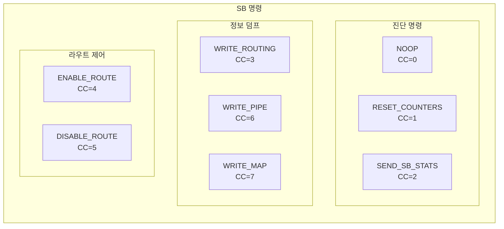
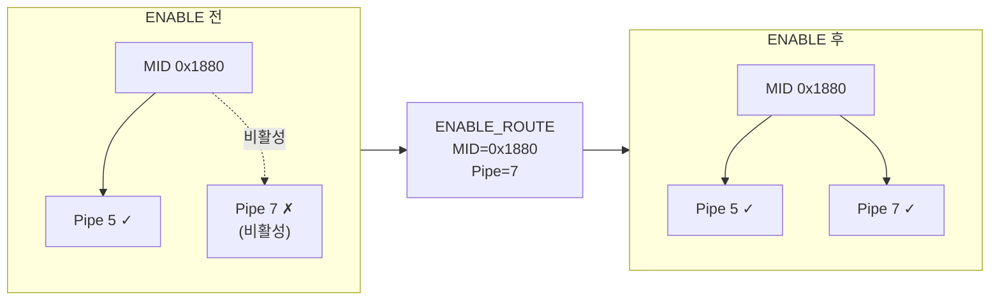
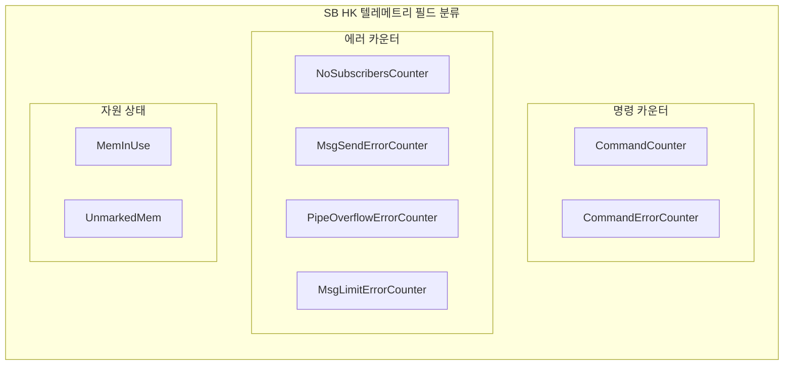
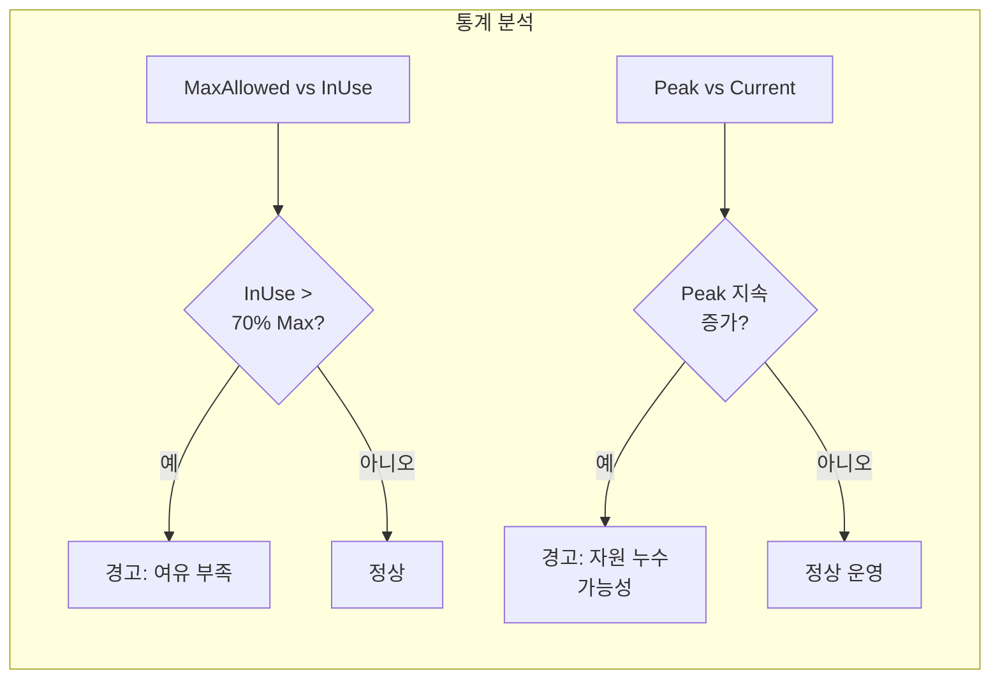
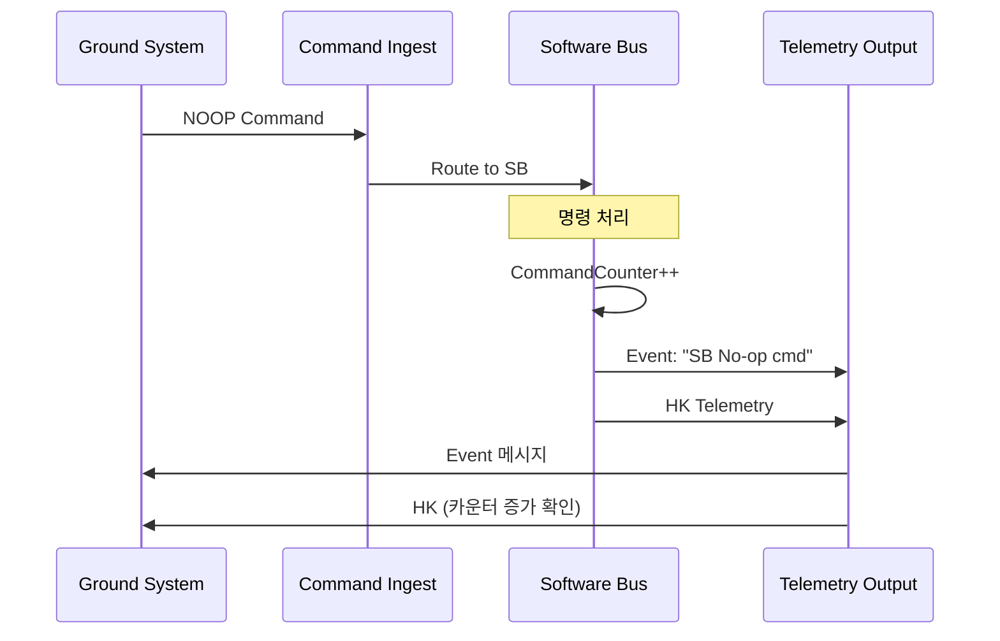

# Phase 2 SB-10: SB 명령 및 텔레메트리

## 서론

Software Bus는 다른 cFE 서비스들과 마찬가지로 지상 시스템과의 인터페이스를 위한 명령과 텔레메트리를 제공한다. 이를 통해 운영자는 SB의 상태를 모니터링하고, 라우팅 정보를 조회하며, 통계를 리셋하는 등의 작업을 수행할 수 있다.

본 문서에서는 SB가 제공하는 명령과 텔레메트리 메시지의 구조와 사용법을 상세히 살펴본다.

---

## 1. SB 명령 개요

### 1.1 명령 Message ID

SB 명령은 `CFE_SB_CMD_MID`를 통해 수신된다. 일반적으로 이 값은 `0x1807` 또는 유사한 값으로 정의된다.

```c
/* cfe_msgids.h */
#define CFE_SB_CMD_MID    0x1807
#define CFE_SB_SEND_HK_MID    0x180B  /* HK 요청 */
```

### 1.2 명령 코드 목록

SB는 다음과 같은 명령 코드(Command Code, CC)를 지원한다.

| CC | 명령명 | 설명 |
|:---:|:---|:---|
| 0 | NOOP | 연결 테스트 (아무 동작 안함) |
| 1 | RESET_COUNTERS | 통계 카운터 리셋 |
| 2 | SEND_SB_STATS | SB 통계 텔레메트리 전송 |
| 3 | WRITE_ROUTING_INFO | 라우팅 정보 파일 생성 |
| 4 | ENABLE_ROUTE | 특정 라우트 활성화 |
| 5 | DISABLE_ROUTE | 특정 라우트 비활성화 |
| 6 | WRITE_PIPE_INFO | 파이프 정보 파일 생성 |
| 7 | WRITE_MAP_INFO | 맵 정보 파일 생성 |



---

## 2. 진단 명령

### 2.1 NOOP 명령 (CC=0)

NOOP(No Operation) 명령은 SB 서비스와의 통신 연결을 테스트하는 데 사용된다. 이 명령을 수신하면 SB는 명령 카운터를 증가시키고 이벤트 메시지를 발생시킨다.

```c
/*
 * NOOP 명령 구조
 * 페이로드 없음
 */
typedef struct
{
    CFE_MSG_CommandHeader_t CommandHeader;
} CFE_SB_NoopCmd_t;

/* 지상에서 전송할 때:
 * - MsgId: CFE_SB_CMD_MID
 * - CC: 0
 * - Size: sizeof(CFE_SB_NoopCmd_t)
 */
```

**예상 응답:**
- 명령 카운터 증가
- 이벤트 메시지: "SB No-op command, Version X.Y.Z"

### 2.2 RESET_COUNTERS 명령 (CC=1)

모든 SB 통계 카운터를 0으로 리셋한다. Housekeeping 텔레메트리에 포함된 카운터들이 리셋된다.

```c
/*
 * RESET_COUNTERS 명령 구조
 * 페이로드 없음
 */
typedef struct
{
    CFE_MSG_CommandHeader_t CommandHeader;
} CFE_SB_ResetCountersCmd_t;

/* 리셋되는 카운터:
 * - CommandCounter
 * - CommandErrorCounter
 * - NoSubscribersCounter
 * - MsgSendErrorCounter
 * - 기타 통계 카운터들
 */
```

**예상 응답:**
- 모든 통계 카운터 = 0
- 이벤트 메시지: "SB Reset Counters command received"

### 2.3 SEND_SB_STATS 명령 (CC=2)

SB 통계 전용 텔레메트리 패킷을 즉시 전송한다. HK보다 더 상세한 통계 정보가 포함된다.

```c
/*
 * SEND_SB_STATS 명령 구조
 * 페이로드 없음
 */
typedef struct
{
    CFE_MSG_CommandHeader_t CommandHeader;
} CFE_SB_SendSbStatsCmd_t;
```

**예상 응답:**
- SB Statistics 텔레메트리 패킷 발송
- 이벤트 메시지: "SB Stats command processed"

---

## 3. 정보 덤프 명령

### 3.1 WRITE_ROUTING_INFO 명령 (CC=3)

현재 라우팅 테이블 정보를 파일로 저장한다. 이 파일은 현재 어떤 Message ID가 어떤 파이프로 라우팅되는지 보여준다.

```c
/*
 * WRITE_ROUTING_INFO 명령 구조
 * 파일 경로 지정 가능
 */
typedef struct
{
    CFE_MSG_CommandHeader_t CommandHeader;
    char Filename[CFE_MISSION_MAX_PATH_LEN];  /* 출력 파일 경로 */
} CFE_SB_WriteRoutingInfoCmd_t;

/* 예시: Filename = "/cf/sb_route.dat" */
```

**출력 파일 형식:**
```
Route Table Entries:
====================

Message ID: 0x1880
  Destinations: 2
    Dest 0: PipeId=5, AppName=MY_APP, PipeName=MY_CMD_PIPE, MsgLimit=4
    Dest 1: PipeId=12, AppName=LOGGER, PipeName=LOG_PIPE, MsgLimit=8

Message ID: 0x0880
  Destinations: 3
    Dest 0: PipeId=7, AppName=TO_LAB, PipeName=TO_OUTPUT, MsgLimit=16
    Dest 1: PipeId=9, AppName=DS_APP, PipeName=DS_PIPE, MsgLimit=32
    Dest 2: PipeId=15, AppName=HK_APP, PipeName=HK_PIPE, MsgLimit=8
```

### 3.2 WRITE_PIPE_INFO 명령 (CC=6)

모든 파이프의 정보를 파일로 저장한다.

```c
/*
 * WRITE_PIPE_INFO 명령 구조
 */
typedef struct
{
    CFE_MSG_CommandHeader_t CommandHeader;
    char Filename[CFE_MISSION_MAX_PATH_LEN];
} CFE_SB_WritePipeInfoCmd_t;
```

**출력 파일 형식:**
```
Pipe Information:
=================

PipeId: 5
  Name: MY_CMD_PIPE
  Owner: MY_APP
  AppId: 10
  Depth: 16
  CurrentDepth: 3
  PeakDepth: 12
  SendErrors: 0

PipeId: 7
  Name: TO_OUTPUT
  Owner: TO_LAB
  AppId: 15
  Depth: 64
  CurrentDepth: 8
  PeakDepth: 45
  SendErrors: 0
```

### 3.3 WRITE_MAP_INFO 명령 (CC=7)

Message ID 매핑 테이블 정보를 파일로 저장한다.

```c
/*
 * WRITE_MAP_INFO 명령 구조
 */
typedef struct
{
    CFE_MSG_CommandHeader_t CommandHeader;
    char Filename[CFE_MISSION_MAX_PATH_LEN];
} CFE_SB_WriteMapInfoCmd_t;
```

---

## 4. 라우트 제어 명령

### 4.1 ENABLE_ROUTE 명령 (CC=4)

특정 Message ID와 파이프 간의 라우트를 활성화한다. 이전에 비활성화된 라우트를 다시 켜는 데 사용된다.

```c
/*
 * ENABLE_ROUTE 명령 구조
 */
typedef struct
{
    CFE_MSG_CommandHeader_t CommandHeader;
    CFE_SB_MsgId_t MsgId;        /* 대상 Message ID */
    CFE_SB_PipeId_t PipeId;      /* 대상 파이프 ID */
    uint8 Spare;                  /* 정렬용 */
} CFE_SB_EnableRouteCmd_t;
```



### 4.2 DISABLE_ROUTE 명령 (CC=5)

특정 라우트를 비활성화한다. 구독은 유지되지만 메시지가 전달되지 않는다.

```c
/*
 * DISABLE_ROUTE 명령 구조
 */
typedef struct
{
    CFE_MSG_CommandHeader_t CommandHeader;
    CFE_SB_MsgId_t MsgId;
    CFE_SB_PipeId_t PipeId;
    uint8 Spare;
} CFE_SB_DisableRouteCmd_t;

/* 사용 시나리오:
 * - 문제가 있는 구독자를 일시적으로 격리
 * - 디버깅 목적으로 특정 라우트 차단
 * - 런타임 데이터 흐름 제어
 */
```

---

## 5. Housekeeping 텔레메트리

### 5.1 HK 텔레메트리 개요

SB는 주기적으로 Housekeeping 텔레메트리를 발송한다. 이 패킷에는 SB의 전반적인 상태와 통계가 포함된다.

```c
/* SB HK 텔레메트리 Message ID */
#define CFE_SB_HK_TLM_MID    0x0807
```

### 5.2 HK 페이로드 구조

```c
typedef struct
{
    /*
     * 명령 카운터
     */
    uint8 CommandCounter;           /* 유효 명령 수신 횟수 */
    uint8 CommandErrorCounter;      /* 무효 명령 수신 횟수 */
    
    /*
     * 에러 카운터
     */
    uint8 NoSubscribersCounter;     /* 구독자 없는 메시지 수 */
    uint8 MsgSendErrorCounter;      /* 메시지 송신 에러 수 */
    uint8 MsgReceiveErrorCounter;   /* 메시지 수신 에러 수 */
    
    uint8 InternalErrorCounter;     /* 내부 에러 수 */
    uint8 CreatePipeErrorCounter;   /* 파이프 생성 에러 수 */
    uint8 SubscribeErrorCounter;    /* 구독 에러 수 */
    
    uint8 Spare;                    /* 정렬용 */
    uint8 DuplicateSubscriptionsCounter;  /* 중복 구독 시도 */
    
    uint8 Spare2[2];                /* 정렬용 */
    
    uint16 PipeOverflowErrorCounter;  /* 파이프 오버플로우 에러 */
    uint16 MsgLimitErrorCounter;      /* 메시지 제한 에러 */
    
    /*
     * 자원 사용 현황
     */
    uint32 MemPoolHandle;             /* 메모리 풀 핸들 */
    
    uint32 MemInUse;                  /* 버퍼 풀 사용량 (바이트) */
    uint32 UnmarkedMem;               /* 미사용 메모리 */
    
} CFE_SB_HkTlm_Payload_t;

typedef struct
{
    CFE_MSG_TelemetryHeader_t TelemetryHeader;
    CFE_SB_HkTlm_Payload_t Payload;
} CFE_SB_HkTlm_t;
```

### 5.3 HK 필드 설명



| 필드 | 모니터링 의미 |
|:---|:---|
| CommandCounter | 정상 명령 처리 확인 |
| CommandErrorCounter | 비정상 명령 빈도 |
| NoSubscribersCounter | 구독 누락 가능성 |
| PipeOverflowErrorCounter | 파이프 깊이 부족 |
| MsgLimitErrorCounter | 메시지 제한 부족 |
| MemInUse | 버퍼 풀 고갈 위험 |

---

## 6. Statistics 텔레메트리

### 6.1 Statistics 패킷 개요

`SEND_SB_STATS` 명령 응답으로 전송되는 상세 통계 패킷이다.

```c
/* SB Statistics 텔레메트리 Message ID */
#define CFE_SB_STATS_TLM_MID    0x080A
```

### 6.2 Statistics 페이로드 구조

```c
typedef struct
{
    /*
     * 시스템 제한 (구성값)
     */
    uint32 MaxMsgIdsAllowed;        /* 최대 허용 MsgId 수 */
    uint32 MaxPipesAllowed;         /* 최대 허용 파이프 수 */
    uint32 MaxMemAllowed;           /* 최대 허용 메모리 */
    uint32 MaxDestPerPktAllowed;    /* MID당 최대 목적지 */
    uint32 MaxSubscriptionsAllowed; /* 최대 구독 수 */
    
    /*
     * 현재 사용량
     */
    uint32 MsgIdsInUse;             /* 사용 중인 MsgId */
    uint32 PipesInUse;              /* 사용 중인 파이프 */
    uint32 MemInUse;                /* 사용 중인 메모리 */
    uint32 SubscriptionsInUse;      /* 현재 구독 수 */
    
    /*
     * 최대 사용량 (워터마크)
     */
    uint32 PeakMsgIdsInUse;         /* MsgId 최대 사용량 */
    uint32 PeakPipesInUse;          /* 파이프 최대 사용량 */
    uint32 PeakMemInUse;            /* 메모리 최대 사용량 */
    uint32 PeakSubscriptionsInUse;  /* 구독 최대 사용량 */
    
} CFE_SB_StatsTlm_Payload_t;

typedef struct
{
    CFE_MSG_TelemetryHeader_t TelemetryHeader;
    CFE_SB_StatsTlm_Payload_t Payload;
} CFE_SB_StatsTlm_t;
```

### 6.3 통계 분석 가이드



---

## 7. 이벤트 메시지

### 7.1 SB 이벤트 분류

SB는 다양한 상황에서 이벤트 메시지를 발생시킨다.

| 카테고리 | 이벤트 예시 | 레벨 |
|:---|:---|:---|
| 초기화 | "SB Initialized" | INFO |
| 명령 | "SB No-op cmd received" | INFO |
| 에러 | "Pipe Overflow, MsgId=0x%04X" | ERROR |
| 디버그 | "Subscription added for MID 0x%04X" | DEBUG |

### 7.2 주요 이벤트 ID

```c
/* SB 이벤트 ID 정의 */
#define CFE_SB_INIT_EID                 1   /* 초기화 완료 */
#define CFE_SB_NOOP_EID                 2   /* NOOP 명령 */
#define CFE_SB_RESET_EID                3   /* 리셋 명령 */
#define CFE_SB_LEN_ERR_EID              10  /* 명령 길이 에러 */
#define CFE_SB_CC_ERR_EID               11  /* 명령 코드 에러 */
#define CFE_SB_PIPE_OFLOW_EID           20  /* 파이프 오버플로우 */
#define CFE_SB_NO_SUBS_EID              21  /* 구독자 없음 */
#define CFE_SB_DEST_BLK_EID             22  /* 목적지 블록 할당 에러 */
#define CFE_SB_CR_PIPE_EID              30  /* 파이프 생성 */
#define CFE_SB_DEL_PIPE_EID             31  /* 파이프 삭제 */
#define CFE_SB_SUB_EID                  40  /* 구독 추가 */
#define CFE_SB_UNSUB_EID                41  /* 구독 해제 */
```

### 7.3 이벤트 필터링

SB 이벤트 중 빈번하게 발생하는 것은 필터링을 고려할 수 있다.

```c
/* EVS 등록 시 필터 설정 예시 */
CFE_EVS_BinFilter_t SB_EventFilters[] = 
{
    /* 파이프 오버플로우는 빈번할 수 있으므로 필터링 */
    {CFE_SB_PIPE_OFLOW_EID, CFE_EVS_FIRST_ONE_STOP},
    
    /* 구독자 없음은 빈번할 수 있으므로 필터링 */
    {CFE_SB_NO_SUBS_EID, CFE_EVS_FIRST_16_STOP},
};
```

---

## 8. 명령 처리 예시

### 8.1 지상 명령 생성

```c
/* 지상 시스템에서 SB 명령 생성 예시 (의사 코드) */

/* NOOP 명령 */
CreateCommand(
    MsgId = CFE_SB_CMD_MID,
    FunctionCode = 0,
    PayloadSize = 0
);

/* 라우팅 정보 덤프 */
WriteRoutingCmd cmd;
cmd.Filename = "/cf/sb_route.dat";
CreateCommand(
    MsgId = CFE_SB_CMD_MID,
    FunctionCode = 3,
    Payload = cmd
);

/* 라우트 비활성화 */
DisableRouteCmd cmd;
cmd.MsgId = 0x1880;
cmd.PipeId = 5;
CreateCommand(
    MsgId = CFE_SB_CMD_MID,
    FunctionCode = 5,
    Payload = cmd
);
```

### 8.2 응답 확인



---

## 9. 운영 시나리오

### 9.1 SB 상태 점검 절차

```
1. SB HK 텔레메트리 확인
   - CommandErrorCounter = 0 확인
   - NoSubscribersCounter 비정상 증가 여부
   - PipeOverflowErrorCounter 확인
   
2. NOOP 명령 전송
   - 응답 이벤트 확인
   - CommandCounter 증가 확인
   
3. 필요시 상세 정보 덤프
   - WRITE_ROUTING_INFO 명령
   - 파일 다운로드 및 분석
```

### 9.2 문제 진단 절차

```
문제: 메시지가 목적지에 도달하지 않음

진단 절차:
1. SB HK에서 NoSubscribersCounter 확인
   → 증가 중이면 구독 누락 문제
   
2. WRITE_ROUTING_INFO 명령으로 라우팅 확인
   → 해당 MID의 목적지 확인
   
3. WRITE_PIPE_INFO로 파이프 상태 확인
   → 오버플로우 여부 확인
   
4. 필요시 DISABLE_ROUTE/ENABLE_ROUTE로
   개별 라우트 테스트
```

### 9.3 메모리 점검

```c
/* 버퍼 풀 상태 모니터링 */

/* SB Stats에서 확인
 *
 * 정상: MemInUse < 80% of MaxMemAllowed
 * 경고: MemInUse > 80% of MaxMemAllowed
 * 위험: MemInUse 지속 증가 (누수 가능성)
 *
 * 대응:
 * 1. 버퍼 풀 크기 증가 (재컴파일)
 * 2. 정적 버퍼 사용 확대
 * 3. 메시지 크기 최적화
 * 4. 버퍼 누수 앱 식별
 */
```

---

## 결론

SB의 명령 및 텔레메트리 인터페이스는 운영자가 Software Bus의 상태를 모니터링하고 제어할 수 있게 해준다. HK 텔레메트리를 통한 지속적인 모니터링과 진단 명령을 통한 상세 정보 확보가 안정적인 운영의 핵심이다.

핵심 개념을 정리하면 다음과 같다:
- **진단 명령**: NOOP, RESET_COUNTERS, SEND_SB_STATS
- **정보 덤프**: WRITE_ROUTING_INFO, WRITE_PIPE_INFO, WRITE_MAP_INFO
- **라우트 제어**: ENABLE_ROUTE, DISABLE_ROUTE
- **HK 텔레메트리**: 카운터, 에러 상태, 자원 사용량
- **Statistics 텔레메트리**: 상세 자원 현황 및 워터마크

다음 문서에서는 SB 주요 API 함수를 종합적으로 분석할 것이다.

---

## 참고 문헌

1. NASA, "cFE Application Developer's Guide"
2. NASA, "Software Bus User's Guide"
3. NASA cFE GitHub, cfe/modules/sb/fsw/src/
4. NASA, "cFE Command and Telemetry Guide"

---

[이전 문서: Phase 2 SB-09: SB 성능과 제한사항](./Phase2_SB_09_SB_성능과_제한사항.md)

[다음 문서: Phase 2 SB-11: SB 주요 API 함수 분석](./Phase2_SB_11_SB_주요_API_함수_분석.md)
