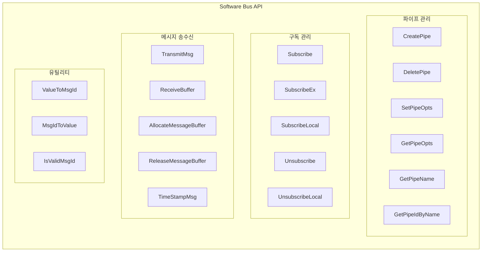
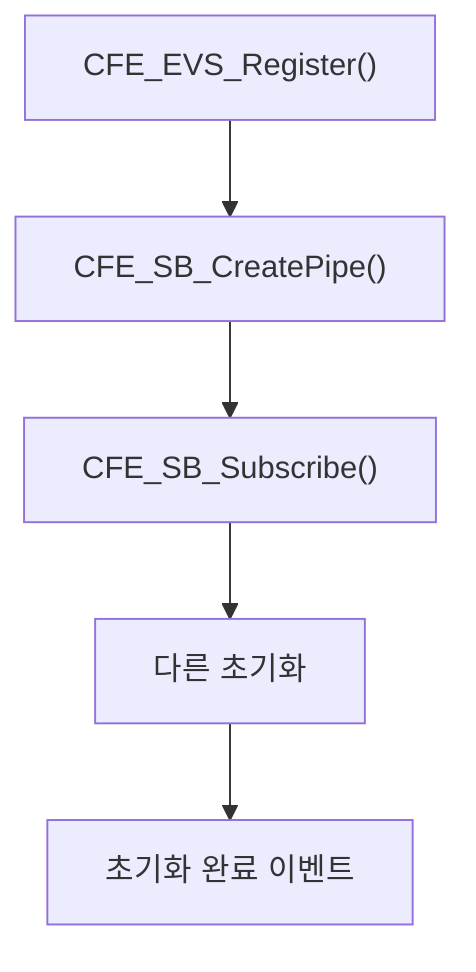
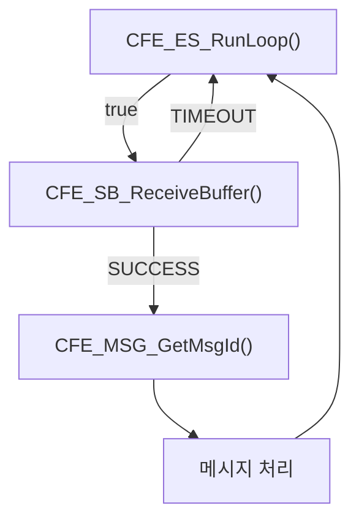
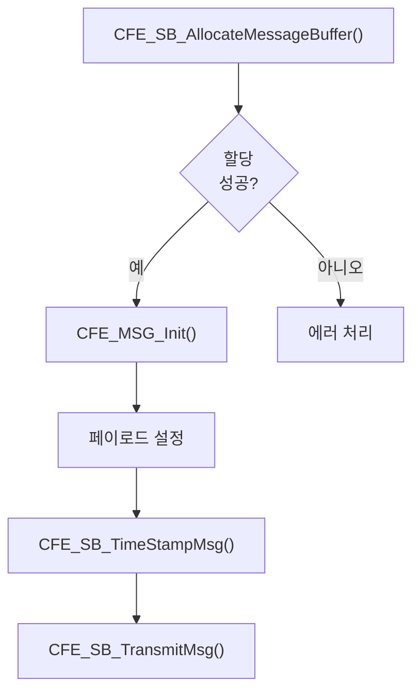

# Phase 2 SB-11: SB 주요 API 함수 분석

## 서론

본 문서는 Software Bus 모듈의 핵심 API 함수들을 종합적으로 정리한 레퍼런스 가이드이다. 앞선 문서들에서 개별적으로 다룬 함수들을 한 곳에 모아 체계적으로 분류하고, 각 함수의 프로토타입, 파라미터, 반환값, 그리고 사용 예시를 제공한다.

이 문서는 cFE 애플리케이션 개발 시 빠른 참조가 가능하도록 구성되어 있다.

---

## 1. API 함수 분류

SB API 함수는 다음과 같이 분류된다.



---

## 2. 파이프 관리 함수

### 2.1 CFE_SB_CreatePipe

```c
/**
 * @brief 새 파이프 생성
 *
 * 지정된 깊이와 이름으로 메시지 수신용 파이프를 생성한다.
 *
 * @param[out] PipeIdPtr  생성된 파이프 ID 반환
 * @param[in]  Depth      파이프 깊이 (최대 메시지 수)
 * @param[in]  PipeName   파이프 이름 (고유해야 함)
 *
 * @return CFE_SUCCESS              성공
 * @return CFE_SB_BAD_ARGUMENT      잘못된 인자
 * @return CFE_SB_MAX_PIPES_MET     최대 파이프 수 도달
 * @return CFE_SB_PIPE_CR_ERR       파이프 생성 실패
 *
 * @note 파이프는 생성한 앱이 소유하며, 앱 종료 시 자동 삭제됨
 */
CFE_Status_t CFE_SB_CreatePipe(CFE_SB_PipeId_t *PipeIdPtr,
                                uint16 Depth,
                                const char *PipeName);

/* 사용 예시 */
CFE_SB_PipeId_t CmdPipeId;
Status = CFE_SB_CreatePipe(&CmdPipeId, 16, "MY_APP_CMD_PIPE");
if (Status != CFE_SUCCESS)
{
    CFE_EVS_SendEvent(ERR_EID, CFE_EVS_EventType_ERROR,
                      "CreatePipe failed: 0x%08X", Status);
}
```

### 2.2 CFE_SB_DeletePipe

```c
/**
 * @brief 파이프 삭제
 *
 * 파이프와 관련된 모든 구독을 삭제한다.
 *
 * @param[in] PipeId  삭제할 파이프 ID
 *
 * @return CFE_SUCCESS              성공
 * @return CFE_SB_BAD_ARGUMENT      잘못된 파이프 ID
 *
 * @note 파이프에 남아있는 메시지도 함께 삭제됨
 */
CFE_Status_t CFE_SB_DeletePipe(CFE_SB_PipeId_t PipeId);

/* 사용 예시 */
void MY_APP_Cleanup(void)
{
    CFE_SB_DeletePipe(MY_APP_Data.CmdPipeId);
    CFE_SB_DeletePipe(MY_APP_Data.DataPipeId);
}
```

### 2.3 CFE_SB_SetPipeOpts / CFE_SB_GetPipeOpts

```c
/**
 * @brief 파이프 옵션 설정/조회
 *
 * @param[in]  PipeId  대상 파이프
 * @param[in]  Opts    설정할 옵션
 * @param[out] OptsPtr 조회된 옵션 반환
 *
 * @return CFE_SUCCESS 성공
 */
CFE_Status_t CFE_SB_SetPipeOpts(CFE_SB_PipeId_t PipeId, uint8 Opts);
CFE_Status_t CFE_SB_GetPipeOpts(CFE_SB_PipeId_t PipeId, uint8 *OptsPtr);

/* 옵션 플래그 */
#define CFE_SB_PIPEOPTS_IGNOREMINE  0x01  /* 자신이 보낸 메시지 무시 */
```

### 2.4 CFE_SB_GetPipeName / CFE_SB_GetPipeIdByName

```c
/**
 * @brief 파이프 ID로 이름 조회
 *
 * @param[out] PipeNameBuf  이름 반환 버퍼
 * @param[in]  PipeNameSize 버퍼 크기
 * @param[in]  PipeId       조회할 파이프 ID
 *
 * @return CFE_SUCCESS 성공
 */
CFE_Status_t CFE_SB_GetPipeName(char *PipeNameBuf,
                                 size_t PipeNameSize,
                                 CFE_SB_PipeId_t PipeId);

/**
 * @brief 이름으로 파이프 ID 조회
 *
 * @param[out] PipeIdPtr  파이프 ID 반환
 * @param[in]  PipeName   조회할 이름
 *
 * @return CFE_SUCCESS 성공
 */
CFE_Status_t CFE_SB_GetPipeIdByName(CFE_SB_PipeId_t *PipeIdPtr,
                                     const char *PipeName);
```

---

## 3. 구독 관리 함수

### 3.1 CFE_SB_Subscribe

```c
/**
 * @brief Message ID 구독
 *
 * 지정된 Message ID를 파이프에 구독한다.
 * 기본 메시지 제한이 적용된다.
 *
 * @param[in] MsgId   구독할 Message ID
 * @param[in] PipeId  수신 파이프 ID
 *
 * @return CFE_SUCCESS              성공
 * @return CFE_SB_BAD_ARGUMENT      잘못된 인자
 * @return CFE_SB_MAX_MSGS_MET      최대 MsgId 수 도달
 * @return CFE_SB_MAX_DESTS_MET     해당 MID 최대 구독자 도달
 * @return CFE_SB_BUF_ALOC_ERR      내부 할당 실패
 */
CFE_Status_t CFE_SB_Subscribe(CFE_SB_MsgId_t MsgId,
                               CFE_SB_PipeId_t PipeId);

/* 사용 예시 */
Status = CFE_SB_Subscribe(CFE_SB_ValueToMsgId(MY_APP_CMD_MID), CmdPipeId);
if (Status != CFE_SUCCESS)
{
    /* 에러 처리 */
}
```

### 3.2 CFE_SB_SubscribeEx

```c
/**
 * @brief 확장 Message ID 구독
 *
 * 메시지 제한과 QoS를 지정하여 구독한다.
 *
 * @param[in] MsgId   구독할 Message ID
 * @param[in] PipeId  수신 파이프 ID
 * @param[in] Quality QoS 설정 (현재 미사용)
 * @param[in] MsgLim  파이프 내 해당 MID 최대 메시지 수
 *
 * @return 반환값은 Subscribe와 동일
 */
CFE_Status_t CFE_SB_SubscribeEx(CFE_SB_MsgId_t MsgId,
                                 CFE_SB_PipeId_t PipeId,
                                 CFE_SB_Qos_t Quality,
                                 uint16 MsgLim);

/* 사용 예시 */
CFE_SB_Qos_t QoS = {0, 0};
Status = CFE_SB_SubscribeEx(CFE_SB_ValueToMsgId(HIGH_RATE_DATA_MID),
                            DataPipeId, QoS, 20);
```

### 3.3 CFE_SB_SubscribeLocal

```c
/**
 * @brief 로컬 전용 구독
 *
 * SBN(Software Bus Network)을 통해 원격으로 공유되지 않는 구독.
 * 단일 프로세서 시스템에서는 Subscribe와 동일.
 *
 * @param[in] MsgId   구독할 Message ID
 * @param[in] PipeId  수신 파이프 ID
 * @param[in] MsgLim  메시지 제한
 *
 * @return 반환값은 Subscribe와 동일
 */
CFE_Status_t CFE_SB_SubscribeLocal(CFE_SB_MsgId_t MsgId,
                                    CFE_SB_PipeId_t PipeId,
                                    uint16 MsgLim);
```

### 3.4 CFE_SB_Unsubscribe / CFE_SB_UnsubscribeLocal

```c
/**
 * @brief Message ID 구독 해제
 *
 * @param[in] MsgId   구독 해제할 Message ID
 * @param[in] PipeId  해당 파이프 ID
 *
 * @return CFE_SUCCESS          성공
 * @return CFE_SB_NO_SUBSCRIBERS 해당 구독 없음
 * @return CFE_SB_BAD_ARGUMENT  잘못된 인자
 */
CFE_Status_t CFE_SB_Unsubscribe(CFE_SB_MsgId_t MsgId,
                                 CFE_SB_PipeId_t PipeId);

CFE_Status_t CFE_SB_UnsubscribeLocal(CFE_SB_MsgId_t MsgId,
                                      CFE_SB_PipeId_t PipeId);

/* 사용 예시 */
CFE_SB_Unsubscribe(CFE_SB_ValueToMsgId(OPTIONAL_DATA_MID), DataPipeId);
```

---

## 4. 메시지 송수신 함수

### 4.1 CFE_SB_TransmitMsg

```c
/**
 * @brief 메시지 발송
 *
 * 메시지를 Software Bus에 발행한다.
 * SB는 해당 MsgId를 구독한 모든 파이프에 메시지를 전달한다.
 *
 * @param[in] MsgPtr             발송할 메시지
 * @param[in] IncrementSequence  시퀀스 카운터 자동 증가 여부
 *
 * @return CFE_SUCCESS          성공
 * @return CFE_SB_BAD_ARGUMENT  잘못된 인자
 *
 * @note Zero Copy 버퍼 사용 시, 전송 후 버퍼 소유권이 SB로 이전됨
 */
CFE_Status_t CFE_SB_TransmitMsg(const CFE_MSG_Message_t *MsgPtr,
                                 bool IncrementSequence);

/* 사용 예시 - Zero Copy */
MsgPtr = (MyMsg_t *)CFE_SB_AllocateMessageBuffer(sizeof(*MsgPtr));
CFE_MSG_Init(&MsgPtr->Header.Msg, MsgId, sizeof(*MsgPtr));
/* 페이로드 설정 */
CFE_SB_TransmitMsg(&MsgPtr->Header.Msg, true);
/* 이후 MsgPtr 사용 금지 */

/* 사용 예시 - 정적 버퍼 */
static MyMsg_t StaticMsg;
CFE_MSG_Init(&StaticMsg.Header.Msg, MsgId, sizeof(StaticMsg));
/* 페이로드 설정 */
CFE_SB_TransmitMsg(&StaticMsg.Header.Msg, true);
/* 버퍼 계속 사용 가능 */
```

### 4.2 CFE_SB_ReceiveBuffer

```c
/**
 * @brief 파이프에서 메시지 수신
 *
 * @param[out] BufPtr    수신된 메시지 버퍼 포인터
 * @param[in]  PipeId    수신 파이프 ID
 * @param[in]  TimeOut   대기 시간
 *                       CFE_SB_PEND_FOREVER: 무한 대기
 *                       CFE_SB_POLL: 즉시 반환
 *                       양수: 밀리초 대기
 *
 * @return CFE_SUCCESS          메시지 수신
 * @return CFE_SB_TIME_OUT      시간 초과
 * @return CFE_SB_NO_MESSAGE    메시지 없음 (POLL)
 * @return CFE_SB_PIPE_RD_ERR   파이프 읽기 에러
 * @return CFE_SB_BAD_ARGUMENT  잘못된 인자
 */
CFE_Status_t CFE_SB_ReceiveBuffer(CFE_SB_Buffer_t **BufPtr,
                                   CFE_SB_PipeId_t PipeId,
                                   int32 TimeOut);

/* 사용 예시 - 무한 대기 */
CFE_SB_Buffer_t *BufPtr;
Status = CFE_SB_ReceiveBuffer(&BufPtr, CmdPipeId, CFE_SB_PEND_FOREVER);
if (Status == CFE_SUCCESS)
{
    ProcessMessage(BufPtr);
}

/* 사용 예시 - 폴링 */
while ((Status = CFE_SB_ReceiveBuffer(&BufPtr, PipeId, CFE_SB_POLL)) 
       == CFE_SUCCESS)
{
    ProcessMessage(BufPtr);
}

/* 사용 예시 - 타임아웃 */
Status = CFE_SB_ReceiveBuffer(&BufPtr, PipeId, 100);  /* 100ms */
if (Status == CFE_SB_TIME_OUT)
{
    PeriodicTask();
}
```

### 4.3 CFE_SB_AllocateMessageBuffer

```c
/**
 * @brief 메시지 버퍼 할당
 *
 * SB 버퍼 풀에서 Zero Copy용 버퍼를 할당한다.
 *
 * @param[in] MsgSize  필요한 버퍼 크기 (바이트)
 *
 * @return 할당된 버퍼 포인터
 * @return NULL 할당 실패 (풀 고갈)
 *
 * @note 할당된 버퍼는 TransmitMsg 또는 ReleaseMessageBuffer로 처리해야 함
 */
CFE_SB_Buffer_t *CFE_SB_AllocateMessageBuffer(size_t MsgSize);

/* 사용 예시 */
MyMsg_t *MsgPtr = (MyMsg_t *)CFE_SB_AllocateMessageBuffer(sizeof(*MsgPtr));
if (MsgPtr == NULL)
{
    /* 버퍼 할당 실패 처리 */
    CFE_EVS_SendEvent(ERR_EID, CFE_EVS_EventType_ERROR,
                      "Buffer allocation failed");
    return;
}
```

### 4.4 CFE_SB_ReleaseMessageBuffer

```c
/**
 * @brief 메시지 버퍼 해제
 *
 * AllocateMessageBuffer로 할당한 버퍼를 풀에 반환한다.
 * TransmitMsg를 호출하지 않는 경우에만 사용.
 *
 * @param[in] BufPtr  해제할 버퍼 포인터
 *
 * @return CFE_SUCCESS          성공
 * @return CFE_SB_BUFFER_INVALID 잘못된 버퍼
 */
CFE_Status_t CFE_SB_ReleaseMessageBuffer(CFE_SB_Buffer_t *BufPtr);

/* 사용 예시 */
MsgPtr = (MyMsg_t *)CFE_SB_AllocateMessageBuffer(sizeof(*MsgPtr));
if (MsgPtr != NULL)
{
    if (ErrorCondition())
    {
        /* 전송하지 않고 해제 */
        CFE_SB_ReleaseMessageBuffer((CFE_SB_Buffer_t *)MsgPtr);
        return;
    }
    CFE_SB_TransmitMsg(&MsgPtr->Header.Msg, true);
}
```

### 4.5 CFE_SB_TimeStampMsg

```c
/**
 * @brief 메시지에 현재 시간 기록
 *
 * 현재 우주선 시간을 조회하여 메시지 헤더에 설정한다.
 *
 * @param[in,out] MsgPtr  타임스탬프를 설정할 메시지
 */
void CFE_SB_TimeStampMsg(CFE_MSG_Message_t *MsgPtr);

/* 사용 예시 */
CFE_MSG_Init(&TlmMsg.Header.Msg, MsgId, sizeof(TlmMsg));
/* 페이로드 설정 */
CFE_SB_TimeStampMsg(&TlmMsg.Header.Msg);
CFE_SB_TransmitMsg(&TlmMsg.Header.Msg, true);
```

---

## 5. 유틸리티 함수

### 5.1 Message ID 변환 함수

```c
/**
 * @brief 숫자 값을 MsgId로 변환
 *
 * @param[in] MsgIdValue  숫자 값
 * @return CFE_SB_MsgId_t 타입의 Message ID
 */
static inline CFE_SB_MsgId_t CFE_SB_ValueToMsgId(CFE_SB_MsgId_Atom_t MsgIdValue);

/**
 * @brief MsgId를 숫자 값으로 변환
 *
 * @param[in] MsgId  Message ID
 * @return 숫자 값
 */
static inline CFE_SB_MsgId_Atom_t CFE_SB_MsgIdToValue(CFE_SB_MsgId_t MsgId);

/**
 * @brief MsgId 유효성 검사
 *
 * @param[in] MsgId  검사할 Message ID
 * @return true 유효함
 * @return false 유효하지 않음
 */
bool CFE_SB_IsValidMsgId(CFE_SB_MsgId_t MsgId);

/* 사용 예시 */
#define MY_APP_CMD_MID  0x1880

CFE_SB_MsgId_t MsgId = CFE_SB_ValueToMsgId(MY_APP_CMD_MID);
CFE_SB_Subscribe(MsgId, PipeId);

/* 수신 메시지 확인 */
CFE_MSG_GetMsgId(&BufPtr->Msg, &RcvdMsgId);
if (CFE_SB_MsgIdToValue(RcvdMsgId) == MY_APP_CMD_MID)
{
    ProcessCommand(BufPtr);
}
```

### 5.2 Message ID 비교

```c
/**
 * @brief 두 MsgId 비교
 *
 * @param[in] MsgId1 첫 번째 Message ID
 * @param[in] MsgId2 두 번째 Message ID
 * @return true 같음
 * @return false 다름
 */
static inline bool CFE_SB_MsgId_Equal(CFE_SB_MsgId_t MsgId1,
                                       CFE_SB_MsgId_t MsgId2);

/* 사용 예시 */
CFE_SB_MsgId_t ExpectedMid = CFE_SB_ValueToMsgId(MY_APP_CMD_MID);
CFE_SB_MsgId_t ReceivedMid;
CFE_MSG_GetMsgId(&BufPtr->Msg, &ReceivedMid);

if (CFE_SB_MsgId_Equal(ExpectedMid, ReceivedMid))
{
    /* 매치 */
}
```

---

## 6. API 요약표

### 6.1 파이프 관리

| 함수 | 설명 | 핵심 파라미터 |
|:---|:---|:---|
| `CreatePipe` | 파이프 생성 | Depth, Name |
| `DeletePipe` | 파이프 삭제 | PipeId |
| `SetPipeOpts` | 옵션 설정 | PipeId, Opts |
| `GetPipeOpts` | 옵션 조회 | PipeId |
| `GetPipeName` | 이름 조회 | PipeId |
| `GetPipeIdByName` | ID 조회 | Name |

### 6.2 구독 관리

| 함수 | 설명 | 핵심 파라미터 |
|:---|:---|:---|
| `Subscribe` | 기본 구독 | MsgId, PipeId |
| `SubscribeEx` | 확장 구독 | MsgId, PipeId, MsgLim |
| `SubscribeLocal` | 로컬 구독 | MsgId, PipeId, MsgLim |
| `Unsubscribe` | 구독 해제 | MsgId, PipeId |
| `UnsubscribeLocal` | 로컬 해제 | MsgId, PipeId |

### 6.3 메시지 송수신

| 함수 | 설명 | 핵심 파라미터 |
|:---|:---|:---|
| `TransmitMsg` | 메시지 발송 | MsgPtr, IncrSeq |
| `ReceiveBuffer` | 메시지 수신 | BufPtr, PipeId, TimeOut |
| `AllocateMessageBuffer` | 버퍼 할당 | Size |
| `ReleaseMessageBuffer` | 버퍼 해제 | BufPtr |
| `TimeStampMsg` | 타임스탬프 | MsgPtr |

### 6.4 유틸리티

| 함수 | 설명 |
|:---|:---|
| `ValueToMsgId` | 값 → MsgId 변환 |
| `MsgIdToValue` | MsgId → 값 변환 |
| `IsValidMsgId` | MsgId 유효성 검사 |
| `MsgId_Equal` | MsgId 비교 |

---

## 7. 함수 호출 순서

### 7.1 애플리케이션 초기화



### 7.2 메시지 수신 루프



### 7.3 메시지 발송



---

## 8. 에러 코드 요약

| 에러 코드 | 값 | 의미 |
|:---|:---:|:---|
| `CFE_SUCCESS` | 0 | 성공 |
| `CFE_SB_BAD_ARGUMENT` | -1 | 잘못된 인자 |
| `CFE_SB_MAX_PIPES_MET` | -2 | 최대 파이프 수 도달 |
| `CFE_SB_MAX_MSGS_MET` | -3 | 최대 MsgId 수 도달 |
| `CFE_SB_MAX_DESTS_MET` | -4 | 최대 구독자 수 도달 |
| `CFE_SB_NO_SUBSCRIBERS` | -5 | 구독자 없음 |
| `CFE_SB_PIPE_CR_ERR` | -6 | 파이프 생성 에러 |
| `CFE_SB_PIPE_RD_ERR` | -7 | 파이프 읽기 에러 |
| `CFE_SB_TIME_OUT` | -8 | 시간 초과 |
| `CFE_SB_NO_MESSAGE` | -9 | 메시지 없음 (POLL) |
| `CFE_SB_BUF_ALOC_ERR` | -10 | 버퍼 할당 에러 |
| `CFE_SB_BUFFER_INVALID` | -11 | 잘못된 버퍼 |

---

## 결론

본 문서는 Software Bus의 주요 API 함수들을 체계적으로 정리하였다. 이 레퍼런스를 통해 cFE 애플리케이션 개발 시 SB 함수를 효과적으로 활용할 수 있다.

핵심 사항을 정리하면 다음과 같다:
- **파이프 관리**: CreatePipe, DeletePipe로 파이프 생명주기 관리
- **구독 관리**: Subscribe/Unsubscribe로 메시지 라우팅 설정
- **메시지 송수신**: TransmitMsg/ReceiveBuffer가 핵심 통신 함수
- **버퍼 관리**: AllocateMessageBuffer/ReleaseMessageBuffer로 Zero Copy 지원
- **유틸리티**: ValueToMsgId 등으로 Message ID 조작

이로써 Software Bus 모듈 시리즈(SB-01 ~ SB-11)가 완료되었다. 다음은 Event Services(EVS) 모듈을 다룰 것이다.

---

## 참고 문헌

1. NASA, "cFE Application Developer's Guide"
2. NASA, "Software Bus API Reference"
3. NASA cFE GitHub, cfe/modules/sb/fsw/inc/cfe_sb.h
4. NASA, "cFE Header Files Documentation"

---

[이전 문서: Phase 2 SB-10: SB 명령 및 텔레메트리](./Phase2_SB_10_SB_명령_및_텔레메트리.md)

[다음 문서: Phase 2 EVS-01: EVS 모듈 개요 및 역할](./Phase2_EVS_01_EVS_모듈_개요.md)
