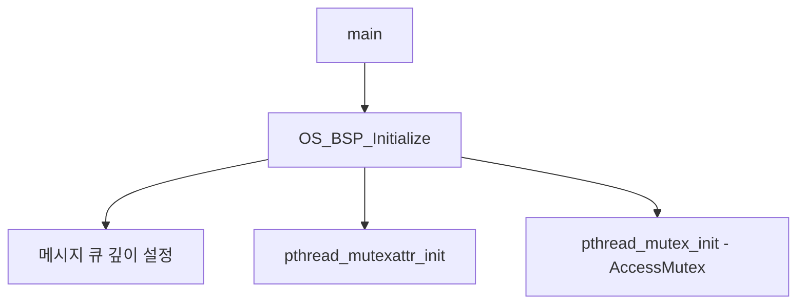
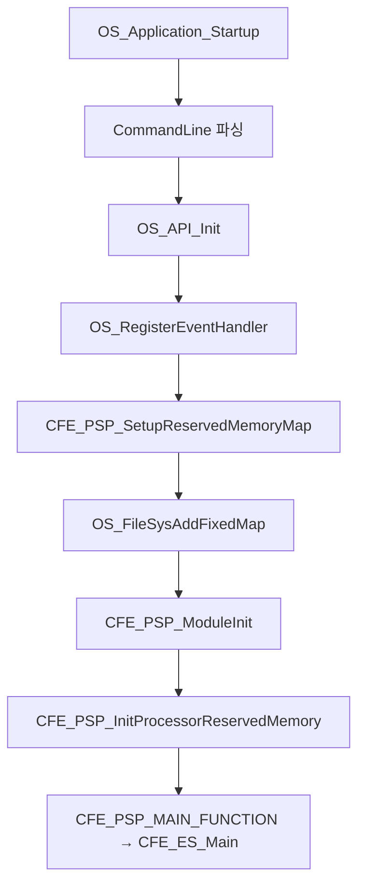
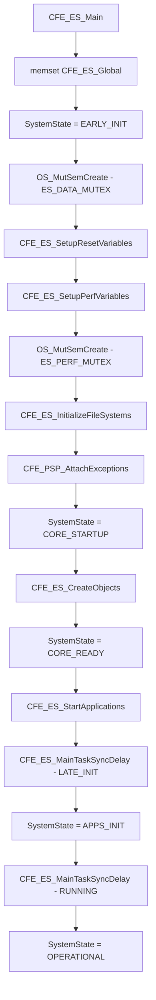
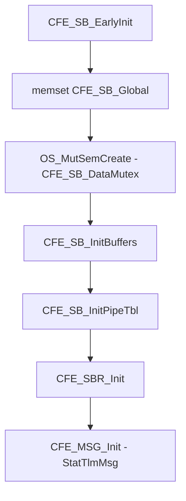
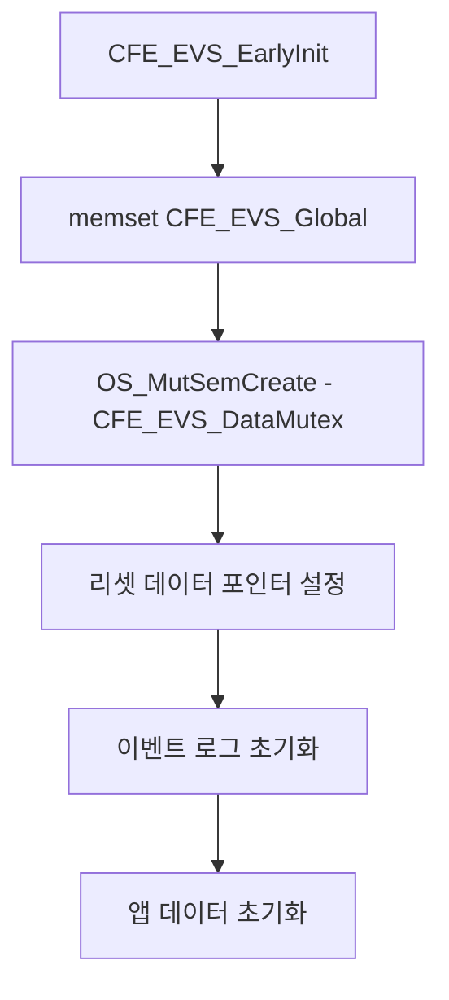
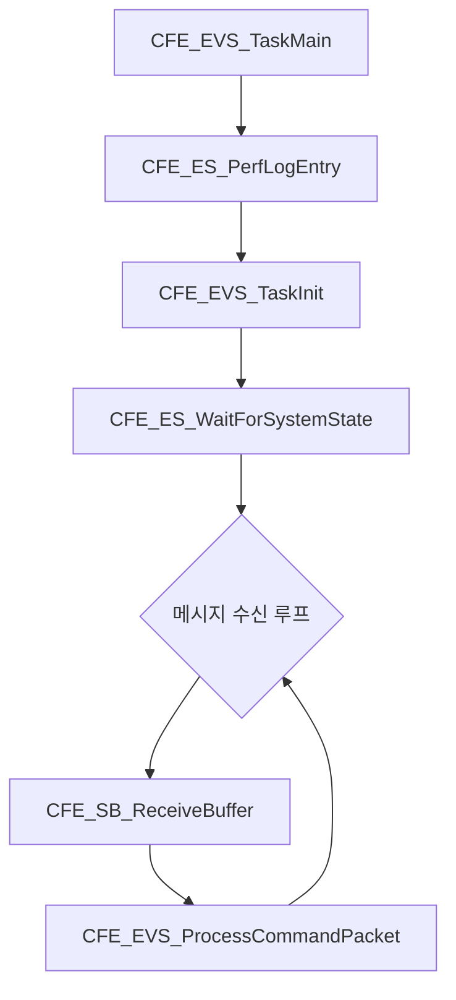
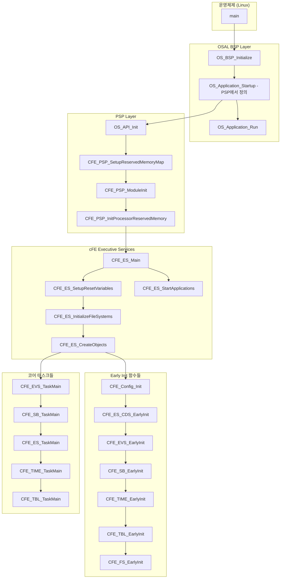

# cFS 부팅 시퀀스 상세 분석

cFS(core Flight System)의 부팅 시퀀스를 함수 호출 단위로 정리한 문서입니다.

---

## 1. 시스템 진입점 (Entry Point)

### 1.1 main() - OSAL BSP 진입점
| 항목 | 내용 |
|------|------|
| **파일명** | [bsp_start.c](./osal/src/bsp/generic-linux/src/bsp_start.c) |
| **함수명** | `main()` |
| **라인** | 196-248 |
| **호출자** | OS (운영체제) |

```c
int main(int argc, char *argv[])
{
    memset(&OS_BSP_Global, 0, sizeof(OS_BSP_Global));
    OS_BSP_Global.ArgC = argc;
    OS_BSP_Global.ArgV = argv;
    
    OS_BSP_Initialize();           // BSP 초기화
    OS_Application_Startup();      // PSP/cFE 시작
    OS_Application_Run();          // 메인 루프
    
    return OS_BSP_GetReturnStatus();
}
```

---

## 2. BSP 초기화 단계

### 2.1 OS_BSP_Initialize()
| 항목 | 내용 |
|------|------|
| **파일명** | [bsp_start.c](./osal/src/bsp/generic-linux/src/bsp_start.c) |
| **함수명** | `OS_BSP_Initialize()` |
| **라인** | 48-96 |
| **호출자** | `main()` |



---

## 3. PSP 시작 단계

### 3.1 OS_Application_Startup() - PSP 진입점
| 항목 | 내용 |
|------|------|
| **파일명** | [cfe_psp_start.c](./psp/fsw/pc-linux/src/cfe_psp_start.c) |
| **함수명** | `OS_Application_Startup()` |
| **라인** | 222-448 |
| **호출자** | `main()` |



#### 3.1.1 호출되는 함수들 상세

| 순서 | 함수명 | 파일 | 라인 | 설명 |
|:---:|--------|------|:----:|------|
| 1 | `OS_API_Init()` | `osal/src/os/shared/src/osapi-init.c` | - | OSAL API 초기화 |
| 2 | `OS_RegisterEventHandler()` | OSAL | - | 이벤트 핸들러 등록 |
| 3 | `CFE_PSP_SetupReservedMemoryMap()` | [cfe_psp_memory.c](./psp/fsw/pc-linux/src/cfe_psp_memory.c) | - | 예약 메모리 맵 설정 |
| 4 | `OS_FileSysAddFixedMap()` | OSAL | - | /cf 가상 FS 매핑 |
| 5 | `CFE_PSP_ModuleInit()` | [cfe_psp_module.c](./psp/fsw/shared/src/cfe_psp_module.c) | - | PSP 모듈 초기화 |
| 6 | `CFE_PSP_InitProcessorReservedMemory()` | [cfe_psp_memory.c](./psp/fsw/pc-linux/src/cfe_psp_memory.c) | - | 프로세서 예약 메모리 초기화 |
| 7 | `CFE_ES_Main()` | [cfe_es_start.c](./cfe/modules/es/fsw/src/cfe_es_start.c) | 72 | **cFE 메인 진입점** |

---

## 4. cFE 메인 시작 (CFE_ES_Main)

### 4.1 CFE_ES_Main()
| 항목 | 내용 |
|------|------|
| **파일명** | [cfe_es_start.c](./cfe/modules/es/fsw/src/cfe_es_start.c) |
| **함수명** | `CFE_ES_Main()` |
| **라인** | 72-233 |
| **호출자** | `OS_Application_Startup()` (via CFE_PSP_MAIN_FUNCTION 매크로) |



#### 4.1.1 CFE_ES_Main에서 호출되는 함수들

| 순서 | 함수명 | 파일 | 라인 | 설명 |
|:---:|--------|------|:----:|------|
| 1 | `OS_MutSemCreate()` | OSAL | - | ES 데이터 뮤텍스 생성 |
| 2 | `CFE_ES_SetupResetVariables()` | [cfe_es_start.c](./cfe/modules/es/fsw/src/cfe_es_start.c) | 243-459 | 리셋 변수 설정 |
| 3 | `CFE_ES_SetupPerfVariables()` | [cfe_es_perf.c](./cfe/modules/es/fsw/src/cfe_es_perf.c) | - | 성능 모니터링 변수 설정 |
| 4 | `CFE_ES_InitializeFileSystems()` | [cfe_es_start.c](./cfe/modules/es/fsw/src/cfe_es_start.c) | 467-699 | RAM 디스크 초기화/마운트 |
| 5 | `CFE_PSP_AttachExceptions()` | PSP | - | 예외 핸들러 설치 |
| 6 | `CFE_ES_CreateObjects()` | [cfe_es_start.c](./cfe/modules/es/fsw/src/cfe_es_start.c) | 707-871 | **코어 객체 생성** |
| 7 | `CFE_ES_StartApplications()` | [cfe_es_apps.c](./cfe/modules/es/fsw/src/cfe_es_apps.c) | - | 애플리케이션 시작 |

---

## 5. 코어 객체 생성 (CFE_ES_CreateObjects)

### 5.1 CFE_ES_ObjectTable 정의
| 항목 | 내용 |
|------|------|
| **파일명** | [cfe_es_objtab.c](./cfe/modules/es/fsw/src/cfe_es_objtab.c) |
| **배열명** | `CFE_ES_ObjectTable[]` |
| **라인** | 53-136 |

`CFE_ES_CreateObjects()` 함수는 `CFE_ES_ObjectTable` 배열을 순회하며 아래 순서로 실행합니다:

### 5.2 Early Init 함수 호출 순서 (FUNCTION_CALL 타입)

| 순서 | 함수명 | 파일 | 라인 | 설명 |
|:---:|--------|------|:----:|------|
| 1 | `CFE_Config_Init()` | [cfe_config_init.c](./cfe/modules/config/fsw/src/cfe_config_init.c) | - | 설정 레지스트리 초기화 |
| 2 | `CFE_ES_CDS_EarlyInit()` | [cfe_es_cds.c](./cfe/modules/es/fsw/src/cfe_es_cds.c) | - | CDS(Critical Data Store) 초기화 |
| 3 | `CFE_EVS_EarlyInit()` | [cfe_evs_task.c](./cfe/modules/evs/fsw/src/cfe_evs_task.c) | **54-161** | EVS 조기 초기화 |
| 4 | `CFE_SB_EarlyInit()` | [cfe_sb_init.c](./cfe/modules/sb/fsw/src/cfe_sb_init.c) | **55-92** | SB 조기 초기화 |
| 5 | `CFE_TIME_EarlyInit()` | [cfe_time_init.c](./cfe/modules/time/fsw/src/cfe_time_init.c) | - | TIME 조기 초기화 |
| 6 | `CFE_TBL_EarlyInit()` | [cfe_tbl_init.c](./cfe/modules/tbl/fsw/src/cfe_tbl_init.c) | - | TBL 조기 초기화 |
| 7 | `CFE_FS_EarlyInit()` | [cfe_fs_init.c](./cfe/modules/fs/fsw/src/cfe_fs_init.c) | - | FS 조기 초기화 |

### 5.3 코어 태스크 생성 순서 (CORE_TASK 타입)

| 순서 | 태스크명 | 메인 함수 | 파일 | 라인 | 우선순위 |
|:---:|----------|-----------|------|:----:|:--------:|
| 1 | `CFE_EVS` | `CFE_EVS_TaskMain()` | [cfe_evs_task.c](./cfe/modules/evs/fsw/src/cfe_evs_task.c) | **188-246** | CFE_PLATFORM_EVS_START_TASK_PRIORITY |
| 2 | `CFE_SB` | `CFE_SB_TaskMain()` | [cfe_sb_task.c](./cfe/modules/sb/fsw/src/cfe_sb_task.c) | - | CFE_PLATFORM_SB_START_TASK_PRIORITY |
| 3 | `CFE_ES` | `CFE_ES_TaskMain()` | [cfe_es_task.c](./cfe/modules/es/fsw/src/cfe_es_task.c) | - | CFE_PLATFORM_ES_START_TASK_PRIORITY |
| 4 | `CFE_TIME` | `CFE_TIME_TaskMain()` | [cfe_time_task.c](./cfe/modules/time/fsw/src/cfe_time_task.c) | - | CFE_PLATFORM_TIME_START_TASK_PRIORITY |
| 5 | `CFE_TBL` | `CFE_TBL_TaskMain()` | [cfe_tbl_task.c](./cfe/modules/tbl/fsw/src/cfe_tbl_task.c) | - | CFE_PLATFORM_TBL_START_TASK_PRIORITY |

---

## 6. 각 EarlyInit 함수의 내부 호출 구조

### 6.1 CFE_SB_EarlyInit() 상세
| 항목 | 내용 |
|------|------|
| **파일명** | [cfe_sb_init.c](./cfe/modules/sb/fsw/src/cfe_sb_init.c) |
| **함수명** | `CFE_SB_EarlyInit()` |
| **라인** | 55-92 |



| 순서 | 호출 함수 | 파일 | 라인 | 설명 |
|:---:|-----------|------|:----:|------|
| 1 | `OS_MutSemCreate()` | OSAL | - | SB 데이터 뮤텍스 생성 |
| 2 | `CFE_SB_InitBuffers()` | [cfe_sb_init.c](./cfe/modules/sb/fsw/src/cfe_sb_init.c) | 100-123 | 메모리 풀 생성 |
| 3 | `CFE_SB_InitPipeTbl()` | [cfe_sb_init.c](./cfe/modules/sb/fsw/src/cfe_sb_init.c) | 131-134 | 파이프 테이블 초기화 |
| 4 | `CFE_SBR_Init()` | [cfe_sbr_init.c](./cfe/modules/sbr/fsw/src/cfe_sbr_init.c) | - | 라우팅 모듈 초기화 |

### 6.2 CFE_EVS_EarlyInit() 상세
| 항목 | 내용 |
|------|------|
| **파일명** | [cfe_evs_task.c](./cfe/modules/evs/fsw/src/cfe_evs_task.c) |
| **함수명** | `CFE_EVS_EarlyInit()` |
| **라인** | 54-161 |



---

## 7. 코어 태스크 메인 함수 구조

### 7.1 CFE_EVS_TaskMain() 상세
| 항목 | 내용 |
|------|------|
| **파일명** | [cfe_evs_task.c](./cfe/modules/evs/fsw/src/cfe_evs_task.c) |
| **함수명** | `CFE_EVS_TaskMain()` |
| **라인** | 188-246 |



| 순서 | 호출 함수 | 파일 | 라인 | 설명 |
|:---:|-----------|------|:----:|------|
| 1 | `CFE_ES_PerfLogEntry()` | ES API | - | 성능 로그 시작 |
| 2 | `CFE_EVS_TaskInit()` | [cfe_evs_task.c](./cfe/modules/evs/fsw/src/cfe_evs_task.c) | 248-306 | EVS 태스크 초기화 |
| 3 | `CFE_ES_WaitForSystemState()` | ES API | - | 시스템 상태 동기화 |
| 4 | `CFE_SB_ReceiveBuffer()` | SB API | - | 메시지 수신 대기 |

---

## 8. 전체 부팅 시퀀스 요약 다이어그램



---

## 9. 핵심 파일 위치 요약

| 레이어 | 파일 | 핵심 함수 |
|--------|------|-----------|
| **OSAL BSP** | [bsp_start.c](./osal/src/bsp/generic-linux/src/bsp_start.c) | `main()`, `OS_BSP_Initialize()` |
| **PSP** | [cfe_psp_start.c](./psp/fsw/pc-linux/src/cfe_psp_start.c) | `OS_Application_Startup()` |
| **PSP** | [cfe_psp_memory.c](./psp/fsw/pc-linux/src/cfe_psp_memory.c) | `CFE_PSP_SetupReservedMemoryMap()`, `CFE_PSP_InitProcessorReservedMemory()` |
| **cFE ES** | [cfe_es_start.c](./cfe/modules/es/fsw/src/cfe_es_start.c) | `CFE_ES_Main()`, `CFE_ES_CreateObjects()` |
| **cFE ES** | [cfe_es_objtab.c](./cfe/modules/es/fsw/src/cfe_es_objtab.c) | `CFE_ES_ObjectTable[]` (초기화 순서 정의) |
| **cFE EVS** | [cfe_evs_task.c](./cfe/modules/evs/fsw/src/cfe_evs_task.c) | `CFE_EVS_EarlyInit()`, `CFE_EVS_TaskMain()` |
| **cFE SB** | [cfe_sb_init.c](./cfe/modules/sb/fsw/src/cfe_sb_init.c) | `CFE_SB_EarlyInit()` |
| **cFE TIME** | [cfe_time_init.c](./cfe/modules/time/fsw/src/cfe_time_init.c) | `CFE_TIME_EarlyInit()` |
| **cFE TBL** | [cfe_tbl_init.c](./cfe/modules/tbl/fsw/src/cfe_tbl_init.c) | `CFE_TBL_EarlyInit()` |

---

## 10. 시스템 상태 전이 (SystemState Transitions)

| 상태 | 값 | 시점 | 설명 |
|------|:--:|------|------|
| `EARLY_INIT` | 1 | `CFE_ES_Main()` 시작 직후 | 초기 단일 스레드 초기화 |
| `CORE_STARTUP` | 2 | EarlyInit 완료 후 | 코어 태스크 생성 시작 (멀티스레드) |
| `CORE_READY` | 3 | 코어 태스크 생성 완료 | 애플리케이션 로딩 시작 |
| `APPS_INIT` | 4 | 앱들이 LATE_INIT 도달 | 앱 초기화 진행 중 |
| `OPERATIONAL` | 5 | 모든 앱 RUNNING 상태 | 시스템 정상 운영 상태 |
